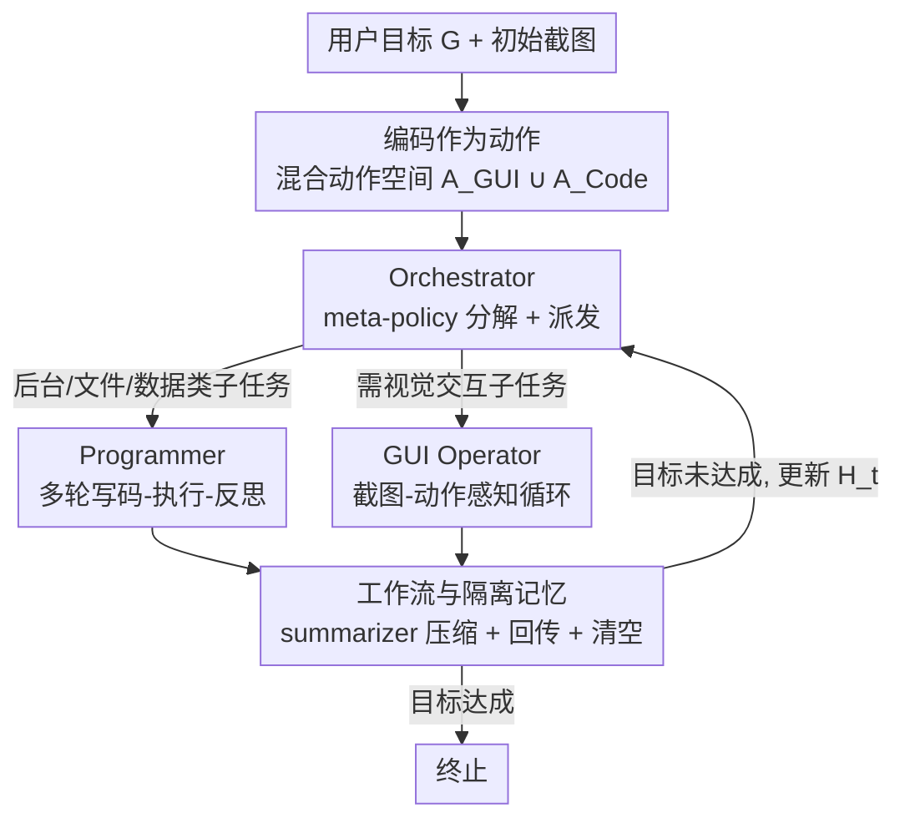

# CoAct-1: Computer-using Multi-agent System with Coding Actions

**会议**: ICLR2026  
**OpenReview**: [https://openreview.net/forum?id=l1MQVgIKEU](https://openreview.net/forum?id=l1MQVgIKEU)  
**代码**: https://github.com/SalesforceAIResearch/CoAct-1  
**领域**: Agent / 计算机操作智能体 / 多智能体系统  
**关键词**: 计算机操作智能体, 编码动作, 多智能体, GUI 操作, 任务分解

## 一句话总结
CoAct-1 把"写代码并执行"当成 GUI 点击之外的一等动作，用 Orchestrator 把每个子任务动态派给会写 Python/Bash 的 Programmer 或会点屏幕的 GUI Operator，从而在 OSWorld 上把成功率推到 60.8%（WindowsAgentArena 52.5%）的同时，把平均步数压到 10.15 步。

## 研究背景与动机

**领域现状**：当前的计算机操作智能体（computer-using agents）几乎都走纯 GUI 路线——靠视觉-语言-动作模型看屏幕截图、然后输出鼠标点击和键盘输入，一步步把任务做完。为了应付复杂任务，主流做法（如 GTA-1、Agent S2.5）会再叠一个高层 planner，把用户目标拆成一串子目标。

**现有痛点**：问题在于即便有了 planner，**所有动作仍然只能通过 GUI 来落地**。很多操作天然不适合点屏幕：在多 sheet 表格里定位某张表、按复杂条件过滤、复制结果再存成 CSV；或者在嵌套目录里找出所有图片、批量缩放、再打包成压缩档。这些任务用"点击+拖拽"来做既冗长又脆弱——视觉 grounding 容易把相似图标/菜单项认错，而且长序列里每一步的出错概率会累积，一次误点就能让整个任务崩盘。

**核心矛盾**：高层规划能改善"做什么"的分解，但**改变不了"怎么做"的执行底座**。只要执行层被限制在低级 GUI 动作空间 $A_{\text{GUI}}$ 里，规划不确定性、视觉感知误差、以及高层规划与低层动作生成之间的衔接问题就一直存在。

**本文目标**：给智能体一个更灵活、更可靠的动作空间，让那些本可以"一行脚本搞定"的后台操作不必再走一长串易错的点击。

**切入角度**：人用电脑时其实是混合的——能用命令行/脚本就用脚本，必须靠界面才点界面。作者据此提出把**编码（coding）作为一种系统交互动作**，与 GUI 动作并存，由一个高层控制器按子任务性质动态选择模态。

**核心 idea**：用"编码动作"替换掉一部分冗余且脆弱的 GUI 动作——构造混合动作空间 $A = A_{\text{GUI}} \cup A_{\text{Code}}$，并用一个三智能体系统（Orchestrator / Programmer / GUI Operator）把"何时写代码、何时点屏幕"的决策做成分层策略。

## 方法详解

### 整体框架

CoAct-1 要解决的是"纯 GUI 执行又慢又脆"的问题，它的整体思路是：把计算机操作建模成一个分层决策过程，顶层有一个 **Orchestrator** 充当 meta-policy $\pi_{\text{orch}}$，它不直接碰操作系统，只负责把用户目标 $G$ 拆成子任务、并为每个子任务挑一个执行者；底层有两个专职执行者——**Programmer**（实现 $\pi_{\text{Code}}$，写 Python/Bash 脚本跟 OS 后端交互）和 **GUI Operator**（实现 $\pi_{\text{GUI}}$，看截图、点界面）。每个子任务完成后，执行者的详细交互历史先经一个 summarizer 压缩成简报，连同最新截图回传给 Orchestrator，更新它的高层历史 $H_t$，再决定下一步或终止。

形式化地，在每个时刻 $t$，智能体观测到环境 $o_t \in O$（主要是截图），按策略 $\pi(a_t \mid H_t, G)$ 取动作 $a_t \in A$，其中 $H_t = (o_1, a_1, \dots, o_{t-1}, a_{t-1}, o_t)$ 是历史上下文。关键改动是动作空间从 $A_{\text{GUI}}$ 扩成 $A_{\text{GUI}} \cup A_{\text{Code}}$——$A_{\text{Code}}$ 里的一个动作就是一段直接操作 OS 后端的脚本，能把文件处理、数据处理这类操作压缩成单步、健壮的执行。

### 关键设计

**1. 编码作为一等动作：用混合动作空间替换脆弱的 GUI 序列**

这一设计直接针对"纯 GUI 执行冗长易错"的痛点。作者没有像很多工作那样为每个 app/网站去总结 API 或 SDK，而是让智能体在强语言模型引导下做**自由形式的编码**——动作空间被显式拆成 $A = A_{\text{GUI}} \cup A_{\text{Code}}$：$a_t \in A_{\text{GUI}}$ 是鼠标点击、键盘输入这类对图形界面的直接操作；$a_t \in A_{\text{Code}}$ 则是一段 Python 或 Bash 脚本，直接跟操作系统后端交互。对于"在嵌套目录找图片再批量处理打包"这种任务，一段脚本就能把原本几十步点击+拖拽压成一步可靠执行，从根上绕开了视觉 grounding 歧义和长序列误差累积。它的有效性在消融里很直白：纯 Programmer 解出的任务平均只需 **1.14 步**，体现了编码动作的"直接性"。

**2. 三智能体分层策略：Orchestrator 派发，Programmer 与 GUI Operator 各管一类动作**

混合动作空间带来一个新问题——谁来决定某个子任务该写代码还是该点屏幕？这一设计用三个分工明确的智能体把分层策略 $\pi$ 具象化。**Orchestrator** 是高层 meta-policy $\pi_{\text{Orch}}$，基于完整观测历史 $H_t$ 和目标 $G$ 做任务分解与动态规划，它不直接操作 OS，只挑选 $\pi_{\text{Code}}$ 或 $\pi_{\text{GUI}}$ 来执行当前子任务，子任务结束后接收执行简报和新截图 $o_{t+1}$，若判定 $G$ 已达成就输出终止信号。**Programmer** 实现 $\pi_{\text{Code}}$，拿到子任务后与一个代码解释器进入多轮对话：生成脚本→解释器执行→拿执行结果反思并改代码，直到子任务解决；Orchestrator 会把从 $H_t$ 推断出的文件路径、窗口信息等上下文喂给它，给代码生成"打地基"。**GUI Operator** 是一个视觉-语言-动作模型，实现 $\pi_{\text{GUI}}$，在"感知-动作"循环里每步以当前截图+子任务指令为输入，生成单个 GUI 动作，执行后拿新截图作反馈，循环到子任务完成。两个执行者动作粒度截然不同——Programmer 一次给一整段脚本，GUI Operator 一次给一个原子点击——但都被同一个 Orchestrator 统一调度。

**3. 工作流与隔离记忆：summarizer 做 handoff，执行者记忆用完即清**

多智能体协同最怕的是上下文互相污染、Orchestrator 被无关细节淹没。这一设计用一套结构化工作流和分层隔离记忆来管信息流。工作流上，Orchestrator 派发子任务后，被选中的执行者在自己的多轮循环里产生一大段详细对话历史；完成时，这段历史交给一个**专门的 summarizer 模型**压成简报（抓住关键动作和最终结果），简报+最终截图一起回传给 Orchestrator，作为对其高层历史 $H_t$ 的一次"浓缩更新"。记忆上采用**分层 + 隔离**结构：Orchestrator 维护长期主记忆（即 $H_t$，由初始目标 $G$ 加上历次执行简报与截图构成）；Programmer 和 GUI Operator 各自维护只在本子任务期间有效的短期工作记忆（多轮交互的 instance 历史）。两者的对话历史**互不共享**，且执行者一旦汇报完毕，其工作记忆立即清空——这个 reset 机制让执行者每次都能专注于新子任务、不被此前无关交互干扰。

### 一个完整示例

以一个跨应用任务"把多 sheet 表格里某张表按条件过滤后导出为 CSV，再确认结果"为例：Orchestrator 先把目标拆成"定位并处理表格数据"和"在界面确认/打开结果"两个子任务。第一个子任务涉及表格过滤与文件导出，Orchestrator 判定走编码模态，派给 Programmer；Programmer 与代码解释器多轮交互——先写脚本读取并过滤数据、导出 CSV，拿到执行结果（如报错路径不对）后反思改代码，直至导出成功，整个过程可能只折算成极少几步（消融中纯编码任务均值 1.14 步）。完成后 summarizer 把这段对话压成"已在路径 X 导出过滤后的 CSV"的简报回传。第二个子任务需要视觉交互，Orchestrator 改派 GUI Operator，后者在截图-动作循环里点击打开文件确认。Orchestrator 收到两份简报后判定目标达成，输出终止。整条轨迹里编码动作替掉了原本一长串易错的表格点击，这正是 CoAct-1 平均 10.15 步就能完成 OSWorld 任务的来源。

### 损失函数 / 训练策略

CoAct-1 是**无需训练的系统级编排框架**，不引入新的可学习参数，而是直接调用现成强模型并用 AG2（AutoGen）搭多智能体。具体配置：Orchestrator 用 OpenAI o3、Programmer 用 o4-mini、GUI Operator 用 OpenAI computer-use-preview，summarizer 用 o4-mini。预算上限设为 Programmer 最大轮数 $I=20$、GUI Operator 最大步数 $K=25$、Orchestrator 最大轮数 $J=15$，因此系统交互步数上界 $20\times25\times15$ 量级被框定为 375（实测均在 150 步前 early stop）。

## 实验关键数据

### 主实验

在 OSWorld（369 个任务）和 WindowsAgentArena（154 个任务）两个真实操作系统测试床上评测，评测器是基于 134 个原子级、可执行判定子句组合出的布尔表达式（rule-based）。

| 基准 | 指标 | CoAct-1 | 之前最强基线 | 提升 |
|--------|------|------|----------|------|
| OSWorld（150 步） | 总成功率 | **60.76%** | Agent S2.5 w/ o3 55.98% | +4.78 |
| OSWorld（100 步） | 总成功率 | 59.93% | Agent S2.5 55.98% | 已超所有基线终值 |
| WindowsAgentArena（100 步） | 总成功率 | **52.5%** | Agent S2 29.8% | +22.7 |
| OSWorld | 平均步数/解出任务 | 10.15 | GTA-1 15.22 / UI-TARS 14.90 | 更省 |

分领域看，编码优势在"程序化控制最有用"的类别最突出：OSWorld 上 Office 64.80%、OS 75.00%、Multiple Apps 47.87%；WindowsAgentArena 上 Windows System 83.3%、Windows Utils 77.7%。

### 消融实验

| 配置 | OSWorld Avg. | 平均步数 | 说明 |
|------|---------|------|------|
| 仅 Programmer（纯编码） | 35.73 | 1.14 | 极快但很多任务必须靠 GUI，封顶低 |
| 仅 GUI Operator（纯 GUI） | 50.68 | 11.20 | 覆盖任务类型更广但慢 |
| Full CoAct-1（混合） | **60.76** | 10.15 | 两种模态协同，又准又省 |

骨干模型敏感性（Table 3）：GUI Operator 固定为 CUA 4o 时，Orchestrator/Programmer 都用 o4-mini 仅 43.43%；都换 o3 升到 58.72%；最优是异构配置 o3（Orchestrator）+ o4-mini（Programmer）达 60.76%。

### 关键发现
- **混合 > 任一单模态**：纯编码 35.73%、纯 GUI 50.68%，合起来 60.76%，证明两类动作互补而非替代——编码管后台文件/数据，GUI 管视觉导航。
- **效率与成功率耦合**：CUA 4o 虽更省步（6.14）但成功率只有 31.40%，CoAct-1 的低步数是"有效的省"而非"放弃任务"。
- **步数越多越易失败**：Figure 3d 显示失败率与所需动作数正相关，用脚本压缩步数本身就降低了出错机会。
- **高层角色最吃模型能力**：把强模型分配给 Orchestrator 和 Programmer（高推理需求角色）收益最大，验证了模块化设计下"按需分配算力"的价值。

## 亮点与洞察
- **把"写代码"提升为一等动作**：这是最核心的"啊哈"点——不去为每个 app 总结 API，而是让智能体自由写 Python/Bash 直接操作 OS 后端，一段脚本替掉一长串点击，从根上规避视觉 grounding 歧义和长程误差累积。
- **动态模态选择而非二选一站队**：Orchestrator 按子任务性质在编码/GUI 间动态派发，既拿到脚本的精确高效，又保留视觉交互的通用性，这套"何时写码、何时点屏"的调度思路可迁移到任何带异构工具的 agent 系统。
- **summarizer + 记忆清零的工程巧思**：用专门模型把执行者的长对话压成简报回传、执行者记忆用完即清，干净地解决了多智能体上下文污染问题，是可直接复用的多智能体编排 trick。
- **训练无关、即插即用**：纯靠编排现成强模型（o3 / o4-mini / CUA）就刷到 SOTA，说明很多收益来自"动作空间设计"而非"再训一个模型"。

## 局限与展望
- 作者讨论显示系统性能对 Orchestrator/Programmer 的骨干模型能力**高度敏感**——换弱模型（o4-mini）会从 60.76% 掉到 43.43%，说明强依赖顶级闭源推理模型，复现成本和可迁移性受限。
- 框架完全依赖 OpenAI 系列闭源模型（o3 / o4-mini / computer-use-preview），未验证在开源骨干上的表现，泛化性存疑。
- 编码动作直接执行脚本操作 OS 后端，在真实环境里有**安全/误删风险**，论文未深入讨论沙箱与安全约束。
- 评测集中在 OSWorld/WindowsAgentArena 的预设任务，是否能稳定迁移到更开放、更长程的真实工作流仍待观察；纯编码模态封顶仅 35.73%，说明仍有大量任务离不开脆弱的 GUI 交互。

## 相关工作与启发
- **vs 纯 GUI / 端到端原生智能体（UI-TARS、OpenCUA、CUA 4o）**：它们把感知-推理-动作统一进单一模型、动作空间只有 GUI；CoAct-1 显式扩出编码动作并用多智能体分层调度，在 Office/OS/多应用类任务上大幅领先，核心区别是"换了动作空间"而非"换了模型"。
- **vs 模块化 planner-grounder（GTA-1、Agent S2.5、Jedi）**：这类工作通过 test-time scaling、多 grounder（Mixture-of-Grounding）等强化"在哪点、怎么点"，但执行底座仍是 GUI；CoAct-1 跳出"只优化 grounding"，直接让一部分子任务用脚本绕过 GUI，因而在程序化任务上提升最明显。
- **vs 混合 agentic 框架（UFO-2、PyVision、BeyondBrowsing、ALITA）**：它们也在运行时动态组合工具/API，CoAct-1 与之共享"动态构造并调用工具"的理念，但聚焦于"自由编码作为通用系统动作"并与 GUI 模态在多智能体里协同，定位更贴近通用计算机自动化。

## 评分
- 新颖性: ⭐⭐⭐⭐ 把"编码作为一等动作"与 GUI 模态在多智能体里动态融合，思路清晰且切中纯 GUI 痛点，虽非凭空但落地扎实。
- 实验充分度: ⭐⭐⭐⭐⭐ 两大基准 SOTA + 步数预算分解 + 单模态消融 + 骨干敏感性 + 效率分析，证据链完整。
- 写作质量: ⭐⭐⭐⭐ 问题动机和分层设计讲得很顺，公式化清楚；安全性与开源骨干部分着墨偏少。
- 价值: ⭐⭐⭐⭐⭐ 训练无关、即插即用就刷到 SOTA 并显著提效，对计算机操作智能体的动作空间设计有实际启发。

<!-- RELATED:START -->

## 相关论文

- [\[ICLR 2026\] PixelCraft: A Multi-Agent System for High-Fidelity Visual Reasoning on Structured Images](pixelcraft_a_multi-agent_system_for_high-fidelity_visual_reasoning_on_structured.md)
- [\[ICLR 2026\] From What to Why: A Multi-Agent System for Evidence-based Chemical Reaction Condition Reasoning](from_what_to_why_a_multi-agent_system_for_evidence-based_chemical_reaction_condi.md)
- [\[ICLR 2026\] MAC-AMP: A Closed-Loop Multi-Agent Collaboration System for Multi-Objective Antimicrobial Peptide Design](mac-amp_a_closed-loop_multi-agent_collaboration_system_for_multi-objective_antim.md)
- [\[AAAI 2026\] AgentODRL: A Large Language Model-based Multi-agent System for ODRL Generation](../../AAAI2026/multi_agent/agentodrl_a_large_language_model-based_multi-agent_system_fo.md)
- [\[AAAI 2026\] LungNoduleAgent: A Collaborative Multi-Agent System for Precision Diagnosis of Lung Nodules](../../AAAI2026/multi_agent/lungnoduleagent_a_collaborative_multi-agent_system_for_precision_diagnosis_of_lu.md)

<!-- RELATED:END -->
