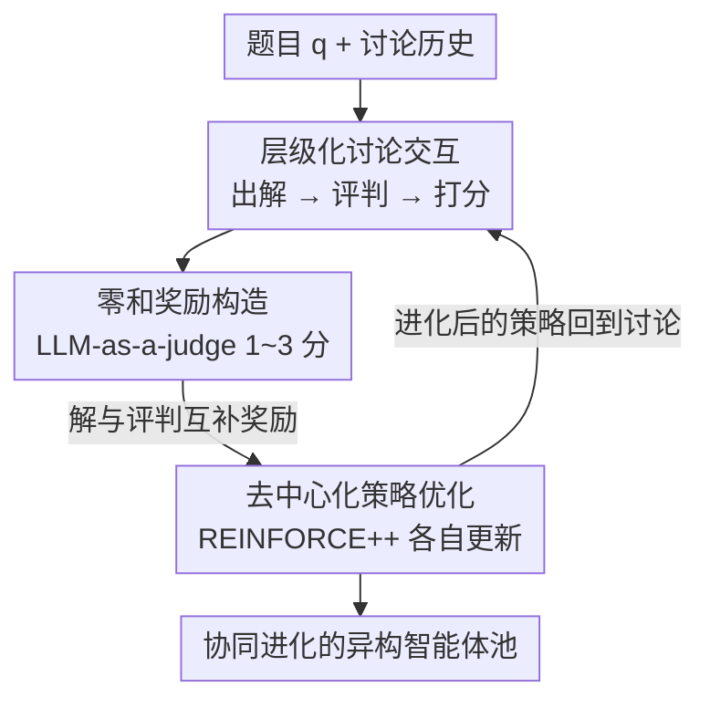

# CoMAS: Co-Evolving Multi-Agent Systems via Interaction Rewards

**会议**: ICLR2026  
**OpenReview**: [https://openreview.net/forum?id=ihwAzktmWc](https://openreview.net/forum?id=ihwAzktmWc)  
**代码**: https://github.com/xxyQwQ/CoMAS  
**领域**: 多智能体 / Agent 自进化 / 强化学习  
**关键词**: 多智能体系统, 自进化, 交互奖励, LLM-as-a-judge, REINFORCE++

## 一句话总结
CoMAS 让多个 LLM 智能体在一个类似论坛的讨论环境里互相出解、互相批判、互相打分，把这些讨论动态用 LLM-as-a-judge 转成内在奖励信号，再用 RL 各自更新策略，从而在完全不依赖外部验证器或奖励模型的情况下实现去中心化、可扩展的协同自进化。

## 研究背景与动机
**领域现状**：让 LLM 智能体在预训练之后还能继续变强（self-evolution）是当前 agent 研究的核心议题。早期做法是 RL-free 的，比如扩充外部知识库、集成多个智能体、优化任务工作流、引入符号学习——这些不动模型参数，能力天花板被底座模型死死卡住。近来研究转向 RL-based 方法：要么依赖**外部奖励**（规则验证器、专用奖励模型），要么从模型自身抽取**内在奖励**（self-certainty、confidence、语义熵、多数投票伪标签）。

**现有痛点**：外部奖励方法要求任务必须可验证、必须有现成的 reward signal，开放式问题就没法用；内在奖励方法虽然摆脱了外部监督，但本质上还是**单模型自奖励**——一个模型对着自己的输出打分，容易陷入强化高置信度预测、回避低概率区域这类自循环，而且和人类智能的进化机制南辕北辙。

**核心矛盾**：人类智能并不是某个完美个体靠内省进化出来的，而是**群体现象**——个体在相互讨论、协作、批评中学习提高，没有一个外部 oracle 去逐条评判每个贡献。现有 RL 自进化方法把"奖励"锁死在单个模型层面，恰恰丢掉了"从同伴交互中学习"这条人类最依赖的进化路径。

**本文目标**：回答一个问题——LLM 智能体能不能像人一样，**纯靠多智能体系统内部的 agent 间交互**实现自进化，完全不用外部奖励信号？这要解决三个子问题：交互怎么组织才能产生有学习价值的信号、怎么从纯讨论里提炼出可信的奖励、怎么把奖励落到每个异构智能体的策略更新上。

**切入角度**：作者借鉴 Reddit / GitHub / Stack Overflow 这类技术社区的讨论形态——有人提方案、有人挑毛病、有人评分。这种"出解—评判—打分"的层级化、去中心化讨论天然蕴含了"谁对谁错"的信号，不需要外部裁判。

**核心 idea**：用 agent 间交互产生的讨论动态当作内在奖励来源（interaction rewards），把解题者和评判者设计成**零和博弈**，再用 RL 让每个 agent 各自吸收交互教训，从而实现去中心化、可异构、可扩展的协同进化。

## 方法详解

### 整体框架
CoMAS 的目标是：给定一池 LLM 智能体，让它们在共享环境里围绕题目反复讨论，把讨论本身变成训练信号，最终每个智能体都通过 RL 变强。整个系统建立在一条"交互式多智能体工作流"上，由三个串行环节构成——**交互（Interaction）**产生对话数据，**奖励构造（Reward Formulation）**从对话历史里抽信号并分配到各个动作，**策略优化（Policy Optimization）**用 RL 算法更新各 agent 权重。

系统维护一个智能体池 $U=\{u_1,\dots,u_l\}$，每个 agent $u_k$ 有自己的策略 $\pi_{\theta_k}$。关键是这里允许**异构**：不同 agent 可以基于不同底座模型，不共享一个 backbone。一次交互被抽象成策略把输入 prompt $p$ 映射到响应 $o=\pi_{\theta_k}(p)$。围绕一道题 $q$，交互沿 $m$ 轮展开：每轮先有人参考讨论历史 $h_q$ 出一个解 $s_i$，再有 $n$ 个评判 $\{e_{i,j}\}$ 去挑这个解的毛病，解和评判被追加进 $h_q$ 供后续轮次使用（历史压缩到最近 $\kappa$ 轮防爆 context）；与此同时每个"解—评判"对 $(s_i,e_{i,j})$ 经过一个打分步得到 $\tau_{i,j}$，专门用来生成奖励。每步由谁发言是从池里**均匀随机**抽 $u_k\sim\text{Uniform}(U)$，既体现机会均等，又让各 agent 拿到的经验量相近、平衡训练负载。

### 关键设计

**1. 层级化讨论交互：把"出解—评判—打分"拆成三种可复用的交互模式**

这一步针对的痛点是：纯让模型自己对自己打分（自奖励）信号太弱、太容易自循环。CoMAS 借社区讨论的形态，定义三种交互模式。**出解（Solution）**：给定题目 $q$ 和讨论历史 $h_q$，agent 产出解 $s_i=u_k(q,h_q)$。**评判（Evaluation）**：给定 $q$、$h_q$ 和某个解 $s_i$，agent 产出批判 $e_{i,j}=u_k(q,h_q,s_i)$——这里**显式提示 agent 去找解里的潜在缺陷而不是附和**，专门用来缓解 LLM 常见的"迎合偏置"（catering bias），并且和后面的零和奖励设计对齐。**打分（Scoring）**：给定 $q$、$s_i$、$e_{i,j}$，agent 按固定格式输出分数 $\tau_{i,j}=u_k(q,s_i,e_{i,j})$；打分是一个**独立于讨论的交互模式**——它只为生成奖励服务，不写进讨论历史，避免分数本身污染后续讨论。三种模式叠起来，一道题 $m$ 轮就产生 $m$ 个解、$m\cdot n$ 个评判、$m\cdot n$ 个打分结果，构成丰富的可训练轨迹。

**2. 零和交互奖励：让解题者和评判者互为对手，从讨论里榨出内在信号**

光有讨论还不够，得把它变成数值奖励。CoMAS 用 LLM-as-a-judge：先把打分结果解析成整数分 $\hat\tau_{i,j}=\text{Extract}(\tau_{i,j})\in\{1,2,3\}$，语义是——3 分表示解正确、评判没帮上忙或评错了；2 分表示解大体正确但有评判指出的小瑕疵；1 分表示解有被评判抓到的致命错误。然后把分数归一化，给解和评判算**互补奖励**：

$$r(s_i)=\frac{\hat\tau_{i,j}-1}{2},\qquad r(e_{i,j})=1-r(s_i)=\frac{3-\hat\tau_{i,j}}{2}$$

这构成解题者与评判者之间的**零和博弈**：解越对，解题者拿得越多、评判者拿得越少；解越错（被评判抓到），评判者就赢。这逼着出解的尽量做对、评判的尽量挑出真问题，而不是互相点赞。此外对打分这个动作单独设格式惩罚——格式正确成功抽取得 0、否则 $r(\tau_{i,j})=-1$：

$$r(\tau_{i,j})=\begin{cases}0,&\tau_{i,j}\in\{1,2,3\}\text{ 正确抽取}\\-1,&\text{否则}\end{cases}$$

给打分者 0 奖励（而非正奖励）是有意为之——既鼓励它遵守格式，又让它保持**中立**，不去操纵分数谋利，从而稳住整个训练。后面的消融正是证明：去掉评判或去掉打分这套对抗设计，要么奖励崩塌、要么出现"全员互相满分"的 reward hacking。

**3. 去中心化策略优化：REINFORCE++ + token 级信用分配，各 agent 独立进化**

有了奖励，怎么更新参数？由于 CoMAS 的特点是**多种交互模式**而非"同一 prompt 多次 rollout"，GRPO 那套依赖组内多 rollout 比较的做法并不天然适配，作者改用 **REINFORCE++**——改动最小、和这套交互框架天然兼容。每个 agent $u_k$ 把自己作为解题者/评判者/打分者参与的交互收进各自的 replay buffer $D_k=\{(p,o,r(o))\}$，**各练各的**（去中心化），异构 agent 也能各自进化，没有共享模型的瓶颈。优势用 token 级信用分配：轨迹奖励 $r(o)$ 减去一项累积 KL 惩罚来约束策略别跑太远，

$$A_t=r(o)-\beta\sum_{\lambda=t}^{|o|}\log\frac{\pi_{\theta_k}(o_\lambda|p,o_{<\lambda})}{\pi_{\text{ref}}(o_\lambda|p,o_{<\lambda})}$$

再在 batch 内对优势做标准化 $\hat A_t=(A_t-\text{Mean})/(\text{Std}+\epsilon)$ 稳定更新，最后用带 importance sampling ratio $\rho_t(\theta_k)=\pi_{\theta_k}/\pi_{\text{old}}$ 的 clip 代理目标（PPO 式）做策略提升，把更新限制在信任域内保证稳定。

### 一个完整示例
以原文图 2 的题目"求 $f(x)=x\ln x$（$x>0$）的最小值"为例走一遍：第一轮 agent A 出解"先求导……"，agent B 评判"漏了验证"，又有 agent 提出换元 $t=\ln x$ 让 $f(t)=te^t$。接着有人给出错误解"$f(x)$ 单调递增，最小值在 $f(0)=0$"，另一 agent 评判"实际上 $x<1/e$ 时 $f'(x)<0$，所以完全错了"。最后打分步对这个错误解判定"声称的单调性不存在，导致错误答案，打 1 分（满分 3）"。于是这个错误解的解题者拿到 $r(s)=(1-1)/2=0.0$，而抓出它毛病的评判者拿到 $r(e)=(3-1)/2=1.0$——奖励正确地流向了"挑出真问题"的一方。整段讨论被压成带奖励的经验，喂回各 agent 的 buffer 做策略更新。

### 损失函数 / 训练策略
基础设施基于 MARTI（一个从 OpenRLHF fork 的多智能体 RL 框架），其"轨迹 rollout—经验制作—agent 训练"三阶段正好对齐 CoMAS 三环节；为公平比较，CoMAS 和所有 baseline 一律用 REINFORCE++ 训练。主实验底座为 Qwen2.5-3B-Instruct（同构设置），agent 数 $l=4$（消融用 $l=2$），交互轮 $m=2l$、$n=1$、horizon $\kappa=2$。训练集 2000 条，跨数学（MATH level 4/5，600）、代码（KodCode 中/难，600）、科学（WebInstruct-verified，800）三域，且与评测基准完全不重叠。

## 实验关键数据

### 主实验
在 7 个基准（GSM8K / MATH-500 / HumanEval / MBPP / SciBench / GPQA / MMLU）、4 种推理 setup（单 agent 的 Vanilla、Consistency；多 agent 的 AutoGen、Debate）下评测，对比 untrained、SRLM、MAPoRL、TTRL。下表取每个 setup 的代表数字（相对 untrained 的绝对增益）：

| Setup | 指标/基准 | Untrained | CoMAS | 最强 baseline |
|-------|-----------|-----------|-------|----------------|
| Vanilla | GSM8K | 84.00 | **85.40 (+1.40)** | MAPoRL 84.80 |
| Vanilla | HumanEval | 68.90 | **70.73 (+1.83)** | MAPoRL 69.51 |
| Consistency | HumanEval | 73.78 | **77.44 (+3.66)** | MAPoRL 75.61 |
| AutoGen | GSM8K | 52.60 | **72.40 (+19.80)** | SRLM 58.00 |
| AutoGen | MMLU | 37.40 | **50.60 (+13.20)** | SRLM 42.40 |
| Debate | HumanEval | 71.34 | **77.44 (+6.10)** | MAPoRL 74.39 |

关键观察：单 agent 下 CoMAS 稳定超越底座、与依赖外部验证器的 MAPoRL 不相上下；**多 agent 下优势拉开**——AutoGen setup 里 TTRL 直接崩盘（GSM8K -11.60、HumanEval -16.46）、MAPoRL 涨跌互现，而 CoMAS 在每个基准都大幅提升。TTRL 虽在 GSM8K(88.20)/MATH-500 上亮眼，却在 HumanEval、GPQA 上翻车，暴露其只擅长数学、对通用任务乏力的局限。CoMAS 全程不用外部奖励却拿到大多数 setting 的 SOTA 或接近 SOTA。

### 消融实验

| 配置 | 现象 | 说明 |
|------|------|------|
| Full CoMAS | 奖励稳在 ~0.5 | 对抗设计维持稳定训练 |
| w/o Evaluation | 奖励从 ~0.8 一路**下滑** | agent 越当越严的裁判，信号失效，性能反低于 untrained |
| w/o Scoring | 奖励**爬向 1.0** | reward hacking：所有 agent 一致给满分，解与评判都拿满 |

去掉评判或打分中任一环，两个变体都掉到 untrained 之下，证明**对抗式零和奖励**是 CoMAS 成功的关键，而非随便什么奖励都行。

### 关键发现
- **可扩展性（数量）**：$l=1,2,4$ 时性能随 agent 数单调上升，在 Consistency / Debate 尤明显——单 agent 甚至小幅掉点（-0.19% / -0.16%），四 agent 转为显著正增益（+2.02% / +1.75%），坐实"多 agent 交互"是收益核心来源。
- **可扩展性（多样性）**：$l=2$ 时一个用 Qwen2.5-3B、一个用 Llama-3.2-3B 的**异构**组合一致优于同构，Vanilla/Consistency/Debate 分别再涨 +2.21% / +2.78% / +2.13%，说明不同底座的知识互补能被 CoMAS 有效利用。
- **训练动态**：各 agent 平均响应长度随训练稳定增长（对应推理能力提升），归一化奖励在中途波动后收敛到各 agent 相近的 ~0.5，印证对抗奖励营造了稳定的训练环境。

## 亮点与洞察
- **把"奖励来源"从单模型搬到群体交互**：这是最核心的"啊哈"——既然内省式自奖励容易自循环，那就用解题者 vs 评判者的零和博弈造出彼此牵制的信号，从根上摆脱外部验证器，同时避开了单模型自奖励的退化。
- **打分给 0 奖励的细节很巧**：让打分者无利可图反而中立，是稳住训练、防止裁判被操纵的关键小设计，值得复用到任何"让 LLM 当裁判又怕它作弊"的场景。
- **去中心化 + 异构天然契合现实**：各 agent 各练各的、可以是不同底座，意味着这套范式能直接搭异构 agent 团队，不像共享模型方案那样有单点瓶颈，迁移到真实多 agent 协作系统很自然。
- **可扩展性结论有指导意义**：性能随 agent 数量和多样性提升，给"加 agent 还是加数据"提供了一个明确方向——多样化的同伴本身就是免费的监督信号。

## 局限与展望
- **底座规模偏小**：主实验只用 Qwen2.5-3B（7B 放附录），更大模型上交互奖励是否还稳、还涨，证据有限。
- **任务局限于可推理的学科题**：作者在伦理声明里也承认，实验严格限定在数学/代码/科学的标准推理任务，没碰真实社会交互；这套"社区讨论"范式搬到开放、真实的协作场景能否成立仍未验证。
- **奖励依赖 LLM-as-a-judge 的打分质量**：1~3 分语义靠模型自己判断，若底座判分能力差，零和奖励可能传错信号；打分格式惩罚只解决格式、不解决判分本身的偏差。
- **轮数/agent 数带来的成本**：交互轮数 $m=2l$ 随 agent 线性增长，训练成本随规模上升（附录有分析），大规模异构 agent 池的开销是落地要面对的。
- **横向比较需谨慎**：不同 setup（Vanilla vs AutoGen 等）任务难度和推理预算不同，增益大小不可直接比大小——AutoGen 基线本身低，所以那里的 +19.80% 不能与 Vanilla 的 +1.40% 等量齐观。

## 相关工作与启发
- **vs 外部奖励 RL 自进化（MAPoRL 等）**：他们靠规则验证器/奖励模型提供监督，CoMAS 从交互内部生成奖励，区别在于完全去外部监督、还能处理不可验证的开放问题；代价是奖励质量受 LLM-as-a-judge 限制。实验里 CoMAS 与依赖验证器的 MAPoRL 单 agent 持平、多 agent 反超。
- **vs 内在奖励 RL 自进化（SRLM / TTRL 等）**：他们用 self-certainty、置信度、语义熵、多数投票伪标签等单模型内部信号，CoMAS 换成多 agent 交互信号，区别在于把"自己评自己"升级成"同伴互评的零和博弈"，从而避开自循环与崩塌——TTRL 在 AutoGen 下崩盘正反衬这点。
- **vs 静态/动态 MAS**：早期 MAS 固定角色与拓扑、近来用图优化做动态结构，但多在提升 MAS 的集体推理，**个体 agent 的进化**少有人碰；CoMAS 正补这块空白——不改拓扑，而是让池中每个 agent 通过交互各自变强。

## 评分
- 新颖性: ⭐⭐⭐⭐⭐ 把自进化的奖励来源从单模型自省搬到多 agent 零和交互，范式层面是新路子
- 实验充分度: ⭐⭐⭐⭐ 7 基准 × 4 setup + 数量/多样性可扩展性 + 失败模式消融都到位，但底座偏小、缺真实场景
- 写作质量: ⭐⭐⭐⭐⭐ 三环节框架清晰、零和奖励推导干净、消融直指失败机理
- 价值: ⭐⭐⭐⭐ 去中心化 + 异构 + 无外部奖励的协同进化范式，对多 agent 系统研究有明确启发

<!-- RELATED:START -->

## 相关论文

- [\[ACL 2026\] LLM-Based Human-Agent Collaboration and Interaction Systems: A Survey](../../ACL2026/multi_agent/llm-based_human-agent_collaboration_and_interaction_systems_a_survey.md)
- [\[ICML 2026\] Representational Similarity and Model Behavior in Multi-Agent Interaction](../../ICML2026/multi_agent/representational_similarity_and_model_behavior_in_multi-agent_interaction.md)
- [\[ICLR 2026\] DoVer: Intervention-Driven Auto Debugging for LLM Multi-Agent Systems](dover_intervention-driven_auto_debugging_for_llm_multi-agent_systems.md)
- [\[ICLR 2026\] Aligned Agents, Biased Swarm: Measuring Bias Amplification in Multi-Agent Systems](aligned_agents_biased_swarm_measuring_bias_amplification_in_multi-agent_systems.md)
- [\[NeurIPS 2025\] Multi-Agent Collaboration via Evolving Orchestration](../../NeurIPS2025/multi_agent/multi-agent_collaboration_via_evolving_orchestration.md)

<!-- RELATED:END -->
