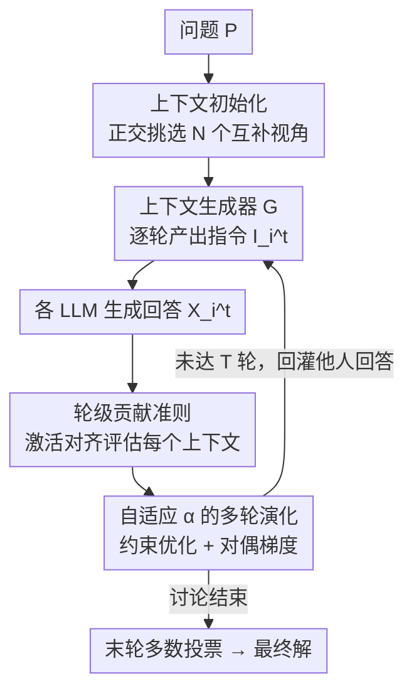

# Context Learning for Multi-Agent Discussion

**会议**: ICLR2026  
**OpenReview**: [https://openreview.net/forum?id=EUu8TILWpR](https://openreview.net/forum?id=EUu8TILWpR)  
**代码**: https://github.com/HansenHua/M2CL-ICLR26  
**领域**: 多智能体 / LLM 协作  
**关键词**: 多智能体讨论, 上下文学习, 共识对齐, 自适应平衡, MAD

## 一句话总结
M2CL 为多智能体讨论（MAD）中的每个 LLM 学一个"上下文生成器"，让每轮的指令上下文能根据讨论进展自动组织与精炼，从而在避免"多数噪声"过早收敛的同时把多个 LLM 逐步拉向正确共识，在 9 个基准上比已有方法高出 20%–50%。

## 研究背景与动机
**领域现状**：多智能体讨论（Multi-Agent Discussion, MAD）让多个 LLM 实例通过结构化辩论协同解题——典型做法是给每个实例预先分配一组带"不同视角"的上下文（role/context instruction），然后让它们互相看对方上一轮的回答、多轮迭代直到达成共识（如 Debate、DyLAN、GPTSwarm、MacNet）。这种"society of mind"范式被寄望于扩大解空间、提升推理准确率。

**现有痛点**：作者发现现有 MAD 普遍存在**讨论不一致（discussion inconsistency）**——多数 LLM 实例最终无法对一个连贯的解达成一致，集体决策被噪声而非有原则的推理主导。论文用一个多步几何证明的例子（Fig. 1）说明：一个 agent 已经正确推出中间结论，另一个 agent 即便在扩展上下文里收到了这个结论，也不会把它真正吸收进自己的推理链，而是重复推导甚至给出矛盾论证。

**核心矛盾**：根因是**上下文错配（context misalignment）**，体现在两端。其一，预分配的角色/上下文指令对任务理解粗糙，往往僵硬、不完整或有偏，会误导单个 LLM 的推理；其二，这些上下文对"如何融合 LLM 之间交换的信息"几乎没有指导，因而无法把讨论导向连贯的解。一句话：静态预设上下文既不会随讨论演化，也不强制"利用别人结论"。

**本文目标**：回答"怎样获得能持续把多 LLM 讨论引向正确共识的上下文？"。手工随讨论进度改指令既费人力又需专家知识，不现实；于是要做的是**让上下文随中间讨论结果自动演化**的学习机制。难点有二：（i）如何评估某个 LLM 的上下文对最终解的贡献；（ii）如何同时控制 LLM 之间（inter）和 LLM 自身跨轮（intra）输出的一致性。

**核心 idea**：给每个 agent 学一个**上下文生成器** $G_{\theta_i}$，每一轮根据任务目标、自身初始指令、以及其他 LLM 上一轮回答，自动生成本轮的指令上下文；并用一套"自适应平衡机制"在"压一致"和"保多样"之间动态取舍——既不让 LLM 过早在多数噪声上收敛，也能逐步对齐到正确共识。

## 方法详解

### 整体框架
M2CL 把 MAD 的上下文从"人工预设的静态字符串"换成"可学习、逐轮生成的动态指令"。形式上，第 $t$ 轮第 $i$ 个 LLM 的上下文由三部分拼接而成：任务目标 $P$（全程不变）、其他所有 LLM 上一轮回答的拼接 $\bar{X}^{t-1}_i$（充当跨 LLM 交互记忆）、以及当前指令上下文 $I^t_i$。关键改动在第三部分：不再用静态预设角色，而是用生成器 $I^t_i = G_{\theta_i}([P; I^b_i; \bar{X}^{t-1}_i])$ 在线产出。给定 $C^t_i = [I^t_i, \bar{X}^{t-1}_i, P]$，每个 LLM $\phi_i$ 输出 $X^t_i$，$T$ 轮后对末轮输出做多数投票得最终解。

方法由一条定理驱动（Theorem 4.1）。作者用注意力激活 $a(\cdot)$ 度量上下文，证明"正确答案激活 $a_c$ 与各上下文激活之和的总距离"被两部分上界控制：一部分是**各 LLM 激活间的差异 + 偏离初始上下文的程度**（要靠演化压小），另一部分**只依赖初始上下文**（要靠初始化做"正交、互补"）。这恰好把方法拆成**两个阶段**：先做**上下文初始化**保证视角多样、互补；再做**上下文演化**把分歧逐步收敛到共识。

### 关键设计

**1. 上下文初始化：用近正交的多视角指令铺好讨论的"基底"**

针对"预设角色僵硬、视角重叠导致探索不足"的痛点。Theorem 4.1 的第二项 $\min_\omega \lVert a_c - \sum_i \omega_i a(C^b_i)\rVert$ 只取决于初始上下文，意味着若各初始激活相互**正交**，它们就构成一组能更好逼近正确激活的"基"。于是初始化被写成：从一个含多种视角提示的候选池里，挑出一组 $I^b$，使它们激活的线性组合最能重构目标激活 $a_c$（Eq. 7）——因为激活矩阵维度远大于所选上下文数 $N$，"最优重构"自然会逼出一组近正交、非冗余的方向。

但 $a_c$ 在初始化时不可得。作者把激活投影到一个潜空间 $f(\cdot)$，并用"问题句向量 $v_P$"近似目标（Eq. 9–10）：拿"答案 $A$ + 问题 $P$"的激活当作 $a_c$ 来训练投影 $f$。为避免每次都要算全池上下文激活的高开销，再蒸馏一个轻量映射 $F(\cdot)$ 直接把 $[I^b_i; P]$ 投到问题空间（Eq. 11–12）。最终初始化既保留了正交性、给出互补视角，又足够高效。

**2. 轮级贡献准则：用激活对齐衡量每条上下文的真实贡献**

针对"如何评估上下文贡献"这个难点。只在末轮给效用会因稀疏导致训练低效不稳；只用"答案是否正确"当唯一标准又会冤枉那些**自己没答对、却给了别人关键启发**的 LLM。作者提出一个轮级（round-wise）准则（Eq. 13）：$\max_{j\in[N]} \{-\alpha\lVert C^t_i - C^b_i\rVert - \lVert a(C^t_i) - a(C^t_j)\rVert\}$，第一项保住初始化赋予的解题能力（别跑太远），第二项用**激活差异**鼓励 LLM 之间对齐。去掉第二项就退化成普通 prompt engineering 的固定指令，正是不一致的来源。

直接用 Eq. 13 需要其他所有 LLM 的上下文，而它们也在同时被优化，用"过时快照"会引入有偏效用。作者据此解耦依赖，设计一个**逐 LLM 的替代准则**（Eq. 14）：$-\alpha\lVert C^t_i - C^b_i\rVert - \lVert a([I^t_i,P]) - a([X^{t-1}_i,P])\rVert$，第二项强制"本轮指令"与"自己上一轮回答"在时间上保持连贯。论文证明（Lemma C.1）它对所有 LLM 求和是 Eq. 13 求和的上界——也就是说，每个 LLM 各自做"时间连贯"的演化，集体效果就是分歧逐轮收缩、最终答案趋于一致，而无需直接互看对方上下文。

**3. 自适应 α 的多轮演化：在"压一致"与"保多样"之间动态平衡**

针对"权重 $\alpha$ 难手调、易过早共识"的问题。把多轮目标（Eq. 15）按累积贡献写开后，作者把"上下文相对初始的调整幅度 $\lVert C^t_i - C^b_i\rVert \le \beta$"当作约束，转成约束优化问题（Eq. 16），再取对偶：对偶恰好恢复 Eq. 15，且给出对偶变量 $\alpha$ 的自动更新规则，可用近似对偶梯度下降交替更新 $L(\theta_i)$ 与 $L(\alpha_i)$（Eq. 17）。

$\alpha$ 因此变成**自适应**的：讨论早期各方答案差异大，$\alpha$ 快速下降、放松"贴近初始上下文"的约束，引导生成器把上下文推向更快收敛到统一解；当 LLM 逐渐达成一致后，$\alpha$ 维持在某一水平，防止过早共识、转而保留多视角、挖掘细微差异，支撑出更丰富全面的终解。这一机制正是论文标题里"self-adaptive"的落点，也是它能避开"多数噪声"陷阱的关键。

### 损失函数 / 训练策略
核心训练是 Eq. 17 的交替对偶梯度：$L(\theta_i) = \lVert a(G_{\theta_i}(P,I^b_i,\bar{X}^{t-1}_i)) - a(X^{t-1}_i)\rVert + \alpha\lVert C^t_i - C^b_i\rVert$ 更新生成器，$L(\alpha_i) = \alpha_i(\beta - \lVert G_{\theta_i}(\cdot) - C^b_i\rVert)$ 更新对偶变量。初始化阶段另有投影损失 Eq. 10（训练 $f$）与蒸馏损失 Eq. 11（训练轻量 $F$）。完整伪代码在附录 F.4。

## 实验关键数据

### 主实验
覆盖 3 类共 9 个数据集：LLM 推理（MMLU / MATH / GPQA / HumanEval-Code）、具身智能体（ALFWorld / SciWorld / GAIA / PDDL）、移动 GUI（AndroidWorld）。基线含 Single、Best-of-N、Debate、DyLAN、GPTSwarm、MacNet；base 模型用 Qwen-2.5（7B/14B/72B）与 Llama-2，GUI 用 Qwen2.5-VL。下表为 4 个 LLM、Qwen 系列的部分准确率（%）：

| 配置 | 方法 | MMLU | MATH | GPQA | Code | GAIA | PDDL |
|------|------|------|------|------|------|------|------|
| Qwen-7B | BoN | 74.2 | 24.9 | 36.4 | 62.5 | 21.1 | 26.3 |
| Qwen-7B | DyLAN | 74.3 | 26.7 | 35.4 | 63.4 | 18.4 | 23.4 |
| Qwen-7B | **M2CL** | **92.5** | **47.8** | **66.1** | **80.3** | **33.6** | **34.7** |
| Qwen-72B | DyLAN | 91.5 | 63.1 | 51.6 | 80.4 | 40.4 | 45.5 |
| Qwen-72B | MacNet | 83.8 | 52.9 | 46.2 | 70.5 | 46.4 | 53.7 |
| Qwen-72B | **M2CL** | **95.1** | **72.5** | **78.9** | **90.7** | **67.2** | **70.5** |

M2CL 在全部 9 个数据集上稳定领先，GPQA / GAIA / PDDL 这类复杂多轮任务提升尤其大（Qwen-72B 上 GPQA +33.0、GAIA +26.0）。一个值得注意的现象：BoN 反而强于多数 MAD 基线，说明固定上下文虽扩大探索空间却无法收敛，阻碍真正的协同推理。

### 消融实验

| 配置 | 现象 | 说明 |
|------|------|------|
| Full M2CL | 最优 | 完整方法 |
| w/o 上下文初始化 | 明显掉点 | LLM 难以分化与协调，缺少高影响力初始上下文 |
| w/o 调 α | 掉点 | 首轮即达成一致，回答缺创造性与多样性 |
| w/o 上下文演化 | 掉点 | 缺协作指导，无法有效利用他人输出 |

### 关键发现
- **效率高**：性能提升 >20% 的同时运行时开销 <10%（Fig. 3），得益于轻量上下文生成器。
- **更好的 MAD scaling law**：agent 数从 4 扩到 64，M2CL 性能随对数增长且比基线更快饱和前提升（Fig. 4）。
- **约束 β 有甜点**：$\beta$ 太小上下文贴近初始 → 讨论不一致；太大 → 朴素一致、答案趋同、缺创造力；中间值最好。
- **分歧强度更快收敛**：M2CL 的 discrepancy intensity $\max_{i,j}\lVert a_i - a_j\rVert_2$ 随轮次下降比其他方法更快，印证它确实在把多 LLM 拉向一致。
- **可迁移**：训练好的上下文生成器直接迁到更强 LLM 仍带来一致提升，无需重训。

## 亮点与洞察
- **把"上下文"从静态字符串重定义为可学习的动态对象**：用一个生成器逐轮产出指令，这一视角本身就把 MAD 的瓶颈从"提示工程"挪到了"上下文学习"，迁移性强。
- **用激活（attention activation）而非 token embedding 度量一致性**：激活捕捉模型内部推理过程的深层表示，对表面语言变体更鲁棒，是贡献准则能 work 的关键技术选择。
- **逐 LLM 上界替代全局准则（Eq. 14 替 Eq. 13）很巧**：把"互看他人上下文"的强耦合，换成"自己跨轮时间连贯"的局部约束，并证明它是全局目标的上界——既避开了过时快照的偏差，又把分布式优化变得可解。
- **自适应 α 直接来自约束优化的对偶**：α 不是又一个要手调的超参，而是对偶变量、有明确更新规则，工程上省心、理论上自洽。

## 局限与展望
- 作者承认：MAD 的多样性靠"堆数量不同特性的 LLM"获得，计算上低效；未来希望让 LLM 真正捕捉自己擅长/感兴趣的子任务，而非靠数量取胜。
- 自评补充：整套方法依赖对**注意力激活**的访问与可微操作（投影、对齐项），对纯黑盒 API 模型不直接适用；激活距离作为一致性代理的最优性也建立在 La-smooth 等假设上。
- 伦理层面论文也提到：上下文初始化引入的偏见或共识构建中的错误可能被放大，在法律/金融/医疗等高风险场景需谨慎。
- 可改进方向：把"逐 LLM 时间连贯"准则与显式的角色专长建模结合，或在 β/α 之外引入任务难度感知的约束调度。

## 相关工作与启发
- **vs Debate (Du et al., 2023)**：Debate 用预设上下文让 LLM 多轮辩论，但上下文静态、对"如何融合他人结论"无指导，易陷不一致；M2CL 让上下文逐轮被生成器演化并强制对齐，正是针对这一痛点。
- **vs DyLAN (Liu et al., 2024)**：DyLAN 让 LLM 互相打分、动态构造通信结构，仍属"调拓扑/工作流"；M2CL 不改拓扑而改每个 agent 的上下文内容，互补且更细粒度。
- **vs GPTSwarm (Zhuge et al., 2024)**：GPTSwarm 把 agent 系统当可优化计算图、一次性优化 prompt 与编排；M2CL 的上下文演化是**逐轮**的、随讨论状态持续调整，而非 one-shot。
- **vs 单 LLM 的 context learning（Self-Refine、ProRefine 等）**：这些方法在单 LLM 内用反馈精炼提示，缺乏跨 LLM 一致性建模；M2CL 把上下文学习扩展到多 LLM，核心在于"引导每个 LLM 充分利用他人中间结果"。

## 评分
- 新颖性: ⭐⭐⭐⭐⭐ 把 MAD 不一致归因于上下文错配，并用"逐 agent 上下文生成器 + 对偶自适应平衡"系统性求解，理论与方法都新。
- 实验充分度: ⭐⭐⭐⭐⭐ 3 类 9 数据集、多 base 模型与多尺寸、scaling/效率/迁移/消融齐全。
- 写作质量: ⭐⭐⭐⭐ 动机—定理—两阶段方法的主线清晰，但激活/对偶推导较密，需结合附录。
- 价值: ⭐⭐⭐⭐⭐ 20%–50% 的提升 + <10% 开销 + 可迁移，对多智能体协作落地有直接参考价值。

<!-- RELATED:START -->

## 相关论文

- [\[ICML 2026\] CoOT: Learning to Coordinate In-Context with Coordination Transformers](../../ICML2026/multi_agent/coot_learning_to_coordinate_in-context_with_coordination_transformers.md)
- [\[NeurIPS 2025\] The PokeAgent Challenge: Competitive and Long-Context Learning at Scale](../../NeurIPS2025/multi_agent/the_pokeagent_challenge_competitive_and_long-context_learning_at_scale.md)
- [\[ICLR 2026\] AgentPO: Enhancing Multi-Agent Collaboration via Reinforcement Learning](agentpo_enhancing_multi-agent_collaboration_via_reinforcement_learning.md)
- [\[ICLR 2026\] Adaptive Collaboration with Humans: Metacognitive Policy Optimization for Multi-Agent LLMs with Continual Learning](adaptive_collaboration_with_humans_metacognitive_policy_optimization_for_multi-a.md)
- [\[ICLR 2026\] Learning to Summarize by Learning to Quiz: Adversarial Agentic Collaboration for Long Document Summarization](learning_to_summarize_by_learning_to_quiz_adversarial_agentic_collaboration_for_.md)

<!-- RELATED:END -->
