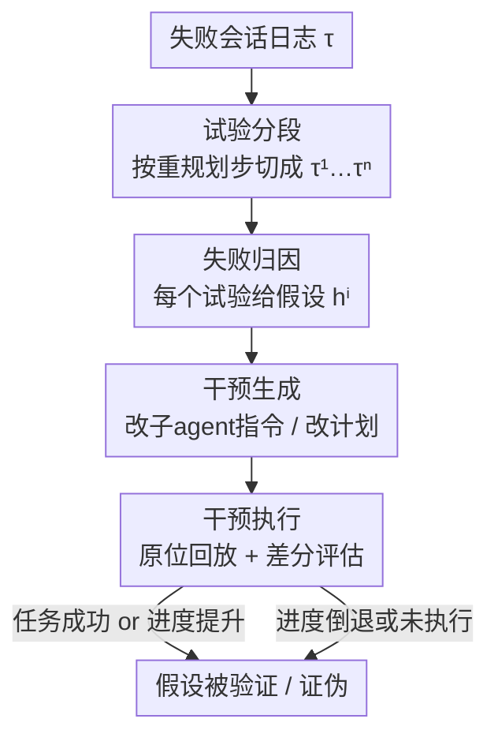

# DoVer: Intervention-Driven Auto Debugging for LLM Multi-Agent Systems

**会议**: ICLR2026  
**OpenReview**: [https://openreview.net/forum?id=mrEK16Jy6h](https://openreview.net/forum?id=mrEK16Jy6h)  
**代码**: https://aka.ms/DoVer （论文承诺开源，发布时以官方为准）  
**领域**: LLM 多智能体 / Agent 调试 / 失败归因  
**关键词**: 多智能体系统, 自动调试, 失败归因, 干预验证, 反事实回放

## 一句话总结
DoVer 把 LLM 多智能体系统的"日志归因"调试范式从"猜一个出错的 agent/step"升级为"做一次有针对性的干预再回放验证"（Do-then-Verify），通过把失败轨迹切成多个试验、对每个试验提出假设并改写编排者的指令或计划、原位重放并用里程碑进度打分，在 GAIA / AssistantBench 上把 18–28% 的失败案例翻盘成功、在 GSMPlus 上翻盘率达 49%。

## 研究背景与动机
**领域现状**：LLM 驱动的多智能体系统（如 Magentic-One、AutoGen）越来越多地部署到生产环境，调试它们的失败成了刚需。这里的"失败"不是程序崩溃，而是系统跑完了却给出错误或不令人满意的结果。当前主流做法是"基于日志的失败归因"：把整条会话日志喂给一个 LLM，让它指出"是哪个 agent 在哪一步犯了决定性错误"（decisive error，定义为：若把这一步的错误动作换成正确动作，后续轨迹就会成功）。代表性数据集是 Who&When (WW)。

**现有痛点**：作者复现 WW 协议后发现这套范式有两个根本缺陷。其一，**只看日志的归因是"未经检验的假设"**——模型说"第 53 步错了"，但从没真正去改一下、跑一遍看是否真能修好，归因正确与否无从验证。其二，**单 step / 单 agent 归因本身就是病态问题（ill-posed）**：现代 agent 用 ReAct 式"规划—执行"循环，一次会话里会有多个试验、每个试验各有自己的决定性错误点；而且当编排者下达了模糊指令、子 agent 又执行错了时，责任到底归谁也说不清（Inter-Agent Misalignment）。

**核心矛盾**：归因的"金标准标签"本身充满不确定性。作者对 WW 中 29 个 GAIA 案例重新标注，发现 14 个存在 GT 不确定性（与 WW 自报的 15–30% 标注者不确定性吻合）。在这 14 个不确定案例上 GPT-4o 的 step 归因准确率只有 24%，而在 15 个确定案例上能到 44%——说明低准确率很大程度上是被噪声标签拖累的，继续在"归因准确率"这个指标上卷下去方向就错了。

**本文目标 + 切入角度**：与其去逼近一个本身就不可靠的"正确归因"，不如换一个更面向结果（outcome-oriented）的评价视角——不问"归因对不对"，而问"系统最终有没有把失败修好、有没有朝成功量化地前进一步"。

**核心 idea**：用"显式干预 + 回放验证"取代"只读日志做归因"——把归因当作一个**可被实验检验的假设**：在可疑失败点做一次有针对性的编辑（改消息 / 改计划），保留之前的上下文，从干预点往后重新执行；修好了就支持假设，没修好就证伪假设。

## 方法详解

### 整体框架
DoVer（Do-then-Verify）是一条把"失败归因假设"转化为"受控编辑"再检验其是否改变结果的调试流水线。输入是一条 agent 系统跑失败的会话日志 $\tau = \{(a_t, m_t, \sigma_t)\}_{t=1}^{T}$（$a_t$ 是产生消息 $m_t$ 的活跃 agent，$\sigma_t$ 是用于状态恢复与回放的有状态信息，如历史上下文、浏览历史），输出是若干条"干预后的反事实轨迹"以及对每条假设的验证判定。

整条流水线分四个阶段：**(1) 试验分段**——以"重规划步"为切点把长日志切成多个试验 $\tau^i$；**(2) 失败归因**——对每个试验生成一个候选假设 $h^i$，标出可疑的步与 agent；**(3) 干预生成**——把假设转化为对计划或消息的可执行编辑 $I^i$；**(4) 干预执行**——原位回放该试验、施加干预，再用任务成功率和进度分相对原始轨迹做差分评估。一条会话因此可以并行产出多个假设和多次干预，这正契合"很多失败有不止一种可行修法"的现实。

### 关键设计

**1. 试验分段：把"一条长会话只能归一个错"的病态问题拆成多个可独立验证的子问题**

作者发现单 step 归因之所以病态，是因为一次会话里塞了多个"规划—执行"循环：图 1 的案例就含 4 个试验，试验 1 用直接滚动找网页、试验 2 改用日历功能，每个试验各有独立的出错点，硬要在整条会话里指认唯一一步本质上是歧义的。DoVer 把试验定义为"从一个规划步开始、延续到该计划的所有执行步"的连续区间，并以重规划步作为切点把 $\tau$ 切成多个 $\tau^i$。分段有两个好处：缩短上下文让 LLM 只需对单条因果链推理；让多个试验的干预可以独立、并行执行。实现上作者没用某个系统特有的消息模式（如 M1 里规划步常以 "We are working to address the following user request" 开头）去硬匹配，而是用 prompt 让 LLM 自己识别规划步，这样能更好地泛化到日志模式未知的其他 agent 框架。

**2. 失败归因：复用日志归因但只把它当"待检验假设"，不再苛求精度**

对每个试验 $\tau^i$，DoVer 生成一个候选归因假设 $h^i = (\hat{a}^i_{\hat{t}}, r^i_{\hat{t}})$，其中 $\hat{t}$ 是被归因的失败步索引，$\hat{a}^i$ 是可疑 agent，$r^i$ 是自然语言的理由。它沿用现有的日志归因方法（作者在第 3 节改进过的 All-at-Once prompt——把整条会话一次性喂给 LLM），并适配到分段后的试验上。关键转变在于：**这里不要求归因精确**，因为正确与否后面会被显式干预检验。顺带一提，作者在复现中找到两个非侵入式 prompt 改进——给失败日志加显式 step 索引、嵌入一句标注者指南——就能把 GPT-4o 在 WW-HC 上的 step 归因准确率从 6% 提到 24%，这也成了归因阶段的基础。

**3. 干预生成：按"编排者 vs 子 agent"分类，主打编排者层面的消息改写以保持框架无关**

把假设变成具体编辑时，歧义往往出在"责任归编排者还是子 agent"。DoVer 因此区分两类干预，但为了对底层 agent 架构尽量无关、保持通用与简洁，主打**编排者层面、在消息传递层做直接编辑**的干预，分两种：① **修改给子 agent 的指令**（澄清意图、修正参数、补充缺失上下文，从而间接影响子 agent 行为）；② **更新计划**（重排、拆解或替换步骤，绕开已识别的失败点）。这样选择有一个明确的 trade-off：好处是通用，代价是无法直接给子 agent 增能（比如给 WebSurfer 加页内搜索这类需要改系统的能力提升就做不到）。这一分类直接源自第 3 节的不确定性分析——既然 orchestrator 与 sub-agent 之间的归责本就模糊，那就用一套清晰的干预 taxonomy 把"改编排者的计划/指令"和"直接给子 agent 增能"分开处理。

**4. 干预执行与差分评估：原位回放造反事实轨迹，用里程碑进度和四分类判定来量化"修好没"**

agent 系统在可疑失败步原位（in-situ）施加干预并回放：保留干预步之前的所有步骤，从干预步执行 $I^i$，得到反事实轨迹 $\tilde{\tau}_I = \{\tau_1, \dots, \tau_{i-1}, \tilde{\tau}_i\}$，一次干预造一条新轨迹。评估分两套指标，且为抵消 LLM 随机性每次干预跑 3 次独立运行。第一套衡量"失败翻盘"：**Trial Success Rate**（干预后成功完成任务的试验占比）和 **Progress Made**——后者针对未完全成功但更接近成功的情况，从人工标注解题步里抽取至多 $K \le 5$ 个里程碑，定义某轨迹 $\gamma$ 的里程碑达成数 $A(\gamma) = \sum_{k=1}^{K} \mathbb{I}(\text{milestone } m_k \text{ achieved in } \gamma)$，进度为新旧轨迹达成数之差占比：

$$\mathrm{Prog}(\tau \to \tilde{\tau}_I) = \frac{A(\tilde{\tau}_I) - A(\tau)}{K} \in [-1, 1].$$

第二套衡量"假设验证"：把每个试验干预后分成 **Validated / Partially Validated / Refuted / Inconclusive** 四类。之所以需要 Inconclusive，是因为 agent 经常没忠实执行干预指令导致失败——这时分不清是假设错了还是系统能力不足。作者用 LLM 判一个布尔量"is intervention fulfilled"（干预是否被忠实执行），再结合成功率与进度定义：3 次里 ≥2 次成功为 **Validated**；不足 2 次成功、但 ≥2 次既忠实执行干预又有额外 20% 进度（即推进一个关键里程碑）为 **Partially Validated**；同上但进度未超 20% 为 **Refuted**；其余为 **Inconclusive**。

### 一个完整示例
以 WW-HC 的 Case 3（GAIA 任务：找 2015 年 8 月第一周某张 APOD 图里城市天际线的城市名、再查其同名人物在芝加哥地标建筑的设计事务所）为例。整条会话被切成 4 个试验：试验 1 用直接滚动找页面、试验 2 改用日历功能（第 53–55 步出现 Inter-Agent Misalignment——Orchestrator 让 WebSurfer 点一个不存在的 "2015" 控件、WebSurfer 又点了个无关控件）、试验 3/4 转向利用 APOD 的 URL 模式。日志归因若强行指认"唯一一步"会陷入歧义；DoVer 则对每个试验各提一个假设，比如对试验 2 把 Orchestrator 给 WebSurfer 的模糊指令改写清楚，再从该步原位回放——若新轨迹推进到新的里程碑（如成功定位到目标日期页），这条假设就被验证/部分验证，反之则被证伪，整个过程不依赖任何人工金标准。

## 实验关键数据

### 主实验
两套框架：Magentic-One (M1，改造 AGDebugger 实现 checkpoint/load/intervene/resume) 和 AutoGen2 (AG2，搭 MathChat 系统)；数据集 WW-AB、WW-GAIA、GAIA-Level-1（M1）与 GSMPlus（AG2，2400 例 testmini）。统一用 GPT-4o 生成轨迹与执行干预、GPT-5 算进度与验证。

失败翻盘指标（Table 2）：

| 设置 | 干预试验数 | Trial Success Rate | Progress Made |
|------|-----------|--------------------|---------------|
| WW-AB | 72 | 17.6% | +0% |
| WW-GAIA | 99 | 17.6% | +8.8% |
| GAIA-Level-1 | 63 | 27.5% | +15.7% |
| GSMPlus | 198 | 49.0% | —（无人工解题步，无法算） |

WW 含更难的 Level-2/3 任务，故翻盘率与进度都低于 GAIA-Level-1；GSMPlus 上近 50% 的翻盘率说明方法能跨数据集、跨框架泛化。值得注意的是 WW-AB 几乎无进度（+0%），提示干预有时甚至会拖累进展。

假设验证分布（Table 3）：

| 设置 | Validated | Inconclusive | Partially Validated | Refuted |
|------|-----------|--------------|---------------------|---------|
| WW-AB | 15.3% | 66.7% | 4.2% | 13.9% |
| WW-GAIA | 16.2% | 57.6% | 5.1% | 21.2% |
| GAIA-Level-1 | 34.9% | 28.6% | 12.7% | 23.8% |

WW 上约 60% 落入 Inconclusive（越难的任务越难忠实执行干预），而 GAIA-Level-1 的 Validated/Refuted 都明显更高、Inconclusive 降到约 30%。

### 消融实验

| 配置 | 干预试验数 | Trial Success Rate | 说明 |
|------|-----------|--------------------|------|
| Qwen3-8B (0-shot) | 77 | 11.3% | 本地中型开源模型也能用 |
| Qwen3-8B (3-shot) | 77 | 14.3% | 加 3 个 few-shot 干预示例后提升 |
| Qwen3-32B (0-shot) | 87 | 16.9% | 大开源模型逼近 GPT-4o |
| GPT-4o (0-shot) | 99 | 17.6% | 闭源前沿模型基线 |

### 关键发现
- DoVer 不依赖单一闭源后端：换成本地 Qwen3-8B/32B 仍可工作，Qwen3-32B (16.9%) 已基本逼近 GPT-4o (17.6%)，对开源部署友好。
- 小模型可以用 few-shot prompt 补偿：给 Qwen3-8B 加 3 个"编排者把次优指令改写清楚"的示例，翻盘率从 11.3% 提到 14.3%。
- "归因准确率"被金标准噪声严重污染：在 14 个不确定 GAIA 案例上 GPT-4o 仅 24%、GPT-5 仅 7%，而在 15 个确定案例上分别升到 44%/53%——这正是作者放弃归因准确率、转向 outcome-oriented 评价的实证依据。

## 亮点与洞察
- **把"调试"重新定义为可证伪的科学实验**：Do-then-Verify 这一步把归因从"LLM 的一句断言"变成"改一下、跑一遍、看结果"的反事实检验，这是整篇论文最"啊哈"的范式转变——它直接绕开了不可靠的人工金标准。
- **承认问题是 ill-posed 反而打开了新空间**：作者没有继续卷归因准确率，而是论证"一个失败本来就有多个可行修法、责任本来就可能模糊"，于是用"多试验 + 多假设 + 进度分"把单点指标换成结果导向的连续度量。
- **Progress Made 这个细粒度指标可迁移**：当任务有人工里程碑标注时，用"额外达成里程碑占比 $\in[-1,1]$"衡量"虽败犹进"，比 0/1 的成败更能反映干预价值，可迁移到任何带阶段性子目标的 agent 评测。
- **编排者层面的消息改写是务实的通用接口**：只在 message-passing 层做编辑就能在不同框架间复用，是一个"牺牲一点能力换大量通用性"的好工程取舍。

## 局限与展望
- **只在编排者层干预，碰不到子 agent 增能**：作者明说这是有意的 trade-off——像给 WebSurfer 加页内搜索这类需要改系统的能力提升做不了，因此一部分真正源于子 agent 能力不足的失败无法被修复。
- **Inconclusive 比例很高**：WW 上约 60% 的试验因 agent 没忠实执行干预而落入 Inconclusive，说明"干预能否被执行"本身成了瓶颈，验证信号被稀释。
- **进度指标依赖人工里程碑标注**：GSMPlus 这种没有人工中间步标注的数据集就算不了 Progress Made；作者把"用 LLM-as-a-judge 直接对比干预前后轨迹"留作未来工作。
- **干预有时反而有害**：WW-AB 上 Progress Made 为 +0%，提示当前干预生成在某些情况下可能拖累进展，干预质量本身仍有提升空间。

## 相关工作与启发
- **vs 日志失败归因（Who&When / Zhang et al. 2025c）**：他们让 LLM 从日志里指认唯一出错的 agent/step、并以归因准确率评测；DoVer 把归因降格为待检验假设、靠显式干预回放来判定，并改用"是否修好/是否前进"的结果导向指标，绕开了金标准不确定性。
- **vs 人在环路调试工具（AGDebugger / LangGraph）**：它们提供 rewind/edit/re-execute、checkpoint/time-travel，证明了"小而准的干预常常有效"，但都是手动、难规模化；DoVer 把这套干预自动化（其 M1 实现正是改造 AGDebugger 去掉人工环节）。
- **vs AgentDebug（Zhu et al. 2025b）**：同样用干预驱动的方法论，但 DoVer 特别强调多智能体场景下的"编排者 vs 子 agent"归责歧义与试验级干预。
- **vs MAST / TRAIL 等失败刻画工作**：它们建立失败 taxonomy 和细粒度 trace 标注、指出端到端成败太粗；DoVer 顺着这条"轨迹感知评测"的思路，进一步用 milestone 进度把"虽败犹进"量化出来。

## 评分
- 新颖性: ⭐⭐⭐⭐⭐ 把多智能体调试从"日志归因"切换到"干预验证"，是范式级而非增量改进
- 实验充分度: ⭐⭐⭐⭐ 覆盖 2 个框架 4 个数据集 + 开源模型与 few-shot 消融，但样本量偏小、Inconclusive 偏高
- 写作质量: ⭐⭐⭐⭐⭐ 从复现暴露问题、到分析金标准不确定性、再到提出方法，动机链条非常扎实
- 价值: ⭐⭐⭐⭐⭐ 给 agent 可靠性提供了一个务实、可落地、可证伪的调试机制，方向开阔

<!-- RELATED:START -->

## 相关论文

- [\[ICLR 2026\] CellAgent: LLM-Driven Multi-Agent Framework for Natural Language-Based Single-Cell Analysis](cellagent_llm-driven_multi-agent_framework_for_natural_language-based_single-cel.md)
- [\[ACL 2026\] Seeing the Whole Elephant: A Benchmark for Failure Attribution in LLM-based Multi-Agent Systems](../../ACL2026/multi_agent/seeing_the_whole_elephant_a_benchmark_for_failure_attribution_in_llm-based_multi.md)
- [\[AAAI 2026\] Beyond Detection: Exploring Evidence-based Multi-Agent Debate for Misinformation Intervention and Persuasion](../../AAAI2026/multi_agent/beyond_detection_exploring_evidence-based_multi-agent_debate_for_misinformation_.md)
- [\[ICML 2026\] MASPO: Joint Prompt Optimization for LLM-based Multi-Agent Systems](../../ICML2026/multi_agent/maspo_joint_prompt_optimization_for_llm-based_multi-agent_systems.md)
- [\[ICLR 2026\] CoMAS: Co-Evolving Multi-Agent Systems via Interaction Rewards](comas_co-evolving_multi-agent_systems_via_interaction_rewards.md)

<!-- RELATED:END -->
