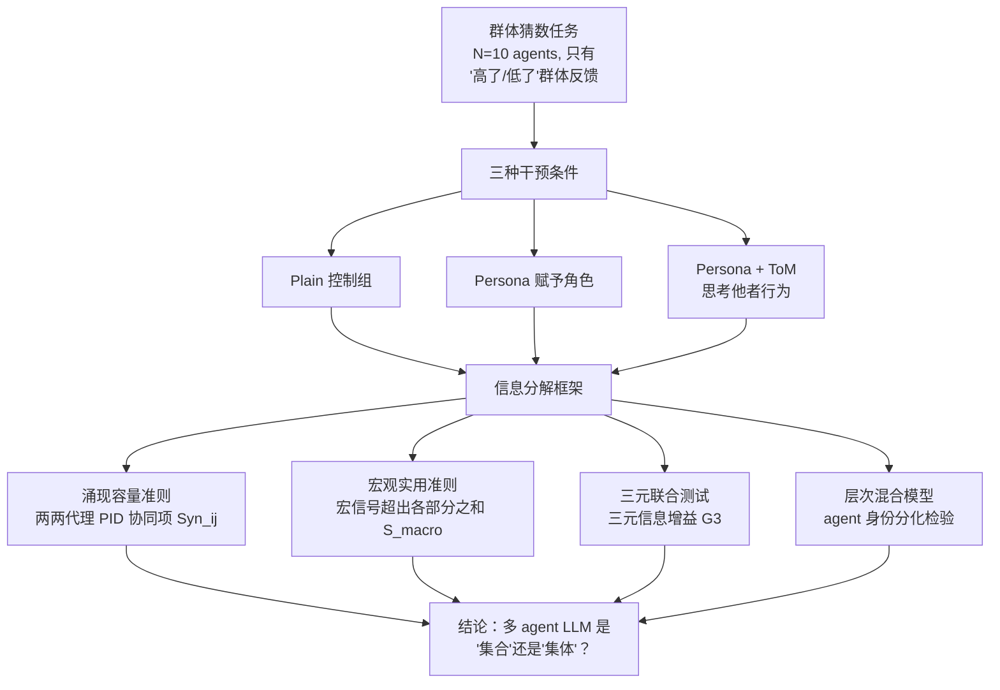

# Emergent Coordination in Multi-Agent Language Models

**会议**: ICLR 2026  
**代码**: https://github.com/riedlc/AI-GBS  
**领域**: 多智能体系统  
**关键词**: 多智能体协调、涌现、信息分解、心智理论、集体智能

## 一句话总结

提出基于偏信息分解与时延互信息的可量化框架，证明多 LLM agent 系统在适当提示（Persona + ToM）下能从松散聚合跃升为具备高阶协同结构的真正集体，并揭示"协同×冗余"交互才是性能提升的关键机制。

## 研究背景与动机

**领域现状**：多 agent LLM 系统在软件开发、医疗等复杂任务上屡获超越单 agent 的成绩，"群体大于个体之和"已成常见宣称，角色分化（programmer / tester / CEO 等）是主流设计直觉。

**现有痛点**：既有工作几乎从不回答一个基础问题——系统究竟是真正的"集体"还是仅仅是多次单 agent 推理的平均？胜率类评估无法区分"协同涌现"与"单纯冗余聚合"，也无法量化 agent 间互补究竟从何而来。

**核心矛盾**：声称的"协同效应"既无法被falsify，也无法被定位——没人知道协同在哪对哪产生、是否与任务目标对齐，更无法指导设计。

**本文目标**：建立一套纯数据驱动、可伪证的量化框架，测量多 agent LLM 系统中动态涌现是否存在、在哪里存在，并探索如何通过提示工程主动调控涌现结构。

**切入角度**：借用信息论中的偏信息分解（PID）和时延互信息（TDMI），将"高阶结构"操作化为可计算的统计量，配合置换检验提供严格零假设对照。

**核心 idea**：用偏信息分解把多 agent 系统的预测信息拆成"冗余 + 唯一 + 协同"三份，协同项 > 0 即为涌现存在的证据；Persona 赋予 agent 稳定身份，ToM 提示则将身份分化转化为目标对齐的互补角色。

## 方法详解

### 整体框架

框架由三个信息论量度 + 一个层次混合模型测试组成，依次回答"有无涌现 → 涌现如何维持 → 角色是否分化"的递进问题。所有分析均在一个极简群体猜数任务（Group Binary Search）上展开，三种提示干预（Plain / Persona / ToM）作为因果操纵变量。

### 关键设计

**1. 偏信息分解测涌现容量：精确定位 Pairwise 协同**

单纯的互信息无法区分"冗余对齐"与"互补协同"——两者都能让系统更可预测。本文在代理对 $(i, j)$ 当前状态 $X_{i,t}, X_{j,t}$ 与联合未来状态 $T_{ij,t+\ell} = (X_{i,t+\ell}, X_{j,t+\ell})$ 之间做二源 PID：

$$
I(\{X_{i,t}, X_{j,t}\}; T_{ij,t+\ell}) = UI_i + UI_j + Red_{ij} + Syn_{ij}
$$

其中 $Syn_{ij} > 0$ 说明联合未来的预测信息不能从任一单一 agent 独立还原——这正是高阶结构的信息论指纹。取所有代理对的中位数作为群体涌现容量。相比直接看互信息，此设计的优势在于**手术刀式地把协同项与冗余项分离**，令"涌现容量"成为一个可伪证的独立统计量，而非混沌的"更好的相关性"。

**2. 宏观实用准则与三元联合测试：目标对齐的涌现**

涌现容量只看代理对之间的动力学，不问是否与任务目标有关。实用准则直接盯住宏信号 $V_t$（群体总误差）：

$$
S_{macro}(\ell) = I(V_t; V_{t+\ell}) - \sum_{k=1}^{n} I(X_{k,t}; V_{t+\ell})
$$

正值表示宏信号的自预测能力超过各部分之和，即涌现是目标对齐的。进一步，三元联合测试用

$$
G_3 = I_3 - \max(I_{2\{1,2\}}, I_{2\{1,3\}}, I_{2\{2,3\}})
$$

度量三元组比最优代理对额外提供了多少关于宏信号的预测信息，专门排除"最优代理对已能解释"的情形。实验发现 ToM 条件下 Total Stability（$I_3$ 归一化后的值）显著大于零（$p = 2.9 \times 10^{-14}$），而三元增益 $G_3 \approx 0$，说明系统稳定性由密集的成对对齐（Mean Field 耦合）而非更复杂的三阶结构承载——这与仅有群体级反馈的任务结构高度吻合：agent 无法直接观察彼此，只能通过聚合信号耦合，复杂三阶协同在此反而是脆弱的。

**3. Persona + ToM 提示的因果操纵：从噪声到稳态角色**

Plain 条件下 agent 分化仅来自 LLM 的随机性，无稳定身份；Persona 为每个 agent 注入姓名、职业、性格特质、个人价值观等属性，赋予行为锚点，层次混合模型检验显示显著的 agent 随机截距效应（不同 agent 系统性地偏高/低）。ToM 额外指示 agent"思考其他 agent 可能会做什么"，利用公开历史作为协调设备（Common Ground），将 Persona 引入的微小非对称性放大为稳定、自强化的互补角色。回归分析揭示协同与冗余**交互预测**成功率（$\beta = 0.24, p = 0.014$），各自单独均无显著效果——仅有目标对齐的冗余 + 分化互补的协同同时具备时，性能才显著提升（每方向放大约 27%）。

### 训练策略 / 实验设计关键点

样本熵估计采用 Jeffreys 先验（$\alpha = 1/2$ 伪计数 Dirichlet 平滑）应对稀疏离散数据，并与 Miller-Madow 偏差修正估计器做鲁棒性对比。置换检验分两种：行置换（打破 agent 身份锁定）对应零假设"身份分化不存在"，列时移置换（保留个体动力学而破坏跨 agent 对齐）对应"动态对齐不存在"，双刀切割令伪阳性率有严格控制。

## 实验关键数据

### 主实验（GPT-4.1，N=10，T=1，各条件 200 组）

| 指标 | Plain | Persona | Persona+ToM |
|------|-------|---------|-------------|
| 平均成功率 | ~40% | ~40% | ~40%（无显著差异）|
| 实用准则 BC（Wilcoxon p） | $1.5\times10^{-16}$ | $6.6\times10^{-7}$ | 0.02 |
| Total Stability（BC，p） | 0.976（≈0） | 0.858（≈0） | $2.9\times10^{-14}$（显著）|
| 显著 I3 > 0 的组比例 | ~15% | ~20% | ~50%（显著更多）|
| 显著 agent 分化的组比例 | ~20% | ~40% | ~60% |

### 跨模型泛化实验

| 模型 | 能力水平 | Persona/ToM 涌现增强 | 特殊失败模式 |
|------|---------|---------------------|-------------|
| GPT-4.1 | 高 | 显著 | 无 |
| LLAMA 70B | 高 | 显著 | 无 |
| Gemini 2.0 Flash | 高 | 显著 | 无 |
| QWEN3 235B | 推理模型 | 显著但不稳定 | **协调歧义下的瘫痪**（无限 CoT 循环）|
| LLAMA 8B | 小模型 | 不显著 | 无法打破震荡循环，ToM 能力不足 |

### 消融实验

| 配置 | 关键指标 | 说明 |
|------|---------|------|
| 协同单独 | 不预测成功率 | 需配合冗余才有效 |
| 冗余单独 | 不预测成功率 | 需配合协同才有效 |
| 协同×冗余交互 | $\beta=0.24, p=0.014$ | 二者互相放大约 27% |
| 因果中介（ToM→协同→成功） | ACME=0.034，p=0.053 | 边缘显著，方向一致 |

### 关键发现

- 所有条件下都存在动态涌现（实用准则显著为正），但质量迥异：Plain 和 Persona 的群体停留在"气态"非对齐状态，ToM 才使系统进入稳定吸引子
- 总稳定性（Total Stability）起到 Lyapunov 稳定性代理指标的作用；ToM 是让系统从混沌区跃入稳定区的"控制参数"
- 三元增益 $G_3 \approx 0$（即便 ToM 下），说明系统的高阶协同通过密集的成对对齐实现，而非三阶以上的复杂锁定——Mean Field 动力学在此占主导
- 推理模型 QWEN3 出现独特失败模式：协调歧义下无限 chain-of-thought 循环（"相互心智建模陷阱"）

## 亮点与洞察

- **方法论贡献**：把"集体 vs 聚合"这个以前只能定性讨论的问题，转化为可计算、可伪证的信息论统计量，首次在 LLM 多 agent 系统上做到了严格量化——这比任何基准测试的胜率都更接近"为什么"
- **协同×冗余交互的反直觉结论**：单独优化协同或冗余均无效，二者需共现；对 agent 系统设计的含义是：既要让 agent 有不同身份（分化），又要让目标对齐（冗余），缺一不可，呼应了人类团队研究的经典发现
- **推理模型的新失败模式**：QWEN3 的"协调歧义下瘫痪"揭示了一类以往 benchmark 不会触及的脆弱性——过度思考他者意图反而导致系统级死锁，为推理模型在多 agent 场景的局限性提供了首个信息论视角的证据

## 局限与展望

- 单一任务（Group Binary Search）：该任务特意设计成对互补策略敏感，更普适的任务场景下结论是否成立尚未验证
- 信息论估计的有限样本困难：受限于每轮状态空间离散化，涌现容量只能计算 $k=2$ 阶（成对），更高阶的 $k>2$ 协同被遗漏
- 协同与性能的内生性：协同和绩效往往同步出现，因果链虽用中介分析控制，但仍只达到边缘显著水平
- 未建立 team-over-solo 的绝对优势：框架专注于条件性跨 agent 协同，不声称多 agent > 单 agent

## 相关工作与启发

- **vs Generative Agents（Park et al., 2023）**：后者展示了 agent 社会涌现的现象，但没有量化框架；本文提供了度量"真实涌现"的工具，可反过来验证那类系统里是否真的存在高阶协同
- **vs AgentVerse / ChatDev 等角色化多 agent 框架**：这些系统直觉地分配了角色，但从未检验角色分化是否带来信息互补；本文的分析方法可直接用于事后审计任何多 agent 系统的协同结构
- **vs PID / TDMI 方法本身（Rosas et al., 2020; Mediano et al., 2022）**：本文将物理/神经科学领域已有的动态涌现理论首次落地到 LLM 集体行为研究，开拓了一个新的交叉方向
- **启发**：Persona + ToM 的两步设计（先赋身份，再赋"思考他者"的元认知）是最简洁的多 agent 协调提示配方，值得直接在工程实践中复用

## 评分

- 新颖性: ⭐⭐⭐⭐⭐ 首次将 PID+TDMI 动态涌现框架系统应用于 LLM 多 agent 系统，开辟了"集体 vs 聚合"的可量化研究方向
- 实验充分度: ⭐⭐⭐⭐ 五个模型、600+ 组实验、多套鲁棒性检验，但受限于单一任务
- 写作质量: ⭐⭐⭐⭐ 理论框架与直觉解释交叉呈现，可读性好；信息论细节放附录不妨碍主线阅读
- 价值: ⭐⭐⭐⭐⭐ 为多 agent 系统设计提供了可操作的诊断工具和因果设计原则，对领域有直接指导价值

<!-- RELATED:START -->

## 相关论文

- [\[ICLR 2026\] Multi-agent Coordination via Flow Matching](multi-agent_coordination_via_flow_matching.md)
- [\[ICLR 2026\] Cache-to-Cache: Direct Semantic Communication Between Large Language Models](cache-to-cache_direct_semantic_communication_between_large_language_models.md)
- [\[AAAI 2026\] LieCraft: A Multi-Agent Framework for Evaluating Deceptive Capabilities in Language Models](../../AAAI2026/multi_agent/liecraft_a_multi-agent_framework_for_evaluating_deceptive_capabilities_in_langua.md)
- [\[NeurIPS 2025\] Large Language Models Miss the Multi-Agent Mark](../../NeurIPS2025/multi_agent/large_language_models_miss_the_multi-agent_mark.md)
- [\[ACL 2026\] AgenticEval: Toward Agentic and Self-Evolving Safety Evaluation of Large Language Models](../../ACL2026/multi_agent/agenticeval_toward_agentic_and_self-evolving_safety_evaluation_of_large_language.md)

<!-- RELATED:END -->
