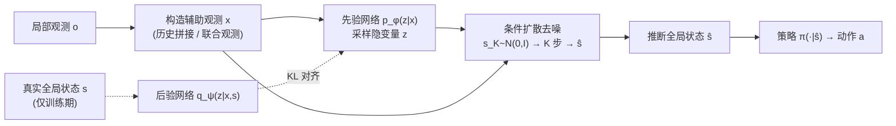

# GlobeDiff: State Diffusion Process for Partial Observability in Multi-Agent Systems

**会议**: ICLR 2026  
**OpenReview**: [https://openreview.net/forum?id=96g2BRsYZX](https://openreview.net/forum?id=96g2BRsYZX)  
**代码**: 待确认（论文称接受后公开）  
**领域**: 多智能体强化学习 / 部分可观测  
**关键词**: Dec-POMDP, 部分可观测, 条件扩散模型, 全局状态推断, 多模态生成, CTDE  

## 一句话总结
把多智能体部分可观测下的"全局状态推断"重新表述为一个**条件扩散去噪过程**，用隐变量 $z$ 当"模式选择器"显式建模"一份局部观测对应多个合理全局状态"的一对多歧义，从而避开判别式方法的模式坍缩，让每个智能体只凭局部信息就能高保真地还原全局状态再做决策。

## 研究背景与动机
- **领域现状**：多智能体强化学习（MARL）在机器人、自动系统等协作任务上进展显著，但部分可观测（Partial Observability, PO）始终是核心障碍——每个智能体视野受限，真实全局状态未知，正式建模为 Dec-POMDP。现有路线分两类：**信念状态估计**（用 RNN/Transformer 把历史观测整合成对环境的信念）和**显式通信**（智能体间交换信息扩大感受野）。
- **现有痛点**：信念类方法只盯着过去经验、误差随时间累积，复杂系统里信息不足；通信类方法通信开销大、协议设计复杂，且缺一个能真正利用辅助信息的强模型。更根本的是，主流做法都是**判别式**——用循环网络/Transformer 从历史观测里预测**单一最可能**的全局状态。
- **核心矛盾**：PO 的本质是一个**一对多映射**——同一份局部观测可以对应许多差异巨大的全局状态。判别式模型把这个丰富分布坍缩成一个点估计，就会**模式坍缩**：要么把几个迥异的合理状态平均成一个无意义的表示，要么武断地咬定其中一个而无视其余，根本捕捉不到环境的真实不确定性。
- **本文目标**：学一个从辅助局部观测 $x$ 到全局状态 $s$ 的生成模型 $p_\theta(s\mid x)$，让智能体在执行期能基于推断出的全局状态而非原始局部观测做决策，从而绕过部分可观测的限制。
- **核心 idea**：**[生成式取代判别式]** 一对多歧义不该用判别式预测来解，而该用**生成式建模**——学整个条件分布而非单点。具体落地为**[条件扩散 + 隐变量做模式选择器]**：把全局状态推断写成去噪过程，并引入隐变量 $z$ 把"从 $x$ 生成 $s$"这个病态问题转成"从 $x$ 和 $z$ 一起生成 $s$"这个良定义问题，$z$ 负责从众多可能里选定一个具体模式。

## 方法详解

### 整体框架
GlobeDiff 把全局状态推断建模为条件扩散模型 $p_\theta(s\mid x,z)$，外加一个先验网络 $p_\phi(z\mid x)$ 和训练期才用的后验网络 $q_\psi(z\mid x,s)$。辅助局部观测 $x$ 有两种构造：观测信息充足时取单个智能体过去 $m$ 步观测的拼接 $x_t=\{o^i_{t-m},\dots,o^i_t\}$；信息不足时开启通信、取所有智能体的联合观测 $x_t=\{o^1_t,\dots,o^n_t\}$。训练分两支（最小化先验-后验 KL + 训练扩散去噪网络），执行期每个智能体先用先验网络采 $z$，再从高斯噪声 $s_K\sim N(0,I)$ 出发做 $K$ 步去噪得到全局状态 $\hat s$，最后按 $a^i=\pi_{\vartheta_i}(\cdot\mid\hat s)$ 决策，全程不碰任何真实全局信息，天然契合 CTDE。

### 关键设计

**1. 隐变量 $z$ 作模式选择器：把病态一对多转成良定义一对一。** 观测函数 $U$ 不保证 $(S\times A)\to O$ 的唯一映射，不同全局状态可能落到同一局部观测上，直接学 $p(s\mid x)$ 会在多个可能间求平均、生成模糊的状态。GlobeDiff 引入隐变量 $z$，把目标边际化为 $p_{\theta,\phi}(s\mid x)=\int p_\theta(s\mid x,z)\,p_\phi(z\mid x)\,dz$。直觉上 $z$ 给出了"选哪个具体模式"所需的额外上下文：模型不再被要求解歧义的"$x\to s$"，而是解良定义的"$(x,z)\to s$"。这一步是整套方法能避开模式坍缩的根基。

**2. 先验-后验桥接：解决推断期"没有 $s$ 怎么拿 $z$"。** 隐变量带来新难题——执行期只有 $x$，没有真实 $s$，如何拿到有意义的 $z$？做法是训练期用真实全局状态 $s$ 训一个后验网络 $q_\psi(z\mid x,s)$ 学"重构 $s$ 所需的理想 $z$"，同时训一个只看 $x$ 的先验网络 $p_\phi(z\mid x)$，并用 KL 把先验拉向后验。由 Jensen 不等式得到的变分下界为 $\log p_{\theta,\phi}(s\mid x)\ge \mathbb{E}_{q_\psi}[\log p_\theta(s\mid x,z)]-\mathrm{KL}(q_\psi(z\mid x,s)\,\|\,p_\phi(z\mid x))$，执行期就靠先验网络补上 $z$，弥合训练-推断的鸿沟。

**3. 条件扩散的前向加噪与反向去噪。** 前向过程按预设方差序贯加高斯噪声 $q(s_k\mid s_{k-1})=N(s_k;\sqrt{1-\beta_k}\,s_{k-1},\beta_k I)$，并可一步到位 $s_k=\sqrt{\alpha_k}\,s_0+\sqrt{1-\alpha_k}\,\epsilon$（$\alpha_k=\prod_{i=1}^k\alpha_i$）。反向过程把噪声预测网络 $\epsilon_\theta$ 条件在 $(x,z,k)$ 上，按 $s_{k-1}=\frac{1}{\sqrt{\alpha_k}}\big(s_k-\frac{\beta_k}{\sqrt{1-\alpha_k}}\epsilon_\theta(s_k,x,z,k)\big)+\sqrt{\beta_k}\,\epsilon$ 迭代去噪。整体损失把去噪 MSE 和先验-后验 KL 合一：$\mathcal{L}=\mathbb{E}\big[\|\epsilon-\epsilon_\theta(\sqrt{\alpha_k}s+\sqrt{1-\alpha_k}\epsilon,x,z,k)\|^2\big]+\beta_{KL}\,\mathrm{KL}(q_\psi\|p_\phi)$。扩散过程不显式建模生成分布而靠 $\epsilon_\theta$ 隐式学习，因此能表达复杂的多模态结构。

**4. 误差有界的理论保证。** 当观测函数 $U$ 单射（一对一）时，Theorem 1 给出单样本期望误差界 $\mathbb{E}[\|\hat s-s\|^2]\le 2W_2^2(p_{\theta,\phi},p)+4\mathrm{Var}(s\mid x)$（$W_2$ 为 2-Wasserstein 距离）；当映射为一对多、真实分布是 $N$ 模高斯混合时，Theorem 2 在模式间距足够大的分离条件下证明 $\hat s$ 必落在某个模式中心附近，误差界 $\mathbb{E}[\|\hat s-\mu_j\|^2]\le C_1K\delta^2+C_2\varepsilon_{KL}+2\max_i\mathrm{Tr}(\Sigma_i)+O(e^{-D^2/8\sigma^2_{\max}})$，其中 $\delta^2$ 为去噪 MSE、$\varepsilon_{KL}$ 为先验对齐误差。多模态界正是为本方法的目标场景量身定制的更强保证。

**实现要点**：去噪网络用一维时序卷积版 U-Net（残差块堆叠），全卷积使推断 horizon 由输入维度而非架构决定；训练上先用离线数据集预训一个初始扩散模型，在线执行时持续用新数据更新以补偿离线-在线分布偏移，让生成模型从训练早期就起作用、减少 MARL 不稳定；与 CTDE 结合时策略训练阶段直接用真实全局状态以省算力，去中心化执行阶段才用推断状态。

## 实验关键数据

实验在 SMAC（基于星际争霸 II 的协作 MARL 环境）上展开，回答三个问题：能否准确推断全局状态、推断状态能否提升 MARL 性能、是否优于其他生成模型。所有实验三个随机种子、统一环境设置，骨干算法为 MAPPO。

### 基准与改造
作者发现原版 SMAC 并不适合研究部分可观测：把视野从 9 缩到 3，MAPPO 性能仅下降约 0.03，因为局部观测仍保留充足信息。于是移除局部观测中的敌方单位类型与血量，构造更严格的 **SMAC-v1 (PO)** 与 **SMAC-v2 (PO)**（v2 还加了随机队伍组成与随机起始位置，进一步削弱局部观测与全局状态的相关性）。

### 主实验（与全局状态推断基线对比）

| 对比维度 | 基线 | 结果 |
| --- | --- | --- |
| SMAC-v1 (PO)：MMM2 / 6h vs 8z / 3s5z vs 3s6z | LBS、Dynamic Belief、CommFormer、vanilla MAPPO | GlobeDiff 在多数地图上胜率显著领先 |
| SMAC-v2 (PO)：protoss/terran/zerg 5v5、zerg 10v10、terran 10v11、zerg 10v11 | 同上 | GlobeDiff 在多数地图上一致且显著优于全部基线 |

性能差距归因于基线建模复杂多模态分布的能力受限：LBS 在长 horizon 任务里逐步累积误差；Dynamic Belief 推断过程是单模态，抓不住多模态全局状态；CommFormer 依赖显式通信与可靠消息聚合，在严重 PO 下不稳。

### 生成模型对比与消融

| 实验 | 设置 | 关键发现 |
| --- | --- | --- |
| Q3 生成模型对比 | 把扩散换成条件 VAE / MLP（MAPPO-VAE、MAPPO-MLP），v2 另加 MAPPO-Joint（直接喂联合观测） | GlobeDiff 在 super-hard 地图上全面领先；VAE/MLP 相比 vanilla MAPPO 几乎无提升（表示能力有限）；MAPPO-Joint 在部分地图甚至差于 vanilla MAPPO，说明需要状态推断模型从高维输入里提炼关键特征 |
| 先验网络消融 | GlobeDiff w/o p（去掉 KL 约束与先验网络） | 多张地图上引入先验网络后胜率明显更高 |
| 扩散步数 K（1→8） | zerg 5v5 | 去噪步数越长，状态推断越准 |
| 残差块数（1→3） | zerg 5v5 | 模型容量影响相对较小，小模型即可实现准确推断 |
| 状态重构可视化 | t-SNE + Voronoi 多边形对比真实/推断状态 | 推断状态与真实状态高度吻合，且随在线训练推进越来越接近 |

### 关键发现
- 扩散去噪步数比模型容量更关键：增大 $K$ 稳定提升精度，而加大 U-Net 容量收益有限，小模型就够。
- 直接把联合观测喂给策略（MAPPO-Joint）反而可能掉点，证明"先推断全局状态再决策"这条路本身有价值，不是单纯堆信息。

## 亮点与洞察
- **问题重定义干净有力**：把部分可观测的核心痛点凝练为"一对多映射 + 判别式模式坍缩"，再顺理成章地引出生成式扩散，叙事逻辑闭环。
- **隐变量当模式选择器的巧思**：用 $z$ 把病态的 $x\to s$ 转成良定义的 $(x,z)\to s$，并用先验-后验桥接解决推断期没有真实状态的现实约束，是整套方法最优雅的一环。
- **理论与场景对齐**：不仅给了通用单模态误差界，还专门为多模态混合分布证了更强的模式中心界，理论恰好服务于方法设计的目标场景。
- **诚实地修基准**：主动指出原版 SMAC 不适合研究 PO 并改造出 SMAC-(v1/v2)-PO，让评测真正打在部分可观测这个点上。

## 局限与展望
- 全部实验局限于 SMAC 系列仿真，未在真实机器人/真实环境验证，作者也把"真实世界任务"列为未来工作。
- 扩散推断需 $K$ 步迭代去噪，相比单步判别式预测有额外执行期开销，对实时性敏感的部署是隐忧（虽小模型可缓解）。
- 通信场景下辅助观测取联合观测，仍隐含一定通信假设，未深入讨论通信受限/带宽约束下的退化。
- 理论界依赖"去噪网络与先验网络训练良好""模式间距足够大"等假设，实际任务中这些条件是否成立缺乏定量刻画。

## 相关工作与启发
- **部分可观测两条传统路线**：信念状态估计（RNN 整合历史观测，但误差累积）与显式通信（直接获取他方信息，但开销大、协议复杂）——本文正是针对二者短板提出生成式替代。
- **扩散模型用于 RL**：此前多用于单智能体/离线 RL 做 planner（生成多步最优轨迹、缓解自回归复合误差，如 Diffuser 系列）；也有工作用扩散逼近多智能体信念分布（共享吸引子），但未显式建模"局部观测→全局状态"的一对多映射，这正是 GlobeDiff 的差异点。
- **启发**：把"判别式点估计→生成式分布建模"的思路迁移到任何存在一对多歧义的状态/信念估计问题（如 SLAM、传感器融合、对手建模）都可能奏效，而隐变量+先验后验桥接是处理"训练有特权信息、推断没有"这类不对称的通用范式。

## 评分
- 新颖性: ⭐⭐⭐⭐ 首个用条件扩散 + 隐变量模式选择器做 MARL 全局状态生成式推断，问题重定义与方法构造都干净，差异点清晰。
- 实验充分度: ⭐⭐⭐⭐ 覆盖 SMAC-v1/v2 多地图、三类推断基线 + 生成模型基线 + 多组消融 + 可视化，并主动改造基准；但仅限仿真、缺真实环境与计算开销量化。
- 写作质量: ⭐⭐⭐⭐ 动机推导层层递进，方法-理论-实验对齐紧密，图示清晰，可读性强。
- 价值: ⭐⭐⭐⭐ 给部分可观测协作 MARL 提供了一条可即插即用进 CTDE 的生成式新范式，理论有界、实证显著，具备较强延展性。

<!-- RELATED:START -->

## 相关论文

- [\[ICML 2025\] MetaAgent: Automatically Constructing Multi-Agent Systems Based on Finite State Machines](../../ICML2025/multi_agent/metaagent_automatically_constructing_multi-agent_systems_based_on_finite_state_m.md)
- [\[ICML 2026\] RADAR: Redundancy-Aware Diffusion for Multi-Agent Communication Structure Generation](../../ICML2026/multi_agent/radar_redundancy-aware_diffusion_for_multi-agent_communication_structure_generat.md)
- [\[ICLR 2026\] Stochastic Self-Organization in Multi-Agent Systems](stochastic_self-organization_in_multi-agent_systems.md)
- [\[ICLR 2026\] Goal-Aware Identification and Rectification of Misinformation in Multi-Agent Systems](goal-aware_identification_and_rectification_of_misinformation_in_multi-agent_sys.md)
- [\[ICLR 2026\] Aegis: Automated Error Generation and Attribution for Multi-Agent Systems](aegis_automated_error_generation_and_attribution_for_multi-agent_systems.md)

<!-- RELATED:END -->
