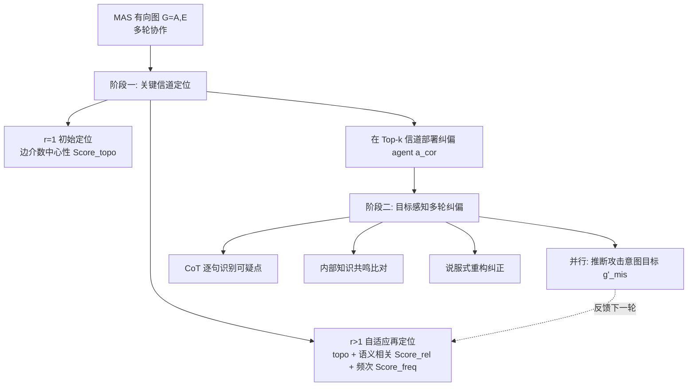

# Goal-Aware Identification and Rectification of Misinformation in Multi-Agent Systems

**会议**: ICLR 2026  
**OpenReview**: [https://openreview.net/forum?id=6Y9NP1qhoM](https://openreview.net/forum?id=6Y9NP1qhoM)  
**代码**: [https://github.com/zhrli324/ARGUS](https://github.com/zhrli324/ARGUS)  
**领域**: 多智能体系统, AI 安全  
**关键词**: Multi-Agent System, Misinformation Injection, Goal-Aware Reasoning, Training-Free Defense, Information Flow  

## 一句话总结
本文提出红队数据集 MisInfoTask 与免训练防御框架 ARGUS，通过"在图上自适应定位关键传播信道 + 目标感知的多轮说服式纠偏"两阶段，专门防御 LLM 多智能体系统中语义无害但事实错误的"错误信息（misinformation）"注入。

## 研究背景与动机
**领域现状**：LLM 多智能体系统（MAS）通过多个 agent 协作处理复杂任务，但复杂拓扑和频繁的 agent 间通信引入了新的攻击面，使系统容易被注入虚假信息。已有防御工作主要走三条路线：对抗式攻防、基于共识的一致性核验、以及针对拓扑图结构的结构化防御。

**现有痛点**：大多数已有方法存在两个共性缺口——（I）防御目标集中在"恶意信息（malicious information）"这种意图明显、易被常规检测拦截的内容上，却忽视了**表面语义无害、事实却错误**的"错误信息（misinformation）"；（II）评测任务过于简单（多为直白的问答），无法反映 MAS 在真实复杂任务下的能力与脆弱性。

**核心矛盾**：错误信息恰恰因为"看起来人畜无害"而极具隐蔽性，能绕过面向恶意内容设计的检测机制；而在 MAS 多轮协作中，哪怕一句微小的事实错误也会被逐轮放大，最终让整条任务链崩溃。本文实测发现，注入错误信息后 MAS 的任务成功率从 87.47% 跌到 67.70%，错误信息毒性（MT）从 1.28 飙升到约 4.71。

**本文目标**：构建一个面向真实复杂任务、以 agent 为中心的错误信息评测基准，并设计一个鲁棒、自适应、高效的防御框架。

**核心 idea**：**[空间定位 + 时间纠偏]** 把 MAS 当作有向图，从**空间维度**自适应地找出错误信息最可能流经的关键通信信道，再从**时间维度**部署纠偏 agent，用 CoT 激活其参数化知识、以"目标感知推理"识别并说服式地纠正错误信息，全程**免训练**。

## 方法详解

### 整体框架
本文有两个产出：评测侧的 **MisInfoTask** 数据集和防御侧的 **ARGUS** 框架。MisInfoTask 含 108 个真实复杂任务，每个任务给出潜在错误信息注入点、参考解题流程，以及 4-8 条"看似可信实则谬误"的论点及其对应 ground truth，覆盖概念推理、事实核验、流程应用、形式语言解释、逻辑分析五类。ARGUS 把 MAS 建模为有向图 $G=(A,E)$，分两阶段运作：先**自适应定位**关键的错误信息传播信道（空间），再在这些信道上部署纠偏 agent $a_{cor}$ 做**目标感知的多轮说服式纠偏**（时间），两阶段每轮迭代联动——纠偏阶段推断出的"攻击意图目标"反过来指导下一轮的信道定位。

### 关键设计

**1. 初始拓扑定位：在没有日志时靠"信息枢纽"布防**。第一轮（$r=1$）开始前还没有任何交互日志，ARGUS 只能依赖图结构判断哪些边最关键。它为每条边 $e$ 计算归一化的**边介数中心性** $\text{Score}_{topo}(e)=\frac{1}{N_{norm}}\sum_{a_i}\sum_{a_j,i\neq j}\frac{\sigma_{ij}(e)}{\sigma_{ij}}$，其中 $\sigma_{ij}$ 是 $a_i,a_j$ 间最短路总数、$\sigma_{ij}(e)$ 是其中经过边 $e$ 的数量——直觉是越多最短路径经过的边越是信息流的咽喉。但只挑分最高的边会让监控扎堆在少数节点，所以 ARGUS 先为每个源节点取其最高分出边 $e_i^*$ 组成 $E_{best}$（保证源节点覆盖广度），再按 $k_1=\min(k,|E_{best}|)$、$k_2=k-k_1$ 从 $E_{best}$ 和剩余边里分别取 Top，合成初始监控集 $E_1$，从而在"信道重要性"和"agent 覆盖广度"之间取得平衡。

**2. 自适应再定位：用上一轮推断的攻击目标重新对焦**。后续轮次（$r>1$）的监控位置是动态的。纠偏 agent 在上一轮会输出它推断的"错误信息意图目标"文本描述，去重后得到目标集 $G'_{mis}$，再映射成嵌入向量集 $V'_{mis}$。对一条消息里的每个句子 $s$，计算它与所有目标嵌入的平均余弦相似度 $S(s,V'_{goal})=\frac{1}{p}\sum_{i=1}^{p}\text{Sim}_{cos}(\Phi(s),v_i')$；消息 $m$ 的相关性取其内部超过阈值 $\theta_{sim}$ 的句子相似度的最大值，边 $e$ 的相关性分 $\text{Score}_{rel}(e)$ 再取该边上所有消息相关性的最大值。最终每条边的综合分 $\text{Score}_r(e)$ 是拓扑重要性、语义相关性 $\text{Score}_{rel}$、通信频次 $\text{Score}_{freq}$ 三者的加权和（权重 $\alpha,\beta,\gamma$），按综合分选 Top-k 作为本轮监控边 $E_r$。这样监控位置就会随着攻击意图逐渐被识别而向真正的污染信道收敛。

**3. 目标感知的说服式纠偏：用 LLM 自己的知识去"说服"被误导的消息**。当消息流经被监控信道时，纠偏 agent $a_{cor}$ 触发一套 CoT 驱动的多阶段处理。先做**多维可疑点识别**，逐句拆解消息，不只找显式事实断言，还挖潜在逻辑矛盾、违背常识、措辞含糊等漏洞；再做**内部知识共鸣**，针对每个可疑锚点激活 LLM 参数里的相关知识簇，与消息中的外部信息做深度语义比对；确认存在关键冲突后进入**启发式说服式重构**，用根因分析、认知重构、上下文自适应调整等策略生成有逻辑说服力的纠正陈述。这里的关键不是简单标记"这是假的"，而是免训练地激活对齐过的 LLM 内部知识、用说服的方式把消息纠回正轨。

**4. 并行的目标感知意图推断：把"防御"反哺成"定位"**。纠偏的同时，$a_{cor}$ 并行执行一个子任务——当它判断当前消息中的错误信息呈现出"高度组织化"或"明显被诱导"的特征时，系统性地记录它对攻击者最可能的误导目标的推断。这条推断正是设计 2 中下一轮自适应再定位的输入 $G'_{mis}$，从而让 ARGUS 在面对持续的、协调一致的错误信息攻击时越打越准——把时间维度上的纠偏经验回灌到空间维度的定位上，形成闭环。

## 实验关键数据

在 MisInfoTask 上跑 5 轮协作，4 个核心 LLM（GPT-4o-mini、GPT-4o、DeepSeek-V3、Gemini-2.0-flash）× 3 种注入攻击（Prompt Injection 提示注入、RAG Poisoning 检索投毒、Tool Injection 工具注入），对比 Self-Check 与 G-Safeguard 两个防御 baseline。

### 主实验（节选 GPT-4o-mini 与 GPT-4o，MT 越低越好 / TSR 越高越好）

| 核心 LLM | 方法 | Avg. MT ↓ | Avg. TSR ↑ |
|---|---|---|---|
| GPT-4o-mini | Attack-only | 5.22 | 67.43 |
| GPT-4o-mini | Self-Check | 5.02 | 68.38 |
| GPT-4o-mini | G-Safeguard | 4.07 | 68.75 |
| GPT-4o-mini | **ARGUS** | **3.43** | **78.43** |
| GPT-4o | Attack-only | 4.90 | 67.07 |
| GPT-4o | Self-Check | 4.75 | 68.39 |
| GPT-4o | G-Safeguard | 4.04 | 65.64 |
| GPT-4o | **ARGUS** | **3.51** | **76.96** |

DeepSeek-V3 上 ARGUS 平均 MT 3.25 / TSR 84.33，Gemini-2.0-flash 上 MT 3.40 / TSR 72.41，四个模型上 ARGUS 均为各组最优。按攻击类型看，ARGUS 平均降 MT：提示注入 -28.18%、RAG 投毒 -20.38%、工具注入 -35.95%。

### 消融实验（DeepSeek-V3，子模块与超参）

| 配置 | PI MT | PI TSR | RP MT | RP TSR | TI MT | TI TSR |
|---|---|---|---|---|---|---|
| Attack only | 4.88 | 69.44 | 4.93 | 63.89 | 4.24 | 70.37 |
| Attack + ARGUS | 3.50 | 75.93 | 3.93 | 70.37 | 2.77 | 87.04 |
| w/o 动态定位 | 4.55 | 68.52 | 4.56 | 64.81 | 3.80 | 74.07 |
| w/o CoT 纠偏 | 3.90 | 71.30 | 4.15 | 68.52 | 2.98 | 82.41 |
| w/o 多轮纠正 | 4.63 | 70.37 | 4.61 | 62.04 | 3.88 | 71.30 |
| w/ Ground Truth | 3.32 | 78.70 | 3.77 | 74.07 | 2.54 | 91.67 |

去掉任一核心模块性能都明显退化；提供 ground truth 后防御能力进一步上限提升。超参消融（Table 3，PI 场景）显示 $\gamma$（频次）与 $\alpha$（拓扑）最关键，单去 $\gamma$ 时 MT 从 3.73 涨到 4.59，但"语义相关性 $\beta$ 是最关键因子，且只有三者结合才达到最优防御"。

### 关键发现
- 通用 MAS 架构对错误信息高度脆弱：无防御时 5 轮内 MT 逐轮单调上升，印证错误信息的"传染性、隐蔽性"；加 ARGUS 后各攻击下 MT 逐轮下降。
- ARGUS 对拓扑结构鲁棒：在 Self-Determination、Chain、Full、Circle、Star 五种拓扑上均能有效检测纠偏，迁移性好。
- 自适应定位推断攻击意图目标的准确率较高，验证了"目标感知"闭环的可靠性。

## 亮点与洞察
- **问题定义有价值**：明确区分"恶意信息"与"错误信息"，把防御焦点对准更隐蔽、更被忽视的后者，并配套了真实复杂任务的红队数据集 MisInfoTask，填补了评测缺口。
- **空间×时间双视角很优雅**：把"在哪监控（图上的边定位）"与"怎么纠正（多轮 CoT 说服）"解耦成空间和时间两条线，并用"意图推断"把两者串成闭环——纠偏越多、定位越准。
- **免训练、即插即用**：不依赖训练，靠激活对齐 LLM 的参数化知识做纠偏，对核心 LLM 与拓扑都有较好迁移性，落地门槛低。

## 局限与展望
- **额外开销**：引入外部纠偏模块带来计算成本与延迟，这是 MAS 防御普遍难以规避的代价，论文未深入量化效率-成本权衡。
- **只覆盖参数化知识类错误信息**：当前主要应对"与 LLM 内部知识冲突"的错误信息；对于依赖动态、时效性强的外部信息（如实时事实）的错误信息，单靠内部知识共鸣会失效，需要更复杂的多组件协同防御。
- **依赖 LLM 判官评分**：MT/TSR 均由 GPT-4o 作为 judge 打分，评测本身可能受判官模型偏差影响。

## 相关工作与启发
- **MAS 信息注入攻击**：Prompt Infection 靠信息传播污染整个 MAS、AgentSmith 用对抗注入毒化大量 agent、Corba 用递归感染传播"病毒"致 MAS 崩溃——这些工作勾勒了 MAS 的攻击面，本文则系统化了其中"错误信息"这一隐蔽子类的防御。
- **MAS 防御策略**：Netsafe 研究 MAS 图安全、AgentSafe 用分层数据管理缓解投毒泄漏、AgentPrune/G-Safeguard 用图剪枝与 GNN 定位高风险 agent。ARGUS 与 G-Safeguard 同样在图上做文章，但不靠 GNN 训练、不做边剪枝，而是"定位 + 说服式纠偏"的免训练路线，是对该方向的有益补充。
- **启发**：把"防御产生的中间推断"反哺给"资源分配/定位"形成闭环，是 agent 系统里值得复用的范式；用 LLM 自身参数知识做"说服式纠正"而非硬性过滤，也提示了一种更温和、可解释的内容治理思路。

## 评分
- 新颖性: ⭐⭐⭐⭐ 首次明确把"错误信息"从"恶意信息"中剥离作为独立防御目标，空间×时间双视角 + 意图推断闭环的设计巧妙，并配套红队数据集。
- 实验充分度: ⭐⭐⭐⭐ 4 个 LLM × 3 种攻击 × 5 种拓扑 × 多 baseline，含子模块与超参消融、逐轮趋势分析，较为完整；但缺对效率/成本的量化。
- 写作质量: ⭐⭐⭐⭐ 动机清晰、公式与流程图齐全，方法两阶段叙述连贯易懂。
- 价值: ⭐⭐⭐⭐ 免训练、对模型和拓扑迁移性好，数据集与框架均开源，对构建可信 MAS 有实际推动作用。

<!-- RELATED:START -->

## 相关论文

- [\[AAAI 2026\] BAMAS: Structuring Budget-Aware Multi-Agent Systems](../../AAAI2026/multi_agent/bamas_structuring_budget-aware_multi-agent_systems.md)
- [\[ICLR 2026\] MARTI: A Framework for Multi-Agent LLM Systems Reinforced Training and Inference](marti_a_framework_for_multi-agent_llm_systems_reinforced_training_and_inference.md)
- [\[ICLR 2026\] MAS²: Self-Generative, Self-Configuring, Self-Rectifying Multi-Agent Systems](mas2_self-generative_self-configuring_self-rectifying_multi-agent_systems.md)
- [\[AAAI 2026\] Beyond Detection: Exploring Evidence-based Multi-Agent Debate for Misinformation Intervention and Persuasion](../../AAAI2026/multi_agent/beyond_detection_exploring_evidence-based_multi-agent_debate_for_misinformation_.md)
- [\[ICLR 2026\] ATLAS: Constraints-Aware Multi-Agent Collaboration for Real-World Travel Planning](atlas_constraints-aware_multi-agent_collaboration_for_real-world_travel_planning.md)

<!-- RELATED:END -->
