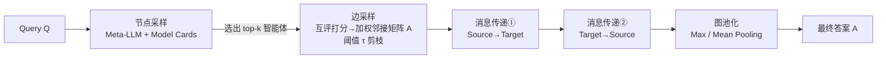

# Graph-of-Agents: A Graph-based Framework for Multi-Agent LLM Collaboration

**会议**: ICLR 2026  
**arXiv**: [2604.17148](https://arxiv.org/abs/2604.17148)  
**代码**: [UNITES-Lab/GoA](https://github.com/UNITES-Lab/GoA)  
**领域**: 多智能体 / LLM 协作  
**关键词**: 多智能体 LLM, 图结构, 消息传递, Mixture-of-Agents, 测试时推理, 智能体选择  

## 一句话总结
GoA 把多 LLM 协作建模成一张动态有向图——先用 model card 选出最相关的少数智能体当节点，再按互评分数构边并做双向消息传递，最后用图池化聚合，仅用 3 个智能体就超过了用满 6 个智能体的 Mixture-of-Agents 等基线。

## 研究背景与动机

**领域现状**：随着开源 LLM 数量爆炸式增长，把多个专长不同的模型在测试时编排起来协同解题成为热门方向。Mixture-of-Agents（MoA）是这条路线的代表，它把所有可用智能体的回答拼接到原始 query 后面再喂给下一层，靠"人多力量大"实现互补。

**现有痛点**：MoA 这种"全员上阵 + 多对一聚合"的范式有三个结构性短板。其一是**不挑人**——无论 query 是什么都把所有智能体都叫来，既带来计算爆炸，又让无关领域的智能体（比如给解剖学问题塞进一个数学模型）注入噪声。其二是**沟通粗糙**——把所有回答当成一整块塞给聚合器，无法刻画智能体两两之间的细粒度交互，也无法按相关性给不同回答加权。其三是**整合昂贵**——拼接所有 token 的复杂度高达 $O(LNd)$（$L$ 层数、$N$ 智能体数、$d$ 每个智能体的 token 长度），而 token 直接等于钱，规模一上去就吃不消。

**核心矛盾**：多智能体协作的收益来自"多样性"，但简单的全连接聚合把多样性变成了噪声和成本的来源——越多智能体，无关回答越多、通信开销越大，反而稀释了真正有用的专家。

**本文目标**：设计一个无需微调、纯靠 prompt 接口、兼容黑盒 API 的测试时框架，能从大池子里自适应选出相关智能体、做有方向的精细沟通、并低成本地整合答案。

**核心 idea（图视角重构多智能体协作）**：把智能体当节点、把"回答相关性"当有向边，用图的语言重新表达多智能体协作——**节点采样**回答"选谁"、**边采样 + 消息传递**回答"怎么沟通"、**图池化**回答"怎么整合"。三个长期被混在一起的问题被拆成图上三个清晰的算子。

## 方法详解

### 整体框架

把 $N$ 个智能体的池子建模成有向图 $G=(V,E)$，针对每条 query 动态构造一个只含相关智能体的子图。流程分四步：meta-LLM 读 model card 选出 top-$k$ 个节点 → 让选中的智能体互评打分构造加权有向边并剪枝 → 沿边做 source→target、target→source 两轮消息传递精炼各自回答 → 用 max/mean 图池化输出最终答案。整套流程纯在 prompt 层面完成，不碰任何模型权重。

### 关键设计

**1. 节点采样（Node Sampling）：让 meta-LLM 看简历挑人**。GoA 不再把 query 广播给全员，而是先从 Hugging Face 的 model card 里提炼每个智能体的三类元信息——所属领域、擅长任务、模型规模与特性，组成"简历"字典。一个通用 meta-LLM（实验里用 Qwen2.5-7B-Instruct）拿到 query 和这些简历后挑出最相关的 $k$ 个智能体：$V_s = \text{Meta-LLM}(\text{Top-}k \mid Q, \text{Model Cards})$。这样生物医学+数学+代码的混合 query 就只会激活对应领域的专家，把法律模型这类无关节点直接挡在门外，从源头避免智能体爆炸和噪声注入。

**2. 边采样与相关性打分（Edge Sampling）：互评定座次**。选出节点后，每个智能体先生成对 query 的初始回答，再去给除自己以外的所有回答打分（排除自评以减小自夸偏差），且每个智能体分配的总分归一化为 1.0。节点 $j$ 的相关性得分由它从别人处收到的分数之和决定：$S_j = \sum_{i \neq j} \text{Score}_{i \to j}$。得分低于阈值 $\tau$（默认 0.05）的弱响应者被剪掉，剩下的节点按得分排成"源节点（高相关、有影响力）"和"目标节点（低相关）"。边权由邻居得分归一化给出：$A_{ji} = S_i / \sum_{k \in N_j} S_k$，让更相关的智能体对邻居施加成比例更大的影响，实现 1 对 1 的精细沟通。

**3. 双向消息传递（Message Passing）：先扶弱、再补强**。这是图结构带来的核心红利，分两步走。第一步 **Source→Target**：让高排名的源节点把更可信的回答传给低排名的目标节点，目标节点据此精炼自己的输出——$R'_j = v_j\big(\|_{i<j} A_{ij} R^{\text{sorted}}_i\big)$，其中 $v_j(\cdot)$ 是智能体 $j$ 的前向、$\|$ 表示拼接邻居回答、$R^{\text{sorted}}$ 按相关性排序。第二步 **Target→Source**：反过来让源节点根据已被改进的目标回答 $R'_j$ 再调整一次——$R''_i = v_i\big(\|_{i<j} A_{ji} R'_j\big)$，从而吸收邻域共识做二次精炼。消融显示这个方向至关重要：把两个方向整体颠倒会带来最大的性能崩塌（MMLU-Pro −2.60、GPQA −5.05），因为让弱节点反客为主会把噪声灌回源节点。

**4. 图池化整合（Graph Pooling）：选一个或加权平均**。最后用图池化把精炼后的回答聚成一个最终答案，避免 MoA 那种拼接所有 token 的高成本。两种策略：$\text{Max-Pooling}$ 直接取入边最多（即最相关）那个源节点的回答 $R''_{\text{max-source}}$；$\text{Mean-Pooling}$ 则让 meta-LLM 按相关性得分加权综合所有选中智能体的回答。形式化为 $A = R''_{\text{max-source}}$（max）或 $A = \text{Meta-LLM}(\text{Average} \mid R'')$（mean），对应 $\text{GoA}_{\text{max}}$ 与 $\text{GoA}_{\text{mean}}$ 两个变体。论文还证明了 **GoA 是 MoA 的严格推广**（命题 1）：当 $k=N$、邻接矩阵全连接且边权全为 1、每层带 query 自环并用 mean 池化时，GoA 就退化成 MoA。

## 实验关键数据

设置：6 个 7–8B 的领域专长 LLM 组成智能体池（General/Code/Math/Biomedical/Finance/Legal），meta-LLM 用 Qwen2.5-7B-Instruct，全部 zero-shot CoT 测试时推理。

### 主实验表格

| 类别 | 方法 | MMLU | MMLU-Pro | GPQA | MATH | HumanEval | MedMCQA |
|------|------|------|----------|------|------|-----------|---------|
| 单智能体 | General (最佳单模型) | 77.61 | 53.90 | 32.83 | 69.00 | 81.50 | 55.22 |
| 多智能体(6) | SC | 77.97 | 54.12 | 36.36 | 69.80 | 82.57 | 55.70 |
| 多智能体(6) | Refine | 77.40 | 54.71 | 38.92 | 71.60 | 80.49 | 54.94 |
| 多智能体(6) | MoA | 75.71 | 53.33 | 32.83 | 65.80 | 76.22 | 54.94 |
| 多智能体(6) | Self-MoA | 78.14 | 54.19 | 33.84 | 68.20 | 79.27 | 55.56 |
| **多智能体(3)** | **GoA_Max** | **79.18** | **54.78** | 39.98 | 69.83 | 84.67 | **60.04** |
| **多智能体(3)** | **GoA_Mean** | 78.52 | 54.27 | **40.54** | **73.12** | **84.98** | 57.92 |

只用 3 个智能体的 GoA 在 6 个 benchmark 上几乎全面超过用满 6 个智能体的所有多智能体基线，GoA_Max 拿下 MMLU / MMLU-Pro / MedMCQA 最佳，GoA_Mean 拿下 GPQA / MATH / HumanEval 最佳。

效率（MMLU-Pro）：相比 MoA，GoA_Max 把 LLM 调用从 19 次降到 11 次、token 从 56.05k 降到 19.18k、延迟从 240s 降到 100s，准确率反而从 53.33 升到 54.78——更省、更快、更准。

扩展到 gpt-4o（GPQA/MedMCQA/HumanEval）：用 8 个智能体的 DyLAN 也被仅用 3 个智能体的 GoA_Max 超过（如 HumanEval 92.07 vs 93.29），印证"精选优于堆量"。

### 消融实验表格

| 配置 | MMLU-Pro | GPQA |
|------|----------|------|
| GoA (Top-k=3, τ=0.05) | 54.78 | 39.98 |
| 颠倒消息传递方向 | 52.18 | 34.93 |
| w/o Target-to-Source | 53.66 | 38.03 |
| w/o Source-to-Target | 52.21 | 36.12 |
| w/o Scoring (A_ij=1) | 52.91 | 37.34 |
| Top-k=2 | 53.54 | 36.75 |
| Top-k=5 | 54.65 | 39.13 |
| τ=0.1 | 53.12 | 38.43 |

### 关键发现
- **方向不能错**：颠倒双向流的代价最大（GPQA −5.05），说明"强扶弱、弱反哺强"的顺序本身就是核心设计，而非可有可无。
- **相关性打分有效**：把边权全设为 1（去掉打分）掉 1.87/2.64，证明按相关性加权确实在过滤噪声。
- **k=3 是甜点**：k=2 信息太少、k=5 引入冗余，top-k=3 在精度和成本间最优。

## 亮点与洞察
- **把三个混沌问题拆成三个图算子**：选谁=节点采样、怎么沟通=边采样+消息传递、怎么整合=图池化，框架优雅且每一步都可单独消融验证。
- **"少即是多"的反直觉结论**：3 个精选智能体打赢 6 个甚至 8 个全员，同时省一半以上 token 和延迟，对成本敏感的真实部署极有吸引力。
- **理论上统一了 MoA**：命题 1 证明 MoA 是 GoA 的一个特例，把 GoA 放到了多智能体框架谱系的更上游。
- **零训练、黑盒兼容**：纯 prompt 接口，可直接套用闭源 API，落地门槛低。

## 局限与展望
- **依赖 model card 质量**：节点采样靠 Hugging Face 简历，若元信息缺失或不准，选人就会失真（论文用阈值 $\tau$ 部分缓解，但治标不治本）。
- **互评打分的开销与偏差**：每个智能体都要给别人打分，节点多时打分本身也会变贵；且 LLM 互评未必可靠。
- **池子规模有限**：实验只到 6–8 个智能体，宣称的"扩展到 10/100"尚未在更大池子上验证，图构造与多轮消息传递在超大池下的成本曲线仍是未知数。
- **单跳图、固定两步**：消息传递写死两步、图层数浅，更深的多跳推理或自适应层数尚待探索。

## 相关工作与启发
- **vs MoA / Self-MoA**：从"全连接多对一聚合"升级为"稀疏有向图 + 加权消息传递"，GoA 形式化地把 MoA 收编为特例。
- **vs MacNet / GPTSwarm**：后者把智能体放进**预定义的静态 DAG**，GoA 则按 query 相关性**动态建图**，更灵活。
- **vs DyLAN**：DyLAN 靠前后向同行评分做动态激活但需固定的时序前馈网络，GoA 的双向消息传递更轻量且无需额外优化。
- **承接 Graph-of-Thought 系列**：把"思维图"的结构化思想从单模型内部推理迁移到多模型间协作，是一条自然的延伸。

## 评分
- **新颖性**: ⭐⭐⭐⭐ 用图结构统一"选/通/合"三问题并证明推广 MoA，视角清晰且有理论支撑，虽然图+消息传递在多智能体里非首创，但相关性打分+双向流的组合有新意。
- **实验充分度**: ⭐⭐⭐⭐ 6 个 benchmark + 效率分析 + gpt-4o 扩展 + 细致消融（方向/打分/top-k/τ）覆盖到位，唯一遗憾是池子规模未真正放大到 10/100 级别验证可扩展性。
- **写作质量**: ⭐⭐⭐⭐ 三问题串联的叙事干净，图算子类比直观，公式与 pipeline 图清楚。
- **价值**: ⭐⭐⭐⭐ "3 个打赢 6 个还更省"的结论对成本敏感的多智能体部署很有实用价值，零训练黑盒兼容降低落地门槛。

<!-- RELATED:START -->

## 相关论文

- [\[AAAI 2026\] Scalable and Accurate Graph Reasoning with LLM-Based Multi-Agents](../../AAAI2026/multi_agent/scalable_and_accurate_graph_reasoning_with_llm-based_multi-agents.md)
- [\[ICLR 2026\] GraphPlanner: Graph Memory-Augmented Agentic Routing for Multi-Agent LLMs](graphplanner_graph_memory-augmented_agentic_routing_for_multi-agent_llms.md)
- [\[ACL 2026\] MASFactory: A Graph-centric Framework for Orchestrating LLM-Based Multi-Agent Systems with Vibe Graphing](../../ACL2026/multi_agent/masfactory_a_graph-centric_framework_for_orchestrating_llm-based_multi-agent_sys.md)
- [\[ICLR 2026\] Unlocking the Power of Multi-Agent LLM for Reasoning: From Lazy Agents to Deliberation](unlocking_the_power_of_multi-agent_llm_for_reasoning_from_lazy_agents_to_deliber.md)
- [\[AAAI 2026\] A Graph-Theoretical Perspective on Law Design for Multiagent Systems](../../AAAI2026/multi_agent/a_graph-theoretical_perspective_on_law_design_for_multiagent_systems.md)

<!-- RELATED:END -->
