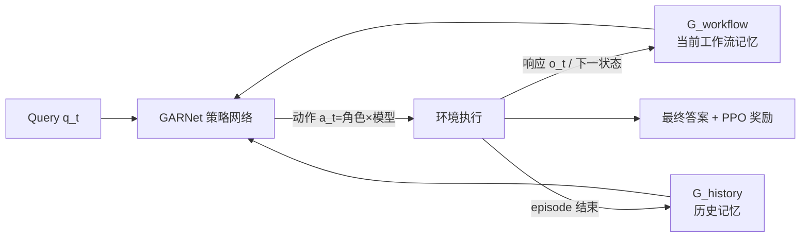

# GraphPlanner: Graph Memory-Augmented Agentic Routing for Multi-Agent LLMs

**会议**: ICLR 2026  
**代码**: [https://github.com/ulab-uiuc/GraphPlanner](https://github.com/ulab-uiuc/GraphPlanner)  
**领域**: 多智能体系统 / LLM 路由  
**关键词**: LLM 路由, 多智能体协作, 异构图记忆, 强化学习, 工作流生成  

## 一句话总结
GraphPlanner 把多模型 LLM 路由从"选一个模型"升级为"生成一条多智能体工作流"，用异构图记忆网络 GARNet 同时编码当前工作流与历史交互，并用 PPO 联合优化任务效果与计算开销，在 14 个任务上准确率最高提升 9.3% 而 GPU 训练开销从 186 GiB 降到 1 GiB。

## 研究背景与动机
**领域现状**：LLM 路由（routing）已成为整合多个异构模型、平衡效果与成本的关键手段。现有路由器分两类——单轮路由器（RouterDC、GraphRouter 等）根据 query 嵌入或分类器一次性把请求分给某个模型，简单高效；多轮路由器（Router-R1、R2-Reasoner）则在多次调用间交替推理与路由，更灵活。

**现有痛点**：单轮路由器无法分解任务、无法跨模型协调，面对复杂 query 力不从心；多轮路由器虽引入上下文，却把每次调用当成独立事件，**不显式建模模型间的协作**，导致冗余调用、上下文语义冲突，也没法发挥不同模型的互补优势。两类方法都停留在"选模型"，而没进入真正需要规划、分工、记忆的 agentic 场景。

**核心矛盾**：agentic LLM 系统天然需要"哪个模型 + 扮演什么角色"的联合决策，但这带来三重困难——(1) query/response/候选模型之间的关系高度异构且会随工作流演化分叉、交互甚至冲突；(2) 早期路由决策对最终结果有长程影响，是典型的**延迟奖励 / 信用分配**难题；(3) agentic 系统积累了大量历史交互轨迹（成功协作模式、错误模式、高效分工），现有路由器几乎不加利用。

**本文目标**：把路由从单纯的模型选择，泛化成**多智能体协调问题**——路由器既要决定调用哪个 LLM 骨干，也要决定在每一步激活哪个角色（Planner / Executor / Summarizer），从而把一串独立调用变成结构化工作流。

**核心 idea**：**图记忆 + MDP + RL 三件套**。把 agentic 工作流的生成建模为马尔可夫决策过程（MDP），动作是"角色×模型"对；用一张异构图 GARNet 同时承载当前工作流记忆与历史记忆，靠共享的"角色枢纽节点"把两张图缝在一起；最后用 PPO 端到端联合优化任务效果与开销。

## 方法详解

### 整体框架
GraphPlanner 把"为一条 query 生成 agentic 路由工作流"建成一个序贯决策过程：每一步，策略网络在 GARNet 的指引下输出一个动作（同时指定 LLM 骨干和角色），环境据此执行子任务、产生中间响应，并把这条轨迹增量地并入工作流记忆图 $G_{\text{workflow}}$；一个 episode 结束后，整条轨迹再被固化进历史记忆图 $G_{\text{history}}$。GARNet 把这两张图融合成状态表示，整条流水线用 PPO 优化。

### 关键设计

**1. 把工作流生成建成带角色的 MDP：让路由器学会"分工"而不只是"选型"** GraphPlanner 把状态定义为当前待解的 query $s_t = q_t$，动作是一个对 $a_t = (\alpha_t, m_t)$——$\alpha_t$ 从 {planner, executor, summarizer} 中选角色，$m_t$ 从 $K$ 个候选骨干里选模型，因此动作空间 $|A| = 3K$。三个角色各司其职：planner 把复杂 query 分解成原子子 query，executor 在有/无上下文下生成回答，summarizer 把多路输出聚合成连贯答案。为了保证工作流语义合法，作者加了一个**动态掩码** $M_t$：第一步禁止 summarizer（$M_0$ 只含 planner/executor），最后一步只允许 executor 收尾（$M_T$），并用超参 $P_{\max}$ 限制 planner 出现次数防止无限分解。转移函数则根据角色更新状态——planner 时 $s_{t+1}$ 跳到第一个子 query，executor 时跳到下一个待解 query，summarizer 时跳到汇总 query。

**2. 奖励兼顾效果与成本，直面延迟奖励** 奖励函数把任务效用和路由开销绑在一起：
$$r_t = \begin{cases} U(\hat{y}, y^*) - \alpha\, C(a_t), & t = T \ (\text{终止}) \\ -\alpha\, C(a_t), & t < T \ (\text{中间步}) \end{cases}$$
其中 $U(\hat{y}, y^*)$ 是任务相关效用（准确率、BLEU、MRR 等），$C(a_t)$ 是动作的计算开销，$\alpha>0$ 调节效用与成本的权衡。只有终止步才拿到任务效用奖励，中间步全是负的开销惩罚——这正对应了 agentic 路由"早期决策影响全局"的延迟奖励特性，逼着策略去做长程信用分配。目标是最大化折扣回报 $\max_\pi \mathbb{E}_{q\sim Q}[\sum_{t=0}^T \gamma^t r(s_t,a_t)]$。

**3. GARNet 异构图 + 共享角色枢纽节点：把当前工作流和历史记忆缝在一起** 策略 $\pi(a_t|s_t)$ 由异构图神经网络 GARNet 参数化，每步把环境表示为 $G_t = G_{\text{workflow}} \cup G_{\text{history}}$。节点分三类：query 节点 $x_q$（Longformer 嵌入）、response 节点 $x_r$、以及**角色枢纽节点** $x_m = [e_{\text{role}}; U; C]$（把"LLM-角色"文本嵌入和效用、成本拼起来）。关键巧思在于：每个 (LLM, 角色) 对只维护**一个固定的角色枢纽节点**，无论哪一轮生成的 query/response 都连到这同一批枢纽节点上。这样多轮路由不再新增角色节点，而是通过"共享邻居"隐式连接不同轮次，免去显式时间边，让 GARNet 自然复用累积知识。$x_m$ 同时被 $G_{\text{workflow}}$ 和 $G_{\text{history}}$ 共享，成为两张图之间信息交换的桥梁。

**4. 嵌套双图编码 + 状态融合打分** 编码采用"先历史后工作流"的嵌套方案：先编码历史图得到角色枢纽节点的更新嵌入 $H^{(\text{his})} = \text{GARNet}_{\theta_{\text{his}}}(G_{\text{history}})$，再把它注入工作流图编码器 $H^{(\text{loc})} = \text{GARNet}_{\theta_{\text{loc}}}(G_{\text{workflow}}; H^{(\text{his})})$，得到局部上下文化的表示。打分时把当前 query 嵌入投影成 $z_t = f_{\text{trans}}(s_t)$，与每个候选动作对应的 LLM-角色节点嵌入 $h_{m,j}$ 算兼容度 $\text{score}_j = z_t^\top h_{m,j}$，经掩码 $M_t$ 后 softmax 成动作分布。整个策略网络用 PPO（actor-critic）训练。

## 实验关键数据

### 主实验表格

**Phase 1（在给定工作流内优化路由），Depth=1/Width=3：**

| Router | Math | Code | CS | WK | Popular | Avg Acc | Cost |
|---|---|---|---|---|---|---|---|
| Router-KNN* | 48.1% | 70.0% | 84.7% | 29.4% | 27.0% | 54.8% | 1508.9 |
| RouterDC* | 41.5% | 52.0% | 85.3% | 25.0% | 30.0% | 50.3% | 1689.3 |
| GraphRouter* | 41.5% | 48.0% | 59.3% | 29.5% | 44.1% | 45.8% | 797.4 |
| **GraphPlanner** | **55.0%** | **72.0%** | 76.6% | **33.0%** | **47.0%** | **58.6%** | 900.4 |

**Phase 2（联合生成工作流 + 选模型）：**

| Setting | Avg Acc | Avg Cost | Avg LLM Calls |
|---|---|---|---|
| RouterDC（单轮最强） | 54.3% | 138.7 | 1 |
| Router-R1（多轮最强） | 51.8% | 76.3 | 1.8 |
| R2-Reasoner（多轮） | 50.1% | 643.6 | 5.4 |
| **GraphPlanner** | **63.6%** | 605.0 | 8.1 |

Phase 2 中 GraphPlanner 平均准确率比最强 baseline 高 **+9.3%**，且 5 个场景里 4 个拿 SOTA。

### 消融实验表格

**训练开销对比（Phase 2 training）：**

| Router | Used Tokens | GPU Compute | Avg Train Calls |
|---|---|---|---|
| RouterDC | 64.87M | 10.56 GiB | 1 |
| Router-R1 | 150.36k | **186.26 GiB** | 1.18 |
| **GraphPlanner** | 182.45k | **1.04 GiB** | 4.25 |

**未见数据集上的零样本泛化（Phase 2）：**

| Router | LogicGrid | MGSM | CommonGen | Avg Acc |
|---|---|---|---|---|
| RouterDC | 32% | 82% | 60% | 58% |
| Router-R1 | 24% | 40% | 48% | 38% |
| **GraphPlanner** | **60%** | **92%** | **82%** | **78%** |

### 关键发现
- **效果-成本双赢**：相比 Router-R1，GraphPlanner 把训练 GPU 开销从 186.26 GiB 砍到 1.04 GiB（约 1/180），同时准确率反而更高；在不同 $\alpha\in\{0,0.1,0.3,0.5,0.9\}$ 下始终落在效果-成本的 Pareto 前沿。
- **强泛化**：未见任务上平均 78% 准确率，比此前路由器高 20–40 个百分点；无需微调即可处理未见过的 LLM 骨干。
- **历史记忆有效**：GARNet 同时建模历史与当前工作流记忆，既支持高效的归纳推理（inductive），也支持效果更强但开销更高的直推推理（transductive）。
- **工作流生成 > 固定工作流**：Phase 2（生成工作流）平均准确率比 Phase 1（固定工作流内优化）高约 5%，且在 Math/Code 等推理任务上增益最明显。

## 亮点与洞察
- **把"路由"重新定义为"工作流生成"**：从单步选模型升维到序贯地选"角色×模型"，这一视角让路由器第一次能显式表达分解、分工、协作，而不只是负载均衡。
- **共享角色枢纽节点是点睛之笔**：用一组固定的 (LLM, 角色) 枢纽节点把多轮、历史、当前工作流三种信息汇聚到同一接口，避免了每步新建节点导致图爆炸，也省掉了显式时间边——这是让异构图能跨轮复用记忆的关键工程巧思。
- **小模型路由器办大事**：GraphPlanner 自身是个轻量级图网络，却能编排 12 个不同规模的 LLM，证明"调度智能"和"被调度的算力"可以解耦。

## 局限与展望
- **角色集合固定为三类**：Planner/Executor/Summarizer 虽覆盖了 agentic 工作流的基本分工，但真实复杂任务可能需要更细粒度或可学习的角色定义，作者未探讨角色集合的可扩展性。
- **transductive 模式成本偏高**：直推推理虽然效果更好，但要访问历史记忆图，开销与延迟更大，实际部署需要在 inductive/transductive 间权衡。
- **奖励依赖 ground-truth 效用**：训练时需要任务标签来算 $U(\hat{y},y^*)$，对没有明确正确答案的开放式生成任务，奖励设计仍是开放问题。
- **超参敏感**：$P_{\max}$（planner 上限）、$\alpha$（成本权衡）等需要按任务调，自动化这些选择是值得跟进的方向。

## 相关工作与启发
- **单轮路由**：RouterDC（双对比学习区分多个 LLM）、GraphRouter（把路由建成异构图上的节点分类）——GraphPlanner 继承了图建模思路，但从"分类"升级为"序贯生成"。
- **多轮路由**：Router-R1（RL 交替 think/route）、R2-Reasoner（多步内部推理后再选专家）——这些方法引入了上下文与 RL，但缺少显式的协作建模与历史图记忆，正是 GraphPlanner 补的缺口。
- **多智能体协作**：借鉴了 Planner/Executor/Summarizer 的经典分工范式，把它和路由问题嫁接。对后续工作的启发是：**记忆图 + RL** 这套组合可以推广到更广义的 agent 编排（工具调用、检索、代码执行），而不局限于 LLM 选型。

## 评分
- **新颖性**: ⭐⭐⭐⭐⭐ 把 LLM 路由从"选模型"重新定义为"多智能体工作流生成"，并用共享角色枢纽节点的异构图记忆统一历史与当前上下文，视角和机制都新。
- **实验充分度**: ⭐⭐⭐⭐ 14 任务 6 领域、两阶段评测、9 个 baseline、Pareto 曲线、未见任务/未见模型泛化、训练开销对比，覆盖很全；略缺对角色集合、奖励设计的深入消融。
- **写作质量**: ⭐⭐⭐⭐ 动机、挑战、方法层层递进，图 1/图 2 把三类路由器和整体流程讲得清楚；公式与符号偏多，初读门槛略高。
- **价值**: ⭐⭐⭐⭐⭐ 在准确率提升的同时把训练开销降两个数量级，对真实多模型 agentic 系统的成本-效果权衡有直接实用价值，代码已开源。

<!-- RELATED:START -->

## 相关论文

- [\[ACL 2026\] Memory-Augmented LLM-based Multi-Agent System for Automated Feature Generation on Tabular Data](../../ACL2026/multi_agent/memory-augmented_llm-based_multi-agent_system_for_automated_feature_generation_o.md)
- [\[ICLR 2026\] Graph-of-Agents: A Graph-based Framework for Multi-Agent LLM Collaboration](graph-of-agents_a_graph-based_framework_for_multi-agent_llm_collaboration.md)
- [\[ICLR 2026\] Multi-Agent Debate with Memory Masking (MAD-M²)](multi-agent_debate_with_memory_masking.md)
- [\[ICLR 2026\] WideSearch: Benchmarking Agentic Broad Info-Seeking](widesearch_benchmarking_agentic_broad_info-seeking.md)
- [\[ICLR 2026\] Learning to Summarize by Learning to Quiz: Adversarial Agentic Collaboration for Long Document Summarization](learning_to_summarize_by_learning_to_quiz_adversarial_agentic_collaboration_for_.md)

<!-- RELATED:END -->
