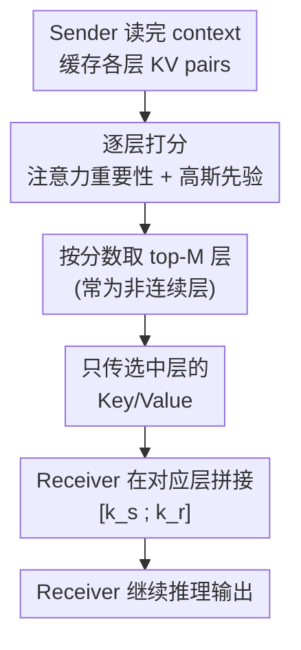

# KVComm: Enabling Efficient LLM Communication through Selective KV Sharing

**会议**: ICLR 2026  
**arXiv**: [2510.03346](https://arxiv.org/abs/2510.03346)  
**代码**: 待确认  
**领域**: Agent / LLM 效率  
**关键词**: LLM communication, KV cache sharing, multi-agent LLM, selective layer, attention importance  

## 一句话总结
提出 KVComm 框架通过选择性共享 KV pairs 实现 LLM 间高效通信，发现 hidden states 存在"信息集中偏差"使其不适合跨模型传递，设计基于注意力重要性 + 高斯先验的层选择策略，仅传输 30% 层即可超越大多数 baseline。

## 研究背景与动机
**领域现状**：多 LLM 协作场景需要高效通信机制，现有方法传递 hidden states 或全部 KV cache。

**现有痛点**：① Hidden states 的 last token 在深层最关键但传递会覆盖 Receiver 信息；② 全 KV cache 传输量太大。

**核心矛盾**：通信效率 vs 信息完整性的平衡。

**本文要解决**：找到最适合跨 LLM 传递的表示形式和选择策略。

**切入角度**：系统对比 hidden states 和 KV pairs，发现 KV pairs 天然适合——可按层选择传递且不覆盖 Receiver 信息。

**核心idea**：KV pairs 是最佳通信介质；选中间层（语义最丰富）+ 高注意力层 → 最优子集。

## 方法详解

### 整体框架
KVComm 要解决的是「多个同源 LLM 协作时该怎么把上下文信息高效地传给对方」。它的做法是：Sender 照常读完自己的 context、缓存好各层的 KV pairs，但不把全部层都发出去，而是先用一个轻量打分函数给每层算个「值不值得传」的分数，挑出 top-$M$ 层，只把这几层的 Key/Value 发给 Receiver；Receiver 收到后在对应层把两方的序列拼起来——$\mathbf{k}_r^l \leftarrow [\mathbf{k}_s^{l_i}; \mathbf{k}_r^l]$——再继续往下推理。整套机制零训练，唯一的「智能」全在打分选层这一步：选对了语义最丰富、注意力最集中的少数几层，传 30% 的层就能超过传全部 hidden states 的方法。

### 关键设计

**1. 选 KV pairs 而非 hidden states 作通信介质：避免覆盖 Receiver 自身表示**

直观上 hidden states 是每层最完整的表示，似乎最该传。但作者发现它有「信息集中偏差」——last token 在深层承载了几乎全部上下文信息，而一旦把它传给 Receiver，就等于直接替换掉 Receiver 在该层的对应表示，把对方自己的推理状态冲掉了。KV pairs 则是 Attention 的输入而非输出：把 Sender 的 $\mathbf{k}_s$、$\mathbf{v}_s$ 拼接到 Receiver 的 KV 序列后端，Receiver 的 Query 只是多了一些可以 attend 的 Key，原有表示一个字节都没动。这种「加法而非替换」让 softmax 注意力能自己决定要不要、用多少 Sender 信息，无用部分被自然地低权重化，因此 KV 通信天生比 hidden states 温和、可控。

**2. 注意力重要性 + 高斯先验的层选择打分：用一个校准样本就挑出最优子集**

既然只传部分层，就要量化每层值不值得传。作者给每层算两个分数再加权：一是注意力重要性，把该层所有 head、所有 query 对各 context token 的注意力求平均，

$$\hat{S}_a^l = \frac{1}{H|Q|}\sum_h\sum_q\sum_c a_{h,q,c}^l$$

注意力越集中说明这层对上下文越「在意」、信息量越大（对应作者验证过的假设 H2：注意力分布更集中的层信息量更大）；二是一个高斯先验 $P^l = \exp\!\big(-\frac{(l-\mu)^2}{2\sigma^2}\big)$，把分数往网络中间层倾斜——因为底层只管语法、低级特征，顶层又过于绑定 next-token 预测，唯有中层的语义与世界知识最通用、最可跨模型迁移（对应假设 H1：中间层的 KV 含最可迁移的语义知识）。两项加权得最终分数 $S^l = \alpha S_a^l + (1-\alpha) P^l$，取 top-$M$ 层传输。这套打分只需 **1 个校准样本**就足够稳健，部署成本极低；而且实验里挑出的层往往是非连续的，比 DroidSpeak 那种连续 chunk 选层更灵活。两条假设各自撑起分数里的一项，也解释了为什么传 30% 层就能超越多数 baseline——传得少不是妥协，而是把真正有用的几层精准挑了出来。

## 实验关键数据

### 主实验（9 模型对，8 数据集）

| 模型 | 方法 | Countries | HotpotQA | MultiFieldQA |
|------|------|-----------|----------|-------------|
| Llama-3.2-3B | Skyline | 0.57 | 0.73 | 0.47 |
| Llama-3.2-3B | KVComm(0.5) | **0.57** | 0.57 | **0.51** |
| Llama-3.2-3B | NLD | 0.51 | 0.47 | 0.38 |
| Llama-3.2-3B | AC | 0.35 | 0.32 | 0.29 |

### 消融实验

| 传输比例 | 效果 |
|---------|------|
| 30% 层 | 超越 NLD/CIPHER/AC 所有 baseline |
| 50% 层 | 接近 Skyline |
| 70% 层 | 逼近或超越 Skyline |
| 非连续 vs 连续选择 | 非连续显著更优 |

### 关键发现
- 仅 30% 层 KV 即可超越大多数 baseline——选择性 > 全量
- MultiFieldQA 上超越 Skyline（0.51 vs 0.47）——选择性共享有正则化效应
- AC 方法多数数据集接近 no-communication baseline
- 计算量比 NLD 减少 2.5x-6x

## 亮点与洞察
- **Hidden states 信息集中偏差**是重要发现，对所有基于 hidden states 的 LLM 通信方法有警示
- **"少即是多"**——30-50% 层 KV 效果优于全量 hidden states
- **高斯先验选中间层**虽简单但有效
- 1 个校准样本即可确定层选择，部署极其轻量

## 局限与展望
- 仅支持同 base model 间通信，不支持异构模型
- 层索引须一一对应，限制不同规模模型间通信
- 高斯先验的 $\mu$、$\sigma$ 需调参
- 仅验证两个 agent 场景
- 数学推理上提升不明显

## 相关工作与启发
- **vs NLD**: NLD 压缩为自然语言，信息损失大；KVComm 直接传递内部表示
- **vs CIPHER**: CIPHER 传 hidden states，受信息集中偏差影响
- **vs DroidSpeak**: DroidSpeak 连续 chunk 选层不如非连续选择灵活
- 可启发 multi-agent LLM 系统设计：KV cache 共享可能成为标准通信原语

## 补充技术细节

### 为什么 KV Pairs 比 Hidden States 更适合通信？
Hidden states 在每层都是一个完整的表示，直接传递会覆盖 Receiver 的对应层表示。而 KV pairs 是 Attention 机制的输入，拼接到 Receiver 的 KV 后不会破坏原有信息，而是让 Attention 机制自然地决定关注哪些信息。这种"加法而非替换"的特性是 KV 通信的核心优势。

### 中间层为什么最有价值？
研究表明 LLM 的层可以大致分为三个功能区：底层（低级特征、语法）、中层（语义知识、世界知识）、顶层（任务特定表示、下一 token 预测）。中层的语义知识最通用、最可迁移，而底层太低级、顶层太任务特定，都不适合跨模型传递。

### 与 Prompt Compression 的关系
KVComm 可以看作一种“在 KV 空间做 prompt compression”——不是压缩文本，而是压缩内部表示的“层”维度。这比 NLD（将知识压缩为自然语言）保留了更多细粒度信息。未来可以探索在层内进一步压缩（如选择性 token），实现“层 + token”双维度压缩。

### KV 拼接的 Attention 机制
当 Sender 的 KV 拼接到 Receiver 后，Receiver 的 Query 可以自由地 attend 到两方的 Key。由于 Attention 是 softmax 归一化的，无用信息会被自然地低权重化。这比直接替换 hidden states 更「温和」——不会强制覆盖任何信息。

## 评分
- 新颖性: ⭐⭐⭐⭐ 系统对比通信介质，层选择策略合理
- 实验充分度: ⭐⭐⭐⭐ 9 模型对×8 数据集
- 写作质量: ⭐⭐⭐⭐ 假设-验证逻辑清晰
- 价值: ⭐⭐⭐⭐ 对 multi-LLM 协作有实际指导意义

<!-- RELATED:START -->

## 相关论文

- [\[ICLR 2026\] Learning Efficient and Interpretable Multi-Agent Communication](learning_efficient_and_interpretable_multi-agent_communication.md)
- [\[ICLR 2026\] Stop Wasting Your Tokens: Towards Efficient Runtime Multi-Agent Systems](stop_wasting_your_tokens_towards_efficient_runtime_multi-agent_systems.md)
- [\[AAAI 2026\] iMAD: Intelligent Multi-Agent Debate for Efficient and Accurate LLM Inference](../../AAAI2026/multi_agent/imad_intelligent_multi-agent_debate_for_efficient_and_accura.md)
- [\[ACL 2026\] CIA: Inferring the Communication Topology from LLM-based Multi-Agent Systems](../../ACL2026/multi_agent/cia_inferring_the_communication_topology_from_llm-based_multi-agent_systems.md)
- [\[ICLR 2026\] Benefits and Limitations of Communication in Multi-Agent Reasoning](benefits_and_limitations_of_communication_in_multi-agent_reasoning.md)

<!-- RELATED:END -->
