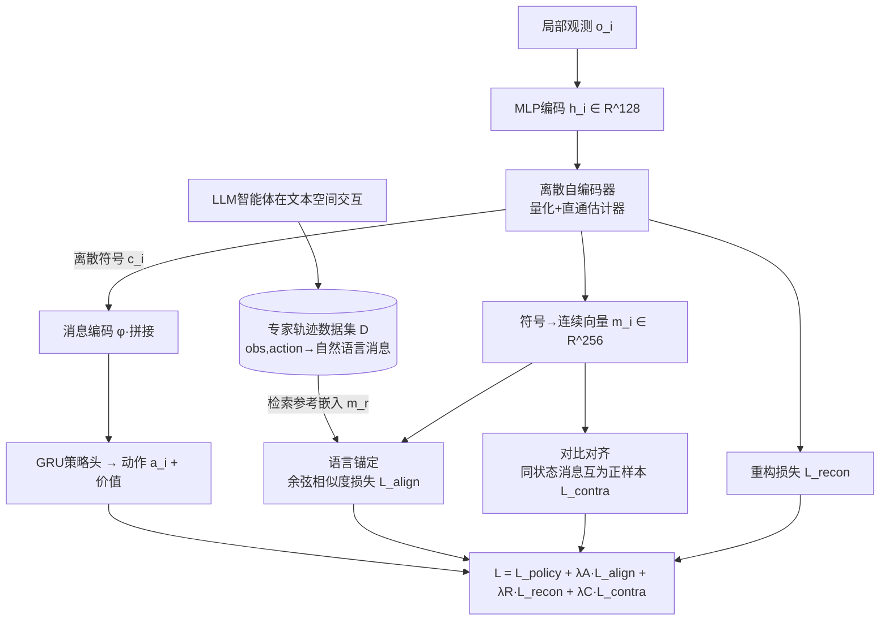

# Learning Efficient and Interpretable Multi-Agent Communication

**会议**: ICLR 2026  
**OpenReview**: [https://openreview.net/forum?id=a3CUE06G5Y](https://openreview.net/forum?id=a3CUE06G5Y)  
**代码**: 待确认  
**领域**: 多智能体 / 通信学习  
**关键词**: 多智能体通信, 离散通信协议, 信息瓶颈, LLM 语义对齐, 对比学习, 可解释性  

## 一句话总结
GLC 把"离散自编码器压缩 + LLM 离线语义锚定 + 智能体间对比对齐"统一进信息瓶颈框架，让多智能体学到的通信协议同时做到带宽极省、任务表现强、还能被人读懂，破解了通信效率—任务效用—可解释性的"三难困境"。

## 研究背景与动机

**领域现状**：在部分可观测环境下，多智能体强化学习（MARL）必须靠通信突破各自的感知盲区才能协同。已有方法大体分三派——重效用派（CommNet、IC3Net、TarMAC、MAGIC）端到端学连续通信向量，任务表现强但协议不透明且带宽高；重效率派（aeComm、VQ-VIB）用自编码器把观测压成离散符号，省带宽但符号没有语义、无法泛化到陌生伙伴；重可解释派（LangGround 等）借预训练语言模型把通信向量接到自然语言语义，可读但又退回连续表示、通信开销大。

**现有痛点**：三者各占一角，没人能同时满足。**核心矛盾**正是论文反复强调的"三难困境"——任务效用（utility）、通信复杂度（complexity，即带宽）、信息量/可解释性（informativeness）三者天然互斥：压得越狠越难解读，解读越好往往越费带宽，二者都让位时任务又做不好。

**本文目标**：学一套通信协议，三个维度同时拿高分，并且能随任务侧重点自适应调整。

**核心 idea（信息瓶颈视角统一三难）**：论文用 IB 原理把三难困境形式化为"在最小化消息复杂度的同时最大化对任务有用的信息量"，再用三个互补模块各自对应一个角——**离散自编码器**管压缩（降复杂度）、**LLM 语言锚定**管语义可读（保信息量/可解释）、**对比学习**管智能体间一致性（保效用）。更关键的一个设计是**训练—部署解耦**：训练时借 LLM 专家轨迹和对比损失做监督，推理时智能体只靠离散符号互通，完全不依赖外部监督。

## 方法详解

### 整体框架
GLC（Grounding Language and Contrastive learning）由四个模块协同：MARL 智能体模块用离散自编码器把局部观测压成符号、生成动作；LLM 智能体模块在文本空间里跑出富含语义的专家轨迹作为离线数据集 $\mathcal{D}$；MARL-LLM 语言锚定模块把离散符号的嵌入对齐到 LLM 生成消息的嵌入；通信对齐对比学习模块逼所有智能体对同一状态说"同一种话"。四个模块由一个多目标损失联合优化，调度器按 IB 退火思想动态调权重。

### 关键设计

**1. 离散自编码器压缩：用量化符号把带宽压到几十比特。** 每个智能体的观测先经 MLP 编成 128 维特征 $h_i^{t-1}$，再由一个 3 层 MLP 自编码器把它映成离散通信符号 $c_i^{t-1}$，解码端再重构回 $\hat{h}_i^{t-1}$。量化导致梯度断裂，作者用直通估计器（straight-through estimator）让梯度照常回传，并加一个重构辅助损失 $\mathcal{L}_{recon}=\lVert h_i^{t-1}-\hat{h}_i^{t-1}\rVert_2^2$ 保证压缩不丢关键信息。下一时刻智能体把收到的所有符号 $c^{t-1}$ 线性投影、拼接、过 3 层 MLP 得到固定维消息表示 $\phi(c^{t-1})$，与自身特征拼接后喂给 GRU 策略头输出动作分布和价值。正是这一离散化让每步通信量降到 32 比特量级，相比连续向量方法少了两到三个数量级。

**2. LLM 离线语义锚定：让符号"说人话"而推理时不挂 LLM。** 通信符号本身没有先天语义，GLC 借 LangGround 的思路，让若干 LLM 具身智能体在一个与物理任务空间信息等价的文本空间里交互——通过文本接口 $I$ 双向转换自然语言描述与抽象表示，LLM 在通用任务指令下自发产生消息和动作，沉淀成专家轨迹数据集 $\mathcal{D}$（(观测,动作)→自然语言消息的映射）。训练时，MARL 智能体把离散符号映成 256 维向量 $m_i=\phi(c_i^t)$，按当前 (观测,动作) 从 $\mathcal{D}$ 检索语义相关的参考消息嵌入 $m_r$，用条件余弦对齐损失把二者拉近：

$$\mathcal{L}_{align}=\mathbb{I}_{\mathcal{D}}(o_i^t,a_i^t)\cdot\left(1-\frac{(m_i^t)^\top m_r}{\lVert m_i^t\rVert\cdot\lVert m_r\rVert}\right)$$

指示函数 $\mathbb{I}_{\mathcal{D}}$ 只在该状态-动作对存在于专家集时才启用监督。这样符号被钉进与人类语言共享的语义空间，可读性来自训练期 LLM 监督，但推理期完全不需要再调 LLM——这就是训练—部署解耦的来源。

**3. 通信对齐对比学习：逼所有智能体"对同一情境说同一种话"。** 光有人话语义还不够，多个智能体可能各说各话导致互不理解。GLC 对每条消息 $m_i^t=\phi(c_i^t)$，把同一轨迹里时间窗 $[t-w,t+w]$ 内其他智能体观测同一状态时产生的消息当作正样本集 $H(m_i^t)$，把同 batch 其他轨迹的消息当负样本，优化有监督对比损失：

$$\mathcal{L}_{contra}=\sum_{m_i^t}\frac{-1}{|H(m_i^t)|}\sum_{m_h\in H(m_i^t)}\log\frac{\exp(m_i^t\cdot m_h/\rho)}{\sum_{m_z\in Z(m_i^t)}\exp(m_i^t\cdot m_z/\rho)}$$

其中 $\rho$ 是温度（设为 0.1）、$Z$ 是 batch 内除自身外所有消息。时间窗设为 5 步，嵌入先归一化。这一项保证协议在全体智能体间一致、可互通，从而支撑高任务效用与对陌生队友的泛化。

**4. 多目标动态退火：用调度而非静态超参实现"先学语义再压缩"。** 四个损失合成 $\mathcal{L}=\mathcal{L}_{policy}+\lambda_A\mathcal{L}_{align}+\lambda_R\mathcal{L}_{recon}+\lambda_C\mathcal{L}_{contra}$，但 GLC 不把权重当固定超参，而是按 IB 退火思想动态调度：$\lambda_A$（对齐权重）按任务预设——USAR 这类需要丰富语义的复杂任务给高值偏可解释，Predator-Prey 给低值偏任务表现；$\lambda_R$（压缩权重）用线性退火从 0.01 缓慢升到 0.1，落实"先充分探索语义、再逐步加压压缩"的 explore-then-compress 策略；$\lambda_C$（一致性权重）固定中等值提供稳定共识信号。一个轻量调度器在训练中实时更新这些权重，使协议随任务约束和学习阶段自适应演化，而非停在一个静态折中点。

## 实验关键数据

在 Predator-Prey（ppv1 局部可视 / ppv0 全盲）和 USAR（城市搜救，异构角色）两类基准上，对比 IC3Net、aeComm、LangGround、VQ-VIB 和无通信基线 noComm，回答 Q1–Q7 七个问题（任务表现/效率/可解释/权衡自适应/泛化/组件贡献/可扩展）。硬件为单张 RTX 4090，三个随机种子。

### 主实验——通信效率（ppv1，每智能体完成任务的理论通信比特）

| 方法 | Bits/Step | 平均步数 | 总比特 | 相对 GLC 倍率 |
|------|-----------|----------|--------|----------------|
| **GLC** | **32.0** | **4.5** | **144.0** | **1.0** |
| LangGround | 8192.0 | 5.3 | 43417.6 | 301.5 |
| IC3Net | 8192.0 | 5.5 | 45056.0 | 312.9 |
| aeComm | 24.0 | 5.4 | 129.6 | 0.9 |
| VQ-VIB | 58.0 | 7.2 | 417.6 | 2.9 |
| NoComm | 0.0 | 6.6 | 0.0 | — |

GLC 每步仅 32 比特，比连续向量方法（8192 比特）少约 300 倍；虽然 aeComm 每步比特略低，但 GLC 完成任务平均只要 4.5 步（基线 5.3–7.2 步），更高效的协同进一步压低了总通信成本。

### 可解释性（Q3，与 LLM 消息的语义贴合度）

| 环境 | Cos sim（GLC / LangGround） | BLEU（GLC / LangGround） |
|------|------------------------------|---------------------------|
| ppv0 | 0.87±0.02 / 0.82±0.02 | 0.65±0.04 / 0.52±0.03 |
| ppv1 | 0.86±0.03 / 0.81±0.03 | 0.54±0.10 / 0.45±0.12 |
| USAR | 0.84±0.07 / 0.79±0.12 | 0.51±0.05 / 0.42±0.04 |

GLC 在余弦相似度和 BLEU 上都略胜专门做可解释的 LangGround；无语言对齐的方法可解释性接近随机，故未列入对比。t-SNE+DBSCAN 可视化显示，符号自发聚成与具体环境状态对应的语义簇（如某红簇对应"在 (B,3) 不可见 prey"，最近邻自然语言为"moving right from (B,3)"）。

### 消融——动态 vs 静态权重（ppv0）

| 方法 | Episode 长度 ↓ | 总比特 ↓ | BLEU ↑ |
|------|----------------|----------|--------|
| GLC（固定权重） | 9.62±0.03 | 307.8±0.96 | 0.65±0.04 |
| GLC（动态权重） | 8.71±0.04 | 278.7±1.28 | 0.62±0.05 |

动态退火让任务完成更快、总通信成本更低，仅以微小的可解释性下降为代价，验证了"learn-then-compress"轨迹的有效性。

### 关键发现
- **协议会随环境压力自适应**：ppv0（全盲）压力偏任务效用、协议偏有效协同；ppv1（局部可视）压力偏效率、协议偏极简低带宽；USAR（异构复杂）压力偏可解释、协议最贴自然语言。GLC 不追求三难上的单一最优点，而是按任务动态偏移。
- **离散压缩 + 语义锚定可共存**：以往认为压缩必然牺牲语义，GLC 证明在高压缩率下仍能保住强语义表达。

## 亮点与洞察
- **把"三难困境"显式接到 IB 原理**，让三个看似工程化的模块各自有理论位置（复杂度/信息量/效用），不是简单堆 loss。
- **训练—部署解耦**是真正实用的一招：推理期不挂 LLM、只传几十比特离散符号，使方法能落到带宽受限的机器人集群、需要可解释的自动驾驶车队等真实场景。
- **动态退火权重**把"先探索语义再压缩"做成可调度过程，比静态加权多挤出一截效率，且揭示了协议演化的内在节奏。
- 用 LLM 离线生成专家轨迹作语义锚点，绕开了人工标注通信语义的高成本，是 LLM-for-MARL 的一个轻巧用法。

## 局限与展望
- 评测只在 Predator-Prey 和 USAR 两类网格/搜救基准上，智能体数和任务复杂度有限，向大规模、连续控制、真实机器人系统的迁移尚未验证。
- 可解释性依赖离线数据集 $\mathcal{D}$ 的覆盖质量与 LLM 生成轨迹的水准，$\mathcal{D}$ 之外的状态-动作对没有对齐监督（指示函数为 0），罕见情形的语义可能漂移。
- 论文自陈的未来方向：引入实时人类反馈的动态对齐、扩展到多模态信号、注入结构化语义约束/知识图谱提升泛化，以及对 grounded 学习下涌现通信泛化性的更深理论分析。
- $\lambda_A$ 仍需按任务手工预设，跨任务自动确定侧重点尚未解决。

## 相关工作与启发
- **重效用派**（CommNet、IC3Net、TarMAC、MAGIC）：连续向量、强表现但不透明高带宽——GLC 的对比一致性损失继承了它们对协同效用的追求。
- **重效率派**（aeComm 自编码器离散化、VQ-VIB 加 IB 约束的受限词表）：GLC 的离散自编码器与之同源，但补上了语义锚定这一缺口。
- **重可解释派**（LangGround 及以语言模型/人类数据锚定通信）：GLC 直接对标 LangGround，证明用离散符号也能达到甚至超过其可读性，同时省下数百倍带宽。
- **启发**：当多个目标互斥时，与其找静态折中，不如把它们接到一个信息论框架并用调度让权重随阶段/任务漂移——这种"动态权衡"思路可迁移到其他多目标表示学习（如多模态压缩、隐私-效用权衡）。

## 评分
- **新颖性**: ⭐⭐⭐⭐ 首次把通信三难困境系统性地用 IB 统一，并以"离散压缩+LLM 锚定+对比一致+动态退火"四件套整体求解，训练-部署解耦设计实用且不显然。
- **实验充分度**: ⭐⭐⭐⭐ 七个研究问题覆盖效率/可解释/泛化/可扩展，效率有数量级优势、可解释有定量+可视化双证；但基准仅两类、智能体规模偏小，缺真实系统验证。
- **写作质量**: ⭐⭐⭐⭐ 三难困境的动机讲得清楚，模块与损失对应关系明确，图表支撑到位；部分 Q5–Q7 结果下放附录略影响主文完整度。
- **价值**: ⭐⭐⭐⭐ 直击低带宽 + 人机可解释协同的真实需求，对机器人集群、自动驾驶车队等落地场景有直接参考意义。

<!-- RELATED:START -->

## 相关论文

- [\[ICLR 2026\] KVComm: Enabling Efficient LLM Communication through Selective KV Sharing](kvcomm_enabling_efficient_llm_communication_through_selective_kv_sharing.md)
- [\[ICLR 2026\] Stop Wasting Your Tokens: Towards Efficient Runtime Multi-Agent Systems](stop_wasting_your_tokens_towards_efficient_runtime_multi-agent_systems.md)
- [\[ICLR 2026\] Learning to Summarize by Learning to Quiz: Adversarial Agentic Collaboration for Long Document Summarization](learning_to_summarize_by_learning_to_quiz_adversarial_agentic_collaboration_for_.md)
- [\[AAAI 2026\] ARCANE: A Multi-Agent Framework for Interpretable and Configurable Alignment](../../AAAI2026/multi_agent/arcane_a_multi-agent_framework_for_interpretable_and_configurable_alignment.md)
- [\[ICLR 2026\] Benefits and Limitations of Communication in Multi-Agent Reasoning](benefits_and_limitations_of_communication_in_multi-agent_reasoning.md)

<!-- RELATED:END -->
