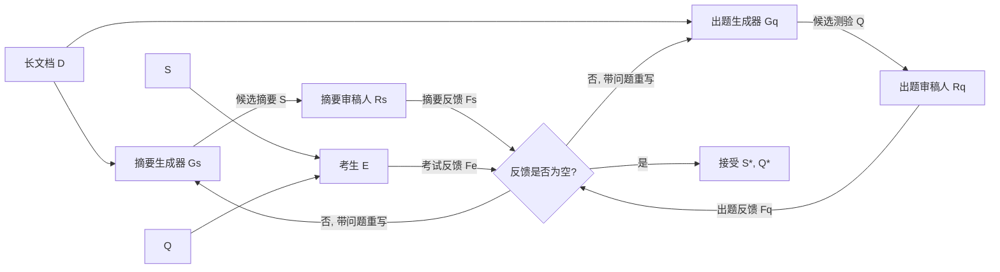

# Learning to Summarize by Learning to Quiz: Adversarial Agentic Collaboration for Long Document Summarization

**会议**: ICLR 2026  
**OpenReview**: [https://openreview.net/forum?id=WAQhCifBSb](https://openreview.net/forum?id=WAQhCifBSb)  
**代码**: [https://github.com/weixuan-wang123/SummQ](https://github.com/weixuan-wang123/SummQ)  
**领域**: 多智能体系统 / 长文档摘要  
**关键词**: 长文档摘要, 多智能体, 对抗协作, LLM-as-a-Judge, 出题验证  

## 一句话总结
SUMMQ 把"摘要"和"出题"做成一对相互对抗的多智能体任务——摘要负责覆盖全文，出题负责拷问摘要是否漏信息/失真，再加一个"考生"智能体验证摘要能否答对题目，靠多轮反馈迭代精炼，从而提升长文档摘要的完整性与事实一致性。

## 研究背景与动机
**领域现状**：长文档摘要（研究论文、法律文件、书籍）是当前 LLM 的硬骨头。虽然 LLM 的长上下文能力在进步，但处理超长文档时仍普遍出现信息丢失、事实不一致、跨段落连贯性差等问题，远距离信息之间的细微关系常常被丢掉，甚至产生幻觉。

**现有痛点**：多智能体系统在复杂推理上已展现潜力，但用到长文档摘要上仍属空白；更关键的是，已有的多智能体摘要方法大多依赖**自我验证（self-verification）**——让模型自己检查自己的输出，这会引入系统性偏差，错误检不出来，等于自说自话。

**核心矛盾**：摘要质量缺少一个"外部的、可证伪的"评判信号。单纯让模型"再读一遍自己的摘要"无法暴露遗漏，因为遗漏的内容恰恰不在摘要里。

**本文目标**：构造一个能持续逼问"这份摘要到底覆盖全了吗、事实对不对"的机制，让摘要在迭代中被动暴露并修补缺陷。

**核心idea**：**对抗式双任务**——把摘要和出题绑成一对天然对手。摘要要尽量覆盖全文以便所有题目都能答对，出题则专门盯着信息覆盖、事实性、连贯性去挖坑；再引入"考生"只用摘要去答题，答不上来就说明摘要漏了东西。这套机制把"摘要够不够好"转化成"题目能不能被摘要答对"这个可验证的客观信号。

## 方法详解

### 整体框架
SUMMQ 围绕两类任务（摘要 / 出题）× 两种角色（生成器 / 审稿人）组合出四组智能体：摘要生成器 $G_s$、出题生成器 $G_q$、摘要审稿人 $R_s$、出题审稿人 $R_q$，外加一个考生 $E$。每轮迭代里，生成器先产出候选摘要 $S^{(t)}$ 和候选测验 $Q^{(t)}$，审稿人分别对二者挑错给出反馈 $F_s^{(t)}$、$F_q^{(t)}$，考生只读摘要去答题、把答不上来的题反馈回去 $F_e^{(t)}$；当摘要侧和出题侧反馈都为空（无问题）时接受并返回，否则带着问题进入下一轮，最多 $T_{iter}$ 轮。

### 关键设计

**1. 摘要—出题对抗双任务：把"质量"翻译成"可答性"。** SUMMQ 最核心的设计是让摘要和出题互为约束。摘要的目标函数被隐式重写为"让生成的测验题都能用摘要答对"，而出题方则刻意围绕全文的信息覆盖、事实细节、连贯逻辑去命题——出题生成器会针对每份测验产出选择题、判断题、简答题三种类型各 10 题、共 30 个问答对。这样一来，摘要漏掉的任何关键信息都会变成一道"答不出来"的题，从而被精确定位。消融实验里去掉整个出题机制（去掉出题生成器、审稿人和考生），MENSA 上 BSF1 从 62.76 掉到 60.59、SUMMQ_SOLO 更是从 61.84 暴跌到 55.44，证明这条对抗信号是整个框架的命门。

**2. 生成器的四阶段协作：从独立草稿到集体投票。** 单个生成器视角有限，SUMMQ 让一组生成器 $G=\{g_i\}$ 先各自独立起草 $z_i$（草稿集合 $Z=\{z_1,\dots,z_n\}$），再走三条并行/串行的收敛路径：聚合器 $A_{Agg}$ 把多份草稿的长处揉成一份统一稿 $z_{agg}$，补齐单个智能体漏掉的互补信息；排序器 $A_{Ranker}$ 同时从 $Z$ 里挑出单份最强草稿 $z_{best}$，作为保险——防止某个智能体写得特别好却被聚合稀释掉；最后所有生成器在候选集 $C=\{z_{agg}, z_{best}\}$ 上投票 $z^*=\arg\max_{z\in C}|\{j: vote_j=z\}|$，得票多的胜出。这套"独立起草—聚合—择优—投票"既吃到多样性又有质量兜底。

**3. 审稿人的争议—辩论裁决：用共识区分真假问题。** 审稿不是简单打分，而是分四阶段甄别问题真伪。每个审稿人 $r_i$ 先独立标注出事实错误、信息遗漏、冗余等问题集 $A_i$；接着按共识分流——被 $\ge 2$ 个审稿人标记的归为**确认问题** $M$，少于 2 人标记的归为**争议问题** $C$。对争议问题，系统启动 $T_{debate}$ 轮辩论：所有审稿人拿原文 $D$ 和摘要/测验 $z$ 作证据互相论证，再多数投票决定该问题是否成立，留下的有效争议问题集为 $K$。最终问题清单 $I=M\cup K$ 回传给生成器指导下一轮重写。这个"辩论 + 多数投票"过滤掉了单个审稿人的噪声误判，只把真问题喂回循环。

**4. 考生闭环验证：可证伪的外部信号。** 考生 $E$ 只拿着摘要去答测验（`TAKEQUIZ`），它的反馈 $F_e^{(t)}$ 会按题目归属拆分后分别并入摘要反馈和出题反馈两条流。这一步把"摘要是否自洽完整"做成了真正可证伪的检验：如果摘要里没有答某题所需的信息，考生就会答错，问题随即被定位回摘要侧。它和审稿人的区别在于——审稿人对照原文挑错（外部参照），考生只看摘要答题（自洽性检验），两者互补地覆盖了"信息对不对"和"信息全不全"。

## 实验关键数据

### 主实验表格
在 MENSA / BookSum / GovReport 三个长文档摘要基准上对比（ROUGE-1/2/L 与 BERTScore-F1，默认 GPT-4O 作 backbone，每组件 3 个智能体，$T_{iter}=3$，$T_{debate}=1$）：

| 方法 | MENSA R-1 | MENSA R-L | MENSA BSF1 | BookSum R-1 | BookSum R-L | GovReport R-1 |
|------|-----------|-----------|------------|-------------|-------------|---------------|
| GPT-4O (prompting) | 25.78 | 13.59 | 59.67 | 23.02 | 12.23 | 31.42 |
| GPT-5 (prompting) | 37.38 | 17.11 | 60.44 | 23.98 | 12.38 | 41.52 |
| O3 (prompting) | 32.84 | 17.09 | 59.27 | 22.00 | 11.51 | 38.28 |
| HM-SR (multi-agent) | 34.26 | 13.46 | 60.22 | - | - | - |
| **SUMMQ_SOLO** | 39.30 | 17.12 | 61.84 | 33.33 | 15.47 | 48.71 |
| **SUMMQ_COMBO** | **41.58** | **18.24** | **62.76** | **44.62** | **20.38** | **52.79** |

SUMMQ_COMBO 在 MENSA、BookSum 上全指标最优，BookSum 提升尤为显著（R-1 从 GPT-5 的 23.98 飙到 44.62）；GovReport 上由于部分监督微调基线（U.FORMER/SLED/CACHED）有大规模任务专训，SUMMQ_COMBO 在个别指标不及它们，但仍超过所有 prompting 基线。

### 消融实验表格
MENSA 上的关键消融（SUMMQ_COMBO，GPT-4O）：

| 设置 | R-1 | R-L | BSF1 |
|------|-----|-----|------|
| 单组件换 3 智能体 - 摘要生成器 | 40.72 | 18.07 | 62.53 |
| 单组件换 3 智能体 - 摘要审稿人 | 41.20 | 17.93 | 61.99 |
| **SUMMQ_COMBO (全 3 智能体)** | 41.58 | 18.24 | 62.76 |
| **w/o quiz (去出题机制)** | 39.49 | 17.13 | 60.59 |
| 迭代 $T_{iter}=1$ | 38.14 | 17.85 | 62.60 |
| 迭代 $T_{iter}=3$ | 41.58 | 18.24 | 62.76 |
| 迭代 $T_{iter}=5$ | 41.53 | 18.21 | 62.55 |
| 智能体数 =1 / 组件 | 39.30 | 17.12 | 61.84 |
| 智能体数 =5 / 组件 | 42.52 | 18.56 | 62.96 |

### 关键发现
- **出题机制是命门**：去掉后 SUMMQ_SOLO 的 BSF1 从 61.84 跌到 55.44，跌幅最大，证明对抗信号比单纯增加智能体更关键。
- **迭代有最优点**：1→3 轮持续提升，3 轮后收益递减甚至变负，说明过多迭代会引入噪声/过度精炼。
- **智能体越多越好但边际递减**：从 1 到 5 个稳步上升，但增量变小且成本线性上涨，存在质量—算力权衡。
- **跨 backbone 稳健**：在 GPT-4.1、O3、DeepSeek-R1、Qwen3-32B 等多种闭源/开源模型上 SUMMQ 都显著超过对应 baseline（如 GPT-4.1 上 R-1 从 30.31→49.17）。
- **人评压倒性**：SUMMQ_COMBO 对 GPT-4O / O3 胜率 88% / 82%；即便用缩短版 SUMMQ_COMBO_R 消除长度偏差，胜率仍有 65% / 60%。

## 亮点与洞察
- **把"评判"外包给一个对抗任务**是这篇最漂亮的思路：传统自我验证的盲区在于"摘要漏了什么，模型自己也看不见"，而出题—答题闭环让遗漏的信息以"答错的题"形式显形，这是一个可证伪、外部化的质量信号。
- **审稿人辩论机制**把多智能体常见的"噪声投票"问题处理得很细致：用 ≥2 票共识区分确认/争议问题，只对争议项辩论，既省算力又过滤误判。
- 框架对 backbone 不挑食，弱模型如 Qwen3-32B 也能被这套协作显著抬升，说明增益来自机制设计而非单纯靠强模型。

## 局限与展望
- **算力成本高**：四组件 × 多智能体 × 多轮迭代 × 辩论，token 消耗远超单次 prompting；论文也承认增加智能体"成本上涨但收益不成比例"。
- **依赖 backbone 质量**：摘要质量强相关于底座模型，弱模型即便用了 SUMMQ 绝对分仍偏低，机制不能凭空补强基础能力。
- **出题覆盖即上限**：测验题如果没问到某个关键点，那个点的遗漏就检测不到——质量天花板被出题的覆盖面所限。
- **评测偏自动指标 + LLM-as-a-Judge**：人评规模较小（20 篇 NLP 论文、5 位博士生），泛化到法律/书籍等其他长文档体裁仍需验证。

## 相关工作与启发
- **多智能体协作**：延续了 multi-agent debate / discussion 在推理、论文评审、代码生成上的思路，但首次系统化用到长文档摘要，并用"双任务对抗"替代了常见的单任务多智能体协作。
- **长文档摘要**：相比稀疏注意力、长上下文微调、记忆增强、分块滑窗等架构/工程路线，本文走的是纯 prompting + 智能体编排，不改模型结构。
- **启发**：这种"用一个对抗任务把目标任务的隐性缺陷显性化"的范式可迁移到代码生成（用测试用例当题）、检索增强（用问答校验召回完整性）等场景；"考生—审稿人"的双重外部信号设计也值得在其他需要事实校验的生成任务里复用。

## 评分
- 新颖性: ⭐⭐⭐⭐ 摘要—出题对抗双任务 + 考生闭环验证是有辨识度的新机制，把自我验证的盲区转成可证伪信号，思路巧妙。
- 实验充分度: ⭐⭐⭐⭐ 三基准 + 多 backbone + 自动/LLM-judge/人评三重评测 + 完整消融，但人评规模偏小、算力开销未量化对比。
- 写作质量: ⭐⭐⭐⭐ 算法伪代码清晰、框架图直观，四阶段协作叙述完整易懂。
- 价值: ⭐⭐⭐⭐ 给长文档摘要提供了即插即用、跨模型稳健的质量提升方案，机制可迁移性强，但高成本限制了实际部署。

<!-- RELATED:START -->

## 相关论文

- [\[ICLR 2026\] AgentPO: Enhancing Multi-Agent Collaboration via Reinforcement Learning](agentpo_enhancing_multi-agent_collaboration_via_reinforcement_learning.md)
- [\[AAAI 2026\] Learning to Generate and Extract: A Multi-Agent Collaboration Framework for Zero-shot Document-level Event Arguments Extraction](../../AAAI2026/multi_agent/learning_to_generate_and_extract_a_multi-agent_collaboration_framework_for_zero-.md)
- [\[ICLR 2026\] Learning Efficient and Interpretable Multi-Agent Communication](learning_efficient_and_interpretable_multi-agent_communication.md)
- [\[NeurIPS 2025\] The PokeAgent Challenge: Competitive and Long-Context Learning at Scale](../../NeurIPS2025/multi_agent/the_pokeagent_challenge_competitive_and_long-context_learning_at_scale.md)
- [\[ICLR 2026\] Context Learning for Multi-Agent Discussion](context_learning_for_multi-agent_discussion.md)

<!-- RELATED:END -->
