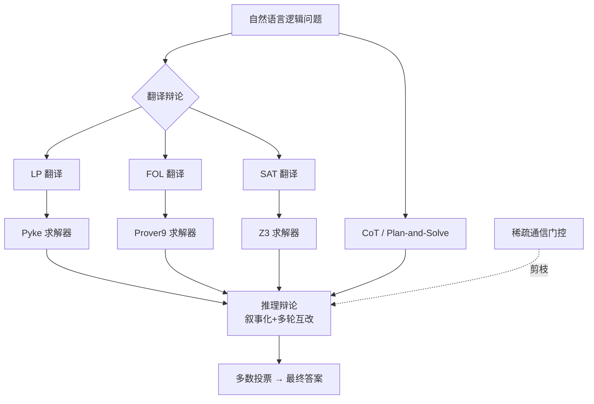

# MAD-Logic: Multi-Agent Debate Enhances Symbolic Translation and Reasoning

**会议**: ICLR 2026  
**OpenReview**: [https://openreview.net/forum?id=rdE9qxGfIv](https://openreview.net/forum?id=rdE9qxGfIv)  
**代码**: [https://github.com/yhc-666/MAD-Logic](https://github.com/yhc-666/MAD-Logic)  
**领域**: 神经符号推理 / 多智能体辩论 / 逻辑问答  
**关键词**: 逻辑推理, 符号翻译, 多智能体辩论, 稀疏通信, 多数投票  

## 一句话总结
让多个智能体把同一道逻辑题翻译成 LP/FOL/SAT 三种符号语言、再让"求解器派"和"自然语言派"多轮辩论后多数投票，并用基于置信度与信息增益的稀疏通信剪掉无用交流，从而在逻辑问答上同时拿到强推理与强鲁棒，还更省 token。

## 研究背景与动机
**领域现状**：让 LLM 做复杂逻辑推理目前有两条主流管线——一条是把自然语言（NL）翻译成符号语言（SL，如逻辑编程 LP、一阶逻辑 FOL、布尔可满足 SAT）再交给外部求解器（Pyke/Prover9/Z3）严格推理；另一条是直接用 prompting 或微调让 LLM 在自然语言里推理（CoT、ToP、Plan-and-Solve 等）。

**现有痛点**：翻译阶段，已有工作通常只把问题翻译成**单一预定义的 SL**，但每种 SL 表达力各异——LP 擅长规则演绎但只能处理规则型问题，FOL 表达力强却在大规模问题上计算复杂，SAT 求解极快却无法刻画非布尔的复杂关系；只押一种 SL 经常抓不住原文不同侧面的关键特征，造成信息丢失或翻译错误。推理阶段则存在权衡：求解器**推理强但鲁棒性弱**（翻译稍有瑕疵就拒绝输出甚至无解），LLM 直接推理**鲁棒性强但推理弱**（容忍不完美翻译，却易幻觉、逻辑不自洽）。

**核心矛盾**：单智能体范式无法同时拿到"严格的符号推理能力"和"对翻译错误的鲁棒性"——选求解器就怕翻译崩、选 LLM 就怕幻觉，二者本质互补却被割裂使用。

**本文目标**：构建一个能同时吸收"多种 SL 之长"与"SL/NL 两种推理范式之长"的框架，在翻译和推理两个阶段都做得更好，同时把多智能体辩论固有的高 token 开销压下来。

**核心 idea**：**首次把逻辑问答建模成多智能体辩论**——翻译阶段让每个 agent 负责一种 SL 并通过辩论互相纠错，推理阶段让 SL 求解器派和 NL 派多轮辩论后多数投票；再叠加一个**自适应稀疏通信**机制，按置信度比和信息增益动态剪枝无价值的 agent 间交流。

## 方法详解

### 整体框架
MAD-Logic 把逻辑问答拆成"符号翻译辩论 → SL/NL 推理辩论 → 多数投票"三段，并贯穿一个稀疏通信调度器。原始 NL 问题先被并行翻译成 LP、FOL、SAT 三种 SL，agent 辩论精修翻译；随后 LP/FOL/SAT 交给对应求解器得到符号推理轨迹，同时 LLM 用 CoT 与 Plan-and-Solve 直接在 NL 里求解；所有"叙事化"的推理结果再进入多轮辩论互相校准，最后由多数投票定答案。稀疏通信机制在辩论的每一轮动态剪掉低价值的信息传递，控制开销。

### 关键设计

**1. 多 SL 并行翻译 + 辩论纠错：用语言异构性换翻译鲁棒性。** 这一步的出发点是单一 SL 必然偏科，于是把同一道题同时翻译成 LP、FOL、SAT 三套表示并行展开——LP 给出规则链式演绎（如 `has_parent(x,y) ∧ has_parent(y,z) → has_grandparent(x,z)`），FOL 用量词刻画复杂关系（如 $\forall x\forall y(\text{Loves}(x,y)\to\neg\text{Hates}(x,y))$），SAT 把问题压成布尔变量与约束交给高度优化的求解器。三个 agent 各管一种语言，再通过多智能体辩论互相参照、修正翻译错误，让最终送进求解器的符号表达比单语言翻译更准，从源头缓解"翻译一崩、求解器就废"的脆弱性。

**2. SL/NL 混合推理辩论：让求解器与 LLM 取长补短。** 求解器派和 prompt 派天然互补——前者严格但脆、后者鲁棒但弱，单独用都不够。方法先把求解器的符号推理过程（规则、步骤、结论，例如 Pyke 跑出的一串 implied facts）**叙事化成自然语言描述**，让它和 LLM 直接产出的 CoT/Plan-and-Solve 叙事处在同一可比的文本空间；接着进入由 LLM 驱动的迭代精修循环：每一轮 LLM 以"所有其它叙事"为上下文重写每条推理叙事，重复 $N$ 轮做深度交互与互相校准，最后对所有精修后叙事的结论做多数投票。这样求解器的严谨性和 LLM 的容错性被融到同一个投票池里，谁错谁被多数纠正。

**3. 自适应稀疏通信：用偏好分数剪掉无用辩论。** 全连接辩论 token 开销巨大且充斥重复交换，于是引入一个偏好分数衡量"agent i 在第 d 轮把输出传给 agent j"到底值不值：

$$\text{Pre}^d_{i\to j} = \frac{C^d_i}{C^d_j} + \lambda\big(1 - \cos(A^d_j, A^d_i)\big)$$

第一项是源/收信 agent 的置信度比 $C^d_i/C^d_j$（每个 agent 在输出预测标签和推理轨迹的同一回合给出 $[0,1]$ 的置信度），第二项 $1-\cos(A^d_j,A^d_i)$ 度量两份输出的差异即信息增益，$\lambda$ 调权。通信是否放行由二值门 $O^d_{i\to j}$ 决定，阈值取该对 agent 的历史平均偏好：

$$O^d_{i\to j} = \begin{cases} 1, & \text{Pre}^d_{i\to j} \ge \alpha\cdot\text{Pre}^{d-1}_{i\to j} \\ 0, & \text{otherwise} \end{cases}$$

即只有当本次交互至少和历史平均一样有益时才允许传递。配合**选择性记忆更新**：第一轮全连接、各 agent 记忆为空 $M^1_s\leftarrow\emptyset$，从第二轮起门控生效，每轮结束 agent 只把门开着（$O^d_{i\to j}=1$）的那些 agent 输出并入自己的个性化记忆 $M^{d+1}_s$，再据此生成下一轮输出；$D$ 轮后所有 agent 的最终输出多数投票定答案。

**4. 多数投票的精度下界保证：从理论上说明异构 agent 为何有效。** 把逻辑问答建成 $k$ 类分类，$m$ 个 agent 每个都优于随机猜（准确率 $p>1/k$），用平均成对类间相关 $\rho$ 刻画 agent 间错误的相关程度，作者给出多数投票集成的准确率下界 $P(H(x)=y)\ge 1-(k-1)\frac{\sigma^2[1+(m-1)\rho]}{m\delta^2}$（其中 $\delta=\frac{p-1-p}{k-1}$ 这类量由 $p,k$ 决定）。结论是：若 agent 错误独立（$\rho=0$）则 $m\to\infty$ 时下界趋于 1；若错误正相关但适中（$\rho>0$）下界收敛到 $1-(k-1)\rho\sigma^2/\delta^2$。这正好解释了为什么要让 SL/NL 异构 agent 来辩论——异构性带来足够低的错误相关，避免"大家一起错"的虚假共识，让多数投票真正有增益。

## 实验关键数据

### 主实验
三个合成基准（ProntoQA / ProofWriter / LogicalDeduction）与三个真实基准（AR-LSAT / FOLIO / Chinese LogiQA-V2），覆盖 GPT-4、Claude 3.7 Sonnet、DeepSeek-V3、Qwen2.5-7B 多个 backbone，温度设 0。

| 方法 | ProntoQA(GPT-4) | ProofWriter(GPT-4) | LogiDeduct(GPT-4) |
|------|------|------|------|
| Direct | 75.40% | 53.50% | 59.00% |
| 1-shot COT | 81.20% | 67.17% | 69.67% |
| SymbCOT | 96.00% | 82.33% | 86.33% |
| CortexDebate | 99.60% | 90.83% | 92.33% |
| **Ours (w/o sparse)** | 99.40% | 90.17% | 94.00% |
| **Ours (w/ sparse)** | **100.00%** | **92.00%** | **94.33%** |

真实基准（GPT-4）上同样领先，AR-LSAT 53.25%、FOLIO 86.27%、Chinese LogiQA-V2 74.76%，均超过最强多智能体基线 CortexDebate（51.08% / 84.80% / 74.13%）。小模型 Qwen2.5-7B 上 w/ sparse 也在多数数据集胜出（ProofWriter 76.50%、ProntoQA 86.40%）。

### 消融实验

| 配置 | ProntoQA | ProofWriter | LogiDeduct (GPT-4) |
|------|------|------|------|
| w/o 多 agent 翻译 | 99.40% | 89.17% | 90.00% |
| w/o SL 推理辩论 | 95.60% | 79.33% | 84.67% |
| w/o NL 推理辩论 | 99.20% | 90.67% | 94.00% |
| **Ours** | **100.00%** | **92.00%** | **94.33%** |

去掉 SL 推理辩论掉点最猛（ProofWriter 92→79），说明符号求解器派是精度主力；翻译辩论与 NL 辩论各有贡献。agent 组成上 SAT+FOL+LP+（CoT+P&S）的全配置最佳，逐步加 SL 种类和 NL 方法都在涨点。稀疏门控的 $\lambda$ 越大、token 节省率越高（ProntoQA 上 $\lambda{=}1.0$ 节省 22.89% token 且精度不降反升）。

### 关键发现
- **稀疏通信不是单纯省钱**：带误差棒的实验里 w/ sparse 多处显著优于 w/o sparse 与 CortexDebate（标 * 为 t-test p<0.05），剪枝在降本的同时还提精度。
- **求解器执行率随辩论轮数先升后降**，在 2-3 轮达峰，提示辩论轮数存在甜点。
- **多 SL 互补是真实增益来源**：单 FOL → SAT+FOL → SAT+FOL+LP 逐级提升，验证语言异构性假设。

## 亮点与洞察
- 把"选 SL 求解器还是选 LLM"这个老二选一，重构成"让它们当 agent 一起辩论再投票"，是对神经符号推理范式的一次干净的范式转换。
- 稀疏通信用置信度比 × 信息增益做门控阈值、且阈值取历史平均自适应，既有直觉又便宜，把多智能体辩论最被诟病的 token 开销问题正面解决。
- 配了多数投票精度下界定理，把"异构 agent 错误相关低 → 投票有效"讲成可量化的结论，理论与"为何要混 SL/NL"的设计动机对得很齐。

## 局限与展望
- 翻译成三种 SL + 多轮辩论 + 多求解器，即便稀疏化后整体 pipeline 仍比单 agent 重，端到端延迟与工程复杂度偏高。
- 依赖外部求解器（Pyke/Prover9/Z3）与对应翻译质量，超出 LP/FOL/SAT 可表达范围的逻辑（如概率、时序、模态推理）尚未覆盖。
- 置信度由 LLM 自报，稀疏门控的可靠性受 LLM 置信度校准好坏影响；评测仍以逻辑 QA 准确率为主，未触及更开放的推理场景。

## 相关工作与启发
- **SL-based 求解器路线**：LINC、LogicLM、Aristotle、SymbCoT 等先翻译再交求解器，强在严谨弱在脆；本文把它们当辩论中的一派而非唯一答案。
- **NL 直接推理路线**：CoT、ToT、Plan-and-Solve 等鲁棒但易幻觉；本文用它补求解器的容错短板。
- **多智能体辩论**：相比 CortexDebate / SparseMAD 等只在 NL 里辩论或固定拓扑，本文跨 SL/NL 异构辩论 + 自适应稀疏拓扑是主要区别，也是消融里领先它们的来源。
- **启发**：当一个任务存在"严谨但脆"与"鲁棒但弱"的互补范式时，与其二选一，不如把它们叙事化到同一空间做投票辩论，并用信息增益门控控制成本——这套思路可迁移到代码推理、数学证明等同样有"形式化 vs 自然语言"张力的任务。

## 评分
- **新颖性**: ⭐⭐⭐⭐ 首次把多 SL 翻译 + SL/NL 异构辩论统一进多智能体框架，稀疏通信门控设计巧妙，范式转换清晰。
- **实验充分度**: ⭐⭐⭐⭐ 6 个基准 × 4 个 backbone，含误差棒、显著性检验、丰富消融（组件/agent 组成/轮数/$\lambda$），证据扎实。
- **写作质量**: ⭐⭐⭐⭐ 动机—方法—理论—实验逻辑连贯，图表清楚，理论下界与设计动机呼应；公式符号略密。
- **价值**: ⭐⭐⭐⭐ 在逻辑 QA 上同时提精度与省 token，方法可迁移到其它"形式化 vs 自然语言"互补的推理任务，工程与理论双落点。

<!-- RELATED:START -->

## 相关论文

- [\[ICLR 2026\] Multi-Agent Debate with Memory Masking (MAD-M²)](multi-agent_debate_with_memory_masking.md)
- [\[ICLR 2026\] From What to Why: A Multi-Agent System for Evidence-based Chemical Reaction Condition Reasoning](from_what_to_why_a_multi-agent_system_for_evidence-based_chemical_reaction_condi.md)
- [\[ACL 2026\] When Identity Skews Debate: Anonymization for Bias-Reduced Multi-Agent Reasoning](../../ACL2026/multi_agent/when_identity_skews_debate_anonymization_for_bias-reduced_multi-agent_reasoning.md)
- [\[AAAI 2026\] MedLA: A Logic-Driven Multi-Agent Framework for Complex Medical Reasoning with Large Language Models](../../AAAI2026/multi_agent/medla_a_logic-driven_multi-agent_framework_for_complex_medic.md)
- [\[ICLR 2026\] Completing Missing Annotation: Multi-Agent Debate for Accurate and Scalable Relevance Assessment](completing_missing_annotation_multi-agent_debate_for_accurate_and_scalable_relev.md)

<!-- RELATED:END -->
