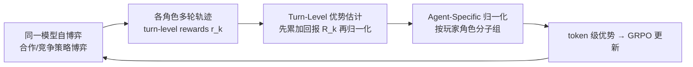

# MARSHAL: Incentivizing Multi-Agent Reasoning via Self-Play with Strategic LLMs

**会议**: ICLR 2026  
**OpenReview**: [https://openreview.net/forum?id=GCd5v3ehmr](https://openreview.net/forum?id=GCd5v3ehmr)  
**代码**: 已开源（Project Page + Code，见 OpenReview）  
**领域**: 多智能体 / LLM 强化学习  
**关键词**: 多智能体推理, 自博弈, GRPO, 信用分配, 优势估计, 策略博弈  

## 一句话总结
MARSHAL 用一套针对「多轮 + 多智能体」改造的 GRPO（**先求回报再归一化**的 turn-level 优势估计 + **按角色分组**的优势归一化），让 Qwen3-4B 在合作与竞争的策略博弈里自博弈训练，习得的策略能力能零样本迁移到 MAD/AutoGen 等多智能体系统并在数学/QA 推理基准上稳定涨点。

## 研究背景与动机
- **领域现状**：RL（GRPO/PPO）已被证明能显著增强单智能体 LLM 的推理能力（DeepSeek-R1 等），但现实中的谈判、博弈、协同开发都是多个智能体长时间交互的多智能体系统（MAS）。把 RL 扩展到多轮、多智能体场景仍是空白。
- **现有痛点**：直接把 GRPO 套到多智能体自博弈上有两个硬伤。其一是**长程信用分配**——一局游戏由多轮动作组成，每轮可能有即时奖励，但最终只有一个稀疏的胜负结果，把整局结果平摊给每个 token（朴素 GRPO 做法）无法分辨哪一步动作真正起了作用。其二是**角色异质性导致的优势方差**——不同游戏角色（先手/后手、合作中的不同位置）信息不对称、收益尺度不同，混在一起做归一化会引入方差、破坏训练稳定性。
- **核心矛盾**：自博弈天然产生多轮、多角色轨迹，而现成的单轮 RL 优势估计假设「一条响应 = 一个 turn、一个角色」，结构上不匹配。
- **本文目标**：设计一个端到端 RL 框架，让 LLM 通过在多样化策略博弈中自博弈，习得**可泛化**的多智能体推理能力，且能迁移到游戏之外的真实多智能体系统。
- **核心 idea**：**自博弈 + 两项针对多轮多智能体的 GRPO 改造**——把策略博弈建模成 turn-level MDP，用「先累加回报、再归一化」的 turn-level 优势估计做细粒度信用分配，并按玩家角色分子组独立归一化优势。

## 方法详解

### 整体框架
MARSHAL 把一整局策略博弈视作一个 episode（turn-level MDP）：高层状态 $s_k$ 是第 $k$ 轮开始时的局面（棋盘、手牌等），高层动作 $a_k$ 是 LLM 当轮的完整输出（含推理 + 落子），它本身又是底层自回归策略逐 token 生成的序列，目标是最大化整局总回报 $R=\sum_{k=1}^{K} r_k$。在 GRPO 基础上，先通过自博弈让同一模型扮演所有玩家、生成各角色的多轮轨迹，再用两项改造把轨迹奖励转成准确的 token 级优势喂给 GRPO 更新。

### 关键设计

**1. 多轮自博弈下的 GRPO 朴素推广：先定义问题的「baseline 写法」。** 自博弈中所有玩家由同一模型控制，每局给每个角色产出一条多轮轨迹。把一个博弈环境内的所有轨迹 $\{(s^i_k,a^i_k)_{k=1}^{K_i}\}_{i=1}^{G}$ 当作一组响应、以整局总回报 $R_i$ 作为终止奖励，GRPO 就能加一层对轮的求和直接推广，优势取 $A^i_{k,t}=\frac{R_i-\mathrm{mean}(r)}{\mathrm{std}(r)}$。但这等于把整条多轮轨迹的所有 token 都赋同一个优势，正是长程信用分配失效的根源——本文的两项改造都是冲着修这个来的。

**2. Turn-level 优势估计：把「先归一化再累加」反转成「先累加再归一化」。** 原始 GRPO 的过程监督做法是先在整个 batch 上归一化每轮奖励 $\tilde r^i_k=(r^i_k-\mathrm{mean}(r))/\mathrm{std}(r)$，再做累加和 $A^i_k=\sum_{\hat k=k}^{K}\tilde r^i_{\hat k}$。问题在于不同轮的中间奖励分布差异很大，把它们当成单一分布做全局归一化并不合适。MARSHAL 把两步顺序倒过来：**先**算从第 $k$ 轮起的蒙特卡洛累计回报 $R^i_k=\sum_{\hat k=k}^{K} r^i_{\hat k}$，**再**对这些回报做去均值归一化 $A^i_{k,t}=R^i_k-\mathrm{mean}(R)$。这一形式等价于 $\gamma=1,\lambda=1$ 的 GAE，价值函数 $V(s_k)$ 被一个简单有效的 baseline——batch 回报的经验均值 $\mathbb{E}[R]$ ——近似，从而让优势被恰当地居中，给多轮决策提供更稳定的学习信号。

**3. Agent-specific 优势归一化：按角色分子组、各算各的 baseline。** 很多博弈里期望回报严重依赖玩家角色（先手 vs 后手、合作中的不同分工），把不同角色的优势放在一起归一化会把所有玩家拉向一个共享 baseline，统计上不合理还会淹没角色特有的学习信号。MARSHAL 把 batch 轨迹按玩家角色 $p$ 划成子组 $G_p$，在每个子组内部独立套用上面的 turn-level 估计，最终目标变为
$$A^{p,i}_{k,t}=R^{p,i}_k-\mathrm{mean}(R^p),\quad R^p\ \text{为子组}\ G_p\ \text{的累计回报集合}$$
保证每个动作的优势是相对该角色平均结果算出来的，在多智能体场景下给出更准确、更稳定的信用分配。

**4. 极简奖励设计 + 课程化博弈选取：让信号尽量来自胜负本身。** 主信号是内在博弈结果（井字棋胜/负/和 ±1、Kuhn Poker 赢/输筹码、Mini Hanabi 每打出一张牌共享 +1），多游戏混训时把各游戏最大奖励统一缩放到 4。另加两个辅助奖励稳训练：格式奖励（合法格式 +0.05，非法直接 −10 并终局）、长度惩罚 $r_{\text{length}}(l)=\alpha\cdot\max(0,1-\frac{l-l_{\min}}{l_{\max}-l_{\min}})$（$l_{\min}=11,l_{\max}=2048,\alpha=0.5$）鼓励简洁。博弈则按「训练集 → 更复杂的留出集」分三类：完美信息竞争（井字棋→四子棋）、不完美信息竞争（Kuhn Poker→Leduc Hold'em）、不完美信息合作（Mini Hanabi→Simple Hanabi），覆盖确定性规划、不确定性决策、意图识别/心智理论等多种推理能力。

## 实验关键数据

### 主实验表格（多智能体系统内的下游推理，Average）

| 设置 | 模型 | Average |
|---|---|---|
| Single Agent | Qwen3-4B | 60.74 |
| Single Agent | SPIRAL | 63.75 |
| Single Agent | MARSHAL Generalist | 62.79 |
| MAD（竞争） | Qwen3-4B | 72.45 |
| MAD（竞争） | SPIRAL | 73.41 |
| MAD（竞争） | MARSHAL Generalist | **75.96**（+3.51） |
| AutoGen（合作） | Qwen3-4B | 79.14 |
| AutoGen（合作） | SPIRAL | 80.05 |
| AutoGen（合作） | MARSHAL Generalist | **82.15** |

代表性单项增益：MAD 框架下 generalist 在 GPQA-Diamond 提升 7.57%；AutoGen 框架下 generalist 在 AIME 提升 10.00%。

### 消融实验表格（井字棋专家，训练/留出游戏归一化回报，竞争游戏为 先手/后手）

| 模型 | Tic-Tac-Toe | Kuhn Poker | Mini Hanabi | Connect Four | Leduc Hold'em | Simple Hanabi |
|---|---|---|---|---|---|---|
| MARSHAL | 75.30/32.10 | 74.15/3.42 | 50.48 | 30.65/14.85 | 58.36/27.65 | 29.75 |
| w/o Turn-Level | 74.60/24.15 | 80.26/28.35 | 34.80 | 26.75/12.30 | 48.34/41.34 | 19.05 |
| w/o Agent-Specific | 82.70/31.20 | 70.89/11.24 | 44.10 | 25.40/10.50 | 51.04/49.88 | 21.72 |
| w/ fixed opponent | 88.00/41.95 | 63.15/28.84 | 34.93 | 20.35/5.65 | 47.38/35.55 | 12.22 |

### 关键发现
- **专家 → 留出游戏的 OOD 泛化成立**：井字棋专家不仅在训练域超越基线，还能迁移到更复杂的四子棋，甚至在 OOD 的 Mini Hanabi 上平滑提升，说明学到的是「轮流规划」这类基础技能。
- **Generalist 最稳**：在全部游戏上整体表现最强，Leduc Hold'em 提升 28.7%、Simple Hanabi 提升 22.9%。
- **两项设计都不可或缺**：去掉 turn-level 估计或 agent-specific 归一化，留出游戏（尤其合作 Hanabi）性能明显回退。
- **自博弈 >> 固定对手**：对固定专家对手训练会过拟合静态环境/对手（Kuhn Poker 专家固定对手变体在多数留出游戏直接归零）。
- **失败模式归因**：在 GPQA-Diamond + MAD 上，MARSHAL 把「智能体间错位」（Inter-Agent Misalignment）降低 11.5%（远大于系统设计类问题的 ~7%），主要来自「任务跑偏」和「忽视其他智能体输入」的减少，印证模型确实在「倾听同伴、保持目标」。

## 亮点与洞察
- **把策略博弈的结构差异讲透**：单轮 math 是「一条响应=一个 turn」，而策略博弈是 turn-level MDP，论文据此精准定位 GRPO 失配的两处并对症下药，方法动机干净。
- **「先累加再归一化」的小反转**：一个看似微小的步骤顺序调整，背后对应 GAE($\gamma=1,\lambda=1$）且用 batch 均值近似价值函数，理论上自洽、工程上零额外开销。
- **跨域泛化是真卖点**：游戏里练出的「角色理解」「意图识别（心智理论）」能零样本迁移到 MAD/AutoGen 的辩论/协作场景，并有定性 think 轨迹 + 定量失败模式双重佐证。

## 局限与展望
- 仅在 Qwen3-4B 单一规模、六个相对简化的二人博弈上验证，更大模型 / 更复杂多人博弈是否同样有效未知。
- 下游迁移仅在 MAD / AutoGen 两个框架、数学与 QA 基准上测试，向更开放的工具调用、长程协作任务的泛化仍待考察。
- 辅助奖励（格式、长度惩罚）和奖励缩放仍需人工设定，跨游戏统一尺度的做法在更多异质游戏混训时可能需要重新调参。

## 相关工作与启发
- **单智能体 RL 推理**：DeepSeek-R1、Kimi k1.5 等证明 RL 能放大 LLM 推理；MARSHAL 借鉴其格式奖励与长度惩罚，但把战场搬到多智能体。
- **自博弈**：与 SPIRAL（纯竞争零和博弈自博弈）是最直接对比对象；MARSHAL 同时覆盖合作与竞争，并强调跨域泛化。
- **GRPO / GAE**：方法直接建立在 GRPO 之上，turn-level 估计与 GAE 的等价性是其理论锚点。
- **启发**：用「博弈作为可泛化推理能力的训练场」是一条有前景的路径——把抽象的多智能体推理技能（信用分配、角色意识、意图推断）外化为可自博弈、可量化的游戏目标，再迁移回真实 MAS。

## 评分
- 新颖性: ⭐⭐⭐⭐ 把多轮多智能体自博弈的两处 GRPO 失配定位清晰，「先累加再归一化 + 按角色分组归一化」是简洁而有效的针对性改造。
- 实验充分度: ⭐⭐⭐⭐ 覆盖六游戏 OOD 泛化、两类 MAS 框架、多个数学/QA 基准、消融、固定对手对比、失败模式归因，链条完整。
- 写作质量: ⭐⭐⭐⭐ 问题动机—方法—实验逻辑顺畅，图表与定性轨迹分析互补，公式推导到位。
- 价值: ⭐⭐⭐⭐ 给「如何训练可泛化多智能体推理 LLM」提供了可复现的端到端范式，对多智能体系统社区有实际参考价值。

<!-- RELATED:START -->

## 相关论文

- [\[ICLR 2026\] Strategic Planning and Rationalizing on Trees Make LLMs Better Debaters](strategic_planning_and_rationalizing_on_trees_make_llms_better_debaters.md)
- [\[ICLR 2026\] MAS²: Self-Generative, Self-Configuring, Self-Rectifying Multi-Agent Systems](mas2_self-generative_self-configuring_self-rectifying_multi-agent_systems.md)
- [\[ICLR 2026\] Stochastic Self-Organization in Multi-Agent Systems](stochastic_self-organization_in_multi-agent_systems.md)
- [\[ICML 2026\] Toward Culturally Aligned LLMs through Ontology-Guided Multi-Agent Reasoning](../../ICML2026/multi_agent/toward_culturally_aligned_llms_through_ontology-guided_multi-agent_reasoning.md)
- [\[ICLR 2026\] Unlocking the Power of Multi-Agent LLM for Reasoning: From Lazy Agents to Deliberation](unlocking_the_power_of_multi-agent_llm_for_reasoning_from_lazy_agents_to_deliber.md)

<!-- RELATED:END -->
