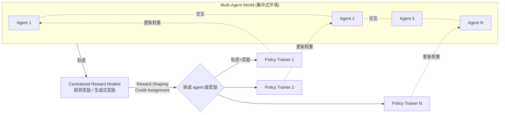

# MARTI: A Framework for Multi-Agent LLM Systems Reinforced Training and Inference

**会议**: ICLR 2026  
**OpenReview**: [https://openreview.net/forum?id=E7jZqo0A50](https://openreview.net/forum?id=E7jZqo0A50)  
**代码**: [https://github.com/TsinghuaC3I/MARTI](https://github.com/TsinghuaC3I/MARTI)  
**领域**: 多智能体 LLM 系统 / 多智能体强化学习  
**关键词**: Multi-Agent System, Reinforcement Learning, LLM Reasoning, Credit Assignment, Reward Shaping  

## 一句话总结
MARTI 把"多智能体推理"和"分布式 RL 训练"统一进一个开源框架——用集中式的环境交互 + 奖励分配，再把每个 agent 的轨迹和奖励分发回各自的策略训练器，从而让多个 LLM agent 在协作中被一起 RL 训练，在相同推理预算下取得比单 agent 更高的数学推理上限。

## 研究背景与动机
**领域现状**：大推理模型（DeepSeek-R1、o1/o3）证明了纯 RL + 规则奖励能显著放大 LLM 的推理能力，但后训练 RL 主要"激活"预训练里已有的能力，base model 的 pass@k 设定了 RL 提升的上界。另一条路是 LLM 多智能体系统（MAS），通过增加 agent 数量来扩展推理算力，AutoGen、CAMEL、MetaGPT 等框架百花齐放。

**现有痛点**：现有 MAS 框架（AutoGen/CAMEL/MetaGPT/GPTSwarm）几乎全靠"推理时调 LLM"，效果高度依赖 LLM 的指令遵循能力——而这恰恰是失败的高发区（agent 不守角色、不会用别人的交互信息）；反过来，能训 LLM 的 RL 框架（OpenRLHF、veRL、TRL、AReaL）又完全不支持多智能体系统。两类工具天然割裂。

**核心矛盾**：MAS 的"推理协作"和 RL 的"训练优化"之间存在鸿沟——没有框架能同时做 MAS 推理 + 单 agent RL + 多 agent RL（见论文 Table 1，只有 MARTI 三项全 ✓）。

**本文目标**：构建一个统一框架，用 RL 改进 LLM-based MAS，让多个 agent 在协作交互中被一起强化训练，从而突破单 agent RL 的性能上界。

**核心 idea**：**集中式交互 + 分布式训练**——所有 agent 的交互、奖励计算、信用分配集中发生在一个"多智能体世界"里，而策略训练则拆给每个 agent 各自的训练器；中间通过 reward shaping 和 credit assignment 把全局奖励拆解成 agent 级奖励，再喂给分布式 RL。

## 方法详解

### 整体框架
MARTI 基于 OpenRLHF 搭建，由三大模块串成一条 rollout-生成 → 奖励分配 → 策略训练 的闭环：**Multi-Agent World**（环境，跑工作流、采轨迹、做信用分配与格式转换）、**Centralized Reward Models**（集中算奖励、做 reward shaping，把全局奖励拆成 agent 级）、**Agent Policy Trainer**（把各 agent 的轨迹+奖励分发到独立训练器做 SFT/RL）。内置 Multi-Agent Debate (MAD)、Mixture-of-Agents (MoA)、Chain-of-Agents (CoA) 三种工作流，也支持自定义注入；并用多轮异步 rollout 提升训练吞吐。

### 关键设计

**1. 集中式交互 + 分布式训练的双层架构：把"协作"和"优化"解耦。** MARTI 的核心结构选择是让所有 agent 交互和奖励分配集中在 Multi-Agent World 里发生，而策略更新分散到每个 agent 各自的 trainer。Multi-Agent World 负责按指定工作流执行 prompt 驱动的 rollout、管理轨迹的信用分配、并把数据转成下游 RL 需要的格式；它支持异步生成来大幅提升数据吞吐，并能动态注入自定义工作流（工作流接口直接访问 vLLM 引擎）。集中式让奖励能跨 agent 统一计算和分配，分布式让每个 backbone LLM 能独立用 OpenRLHF 的 REINFORCE++/GRPO/PPO 训练，二者通过"轨迹+奖励"这个中间产物对接。

**2. 推理感知的规则奖励塑形（inference-aware reward shaping）：让多轮协作不只看单轮对错。** 对数学这类有可验证答案的任务，MARTI 用规则奖励（如 DeepSeek-R1 风格）直接对每个 agent 的输出比对 ground truth 打分；但单轮正确率会让 agent 过拟合单步结果。借鉴 MAPoRL，论文引入历史表现估计 $Q_t^i = \frac{1}{|H_t^i|}\sum_{k \in H_t^i} R_k^i$（$H_t^i$ 是历史评估范围，可取"最近一轮"或"全部历史"），其中 $R_t^i \in [0,1]$ 是 agent $i$ 在第 $t$ 轮的即时正确性奖励。再据此定义动态塑形项 $\Delta_t^i$，有两种模式：Margin Mode $\Delta_t^i = R_t^i - Q_t^i$（直接奖励超越自己历史均值）、Quality Mode $\Delta_t^i = Q_t^i R_t^i - (1-Q_t^i)(1-R_t^i)$（鼓励当前表现与历史正确性一致）。最终塑形奖励 $\tilde{R}_t^i = R_t^i + \alpha \cdot \Delta_t^i$，$\alpha \ge 0$ 控制历史一致性的影响权重。消融显示去掉 reward shaping 后 MAD 平均分从 45.6 掉到 36.6，验证了它对多轮协作的关键性。

**3. 生成式奖励模型（GenRM）覆盖开放域：超出可验证任务。** 对没有标准答案的开放域问题，MARTI 用 LLM-as-judge 式的生成式奖励模型给"问题-轨迹对"打标量分，支持本地 vLLM 引擎或 OpenAI 兼容 API。论文还探索了专门针对 MAS 失败模式（不守角色、不用交互信息）的 GenRM，用来给不同角色和协作行为分配奖励——这部分作为持续优化的方向。这样规则奖励管可验证任务、GenRM 管开放域，两条奖励通路都能接入同一套 credit assignment。

**4. 灵活的分布式策略训练：RL 与模仿学习混合提稳。** 拿到各 agent 的轨迹和奖励后，MARTI 用 OpenRLHF 的分布式能力训练每个策略模型，支持 REINFORCE++、GRPO、PPO（所有 agent 用同一 RL 算法保持一致性），并对 PRIME 等新算法保留扩展性。关键在于它在 on-policy rollout 训练里额外混入 SFT 和 DPO 等模仿学习策略，用来稳定训练、加快收敛——这让框架能按"稳定训练/快速收敛"等具体需求动态选择训练策略，而不是被单一 RL 范式锁死。

## 实验关键数据

### 主实验
在 Llama-3.2-3B-Instruct 上，相同推理预算下 MARTI 多智能体 RL 持续超过单 agent RL 和多数投票基线（数据为 AIME / AMC / MATH500 / 平均）：

| Llama-3.2-3B-Instruct | AIME | AMC | MATH500 | Avg |
|---|---|---|---|---|
| Single Agent (Pass@1) | 3.3 | 12.4 | 32.2 | 16.0 |
| + RL | 11.7 | 25.6 | 48.9 | 28.7 |
| Single Agent (Maj@4) + RL | 11.7 | 27.7 | 50.6 | 30.0 |
| MAD 2×2 + RL (MARTI) | 13.3 | 29.5 | 53.6 | **32.1** |
| MoA 3×1 + RL (MARTI) | 11.7 | 28.7 | 52.6 | 31.0 |

在推理模型上，DeepScaleR-1.5B-Preview 经 MARTI 多智能体训练后 MAD 在 AIME 上达 **66.7**（论文摘要另报 65.0），显著超过同算力的单 agent 基线（53.5）与 OpenAI-o1-mini。

### 消融实验
**Reward shaping 消融（Qwen2.5-3B）**：去掉奖励塑形后性能大幅下滑——

| Qwen2.5-3B | AIME | AMC | MATH500 | Avg |
|---|---|---|---|---|
| MAD 2×2 w/ reward shaping | 16.7 | 49.4 | 70.8 | **45.6** |
| MAD 2×2 w/o reward shaping | 6.6 | 36.6 | 66.7 | 36.6 |
| MoA 3×1 w/ reward shaping | 13.3 | 47.0 | 69.0 | **43.1** |
| MoA 3×1 w/o reward shaping | 10.0 | 38.9 | 65.4 | 38.1 |

**算法消融（Qwen2.5-3B，RF++ vs GRPO）**：两者都能大幅提升，GRPO 略优。MAD 2×2 + RF++ 平均 45.6，+ GRPO 平均 46.0。

### 关键发现
- **未训练时多智能体工作流反而输给多数投票**：在等算力下，未训练的 MAD/MoA/CoA 普遍不如 Maj@N，印证了"单 agent 训练范式缺乏多智能体动态曝光"导致的协作失败——这正是 MARTI 用 MARL 要解决的。
- **RL 后多智能体上界更高**：base model 和大推理模型经 MARTI 训练后，多智能体 RL 在相同推理预算下持续取得比单 agent 更高的上界，MAD 通常最优。
- **跨模型族 & 跨算法稳健**：在 Llama 与 Qwen 两个族、RF++ 与 GRPO 两种算法上结论一致，说明收益不绑定特定架构。

## 亮点与洞察
- **填补工具链空白**：第一个同时支持 MAS 推理 + 单 agent RL + 多 agent RL 的开源框架，把割裂的 MAS 框架和 RL 框架真正缝在一起。
- **"集中交互/分布训练"是干净的工程抽象**：用"轨迹+奖励"作为中间接口，让奖励侧（规则/生成式）和训练侧（PPO/GRPO/SFT/DPO）都可插拔，扩展性强。
- **一个反直觉的实证**：未经训练堆 agent 不如简单多数投票，多智能体的价值要靠"一起被 RL 训练"才能兑现——这给"无脑加 agent"的做法泼了冷水。
- **异步多轮 rollout**：直击多智能体训练的吞吐瓶颈，是该框架能 scale 的工程关键。

## 局限与展望
- **任务范围窄**：实验几乎全集中在竞赛数学（AIME/AMC/MATH500），开放域和真实世界应用（论文自己也承认）尚未充分验证。
- **MAS 奖励模型仍不成熟**：针对多智能体失败模式的 GenRM 还在"持续优化、留作 future work"的状态，credit assignment 的精度直接决定训练效果。
- **数据偏初步**：作者把这些称为"preliminary experiments"，规模（3B/1.5B 模型）和 baseline 覆盖相对有限，距离大模型多智能体训练的结论还有距离。
- **算力门槛高**：多智能体 RL 用了 3 节点 ×8×A800-80G、每个 agent 独占一整节点，复现成本不低。

## 相关工作与启发
- **承接 RL for Reasoning**：建立在 DeepSeek-R1 zero-like RL、TTRL、OpenRLHF（REINFORCE++/GRPO/PPO/PRIME）之上，把单 agent RL 的成功经验搬到多 agent。
- **对比已有 MAS 框架**：AutoGen / CAMEL / MetaGPT / GPTSwarm 只做推理，MARTI 补上了"可训练"这一维度。
- **借鉴 reward shaping**：inference-aware shaping 来自 MAPoRL，GenRM 思路来自 LLM-as-judge 系列。
- **启发**：它把"多智能体协作"重新定义成一个可被 RL 优化的对象，而非纯 prompt 工程；对想做"可训练 agent 团队 / 角色专精 agent"的研究是一个现成的实验底座。MAS 的 credit assignment（如何把团队成败公平地归因到每个 agent）会是后续最值得啃的硬骨头。

## 评分
- **新颖性**: ⭐⭐⭐⭐ — 框架层面首次统一 MAS 推理与多 agent RL，"集中交互/分布训练 + agent 级奖励拆解"是有价值的系统贡献，但单个组件（reward shaping、GenRM、GRPO）多为已有方法的整合。
- **实验充分度**: ⭐⭐⭐ — 跨模型族/算法/工作流做了较系统的对照与消融，但任务局限于数学、模型规模偏小、作者自称 preliminary，说服力有提升空间。
- **写作质量**: ⭐⭐⭐⭐ — 动机清晰（Table 1 一眼看出空白）、模块划分干净、公式与消融到位，易读。
- **价值**: ⭐⭐⭐⭐ — 作为开源基础设施填补真实空白，能直接降低"可训练多智能体系统"的研究门槛，社区价值高。

<!-- RELATED:START -->

## 相关论文

- [\[AAAI 2026\] iMAD: Intelligent Multi-Agent Debate for Efficient and Accurate LLM Inference](../../AAAI2026/multi_agent/imad_intelligent_multi-agent_debate_for_efficient_and_accura.md)
- [\[ICLR 2026\] Graph-of-Agents: A Graph-based Framework for Multi-Agent LLM Collaboration](graph-of-agents_a_graph-based_framework_for_multi-agent_llm_collaboration.md)
- [\[ICLR 2026\] CellAgent: LLM-Driven Multi-Agent Framework for Natural Language-Based Single-Cell Analysis](cellagent_llm-driven_multi-agent_framework_for_natural_language-based_single-cel.md)
- [\[ACL 2026\] Explicit Trait Inference for Multi-Agent Coordination](../../ACL2026/multi_agent/explicit_trait_inference_for_multi-agent_coordination.md)
- [\[ACL 2026\] MASFactory: A Graph-centric Framework for Orchestrating LLM-Based Multi-Agent Systems with Vibe Graphing](../../ACL2026/multi_agent/masfactory_a_graph-centric_framework_for_orchestrating_llm-based_multi-agent_sys.md)

<!-- RELATED:END -->
