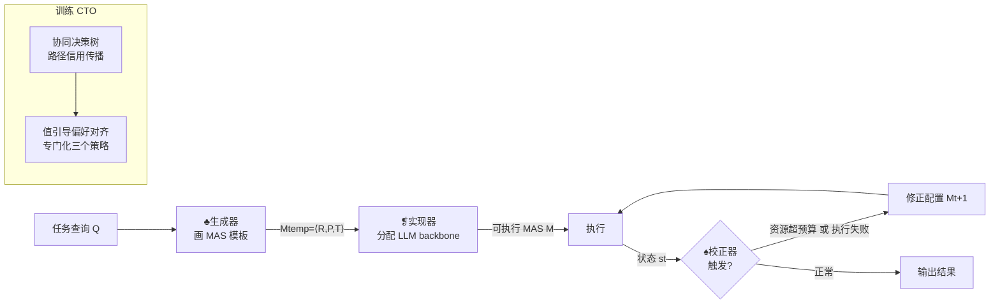

# MAS²: Self-Generative, Self-Configuring, Self-Rectifying Multi-Agent Systems

**会议**: ICLR 2026  
**OpenReview**: [https://openreview.net/forum?id=qumy27hMDY](https://openreview.net/forum?id=qumy27hMDY)  
**代码**: [https://github.com/yeyeyeah2/MAS2](https://github.com/yeyeyeah2/MAS2)  
**领域**: 多智能体系统 / 自动化 MAS 设计 / LLM Agent  
**关键词**: Multi-Agent System, Meta-Agent, Self-Generation, Self-Rectification, Offline RL  

## 一句话总结
MAS² 让一个"元多智能体系统"（生成器–实现器–校正器三元组）为每个任务现场架构、配置并在运行时动态纠错另一个多智能体系统，用协同树优化（CTO）离线 RL 专业化这三个元智能体，在 8 个 benchmark 上比 SOTA MAS 最高提升 19.6%，并稳居成本–性能 Pareto 前沿。

## 研究背景与动机
**领域现状**：LLM 多智能体系统（MAS）正从"手工配置 prompt/工具/角色/通信协议"（AutoGen、MetaGPT）走向"自动编排"。自动化路线又分两支：一支靠外部模块生成（GNN、贝叶斯优化、MCTS，如 GPTSwarm、AFlow、MaAS），另一支靠单个 LLM agent 生成（MAS-GPT、ScoreFlow、FlowReasoner）。

**现有痛点**：外部模块路线被限制在预定义的原子算子搜索空间（CoT、Reflexion、Debate），缺乏架构创新能力；agent 生成路线虽能做到任务级自适应，但**几乎都遵循"generate-once-and-deploy"（生成一次即部署）范式**——系统一旦实例化就原封不动地执行，无论成败。

**核心矛盾**：真实环境是动态且易错的（网络故障、工具崩溃、文件丢失），"一次生成即部署"的系统在单个意外扰动下就可能整体崩溃，且没有任何在初始实例之外自适应的能力。

**本文目标**：提出第三种范式，让 MAS 同时具备**自生成**和**自适应**能力——一个多智能体系统自主构造另一个多智能体系统，并在运行中持续监控、实时纠错。

**核心 idea**：**递归自生成（recursive self-generation）**——把"造系统"的职责拆解到专门训练的元智能体团队中：**生成器**画高层工作流模板、**实现器**填具体 LLM backbone 让模板可执行、**校正器**在运行时监控执行状态并即时修正，三者各司其职，从而既突破外部模块的创造力天花板，又克服"生成一次即部署"的僵化。

## 方法详解

### 整体框架
MAS² 的元 MAS 由三个元智能体串联：推理时，**生成器** $A_{gen}$ 接收任务查询 $Q$ 产出 MAS 模板 → **实现器** $A_{imp}$ 把模板实例化为可执行系统 → **校正器** $A_{rec}$ 在运行时持续监控并实时调整（§3.1）。这三个元智能体由**协同树优化（CTO）**框架训练：先通过路径级信用传播收集偏好信号（§3.2），再用值引导的偏好对齐专门化每个元智能体（§3.3）。

### 关键设计

**1. 目标 MAS 的四元组形式化与生成器–实现器解耦：先画蓝图再填资源**。MAS² 把待构造的目标系统统一形式化为 $M = \langle R, P, T, B \rangle$，其中 $R$ 是分配的智能体集合、$P=\{\rho_{ij}\}$ 是规定智能体间合法消息结构的通信协议、$T$ 是可用工具集（Python 解释器、playwright 浏览器等）、$B=\{b_i \mapsto r_i\}$ 是每个智能体的具体 LLM backbone。关键巧思在于把"造系统"拆成两阶段：生成器只负责架构层面，产出**抽象掉计算资源**的工作流模板 $M_{temp} = \langle R, P, T \rangle \sim \pi_{gen}(\cdot|Q)$——一个完整但未实例化的 MAS 蓝图；实现器再定义分配策略 $\phi: R \to L,\ r_i \mapsto b_{j(i)}$，从候选 LLM 池 $L=\{b_1,\dots,b_{|L|}\}$ 给每个角色挑 backbone，最终系统由 $M = M_{temp} \oplus \{(r_i, \phi(r_i))\}$ 组合而成。这种解耦让"架构创新"和"资源分配"两个本质不同的决策被不同的专家模型负责，也正是 Pareto 高效的来源——简单子任务交给小模型，复杂推理留给大模型。

**2. 校正器的触发–干预闭环：把"生成即部署"变成运行时自纠错**。这是 MAS² 区别于所有前作的核心。实例化的 $M$ 部署后开始执行，校正器 $A_{rec}$ 担任在线监控角色，其触发函数 $A_R(s_t) = \mathbb{1}[C(s_t) > \theta_C \vee O(s_t) = \text{Failure}]$ 监控执行状态 $s_t$：一旦累积资源消耗 $C(s_t)$（token 数、执行步数）超出预算 $\theta_C$，或操作结果 $O(s_t)$ 出现显式失败（搜索引擎失效、代码执行错误），就被激活。激活后校正器生成对当前配置的修改 $M_{t+1} \sim \pi_{rec}(\cdot|M_t, s_t)$，修改幅度可大可小——局部调整（重新分配工具、改 agent prompt，如把 Safari 换成 Chrome+Crawler）到全局架构变更（重写工作流代码）。系统随后用更新后的 $M_{t+1}$ 从 $s_t$ 继续执行。这个触发–干预闭环让生成的系统不仅为任务定制，还具备实时自我纠正能力，对长程、不可预测任务尤为关键。

**3. 协同树优化（CTO）与路径信用传播：把团队最终成败归因到每个元智能体的局部决策**。三个元智能体怎么训？CTO 为每个查询 $Q$ 构造一棵有根有向树 $G_Q=(V,E)$：根是查询节点，往下依次是生成器节点层、实现器节点层、以及执行中自适应出现的校正器节点，叶子是终止节点。树通过顺序采样展开——生成器从根分出 $K$ 个候选模板，实现器对每个模板扩展 $N$ 个可执行实例，校正器在调整 MAS 时再引入分支。一条轨迹 $\tau$ 是从根到叶的唯一路径。评估时引入**成本敏感的条件奖励** $R(\tau) = \mathbb{1}[R_p(\tau)] \cdot \frac{1}{C_{norm}(\tau)}$：失败轨迹奖励为零，成功轨迹按归一化资源消耗 $C_{norm}(\tau) = C(\tau) / \frac{1}{|T|}\sum_{\tau'} C(\tau')$ 给分，既奖励成功又惩罚浪费。叶子拿到奖励后通过**路径信用传播**反向归因到中间决策节点：节点价值 $V(v) = \mathbb{E}_{\tau \in T(v)}[R(\tau)] \approx \frac{1}{|T(v)|}\sum_{\tau \in T(v)} R(\tau)$，即所有经过该节点的轨迹的期望奖励，用蒙特卡洛估计把终局结果摊回到上游每个决策上。

**4. 值缩放的偏好对齐：让模型从"赢得最干净"的决策里学得最多**。标注好价值的决策树被翻译成偏好数据，但不同于标准二元偏好对，CTO 的元组带上了**胜出幅度** $\Delta V = V(v') - V(v'') > 0$（赢家后继节点与输家后继节点的价值差），即 $D_\pi = \{(c_v, a_{win}, a_{lose}, \Delta V)\}$，$\Delta V$ 量化了"这个决策到底比另一个好多少"。训练时把参考策略 $\pi_{ref}$（原始 LLM）精炼成专门策略，损失函数 $L_{CTO} = -\mathbb{E}[\Delta V \cdot \log\sigma(\beta\log\frac{\pi_\theta(a_{win}|c)}{\pi_{ref}(a_{win}|c)} - \beta\log\frac{\pi_\theta(a_{lose}|c)}{\pi_{ref}(a_{lose}|c)})]$ 用 $\Delta V$ 加权每一项，让模型对高置信度（价值差显著）的偏好对学得最多，对低边际对不那么敏感。该优化独立施加于生成器、实现器、校正器，得到三个专门化策略 $\pi^*_{gen}, \pi^*_{imp}, \pi^*_{rec}$。实现上用 Qwen3-8B 做三者 backbone，LoRA 微调（rank=8, alpha=16）。

## 实验关键数据

### 主实验表格
8 个 benchmark（多跳搜索 HotpotQA/Bamboogle/NQ、深度研究 BrowseComp+、代码 HumanEval/MBPP、数学 MATH），对比 13 个 baseline，每格为三次随机运行均值：

| Model | HotpotQA | Bamboogle | NQ | BrowseComp+ | HumanEval | MBPP | MATH |
|---|---|---|---|---|---|---|---|
| GPT-4o | 69.5 | 49.6 | 71.1 | 13.2 | 89.6 | 73.4 | 56.5 |
| DyLAN | 80.8 | 59.7 | 72.1 | 15.8 | 90.4 | 77.3 | 65.7 |
| MaAS | 83.6 | 62.0 | 76.0 | 14.0 | 92.8 | 82.2 | 70.1 |
| AFlow | 77.9 | 59.2 | 74.5 | 10.0 | 92.9 | 82.9 | 68.5 |
| ScoreFlow | 86.0 | 64.8 | 76.4 | 10.4 | 95.9 | 84.7 | 64.4 |
| **MAS²** | **89.3** | **67.2** | **79.1** | **19.7** | **97.0** | **85.1** | **71.3** |

MAS² 在全部 8 个 benchmark 上均取得最优，HotpotQA 较手工最佳 DyLAN 高 8.5%、BrowseComp+ 上最高提升 10.2%（相对单 LLM 均值）。

### 消融实验表格
在 MBPP / HotpotQA / MATH 上拆掉各组件（用未训练的 Qwen3-8B 替代或直接移除）：

| 变体 | MBPP | HotpotQA | MATH |
|---|---|---|---|
| w/o Generator | 79.0 | 86.6 | 63.1 |
| w/o Rectifier | 81.7 | 87.2 | 64.7 |
| w/o Implementor | 80.4 | 87.3 | 65.3 |
| **MAS²（完整）** | **85.2** | **89.3** | **71.3** |

去掉生成器掉得最狠（MBPP 85.2→79.0），证明三个模块缺一不可；校正器去掉后 MATH 掉 6.6%，凸显运行时自纠错的价值。

### 关键发现
- **现有自动 MAS 跨域泛化差**：MultiPersona 在 HumanEval(92.9%) 强但 MATH 反降 4.3%；ADAS 在 HotpotQA(78.5%) 好但 BrowseComp+ 仅 7.0%。MAS² 是唯一在全域稳定领先的。
- **跨 backbone 泛化**：训练时未见过的 LLM（Qwen3-Coder、GPT-5-Mini、Gemini-2.5-Pro）加入池中无需重训即可被利用，MATH 从 vanilla 69.7% 提到 90.6%，最高提升 15.1%。
- **Pareto 前沿**：Bamboogle 上比贵的 SC(GPT-4o) 高 12.8% 通过率且便宜 25 倍；NQ 上与 ScoreFlow 同等成本下高 2.7%。源于 LLM 级（易任务给小模型）+ 系统级（易题配轻量 MAS）的双层动态分配。

## 亮点与洞察
- **范式跃迁清晰**：把自动 MAS 历史梳理成"手工→外部模块生成→单 agent 生成→MAS 生成 MAS"四阶，MAS² 的"递归自生成"定位精准且自然。
- **运行时自纠错是真痛点**：直击"generate-once-and-deploy"在动态环境下的脆性，校正器的触发函数把"什么时候纠"和"怎么纠"都形式化了。
- **CTO 把多智能体信用分配做得优雅**：决策树 + 路径信用传播 + 值缩放偏好对齐，一条线把"团队成败如何归因到个体决策"讲清楚，且是离线 RL，数据效率高。
- **成本敏感奖励**很务实，直接把 token 成本写进 reward，避免了纯性能优化导致的"堆模型"。

## 局限与展望
- **校正器触发依赖显式失败信号**（报错、超预算），对"静默错误"（答案错但不报错）的检测能力存疑，论文未深入讨论。
- **元智能体 backbone 固定为 Qwen3-8B**，CTO 训练对更小/更大元模型的敏感性、以及元 MAS 自身的成本未充分剖析。
- **决策树展开的 $K, N$ 较小**（生成器 4 分支、每个实现器扩 2 次），搜索广度有限，复杂任务上是否够用待验证。
- 评测集中在 QA/代码/数学/搜索，**多轮交互式、真正长程的 agentic 任务**（如完整软件工程项目）尚未覆盖。

## 相关工作与启发
- **自动化 MAS**：外部模块路线（GPTSwarm、AgentPrune、G-Designer、ADAS、AFlow、MaAS、MermaidFlow）vs 模型驱动路线（MAS-GPT 用 SFT、ScoreFlow 用 DPO、FlowReasoner/Weak-for-Strong 用 GRPO）。MAS² 超越二者的"生成即部署"局限。
- **元 LLM 智能体**：多数从现成强 LLM 实例化（OWL、AgentOrchestra、AIME、Cognitive Kernel-Pro 的 manager/CEO agent），少数显式训练 leader（MLPO）。MAS² 把元智能体从"单个控制实体"升级为"元 MAS"。
- **RL for MAS**：训练外部模块 / 训练部分 agent（MLPO）/ 全量训练所有 agent（Sirius、MALT、MaPoRL、MARFT）三条流。CTO 属于"专门化元智能体"的离线 RL 路线。
- **启发**：递归自生成 + 运行时自纠错的组合，对构建鲁棒的长程 agent 系统是有价值的模板；值缩放偏好对齐可迁移到其他需要细粒度信用分配的多步决策训练。

## 评分
- **新颖性**: ⭐⭐⭐⭐⭐ "MAS 生成 MAS"的递归自生成范式 + 生成-实现-校正三元解耦 + 运行时自纠错，定位与方法都新颖。
- **实验充分度**: ⭐⭐⭐⭐ 8 benchmark / 13 baseline / 三次均值，含跨 backbone 泛化与成本分析，消融完整；但长程交互任务与静默错误场景缺位。
- **写作质量**: ⭐⭐⭐⭐⭐ 历史脉络梳理清晰、形式化严谨、图示（框架/决策树/case study）到位，可读性强。
- **价值**: ⭐⭐⭐⭐⭐ 直击自动 MAS 的脆性与跨域泛化痛点，方法可复现（已开源），对自适应 agent 系统设计有较强参考价值。

<!-- RELATED:START -->

## 相关论文

- [\[ICLR 2026\] Stochastic Self-Organization in Multi-Agent Systems](stochastic_self-organization_in_multi-agent_systems.md)
- [\[ICLR 2026\] MARSHAL: Incentivizing Multi-Agent Reasoning via Self-Play with Strategic LLMs](marshal_incentivizing_multi-agent_reasoning_via_self-play_with_strategic_llms.md)
- [\[ACL 2026\] Towards Self-Improving Error Diagnosis in Multi-Agent Systems](../../ACL2026/multi_agent/towards_self-improving_error_diagnosis_in_multi-agent_systems.md)
- [\[ACL 2026\] AgenticEval: Toward Agentic and Self-Evolving Safety Evaluation of Large Language Models](../../ACL2026/multi_agent/agenticeval_toward_agentic_and_self-evolving_safety_evaluation_of_large_language.md)
- [\[ICLR 2026\] Goal-Aware Identification and Rectification of Misinformation in Multi-Agent Systems](goal-aware_identification_and_rectification_of_misinformation_in_multi-agent_sys.md)

<!-- RELATED:END -->
