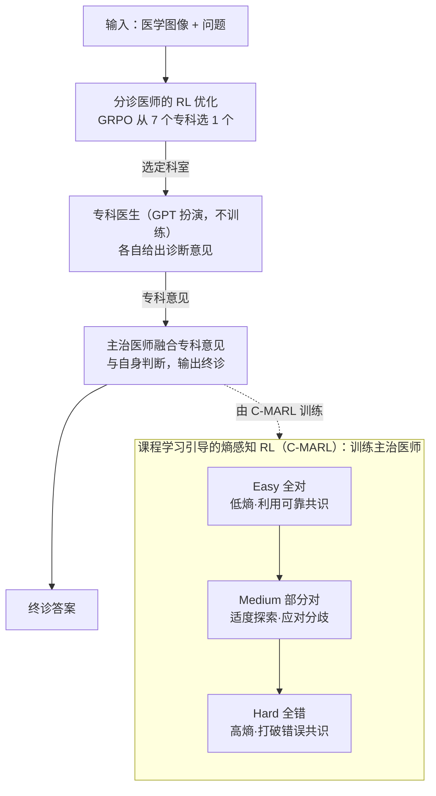

# MMedAgent-RL: Optimizing Multi-Agent Collaboration for Multimodal Medical Reasoning

**会议**: ICLR2026  
**arXiv**: [2506.00555](https://arxiv.org/abs/2506.00555)  
**代码**: 未开源  
**领域**: 医学图像  
**关键词**: multi-agent collaboration, reinforcement learning, medical VQA, curriculum learning, GRPO, clinical reasoning  

## 一句话总结
提出 MMedAgent-RL，通过 RL 优化模拟临床会诊流程（分诊→专科→主治）的多智能体系统，核心创新是课程学习引导的熵感知 RL（C-MARL），让主治医师智能体在面对正确/冲突/错误的专科意见时分别采取不同的探索-利用策略，在域内外共 5 个医学 VQA 基准上实现 SOTA。

## 背景与动机
- **单智能体局限**：医学影像诊断涉及多个亚专科（放射科、病理科、肿瘤科等），单一 Med-LVLM 难以覆盖所有专科知识
- **静态多智能体的不足**：MedAgents、MDAgents 等采用固定的 GP→Specialist→GP 流程，智能体交互模式预设且不可学习
- **专科意见不可靠**：专科模型输出并非总是正确，可能引入噪声甚至误导；多数投票可能压制正确的少数意见
- **核心挑战**：主治医师需要学会**何时信任专科共识（exploit）、何时挑战并独立探索（explore）**
- **RL 的机会**：DeepSeek-R1 等证明 RL 可增强 LLM 推理能力，但多智能体医学协作的 RL 优化尚未被探索

## 方法详解

### 整体框架
MMedAgent-RL 把一次医学 VQA 当成一场临床会诊来跑：先由**分诊医师**根据图像和问题挑出该看哪个专科，再让扮演专科医生的强模型给出诊断意见，最后由**主治医师**把专科意见和自己的判断融合成终诊。其中分诊医师和主治医师都基于 Qwen2.5-VL，用 RL 分阶段训练，专科医生则由 GPT 等强模型扮演，本身不参与训练。关键之处在于，主治医师不是被训成"照搬专科意见"，而是通过课程学习引导的熵感知 RL，学会在专科意见可靠时利用、在专科意见跑偏时质疑。

### 关键设计

**1. 分诊医师的 RL 优化：把"该找谁会诊"也学出来**

传统多智能体系统的分诊环节往往是写死的规则，而这里把它当成一个可学习的策略：给定图像和文本，模型要从 Pathologist、Radiologist、Surgeon、Oncologist、Endocrinologist、Ophthalmologist、Dermatologist 这 7 个候选专科里选一个，并解释选择理由。训练用 GRPO，监督信号来自数据集自带的图像模态标签（病理切片对应病理科、X 光对应放射科等）作为 ground truth，奖励由格式分和正确分组成，$R = R_{format} + R_{accuracy}$，其中 $R_{format}\in\{0,0.5\}$、$R_{accuracy}\in\{0,1\}$。这样不仅提高了分诊命中率，也让模型显式写出推理过程，为后续专科咨询打好基础。

**2. 课程学习引导的熵感知 RL（C-MARL）：让主治医师学会何时盲从、何时质疑**

专科意见并不总是对的——有时全对，有时有分歧，有时甚至集体跑偏形成误导性共识，主治医师如果一味相信多数意见就会被带歪。C-MARL 的做法是先按专科意见的可靠程度给训练样本分难度，再按难度调节策略的探索强度。具体地，用专科准确率 $s = \text{Acc}(y_d, y^*)$ 把数据切成三档：Easy（$s=1$，所有专科都对）、Medium（$0<s<1$，部分对、有分歧）、Hard（$s=0$，全错且共识误导）。训练时在标准 GRPO 目标上加一个随难度变化的熵正则项：

$$\mathcal{J}_{C\text{-}MARL}(\theta) = \mathbb{E}\big[\mathcal{J}_{GRPO}(\theta) + \gamma_s \cdot H_t(\pi_\theta)\big]$$

熵系数 $\gamma_s$ 随档位递增：Easy 档 $\gamma_{easy}\approx 0$，不鼓励额外探索，直接利用可靠的专科知识；Medium 档 $\gamma_{medium}>0$，适度鼓励探索，避免面对冲突意见时过度自信；Hard 档 $\gamma_{hard}\gg\gamma_{medium}$，强力推高探索，逼模型打破错误共识、靠自身判断翻盘。整个训练按 Easy → Medium → Hard 的顺序由易到难推进，对应主治医师从"先信专科"逐步过渡到"敢质疑专科"的能力养成。

**3. 课程学习的收敛性保证：为什么由易到难比直接硬训更好**

作者给出了 Theorem 4.1，证明这套课程式训练在收敛性上优于标准 SGD。直觉是课程学习的总训练时间取决于相邻阶段最优策略之间的距离之和 $\sum_{j=0}^{J-1}\log\|\theta_j^\star - \theta_{j+1}^\star\|_2^2$：当课程设计有效、相邻难度的最优解足够接近时，前一阶段的解就能作为后一阶段的热启动，距离之和很小，因而收敛更快；而标准 SGD 在同等条件下被证明无法收敛到最优策略（存在下界）。这给"先 Easy 后 Hard"的经验做法提供了理论依据，而非纯粹的启发式拼凑。

## 实验

### 主实验结果（准确率，%）

| 模型 | VQA-RAD | SLAKE | PathVQA | 域内Avg | OmniMedVQA | MMMU-Med | 域外Avg |
|------|---------|-------|---------|---------|------------|----------|---------|
| GPT-4o | 61.0 | 75.5 | 69.4 | 68.6 | 68.5 | 69.7 | 69.1 |
| Qwen2.5-VL-7B | 61.8 | 64.7 | 60.5 | 62.3 | 60.8 | 56.6 | 58.7 |
| MedVLThinker-7B | 63.7 | 67.8 | 65.2 | 65.6 | 62.4 | 57.0 | 59.7 |
| MDAgents | 66.8 | 68.2 | 65.4 | 66.8 | 58.2 | 52.3 | 55.1 |
| **MMedAgent-RL (7B)** | **71.5** | **76.2** | **72.3** | **73.3** | **73.3** | **71.9** | **72.6** |
| + Test-Time Scaling | 73.9 | 80.1 | 74.3 | 76.1 | 79.6 | 73.5 | 76.6 |

### 消融实验

| 配置 | VQA-RAD | SLAKE | OmniMedVQA | MMMU-Med |
|------|---------|-------|------------|----------|
| 完整 MMedAgent-RL | 71.5 | 76.2 | 73.3 | 71.9 |
| w/o Triage | 66.3 | 69.9 | 66.2 | 59.3 |
| w/o Specialists | 65.8 | 67.8 | 64.4 | 54.2 |
| w/o C-MARL | 63.5 | 65.5 | 57.9 | 50.2 |
| + Easy only | 64.7 | 69.3 | 68.2 | 58.0 |
| + Easy + Medium | 69.4 | 76.9 | 70.8 | 68.8 |
| + Easy + Medium + Hard | 71.5 | 76.2 | 73.3 | 71.9 |

### 关键发现
1. **C-MARL 贡献最大**：去掉 C-MARL 后平均下降 18.6%，是最核心组件
2. **每个课程阶段都有贡献**：Easy→Medium→Hard 逐步累加效果，验证了课程学习设计
3. **Hard 阶段至关重要**：模型在专科全部错误的"Hard"场景中提升最大（+20%），说明学会了"不盲从"
4. **域外泛化强劲**：OmniMedVQA（+13%）和 MMMU-Med（+15%）均大幅超越基座，超越 GPT-4o
5. **分诊准确性影响全链**：优化后的分诊医师为后续正确的专科咨询奠定基础（+3%）
6. **TTS（Test-Time Scaling）进一步提升性能**：majority voting 额外提升 4.5%

## 亮点
- C-MARL 的熵调节设计精妙：从探索-利用权衡的角度解决了多智能体中专科噪声问题
- 课程学习与 RL 的结合有理论保障（收敛性证明），非纯 heuristic
- 7B 模型在多项基准上超越 GPT-4o，展示了 RL 优化的潜力
- 实验设计全面：涵盖域内/域外、消融、专科选择、难度分层等多个维度

## 局限性
- 专科医生由 GPT 等闭源模型扮演，部署成本高且依赖第三方 API
- 分诊专科类别固定为 7 个，可能无法覆盖所有临床场景
- 课程的三级难度划分依赖 ground truth 标签，推理时无法获知难度级别
- 仅评估了多选题形式的 VQA，未涵盖开放式临床推理或报告生成
- 理论分析假设条件较强（如强凸性），实际深度网络未必满足

## 相关工作
- **医学 VLM**：LLaVA-Med、HuatuoGPT-Vision、VILA-M3 等单智能体模型
- **医学多智能体**：Agent Hospital、MedAgents、MDAgents — 静态预设流程
- **RL 增强推理**：DeepSeek-R1、VLM-R1 等 GRPO 后训练范式
- **课程学习**：从易到难的渐进式训练策略（Bengio et al., 2009）

## 评分
⭐⭐⭐⭐⭐ (5/5)

方法设计优雅，C-MARL 的熵调节策略既有直觉合理性又有理论支撑。实验全面且说服力强，7B 模型超越 GPT-4o 的结果令人印象深刻。课程学习与 RL 的结合为多智能体协作提供了新范式。

<!-- RELATED:START -->

## 相关论文

- [\[ACL 2026\] ConSensus: Multi-Agent Collaboration for Multimodal Sensing](../../ACL2026/multi_agent/consensus_multi-agent_collaboration_for_multimodal_sensing.md)
- [\[ICLR 2026\] Multi-Agent Design: Optimizing Agents with Better Prompts and Topologies](multi-agent_design_optimizing_agents_with_better_prompts_and_topologies.md)
- [\[ICLR 2026\] AgentPO: Enhancing Multi-Agent Collaboration via Reinforcement Learning](agentpo_enhancing_multi-agent_collaboration_via_reinforcement_learning.md)
- [\[AAAI 2026\] MedLA: A Logic-Driven Multi-Agent Framework for Complex Medical Reasoning with Large Language Models](../../AAAI2026/multi_agent/medla_a_logic-driven_multi-agent_framework_for_complex_medic.md)
- [\[ICLR 2026\] Adaptive Collaboration with Humans: Metacognitive Policy Optimization for Multi-Agent LLMs with Continual Learning](adaptive_collaboration_with_humans_metacognitive_policy_optimization_for_multi-a.md)

<!-- RELATED:END -->
