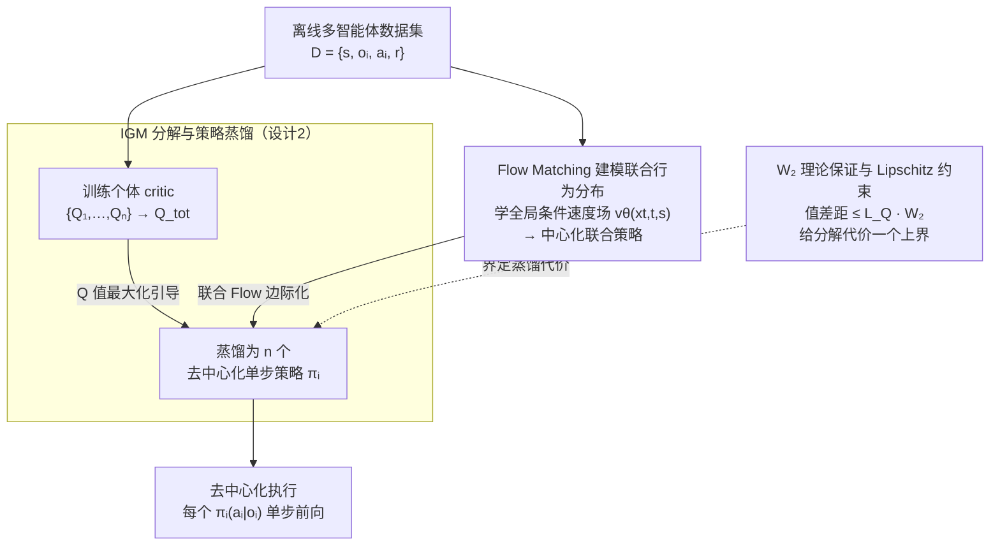

# Multi-agent Coordination via Flow Matching

**会议**: ICLR 2026  
**arXiv**: [2511.05005](https://arxiv.org/abs/2511.05005)  
**代码**: 无  
**领域**: 多智能体协调  
**关键词**: 多智能体协调, Flow Matching, 离线MARL, IGM策略蒸馏, 去中心化执行

## 一句话总结

提出 MAC-Flow，先用 Flow Matching 学习中心化联合行为分布，再通过 IGM（Individual-Global-Max）分解将其蒸馏为去中心化的单步策略，结合 Q 值最大化进行行为正则化训练，在 4 个基准 12 个环境 34 个数据集上实现了约 14.5 倍于扩散方法的推理加速，同时保持了与扩散策略可比的协调性能。

## 研究背景与动机

**领域现状**：离线多智能体强化学习（offline MARL）要求从预先收集的数据集中学习协调策略，而不与环境在线交互。当前方法大致分为两类——基于扩散模型的生成式方法（如 MADiff、DoF）通过多步去噪迭代建模联合动作分布，以及基于高斯策略的判别式方法（如 OMAC、CFCQL、ICQ）使用简单参数化快速出动作。

**现有痛点**：这两类方法各有致命缺陷。扩散策略表达力强、能建模多模态联合行为，但推理需要 50-200 步去噪，DoF 在 SMAC 上的训练甚至需要约 60 小时，完全无法满足实时决策需求。高斯策略推理只需单步前向传播，但高斯分布天然是单模态的，无法捕获多智能体系统中"同一状态下存在多种等效协调方案"的复杂结构，在多智能体交互中表现脆弱。

**核心矛盾**：多智能体协调同时需要 (i) 对离线数据中多样联合行为的丰富表示能力，以及 (ii) 在实时环境中高效执行的能力。这两者构成了一个根本性的 performance-efficiency trade-off——之前的方法必须在二者之间取舍。

**本文目标** 如何在保持接近扩散模型的多模态表达力的同时，实现与高斯策略相当的推理速度？具体需要解决三个子问题：(1) 如何高效学习联合行为的丰富表示；(2) 如何将联合表示分解为各智能体独立的策略；(3) 如何在分解过程中不丢失协调信息。

**切入角度**：作者观察到 Flow Matching 可以提供一个统一框架——它与扩散模型在表达力上相当，但训练目标更直接（直接匹配速度场而非学习去噪过程），且概率流更平滑、更适合做蒸馏。更关键的是，Flow Matching 的蒸馏与 IGM 分解可以自然结合：先学习中心化的联合 flow，再通过 $W_2$ 距离约束蒸馏为各智能体的独立单步策略，同时用 Q 值最大化引导策略朝高回报方向偏移。

**核心 idea**：用 Flow Matching 构建联合行为的中心化表示，然后通过 IGM 分解 + $W_2$ 蒸馏 + Q 值最大化将其压缩为去中心化的单步策略，从而在一个统一框架内同时获得表达力和推理效率。

## 方法详解

### 整体框架

MAC-Flow 采用中心化训练、去中心化执行（CTDE）的两阶段设计。输入是离线多智能体交互数据集 $\mathcal{D} = \{(s, o_i, a_i, r)\}$，最终输出是每个智能体 $i$ 的独立单步策略 $\pi_i(a_i | o_i)$，仅需一次前向传播即可生成动作。

- **阶段一（联合 Flow 学习）**：以全局状态 $s$ 为条件，使用 Flow Matching 训练一个中心化的联合策略 $\pi_{\text{joint}}(\mathbf{a} | s)$，其中 $\mathbf{a} = (a_1, \dots, a_n)$ 是所有智能体的联合动作。这一步通过行为克隆（BC）方式从离线数据学习，目的是构建对联合行为分布的丰富表示。
- **阶段二（IGM 蒸馏 + RL 优化）**：将联合 Flow 模型蒸馏为 $n$ 个独立的单步策略网络，每个策略 $\pi_i$ 仅以局部观测 $o_i$ 为条件。蒸馏以 IGM 原则为指导，结合行为正则化的 actor-critic 训练进行 Q 值最大化，确保分解后的策略既保留协调能力又朝高回报方向优化。

### 关键设计

**1. Flow Matching 建模联合行为分布：用平滑概率流取代多步去噪，从源头上换一个更好蒸馏的表示**

这一步对准的是"扩散表达力强但推理慢"的痛点。作者不去学扩散那套分步去噪过程，而是直接学一条从噪声到数据的概率流：定义连续时间插值路径 $x_t = (1-t) x_0 + t x_1$，其中 $x_0 \sim \mathcal{N}(0, I)$ 是噪声、$x_1$ 是数据集中的联合动作，然后训练一个以全局状态 $s$ 为条件的速度场网络 $v_\theta(x_t, t, s)$ 去匹配路径的切向量 $x_1 - x_0$。训练损失就是一个简单的均方误差 $\|v_\theta(x_t, t, s) - (x_1 - x_0)\|^2$；推理时从 $x_0 \sim \mathcal{N}(0, I)$ 出发，沿速度场积分约 10 步即可采出联合动作。实验里 Flow 步数从 1 加到 10 性能快速提升、超过 10 步就饱和，而扩散模型要 50-200 步才到位。

之所以特地换成 Flow，关键不在于它本身多强，而在于它"好蒸馏"。相比扩散，Flow Matching 训练目标更直接、超参更少、概率流更平滑；而蒸馏本质就是用简单模型去逼近复杂模型，平滑的流分布比扩散那种分步去噪分布更容易被单步策略拟合——这为下一步的去中心化分解铺平了路。

**2. IGM 分解与策略蒸馏：把中心化联合策略压成各智能体的独立单步策略，且不丢协调**

中心化联合策略表达力够了，但部署时每个智能体只看得到局部观测 $o_i$，必须拆成独立策略。作者借 QMIX/QTRAN 的 Individual-Global-Max（IGM）原则来保证拆得一致：如果全局 Q 值 $Q_{\text{tot}}$ 能分解为各个体 Q 值 $Q_i$ 的组合，且个体最优动作的组合恰好等于全局最优联合动作，那么每个智能体独立选自己的最优动作就等价于选出全局最优。具体蒸馏时，训练每个 $\pi_i$ 去逼近联合 Flow 边际化后的对应分量，并用 Q 值把策略往高回报区域引；蒸馏损失用 $W_2$（Wasserstein-2）距离衡量联合分布与乘积分布 $\prod_i \pi_i$ 之间的差异。

为什么不直接对联合 Flow 做行为克隆（BC）就完事？因为纯 BC 只能复现数据里已有的分布，发现不了数据中稀少但更优的协调模式。一个 toy 实验把这点讲得很清楚：数据集以两个次优协调模式 $(0,1)$ 和 $(1,0)$（各回报 +1）为主，最优模式 $(1,1)$（回报 +2）极其稀少；纯 BC Flow 只会复现次优模式，而加上 IGM + Q 最大化后，策略能主动偏向 $(1,1)$。这正是 IGM 分解配 Q 最大化的价值——在贴近数据分布的同时，往更优的联合动作上挪。

**3. $W_2$ 理论保证与 Lipschitz 约束：给"拆开会损失多少协调"一个可监控的上界**

分解不是没有代价——拆得太狠协调就会崩，但经验式蒸馏说不清崩到什么程度。作者用两条命题把这件事量化：Proposition 4.2 给出联合 Flow 分布与分解后乘积分布之间的 $W_2$ 距离上界，Proposition 4.3 进一步在 $Q_{\text{tot}}$ 为 $L$-Lipschitz 的假设下，把这个分布偏差转成值函数差距的上界：

$$|V_{\text{joint}} - V_{\text{factored}}| \leq L_Q \cdot W_2$$

toy 实验（Figure 3）直接验证了这条界：训练过程中值差距（value gap）始终严格落在 $L_Q \cdot W_2$ 的理论包络线以下，且随蒸馏损失同步下降。它的实用意义在于给出了一个可监控信号——只要 $W_2$ 蒸馏损失压得够小，值函数差距就有界，不必担心分解悄悄把协调能力拆没了。

### 损失函数 / 训练策略

- **阶段一（Flow 训练）**：条件 Flow Matching 损失 $\mathcal{L}_{\text{FM}} = \mathbb{E}_{t, x_0, x_1}\|v_\theta(x_t, t, s) - (x_1 - x_0)\|^2$，在离线数据集上通过 BC 方式训练
- **阶段二（蒸馏 + RL）**：每个智能体的 actor 优化 $\max_{a_i} Q_i(o_i, a_i) - \alpha \cdot D_{\text{KL}}(\pi_i \| \pi_{\text{ref}})$，其中 $\pi_{\text{ref}}$ 来自蒸馏的 Flow 边际化分布，$\alpha$ 控制行为正则化强度；critic 通过 IGM 混合网络将个体 $Q_i$ 聚合为 $Q_{\text{tot}}$，用离线 TD 学习训练
- **训练效率**：在 SMAC 上 MAC-Flow 训练耗时 1-5 小时，而 DoF（扩散方法）需要约 60 小时；在 MA-MuJoCo 上仅需 40-100 分钟，与 OMIGA、ICQ 等基线相当

## 实验关键数据

### 主实验

在 SMAC v1、SMAC v2、MPE、MA-MuJoCo 四个基准上评估，涵盖离散和连续动作空间、3 到 10 个智能体、多种数据质量（medium、medium-replay、medium-expert）。

| 维度 | 扩散方法 (DoF/MADiff) | 高斯方法 (OMAC/CFCQL/ICQ) | **MAC-Flow** |
|------|----------------------|--------------------------|-------------|
| 推理速度 | 慢（50-200 步去噪） | 快（单步） | **快（单步）** |
| 推理加速比 | 1× (基准) | ~14.5× | **~14.5×** |
| SMAC v1 性能 | 最佳（DoF 多数环境领先） | 中等 | **接近 DoF，显著优于高斯** |
| SMAC v2 性能 | DoF 领先 | 受限 | **略低于 DoF（高随机性环境）** |
| MA-MuJoCo 性能 | MADiff 可比 | 基线水平 | **与 MADiff 持平** |
| MPE 性能 | — | 基线水平 | **有竞争力** |
| 训练时间 (SMAC) | ~60 小时 | 1-3 小时 | **1-5 小时** |
| 在线微调支持 | 不支持 | 支持 | **支持** |

关键数值对比：
- MAC-Flow 在 SMAC v1 上与 DoF 平均性能可比，但在 SMACv2 的高随机性场景中略低于 DoF，作者解释为高方差联合行为空间对分解假设施加了更大压力
- 在连续控制（MA-MuJoCo）中，MAC-Flow 与 MADiff 性能持平，且显著优于自回归方法 MADT
- 训练速度比扩散方法快一个数量级，且可从离线无缝过渡到在线微调（Figure 4 展示 RQ3）

### 消融实验

| 消融配置 | 表现变化 | 分析 |
|---------|---------|------|
| 完整 MAC-Flow | 基准性能 | Flow 学习 + IGM 蒸馏 + Q 最大化协同工作 |
| 去掉 IGM（纯 BC 蒸馏） | 性能显著下降 | 仅做行为克隆无法偏向高回报的稀少协调模式 |
| 去掉 Q 最大化 | 性能下降 | 策略退化为数据分布的简单拟合 |
| Flow 步数 1→4→10 | 快速提升后饱和 | 10 步已充分，20 步几乎无增益 |
| Flow 步数 10→20 | 边际提升 | 说明 flow 远比扩散对步数鲁棒 |
| 扩散步数 50→100→200 | 持续提升 | DoF 的性能依赖于大量去噪步数 |
| 智能体数 3→5→8→10 (SMAC) | 训练时间线性增长 | MABCQ: 1h→2h; DoF: 48h→60h; MAC-Flow: 1.5h→3.5h |
| 智能体数 3→40 (landmark) | 性能稳定 | 在 Appendix H.4 的 landmark covering 实验中扩展到 40 个智能体仍保持协调 |

### 关键发现

- **IGM 是核心贡献而非 Flow Matching 本身**：Figure 7 显示单独使用 Flow Matching 并不是性能提升的主要驱动力，真正的提升来自 IGM 分解 + Q 最大化与 Flow 蒸馏的协同
- **XOR 失败模式**：在 Appendix H.6 的 XOR 环境中（最优联合动作要求两智能体反向选择），IGM 分解在数学上不可能保持一致性。联合 Flow 能正确学习到两个不相连的高密度模式，但蒸馏后的分解策略退化为接近均匀分布——这是方法的根本性局限
- **交互强度实验**：Appendix H.7 中作者构造了可控交互强度 $\zeta \in [0, 1]$ 的 payoff game，结果显示 $W_2$ 偏差随交互强度单调递增，当交互完全可分解时 MAC-Flow 几乎无损，而完全不可分解时出现明显退化
- **数据质量鲁棒性**：MAC-Flow 在 medium、medium-replay、medium-expert 各种质量的数据上一致表现良好，得益于 Q 最大化对数据集偏差的修正能力

## 亮点与洞察

- **Flow + IGM + Q 最大化的三位一体**：三者缺一不可的设计非常精巧——Flow 提供表达力，IGM 提供可分解性保证，Q 最大化弥补 BC 式生成模型只能复制数据分布的缺陷。这个组合比"扩散 + 蒸馏"更优雅，因为 Flow Matching 的 $W_2$ 蒸馏损失可以直接对接 IGM 分解的理论约束
- **理论-实验闭环**：Proposition 4.2-4.3 给出理论上界，Figure 3 的 toy 实验直接验证值差距确实落在理论包络线以下——这种"理论-实验"的闭环比很多纯经验或纯理论的工作都要令人信服
- **实用性极强的训练-部署叙事**：训练 1-5 小时 → 部署时单步推理 → 支持在线微调。这条路径清晰、可操作，对工业部署友好
- **可迁移到其他领域的设计范式**："先学表达力强的生成模型 → 再蒸馏为任务高效的执行策略 → 用约束优化保留关键结构"的范式可以推广到机器人控制（将 diffusion policy 蒸馏为轻量策略）、自动驾驶规划等场景

## 局限与展望

- **IGM 可分解性假设是硬约束**：当最优联合行为本质上不可分解（如 XOR 协调）时，方法会失败。这不是工程问题，而是 IGM 原则的理论极限。可能的改进是引入松弛的 IGM（如 QTRAN 的加法分解）或条件分解
- **SMACv2 高随机性场景的性能差距**：在高方差联合行为空间中，分解策略未能完全保留扩散策略的表现力。一个可能的改进方向是在推理时引入基于值梯度的测试时修正（test-time corrective refinement）
- **仅限离线评估**：虽然 Figure 4 展示了在线微调的能力，但主体实验仍限于离线设置。在需要动态适应队友变化（ad-hoc teamwork）或对手分布漂移的场景中，MAC-Flow 的表现未知
- **缺少代码开源**：目前无公开代码，难以复现。且评审指出与"Graph Diffusion for Robust Multi-Agent Coordination"的直接对比因代码不可用而无法进行

## 相关工作与启发

- **vs DoF (Diffusion for Offline MARL)**：DoF 在 SMACv2 等高随机性任务上略优，但推理所需 50-200 步去噪使其无法用于实时场景。MAC-Flow 以微小性能代价换取了 14.5 倍的推理加速——在大多数实际应用中这个 trade-off 是值得的
- **vs MADiff**：MADiff 在连续控制（MA-MuJoCo、MPE）中与 MAC-Flow 性能持平，但 MADiff 作为纯 BC 式生成模型，缺乏 Q 最大化能力，在数据质量不佳时可能退化
- **vs MADT (Autoregressive)**：自回归策略按智能体顺序依次生成动作，引入了人为的序列依赖。MAC-Flow 在所有数据集上均优于 MADT，因为 Flow 的并行生成 + IGM 分解避免了序列误差累积
- **vs OMAC/CFCQL/ICQ (Gaussian)**：高斯策略无法建模多模态协调，MAC-Flow 在保持相同推理速度的同时显著提升了协调质量

**启发**：这篇工作证明了生成模型在多智能体 RL 中不仅仅是"更好的 BC"——与值分解框架（IGM）结合后，可以在保持表达力的同时实现高效的去中心化执行。这个思路可以推广到单智能体的 offline RL 中（如将 diffusion policy 蒸馏为单步策略但保留多模态能力），也可以应用于机器人多臂协调等领域。

## 评分

- 新颖性: ⭐⭐⭐⭐ — Flow Matching + IGM 蒸馏 + Q 最大化的三位一体设计在 MARL 中是首创；但核心思想"生成模型 → 蒸馏"并非全新
- 实验充分度: ⭐⭐⭐⭐⭐ — 4 基准 × 12 环境 × 34 数据集，加上 rebuttal 中补充的可扩展性（40 智能体）、失败模式（XOR）、交互强度分析等，覆盖异常全面
- 写作质量: ⭐⭐⭐⭐ — 问题定义清晰，两阶段 pipeline 描述明了；理论部分有 bounded degradation 的保证而非过度宣称
- 价值: ⭐⭐⭐⭐ — 解决了离线 MARL 中表达力-效率权衡这一实际瓶颈，14.5 倍推理加速具有工程价值；但 Reviewer 评分 6/6/4 说明社区对方法的新颖度存在分歧

<!-- RELATED:START -->

## 相关论文

- [\[ICLR 2026\] Matching Multiple Experts: On the Exploitability of Multi-Agent Imitation Learning](matching_multiple_experts_on_the_exploitability_of_multi-agent_imitation_learnin.md)
- [\[ICLR 2026\] Breaking and Fixing Defenses Against Control Flow Hijacking in Multi-Agent Systems](breaking_and_fixing_defenses_against_control_flow_hijacking_in_multi-agent_syste.md)
- [\[ICLR 2026\] Emergent Coordination in Multi-Agent Language Models](emergent_coordination_in_multi-agent_language_models.md)
- [\[ACL 2026\] Explicit Trait Inference for Multi-Agent Coordination](../../ACL2026/multi_agent/explicit_trait_inference_for_multi-agent_coordination.md)
- [\[ICML 2026\] Voting Protocols as Coordination Mechanisms for Role-Constrained Multi-Agent Tutoring Systems](../../ICML2026/multi_agent/voting_protocols_as_coordination_mechanisms_for_role-constrained_multi-agent_tut.md)

<!-- RELATED:END -->
