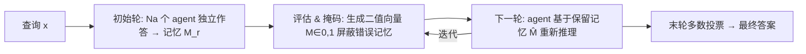

# Multi-Agent Debate with Memory Masking (MAD-M²)

**会议**: ICLR 2026  
**OpenReview**: [https://openreview.net/forum?id=EdTt8nMAMA](https://openreview.net/forum?id=EdTt8nMAMA)  
**代码**: [https://github.com/tmlr-group/MAD-MM](https://github.com/tmlr-group/MAD-MM)  
**领域**: 多智能体 / LLM 推理  
**关键词**: 多智能体辩论, 记忆掩码, 测试时扩展, LLM 推理, 鲁棒性  

## 一句话总结
本文指出多智能体辩论（MAD）会被上一轮残留的"错误记忆"带偏，并从理论上证明 MAD 性能受制于记忆质量，进而提出在每轮辩论前对上一轮记忆做"评估—掩码"过滤的 MAD-M²，让智能体只基于可靠记忆推理。

## 研究背景与动机
**领域现状**：扩展测试时采样是当前提升 LLM 推理的主流路线，而多智能体辩论（MAD, Du et al. 2023）让多个 LLM 充当 agent，通过多轮辩论、互相参考上一轮记忆来纠错和迭代精炼，被视为一种强力的推理范式——直觉上"看到别人的推理"能帮 agent 跳出自身偏见、识别并改正谬误内容。

**现有痛点**：MAD 的核心机制是"无条件读入上一轮所有记忆"。但上一轮的记忆本身可能是错的。论文用 MATH 数据集的真实案例（Fig.1）展示了一个尴尬现象：第一轮中本来答对的 Agent 1，在第二轮参考了答错的 Agent 2 的记忆后，反而被带偏、改成了错误答案。也就是说，**错误记忆会污染原本正确的推理**，而这一隐患此前几乎无人系统讨论。

**核心矛盾**：MAD 既靠"共享记忆"获益，又因"共享记忆"受害——记忆里好坏混杂，全盘接收等于把低质量示例塞进上下文当 demonstration，反而干扰 LLM。这也部分解释了为何很多场景下 MAD 打不过更简单的 CoT-SC。

**本文目标**：刻画 MAD 对错误记忆的脆弱性，并设计一个简单通用、无需训练的机制，在保留有用记忆的同时剔除错误记忆，从而提升 MAD 的鲁棒性与推理准确率。

**核心 idea（错误记忆即低质 demonstration）**：把每轮推理看作一次 in-context learning，错误记忆等价于会分散注意力的劣质示例；因此**在辩论轮之间插入"评估—掩码"操作，先净化上下文再推理**，比单纯增加采样数/agent 数更能稳定地提升性能。

## 方法详解

### 整体框架
MAD-M² 在传统 MAD 的两轮辩论之间插入一道"记忆净化"工序：首轮各 agent 独立作答形成记忆向量；此后每一轮开始前，先对上一轮全部记忆做批判性评估、生成一个二值掩码把疑似错误的记忆置零，agent 仅基于保留下来的记忆继续推理；如此迭代直到末轮，再用多数投票产出最终答案。

### 关键设计
**1. 二值掩码记忆过滤：把"读全部记忆"改成"读保留记忆"**。这是 MAD-M² 的骨架。设第 $r$ 轮得到记忆集 $M_r=[A_{\theta_1}(x,M_{r-1}),\dots,A_{\theta_{N_a}}(x,M_{r-1})]$，方法不再让下一轮无条件吃下整个 $M_r$，而是为每个 agent 生成一个二值掩码并逐元素相乘：$\hat{M}^{(i)}_r = M^{(i)}\odot M_r$，其中 $M^{(i)}=g^{\text{map}}_{A_{\theta_i}}(M_r)\in\{0,1\}^{N_a}$ 是把 agent 对各条记忆的评估映射成的掩码向量。被判为错误的记忆位置置 0、直接从上下文里消失，agent 只在净化后的 $\hat{M}^{(i)}_r$ 上推理。由于所有 agent 由同一模型初始化，掩码评估只需做一次即可共享，工程上很轻量。

**2. 主观掩码策略（Subjective Masking）：让 agent 自己投票剔除错误记忆**。具体做法是让 LLM 对每条记忆打 "YES / NO / NOT SURE" 三档标签；再根据预设过滤规则的严格程度，把 "NOT SURE" 归入 YES（宽松规则 L）或 NO（严格规则 S）。这个策略不依赖模型内部状态，纯靠 agent 的语义判断，代价是引入一次额外的自评估，会多消耗 token。实验显示它在能力相对较弱的模型上更有效——弱模型的语义判断比其置信度信号更可靠。

**3. 客观掩码策略（Objective Masking）：用困惑度当置信度信号筛记忆**。受 Fu et al. (2025) 启发，方法用 LLM 自身的困惑度（perplexity）作为客观判据：困惑度高通常意味着模型对生成内容不自信、更可能含谬误或幻觉，因此只保留困惑度最低的那条回答、其余全部掩掉。这条路无需额外的自评估对话，反而比 naive MAD **省 token**（实验中常为 ×0.6~0.7 的开销）。实验显示它在强模型（如 QwQ-32B、Qwen2.5-Math）上更有效——强模型的困惑度更能反映答案质量。

**4. Token 开销可控且有上界**。多轮交互天然带来 token 膨胀，论文给出了量化分析：主观策略因多了一步自评估，最坏情况（全部记忆都保留）下也只比 naive MAD 多 $N_a\sum_{r=2}^{N_{round}}\sum_{i=1}^{N_a}T^o_{r-1,i}$ 个输入 token，即 $N^{token}_{\text{MAD-M}^2}\le N_aN_{round}T^q+2N_a\sum_{r,i}T^o_{r-1,i}+\sum_{r,i}T^o_{r,i}$；客观策略因删掉大量记忆通常反而更省。

> 理论支撑：在 Assumption 2.1（agent 基于记忆答对的概率为 $e^{-\alpha N_e}$，$N_e$ 为错误记忆数）下，论文证明 2 轮 MAD 的成功概率界（Prop. 2.3）显式依赖于错误记忆数；在难题（$p<\tfrac12$）与易题（$p\ge\tfrac12$）两种情形下，**减少错误记忆 $N_e$ 都能一致提升性能**，而单纯增加 agent 数 $N_a$ 在难题下反而会让性能指数级恶化。这正是"掩码错误记忆"的理论依据，也解释了 MAD 常打不过 CoT-SC（可视作 MAD 的理想上界）。

## 实验关键数据
设定：3 个 agent、2 轮辩论；CoT / CoT-SC（6 路）/ MAD 为基线；在 Qwen2.5-7B-Instruct、Qwen2.5-Math-7B-Instruct、DeepSeek-Math-7B、QwQ-32B 上评测；数据集含数学推理（GSM8K、MATH、AIME24/25）与语言理解（MMLU-Pro），其中 AIME 为难题、其余为易题；结果取 5 个种子均值。T. 为相对 MAD 的 token 开销。

### 主实验表格（节选，Acc.% / T.）

| 模型 | 方法 | GSM8K | MATH | MMLU-Pro | AIME24 | AIME25 |
|------|------|-------|------|----------|--------|--------|
| Qwen2.5-7B | MAD | 91.8 / ×1.00 | 55.6 | 43.0 | 13.3 | 6.7 |
| Qwen2.5-7B | MAD-M²(S) | 89.0 / ×1.25 | 56.8 | **43.6** | 13.3 | 3.3 |
| Qwen2.5-Math-7B | MAD | 95.2 / ×1.00 | 71.2 | 34.2 | 6.7 | 6.7 |
| Qwen2.5-Math-7B | MAD-M²(O) | **95.4 / ×0.60** | **80.2** | **37.0** | **13.3** | **13.3** |
| QwQ-32B | MAD | 97.2 / ×1.00 | 79.2 | 75.4 | 76.7 | 73.3 |
| QwQ-32B | MAD-M²(O) | 96.6 / ×0.56 | 75.0 | 75.2 | **80.0** | **76.7** |

要点：在 Math/QwQ 等强模型上，客观策略 MAD-M²(O) 多数任务超过 MAD，且 token 开销降到约 ×0.6；在弱模型 Qwen2.5-7B 上主观策略 MAD-M²(S) 更占优。值得注意的是 MAD 本身在 Math 模型上常**不如 CoT-SC**，印证了理论分析。

### 消融/分析实验

| 分析 | 设置 | 结论 |
|------|------|------|
| 错误记忆识别能力 (Fig.3) | 严格 S vs 宽松 L 规则 | 客观掩码在强模型上识别更准，主观掩码在弱模型上更准 |
| 扩展 agent 数 (Fig.4) | $N_a$ 从 3 增至 10 | MAD 与 MAD-M² 都随 agent 数增益；MAD-M²(S) 在多数情形领先 |
| Token 消耗 | 主观 vs 客观 | 主观因自评估额外耗 token（×1.2~1.4）；客观删记忆反而省（×0.6~0.7） |

### 关键发现
- 错误记忆是 MAD 的真实瓶颈：理论与真实案例都表明，残留错误记忆会把答对的 agent 带偏，单纯堆 agent 数在难题上甚至适得其反。
- 没有"通吃"的掩码策略：弱模型靠语义自评（主观），强模型靠困惑度（客观），需按模型能力选策略。
- 客观策略性价比突出：在更强的数学模型上既提点又省 token，是更实用的默认选择。

## 亮点与洞察
- **理论先行**：用 $e^{-\alpha N_e}$ 刻画"记忆质量→推理成功率"，给出 CoT-SC / MAD 的成功概率界，证明"减错误记忆"优于"加采样"，并解释了 MAD 常败于 CoT-SC 的经验现象，分析角度新颖。
- **方法极简、即插即用**：不训练、不改模型，只在辩论轮间加一道掩码工序，适配任意开源 LLM。
- **把记忆质量当一等公民**：将"辩论=in-context learning、错误记忆=劣质示例"的类比落到可操作的过滤机制上，视角清晰。

## 局限与展望
- **增益不稳定**：在某些易题（如 GSM8K）和弱模型上，掩码反而略降准确率，说明过滤可能误删有用记忆，鲁棒性提升并非普适。
- **策略需手动选择**：主观/客观哪个更好高度依赖模型能力与规则严格度，缺少自动选择机制。
- **规模有限**：主要在 3 agent / 2 轮、7B~32B 模型上验证，更多轮、更大规模、更多样任务下的表现仍待考察；主观策略 token 开销偏高。
- **理论假设较强**：$e^{-\alpha N_e}$ 与同质 agent 等假设是简化模型，与真实 LLM 行为的契合度有待进一步检验。

## 相关工作与启发
- **MAD 谱系**：Du et al. (2023) 的多智能体辩论奠基；S-MAD (Li et al. 2024) 用静态图拓扑做稀疏通信、动态拓扑时记忆随机选取；S²-MAD (Zeng et al. 2025) 减少琐碎记忆交换。本文区别在于**记忆选择由 agent 评估或内部状态动态决定**，而非预定义/随机。
- **测试时扩展**：与 CoT-SC、test-time scaling 一脉相承，但强调"提质比增量更重要"。
- **启发**：困惑度作为无监督质量信号、把上下文净化当独立工序，可迁移到 RAG 去噪、agent 记忆管理、long-context 上下文压缩等场景。

## 评分
- **新颖性**: ⭐⭐⭐⭐ —— 首次系统刻画 MAD 对错误记忆的脆弱性并给出理论界，"评估—掩码"机制简洁有理论支撑。
- **实验充分度**: ⭐⭐⭐ —— 覆盖 4 模型 5 数据集且含理论/token/扩展性分析，但增益不稳定、规模较小（3 agent/2 轮）。
- **写作质量**: ⭐⭐⭐⭐ —— 动机—理论—方法—实验链条清晰，真实案例图示直观。
- **价值**: ⭐⭐⭐⭐ —— 即插即用、客观策略提点又省 token，对 MAD 实践有直接参考价值。

<!-- RELATED:START -->

## 相关论文

- [\[ICLR 2026\] MAD-Logic: Multi-Agent Debate Enhances Symbolic Translation and Reasoning](mad-logic_multi-agent_debate_enhances_symbolic_translation_and_reasoning.md)
- [\[ICLR 2026\] GraphPlanner: Graph Memory-Augmented Agentic Routing for Multi-Agent LLMs](graphplanner_graph_memory-augmented_agentic_routing_for_multi-agent_llms.md)
- [\[ICLR 2026\] Completing Missing Annotation: Multi-Agent Debate for Accurate and Scalable Relevance Assessment](completing_missing_annotation_multi-agent_debate_for_accurate_and_scalable_relev.md)
- [\[ACL 2026\] Latent Agents: A Post-Training Procedure for Internalized Multi-Agent Debate](../../ACL2026/multi_agent/latent_agents_a_post-training_procedure_for_internalized_multi-agent_debate.md)
- [\[ICML 2026\] E-mem: Multi-Agent Based Episodic Context Reconstruction for LLM Agent Memory](../../ICML2026/multi_agent/e-mem_multi-agent_based_episodic_context_reconstruction_for_llm_agent_memory.md)

<!-- RELATED:END -->
