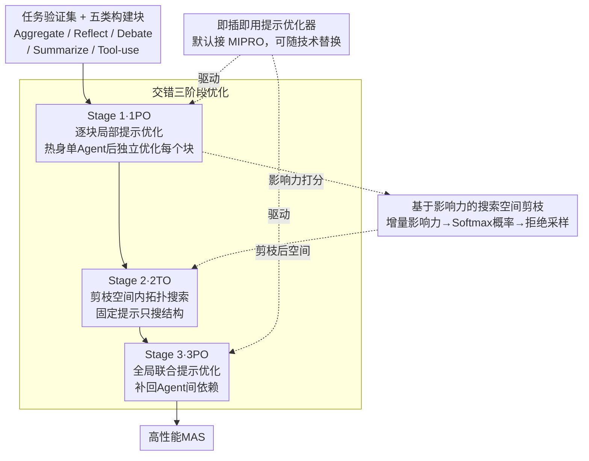

# Multi-Agent Design: Optimizing Agents with Better Prompts and Topologies

**会议**: ICLR 2026  
**arXiv**: [2502.02533](https://arxiv.org/abs/2502.02533)  
**代码**: 无  
**领域**: 多智能体系统  
**关键词**: 多智能体系统, 提示优化, 拓扑搜索, LLM Agent, 自动化设计

## 一句话总结

提出Multi-Agent System Search（MASS）框架，通过交错优化提示词和拓扑结构的三阶段策略（局部提示优化→拓扑搜索→全局提示优化），自动发现高性能的多智能体系统设计。

## 研究背景与动机

1. **领域现状**: 基于LLM的多智能体系统（MAS）通过多个Agent的交互与协作，在代码生成、推理、问答等复杂任务上优于单Agent系统。

2. **现有痛点**: 设计有效的MAS需要同时考虑每个Agent的提示词设计和Agent之间的拓扑编排，两者组合成庞大的搜索空间。现有自动化方法（如ADAS、AFlow）要么只优化拓扑而忽略提示词，要么搜索空间设计粗糙。

3. **核心矛盾**: 提示词和拓扑是MAS设计中两个关键因素，但它们的交互关系复杂——提示词敏感性在级联Agent中会放大，而非所有拓扑都对性能有正面影响。联合优化的组合复杂度过高。

4. **本文目标**: 系统分析MAS设计空间中各因素的影响，并提出高效的自动化优化框架。

5. **切入角度**: 先通过实证分析揭示提示优化比简单扩展Agent数量更具token效率，且有益拓扑只是搜索空间的一小部分。基于此剪枝搜索空间，并交错优化提示和拓扑。

6. **核心 idea**: 从局部到全局、从提示到拓扑的交错优化策略，可以高效征服MAS设计的组合复杂度。

## 方法详解

### 整体框架

MASS要解决的问题是：一个多智能体系统（Multi-Agent System，MAS）的好坏同时取决于每个 Agent 的提示词（prompt）和 Agent 之间的拓扑编排（topology），两者联合起来的搜索空间大到没法直接暴力搜。MASS 的破解办法是把这两个纠缠在一起的维度拆成「由局部到全局、先提示后拓扑」的三阶段流水线。输入是一个任务验证集和五类可选构建块（Aggregate、Reflect、Debate、Summarize、Tool-use）：Stage 1（1PO）先把单 Agent 的提示词热身好，再以它为锚点逐个优化每类构建块在最小配置下的提示词，顺带记录每个块的验证性能；Stage 2（2TO）拿着这些优化好的提示词，先按"影响力"把负收益的块剪掉，只在剪枝后的拓扑空间里采样、评估、搜最佳编排；Stage 3（3PO）再对选定拓扑做一次全局联合提示优化，把前两阶段为解耦而忽略的 Agent 间依赖补回来。整套流程无梯度，三阶段层层收窄，每步只面对一个可控子问题，最终吐出一个高性能 MAS。

### 关键设计

**1. 交错三阶段优化：把联合搜索拆成能管理的子问题**

MAS设计的根本困难在于提示词和拓扑要联合优化，但直接在整个多智能体系统上跑自动提示优化（APO）行不通——Agent之间存在级联依赖，提示词的微小扰动会被逐层放大，再加上端到端奖励稀疏，优化器根本拿不到有效梯度信号。MASS的破局思路是分而治之。Stage 1先把单Agent提示词热身到 $a_0^* \leftarrow \mathcal{O}_\mathcal{D}(a_0)$，再在以它为锚点的最小配置下独立优化每个构建块的提示词 $a_i^* \leftarrow \mathcal{O}_\mathcal{D}(a_i \mid a_0^*)$，这样每个块的优化都不受其它块干扰；Stage 2固定这些已优化的提示词，只在拓扑维度上采样和评估，把"搜什么提示"和"搜什么结构"解耦；Stage 3最后才把整套拓扑里的提示词放在一起联合微调，补回前两阶段为了解耦而忽略的Agent间依赖。三阶段层层收窄，每一步都只面对一个可控的子问题。

**2. 基于影响力的搜索空间剪枝：只在有正收益的拓扑里搜**

实验发现并非所有拓扑都对性能有正面贡献——比如在HotpotQA上只有debate带来增益，其余构建块反而拖后腿，若在完整空间里盲搜很容易把这些负面块组合进来。MASS为每个构建块算一个增量影响力 $I_{a_i} = \mathcal{E}(a_i^*) / \mathcal{E}(a_0^*)$，即该块加入后的效果相对单Agent基线的比值，再用带温度的Softmax把影响力转成选择概率 $p_a = \text{Softmax}(I_a, t)$。Stage 2采样拓扑时采用拒绝采样：对每个维度抽 $u \sim \text{Uniform}(0,1)$，若 $u > p_{a_i}$ 就拒绝该构建块。这等于按"历史正收益"给每个块加权，把搜索算力集中到真正有用的拓扑子集上，类比NAS里"搜索空间设计比搜索算法更重要"的洞察。

**3. 即插即用的提示优化器：不绑定具体APO算法**

MASS对提示优化器只做接口约定、不限定实现，默认接入MIPRO来联合优化指令文本和少样本示例（bootstrap 3个示例、10个指令候选、跑10轮）。这种解耦让框架可以随提示优化技术的进步直接换更强的优化器，而不必改动三阶段调度逻辑本身。

### 损失函数 / 训练策略

整个流程无梯度，优化目标直接是验证集上的任务指标（如MATH的准确率、DROP的F1）。Stage 1和Stage 3靠提示优化器（MIPRO）迭代提示词，Stage 2靠拒绝采样在拓扑空间里搜——这两阶段彼此独立、可完全并行，这也是MASS相比ADAS、AFlow等迭代式算法的效率优势所在。拓扑搜索共采10个候选，每个候选评估3次取平均以降低噪声。

## 实验关键数据

### 主实验

Gemini 1.5 Pro上8个基准任务的性能对比：

| 方法 | MATH | DROP | HotpotQA | MuSiQue | MBPP | HumanEval | LCB | 平均 |
|------|------|------|----------|---------|------|-----------|-----|------|
| CoT | 71.67 | 70.55 | 57.43 | 37.81 | 68.33 | 86.67 | 66.33 | 65.28 |
| Self-Consistency | 77.33 | 74.06 | 58.60 | 41.81 | 69.50 | 86.00 | 70.33 | 68.18 |
| Multi-Agent Debate | 78.67 | 71.78 | 64.87 | 46.00 | 68.67 | 86.67 | 73.67 | 70.26 |
| ADAS | 80.00 | 72.96 | 65.88 | 41.95 | 73.00 | 87.67 | 65.17 | 69.72 |
| **MASS** | **84.67** | **90.52** | **69.91** | **51.40** | **86.50** | **91.67** | **82.33** | **78.79** |

Gemini 1.5 Flash上MASS平均得分74.30%，对比CoT的60.87%提升13.43个百分点。

### 消融实验

| 配置 | 平均性能 | 说明 |
|------|---------|------|
| CoT (基线) | 65.28% | 单Agent零样本推理 |
| Stage 1 (1PO) | ~71% | 局部提示优化，比单Agent APO高6% |
| Stage 1+2 (1PO+2TO) | ~74% | 加入拓扑优化额外提升3% |
| Stage 1+2+3 (完整MASS) | 78.79% | 全局提示优化再提升~2% |
| 无剪枝的拓扑搜索 | 下降 | 引入负面构建块 |
| 无Stage 1的拓扑搜索 | 下降 | 未优化的Agent导致搜索在低质量空间 |

### 关键发现

- 提示优化的token效率远超简单增加Agent数量：优化后的单Agent + Self-Consistency优于默认提示的9-agent SC
- 并非所有拓扑对MAS都有正面影响——有益拓扑只是搜索空间的一小部分
- MASS可完全并行化Stage 1和Stage 2的优化，而ADAS和AFlow是迭代算法需等待前序完成
- 三个MAS设计原则：(1) 先优化个体Agent再组合；(2) 组合有影响力的拓扑；(3) 建模Agent间依赖关系（通过全局优化）

## 亮点与洞察

- **深刻的分析驱动设计**: 不急于提出方法，先通过大量实验分析MAS设计空间各因素的影响，结论令人信服
- **与NAS的类比精妙**: 借鉴神经架构搜索中"搜索空间设计比搜索算法更重要"的洞察，应用于MAS设计
- **提示优化的重要性被低估**: 揭示了大多数MAS工作忽略的关键因素
- **可并行化的优化**: 实际部署中可显著降低优化时间成本

## 局限与展望

- 搜索空间中的构建块仍需预定义，无法发现全新的Agent交互模式
- 拓扑构建规则是固定序列，可能限制了更灵活的Agent组合方式
- 优化成本仍然较高（需要大量API调用），对成本敏感的场景可能不适用
- 可探索跨任务迁移——已发现的MAS设计原则是否可直接应用于新任务

## 相关工作与启发

- DSPy和MIPRO提供了提示优化的基础设施，MASS在其上构建了MAS级别的优化
- ADAS通过meta-agent生成新拓扑但忽略提示优化，AFlow通过MCTS搜索但搜索空间未经剪枝
- 启发：在设计复杂系统时，分析各组件的影响力并剪枝搜索空间，比在完整空间上暴力搜索更高效

## 评分

- 新颖性: ⭐⭐⭐⭐ 交错优化的思路新颖，分析驱动的方法论值得借鉴
- 实验充分度: ⭐⭐⭐⭐⭐ 8个任务、4个LLM、多个基线，消融充分
- 写作质量: ⭐⭐⭐⭐⭐ 分析深入，逻辑严密，图表清晰
- 价值: ⭐⭐⭐⭐ 为MAS自动化设计提供了系统性框架和设计原则

<!-- RELATED:START -->

## 相关论文

- [\[ICLR 2026\] MAC-AMP: A Closed-Loop Multi-Agent Collaboration System for Multi-Objective Antimicrobial Peptide Design](mac-amp_a_closed-loop_multi-agent_collaboration_system_for_multi-objective_antim.md)
- [\[ICLR 2026\] Strategic Planning and Rationalizing on Trees Make LLMs Better Debaters](strategic_planning_and_rationalizing_on_trees_make_llms_better_debaters.md)
- [\[ICLR 2026\] MMedAgent-RL: Optimizing Multi-Agent Collaboration for Multimodal Medical Reasoning](mmedagent-rl_optimizing_multi-agent_collaboration_for_multimodal_medical_reasoni.md)
- [\[ICML 2026\] Smarter Saboteurs, Better Fixers: Scaling & Security in Linear Multi-Agent Workflows](../../ICML2026/multi_agent/smarter_saboteurs_better_fixers_scaling_security_in_linear_multi-agent_workflows.md)
- [\[ICLR 2026\] Graph-of-Agents: A Graph-based Framework for Multi-Agent LLM Collaboration](graph-of-agents_a_graph-based_framework_for_multi-agent_llm_collaboration.md)

<!-- RELATED:END -->
