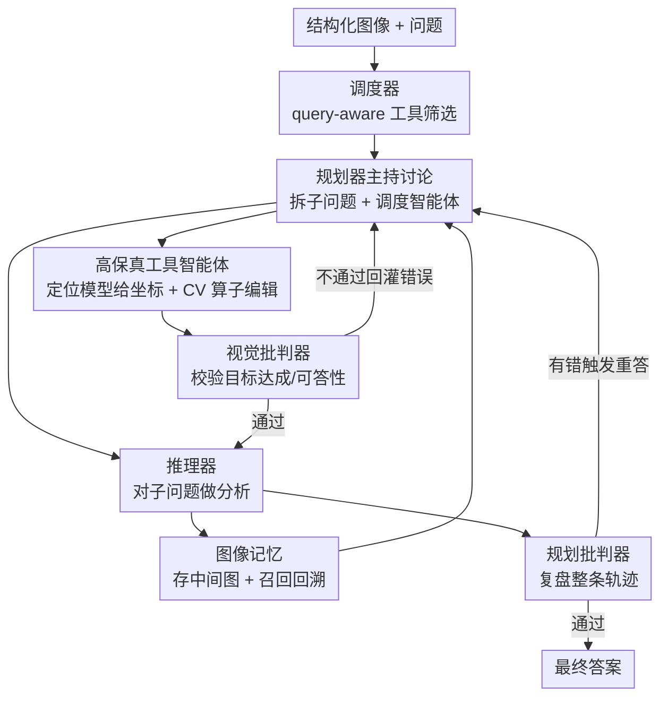

# PixelCraft: A Multi-Agent System for High-Fidelity Visual Reasoning on Structured Images

**会议**: ICLR 2026  
**OpenReview**: [https://openreview.net/forum?id=HtpjSCs3g5](https://openreview.net/forum?id=HtpjSCs3g5)  
**代码**: https://github.com/microsoft/PixelCraft  
**领域**: 多智能体 / 多模态VLM / 视觉推理  
**关键词**: 结构化图像、多智能体、高保真定位、图像记忆、自我批判

## 一句话总结
PixelCraft 用一套「调度器 + 规划器 + 推理器 + 双批判器 + 视觉工具智能体」的多智能体系统，把微调出来的像素级定位模型当「眼睛」、传统 CV 算子当「手」，再配上可回溯分支的图像记忆，让 GPT-4o / Claude 等 MLLM 在图表和几何这类结构化图像上的推理准确率显著提升（CharXiv 上 +5.6~9.5 个点）。

## 研究背景与动机
**领域现状**：图表、几何图这类「结构化图像」对多模态大模型（MLLM）一直是硬骨头。它们和自然图像不同，编码的是坐标、数据点、连线、数值标注这类符号化、结构化元素，需要的是精确的符号抽象而非纹理/物体级的模式识别，且对粒度极敏感——把某根柱子的高度读错一点点，下游结论就全错。主流做法从纯文本 CoT 微调，发展到用中间「视觉线索」（visual CoT）来引导推理，比如把图裁一裁、标一标再喂回去。

**现有痛点**：现有 visual CoT 方法有两个硬伤。其一是**图像处理保真度低**：它们要么依赖图表的源代码（现实中往往拿不到），要么用粗糙的轮廓/直线检测，只能覆盖很窄的一类图，在 CharXiv、ChartQAPro 这类真实复杂 benchmark 上掉链子。其二是**推理范式僵硬**：大多是「一步编辑」或链式线性推理，每张中间图只能从上一张派生，模型被迫单向独白，无法像人那样「提出假设 → 视觉验证 → 遇矛盾回溯改前提」。少数自然图工作虽有 zoom-in、多区域标注的非线性苗头，但撑不起结构化图像所需的递归探索。

**核心矛盾**：结构化图像推理同时要「高保真感知」和「灵活多步推理」，而现有方法在这两点上都不到位——低保真的工具喂进来的中间图本身就不可靠，线性范式又没法纠错和换路。更糟的是，把所有历史图无脑塞进上下文，既造成长上下文开销，又会让 MLLM 在多图输入下性能退化。

**本文目标**：(1) 造一套对各类图表/几何图都管用的高保真图像处理工具；(2) 让推理过程能分支、回溯、动态调整，而不被历史图淹没。

**切入角度**：作者把「感知」和「操作」解耦——用一个小 MLLM 微调成精确的像素级定位模型当「smart eye」负责把文字指代映射到坐标，再让经典 CV 算子当「robotic hands」按坐标做精确编辑；同时把推理组织成一个以规划器为中心、多角色讨论 + 自我批判的非线性工作流，并引入一块「认知白板」式的图像记忆。

**核心 idea**：用「微调定位模型 + CV 算子」换掉低保真工具，用「规划器管理的图像记忆 + 多智能体讨论 + 双层批判」换掉线性 visual CoT，从而在结构化图像上做到高保真且可回溯的视觉推理。

## 方法详解

### 整体框架
PixelCraft 是一个多模态多智能体系统：MLLM 同时扮演调度器（dispatcher）、规划器（planner）、推理器（reasoner）和两个批判器（planning critic / visual critic），再外挂一组专用视觉工具智能体（tool agents）。给定一张结构化图像和一个问题，系统跑一个**三阶段动态工作流**：① 调度器做 query-aware 的工具筛选，只激活与问题相关的工具智能体；② 规划器主持「角色驱动的讨论」，把复杂问题拆成子问题，逐步调用工具智能体处理图像、调用推理器做分析，期间 visual critic 实时校验中间图；③ 生成初步答案后，planning critic 复盘整条轨迹，发现错误就触发第二轮重答。

贯穿全程的是规划器管理的**图像记忆**：所有中间视觉产物（处理后的图 + 文字描述）都存进记忆，规划器可以按需自适应地召回任意历史图，从而支持探索不同推理分支、回溯修正，而不是把图无脑流式塞进上下文。工具智能体的「高保真」则来自一个在合成语料上微调的 Qwen2.5-VL-3B 定位模型——它给出像素级坐标，驱动 CV 算子做精确裁剪/遮罩/画线。

### 关键设计

**1. 高保真工具智能体：用微调定位模型 + CV 算子做像素级编辑**

针对「现有视觉工具保真度低、只能覆盖窄类图」的痛点，作者把工具拆成「眼睛 + 手」两层。直接让 LLM 自动生成工具会失败——要么因为缺精确的 grounding 坐标而无效，要么代码本身就跑错、产出错误的视觉输出。于是作者采用半自动方案：先在精心构造的数据集上微调一个紧凑的 Qwen2.5-VL-3B 作为定位模型，把文字指代精确映射到像素坐标；这些坐标再驱动经典 CV 算子完成实际编辑，无效工具则人工修正。

图表场景配了四个工具：子图裁剪（按「第 2 行第 1 列」这类文字描述裁出单个子图）、区域放大（带 x/y 轴刻度地放大局部）、添加辅助线、按图例遮罩数据（识别某图例项对应的颜色，把无关数据系列遮掉）。几何场景基于点/线及其关系配了点连接、作垂线、作平行线，外加一个代码执行工具做数值计算。这套设计的关键在于：grounding 由专门微调的模型保证，编辑由确定性的 CV 算子保证，二者协同把中间图的可靠性从源头拉满——消融显示定位模型把 IoU 从 0.26 提到 0.93。

**2. 规划器中心的非线性工作流 + 图像记忆：让推理能分支和回溯**

针对「线性 visual CoT 僵硬、无法回溯」的痛点，作者把推理交给规划器统一编排。规划器像乐团指挥，把复杂 query 拆成可处理的子问题，逐步决定下一个该激活哪个智能体（工具智能体或推理器），并给工具智能体下达具体目标（如「裁第 1 行第 1 列的子图」）、给推理器抛精确子问题，处理后的图与文字信息都经由规划器在智能体间流转。

真正解锁灵活性的是**图像记忆**这块「认知白板」：传统做法把所有历史图都塞进上下文，既有严重长上下文开销，又把推理锁死成链式；PixelCraft 则把所有中间视觉产物存进记忆，规划器可以在任意一步自适应召回某张历史图，从而探索另一条推理分支、回溯修正早先假设。这让推理摆脱了「一次性、单向」的本质，又顺带压低了上下文开销——controlled 对比显示，同样的工具和 prompt 下，这套「图像记忆 + 图像选择」的设计比单规划器单体处理的 visual CoT 在 CharXiv 上 65.0→68.1。

**3. 双层批判器：把视觉错误挡在传播之前，再事后纠错**

视觉工具不像确定性代码，会引入错误，一旦错误中间图被当作事实喂下去就会级联崩盘。作者因此设计了**两个工作在不同阶段的批判器**。视觉批判器（visual critic）做 in-loop 校验：工具处理完图后，它检查「目标达成度」（这次裁剪/遮罩是否真的完成了规划器下达的目标）；中间图连同子问题送给推理器前，它再检查这张图的「可答性」；一旦发现问题就把错误警报回灌给规划器重新规划。规划批判器（planning critic）做 post-hoc 复盘：初步答案生成后，它审视整条工具使用序列和逻辑步骤，找出用了次优工具、推理路径有缺陷之类的问题，提出增删工具、改写子问题等修正建议，作为第二轮重答的额外输入。两层批判一前一后形成稳健的纠错闭环——消融里 VC 和 PC 各自都带来稳定的正向增益。

### 一个完整示例
以论文 Fig. 1/2 的问题为例：「右上子图（n=80, K=5）和中左子图（n=20, K=10）中 HOVz 从头到尾的下降幅度之差是多少？（四舍五入到 0.1）」。流程是：调度器判断该题需要「子图裁剪」和「按图例遮罩数据」两个工具并激活之；规划器拆出第一个子问题——裁出右上子图，工具智能体用定位坐标裁图，视觉批判器确认「裁剪成功、可答」后交给推理器读出该子图的下降幅度（如 0.9→0.4，降 0.5）；规划器随后从图像记忆里换出中左子图、必要时遮罩无关曲线，推理器读出另一段降幅（0.9→0.3，降 0.6），算出差值 0.1；最后规划批判器复盘整条轨迹确认工具使用、推理过程和最终答案均正确，输出 0.1。整个过程中规划器靠图像记忆在两个子图间来回切换，而不是把所有图一次性堆进上下文。

### 损失函数 / 训练策略
定位模型的训练把结构化图像 grounding 形式化为自回归序列预测：给定图像 $I$ 和文字 prompt $P$，模型生成序列 $Y=(y_1,\dots,y_T)$，联合编码文字答案与对应边界框，空间位置用绝对坐标表示以对齐模型原生 grounding 格式。训练数据是一个混合数据集：程序化合成图表（用 GPT-4o 产结构化 JSON 规格 + 改写 Matplotlib 模板渲染，渲染时插桩抽取所有元素精确坐标，单面板 43k + 多面板 2~16 子图组合 10k，共 53k 标注对）加上 Inter-GPS 的 2,000 个几何样本（抽取几何点坐标及文字标签，用于点级几何工具），在此之上微调 Qwen2.5-VL-3B。

## 实验关键数据

### 主实验
三个挑战性图表 benchmark（CharXiv 取 reasoning 子集、ChartQAPro 和 EvoChart 全测试集），用 GPT-4.1-mini 做 LLM-as-a-judge，跨三个 backbone 评测：

| Backbone | Benchmark | CoT | 之前最好基线 | PixelCraft | 提升(vs Direct) |
|----------|-----------|-----|------|------------|------|
| GPT-4o | CharXiv | 51.1 | 52.4 (Reconcile) | **55.2** | +5.6 |
| GPT-4o | ChartQAPro | 56.52 | 56.52 (CoT) | **58.83** | +6.32 |
| GPT-4o | EvoChart | 68.64 | 68.64 (CoT) | **70.24** | +7.60 |
| GPT-4.1-mini | CharXiv | 63.8 | 63.8 (CoT) | **68.1** | +9.5 |
| GPT-4.1-mini | ChartQAPro | 62.21 | 62.21 (CoT) | **65.56** | +7.71 |
| Claude-3.7 | CharXiv | 68.3 | 68.5 (Reconcile) | **73.9** | +6.8 |

值得注意的是，纯多智能体方法（Debate / Reconcile）几乎没增益，说明没有专用视觉工具的多智能体根本搞不定图表视觉推理；Refocus 这类「LLM + 图表工具」表现不稳定，多处甚至不如 CoT，印证其视觉工具不足以处理复杂结构化图像。几何方面，在 Geometry3K 辅助线子集上 PixelCraft 同样全面领先（GPT-4.1-mini 34.38、Claude 33.59，均为各 backbone 最高）。

### 消融实验
逐角色累加消融（GPT-4.1-mini）：

| 配置 | CharXiv | ChartQAPro | 说明 |
|------|---------|------------|------|
| CoT (无组件) | 63.8 | 62.21 | 基线 |
| +工具智能体 TA | 65.0 | 63.66 | 增益最大，专用工具是刚需 |
| +TA +调度器 Disp | 65.9 | 64.43 | 过滤无关工具→工具使用更准 |
| +TA +视觉批判 VC | 66.0 | 63.96 | 过滤无效中间图 |
| +TA +Disp +VC | 67.5 | 64.89 | 三者协同 |
| 全模型 (+规划批判 PC) | **68.1** | **65.56** | 最佳 |

### 关键发现
- **工具智能体贡献最大**：从 CoT 到 +TA 在 CharXiv 上直接 +1.2，是单组件里增益最高的，印证「专用高保真工具」才是结构化图像推理的核心瓶颈。
- **定位精度直接决定上游天花板**：微调定位模型把 IoU 从 0.26 拉到 0.93，对应下游 agent 系统准确率显著高于用 base 模型；base 模型和 Refocus 在示例里都定位失败，而本文模型能准确框出目标子图。
- **工具调用高度 query/image 驱动且不均衡**：CharXiv 上「子图裁剪」被调 351 次（因多为多图、问单子图深析或子图对比），几何上「点连接」56 次最高；但每个工具在其被激活的子集上都带来增益，「按图例遮罩」在 CharXiv 上 +18.4%、「作平行线」在 Geometry3K 上 +50%。
- **自我批判能精准识别错误答案**：三轮复盘里识别出的多为真阳性（base 阶段 39 TP / 仅 3 FP / 1），重答后准确率稳步抬升，说明 planning critic 的纠错是有效而非噪声。

## 亮点与洞察
- **「眼睛 + 手」解耦**：把感知（微调定位模型给坐标）和操作（确定性 CV 算子做编辑）分开，绕过了「让 LLM 直接生成可靠视觉工具」这个老大难——这是把 LLM 自动生成工具的失败教训直接转化成的设计选择，可迁移到任何「需要精确空间操作」的 agent 工具链。
- **图像记忆当「认知白板」**：用按需召回替代「历史图全塞上下文」，一举解决了线性 visual CoT 的「不能回溯」和「多图退化 + 长上下文开销」两个问题，思路很干净。
- **双层批判分工明确**：visual critic 管「图对不对」（in-loop），planning critic 管「路走得对不对」（post-hoc），把视觉错误和逻辑错误分层拦截，比单一 critic 更可控。
- **小模型也能当高保真组件**：3B 的定位模型 IoU 0.93，证明在 agent 系统里，专精的小模型 + 经典算法的组合可以比硬堆大模型更划算。

## 局限与展望
- 作者承认自动生成的工具大量无效，最终仍需人工修正工具、且工具集是为图表/几何手工设计的，**工具的可扩展性和通用性**仍受限——换个结构化图像域（如电路图、乐谱）可能要重做工具和定位数据。
- 系统是多智能体多轮讨论 + 多轮批判重答，**计算/调用开销**相对单次 CoT 明显更高（效率分析放在附录），实时性场景未必划算。
- 定位模型依赖程序化合成图表 + Inter-GPS 几何标注，**合成数据与真实复杂图（如手绘、扫描、信息图）的分布差异**可能影响泛化（作者在附录补了 infographics 泛化分析，但正文主战场仍是图表/几何）。
- geometry 评测仅 128 个筛选样本，样本量偏小，结论稳健性有待更大规模验证。

## 相关工作与启发
- **vs Refocus / Visual Sketchpad（链式 visual CoT）**：它们依赖轮廓/直线检测或源代码做图像处理，工具专用、覆盖窄，且线性推理不能回溯/分支；PixelCraft 用微调定位模型把保真度拉满、用图像记忆解锁非线性推理，在它们失效的复杂 benchmark 上稳定领先。
- **vs Debate / Reconcile（多智能体辩论）**：它们靠多个推理器辩论聚合答案，但没有专用视觉工具，在图表视觉推理上几乎无增益；PixelCraft 走的是「专精角色协同 + 工具智能体」路线，而非「辩论选优」。
- **vs Set-of-Mark / 自然图工具方法**：SoM 等给自然图叠标记提供视觉词汇，主要服务 grounding/检测；PixelCraft 聚焦结构化图像这一对保真度要求极高的域，并把工具、记忆、批判组织成完整的非线性推理系统。

## 评分
- 新颖性: ⭐⭐⭐⭐ 「定位模型 + CV 算子」高保真工具与「图像记忆支持回溯」的组合在结构化图像推理上是有辨识度的系统级创新
- 实验充分度: ⭐⭐⭐⭐ 三 benchmark × 三 backbone + 几何任务 + 逐角色消融 + 工具频率/纠错分析，证据链完整，仅几何样本偏少
- 写作质量: ⭐⭐⭐⭐ 动机推导清晰，「眼睛/手」「认知白板」等比喻到位，工作流讲得明白
- 价值: ⭐⭐⭐⭐ 即插即用地提升多种 MLLM 在图表/几何上的推理，且代码开源，实用性强

<!-- RELATED:START -->

## 相关论文

- [\[ICLR 2026\] From What to Why: A Multi-Agent System for Evidence-based Chemical Reaction Condition Reasoning](from_what_to_why_a_multi-agent_system_for_evidence-based_chemical_reaction_condi.md)
- [\[ACL 2026\] From Query to Counsel: Structured Reasoning with a Multi-Agent Framework and Dataset for Legal Consultation](../../ACL2026/multi_agent/from_query_to_counsel_structured_reasoning_with_a_multi-agent_framework_and_data.md)
- [\[CVPR 2026\] Visual Document Understanding and Reasoning: A Multi-Agent Collaboration Framework with Agent-Wise Adaptive Test-Time Scaling](../../CVPR2026/multi_agent/visual_document_understanding_and_reasoning_a_multi-agent_collaboration_framewor.md)
- [\[ICLR 2026\] MAC-AMP: A Closed-Loop Multi-Agent Collaboration System for Multi-Objective Antimicrobial Peptide Design](mac-amp_a_closed-loop_multi-agent_collaboration_system_for_multi-objective_antim.md)
- [\[ICLR 2026\] CoAct-1: Computer-using Multi-agent System with Coding Actions](coact-1_computer-using_multi-agent_system_with_coding_actions.md)

<!-- RELATED:END -->
