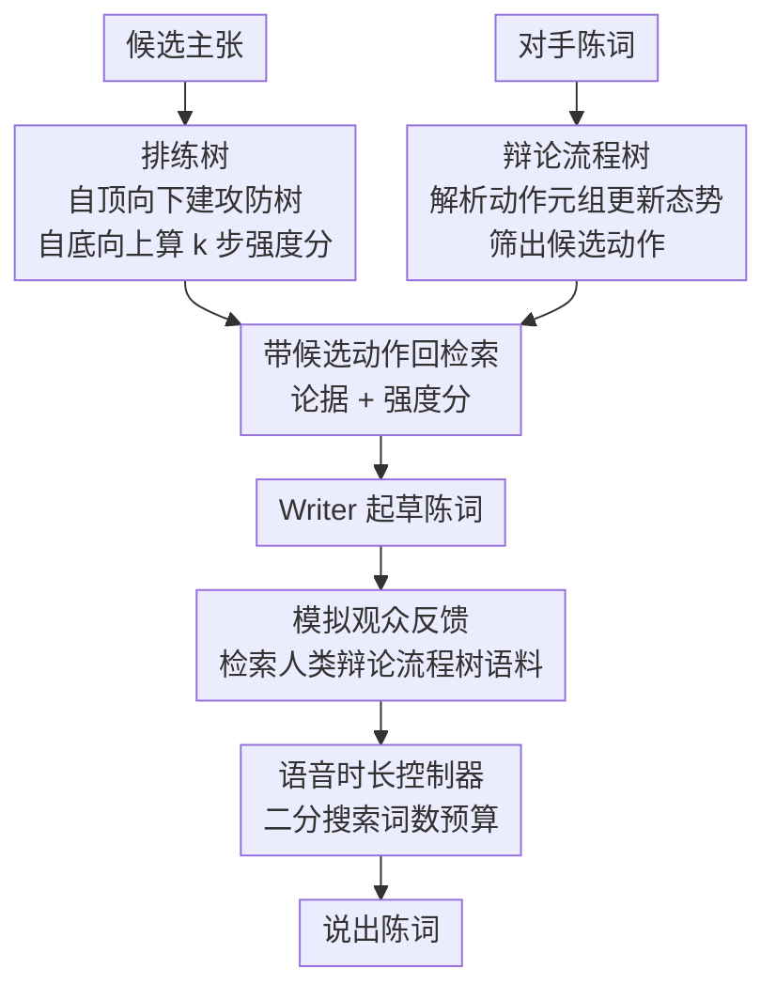

# Strategic Planning and Rationalizing on Trees Make LLMs Better Debaters

**会议**: ICLR 2026  
**OpenReview**: [https://openreview.net/forum?id=E1hbqtHrvg](https://openreview.net/forum?id=E1hbqtHrvg)  
**代码**: https://github.com/LeiLiLab/TreeDebater  
**领域**: Agent / 多智能体 / LLM 推理  
**关键词**: 竞技辩论、树结构规划、多智能体、时间预算、说服力

## 一句话总结
本文提出 TreeDebater，用「排练树（Rehearsal Tree）」预演对手的攻防、用「辩论流程树（Debate Flow Tree）」追踪辩论态势，再配合模拟观众反馈和语音时长控制器，让 LLM 在严格限时的竞技辩论中学会把宝贵的发言时间分配给最有冲击力的动作，人类评测下相比此前 SOTA 多智能体辩论系统在分阶段说服力上 +15.6%、整场观点转移胜率 +10%。

## 研究背景与动机

**领域现状**：用 LLM 做辩论目前有两条路线。一条是「以辩论求解」——让多个智能体辩论不同方案，从而提升推理、评测或安全性，这类问题本身有最优解，辩论只是收敛到答案的手段；另一条才是「竞技辩论」——两方就同一议题正反交锋，没有标准答案，胜负由谁更能说服观众决定。代表工作 Agent4Debate 用 searcher/analyzer/writer/reviewer 四个分工智能体协作生成论辩，已经能逼近人类辩手水平。

**现有痛点**：但人类评委依然觉得 AI 辩手不如真人有说服力。根子在于竞技辩论有两个独特难点被现有方法忽略了。其一是**严格的时间限制**：开篇 4 分钟、反驳 4 分钟、结辩 2 分钟，辩手不可能把每个候选论点都展开论述，必须在「攻击对方主张」和「防守己方主张」之间做取舍，把有限时间押注到最关键的几个动作上。其二是**缺乏客观奖励信号**：不像围棋或狼人杀有规则化的胜负判定，辩论的输赢取决于正反论点你来我往的演化过程，单一的「最终局面」根本无法刻画论辩的说服力。

**核心矛盾**：限时逼着辩手做战略性的「该打哪个点」决策，而无客观奖励又让这种决策无法靠传统的基于终局回报的规划来学习——LLM 既不知道怎么省时间，也没法评估某个论点到底值不值得打。

**切入角度**：作者观察到人类辩论专家其实隐式地在用「树形推理」。开赛前他们会**排练**：预想对手可能提出的主张、为每个主张准备好回应，自然形成一棵攻防树；比赛中他们会用另一棵树做**笔记**，记录哪些点已被处理、哪些还悬而未决，保持一张结构化的心智地图。

**核心 idea**：把辩论的动态交互显式建模成两棵树——用排练树在赛前预演攻防并给每个主张算出「强度分」，用辩论流程树在赛中追踪态势并筛出候选动作，让 LLM 在树的引导下做战略规划，把时间花在刀刃上。

## 方法详解

### 整体框架

TreeDebater 的核心是赛前准备 + 赛中循环两段。**赛前**：针对己方（及预想的对方）若干候选主张，自顶向下生成攻防树（排练树），再自底向上递归算出每个论点的 $k$ 步强度分。**赛中每个阶段**：先听完一段陈词、把它解析成动作元组去更新辩论流程树；从流程树筛出此刻可执行的候选动作；带着候选动作回排练树检索准备好的论据和强度分；交给 Writer 起草陈词；让模拟观众基于人类辩论流程树语料给反馈；据反馈修改；最后用语音时长控制器把陈词压进规定时长后说出。

### 关键设计

**1. 排练树：赛前预演攻防，用 minimax 风格的 $k$ 步强度分评估论点该不该打**

针对「不知道哪个论点值得花时间」这个痛点，TreeDebater 在开赛前先提出 $n$ 个候选主张 $C=\{c_0,\dots,c_n\}$，为每个主张 $c=x^{(0)}$ 构建一棵最大深度 $L$ 的排练树。树上每个节点是一个论点 $x$，它的孩子是潜在的反驳论点——因此每个节点和它的祖父在同一立场。第 $l$ 层节点 $x_l$ 的攻击分 $r_a(x_l, x_{l-1})$ 衡量它对父节点的攻击冲击，支持分 $r_s(x_l, x_{l-2})$ 衡量它对祖父的支持冲击，$r_a$ 和 $r_s$ 是两个打分模型（用 Kialo 数据集训练的 LLaMA-3.2-3B 奖励模型）。

仅有单层分数还不够，作者要的是「考虑后续攻防后，这个论点能给我方带来的综合效用」。于是定义强度分 $f_k(x_l)$，把节点自身分数和其 $k$ 层子树的影响一起算进来。$k=0$ 时

$$f_0(x_l)=\begin{cases} r_s(x_l, s) & l=0 \\ r_a(x_l, x_{l-1}) & l=1 \\ \tfrac{1}{2}\big(r_a(x_l, x_{l-1})+r_s(x_l, x_{l-2})\big) & l\ge 2\end{cases}$$

$k>0$ 时采取站在我方视角的 minimax 递归——因为这是零和辩论，假设对手总会选让自己效用最大（即让我方效用最小）的反驳：

$$f_k(x_l)=f_0(x_l)-\gamma\cdot\max_{x_{l+1}\in \text{Child}(x_l)} f_{k-1}(x_{l+1}),$$

其中 $\gamma=0.8$ 是衰减系数（因为一方可能选择不再继续反应）。$k$ 步强度分本质上回答了「假如还要打 $k$ 个来回，这个主张最坏能给我留下多少效用」，从而把「该不该投入时间」量化成一个可比较的数。

**2. 辩论流程树：实时记录态势，从中筛出当前阶段可做的候选动作**

辩论你来我往很容易丢失对各个交锋点的追踪。辩论流程树 $T_d$ 模拟人类记笔记，把所有已提出的主张连同对应的攻击和防守存成树结构。每个节点含主张、支撑论据、状态（proposed / attacked）和访问次数。每听完一段陈词，TreeDebater 先把它解析成一串 (动作, 主张, 论据, 目标) 元组，再据此更新树：新主张就在根下挂一个 proposed 节点；某个已有主张被攻击，就把它改成 attacked 状态并挂一个子节点记录这次攻击；有新论据加强已有主张就更新对应节点。

更关键的是，流程树能据当前态势**过滤出此刻合法的候选动作**：propose 只在开篇阶段允许；rebut 只针对对方最新的叶节点；reinforce 针对己方节点；attack 针对对方节点。拿到候选动作后回排练树检索：要 propose/reinforce 就检索支持该主张（或反对其反主张）的论据，要 attack/rebut 就检索其反主张，同时取出与剩余轮次匹配的 $k$ 步强度分（剩几轮就用几步，比如 Pro 方开篇还剩 3 轮就取 $k=3$）。检索用 Gemini-text-embedding-4 算主张嵌入，余弦相似度 > 0.8 视为同一主张。这样一来，LLM Writer 拿到的不再是空泛指令，而是「带着准备好的论据和效用分的候选动作清单」，自然能挑出有冲击力的动作起草陈词。

**3. 模拟观众反馈：检索人类辩论流程树语料，给陈词以「像人类辩手」的修改意见**

光有逻辑还不够说服人，作者用模拟观众来给陈词打磨。他们先从人类辩论语料构建一份人类辩论流程树语料库；辩论时把当前流程树转成树形字符串，同样用 Gemini-text-embedding-4 做语义检索，按 0.8 阈值取回 top-1 最相似的人类辩论流程树，注入到模拟观众的指令里，让观众更有「真实辩论里来回交锋和陈词风格」的感觉。模拟观众随后就消息清晰度、互动冲击力、证据呈现、说服元素等关键维度给出具体反馈，TreeDebater 据此修改，相当于从相关的人类辩论结构里学到了时间分配模式和说服性表达。

**4. 语音时长控制器：用 TTS 估时 + 二分搜索词数预算，精确卡进发言时限**

竞技辩论按真实发言时长卡时间，但 LLM 很难听话地按词数控长度，而且词数也无法精确对应语音时长（每个词因音素和情绪发音长短不同）。为此引入语音时长控制器：起草时先按约 130 词/分钟把粗略词数预算写进指令；每轮迭代用轻量 TTS 模型 FastSpeech 把当前陈词转成音频、算出实际耗时 $t$，再结合指令里的词数预算 $n$ 去搜索新的词数预算来指导修改。由于观察到实际语音时长 $t$ 与词数 $n$ 正相关，作者用**二分搜索**找合适的目标词数：先确定区间 $[n_l, n_r]$（$n_l$ 产出短于 $t_l$、$n_r$ 产出长于 $t_r$），再不断对半逼近，直到语音时长落进合适区间 $[t_l, t_r]$ 或达到最大修改次数为止。

### 一个完整示例

以 Pro 方在开篇阶段为例：赛前 TreeDebater 已为若干候选主张建好排练树并算好各步强度分。轮到它发言时，先听完 Pro 的开篇（若是 Con 则先听 Pro），把陈词解析成动作元组更新辩论流程树，并发现开篇阶段还剩 3 个有效来回（Con 开篇、Pro 反驳、Con 反驳），于是取 $k=3$ 的强度分；流程树筛出此刻可做的动作（开篇允许 propose，再叠加 reinforce/attack）；带着这些动作回排练树检索支持论据和 $k$ 步强度分；Writer 据「论据 + 重要性分」起草陈词；检索到一棵相似的人类辩论流程树后，模拟观众就清晰度和说服力给反馈，Writer 据此修改；最后语音时长控制器用 FastSpeech 反复估时、二分调词数预算，把这段开篇压进 4 分钟内，再说出。

## 实验关键数据

评测以 SOTA 多智能体框架 Agent4Debate 为基线，骨干 LLM 用 Gemini-2.0-flash 和 DeepSeek-V3，两者共用同一套 Tavily 检索和阶段提示词以求公平。人类评测分两种：分阶段头对头比较（固定上下文，10 个 (议题, 立场) 设定 × 各阶段共 120 组）和整场端到端比较（牛津式辩论，赛前赛后各投票一次看观点转移）。共招募 212 名 Prolific 美国参与者，分阶段标注者一致率 60.7%。

### 主实验

| 评测 | 骨干 | 指标 | Agent4Debate | TreeDebater |
|------|------|------|--------------|-------------|
| 分阶段说服力（平均分） | Gemini | 1–5 分 | 3.54 | **3.69** |
| 分阶段说服力（平均分） | DeepSeek | 1–5 分 | 3.47 | **4.01** |
| 整场端到端（开篇/反驳/结辩平均） | Gemini | 1–5 分 | ~2.95 | **~3.57** |
| 整场观点转移胜率 | Gemini | 转向占比 | 0.13 | **0.46** |
| 整场观点转移胜率 | DeepSeek | 转向占比 | 0.30 | **0.40** |

DeepSeek 上的提升尤其显著（说服力 +15.6%），分阶段胜率 TreeDebater 被偏好达基线的 1.5×（Gemini）和 2.5×（DeepSeek），整场观点转移胜率达 3.5×（Gemini）和 1.3×（DeepSeek）。TreeDebater 在 11/12 个分阶段比较里平均说服力和胜率更高。

### 消融实验

| 配置 | 开篇 | 反驳 | 结辩 |
|------|------|------|------|
| TreeDebater（完整） | 3.50 | 3.50 | 3.75 |
| w/o 排练树 | 3.00 | 3.25 | 3.50 |
| w/o 排练树 & 辩论流程树 | 3.00 | 3.00 | 3.50 |

### 关键发现
- **两棵树都重要，且越早的阶段越吃树**：去掉排练树后开篇从 3.50 掉到 3.00，再去掉辩论流程树后反驳也从 3.50 掉到 3.00，说明排练树主要帮开篇准备论据、流程树主要帮中后期追踪态势选动作。
- **流程树带来更像人类专家的多样化动作**：完整 TreeDebater 的反驳里「攻击+反驳」「单纯攻击」「单纯加强」占比都很大，和人类专家「不逐点纠缠、而是提醒己方早先主张、把焦点拉回自己的战场」的策略一致；而 Agent4Debate 只顾着攻击/反驳对方最新陈词，缺乏长线加强主张的动作。去掉流程树后动作多样性明显下降。
- **观众有时更看「立场先验」而非策略**：当两方表现都还不错（基线平均分已 ≥3）时，观众更看自己对议题的固有信念，DeepSeek 的 7 个议题里有 3 个无论立场如何分配都是 Con 赢、1 个总是 Pro 赢，导致翻转立场取平均后整场分数趋同——这也正是头对头比较（固定上下文、聚焦策略差异）更能看出差距的原因。
- **格式与时长有效性**：TreeDebater 总能生成格式合规、时长合规的陈词，而 Gemini 版 Agent4Debate 只有 77% 的辩论有效、且常超时（尤其结辩）。

## 亮点与洞察
- **把人类辩手的「赛前排练」和「赛中记笔记」两种隐式直觉显式化成两棵不同职责的树**，一棵管准备、一棵管追踪，分工清晰，是很可迁移的「用结构化记忆补 LLM 短板」范式。
- **在没有客观奖励的任务里硬造出可比较的效用信号**：用 minimax 的 $k$ 步强度分把「这个论点值不值得打」量化成数，而且 $k$ 随剩余轮次自适应，这种「无终局回报也能规划」的思路对其他无标准答案的策略博弈有启发。
- **语音时长控制器是个朴素但实用的工程巧思**：承认 LLM 控不准词数、词数也控不准时长，干脆用 TTS 实测 + 二分搜索闭环逼近真实发言时间，直接解决了竞技辩论「卡秒」这个被多数工作忽视的硬约束。

## 局限与展望
- 评测高度依赖主观人类标注，标注者一致率仅 60.7%（中等共识），且作者自己发现当双方表现都不错时观众更受立场先验影响，使整场分数趋同、信号变弱。
- 强度分的可靠性取决于 $r_a$/$r_s$ 两个用 Kialo 训练的 3B 奖励模型，论辩冲击力的打分本身噪声大，minimax 假设「对手总选最优反驳」在真实辩论里未必成立。
- 框架组件偏多（两棵树 + 模拟观众 + 时长控制器 + 多次嵌入检索），赛前建树和赛中反复 TTS 估时的开销、以及对 0.8 相似度阈值等超参的敏感性未充分讨论。
- 只在简化牛津式三阶段辩论、两个骨干模型、少量议题上验证，泛化到更复杂赛制或更大规模议题集仍待检验。

## 相关工作与启发
- **vs Agent4Debate**：它用 searcher/analyzer/writer/reviewer 四智能体协作生成更好的论辩，但辩论构建偏向静态、不显式考虑限时下的动作取舍；本文不追求「单个论点写得更好」，而聚焦「该打哪个点、怎么分配时间」的决策，并显式建模时间约束。
- **vs Project Debater（Slonim et al. 2021）**：首个自主辩论系统，但其 debate construction 基于人工模板，无法适应竞技辩论的动态；本文用流程树动态追踪态势取代固定模板。
- **vs 狼人杀/Diplomacy/Avalon 等语言博弈智能体**：那些游戏有明确胜负条件、能提供客观奖励来学策略；竞技辩论没有明确赢家，本文用排练树的 $k$ 步强度分替代缺失的奖励信号来做规划。

## 评分
- 新颖性: ⭐⭐⭐⭐⭐ 把人类辩手的两类树形直觉显式化，并在无客观奖励下造出 minimax 强度分来规划，角度新颖。
- 实验充分度: ⭐⭐⭐⭐ 双骨干、分阶段+整场两种人类评测、消融和动作分布分析都有，但议题数偏少、主观性强。
- 写作质量: ⭐⭐⭐⭐⭐ 动机层层递进，两棵树职责和算法（含 Alg.1/2 与公式）讲得清楚。
- 价值: ⭐⭐⭐⭐ 为限时、无标准答案的竞技辩论提供了可复用的结构化规划框架，时长控制器等工程细节也实用。

<!-- RELATED:START -->

## 相关论文

- [\[ICLR 2026\] MARSHAL: Incentivizing Multi-Agent Reasoning via Self-Play with Strategic LLMs](marshal_incentivizing_multi-agent_reasoning_via_self-play_with_strategic_llms.md)
- [\[ICLR 2026\] Multi-Agent Design: Optimizing Agents with Better Prompts and Topologies](multi-agent_design_optimizing_agents_with_better_prompts_and_topologies.md)
- [\[ICML 2026\] Does Persona Make LLMs K-pop Fans? A Pilot Study of LLM-Based Online Concert Audience Agents](../../ICML2026/multi_agent/does_persona_make_llms_k-pop_fans_a_pilot_study_of_llm-based_online_concert_audi.md)
- [\[ICLR 2026\] GraphPlanner: Graph Memory-Augmented Agentic Routing for Multi-Agent LLMs](graphplanner_graph_memory-augmented_agentic_routing_for_multi-agent_llms.md)
- [\[ICLR 2026\] ATLAS: Constraints-Aware Multi-Agent Collaboration for Real-World Travel Planning](atlas_constraints-aware_multi-agent_collaboration_for_real-world_travel_planning.md)

<!-- RELATED:END -->
