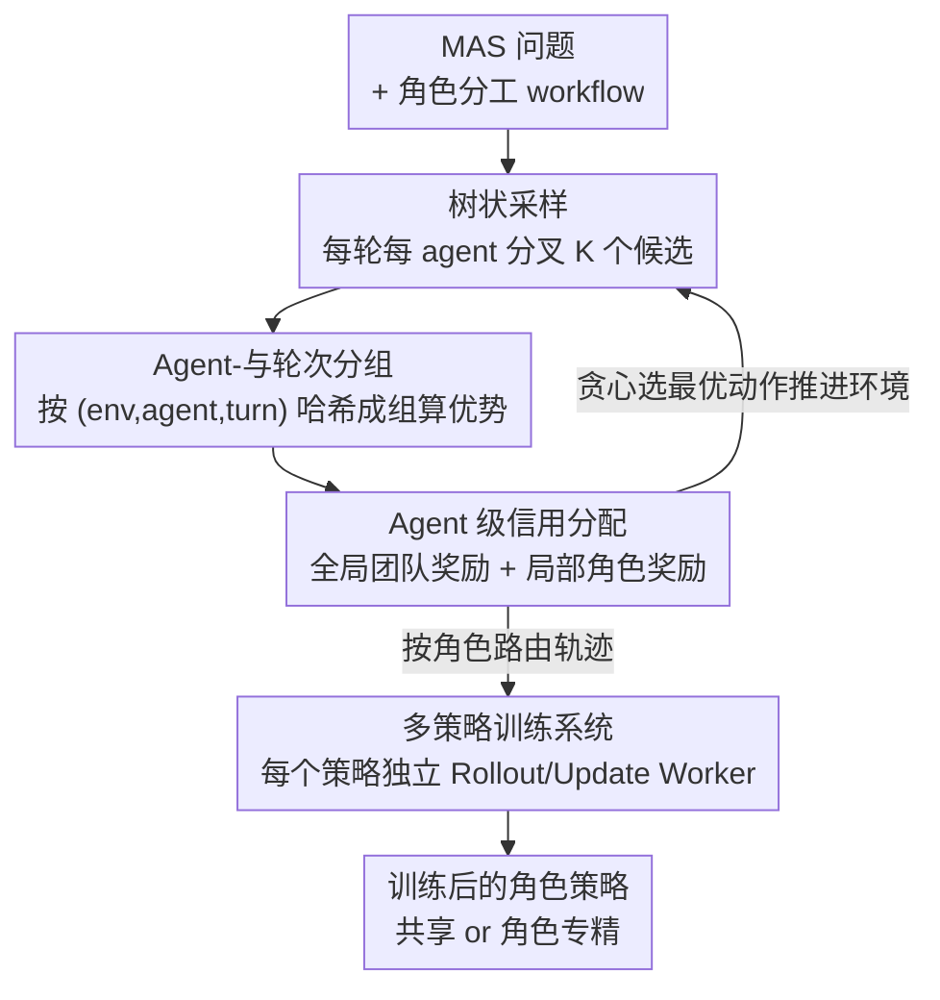

# Stronger-MAS: Multi-Agent Reinforcement Learning for Collaborative LLMs

**会议**: ICLR 2026  
**OpenReview**: [https://openreview.net/forum?id=IdF6JqXWzx](https://openreview.net/forum?id=IdF6JqXWzx)  
**代码**: https://github.com/pettingllms-ai/PettingLLMs  
**领域**: 多智能体 / Agent / 强化学习  
**关键词**: 多智能体系统, on-policy RL, GRPO, 角色专精, LLM 协作

## 一句话总结
针对"把 on-policy RL 训到多智能体系统（MAS）上"这一空白，本文提出 AT-GRPO——一套按"智能体 + 轮次"分组的 group-relative RL 算法（配树状采样与全局/局部混合奖励）加上一套支持多策略并发 on-policy 训练的系统，在游戏、规划、代码、数学四类任务上一致提升，长程规划任务的成功率从单智能体 RL 的 14–47% 直接拉到 96.0–99.5%。

## 研究背景与动机
**领域现状**：提升 LLM agent 能力如今有两条互补主线。一条是多智能体系统（MAS）：用 AutoGen、MetaGPT 这类框架，在一个共享 LLM 上靠角色提示词（coder/tester、reasoner/tool-user）做分工编排，推理阶段就能拿到收益；近期还出现"角色专精"——给不同角色配不同模型。另一条是强化学习（RL）：把 LLM 当策略，靠环境的规则奖励（典型如 GRPO/GiGPO 这类 group-relative 优化）迭代更新权重。

**现有痛点**：这两条线几乎是各走各的。MAS 大多停留在推理期的提示词设计，没真正训练；而成熟的 on-policy RL 框架（VERL、AReaL、OpenRLHF）几乎都只支持单智能体——单一交互模式、单一策略、单一资源池，没法同时拉起多个模型做独立的 on-policy 更新。于是"用 RL 去训 MAS"基本无人问津。

**核心矛盾**：把 RL 搬进 MAS 会撞上一个算法层的根本冲突。GRPO 算优势时要求"组内候选共享同一个 prompt"才能公平比较（reward mask 只给 response token 记分）。但在 MAS 里，"prompt"不只是题目，还嵌入了角色专属上下文和跨智能体的交互历史——第 2 轮 coder 的 prompt 里已经塞进了第 1 轮的代码和单测，所以**prompt 随角色和轮次而变**。直接套单智能体的并行采样（从初始状态各跑 K 条完整轨迹），当 $t>1$ 时每条轨迹的 prompt 都不同，组大小退化为 1，GRPO 的方差缩减彻底失效，更新极不稳定。

**本文目标**：(1) 设计一个对多轮、多智能体环境都成立的 group-relative 算法，保证组内 prompt 同一性；(2) 造一套能同时跑多策略 on-policy 训练、又能承载多样 MAS workflow 的系统。

**核心 idea**：把分组的粒度从"同一题目"细化到"同一智能体 + 同一轮次 + 同一环境实例"，并在每一步现场做树状分叉来构造合法比较组——用"agent-wise + turn-wise grouping"替代"trajectory-wise grouping"，让 GRPO 在 MAS 里重新成立。

## 方法详解

### 整体框架
AT-GRPO 把一个 N 智能体的 MAS 建模成 Markov game：每一**轮（turn）**里所有智能体依次发出一个"宏动作"（一次完整的 LLM rollout，即一段 token 序列），轮内还有逐智能体的微转移 $s_{t,i}=\mathcal{T}(s_{t,i-1},a_{t,i},i)$。训练分两个阶段循环：**Phase 1（on-policy rollout）**在每轮、每个智能体处做树状采样，就地构造分组、算优势、做信用分配，再贪心选最优动作推进环境；**Phase 2（per-model update）**把采到的数据按角色路由到对应策略，各模型并行做一次 PPO 风格的裁剪更新。整套流程的关键是让"分组—优势—更新"三件事都对齐到"agent×turn×env"这个细粒度，从而既保住 GRPO 的公平比较前提，又支持角色共享（M=1）与角色专精（M=N）两种策略形态。

### 关键设计

**1. 树状采样：在每一步现场造出合法比较组**

直接套单智能体的"并行采样"（从初始问题各跑 K 条完整轨迹）在 MAS 里会崩——一旦 $t>1$，每条轨迹携带的交互历史都不同，没有第二条样本和它共享同一 prompt，于是组大小变成 1，GRPO 退化成无方差缩减的不稳定更新。树状采样换了个做法：**不在轨迹层面分叉，而在每一轮 $t$、每个智能体 $i$ 的当前状态处分叉出 $K$ 个候选动作** $a^{(c)}_{t,i}$（Alg.1 line 7），这 $K$ 个候选天然共享同一观测/prompt，构成一个合法的比较组。组内算完优势后，**贪心选奖励最高的那个候选** $c^\star=\arg\max_c r^{(c)}_{t,i}$ 作为真正执行的动作去推进环境（line 10–11），其余分支只用于训练。这样既保证了组内 prompt 同一性，又把探索集中在"协作关键决策点"上，还顺带维持了正负样本的平衡，稳住优化。

**2. Agent-与轮次分组：把分组粒度对齐到角色和轮次**

这是算法的命门，直接回应"MAS 里 prompt 随角色和轮次而变"的核心矛盾。本文不再按"同一题目"分组，而是把 GiGPO 的 tabular-wise 分组思想推广到多智能体：**用一个轻量哈希 $g=\text{hash}(e,i,t)$ 给"环境实例 $e$ × 智能体 $i$ × 轮次 $t$"打唯一组键**（Alg.1 line 8），同组内的候选必然共享相同的角色和轮次位置，也就保证了 prompt 同一性。组内优势仍按标准 group-relative 公式做均值中心化与归一化：

$$A_g\!\left(a^{(c)}_t\right)=\frac{R(a^{(c)}_t)-\mathrm{mean}\big(\{R(a^{(c)}_t)\}_{c=1}^{K}\big)}{F_{norm}\big(\{R(a^{(c)}_t)\}_{c=1}^{K}\big)}$$

采到的整条数据元组（组键、观测、$K$ 个动作、$K$ 个优势）被存进"执行该动作的智能体 $i$ 所属策略"的数据集 $D_i$。更新时再按 $\mathcal{B}_m=\bigcup_{i:\sigma(i)=m}D_i$ 把数据汇到对应模型——角色共享就是把所有智能体数据并到一个策略，角色专精就是各角色各更各的。正因为分组保证了同质比较，才避免了"把异质状态平均成一个错误 baseline"导致的优势估计偏差。

**3. Agent 级信用分配：全局团队奖励 + 局部角色奖励混合**

光有分组还不够公平：协作任务里既要奖励团队整体成功，又要给每个角色它自己那份功劳。本文借鉴合作式 MARL 的混合奖励，把每个智能体每轮的奖励拆成全局团队奖励 $r^{team}_t$ 与角色专属的局部奖励 $r^{loc}_{t,i}$，用系数 $\alpha$ 调配：

$$r_{t,i}=\alpha\, r^{team}_t + r^{loc}_{t,i}$$

以 coder–tester 为例：团队奖励是生成程序在黄金单测上的通过率；局部奖励则按角色定制——coder 看自己代码的通过率，tester 看"黄金参考实现跑它生成的单测"的通过率。这样团队目标和角色激励被同时压进同一个标量奖励里，既鼓励协作收敛，又防止某个角色搭便车。实验里 $\alpha=1$ 未经调参就用了。

**4. 多策略 MAS 训练系统：让多个策略真正并发 on-policy 训练**

算法成立了，但主流 RL 框架只支持单模型、单资源池，没法同时拉起多个策略做干净的 on-policy 更新。本文造了一套系统来兜底（Fig.4）：**每个策略 $m$ 独占一个 GPU 资源池**，池内仿 HybridFlow 拆成 RolloutWorker（推理采样）与 UpdateWorker（优化更新）两个角色；环境步则跑在一批 CPU EnvWorker 上，每个 EnvWorker 管一个沙箱实例（带 seeding、墙钟超时、IO 配额、确定性工具），一实例一 actor 地支撑上千并发 rollout。中间用一个 Router 按角色分发：智能体 $i$ 产生的经验被送到它指定策略 $\sigma(i)$ 的 UpdateWorker，从而为每个策略都维持严格的 on-policy 训练流。正是这套"资源池 + 路由"的解耦，才让角色共享与角色专精两种形态都能跑起来、也能扩展到 Reasoner/Tool-User/Judge 这类更大的智能体集成。

### 损失函数 / 训练策略
每个模型 $m$ 在自己的 minibatch $\mathcal{B}_m$ 上用 PPO 风格的裁剪目标更新：

$$\mathcal{L}(\theta^{(m)})=-\mathbb{E}_{g\in\mathcal{B}_m}\Big[\tfrac{1}{K}\textstyle\sum_{c=1}^{K}\min\big(r^{(c,m)}_g\,A^{(c)}_g,\ \mathrm{clip}(r^{(c,m)}_g,1-\varepsilon,1+\varepsilon)\,A^{(c)}_g\big)\Big]$$

其中 $r(\theta)=\pi_\theta(o_i|q)/\pi_{\theta_{old}}(o_i|q)$。角色共享（$M=1$）把全体智能体数据并成 $\mathcal{B}_1=\bigcup_i D_i$ 做一次联合更新；角色专精（$M=N$）每个角色在 $\mathcal{B}_i=D_i$ 上独立更新。实验用 Qwen3-1.7B/8B 的 no-thinking 模式，单节点 8× H100，采样 $K=4$、轮次 $T=4$、$\alpha=1$。

## 实验关键数据

### 主实验
在 Qwen3-1.7B / 8B 上跨游戏、规划、代码、数学四域评测五个变体（均从同一基座初始化）。下表摘取 Qwen3-8B 的代表结果（括号为相对单智能体基线的增益）：

| 任务 | 指标 | 单智能体 | 单智能体+GRPO | MAS(提示) | MAS+GRPO | MAS+AT-GRPO(专精) |
|--------|------|------|------|------|------|------|
| Sokoban | 成功率 | 9.00 | 14.00 | 16.00 | 30.00 | **98.00** (+89.00) |
| Plan-Path | 成功率 | 12.00 | 47.00 | 71.00 | 96.00 | 96.00 (+84.00) |
| Sudoku | 成功率 | 48.00 | 54.00 | 72.00 | 99.00 | 99.00 (+51.00) |
| AIME24 | Acc | 18.30 | 18.30 | 36.60 | 33.30 | **57.00** (+38.70) |
| LiveCodeBench | Acc | 22.80 | 25.70 | 28.00 | 24.20 | **33.10** (+10.30) |

长程规划提升最猛：MAS+AT-GRPO 把成功率从单智能体的 14–47% 拉到 96.0–99.5%；代码、数学的平均绝对增益分别约 +3.87~7.62 和 +9.0~17.93。值得注意的是**直接把 GRPO 套到 MAS 上反而会掉点**（Qwen3-8B 在 CodeContests 17.60→10.30、OlympiadBench 56.50→53.20），印证了"异质状态被错误平均"的危害。

### 与其他 MARL 框架对比 / 消融

| 对比项 | 配置 | 关键指标 | 说明 |
|------|------|---------|------|
| vs MAPORL (gsm8k) | 本文未训 MAS | 84.4% vs 81.0% | 角色异质（推理+工具）胜过同质辩论，即便对方已训练 |
| vs MARFT (数学) | 本文未训 MAS | 84.4% vs 78.7% | 多轮迭代纠错胜过单轮偏好对齐 |
| vs CURE (CodeContests) | 本文未训→训练 | 30.3%→34.2% vs 25.9% | 自精化循环胜过单轮生成代码+单测 |
| Plan-Path 消融 | 仅 SA 训练再放进 MAS | 16.00 | 单独训智能体只到 16，远不及联合训的 96 |
| Plan-Path 消融 | 角色专精策略互换 | 96.0%→6.0% | 互换后崩溃，证明角色已学到不可替换的分工 |

### 关键发现
- **联合训练是关键**：在单智能体设定下分别训 tool/code agent（11.00、14.50），再拼进 MAS 也只有 16.00；而在 MAS 里联合训练直接到 96.00。可见收益主要来自"训出来的智能体间协调"，而非单个角色变强。
- **共享 vs 专精要看任务**：代码域 coder/tester 功能高度分离，专精策略更好（1.7B 上平均 +3.05）；数学域 reasoner/tool-user 功能重叠，共享策略有时反超（1.7B OlympiadBench 共享 39.60 > 专精 35.20）；游戏/规划已饱和，两者都接近 99，选择无所谓。
- **可扩展性**：把 Reasoner/Tool-User/Judge 的集成从小扩到 7 智能体，MAS+GRPO 饱和在 34.1%，而 MAS+AT-GRPO 从 18.2% 持续涨到 47.7%，说明它能扩规模而不撞协调瓶颈。
- **协作可观测**：训练中两角色奖励同步上升（协同 co-evolution），且"达成一致所需平均轮数"随训练下降，是协作变高效的直接证据。

## 亮点与洞察
- **把"分组粒度"当成 RL-on-MAS 的钥匙**：作者敏锐地指出 GRPO 在 MAS 失效的本质是 prompt 随角色/轮次漂移，于是把分组从"同题目"细化到"同 env×agent×turn"。这是一个干净、可迁移的诊断——任何想把 group-relative RL 搬到带历史的多轮 agent 场景的人都该先问"我的组内 prompt 真的同一吗"。
- **树状采样一举两得**：既解决了组大小退化为 1 的死结，又用"贪心选最优推进 + 其余分支训练"把探索集中到协作关键点，还顺手平衡正负样本。一个采样结构同时管住了"可比性"和"稳定性"。
- **"未训练 MAS 就已超过别人训练后的结果"**：本文反复展示 inference-only MAS（84.4%）就压过已训练的 MAPORL/MARFT，说明角色异质 + 多轮自纠的结构性收益常被低估——这个 message 对"先把 workflow 设计对再谈训练"很有启发。
- **互换策略崩盘实验**：96%→6% 这个对照极有说服力地证明了"角色专精确实学到了不可互换的分工"，是验证 specialization 的一个漂亮探针。

## 局限与展望
- **算法在饱和域收益有限**：代码、数学这类基座已被大量预训练的域，RL 提升空间被压缩（作者自己归因于性能饱和 + 问题多样性），亮点几乎都集中在长程规划/游戏这类协作瓶颈明显的任务。
- **共享 vs 专精无自动决策**：该选哪种策略形态需要凭任务特性人工判断，缺一个可学习/可预测的选择机制，落地时仍需试。
- **系统/计算开销未在正文充分展开**：树状采样每步多采 $K$ 倍、多策略各占资源池，训练成本和复杂度分析被放到附录，正文较难评估其性价比。
- **规模与基座有限**：仅在 Qwen3-1.7B/8B、单节点 8×H100、no-thinking 模式下验证，更大模型、thinking 模式、更多角色拓扑下的结论仍待补。

## 相关工作与启发
- **vs 单智能体 GRPO/GiGPO**：单智能体方法靠"同题目多采样"构组，把它直接搬到 MAS 会因 prompt 漂移退化（甚至掉点）；本文把分组推广到 agent×turn，并补上树状采样与混合奖励，是对 group-relative RL 在多智能体上的系统性修补。
- **vs CURE**：CURE 单轮生成 coder+tester 且不拿单测做自纠；本文建立多轮自精化循环，靠迭代调试把 CodeContests 从 22.8% 提到 34.2%，强调"多轮交互"本身的价值。
- **vs MAPORL / CoRY**：它们在固定、同质角色的辩论 workflow 里训练；本文做异质角色（推理+工具验证）的协作，结构性专精带来更高上限。
- **vs MARFT / MARTI**：MARFT 限于单轮顺序交互、MARTI 只是把单智能体 GRPO 套进 MAS 且集中在数学单一域；本文给出多轮、多智能体、跨四域、共享/专精双制度的更完整方案。

## 评分
- 新颖性: ⭐⭐⭐⭐⭐ 精准点出 GRPO 在 MAS 失效的根因并给出"agent×turn 分组 + 树状采样"的干净解法，填补 RL-on-MAS 空白。
- 实验充分度: ⭐⭐⭐⭐⭐ 四域两尺度五变体 + 三个 MARL 框架对比 + 互换/扩展性消融，证据链完整。
- 写作质量: ⭐⭐⭐⭐ 算法与系统分述清晰、图示到位；部分系统/成本细节挤进附录略影响正文自洽。
- 价值: ⭐⭐⭐⭐⭐ 配套开源系统 PettingLLMs，长程规划 14–47%→96–99.5% 的跃升对 agent 训练社区有直接价值。

<!-- RELATED:START -->

## 相关论文

- [\[ICLR 2026\] AgentPO: Enhancing Multi-Agent Collaboration via Reinforcement Learning](agentpo_enhancing_multi-agent_collaboration_via_reinforcement_learning.md)
- [\[ICLR 2026\] Adaptive Collaboration with Humans: Metacognitive Policy Optimization for Multi-Agent LLMs with Continual Learning](adaptive_collaboration_with_humans_metacognitive_policy_optimization_for_multi-a.md)
- [\[ICLR 2026\] BRIDGE: Bi-level Reinforcement Learning for Dynamic Group Structure in Coalition Formation Games](bridge_bi-level_reinforcement_learning_for_dynamic_group_structure_in_coalition_.md)
- [\[ICLR 2026\] MARSHAL: Incentivizing Multi-Agent Reasoning via Self-Play with Strategic LLMs](marshal_incentivizing_multi-agent_reasoning_via_self-play_with_strategic_llms.md)
- [\[ICLR 2026\] MAS²: Self-Generative, Self-Configuring, Self-Rectifying Multi-Agent Systems](mas2_self-generative_self-configuring_self-rectifying_multi-agent_systems.md)

<!-- RELATED:END -->
