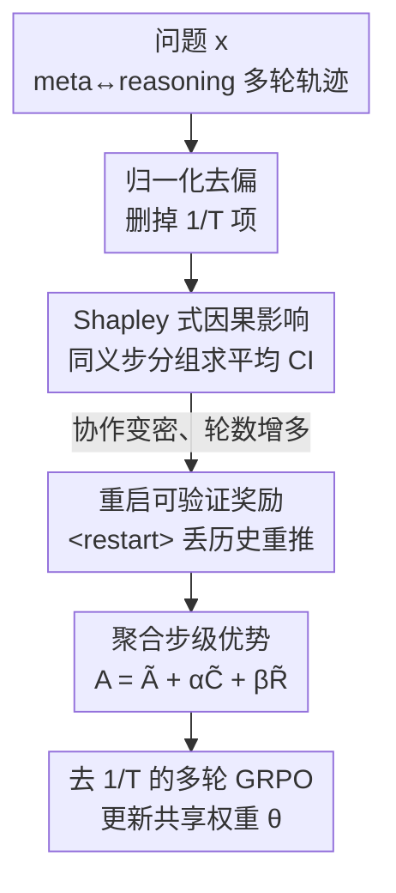

# Unlocking the Power of Multi-Agent LLM for Reasoning: From Lazy Agents to Deliberation

**会议**: ICLR 2026  
**OpenReview**: [https://openreview.net/forum?id=5J6u03ObRZ](https://openreview.net/forum?id=5J6u03ObRZ)  
**代码**: 无  
**领域**: LLM推理 / 多智能体  
**关键词**: 多智能体推理, 懒惰智能体, 多轮GRPO, 因果影响, 可验证奖励

## 一句话总结
本文发现多智能体 LLM 推理框架（ReMA）中存在"懒惰智能体"现象——一个 agent 几乎包揽全部推理、另一个只会复述，从理论上揪出根因是多轮 GRPO 损失里的 $1/T$ 归一化项偏向更少的轮数，并提出 Dr. MAMR：去掉该归一化 + Shapley 式因果影响度量 + 针对 `<restart>` 的可验证奖励，把原本不如单智能体 GRPO 的多智能体系统拉到全面反超（7B 平均 51.97→58.43）。

## 研究背景与动机
**领域现状**：用可验证奖励做强化学习的大模型在数学、代码、规划等复杂推理上已经很强。近期工作把这套范式扩展到多智能体设置，典型如 ReMA：一个 **meta-thinking agent（高层策略 $\pi_h$）** 负责拆解任务、设定中间目标、根据反馈调整，一个 **reasoning agent（低层策略 $\pi_l$）** 负责逐步演算并返回中间结果，两者轮流交替对话。为提升训练效率，两个 agent 共享同一套权重 $\theta$，只靠不同的系统提示 $S_h$、$S_l$ 区分角色，用多轮 GRPO（turn-level importance ratio）端到端训练。

**现有痛点**：作者用因果影响实验发现，ReMA 训练出来的 reasoning agent 经常在中间步骤"摆烂"——直接输出空白，或者只是总结、抄一遍 meta-thinking agent 的话，没有任何真正的质疑或反思，整条推理几乎全压在 meta-thinking agent 一个人身上。这种 **懒惰智能体（lazy agent）** 把多智能体系统坍缩回一个无效的单智能体，协作的好处荡然无存。最直接的证据是：ReMA 在 MATH500 上训练后反而从 75.0 掉到 74.4，多智能体框架训练完还不如单智能体 GRPO。

**核心矛盾**：传统 MARL 里的懒惰问题大多发生在 agent **同时**行动的稀疏奖励场景；而这里 agent 是**顺序**行动的——前一个 agent 的动作会塑造后续 agent 看到的状态，按直觉这种跨轮依赖应该惩罚偷懒才对，但实验偏偏相反。作者从理论上指出真正的祸根藏在多轮 GRPO 的损失结构里：那个本意是"防止偏向更长轨迹"的 $1/T$ 归一化，反而暗暗鼓励模型用更少的轮数完成推理，从而绕开协作式反思。

**本文目标**：分解为三个子问题——(1) 从理论上解释懒惰智能体为何在训练中自然涌现；(2) 在线训练里如何稳定、廉价地度量每一步的真实贡献以纠偏；(3) 当协作变密、对话轮数变多后，如何防止 reasoning agent 被自己早期的噪声输出带偏、"迷失在多轮交互里"。

**核心 idea**：先修损失（去掉 $1/T$ 归一化）治标，再用 **Shapley 式因果影响** 度量每步贡献做细粒度信用分配治本，最后给 reasoning agent 一个 `<restart>` 控制 token 让它能丢弃噪声历史、重新归纳指令再推一遍，并为这个重启行为设计可验证奖励。

## 方法详解

### 整体框架
Dr. MAMR（Multi-Agent Meta-Reasoning Done Right）建立在 ReMA 的"meta-thinking ↔ reasoning"交替轮转之上，但把训练目标从原始多轮 GRPO 改成三件事的叠加：**修归一化偏置 → 度量每步因果影响 → 奖励有益的重启**。最终它把一条轨迹拍平成步序列 $s_{i,1},\dots,s_{i,2T}$（奇数位是 meta-thinking 的 $m_{i,t}$，偶数位是 reasoning 的 $y_{i,t}$），对每一步 $t$ 计算一个聚合后的步级优势 $A^{step}_{i,t}=\tilde{A}_{i,t}+\alpha\tilde{C}_{i,t}+\beta\tilde{R}_{i,t}$，分别融合"结果奖励 / 因果影响 / 重启奖励"三路信号，再代回去掉 $1/T$ 的 GRPO 目标做优化。

### 关键设计

**1. 归一化去偏：揪出 $1/T$ 项是懒惰的祸根并直接删掉**

多轮 GRPO 目标里有一个 $\frac{1}{T_i}$ 因子，对每条轨迹的 turn-level 优势做平均，本意是抑制"偏向更多轮数的长轨迹"。但作者证明它带来了一个结构性偏置（Theorem 1）：考虑同一前缀引出的两条延续——短轨迹 $\tau^S$（horizon $T_S$）和长轨迹 $\tau^L$（horizon $T_L>T_S$），二者最终奖励相同。记 $\kappa\triangleq\frac{\lVert Z_t(\tau^L)\rVert}{\lVert Z_t(\tau^S)\rVert}$，则只要 $\kappa<\frac{T_L}{T_S}$，就有 $\frac{\lVert g_t(\tau^S)\rVert}{\lVert g_t(\tau^L)\rVert}>1$，即梯度更新偏向轮数更少的那条。也就是说，除非长轨迹每步的聚合贡献 $Z_t(\tau^L)$ 至少是短轨迹的 $\frac{T_L}{T_S}$ 倍，否则优化器一律奖励"少交互"。无论优势正负这个结论都成立（优势都为负时，短轨迹被罚得更轻）。而懒惰行为（输出空白、简单总结）恰恰天然轮数更短，于是在塑造策略最关键的训练早期被优先强化——这就解释了"性能在涨但 agent 在偷懒"的悖论。作者特别区分了自己和 Dr.GRPO：后者讨论的是 token 级归一化，而这里因为轮数 $T$ 远小于 token 数，归一化偏置反而被放得更大。对策很直接：把 $\frac{1}{T_i}$ 从目标里去掉。但消融显示这只能缓解、不能根治，所以还需要下面的因果度量。

**2. Shapley 式因果影响：用同义步分组求平均，廉价又稳定地度量每步真实贡献**

要从根本上压住懒惰，得知道每一步对后续推理到底有没有用。一个自然想法是度量"遮住这一步后，下一步输出的概率变化"，但在线训练里策略每步只采一条延续，单条轨迹的估计既片面、又会偏向"具体措辞"而非"底层想法"。理想情况应像 Shapley 值那样在所有可能的延续上平均边际贡献，可在线 RL 重采样代价太高。作者的做法是把每个锚步 $s_{i,t}$ 和跨 rollout 里**语义相似**的步聚成一组 $G_S(s_{i,t})=\{s_{j,t'}\mid s_{j,t'}\approx s_{i,t}\}$，组内每步算一次"遮掉它后下一步对数概率的变化"$\Delta\ell_{j,t'}\triangleq\log p^{(j,t')}_{mask}-\log p^{(j,t')}_{full}$，再取组内平均

$$\mathrm{CI}(s_{i,t})=\frac{1}{|G_S(s_{i,t})|}\sum_{(j,t'):\,s_{j,t'}\in G_S(s_{i,t})}\Delta\ell_{j,t'}.$$

这样既不用额外采样，又通过"跨 rollout 平均同义步"得到对某个想法整体贡献的稳定估计，并把同一想法的不同措辞聚合起来，抹掉了表述带来的偏差。CI 越小说明这一步对后续几乎没影响（懒惰），越大说明它实质性塑造了推理走向。

**3. 重启可验证奖励：让 reasoning agent 能丢掉噪声历史重来，并为此行为给可验证信号**

当懒惰被压住、两个 agent 都更积极后，对话轮数随之增多，新风险又冒出来：已有研究（Laban et al.）表明 LLM 在多轮设置下容易过早锁死在不完整的早期上下文里，从初始错误中难以恢复。把 meta-thinking agent 看成一个不断追加指令的"用户"，reasoning agent 就可能被自己早先的输出带偏、"迷失在对话中"。作者先用一个推理时改系统提示的变体 ReMA+ 验证假设——允许 reasoning agent 自适应丢弃旧输出，结果在 8 个 benchmark 上一致追平或超过 ReMA（AMC23/Olympiad 的 Pass@1 涨约 8%，AIME24/25 的 Pass@16 涨约 7%），且 benchmark 越难、轮数越多增益越大。于是正式做法是引入控制 token `<restart>`：触发后丢弃此前所有 reasoning 输出、重新归纳指令、从头再推一遍。

关键在于怎么给这个动作可验证的信用。设第 $i$ 条 rollout 在第 $t$ 轮发出 `<restart>`，遮住该轮之前所有 reasoning 输出 $Y^{(i)}_{<2t}$，度量重启对最终步 $y^{(i)}_T$ 的因果影响 $\Delta\ell_{i,t}\triangleq\log\pi_\theta(s_{i,2T}\mid h^{(i)\backslash Y^{(i)}_{<2t}}_{\le 2T})-\log\pi_\theta(s_{i,2T}\mid h^{(i)}_{\le 2T})$。再用二元结果奖励 $z_i$（最终答对为 $+1$、答错为 $-1$）配出重启奖励：当 $z_i=+1$ 且 $\Delta\ell_{i,t}>0$（丢掉历史后对正确答案更自信）或 $z_i=-1$ 且 $\Delta\ell_{i,t}<0$ 时奖励 $+1$，相反情形 $-1$，$\Delta\ell_{i,t}=0$ 时为 $0$。这就给"重启到底有没有让模型更相信正确输出"一个可验证判据。

最后把三路信号都先 min–max 缩放到 $[-1,1]$、再跨 rollout 标准化，得到归一化的因果信号 $\tilde{C}_{i,t}$ 与重启信号 $\tilde{R}_{i,t}$（未发 `<restart>` 时默认 0），与归一化结果优势 $\tilde{A}_{i,t}$ 加权合成步级优势 $A^{step}_{i,t}=\tilde{A}_{i,t}+\alpha\tilde{C}_{i,t}+\beta\tilde{R}_{i,t}$，代回去掉 $1/T$ 的多轮 GRPO 目标完成训练。

### 损失函数 / 训练策略
训练目标沿用式 (2) 的多轮 GRPO，但做两处改动：删掉 $\frac{1}{T_i}$ 归一化项；把 token 级优势替换成上面聚合得到的步级优势 $A^{step}_{i,t}$。实验中取 $\alpha=\beta=0.1$，每个 prompt 采 8 条 rollout，batch size 128，在 DeepScaleR 数据集上训练。

## 实验关键数据

### 主实验
在 Qwen2.5-7B/14B-Instruct 上训练，7 个数学 benchmark 上对比单智能体 GRPO、VRP(CoT)、ReMA：

| 模型 | 指标 | GRPO | ReMA | Dr. MAMR |
|------|------|------|------|----------|
| Qwen2.5-7B | MATH500 | 75.50 | 74.40 | **78.60** |
| Qwen2.5-7B | AIME24 | 16.67 | 13.33 | **20.00** |
| Qwen2.5-7B | AMC23 | 55.00 | 50.00 | **62.50** |
| Qwen2.5-7B | Olympiad | 48.60 | 42.58 | **52.34** |
| Qwen2.5-7B | **平均** | 55.08 | 51.97 | **58.43** |
| Qwen2.5-14B | AIME24 | 16.67 | 13.33 | **26.67** |
| Qwen2.5-14B | AMC23 | 60.00 | 60.00 | **67.50** |
| Qwen2.5-14B | **平均** | 58.05 | 57.24 | **62.49** |

ReMA 全面落后于单智能体 GRPO（印证懒惰问题之严重），而 Dr. MAMR 把多智能体系统从"不如单智能体"翻转到"全面反超"，且基座越大（指令跟随越强）增益越明显（14B 上 AIME24 飙到 26.67）。

### 消融实验
7B 模型上逐个去掉三个组件：

| 配置 | AIME24 | AMC23 | Gaokao2023en | Olympiad |
|------|--------|-------|--------------|----------|
| Dr. MAMR | 20.00 | 62.50 | 65.20 | 52.34 |
| w/o ND（保留 $1/T$ 归一化） | 13.33 | 55.00 | 63.64 | 47.85 |
| w/o CI（去因果影响） | 13.33 | 52.50 | 63.38 | 45.31 |
| w/o RB（去重启行为） | 16.67 | 57.50 | 63.90 | 50.58 |

### 关键发现
- 去归一化去偏（ND）和去因果影响（CI）掉点最猛——AIME24 都从 20.00 跌到 13.33，AMC23 在 w/o CI 下从 62.50 掉到 52.50，说明这两项是抑制懒惰、促成均衡贡献的主力，且互补。
- 去掉重启行为（RB）掉点相对温和（AIME24 仅降到 16.67），它的价值在于让 agent 从错误中途恢复、维持推理稳定，是锦上添花而非根治。
- 训练曲线显示：ReMA 下 reasoning agent 的因果影响先微升后一路逼近零、meta-thinking 独大；Dr. MAMR 下两者都稳步上升，真正实现均衡协作。且 ReMA 训到 150 步后奖励崩到 0，Dr. MAMR 全程稳定，说明治懒同时治住了多智能体 RL 的训练不稳定。
- Pass@K（AIME25）上 Dr. MAMR 与 ReMA 的差距随 K 增大而拉大，越难的任务优势越明显。
- 重启动态：重启奖励均值随训练稳步上升说明信号有信息量；重启次数在约 40 步后回落、100 步左右稳定，说明 agent 学会"只在真正有益时才重启"，没有被 reward hacking 成无脑刷 `<restart>`。

## 亮点与洞察
- 把一个工程上观察到的"懒惰"现象追到损失函数的归一化项上，并给出可证明的梯度比较（Theorem 1），从"现象→理论根因"闭环，比单纯加 prompt 或加正则有说服力得多；而且这个洞察对所有用多轮 GRPO 的工作都有警示意义。
- Shapley 式因果影响最巧妙的是"用语义相似分组替代重采样"——在线 RL 里没法对每步反复采样，作者借"同义步跨 rollout 平均"绕开了组合爆炸，同时顺手解决了"措辞偏差"，一举两得。
- 重启奖励把"丢掉历史后模型对正确答案是否更自信"做成二元可验证信号，而不是靠人工启发式判断重启好坏，这套"用最终答案正确性 × 概率变化方向"的判据可迁移到任何"要不要回退/重试"的多轮 agent 决策上。

## 局限与展望
- 实验全部在数学推理（DeepScaleR 训练、7 个数学 benchmark）上，是否能推广到代码、规划、开放域多智能体协作未验证。
- 因果影响里的"语义相似"分组依赖额外的语义距离度量（细节在附录 B），分组质量对 CI 估计的稳健性有多大影响、对阈值是否敏感，正文没充分讨论。
- 方法目前是两个 agent 共享权重、靠系统提示区分角色的特定设定；扩展到更多 agent、异构权重或真正独立模型时，懒惰理论与三路奖励是否仍成立有待检验。
- $\alpha,\beta$ 固定取 0.1，三路信号权重的敏感性分析不足；min–max + 标准化的归一化流程在不同 batch 分布下是否稳定也值得进一步考察。

## 相关工作与启发
- **vs ReMA**：本文直接建立在 ReMA 的双角色多轮框架上，但指出其多轮 GRPO 会训出懒惰智能体、性能反而不如单智能体；Dr. MAMR 通过去归一化 + 因果影响 + 重启奖励把它救回来并反超。
- **vs 单智能体 GRPO / Dr.GRPO**：GRPO 是单智能体 baseline，本文证明多智能体只要设计得当能超过它；与 Dr.GRPO 的区别在于后者改的是 token 级归一化、目的是别偏向短的正确答案，本文改的是轮级 $1/T$ 归一化，且因轮数远少于 token 数偏置更严重。
- **vs 传统 MARL 信用分配**（value decomposition / counterfactual baseline 等）：经典方法面向同时行动的 agent，而本文处理的是顺序行动、状态层层传递的 LLM 多轮设置，懒惰的成因与对策都不同。

## 评分
- 新颖性: ⭐⭐⭐⭐⭐ 从理论上定位懒惰根因 + Shapley 式在线因果度量 + 可验证重启奖励，三处都新。
- 实验充分度: ⭐⭐⭐⭐ 7 benchmark × 多基座 + 完整消融 + 训练动态分析扎实，但只覆盖数学推理。
- 写作质量: ⭐⭐⭐⭐ 现象→理论→方法→实验逻辑清晰，公式与图配合到位。
- 价值: ⭐⭐⭐⭐⭐ 给多智能体 LLM 推理指出一个被忽视的关键陷阱并给出可落地解法，对多轮 RL 设计有普遍启发。

<!-- RELATED:START -->

## 相关论文

- [\[AAAI 2026\] Scalable and Accurate Graph Reasoning with LLM-Based Multi-Agents](../../AAAI2026/multi_agent/scalable_and_accurate_graph_reasoning_with_llm-based_multi-agents.md)
- [\[ICLR 2026\] Graph-of-Agents: A Graph-based Framework for Multi-Agent LLM Collaboration](graph-of-agents_a_graph-based_framework_for_multi-agent_llm_collaboration.md)
- [\[ICLR 2026\] When Agents "Misremember" Collectively: Exploring the Mandela Effect in LLM-based Multi-Agent Systems](when_agents_misremember_collectively_exploring_the_mandela_effect_in_llm-based_m.md)
- [\[ICLR 2026\] MARSHAL: Incentivizing Multi-Agent Reasoning via Self-Play with Strategic LLMs](marshal_incentivizing_multi-agent_reasoning_via_self-play_with_strategic_llms.md)
- [\[ICLR 2026\] Multi-Agent Design: Optimizing Agents with Better Prompts and Topologies](multi-agent_design_optimizing_agents_with_better_prompts_and_topologies.md)

<!-- RELATED:END -->
