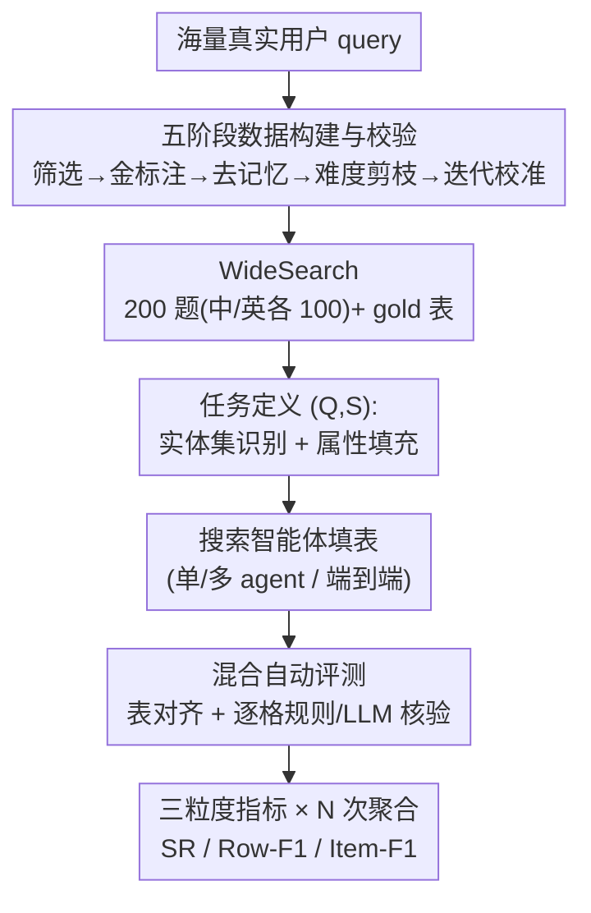

# WideSearch: Benchmarking Agentic Broad Info-Seeking

**会议**: ICLR 2026  
**论文**: [项目主页](https://widesearch-seed.github.io)（ByteDance Seed）  
**代码**: https://widesearch-seed.github.io （含数据集 + 评测框架，见补充材料）  
**领域**: Agent / 信息检索 Benchmark  
**关键词**: 搜索智能体, 宽度信息检索, 多智能体, 自动评测, 表格填充

## 一句话总结
WideSearch 提出首个专门评测"宽度信息检索"（wide-scale info-seeking）的 benchmark——给定一句查询和一个表格 schema，让 agent 把整张表填满，200 道中英人工题、五阶段质控；结果是 10+ 主流搜索智能体整体成功率几乎全部接近 0%，最好的也只有 7%，而人类多人交叉验证能逼近 100%，暴露出当前 agent 在"大规模、零容错"信息收集上的致命短板。

## 研究背景与动机
**领域现状**：随着 OpenAI DeepResearch、Manus 等 agentic 框架出现，搜索智能体的研究重心正从"能不能做新事"转向"能不能在真实场景里可靠地做事"。现有 benchmark 大体分两类：DeepSearch 类（如 BrowseComp）考"我找不到"——某个藏得很深的难找事实；DeepResearch 类（如 DeepResearch Bench）考"我写不好"——把复杂信息综合成长篇报告。

**现有痛点**：作者分析真实用户 query 后发现一类高频任务被现有评测完全漏掉了——它的难点既不是"找不到"也不是"写不好"，而是"我能做，但量大到压垮我"。比如金融分析师要找出某行业里所有满足营收和增速条件的公司，或求职者要列出所有符合岗位/地点/经验要求的职位空缺。每条信息都简单，但要**穷尽、零遗漏、零多余、零错误**地收集成百上千条，对人极其枯燥（往往要 1 小时手动操作且易出错）。

**核心矛盾**：这类任务的瓶颈不是"认知难度"而是"操作规模与保真度"。一旦交给 agent，会冒出过长上下文、事实错误、信息不完整等全新失败模式，而**没有合适的 benchmark 去量化这些失败**。更尖锐的是：单条信息 agent 其实能找到（item-level F1 充分重试可达 ~80%），但只要在数千条原子信息里多一条、少一条、错一条，整个任务就判全错——这是一种"零容错"的可靠性考验。

**本文目标**：① 把"宽度信息检索"这一被忽视的问题空间形式化；② 造一个难、真实、可客观验证、抗记忆的 benchmark；③ 系统评测主流单/多 agent 与商用系统，定位它们到底卡在哪。

**切入角度**：把任务设计成**填表**——查询 + 预定义 schema，agent 产出一张可逐格客观核对的结构化表。这样既贴近真实需求（结果可直接用），又让评测能像数据库 join 一样精确、可复现。

**核心 idea**：用"查询 + 表格 schema → 填满表格"这一可逐格验证的任务形式，专门度量 agent 在大规模信息收集上的**完整性与保真度**，而非单点检索能力。

## 方法详解

### 整体框架
WideSearch 不是一个新模型，而是一套"benchmark + 评测管线"。每道题被形式化为一个二元组 $(Q, S)$：$Q$ 是一句隐含目标实体集的自然语言查询，$S=\{C_1,\dots,C_m\}$ 是预定义的列 schema（即输出表的每一列属性）。agent 的任务拆成两步——**实体集识别**（找出满足 $Q$ 约束的完整实体集合 $E=\{e_1,\dots,e_n\}$）与**属性填充**（为每个实体 $e_i$ 填齐每一列 $C_j$ 的取值），最终产出 $n\times m$ 的表 $T_{agent}$，再和 gold 表逐格对齐打分。

整条系统由两个串行管线构成：**五阶段数据构建与校验管线**把海量真实用户 query 提炼成 200 道高质量题；**混合自动评测管线**把 agent 产出的表与 gold 表做表对齐 + 逐格核验，并用三粒度指标 × 多次聚合给出最终分。下图给出从 query 到分数的整体流向：

### 关键设计

**1. 填表式任务定义：把"宽度检索"变成可逐格客观核对的结构化目标**

宽度检索若以自由文本作答，根本无法客观判分——答案散落、措辞多变。WideSearch 把任务钉死为 $(Q,S)$ 填表：$Q$ 隐含一组目标实体，$S$ 显式给出输出表的列结构。例如"找出常春藤 + 澳洲八大土木硕士 2026 入学的最低 GPA 要求"，实体集就是 8 所藤校 + 8 所八大共 16 个实体，schema 为 {国家, 大学, 联盟, 最低 GPA}。这一设计把任务自然分解为**实体集识别**（考跨域穷尽搜索：美/澳两套高教体系都要覆盖全）和**属性填充**（考逐属性溯源到具体网页）。好处是输出有了刚性结构，评测可以像对两张表做 join 一样精确，且天然逼出"完整性"压力——少一所学校就是少一行。

**2. 五阶段数据构建与校验：保证每道题难、真实、抗记忆、且自动分能预测人评**

要让 benchmark 既难又可信，得层层把关。作者设计五阶段流水线：①**来源与精炼**——从海量真实 query 里由标注员筛出清晰无歧义的候选；②**金标注与指标采集**——标注员穷尽搜索造 gold 答案，同时记录完成耗时、搜索次数、查阅独立网页数；③**参数知识过滤**——拿强 LLM 不带工具直接答，凡能答对的题一律丢弃，确保题目必须靠真实搜索而非记忆；④**难度剪枝**——用人工指标卡阈值，标注员 <10 分钟或查 <10 个独立网页就能完成的题剔除；⑤**迭代精炼与校验**——用商用 agent 跑一遍，让自动评测和人类专家同时打分，若相似度 <95% 就回炉改题，直到自动分可靠预测人评。这套管线的关键不只是"造难题"，更是**把自动评测校准到能代理人类判断**，从而摆脱后续大规模评测对人工的依赖。

**3. 混合自动评测：规则 + LLM-judge 的逐格核验，避免"一刀切"误判**

表格里不同列的"对错"标准天差地别——人名要精确匹配、数字容许浮点误差、日期格式各异但语义相同、URL 要归一化、翻译名/描述类要语义判断。若统统用字符串严格匹配会误杀大量正确答案。WideSearch 的评测先做**语法校验与对齐**：不是可解析的 Markdown 表、或列头数量/名称与 gold 对不上，直接 0 分；通过后用 mapping prompt 归一化主键列、与 gold 表 join 出匹配行、假阳、假阴。再做**逐格混合打分**：每一格按其列预标注的类型选打分法——精确匹配 / 数值近似 / 日期语义比对 / URL 归一化 / LLM-as-a-judge（默认 GPT-4.1，仅用于高词汇变异的复杂格）。这样既保留规则法的确定性，又用 LLM 兜住语义等价的边界情况。实测该管线与人评一致性 >97.8%。

**4. 三粒度指标 × 多次聚合：从"全对"到"单格对"分层刻画，并量化测试时扩展**

只看二元成功率会掩盖 agent 到底差在哪一层。WideSearch 给三个递进粒度指标：**Success Rate (SR)** 最严苛，整张表内容与结构完美匹配才算成功；**Row-level F1** 把每行当作基本单位算精确/召回；**Item-level F1** 把每个单元格当作基本单位算精确/召回。每题独立跑 $N$ 次，配三种聚合：$\text{Avg@}N$（$N$ 次得分算术平均）、$\text{Pass@}N$（至少成功一次的题占比，专用于 SR）、$\text{Max@}N$（取 $N$ 次最高分再对全集平均，用于 F1）。这套设计让"找到单点能力（Item-F1）"与"零容错完整性（SR）"被分开度量——正是后面 test-time scaling 实验能揭示"瓶颈在完整性而非检索"的工具基础。

### 一个完整示例
以"申请土木工程硕士，找藤校 + 澳洲八大最低 GPA"这道题走一遍：agent 先做**实体集识别**——需穷举出 8 所常春藤 + 8 所 Group of Eight 共 16 所大学（漏一所即少一行，SR 直接判 0）；再做**属性填充**——为每所学校逐列填 {国家、大学、联盟、最低 GPA 要求}，GPA 这类数字要溯源到官网具体页面。产出 16×4 的表后进评测管线：先查是否合法 Markdown 表且列头对得上；归一化大学名做主键 join；逐格按类型打分（大学名精确匹配、GPA 数值近似、来源 URL 归一化）。只要某校 GPA 多填/少填/填错，整题 SR 就归零——这把"宽度检索"的零容错特性具象化了。

## 实验关键数据

### 主实验
评测覆盖三类系统：单 agent、多 agent 框架（主 agent 拆解 + 子 agent 并行执行 + 汇总）、端到端商用系统；所有 agent 都配搜索工具 + 网页阅读器，刻意用最朴素架构以考模型核心能力。下表节选 Avg@4 / Pass@4 主结果（%）：

| 模式 | 系统 | SR(Avg@4) | SR(Pass@4) | Row-F1(Max@4) | Item-F1(Max@4) |
|------|------|-----------|-----------|---------------|----------------|
| 单 agent | GPT-5 | 6.9 | 13.5 | 52.2 | 68.2 |
| 单 agent | OpenAI o3 | 4.5 | 9.0 | 44.1 | 62.3 |
| 单 agent | Claude Sonnet 4 (Thinking) | 2.3 | 5.0 | 41.9 | 66.7 |
| 单 agent | DeepSeek-R1 | 0.4 | 1.5 | 31.7 | 55.1 |
| 多 agent | GPT-5 | **7.3** | 12.0 | **54.2** | **74.5** |
| 多 agent | OpenAI o3 | 5.1 | 9.5 | 50.5 | 68.9 |
| 多 agent | Claude Sonnet 4 (Thinking) | 3.6 | 6.5 | 52.2 | 73.1 |
| 端到端 | Gemini 2.5 Pro | 4.3 | 8.0 | 45.4 | 67.2 |
| 人类(单人) | — | 20.0 | — | 69.2 | 82.4 |

关键观察：① 几乎所有系统 SR 接近 0%，最强的多 agent GPT-5 也仅 7.3%（Avg@4）；② **多 agent 一致优于单 agent**——"分而治之"让 planner 把宽查询拆成并行子任务，F1（部分正确度）明显更高；③ 商用端到端系统普遍徘徊在 ~5% SR，有些 DeepResearch 系统还倾向于生成长报告而非要求的单张表；④ **连单个人类也只有 20% SR**，说明任务本身极难（一张完整答案可能含数千条原子事实，差一条即全败）。

### 测试时扩展 + 评测一致性
以 Kimi K2 为底模、单 agent 模式把尝试次数 $N$ 从 1 扩到 128，观察上限；另用不同 judge 模型测评测管线与人评的一致性：

| 分析 | 配置 | 关键指标 | 结论 |
|------|------|---------|------|
| Test-time scaling | $N{=}128$, Item-F1(Max@N) | ≈80 | 单点信息其实不难找，给足重试就能逼近 80 |
| Test-time scaling | $N{=}128$, SR(Pass@N) | <20 | 但表级成功率始终 <20——瓶颈是零容错的完整性 |
| 评测一致性 | judge=OpenAI o4-mini | 98.3 | 自动评测与人评高度一致 |
| 评测一致性 | judge=GPT-4.1(默认) | 98.0 | 各 judge 模型一致性均 >97.8% |

### 关键发现
- **瓶颈不在"找"而在"齐"**：Item-F1 充分重试可达 ~80%，但 SR 即使 128 次也 <20%——失败根源是无法把所有原子信息穷尽且零错误地凑齐，而非找不到单条。
- **召回显著低于精确**：所有子集上 Recall 都明显低于 Precision，"召回不足"是首要瓶颈，对应到不完整的查询分解。
- **四类高级能力缺陷**：① 查询分解不完整（漏子查询→漏信息）；② 缺反思迭代（一次工具调用失败就放弃，不改写查询）；③ 证据利用失败（找到了却误读/误用来源）；④ 知识幻觉（搜不到就编内部知识）。几乎所有失败轨迹都同时踩中这四点。
- **基础失败模式**：工具调用格式错、输出格式不合规（不出 Markdown 表）、上下文超长（过度思考陷入无效循环）、拒答（嫌问题模糊或信息量太大直接拒绝）。

## 亮点与洞察
- **把"难评测的宽度任务"转成"可 join 的填表任务"**，是这篇最巧妙的一步：刚性 schema 既逼出完整性压力，又让客观自动评测成为可能，绕开了开放式生成难判分的老问题。
- **"零容错"视角很有冲击力**：5000 条信息找对 4999 条仍判全败，把 SR 与 Item-F1 的巨大落差量化出来，清晰指出未来该优化的是"可靠完整性"而非"单点检索"。
- **评测先校准到人评再放量**（阶段⑤的 95% 阈值回炉），这套"自动分必须能预测人评才收题"的纪律，可迁移到任何需要 LLM-judge 的 benchmark 构建。
- **test-time scaling 当诊断工具**：用 Pass@N vs Max@N 的分叉来定位瓶颈层级，而非单纯刷分，是很值得借鉴的分析范式。

## 局限与展望
- 任务要求**时间与语境不变**的静态事实，因此天然排除了时效性强、地域/文化相关的真实检索需求，覆盖面有所收窄。
- LLM-as-a-judge 仍有不可避免的误判（如把"carlosslimhelu family"判为缺词给 0 分，而人类认为等价），评测一致性虽 >97.8% 但非 100%。
- 200 题（中英各 100）规模相对有限，且 SR 普遍接近 0% 使得不同系统在最严指标上难以拉开区分度，更多要靠 F1 类部分正确度比较。⚠️ 摘要中"最佳 7%"与正文多处"5.1%"等数字因取的聚合口径（Avg@4 / Pass@4）不同而异，比较时需对齐口径，以原文为准。
- 作者指明的方向：**多 agent 架构**——多智能体并行搜索 + 相互交叉验证，高度契合人类标注 gold 表的协作流程，是攻克这类大规模任务的有希望路线。

## 相关工作与启发
- **vs BrowseComp（DeepSearch 类）**: 它考"找一个藏得很深的难点事实"（深度推理/深挖），WideSearch 考"跨多实体穷尽收集大量易找事实"（宽度/可靠性），问题空间正交。
- **vs DeepResearch Bench（DeepResearch 类）**: 它考把复杂信息综合成主观长报告（写得好不好），评测偏主观；WideSearch 输出是可逐格客观核验的结构化表，评测客观可复现。
- **vs 传统多跳 QA（HotpotQA 等）**: 多跳 QA 是少数几跳推理出单一答案，WideSearch 是大规模实体 × 属性的笛卡尔式收集，瓶颈从"推理链"变成"零容错完整性"。

## 评分
- 新颖性: ⭐⭐⭐⭐⭐ 首个专门评测"宽度信息检索"的 benchmark，问题空间定义清晰且被现有评测漏掉。
- 实验充分度: ⭐⭐⭐⭐⭐ 覆盖单/多 agent + 端到端 + 人类，含 test-time scaling 与评测一致性，结论扎实。
- 写作质量: ⭐⭐⭐⭐ 动机—设计—分析逻辑顺畅；部分聚合口径数字需读者自行对齐。
- 价值: ⭐⭐⭐⭐⭐ 明确指出"可靠完整性"是搜索智能体的真瓶颈，为后续多 agent 研究给出清晰路线图。

<!-- RELATED:START -->

## 相关论文

- [\[ICLR 2026\] UIS-Digger: Towards Comprehensive Research Agent Systems for Real-world Unindexed Information Seeking](uis-digger_towards_comprehensive_research_agent_systems_for_real-world_unindexed.md)
- [\[ICLR 2026\] GraphPlanner: Graph Memory-Augmented Agentic Routing for Multi-Agent LLMs](graphplanner_graph_memory-augmented_agentic_routing_for_multi-agent_llms.md)
- [\[ICLR 2026\] Learning to Summarize by Learning to Quiz: Adversarial Agentic Collaboration for Long Document Summarization](learning_to_summarize_by_learning_to_quiz_adversarial_agentic_collaboration_for_.md)
- [\[ACL 2026\] AgenticEval: Toward Agentic and Self-Evolving Safety Evaluation of Large Language Models](../../ACL2026/multi_agent/agenticeval_toward_agentic_and_self-evolving_safety_evaluation_of_large_language.md)
- [\[NeurIPS 2025\] Belief-Calibrated Multi-Agent Consensus Seeking for Complex NLP Tasks](../../NeurIPS2025/multi_agent/belief-calibrated_multi-agent_consensus_seeking_for_complex_nlp_tasks.md)

<!-- RELATED:END -->
