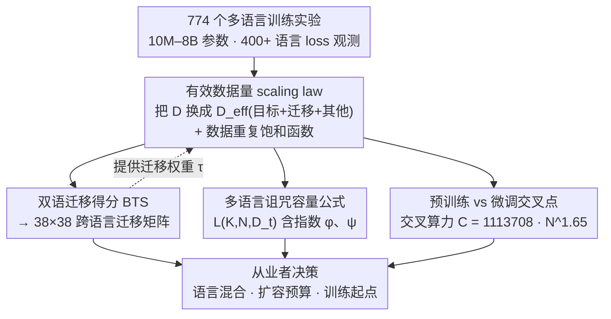

# ATLAS: Adaptive Transfer Scaling Laws for Multilingual Pretraining, Finetuning, and Decoding the Curse of Multilinguality

**会议**: ICLR 2026  
**arXiv**: [2510.22037](https://arxiv.org/abs/2510.22037)  
**代码**: 未开源  
**领域**: 多语言翻译  
**关键词**: scaling laws, multilingual, cross-lingual transfer, curse of multilinguality, pretraining vs finetuning

## 一句话总结
提出 Adaptive Transfer Scaling Law (ATLAS)，通过将有效数据量分解为目标语言、迁移语言和其他语言三项并引入数据重复饱和函数，在774个多语言训练实验（10M–8B参数、400+语言）上显著优于现有scaling law（多语言 $R^2$ 从0.67提升至0.98），并系统量化了跨语言迁移矩阵、多语言诅咒的容量约束以及预训练vs微调的计算交叉点。

## 研究背景与动机

### 现有Scaling Law的局限
Scaling laws研究几乎完全聚焦于英语。Chinchilla Scaling Law (CSL) 用两个幂律项分别建模模型大小 $N$ 和数据量 $D$ 对损失的影响，但存在多个缺陷：

**不支持数据重复**: 低资源语言（如Hindi、Swahili）的数据量极其有限，训练时需要多轮重复，CSL无法建模重复带来的收益递减

**忽略跨语言迁移**: 单语scaling law只能看到目标语言的token数，无法利用其他语言数据的正/负迁移效应

**Data-Constrained Scaling Law (DCSL)** 虽然考虑了数据重复，但需要大量"1个epoch前"和"1个epoch后"的观测点来完成两阶段拟合，对高资源语言（英语、法语）收集超过1个epoch的数据成本很高，对低资源语言则可能在1个epoch之前都没有足够的观测

### 实践需求
多语言模型的开发者面临三个核心问题，但缺乏系统性回答：
- 不同语言之间的迁移关系如何？哪些语言对训练互利，哪些会干扰？
- 增加模型服务的语言数量时，需要增加多少计算资源？（多语言诅咒的定量刻画）
- 给定计算预算，是从头预训练还是从多语言checkpoint微调更高效？

## 方法详解

### 整体框架
ATLAS 不是一个新的训练算法，而是一族可拟合的 scaling law。它沿用 Chinchilla 的损失形式，但把"数据量"这一项替换成能感知多语言结构的**有效数据量** $\mathcal{D}_{\text{eff}}$（内含一个刻画数据重复收益递减的饱和函数），再在同一套实验数据上派生出三个下游工具：双语迁移得分撑起的跨语言迁移矩阵、多语言诅咒的容量公式、以及预训练 vs 微调的交叉点公式。整套方法的输入是 774 个训练实验的 loss 观测点，输出是一组带物理含义的拟合参数，从业者用这些参数就能反推语言混合、扩容预算和训练起点该怎么选。其中迁移矩阵还反过来给有效数据量里的迁移权重 $\tau$ 提供经验取值，三个工具因此都挂在同一族 scaling law 之下。

### 关键设计

**1. 有效数据量分解与饱和函数：让 scaling law 同时看见跨语言迁移和数据重复**

Chinchilla 的核心公式 $\mathcal{L}(N, D) = E + A/N^\alpha + B/D^\beta$ 里，$D$ 只能是目标语言自己的 token 数，于是既无视其他语言带来的正负迁移，又默认每个 token 都是新鲜的、会高估低资源语言反复重复那点数据的价值。ATLAS 把 $D$ 整体替换为有效数据量 $\mathcal{D}_{\text{eff}}$，得到 $\mathcal{L}(N, \mathcal{D}_{\text{eff}}) = E + A/N^\alpha + B/\mathcal{D}_{\text{eff}}^\beta$，再把 $\mathcal{D}_{\text{eff}}$ 拆成三个语义清晰的来源——目标语言自己的数据、对它有迁移作用的若干语言、以及打包成一项的其他所有语言：

$$\mathcal{D}_{\text{eff}} = \underbrace{\mathcal{S}_{\lambda_t}(D_t; U_t)}_{\text{目标语言}} + \underbrace{\sum_{i \in \mathcal{K}} \tau_i \mathcal{S}_{\lambda_i}(D_i; U_i)}_{\text{迁移语言}} + \underbrace{\tau_{\text{other}} \mathcal{S}_{\lambda_{\text{other}}}(D_{\text{other}}; U_{\text{other}})}_{\text{其他语言}}。$$

每一项各自带一个迁移权重 $\tau$（迁移语言项的 $\tau_i$ 由后面的迁移矩阵提供）和饱和参数 $\lambda$，让模型能精确区分"哪些语言数据真正帮上忙、帮了多少"。三项里的 $\mathcal{S}_\lambda(D; U)$ 就是处理数据重复的饱和函数，把重复收益的衰减直接写进公式：

$$\mathcal{S}_\lambda(D; U) = \begin{cases} D, & D \leq U \ (\le 1\ \text{epoch}) \\ U\left[1 + \dfrac{1 - \exp(-\lambda(D/U - 1))}{\lambda}\right], & D > U \ (> 1\ \text{epoch}) \end{cases}$$

其中 $U$ 是该语言的唯一 token 数，$\lambda$ 是所有语言共享的重复衰减系数。第一个 epoch 之内有效数据随 $D$ 线性增长，一旦越过 $U$ 就转入指数饱和，重复越多边际增益越小。和需要凑齐"1 个 epoch 前后"两批观测才能做两阶段拟合的 DCSL 不同，这个函数本身连续、单阶段就能拟合，因此对那些根本攒不够一个 epoch 的低资源语言也照样适用。"分解 + 饱和"这套看似简单的替换是整篇的关键：多语言设置下的整体拟合 $R^2$ 因此从 0.67 跃升到 0.98。

**2. 双语迁移得分 BTS：把"A 帮不帮 B"量化成一个数**

要刻画语言间的迁移，先得有一把尺子。ATLAS 定义双语迁移得分（Bilingual Transfer Score, BTS）衡量源语言 $s$ 对目标语言 $t$ 的影响，

$$\text{BTS}_{s \to t} = -\frac{\sigma_{\text{bi}}(L_t(d_{\text{mono}})) - 2d_{\text{mono}}}{d_{\text{mono}}},$$

其中 $d_{\text{mono}}$ 是预设目标步数（42B tokens），$\sigma_{\text{bi}}$ 是双语模型要达到与单语相同的目标语言 loss 所需的 token 数。直觉上，如果加入源语言后双语模型用更少 token 就追平了单语水平，BTS 就为正；用得更多则为负。BTS=0 表示无迁移，正值是正迁移，负值是负干扰。作者实测了 80 个语言对的 BTS，再用其他训练信号外推估计剩余语言对（$R^2 = 0.85$），最终拼出一张完整的 $38 \times 38$ 跨语言迁移矩阵——这也成了 $\mathcal{D}_{\text{eff}}$ 里迁移权重 $\tau_i$ 的经验来源。

**3. 多语言诅咒的容量公式：扩容多少才能再喂一门语言**

"模型支持的语言越多、每门语言反而越差"的多语言诅咒，本质是有限容量被摊薄。ATLAS 把单个目标语言的 loss 显式写成语言数 $K$、模型大小 $N$ 和目标语言数据 $D_t$ 的函数：

$$L(K, N, D_t) = L_\infty + A \frac{K^\phi}{N^\alpha} + B \frac{K^\psi}{D_t^\beta}。$$

两个新指数各管一头：$\phi > 0$ 说明语言数上升会加重对模型容量项的压力（诅咒来源），$\psi < 0$ 说明语言间存在正迁移、每多一门语言所需数据是亚线性增长（诅咒的缓解）。当 $K=1$ 时两个 $K$ 因子都为 1，公式干净地退回 Chinchilla。这一形式的好处是可操作：拟合出 $\phi, \psi$ 后，就能直接算出"语言数翻几倍、预算该翻几倍"的等损失（iso-loss）规则。

**4. 预训练 vs 微调的交叉点：从哪个起点开始更省算力**

最后一个工具回答工程上最现实的问题：给定算力，是从头预训练还是从一个多语言 checkpoint 微调。作者把从头预训练和从 Unimax checkpoint 微调两条 loss 曲线画在同一坐标上，找它们相交的算力点。结论是微调在前期占优，但从头预训练会在大约 144B–283B tokens 之后反超；这个交叉算力 $C$ 与模型大小 $N$ 呈幂律关系 $C = 1113708 \times N^{1.65}$。模型越大，交叉点越靠后，意味着大模型从已有 checkpoint 起步的性价比窗口更长。

## 实验关键数据

### 实验规模
- **774个独立训练实验**，涵盖MADLAD-400数据集（400+语言）
- 模型规模: 10M–8B参数，20个尺度等级
- 280个单语模型 + 240个双语模型 + 120个多语言混合 + 134个微调模型
- 评估48个语言的vocabulary-insensitive loss

### Scaling Law拟合质量（Table 1）

| Scaling Law | $R^2$ (整体) | $R^2(N)$ | $R^2(D)$ | $R^2(C)$ | $R^2(M)$ |
|-------------|-------------|----------|----------|----------|----------|
| Chinchilla (多语言) | 0.64 | -0.99 | 0.72 | 0.66 | 0.61 |
| Multilingual SL (He et al.) | 0.67 | -0.65 | 0.73 | 0.67 | 0.70 |
| **ATLAS (完整)** | **0.98** | **0.89** | **0.96** | **0.98** | **0.82** |

ATLAS在多语言设置下所有维度的泛化 $R^2$ 均大幅超越先前方法，特别是对最大模型的外推 $R^2(N)$ 从 -0.99 提升至 0.89。

### 跨语言迁移关键发现
- **英语是最广泛的正迁移源语言**，在30种目标语言中有19种将其列为top-5最有帮助的源语言
- 法语（16/30）、西班牙语（13/30）、希伯来语（11/30）紧随其后
- **相同书写系统的语言对**迁移得分均值 -0.23 vs 不同系统的 -0.39（$p < .001$）
- 迁移关系**不对称**: 全局Pearson相关 $r = -0.11$，即"A帮助B"不能推断"B帮助A"
- 同族同脚本的语言对（如法-西、俄-乌）高度对称；跨族跨脚本的对（如中-波斯、俄-越）高度不对称

### 多语言诅咒的定量结果
- 拟合得 $\phi = 0.11$（温和的容量诅咒），$\psi = -0.04$（轻微的正迁移）
- **扩展语言覆盖的计算预算**: 将语言数从 $K$ 扩展到 $r \cdot K$，计算预算应扩展 $C \cdot r^{0.97}$
- 扩展到 $4K$ 语言需要总token数增加2.74倍、模型大小增加1.4倍
- 模型大小 $N$ 的增加比数据量 $D$ 更有效地缓解多语言诅咒（$|\partial S / \partial \log N| > |\partial S / \partial \log D|$）

### 预训练 vs 微调
- 对2B参数模型，微调Unimax checkpoint在144B–283B tokens以内更高效
- 超过此阈值后从头预训练更优
- 英语的交叉点最早（因为在Unimax中采样比例仅5%），其他语言约1.4%

## 亮点与洞察

1. **有效数据分解是关键创新**: 将多语言训练数据拆分为目标语言、迁移语言、其他语言三个独立项，各自学习权重和饱和参数，使模型能精确捕捉不同数据源的贡献。这个思路简洁但效果惊人（$R^2$ 从0.67到0.98）
2. **迁移矩阵的实用价值**: 1444个语言对的迁移得分是目前最大的经验资源，可直接指导多语言训练的语言混合策略
3. **多语言诅咒的可操作公式**: 从 $K$ 扩展到 $rK$ 语言的iso-loss公式为从业者提供了清晰的预算规划工具
4. **书写系统比语系更重要**: 共享脚本对迁移的影响大于共享语系，暗示subword词汇共享是正迁移的主要机制
5. **迁移不对称性**: 这一发现警示从业者不能凭直觉假设迁移的互惠性，必须实证测量

## 局限性

1. **评估仅用perplexity**: 所有实验仅衡量vocabulary-insensitive loss，未在下游任务（如翻译、问答、分类）上验证scaling law的预测能力
2. **数据来源单一**: 仅用MADLAD-400（CommonCrawl），不同领域、质量的数据可能改变迁移关系
3. **均匀采样假设**: 多语言诅咒的建模假设各语言均匀采样，实际部署中往往需要不均匀分配
4. **Unimax checkpoint特异性**: 预训练vs微调的交叉点取决于Unimax的训练混合和训练时长，不同base模型可能有不同的交叉点
5. **迁移矩阵的模型大小依赖**: BTS在2B模型上测量，不同规模下迁移关系可能不同（虽然文中有部分分析）
6. **低资源语言的代表不足**: 尽管数据覆盖400+语言，但深入分析仍集中在约50种语言

## 相关工作

| 方法 | 核心思路 | 与ATLAS的关键差异 |
|------|---------|-----------------|
| **Chinchilla** (Hoffmann 2022) | 英语单语 $L = E + A/N^\alpha + B/D^\beta$ | 不支持数据重复、不建模跨语言迁移 |
| **DCSL** (Muennighoff 2024) | 数据重复感知，两阶段拟合 | 需要充分的epoch前后观测，对多语言不友好 |
| **MSL** (He 2024) | 用语系采样比建模多语言 | 仅按语系分组，ATLAS学习逐语言迁移权重 |
| **BiMix** (Ge 2024) | 双变量数据混合scaling law | 聚焦英语领域，不涉及多语言 |
| **Llama-3** (Dubey 2024) | 简要提及多语言scaling law | 仅8%非英语token，规模和深度不及本文 |

ATLAS的核心优势在于：(1) 统一的单阶段拟合，(2) 细粒度的跨语言迁移建模，(3) 迄今最大规模的多语言scaling实验。

## 评分
- 新颖性: ⭐⭐⭐⭐ 有效数据分解+饱和函数的设计简洁优雅，迁移矩阵和诅咒建模均为重要贡献
- 实验充分度: ⭐⭐⭐⭐⭐ 774个实验、400+语言、10M–8B参数，规模史无前例，多维度泛化验证严谨
- 写作质量: ⭐⭐⭐⭐ 结构清晰，公式推导完整，图表信息量大
- 价值: ⭐⭐⭐⭐⭐ 对多语言模型的训练规划有直接的工程指导价值，迁移矩阵和iso-loss公式可直接使用

<!-- RELATED:START -->

## 相关论文

- [\[NeurIPS 2025\] Zero-Shot Performance Prediction for Probabilistic Scaling Laws](../../NeurIPS2025/multilingual_mt/zero-shot_performance_prediction_for_probabilistic_scaling_laws.md)
- [\[ICLR 2026\] Language Confusion Gate: Language-Aware Decoding Through Model Self-Distillation](language_confusion_gate_language-aware_decoding_through_model_self-distillation.md)
- [\[ICLR 2026\] From Utterance to Vividity: Training Expressive Subtitle Translation LLM via Adaptive Local Preference Optimization](from_utterance_to_vividity_training_expressive_subtitle_translation_llm_via_adap.md)
- [\[ICLR 2026\] SASFT: Sparse Autoencoder-guided Supervised Finetuning to Mitigate Unexpected Code-Switching in LLMs](sasft_sparse_autoencoder-guided_supervised_finetuning_to_mitigate_unexpected_cod.md)
- [\[ICLR 2026\] Multilingual Routing in Mixture-of-Experts](multilingual_routing_in_mixture-of-experts.md)

<!-- RELATED:END -->
