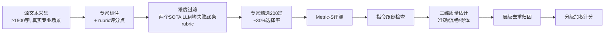

# DiscoX: Benchmarking Discourse-Level Translation in Expert Domains

**会议**: ICLR 2026  
**OpenReview**: [https://openreview.net/forum?id=OTCfZ6h8Pe](https://openreview.net/forum?id=OTCfZ6h8Pe)  
**代码**: [https://github.com/ByteDance-Seed/DiscoX](https://github.com/ByteDance-Seed/DiscoX)  
**领域**: 多语言机器翻译 / 评测基准  
**关键词**: 篇章级翻译, 专家领域翻译, 中英互译, LLM-as-a-judge, 无参考评测, Benchmark  

## 一句话总结
DiscoX 构建了首个面向**篇章级 + 专家级**中英互译的评测基准（200 篇、平均 1712 token、7 大领域、1330 人时人工打磨），并配套提出多智能体无参考评测系统 Metric-S，揭示出即便最强 LLM（GPT-5-high 76.66）仍落后人类专家（80.16）的真实差距。

## 研究背景与动机
- **领域现状**：随着 LLM 进步，句段级（segment-level）翻译已接近人类水平，WMT、FLORES、Redtrans Bench 等主流基准也都停留在「一次评一句或几句」的粒度，平均文本长度仅 45～60 token。
- **现有痛点**：专家领域（科研论文、法律合同、技术手册）的翻译要求**全篇连贯**与**严格术语精度**，但现有基准既无法考察模型能否维持篇章级一致性，也无法考察其处理密集专业术语、满足专家文体规范的能力；同时传统基于参考译文的指标（BLEU/COMET）对长文本失效，单一 LLM 评判又不可靠。
- **核心矛盾**：篇章级 + 专家级翻译的真实需求 ↔ 评测体系仍停留在句段级、依赖参考译文且不可解释。
- **本文目标**：提供一个能够严格评估「篇章连贯 + 术语精确 + 文体得体」的中英翻译基准，并配套一个与人类判断高度一致的自动化评测系统。
- **核心 idea**：**数据侧**——用 133 位专家、三阶段「标注→难度过滤→精选」流水线打磨 200 篇长文，并为每篇配 rubric（可验证评分点）；**评测侧**——把「LLM-as-a-judge」拆成多智能体工作流（指令检查→三维质量估计→错误去重归因→分级加权计分），实现无参考、可解释的细粒度评分。

## 方法详解

### 整体框架
DiscoX 由两部分构成：(1) 经三阶段专家流水线构建的 200 篇篇章级专家翻译测试集（含每篇 rubric）；(2) 配套无参考评测系统 Metric-S，按「指令跟随检查 → 准确性/流畅性/得体性三维质量估计 → 层级化错误去重归因 → 分级加权计分」的工作流给出最终分。

### 关键设计
**1. 三阶段专家构建流水线：用「难度过滤」保证基准真有挑战性。** DiscoX 的 200 篇并非随手采样，而是 133 位专家（115 位垂域专家 + 18 位语言专家）耗时 1330 人时打磨的产物。第一阶段由垂域专家采集满足「真实专业场景 / 中文≥1500 字或英文≥1500 词 / 自洽且可写出无歧义 rubric」三条件的文本，并为每篇配平均 9.38 条 rubric（涵盖语法、主题词、术语、文化负载词等可验证评分点），共得 665 个候选。第二阶段是核心的难度过滤：每个任务用两个 SOTA LLM 测试，**只有当两个模型都至少在 8 条预定义 rubric 上失败**，任务才晋级，从而把基准锁定在真正困难的样本上。第三阶段由专家从过滤池中精选 200 篇（约 30% 选择率），并依据过滤阶段观测到的错误模式回头修订源文本与 rubric。最终数据集横跨学术（121 篇）与非学术（79 篇）两大领域、7 个子领域，覆盖 en→zh 与 zh→en 双向，平均长度 1712.17 token，比典型句段级基准长约 30 倍。

**2. Metric-S 多智能体三维质量估计：把「翻得好不好」拆成可归因的错误清单。** 评测不再产出一个笼统分数，而是先用一个**指令跟随判官**过滤无效输出——LLM 在长文翻译中常退化为续写或摘要，任何不构成有效翻译的输出直接判零并剔除。通过检查的译文再由三个维度的判官分别审视：准确性（Accuracy，关注漏译、未译、误译、过度翻译，并引入数据标注阶段的 rubric 强制校验关键术语/专有名词）、流畅性（Fluency，以母语者视角看语言顺畅度、词汇一致性、逻辑连贯）、得体性（Appropriateness，考察文化负载表达、文体特征、情感与文学韵味是否保留）。每个判官输出的是一份带严重度标签的具体错误列表，而非一个整体打分。

**3. 层级化错误去重与归因：避免一个根因被重复扣分。** 多维评测中，单个根错误可能派生出多个表层问题（如选词错误同时导致语义错误和读起来不通顺）。Metric-S 用层级化去重保证「一个错误只罚一次」：标记为「极端关键（Extremely Critical）」的 Accuracy 错误拥有最高优先级，rubric 违例统一归因到 Accuracy，其余重叠由因果分析判定主因——若选词错误导致了不流畅，则只保留 Accuracy 错误、丢弃 Fluency 表征。

**4. 分级加权计分：以满分倒扣的方式量化专家级翻译质量。** 最终分定义为三维之和 $\text{Score} = S_{\text{Acc}} + S_{\text{Flu}} + S_{\text{App}}$，每维以满分倒扣去重后的加权错误：$S_x = \text{MAX}_x - \sum_{i=1}^{N_x} w_i^x e_i^x$。三维满分分别为 60 / 20 / 20，体现准确性优先的专家翻译价值取向；扣分按严重度分级：minor −2、major −5、critical −10、extremely critical −50，rubric 违例每条 −5。这套设计让分数既可解释（错在哪、扣多少一目了然），又能在不同领域间用统一标尺衡量。

## 实验关键数据

### 主实验表格
覆盖 20 个系统（7 开源 LLM、11 闭源 LLM、1 领域专用 LLM、1 NMT），以 Gemini-2.5-Pro 作为 Metric-S 判官（满分 100：Acc 60 / Flu 20 / App 20）：

| 模型 | Overall | Accuracy | Fluency | Appropriateness |
|------|---------|----------|---------|-----------------|
| **Human Expert** | **80.16** | 49.80 | 15.96 | 14.40 |
| GPT-5-high | 76.66 | 48.65 | 15.21 | 12.80 |
| Gemini-2.5-Pro | 71.25 | 46.68 | 13.14 | 11.43 |
| Qwen-3-235B | 59.66 | 33.15 | 14.96 | 11.55 |
| Kimi-K2 | 55.80 | 27.63 | **16.44** | 11.73 |
| o3-high | 55.57 | 28.78 | 15.79 | 11.00 |
| Claude-4 | 54.04 | 39.38 | 5.98 | 8.68 |
| GPT-4o | 39.93 | 20.35 | 11.28 | 8.30 |

### 评测系统一致性

| 指标 | 与人类判断一致性（DiscoX） |
|------|---------------------------|
| **Metric-S（Ours）** | **70.3%** |
| XCOMET-QE | 34.7% |

### 关键发现
- **最强 LLM 仍输人类**：榜首 GPT-5-high（76.66）凭准确性领先，但整体仍落后人类专家（80.16），证明 DiscoX 是真实且困难的「专家级翻译压力测试」。
- **各维度能力失衡**：没有模型能在三维上全面均衡——GPT-5 强在准确性，Kimi-K2 在流畅性与得体性上领先，Claude-4 系列准确但流畅性极差（仅 5.98），反映模型间互补的能力画像。
- **Metric-S 远超现有无参考指标**：70.3% 的人类一致性显著高于 XCOMET-QE 的 34.7%，验证多智能体工作流 + 层级去重的有效性。
- **通用 LLM 优于传统 MT**：通用 LLM 明显超越传统 NMT 系统，但离专家标准仍有可见差距。

## 亮点与洞察
- **「难度过滤」是基准能立住的关键**：用「两个 SOTA 模型都在 ≥8 条 rubric 上失败」作晋级门槛，从源头保证基准不会很快被刷爆，比单纯靠人工挑「看起来难」的样本更可靠。
- **rubric 把主观翻译评测变成可验证的清单**：把「术语该译成什么、不该译成什么」固化为 checkpoint（如 yuanzi 必须译 Ditan Park 而非 garden），让长文翻译评测有了客观锚点。
- **去重归因解决了多维评测的痛点**：直接把三个维度的错误相加会重复惩罚同一根因，层级化归因（Accuracy 优先、rubric 归 Accuracy、因果定主因）是让分数公平可信的工程巧思。
- **错误级可解释性**：Metric-S 产出的是带严重度的错误清单而非黑箱分数，天然支持对模型强弱项的细粒度剖析。

## 局限与展望
- **仅覆盖中英双向**：作为「首个」基准聚焦 zh↔en，尚未扩展到其他语对，跨语系的篇章/术语难点可能不同。
- **判官依赖强模型**：Metric-S 以 Gemini-2.5-Pro/Gemini-3-Pro 为判官，评测成本高且其上限受判官模型能力约束，70.3% 一致性仍有提升空间。
- **规模相对小**：200 篇精选样本保证了质量，但样本量较小，统计上对模型间细微差异的区分力有限。
- **构建成本极高**：1330 人时、133 位专家的流水线难以低成本复制或快速扩容到新领域/新语对。

## 相关工作与启发
- **对比句段级基准**：相较 WMT、FLORES、Redtrans Bench（平均 45～60 token），DiscoX 以 1712 token 的长文 + 专家领域 + 配套无参考可解释指标三点形成差异化定位。
- **对比无参考神经指标**：XCOMET-QE 等神经质量估计指标在长文上一致性仅 34.7%，说明把评测拆成多智能体工作流是长文评测的有效范式。
- **启发**：本文范式（rubric 化评分点 + 难度过滤建基准 + 多智能体去重归因评测）可迁移到其他「长文 + 专业 + 难以用参考衡量」的生成任务评测，如长文写作、专业问答、报告生成。

## 评分
- **新颖性**: ⭐⭐⭐⭐ 首个篇章级 + 专家级中英翻译基准，配套的多智能体去重归因无参考评测系统具备明确的工程与方法创新。
- **实验充分度**: ⭐⭐⭐⭐ 覆盖 20 个系统、含人类专家基线与多指标一致性对比，维度分解清晰；扣分项在于仅中英、样本量 200。
- **写作质量**: ⭐⭐⭐⭐ 动机—构建—评测—实验逻辑顺畅，图表与流水线说明到位。
- **价值**: ⭐⭐⭐⭐ 为「专家级机器翻译」提供了可信的压力测试与评测标尺，对后续 LLM 翻译评估实践有直接参考价值。

<!-- RELATED:START -->

## 相关论文

- [\[ACL 2026\] Beyond Literal Mapping: Benchmarking and Improving Non-Literal Translation Evaluation](../../ACL2026/multilingual_mt/beyond_literal_mapping_benchmarking_and_improving_non-literal_translation_evalua.md)
- [\[ACL 2026\] XQ-MEval: A Dataset with Cross-lingual Parallel Quality for Benchmarking Translation Metrics](../../ACL2026/multilingual_mt/xq-meval_a_dataset_with_cross-lingual_parallel_quality_for_benchmarking_translat.md)
- [\[ACL 2025\] Memorization Inheritance in Sequence-Level Knowledge Distillation for Neural Machine Translation](../../ACL2025/multilingual_mt/memorization_inheritance_seqkd.md)
- [\[ACL 2025\] MiLiC-Eval: Benchmarking Multilingual LLMs for China's Minority Languages](../../ACL2025/multilingual_mt/milic-eval_benchmarking_multilingual_llms_for_chinas_minority_languages.md)
- [\[ACL 2025\] Probing LLMs for Multilingual Discourse Generalization Through a Unified Label Set](../../ACL2025/multilingual_mt/probing_llms_for_multilingual_discourse_generalization_through_a_unified_label_s.md)

<!-- RELATED:END -->
