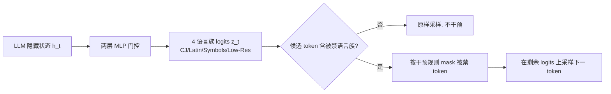

# Language Confusion Gate: Language-Aware Decoding Through Model Self-Distillation

**会议**: ICLR 2026  
**OpenReview**: [https://openreview.net/forum?id=JjJzbMDGsx](https://openreview.net/forum?id=JjJzbMDGsx)  
**代码**: 待确认  
**领域**: 多语言 / 解码干预 / 大语言模型  
**关键词**: 语言混淆, 语言感知解码, 自蒸馏, 嵌入范数, plug-in 干预  

## 一句话总结
本文提出 **Language Confusion Gate (LCG)**：一个不改动基座 LLM、只在解码时按需屏蔽错误语言族 token 的轻量两层 MLP，用「范数校准的自蒸馏」训练，把多模型的语言混淆率压低约一个数量级且不损任务性能。

## 研究背景与动机
- **领域现状**：Qwen3、GPT-5 等 LLM 已支持 100+ 语言，跨语言迁移能力强，但仍会偶发**语言混淆（language confusion）**——在一种语言的输出中莫名混入另一种语言族的字符（如希伯来语句子里冒出汉字）。作者实测即便顶级商用模型也未解决：GPT-5-Chat 有 0.57% CJ / 0.67% Latin 混淆，Qwen3-235B 高达 2.27% / 5.07%。
- **现有痛点**：已有缓解方案要么**需要重训/微调模型**（ORPO 偏好对齐、抑制特定神经元），要么**无法区分有害混淆与合法 code-switch**（写代码注释、用 ReLU/Python 等术语、跨语言教学都需要混用），简单地强制单语言输出反而破坏正常表达。规则检测器在这两类之间也分不清。
- **核心矛盾**：要同时满足两个对立目标——**压制异常语言混淆** vs **保留正常 code-switch 能力**；而且方法还得能 scale 到上百种语言。
- **本文目标**：在不动基座权重、不需重训的前提下，做一个能区分混淆与合法混用、按需介入的解码时干预。
- **核心 idea**：作者对混淆点做了三个关键观察——**(1) 混淆很罕见**（模型其实大体知道正确语言）；**(2) 正确语言 token 几乎总在 top-3**（top-3 命中率 99.29%，说明正确答案在分布里只是概率不够）；**(3) 输出层 token 嵌入范数失衡**使模型系统性偏向高资源语言。据此提出 **logits 级屏蔽 + 范数去偏的门控**：训练一个小 MLP 预测每步允许的语言族，仅在必要时屏蔽。

## 方法详解

### 整体框架
LCG 是一个挂在基座 LLM 输出端的两层 MLP 门控：它读取当前步的最终隐藏状态 $h_t$，输出 4 个语言族（CJ 中日 / Latin / Symbols / Low-Res 低资源）的 logits $z_t=\mathrm{MLP}(h_t)\in\mathbb{R}^4$，预测哪些语言族在下一步是「允许的」，再把被禁语言族的 token 从采样 logits 里 mask 掉。整个干预只在采样候选里真出现了被禁语言族时才触发，因此对正常生成几乎零影响。训练时基座 LLM 全程冻结。

### 关键设计

**1. 词表语言族分类：把上百种语言收敛成 4 个可判定的族。** 干预要在 logits 上做，前提是先知道每个 token 属于哪一族。作者用优先级启发式把整张词表划成互斥的 CJ / Latin / Symbols / Low-Res：先把 token 的 BPE 解码成 Unicode，含中日字符判 CJ，纯 Latin+符号判 Latin，纯符号判 Symbols，其余有效字符归 Low-Res；对 BPE 切出的残缺 Unicode，则按 Unicode 连续块结构从部分字节推断，实在判不准就保守归为 Symbols。这样 Qwen3 的 151,936 个 token 被分成 27,658 CJ / 94,666 Latin / 10,355 Symbols / 19,257 Low-Res，把「100+ 语言」压成 4 类可学的标签。

**2. 范数校准的自蒸馏：用模型自己去偏后的预测当伪标签。** 这是论文的机制核心。logit 可分解为 $\mathrm{logits}_i = h\cdot e_i = \lVert h\rVert\cdot\lVert e_i\rVert\cdot\cos(h,e_i)$；由于 $\lVert h\rVert$ 对同一步所有 token 相同，**token 嵌入范数 $\lVert e_i\rVert$ 越大，logit 天然越高**，而高资源语言的 token 范数系统性偏大（Qwen3-8B 里 CJ 占据 top-5% 高范数 token 的 10.74%，低资源仅 0.14%），这正是偏向高资源语言、引发混淆的机制根源。于是把 logit 除以嵌入范数得到去偏 logits $\mathrm{logits}_{adj,i}=h\cdot e_i/\lVert e_i\rVert=\lVert h\rVert\cos(h,e_i)$，纯按余弦相似度排序——实例里原本排第一的混淆 token「更加」直接掉出 top-10。再在去偏 logits 上做 top-k/top-p 过滤得候选集 $S_{k,p}$，**该集合里出现了哪些语言族，就把对应的多标签伪目标置 1**：$y^*_{t,i}=\mathbb{1}[S_{k,p}(\mathrm{logits}_{adj})\cap F_i\neq\varnothing]$，用 BCE 损失 $L=\sum_i \mathrm{BCE}(y^*_{t,i},\sigma(z_{t,i}))$ 训练门控。整个过程不需人工标注，是模型对自己「去偏后想说什么语言」的自蒸馏。

**3. 推理期干预规则：把误伤降到最低。** 光靠门控预测会误杀合法混用，作者补了三条保守规则：**(a) 永不 mask Symbols 和 Low-Res**——符号不引发混淆、高资源语言极少混入低资源语言；**(b) 高置信输出可否决门控**——若 (top-k=5, top-p=0.999) 与 (top-k=20, top-p=0.95) 两个高概率候选集里都没有门控所预测的语言族 token，就不施加 mask；**(c) 延续前一个非符号 token 的语言**，始终允许上一个 token 的语言族以保持连贯。三条规则共同保证只在真有混淆风险时才介入。

## 实验关键数据

### 主实验表格（No-Think 模型，FLORES-NO-LATIN / INCLUDE）

| 模型 | 指标 | No LCG | LCG-unadjusted | LCG-adjusted |
|------|------|--------|----------------|--------------|
| Qwen3-30B | CJ% | 1.0 | 0.2 | **0.0** |
| Qwen3-30B | Latin% | 4.4 | 0.7 | **0.4** |
| Qwen3-30B | BLEU | 13.2 | 13.3 | **13.4** |
| Llama3.1-8B | Latin% | 8.4 | 5.7 | **2.9** |
| Qwen3-8B | Latin% | 12.1 | 6.2 | **2.0** |
| Qwen3-8B | CJ% | 4.5 | 0.5 | **0.1** |
| Qwen3-30B (INCLUDE) | CJ% | 2.21 | 0.22 | **0.11**（Acc 71.12→70.83）|

语言混淆普遍下降约一个数量级，BLEU/准确率基本不动。

### 消融实验表格（范数校准的作用 + 干预频率）

| 项目 | 结果 |
|------|------|
| Llama3.1-8B Latin% | unadjusted 5.7 → adjusted **2.9** |
| Qwen3-30B Latin% | unadjusted 0.7 → adjusted **0.4** |
| 干预频率 Qwen3-8B | 0.38%（139,354 token 中 523 次）|
| 干预频率 Llama3.1-8B | 0.33%（162,846 token 中 545 次）|

范数校准让门控更准、抑制更精确；干预本身极其稀疏。

### 关键发现
- **Thinking 模型同样有效**：Humaneval-XL 上 GPT-OSS 的 CJ 从 0.38%→0.06%、Qwen3-30B 从 0.12%→0.00%，Pass@1/Pass@10 与推理长度几乎不变。
- **保留合法 code-switch**：对人工判定为「自然英文混用」的样本，LCG 仍放行 86.7%；FLORES-WITH-LATIN 上 code-switch 率从 46.34%→25.90%，仍高于 Claude Sonnet 4 基线（23.29%）、接近 ground-truth 答案率（38.36%），说明只是「更谨慎」而非「禁混用」。

## 亮点与洞察
- **机制层面的诊断**：把语言混淆归因到「输出嵌入范数失衡」这一可量化、可校正的几何因素，并用 logit 分解给出干净的去偏公式，比起「抑制神经元」之类的黑盒手段更有解释力。
- **零训练成本的工程友好性**：基座冻结、只训一个两层 MLP、推理期稀疏触发（<0.4% token），可作为 plug-in 直接挂到 Qwen3/Llama/Gemma/GPT-OSS 等异构模型上。
- **正面回应「混淆 vs code-switch」难题**：用 FLORES-NO-LATIN / WITH-LATIN 的切分 + 三条干预规则，把「该禁的禁、该留的留」做成可评测、可调的行为，而非一刀切单语言约束。

## 局限与展望
- **范数去偏不能解释全部混淆**：英↔中都是高范数、低资源语言之间都是低范数，范数信号对这些情形无能为力，只能覆盖一部分混淆，故只用作训练信号而非直接干预依据。
- **仍会压低合法 code-switch**：虽保留 86.7%，但 code-switch 率确实整体下降，存在过度谨慎的副作用；何为「最优 code-switch 率」并无 ground truth。
- **依赖词表可分语言族**：BPE 残缺字符、混合脚本 token 的归类靠启发式，对分词方式差异大的 tokenizer 可能需重新适配。
- **Latin 混淆评测受限**：因 Latin 在代码/数学中合法出现频繁，只能在 NO-LATIN 子集上可靠评测，真实场景的判定更复杂。

## 相关工作与启发
- **语言混淆基准**：Marchisio et al. (2024) 形式化了语言混淆并提出 LCB；本文因 LCB 部分 query 本身需要 code-switch、检测器易误报而改用 FLORES+/INCLUDE 加定向过滤。
- **机制可解释 / 神经元抑制**：Nie et al. (2025) 定位语言切换神经元并在推理时抑制；Ji et al. (2025) 针对韩语里汉字入侵做后处理平滑——本文与之同属「不重训」路线，但用范数去偏 + 门控统一处理多语言。
- **是否该混用的抉择**：Li et al. (2025) 训门控判断中英混用对推理是帮助还是有害；Lee et al. (2025) 用 ORPO 对齐语言一致偏好——本文的门控目标更聚焦「按需屏蔽错误语言族」并显式保留合法混用。
- **启发**：把「输出嵌入范数 = 系统性采样偏置源」的视角迁移到其他生成偏差（如高频 token 偏好、安全词规避）或许同样适用——logit 的范数/方向分解是个通用的诊断工具。

## 评分
- **新颖性**: ⭐⭐⭐⭐ — 「嵌入范数失衡导致语言混淆」的机制诊断 + 范数校准自蒸馏门控是新颖且自洽的组合，logits 级 plug-in 思路干净。
- **实验充分度**: ⭐⭐⭐⭐ — 覆盖 4+ 异构模型、think/no-think 两类、FLORES/INCLUDE/Humaneval-XL 多基准，含范数消融、干预频率、code-switch 保留度等多维验证；商用模型评测也补全了 motivation。
- **写作质量**: ⭐⭐⭐⭐ — 观察→机制→方法→规则链条清晰，公式与图表（Top-10 范数对比）很有说服力。
- **价值**: ⭐⭐⭐⭐ — 多语言部署中实用、零训练成本、可即插即用，对工业级多语言 LLM 有直接落地价值。

<!-- RELATED:START -->

## 相关论文

- [\[ACL 2026\] TLPO: Token-Level Policy Optimization for Mitigating Language Confusion in Large Language Models](../../ACL2026/multilingual_mt/tlpo_token-level_policy_optimization_for_mitigating_language_confusion_in_large_.md)
- [\[ACL 2026\] SERM: Self-Evolving Relevance Model with Agent-Driven Learning from Massive Query Streams](../../ACL2026/multilingual_mt/serm_self-evolving_relevance_model_with_agent-driven_learning_from_massive_query.md)
- [\[NeurIPS 2025\] ParallelPrompt: Extracting Parallelism from Large Language Model Queries](../../NeurIPS2025/multilingual_mt/parallelprompt_extracting_parallelism_from_large_language_model_queries.md)
- [\[ICLR 2026\] ATLAS: Adaptive Transfer Scaling Laws for Multilingual Pretraining, Finetuning, and Decoding the Curse of Multilinguality](atlas_adaptive_transfer_scaling_laws_for_multilingual_pretraining_finetuning_and.md)
- [\[ACL 2025\] LangSAMP: Language-Script Aware Multilingual Pretraining](../../ACL2025/multilingual_mt/langsamp_multilingual_pretraining.md)

<!-- RELATED:END -->
