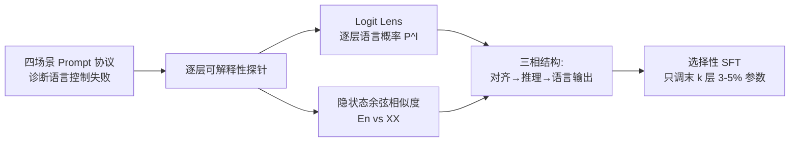

# LinguaMap: Which Layers of LLMs Speak Your Language and How to Tune Them?

**会议**: ICLR 2026  
**OpenReview**: [https://openreview.net/forum?id=r00UxTl8El](https://openreview.net/forum?id=r00UxTl8El)  
**代码**: 待确认  
**领域**: 多语言 / 机器翻译 · 可解释性  
**关键词**: 多语言 LLM, 语言一致性, logit lens, 选择性微调, 层定位  

## 一句话总结
通过 logit lens 与隐状态相似度分析定位出 mLLM 中「负责语言控制」的最后几层，只微调这 3–5% 的参数就能把六种语言的语言一致性从 <20% 拉到 98%+，效果几乎等同全量微调。

## 研究背景与动机
- **领域现状**：多语言 LLM（Qwen、BLOOM、PaLM-2 等）虽然预训练覆盖多语种，但在非英语任务上仍频繁失灵，尤其是「语言控制」——能否用用户指定的语言作答。
- **现有痛点**：作者识别出两类失败模式：**多语言迁移瓶颈**（语言对了但任务答错）与**语言一致性瓶颈**（任务答对了但用错语言）。这说明「任务能力」和「语言控制」是被两套不同内部机制支配的，传统全量微调既贵又可能破坏已有能力。
- **核心矛盾**：既然语言控制只占模型内部一小块机制，为何要用全模型微调去修它？能不能把它定位出来精准修？
- **本文目标**：搞清楚 mLLM 内部「哪里」负责语言控制，并据此设计高效（少参数）又有效（不掉任务准确率）的多语言适配方法。
- **核心 idea**：**「三相结构 + 末层定位微调」**——早层把不同语言对齐到共享语义空间、中层做任务推理、末层才决定输出语言；因此只需冻结前两段、选择性微调末层即可修复语言一致性。

## 方法详解

### 整体框架
LinguaMap 分三步走：先用四场景 prompt 协议系统暴露语言控制失败，再用两套可解释性工具（logit lens 语言概率追踪 + 跨语言隐状态相似度）定位语言控制涌现的层位，最后据此对末层做掩码式选择性监督微调。

### 关键设计

**1. 四场景 Prompt 协议：把语言控制拆成可观测的失效轴。** 作者把一个 prompt 分解为 Preamble(P)、Instruction(I)、Question(Q) 三个输入件和 Reasoning(R)、Answer(A) 两个输出件，再据此构造四种零样本变体——单语直接、代码混合（指令用英文/内容用目标语）、英语干扰项、双语答案——分别隔离「基础保真度、混合语境鲁棒性、抗英语误导、语言偏好」。在 MMLU/MGSM/XQuAD 上保持答案语义不变、只换语言，用 LangDetect 判定输出主语言来计算语言一致性，从而把「任务准确率」与「语言一致性」两个正交指标干净分开。

**2. Logit Lens 语言概率追踪：逐层看模型"在想哪种语言"。** 把第 $l$ 层隐状态 $h^{(l)}_i$ 经 unembedding 矩阵投影到词表得到伪 logits $z^{(l)}_{i,t}=u_t^\top h^{(l)}_i$，逐层解码出最可能的 token，重组成完整词后用 langdetect 在**词级**（避开多语 subword 重叠歧义）判定语言概率，再对生成的 $M$ 个词取平均得到每层语言质量 $P^{(l)}(\ell)=\frac{1}{M}\sum_{j=1}^{M}p^{(l)}_j(\ell)$。沿层追踪 $P^{(l)}(\ell)$ 就得到「语言漂移轨迹」，揭示出英语在早中层长期占主导、目标语言概率往往要到很靠后的层（Qwen-3-32B 约第 55 层后）才反超。

**3. 隐状态相似度分析：用余弦相似度划出三相边界。** 给定一批英语-目标语对齐 prompt，逐层抽隐状态并对序列做均值池化 $\bar h^{(E,n)}_\ell$、$\bar h^{(A,n)}_\ell$，再算跨语言余弦相似度 $s^{(n)}_\ell=\frac{\langle\bar h^{(E)}_\ell,\bar h^{(A)}_\ell\rangle}{\|\bar h^{(E)}_\ell\|\,\|\bar h^{(A)}_\ell\|}$ 并跨样本聚合。结果一致呈现三相：早层相似度急升（对齐到共享语义空间）、中层维持高位 0.95–0.99（语言无关推理）、末层（如 BLOOM 第 24–30 层、Qwen 第 55 层后）相似度回落——这个回落点正是「语言特定生成」涌现的可操作信号，与 logit lens 反超点相互印证。

**4. 末层选择性监督微调：只动语言控制那一小块。** 把参数集划成各层 $\theta_\ell$ 与头 $\theta_{head}$，只更新末 $k$ 层子集 $S$、冻结其余 $\theta_{-S}$，目标 $\mathcal{L}=-\sum_i \log P(y_i\mid x_i;\theta_S)$ 的梯度只回传到 $\theta_S$。训练时进一步加掩码 $m_i\in\{0,1\}$ 只对 Q/R/A token 算损失、P/I 作冻结上下文：$\mathcal{L}^{masked}=-\sum_i m_i\log P(y_i\mid Q_i,R_i,A_i;\theta_S)$。在 MMLU 商科子集（5 学科×5 语言，2500 条带 CoT 的样本）上微调，消融得出 BLOOM 调末 1 层、Qwen 调末 2 层（均 5 epoch）最优——只占 3–5% 参数，却保住中层语义对齐不被反向污染。

## 实验关键数据

### 主实验表格（微调前后，跨语言均值）

| Prompting / Dataset | 模型 | 微调前一致性% | 微调前任务% | 全量SFT一致性% | 全量SFT任务% | 选择性SFT一致性% | 选择性SFT任务% | 可训练参数 |
|---|---|---|---|---|---|---|---|---|
| 单语 MGSM | Qwen-3-32B | 65.56 | 66.60 | 99.47 | 90.53 | 99.20 | 86.80 | 1.5B / 32B |
| 单语 XQuAD | Qwen-3-32B | 81.05 | 55.54 | 100.0 | 57.60 | 99.83 | 55.86 | 1.5B / 32B |
| 代码混合 MMLU | Qwen-3-32B | 8.35 | 60.51 | 99.87 | 78.84 | 99.62 | 74.44 | 1.5B / 32B |
| 代码混合 MGSM | Qwen-3-32B | 6.80 | 57.00 | 95.00 | 87.00 | 98.60 | 84.60 | 1.5B / 32B |
| 单语 MGSM | BLOOM-7.1B | 34.00 | 0.67 | 100.0 | 1.47 | 100.0 | 3.60 | 0.5B / 7.1B |
| 代码混合 MMLU | BLOOM-7.1B | 29.49 | 22.31 | 99.87 | 33.72 | 98.66 | 21.14 | 0.5B / 7.1B |

### 消融实验表格

| 对照设置 | 现象 | 结论 |
|---|---|---|
| 随机选层 SFT (Qwen 单语 MGSM) | 一致性从 ~100% 跌到 65.9%、任务塌到 0.13% | 随机选层灾难性失败，验证「定位」是关键 |
| 末层数 × epoch 网格搜索 | BLOOM 末1层/5ep、Qwen 末2层/5ep 最优 | 语言控制确实集中在极少数末层 |
| 微调后 logit lens / 相似度复检 | 目标语概率提升严格局限在被调末层、中层对齐几乎不变 | 干预成功定位、未反向污染推理能力 |

### 关键发现
- **代码混合是照妖镜**：Qwen 在代码混合下 MMLU 任务准确率反而升到 60.5%，但语言一致性从 45% 崩到 8.35%，证明两套机制确实解耦。
- **选择性 ≈ 全量**：只调 3–5% 参数，六语言一致性普遍 98%+，与全量微调几乎持平，算力大幅节省。
- **英语干扰项仍是硬骨头**：选择性 SFT 能把一致性拉满，但任务准确率仍偏低（XQuAD 仅 18%），需要更显式的推理级消歧。

## 亮点与洞察
- 把「多语言失败」从笼统抱怨，拆成可独立测量的两条瓶颈轴（迁移 vs 一致性），方法论上很干净。
- logit lens 与隐状态相似度两条独立证据链收敛到同一「三相结构」，定位结论可信度高。
- 「先定位再微调」把可解释性研究真正落到了一个省钱的工程方法上，而非停留在分析层面。
- 微调后再用同一套探针复检，证明干预被严格限制在末层、没破坏中层语义——这种「自洽闭环」很有说服力。

## 局限与展望
- 英语干扰场景下任务准确率仍弱，说明语言一致性修好了但「抗误导推理」没修好，需推理级消歧。
- 仅在 Qwen-3-32B、BLOOM-7.1B 两个模型、六种语言上验证，更大规模、更多低资源语言的泛化性待考。
- 「末层定位」依赖 logit lens / 相似度的经验拐点，跨架构（如不同层归一化、MoE）是否同样清晰未充分讨论。
- 微调数据局限于 MMLU 商科子集，领域迁移到其他知识域的稳健性需进一步验证。

## 相关工作与启发
- **隐性英语主导**：Wendler 2024、Schut 2025、Lindsey 2025 揭示 mLLM 在中间层以英语为默认内部表示，本文的三相结构正是对这一假设的逐层量化验证。
- **语言定位与神经元**：Tang 2024、Wang 2024、Zhao 2024 发现输入/输出层语言特异、中层语言无关，本文把「输出层语言特异」这一结论直接转化为可微调的参数子集。
- **高效多语言适配**：相比 Pfeiffer 2020 的可逆 adapter、Huo 2025 的深监督对齐，本文不引入新模块，只是「选对层来调」，更轻量。
- **启发**：把可解释性当作「手术刀的定位仪」而非终点，是 PEFT 方法设计的一条值得推广的范式。

## 评分
- **新颖性**: ⭐⭐⭐⭐ — 「三相结构定位 + 末层选择性微调」组合首次把语言控制的层定位用于高效多语言适配，思路清晰。
- **实验充分度**: ⭐⭐⭐ — 四场景×三基准×六语言较全面，但仅两模型、且英语干扰场景仍有明显短板。
- **写作质量**: ⭐⭐⭐⭐ — 问题拆解干净、公式与图表配合好、分析-方法-复检闭环完整。
- **价值**: ⭐⭐⭐⭐ — 3–5% 参数达到全量微调效果，对资源受限的多语言部署有直接实用价值。

<!-- RELATED:START -->

## 相关论文

- [\[AAAI 2026\] How Does Alignment Enhance LLMs' Multilingual Capabilities? A Language Neurons Perspective](../../AAAI2026/multilingual_mt/how_does_alignment_enhance_llms_multilingual_capabilities_a_language_neurons_per.md)
- [\[ICLR 2026\] Language Confusion Gate: Language-Aware Decoding Through Model Self-Distillation](language_confusion_gate_language-aware_decoding_through_model_self-distillation.md)
- [\[ICLR 2026\] SASFT: Sparse Autoencoder-guided Supervised Finetuning to Mitigate Unexpected Code-Switching in LLMs](sasft_sparse_autoencoder-guided_supervised_finetuning_to_mitigate_unexpected_cod.md)
- [\[ACL 2026\] Mitigating Catastrophic Forgetting in Target Language Adaptation of LLMs via Source-Shielded Updates](../../ACL2026/multilingual_mt/mitigating_catastrophic_forgetting_in_target_language_adaptation_of_llms_via_sou.md)
- [\[NeurIPS 2025\] How Data Mixing Shapes In-Context Learning: Asymptotic Equivalence for Transformers with MLPs](../../NeurIPS2025/multilingual_mt/how_data_mixing_shapes_in-context_learning_asymptotic_equivalence_for_transforme.md)

<!-- RELATED:END -->
