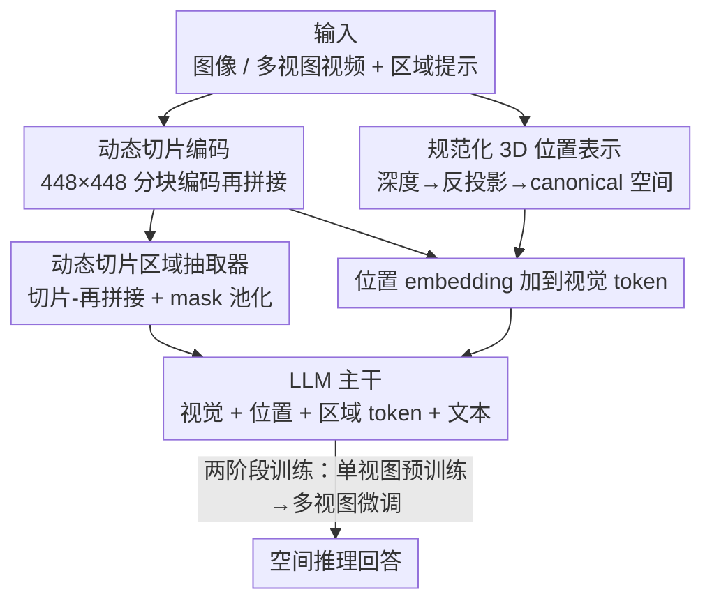

# SR-3D: 3D-Aware Region Prompted Vision Language Model

**会议**: ICLR2026  
**OpenReview**: [https://openreview.net/forum?id=GTpf2NuwtR](https://openreview.net/forum?id=GTpf2NuwtR)  
**代码**: [项目页](https://www.anjiecheng.me/sr3d)  
**领域**: 多模态VLM / 3D空间理解  
**关键词**: 3D位置编码, 区域提示, 多视图, 空间推理, 视觉语言模型

## 一句话总结
SR-3D 通过把深度估计得到的 3D 位置编码直接注入 2D 基础 VLM 的视觉 token，并配一个动态切片区域抽取器，让同一个模型既能处理单视图图像又能处理多视图视频，支持在任意一帧上画框/涂 mask 就能跨帧做精确的 3D 空间推理，在 2D/3D 多个 benchmark 上都拿到 SOTA。

## 研究背景与动机

**领域现状**：2D 视觉语言模型（VLM，如 GPT-4o、LLaVA、Qwen-VL）在平面图像理解和语言 grounding 上已经很强，社区也开始尝试给它们加 3D 空间推理能力。主流有两条路：一条是用点云训练专门的 3D VLM；另一条是把多视图图像当作 3D 表示，喂给现成的 2D VLM。

**现有痛点**：点云路线需要大量数据采集和模型对齐，3D 训练数据稀缺导致性能受限，而且点云空间和 2D VLM 的表示空间完全不同，没法复用 2D 基础模型积累的先验知识。多视图路线虽然天然对齐 2D VLM 的输入空间，但有两个没解决的难题：一是怎么把 3D 几何信息真正注入进去（已有工作要么只在 3D 微调阶段加位置信息，要么走单独的旁路通道，没有融进基础模型本身）；二是怎么在多视图下指定物体——纯语言在杂乱场景里很笨拙（比如同一类物体出现好几个），而 region prompt 虽然在单视图里很好用，扩到多视图却很麻烦：同一物体在不同视角下可见性不同，逐帧或 3D 框标注极其繁琐。

**核心矛盾**：理想的 VLM 应该让用户**只在单帧上画一个框**，模型就能在整个多视图场景里准确推理跨帧空间关系。但要做到这点，必须同时解决「3D 几何如何融入 2D 先验」和「区域表示如何从单视图泛化到多视图」两件事，而它们彼此耦合。

**本文目标**：构建一个统一的视觉表示，既继承强大的 2D 基础先验，又支持灵活的区域提示，覆盖单视图和多视图两种场景。

**切入角度**：作者发现，只要把不同视角的 3D 位置统一到一个**规范化的世界坐标空间（canonical space）**，再让区域 embedding 在单视图预训练阶段就和这个空间对齐，那么单视图学到的空间先验就能零样本迁移到多视图——他们的纯 2D 模型在从没见过多视图数据的情况下，居然能对 3D 场景做出不错的空间推理，这成了整个设计的关键证据。

**核心 idea**：把深度派生的 3D 位置编码直接加到基础 VLM 的视觉 token 上（而非旁路或后期微调），并用「切片-再拼接」的方式抽取区域特征，让单/多视图共享同一套架构和同一个 canonical 坐标空间。

## 方法详解

### 整体框架
SR-3D 要解决的是「让一个 2D VLM 学会 3D 空间推理，且能用区域提示跨帧定位物体」。它的整体流程是：输入一张图或一段多视图视频（外加可选的框/mask 区域提示）→ 视觉编码器把图像切成 448×448 的小块分别编码 → 同时用现成深度估计器算出每张图的深度图，反投影成 3D 位置图并规范化到统一坐标空间，编码成位置 embedding 加到对应视觉 token 上 → 区域抽取器用同样的切片方式抽出高分辨率区域 token → 所有视觉 token、位置 token、区域 token 连同文本一起送进 LLM 输出答案。关键在于：单视图和多视图**走完全相同的一条管线**，不分叉，所以单视图大规模预训练的先验能无缝带到多视图。

### 关键设计

**1. 规范化 3D 位置表示：用统一坐标空间打通单视图与多视图**

痛点是已有方法只在 3D 微调阶段加位置信息、或走独立旁路，没法让 2D 预训练的先验真正服务于 3D 推理。SR-3D 的做法是：对单视图图像 $I$，用 DepthAnythingV2 估计相对深度图 $D$，按相机内参反投影成逐像素的 3D 位置图，再**规范化（canonicalize）到一个与相机位姿无关的归一化世界坐标系**。这个 3D 位置图先过一个正弦编码再过一个逐点 MLP，得到位置 embedding，resize 到 token 维度后**直接加到对应的视觉 token 上**。多视图时，对采样的 32 帧用真值深度做反投影+相机变换，把各帧的点图对齐到**同一个 canonical 空间**——这正是关键：因为所有帧的 3D 坐标都落在同一个归一化空间里，同一物体即便在不同帧里没共现，也能建立连贯的跨帧对应。之所以有效，是因为位置信息被表达成「与相机位姿无关的统一空间坐标」，单视图阶段学到的「这个坐标对应这种空间关系」的先验，可以原样复用到多视图。

**2. 动态切片区域抽取器：切片-再拼接抽出高保真区域特征**

痛点是视觉骨干输出的特征图分辨率低，小物体/小区域表示能力差；已有区域 VLM 在编码器之后用反卷积上采样来「恢复细节」，但特征此时已经被压缩失真，恢复有限。SR-3D 改成 **tile-then-stitch（切片-再拼接）**：先按预设宽高比集合（1:1、1:2、2:1、3:1…2:6）选最接近的比例 resize，把图像和点图切成 448×448 的小块**分别编码**，再拼回高分辨率特征图——这样在编码阶段就保住了局部细节，不需要事后补救。给一个二值 mask 表示的感兴趣区域（RoI），对 mask 做同样的切片，拼回高分辨率后做 mask 池化得到区域特征。这套设计有两个好处：一是区域特征**直接从高分辨率特征里抽**，失真小、不需要后处理细化；二是它**天然扩展到多视图视频**——多视图时把每一帧当作一个 tile，就能处理「一帧一个 mask」或「一帧多个 mask」，同时为同一 RoI 保持跨帧空间一致性。

**3. 两阶段统一训练 + 区域 embedding 早对齐：让单视图先验零样本迁移到多视图**

痛点是若区域 embedding 只在多视图阶段才训练，它就学不到能泛化的表示。SR-3D 的策略是：先从预训练的 2D VLM（NVILA-Lite-8B）初始化，**冻结视觉编码器**，微调 3D 位置编码模块、projector 和 LLM，用约 700 万样本（基础指令数据 + 区域提示数据混合）做单视图训练；这一阶段区域 embedding 就已经在 canonical 空间里被训练对齐。然后在 ScanQA、SQA3D、Scan2Cap 以及作者新整理的 EmbodiedScan 区域/空间 QA 数据上做多视图微调，并用 mask 增强（把分割 mask 转成框、随机丢帧模拟单帧标注）提升鲁棒性。关键之处在于「**单/多视图共用同一架构、同一数据管线**」——不像有的工作给单视图和多视图开两条旁路，SR-3D 让所有数据流过同一个模型，区域提示和全局 query 也不做区分处理。正因为区域 embedding 在单视图阶段就和 canonical 空间对齐，纯 2D 模型才能在从没见过多视图数据时做出强的零样本 3D 空间推理（实验 Table 7 证实）。

**4. canonical 空间带来的推理期灵活性：从真值深度无痛切换到估计点图**

虽然多视图训练用的是真值深度，但因为所有 3D 位置都被规范化到归一化空间，推理时可以**直接把真值深度换成现成模型（MAST3R、CUT3R）估计的点图**，模型几乎不掉点。这让 SR-3D 能处理「野外拍摄、没有任何 3D 标注的视频」——只要跑个几何基础模型重建出点图就行。同时它支持多种区域标注密度：3D 框投影成多帧 mask、稀疏帧 mask、甚至单帧 mask，都能跨帧保持空间对齐。

### 损失函数 / 训练策略
两阶段训练：① 单视图阶段从 NVILA-Lite-8B 初始化、冻结视觉编码器，微调 3D 位置编码模块/projector/LLM，约 7M 样本（指令数据 + 区域数据混合）；② 多视图阶段在 3D QA/caption 数据 + EmbodiedScan 区域空间 QA 上微调，配合 mask 增强（分割→框、随机丢帧）。多视图统一采样 32 帧。

## 实验关键数据

### 主实验

3D 场景理解（Scan2Cap / ScanQA / SQA3D），SR-3D-8B 在所有指标上刷新 SOTA：

| 数据集 | 指标 | SR-3D-8B | 之前最好 | 提升 |
|--------|------|----------|----------|------|
| Scan2Cap | CIDEr | 97.9 | 83.8 (Video-3D LLM) | +14.1 |
| Scan2Cap | BLEU-4 | 44.7 | 42.4 | +2.3 |
| ScanQA | CIDEr | 109.3 | 102.7 (NaVILA) | +6.6 |
| SQA3D | EM | 62.2 | 58.6 (Video-3D LLM) | +3.6 |

2D 通用 VQA（Table 1），3D 预训练在不损失通用/OCR 能力的前提下提升空间任务：

| 类别 | 基线 NVILA-Lite-8B | SR-3D-8B |
|------|--------------------|----------|
| BLINK (空间) | 79.7 | 83.9 (+4.2) |
| EmbSpat (空间) | 68.9 | 72.5 (+3.6) |
| RealWorldQA (空间) | 65.6 | 68.1 (+2.5) |
| GQA / TextVQA (通用/OCR) | 65.3 / 78.1 | 64.2 / 77.3（基本持平）|

区域级识别（COCO-2017，Table 3）：SR-3D-8B mAP 78.0 / Acc 88.6%，显著超过同样用区域数据训练的 SpatialRGPT（72.9 / 82.9），作者归因于动态切片抽取器提供了更高保真的区域 mask。VSI-Bench 全局空间理解（Table 6）SR-3D-8B 平均 62.9，超过所有开源模型，相对方向任务尤其突出（81.8）。

### 消融实验

3D 位置编码（3D PE）和单视图预训练（PT）的作用（Table 8）：

| 配置 | Scan2Cap | ScanQA | 3D Global |
|------|----------|--------|-----------|
| 都不加 | 92.9 | 101.3 | 51.1 |
| 仅 3D PE | 94.3 | 108.2 | 52.9 |
| 仅 PT | 92.7 | 102.9 | 51.2 |
| 全开 | 97.9 | 109.3 | 62.0 |

### 关键发现
- **3D PE 和单视图预训练缺一不可，且两者有强协同**：单独开任一个，3D Global 只从 51.1 涨到 52.9/51.2，但**两者同时开直接跳到 62.0**——说明位置编码要配上预训练对齐的表示才能完全发挥，作者也据此推测继续扩大预训练还能涨。
- **零样本泛化是核心卖点**（Table 7）：只用单视图训练的 SR-3D-2D，在 SR-3D-Bench 的 Tall/Short、Big/Small 等类别上能拿到 71.4/79.7 这种合理精度，证明 2D 和 3D 表示真正被对齐到了同一空间。
- **对重建噪声鲁棒**（Table 9）：把真值点云换成 CUT3R 重建的点图，SR-3D 的 ScanQA CIDEr 几乎不掉（109.3→109.3），而 Video-3D LLM 有明显下降，这让它能直接用于野外视频。
- **区域 VLM + SoM 在多帧下失效**：GPT-4o/NVILA 配 Set-of-Marks 在多帧场景表现很差，因为难以跨帧追踪标记，反衬出 SR-3D 跨帧区域一致性设计的价值。

## 亮点与洞察
- **「位置编码直接加到基础 token 上」是关键判断**：相比把 3D 信息塞进旁路或只在微调期注入，直接融进基础 VLM 让 2D 先验和 3D 几何在同一表示空间里共生，这是 3D Global 从 51 跳到 62 的根因。
- **canonical 空间是一石三鸟的设计**：它既让跨帧对应连贯（同物体不共现也能对上），又让单视图先验零样本迁移到多视图，还让推理期能无痛替换深度来源（真值→估计点图）——一个规范化操作撬动了三个能力。
- **tile-then-stitch 把「区域抽取」和「高分辨率编码」统一了**：单视图把图切块、多视图把每帧当一个 tile，同一套机制覆盖两种输入，工程上极其简洁，这种「用同一抽象统一两种场景」的思路可迁移到其他需要兼顾单图/视频的任务。
- **「只画一个单帧框就能跨帧推理」是真正的用户价值**：免去了多帧/3D 框的繁琐标注，对实际应用（机器人、AR）门槛大幅降低。

## 局限与展望
- **多视图训练依赖真值深度**：虽然推理期可换成估计点图，但训练阶段用的是 ground-truth depth + 相机位姿，纯野外数据从头训练能否同样好仍待验证。
- **依赖现成深度/重建模型**：整套空间能力建立在 DepthAnythingV2、CUT3R/MAST3R 之上，这些上游模型在极端场景（透明物体、强反光、无纹理）失效时，SR-3D 的空间推理也会受连累。
- **作者提示 scaling 还没到头**：消融显示继续扩大单视图预训练可能继续涨点，说明当前规模可能还没榨干潜力，但也意味着复现需要可观算力（7M 样本预训练）。
- 自定义的 SR-3D-Bench 用 GPT-4o 做定性 QA 的评测器，评测一致性受裁判模型影响，绝对数值需谨慎横向比较。

## 相关工作与启发
- **vs 点云 3D VLM（3D-LLM、LEO、LL3DA）**: 它们在点云空间操作，需要大量 3D 数据且难复用 2D 先验；SR-3D 走多视图+2D 先验路线，数据更易得、性能更强（ScanQA CIDEr 109.3 vs LEO 101.4）。
- **vs LLaVA-3D / Video-3D LLM**: 它们或者用独立旁路注入位置、或者只在 3D 微调期加位置信息；SR-3D 把位置编码融进基础 VLM 且单/多视图共用一条管线，在对重建噪声的鲁棒性上明显更好（Table 9）。
- **vs SpatialRGPT**: 同样做区域提示空间推理，但 SpatialRGPT 用反卷积上采样恢复区域细节、且偏单视图；SR-3D 用 tile-then-stitch 抽高保真区域特征并扩到多视图，COCO 区域识别 mAP 78.0 vs 72.9，BLINKDepth 90.3% vs 87.9%。

## 评分
- 新颖性: ⭐⭐⭐⭐⭐ 「位置编码直接融进基础 VLM + canonical 空间统一单/多视图」是简洁而有效的新组合，零样本迁移证据有说服力。
- 实验充分度: ⭐⭐⭐⭐⭐ 覆盖 2D/3D、区域/全局、单/多视图，含零样本、重建鲁棒性、消融，还自建 region-level benchmark。
- 写作质量: ⭐⭐⭐⭐ 动机和方法讲得清楚，图表丰富；部分自定义指标（定性 QA 用 GPT-4o 评判）细节略简。
- 价值: ⭐⭐⭐⭐⭐ 「单帧画框跨帧推理 + 野外视频可用」对具身/AR 等下游极具实用价值，SOTA 全面。

<!-- RELATED:START -->

## 相关论文

- [\[CVPR 2026\] Grounded 3D-Aware Spatial Vision-Language Modeling](../../CVPR2026/multimodal_vlm/grounded_3d-aware_spatial_vision-language_modeling.md)
- [\[CVPR 2026\] HiSpatial: Taming Hierarchical 3D Spatial Understanding in Vision-Language Models](../../CVPR2026/multimodal_vlm/hispatial_taming_hierarchical_3d_spatial_understanding_in_vision-language_models.md)
- [\[ICLR 2026\] CARPRT: Class-Aware Zero-Shot Prompt Reweighting for Vision-Language Model](carprt_class-aware_zero-shot_prompt_reweighting_for_vision-language_model.md)
- [\[ICLR 2026\] VaseVQA-3D: Benchmarking 3D VLMs on Ancient Greek Pottery](vasevqa-3d_benchmarking_3d_vlms_on_ancient_greek_pottery.md)
- [\[ACL 2025\] R-VLM: Region-Aware Vision Language Model for Precise GUI Grounding](../../ACL2025/multimodal_vlm/r-vlm_region-aware_vision_language_model_for_precise_gui_grounding.md)

<!-- RELATED:END -->
