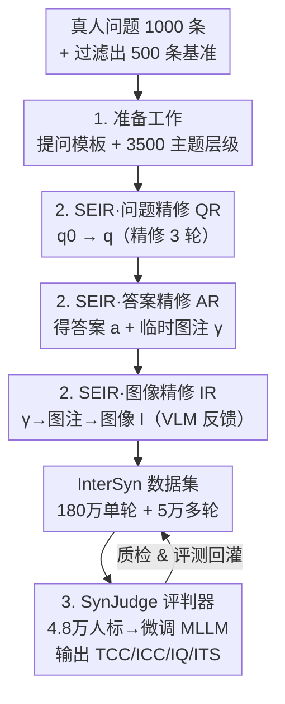

# A High Quality Dataset and Reliable Evaluation for Interleaved Image-Text Generation

**会议**: ICLR 2026  
**OpenReview**: [https://openreview.net/forum?id=qBORZkk28r](https://openreview.net/forum?id=qBORZkk28r)  
**代码**: 待确认  
**领域**: 多模态VLM / 交错图文生成 / 数据集与评测  
**关键词**: 交错图文生成、InterSyn、SEIR、SynJudge、图文协同

## 一句话总结
针对统一多模态大模型（LMM）"图文交错生成"训练数据稀缺、评测不可靠两大痛点，本文造了一个 180 万样本、3500 主题、带自动质检（SEIR 迭代精修）的大规模数据集 InterSyn，并训练了一个与人类打分高度一致（A@1 达 95.4%）、输出四维可解释分数的评判模型 SynJudge，实验证明用 InterSyn 微调只需 25K–50K 样本就能显著提升交错生成能力。

## 研究背景与动机
**领域现状**：统一 LMM（如 Janus-Pro、Show-o、BAGEL）已经能把"文本自回归生成"和"图像扩散/自回归生成"塞进一个模型里，理论上具备同时产出图和文的能力。但真实场景（比如用户问"介绍一下马卡龙顺便画张图"）需要的是**紧密交错（tightly interleaved）的图文输出**——文字和图要互补、协同、连贯，而不是各说各话。

**现有痛点**：现有统一模型在交错生成上毛病明显——语义漂移（semantic drift）、图文协同度低（low image–text synergy）、图像质量差。作者把根因归到**数据和评测两条腿都瘸了**。数据侧：现有交错图文数据集（MMC4、OBELICS、CoMM、LeafInstruct 等）要么规模小（多为针对窄任务的几万条），要么是网络爬取/复用语料、质量不稳、缺标准化质检，要么交互复杂度低（静态文档或单轮 prompt，撑不起真实多轮对话的上下文）。评测侧：现有 benchmark（OpenLEAF、InterleavedBench、OpenING 等）规模窄、依赖昂贵的人工评测、自动指标与人类判断偏差大，而且只看表面正确性、忽略图文协同与整体质量。

**核心矛盾**：要训练好交错生成，既需要**大规模 + 高质量 + 指令丰富**的训练数据，又需要一把**便宜、可复现、且贴合人类偏好**的标尺来量化"图文是否协同"——而这两者现有工作都没同时给到，且二者相互依赖（没有可靠标尺就没法自动质检数据，没有高质量数据又训不出靠谱模型）。

**本文目标**：(1) 全自动地造出一个大规模、高质量、指令多样的交错图文数据集；(2) 造一个与人类高度对齐、能给出细粒度可解释分数的自动评判器。

**切入角度**：作者不去"爬现成网页再过滤"，而是反过来**从人类真实提问风格出发自顶向下合成**——先收集真人问题、抽取通用提问模板、建主题层级，再用一个"生成—自评—精修"的闭环循环逐步打磨问题、答案、图像三段内容，把质检直接嵌进生成的每一步。

**核心 idea**：用"自评 + 迭代精修"（SEIR）的闭环把质量控制内化进数据合成流程，造出 InterSyn 数据集；同时把人类标注的四维评分蒸馏进一个微调 MLLM（SynJudge），用它当自动质检员和评测尺。

## 方法详解

### 整体框架
本文的产出是"一套数据集构建管线 + 一个评测模型"，整体可拆成三块：**① 准备工作**（从真人问题里提炼提问模板和 3500 主题的层级，给后续合成提供骨架）；**② SEIR 数据合成**（在每一轮对话里，按"问题→答案/临时图注→图像"三个级联阶段，各自跑一个"生成—自评—精修"循环，产出高质量交错样本，汇成 180 万单轮 + 5 万多轮的 InterSyn）；**③ SynJudge 评判器**（用 4.8 万条人类四维标注微调一个 MLLM，得到与人类高度一致的自动打分器，既给数据质检也给模型评测）。其中 SEIR 的三阶段是逐级传递的：问题精修产出的最终问题 $q^{(t)}$ 喂给答案精修，答案精修产出的临时图注 $\gamma^{(t)}$ 作为图像精修的初始图注，最后产出图像 $I^{(t)}$。

### 关键设计

**1. 自顶向下的准备工作：从真人提问风格提炼模板 + 主题层级，让合成既像人又可规模化**

交错数据要"指令丰富"，但直接让 LLM 凭空造问题会同质化、不像真人。作者用五步准备工作解决这个冷启动：先招募 25 名参与者、每人贡献 40 个来自自然对话场景的问题（共 1000 条）；再用"LLM 过滤 + 专家复核"剔除冗余、歧义、罕见、过于主观的样本，保留 500 条作为基础 benchmark；然后从这些高质量问题里抽取**与具体知识内容无关的通用提问模板**（即"人们提需求时常用的语言形式"），从而把"提问风格"和"知识内容"解耦，使问题可规模化生成；最后用 AI 辅助抽取主题并人工组织成**基础主题层级**，再 AI 建议 + 专家整理**扩展**到 3500 个主题、8 个领域。这样一来，"模板 × 主题"两个正交维度就能组合出海量既多样又真实的指令，且逻辑依赖清晰。

**2. SEIR：把"生成—自评—精修"闭环嵌进问题/答案/图像三阶段，做全自动质检**

这是数据高质量的核心。作者定义一个通用精修算子 $\Phi$，把初始内容 $x_0$ 经 $K$ 次迭代打磨成终稿 $x$，单步更新规则为：

$$x_k = M_\text{refine}(x_{k-1}, s_k),\quad s_k = M_\text{eval}(x_{k-1}, C)$$

其中 $M_\text{eval}$ 充当"评委"，针对上下文 $C$（目标主题、前序问题、对话历史等）分析当前内容并给出具体修改建议 $s_k$；$M_\text{refine}$ 据此产出改进版本；当评委不再给建议或达到迭代上限 $K$ 时终止。这个算子在每一轮对话里**级联跑三遍**：① 问题精修 QR，$q^{(t)}=\Phi(q^{(t)}_0\mid C=\{z, H^{(t-1)}\})$，基于主题 $z$ 和对话历史把模板生成的初始问题打磨到位；② 答案精修 AR，$(a^{(t)},\gamma^{(t)})=\Phi((a^{(t)}_0,\gamma^{(t)}_0)\mid C=\{q^{(t)}, H^{(t-1)}\})$，同时精修文本答案和一个"临时图注"，保证文字全面、图注相关；③ 图像精修 IR，用 AR 给的临时图注 $\gamma^{(t)}$ 初始化图注 $c^{(t)}_0$，每轮先由生成器产图 $I^{(t)}_k=G(c^{(t)}_k)$，再让一个 VLM 对照文本上下文打分给反馈 $s^{(k)}_c=V(I^{(t)}_k, q^{(t)}, a^{(t)}, H^{(t-1)})$，据此精修图注 $c^{(t)}_{k+1}=M_\text{refine}(c^{(t)}_k, s^{(k)}_c)$，循环到满意。和"一次生成不回看"的传统合成相比，SEIR 把质检从"事后过滤"变成"事中闭环"，且几乎不需要人工，关键还**把图文协同当成显式优化目标**（IR 阶段的 VLM 反馈正是盯着图文是否对齐）。作者实测把 QR/AR/IR 各设为 3 轮即可：QR 3 轮已达峰值质量的 99.5% 同时省 40% 算力，AR/IR 到 4–5 轮收益已边际递减。

**3. SynJudge：把人类四维偏好蒸馏进微调 MLLM，造一把贴合人类、可解释的自动标尺**

交错输出没法用 BLEU/FID 这类单模态老指标衡量，零样本 MLLM 评委又和人类偏差大。作者先定义**四个互补维度**：文本内容完整性 TCC（文字是否完整准确回答了问题、覆盖所有子任务与约束）、图像内容完整性 ICC（图是否正确画出了请求的关键物体/场景/概念）、图像质量 IQ（视觉保真、美感，惩罚伪影/畸变/低分辨率）、**图文协同 ITS**（衡量跨模态关系——和简单一致性指标不同，ITS 专门奖励"文字与图互补、合力成答"，并惩罚冗余如"文字只是复述图"和不相关）。然后构造监督数据：从多个生成器收集交错回复，由 10 名专家按四维打分、分歧用强制讨论协议消解，得到 4.8 万标注对（3.84 万训练 + 9600 验证），用来微调 QwenVL / InternVL 两个强 MLLM 骨干。最终 QwenVL 微调版对齐人类最好（RMSE 最低、A@1 最高），被选为 SynJudge。它的价值在于：一把又便宜又可复现的尺子，既能在 SEIR 里当自动质检员，又能在下游公平评测 13 个生成器。

### 损失函数 / 训练策略
SynJudge 走标准 MLLM 监督微调：以 4.8 万条人类四维评分（3.84 万训练 / 9600 验证）为标签，分别从 QwenVL、InternVL 骨干微调，按 RMSE 与 A@1 选模型（QwenVL 胜出）。下游验证 InterSyn 时，对 Anole、VILA-U、VARGPT-v1.1、BAGEL 等生成器在随机采样的 25K/50K/100K/200K 子集上做微调，再用 SynJudge 评估。

## 实验关键数据

### 主实验：InterSyn 微调的数据效率与可扩展性
在四个生成器上，用 InterSyn 子集微调，SynJudge 均分（满分约 5）随数据量稳步上升，且 25K–50K 就有明显增益：

| 生成器 | 配置 | TCC | ICC | IQ | ITS |
|--------|------|-----|-----|-----|-----|
| VARGPT-v1.1 | baseline | 3.26 | 1.01 | 1.23 | 0.68 |
| VARGPT-v1.1 | + 25k | 3.51 | 2.45 | 2.90 | 2.55 |
| VARGPT-v1.1 | + 50k | 3.68 | 3.12 | 3.67 | 3.00 |
| VARGPT-v1.1 | + 200k | 3.86 | 3.39 | 3.72 | 3.53 |
| BAGEL | baseline | 3.11 | 3.89 | 4.23 | 2.87 |
| BAGEL | + 200k | 4.13 | 4.18 | 4.25 | 4.02 |

ICC/ITS 提升尤为剧烈（VARGPT-v1.1 的 ICC 从 1.01→3.39，ITS 从 0.68→3.53），说明 InterSyn 主要补上了"图内容对不对"和"图文协不协同"这两块短板。Table 2 进一步显示，50K 微调后模型在 MME-P/MMBench/MMMU/SEEDBench 等通用理解 benchmark 上仅有小幅波动（多在 ±2 分内），交错生成能力的提升**没有牺牲核心理解能力**。

### SEIR 输出 vs 13 个基线生成器
用固定评测 benchmark（4000 题：500 人写 + 3500 SEIR 生成），人类和 SynJudge 双双确认 SEIR 生成的样本（即 InterSyn 本身）四维均分全面第一，比最强基线 GPT-4o+DALL-E 高 0.34–0.66（ITS 差距最大），且方差低于 0.61（输出稳定）：

| 生成器（SynJudge 评） | TCC | ICC | IQ | ITS |
|------------------------|-----|-----|-----|-----|
| GPT-4o + DALL-E3 | 3.99 | 4.10 | 4.45 | 3.87 |
| Gemini2.5 + FLUX | 3.97 | 4.12 | 4.48 | 3.84 |
| **SEIR (InterSyn)** | **4.39** | **4.49** | **4.44** | **4.53** |

值得注意的是 top 模型在 ITS 上仍明显落后于 SEIR，说明图文对齐与互补仍有很大改进空间。

### 消融 / 分析实验

| 分析 | 关键指标 | 结论 |
|------|---------|------|
| QR 迭代轮数 | 问题质量分 9.53→9.51→9.48（0/1/2 轮已高，3 轮后 plateau）| 设 3 轮达峰值 99.5%、省 40% 算力 |
| AR/IR 轮数（Table 4）| AR=3,IR=3 时 TCC/ICC/IQ/ITS=4.42/4.47/4.44/4.52 | AR 主补内容完整性，IR 主补图文协同；4–5 轮边际递减，故定 3 轮 |
| 多轮数据占比（Table 3）| 训练含多轮数据后，后轮（Turn 2/3）的 ITS 退化显著减小 | 多轮训练在不损第一轮表现下，缓解长对话质量衰减 |
| SynJudge 对齐人类（Table 6）| QwenVL 微调版 A@1=95.4%，零样本 GPT-4o 仅 ~86.5% | 微调评委显著优于零样本，>95% 分数落在人类 ±1 分内 |

### 关键发现
- **ITS（图文协同）是最难也是 InterSyn 提升最大的维度**：基线生成器普遍 ITS 低，微调后涨幅最猛，印证"交错生成的核心瓶颈是协同而非单模态质量"。
- **数据效率高**：25K–50K 样本就有实质提升，对算力有限的研究者友好；继续扩到 200K 仍在 TCC/ICC/ITS 上持续涨，说明数据密度高且可扩展。
- **AR 与 IR 分工明确**：AR 管"文字/图注内容全不全"，IR 管"图和文协同好不好"，两者互补叠加才把四维都顶上去。
- **多轮数据的价值在"抗衰减"**：它不提升首轮，但显著减缓后续轮次的质量下滑，尤其是 ITS。

## 亮点与洞察
- **把质检"内化"进生成闭环**：SEIR 用"生成—自评—精修"代替"先海量生成再事后过滤"，且评委用的是同源 LLM/VLM，几乎零人工就拿到高质量数据——这套"自评迭代"范式可迁移到任何需要质量可控合成数据的任务。
- **ITS 指标设计巧妙**：明确"奖励互补、惩罚冗余"，把"文字复述图片"这种看似一致实则没信息增量的情况判低分，比传统图文一致性指标更贴合"交错输出该有的样子"。
- **模板×主题正交分解**：把"提问风格"和"知识内容"解耦，是低成本造出又真实又多样指令的关键 trick，可复用到其他指令数据合成。
- **评判器即质检器**：SynJudge 一鱼两吃——既是数据合成时的自动裁判，又是下游公平评测的标尺，把"造数据"和"评模型"统一在同一把尺子下。

## 局限与展望
- **依赖底座模型能力**：SEIR 的评委/精修器和图像生成器 $G$ 都是现成大模型，数据质量上限受这些底座制约；底座的偏见/盲区会被合成数据继承。
- **SynJudge 的"人类对齐"是相对的**：A@1=95.4% 用的是 ±1 分容忍，且训练/验证标注来自同一专家池，跨标注群体或更细粒度场景的泛化性待考。
- **图文协同仍是开放难题**：连 GPT-4o+DALL-E 这种强组合在 ITS 上都明显落后 SEIR 数据，说明真实模型要逼近这种协同水平还很远，单纯加数据未必够。
- **多轮规模相对小**：5 万多轮 vs 180 万单轮，长程对话的覆盖和复杂度仍有限，可进一步扩展更长、更复杂的多轮交互。

## 相关工作与启发
- **vs 网络语料数据集（MMC4 / OBELICS / CoMM）**：它们是文档级、网络爬取，噪声大、对齐弱、交互强度低；InterSyn 是自顶向下指令驱动合成 + 闭环质检，质量和指令丰富度更高，但代价是依赖底座模型而非真实网络分布。
- **vs LeafInstruct**：后者靠从现有语料过滤构造交错数据，受限于源语料的规模与多样性；InterSyn 从真人提问模板生成，规模（180 万）和主题覆盖（3500）大得多。
- **vs OpenING 的 IntJudge**：IntJudge 做成对比较、缺细粒度量化打分，难直接用于训练反馈；SynJudge 给出四维可解释绝对分数，既能评测又能当训练/精修的反馈信号。
- **vs 零样本 MLLM 评委（GPT-4o/QwenVL/InternVL 直接打分）**：零样本评委与人类偏差大（A@1 ~86.5%）；SynJudge 用 3.84 万人标微调后 A@1 升到 95.4%，证明"评测交错输出需要专门训练的裁判"。

## 评分
- 新颖性: ⭐⭐⭐⭐ 把"自评迭代精修"闭环系统化用于交错图文数据合成，并配套训练四维评判器，组合思路新颖且实用，但单个组件（迭代精修、微调裁判）各有先例。
- 实验充分度: ⭐⭐⭐⭐⭐ 13 个生成器对比、四子集规模扫描、AR/IR/QR 轮数消融、多轮数据消融、五种裁判对齐对比、通用理解保持性验证，覆盖很全。
- 写作质量: ⭐⭐⭐⭐ 动机—方法—实验逻辑清晰，公式与维度定义明确；部分细节（模板/维度 rubric）下放附录。
- 价值: ⭐⭐⭐⭐⭐ 同时补齐交错图文生成的"数据"和"评测"两块基础设施，180 万数据 + 可复现裁判对社区价值高，且数据效率友好。

<!-- RELATED:START -->

## 相关论文

- [\[CVPR 2025\] CoMM: A Coherent Interleaved Image-Text Dataset for Multimodal Understanding and Generation](../../CVPR2025/multimodal_vlm/comm_a_coherent_interleaved_image-text_dataset_for_multimodal_understanding_and_.md)
- [\[CVPR 2026\] ChartNet: A Million-Scale, High-Quality Multimodal Dataset for Robust Chart Understanding](../../CVPR2026/multimodal_vlm/chartnet_a_million-scale_high-quality_multimodal_dataset_for_robust_chart_unders.md)
- [\[ICLR 2026\] Grounding-IQA: Grounding Multimodal Language Models for Image Quality Assessment](grounding-iqa_grounding_multimodal_language_model_for_image_quality_assessment.md)
- [\[ICLR 2026\] Self-Evolving Vision-Language Models for Image Quality Assessment via Voting and Ranking](self-evolving_vision-language_models_for_image_quality_assessment_via_voting_and.md)
- [\[ICLR 2026\] K-Sort Eval: Efficient Preference Evaluation for Visual Generation via Corrected VLM-as-a-Judge](k-sort_eval_efficient_preference_evaluation_for_visual_generation_via_corrected_.md)

<!-- RELATED:END -->
