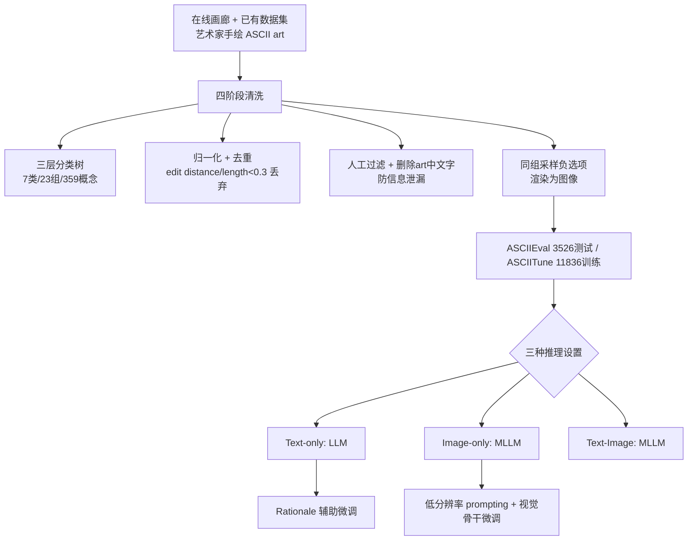

# ASCIIEval: Benchmarking Models' Visual Perception in Text Strings via ASCII Art

**会议**: ICLR 2026  
**OpenReview**: [https://openreview.net/forum?id=qg7zOTPtg6](https://openreview.net/forum?id=qg7zOTPtg6)  
**代码**: [https://github.com/JiaQiSJTU/VisionInText](https://github.com/JiaQiSJTU/VisionInText)  
**领域**: 多模态评测 / 视觉感知基准  
**关键词**: ASCII art, 视觉感知, LLM/MLLM 评测, 跨模态对齐, OCR 权衡  

## 一句话总结
本文以人类艺术家手绘的 ASCII art 为载体，构建了一个内容在文本与图像两种模态下完全等价的识别基准 ASCIIEval，系统性地揭示了 LLM 能从纯字符串"看出"视觉语义、开源 MLLM 在 OCR 与整体视觉感知之间存在权衡、且当前模型无法从"文本+图像"双模态输入中获益等多项诊断性发现。

## 研究背景与动机
**领域现状**：当下对 OCR（从图像中读出文字）已有充分研究，但反向问题——文本字符串里嵌入的视觉信息能否被模型感知——几乎无人系统考察。LLM 在海量文本上预训练后，被假设能通过换行符 `\n` 等捕捉人类书写中的二维结构，但现有评测（MMLU、FrontierMath 等）全是文本语义型，从未聚焦视觉感知能力；MLLM 基准（MMMU、MMStar）则只用常规自然图像，且无法保证混合输入时两种模态语义对齐。

**现有痛点**：已有的 ASCII 相关任务都很受限——BigBench 只有基础字符识别、其它工作要么是规则可生成的 box diagram / tone-based 图、要么只有 40 条生成样本，且大多用 Figlet 这类自动转换工具，模型容易过拟合到转换模式而非真正理解视觉内容；分类研究普遍只有 5 个类别，远不足以诊断 LLM/MLLM 的视觉表征能力。

**核心矛盾**：ASCII art 处在文本与图像的中间地带——它由固定宽度的可打印字符精心排布而成，**同一份内容既能以文本字符串、也能以渲染图像表达，二者语义完全一致**。这种"模态无关"特性使它成为衡量视觉感知能力的理想探针：对 LLM 是纯文本下的视觉感知考题，对 MLLM 则既考验对非常规图像的泛化、又是检验跨模态对齐的天然代理。但要把它做成严谨基准，必须解决数据稀缺、类别单一、词汇泄漏等一系列问题。

**本文目标**：构造一个覆盖丰富类别、文本/图像内容等价、可客观验证的识别基准，全面诊断 LLM 与 MLLM 在文本字符串中的视觉感知能力，并探索增强途径。

**核心 idea**：**(1) 任务化** — 把问题形式化为多选题识别任务（"这幅 ASCII art 画的是什么"），答案客观便于验证；**(2) 模态等价** — 每份 ASCII art 同时提供文本串与渲染图，构成 Text-only / Image-only / Text-Image 三种推理设置；**(3) 高质量人工策展** — 用三层分类树组织、人工过滤掉不可识别样本并删除 art 中的文字以杜绝信息泄漏。

## 方法详解

### 整体框架
ASCIIEval 不提模型，而是一套"数据构造 + 多模态诊断 + 针对性增强"的评测体系。先从在线画廊与已有数据集收集艺术家手绘 ASCII art，经四阶段清洗构造测试集 ASCIIEval（3,526 样本 / 359 概念）与训练集 ASCIITune（11,836 样本）；再让 50+ 个 LLM/MLLM 在三种模态设置下做多选识别，从模态、长度、跨基准相关性等多维度做诊断；最后针对 LLM 和 MLLM 各自的短板提出 rationale 辅助微调、低分辨率 prompting 等增强手段。

### 关键设计

**1. 模态无关的识别任务形式化：用多选题把"视觉感知"从推理中剥离出来。** 给定一份 ASCII art，其原始文本表示记为 $x_{text}$、对应渲染图像记为 $x_{img}$，模型需从候选概念集合 $C=\{c_1,\dots,c_k\}$ 中选出正确者。三种设置分别对应只吃文本的 LLM $\hat{y}_{text}=\mathrm{LLM}(x_{text},C)$、只吃图像的 MLLM $\hat{y}_{img}=\mathrm{MLLM}(x_{img},C)$、以及同时吃两者的 $\hat{y}_{multi}=\mathrm{MLLM}(x_{img},x_{text},C)$。多选题的好处是答案客观、可用精确匹配自动判分，避免开放式生成评测的主观性；而把同一内容同时给出文本与图像，正是后续能干净比较三种模态、并定义"oracle 上界"（任一模态答对即算对）的基础。

**2. 三层分类树 + 严格清洗：保证基准既有难度又无捷径可走。** 作者参照 iOS emoji 分类设计了"概念→组→类"的三层树（7 大类、23 组、359 概念，灵感来自 Animals、Smileys & People、Food & Drink 等），把最细粒度的"概念"作为识别标签，负选项从同组其它概念中随机采样——这让干扰项语义相近、识别更具挑战。清洗环节有三道关键操作：归一化（去掉每行行首冗余空格与串尾空白，但不破坏视觉语义）；去重（计算两份 ASCII 串的编辑距离，若除以已有串长度后小于 0.3 即判为冗余丢弃，同时丢弃超过 100 行的样本）；以及**人工删除 art 内部的文字**，强制模型靠视觉结构而非读字识别，从根本上堵死信息泄漏。人类上界测试（三次各抽 100 样本，标注员准确率 100%/98%/97%）证明任务对人很简单，凸显模型差距源于真实能力缺失。

**3. Rationale 辅助微调：用"分而治之"的推理链补 LLM 的二维感知短板。** 作者发现直接在 ASCIITune 上微调 LLM（让它由多选题直接生成答案）完全无法提升视觉感知能力。受 GPT-5 在图像输入下表现优异、以及思维链能激发推理的启发，他们改用 GPT-5（同时给 $x_{text}$ 与 $x_{img}$）合成富含局部 ASCII 特征解读的推理过程，验证后保留 6,309 条；微调时模型输入原始 $x_{text}$，目标输出是"推理过程 + 标准答案 $y$"的拼接。在 Qwen3-8B 上，零样本思考和普通微调分别只有 27.21%、26.23%，而 rationale 辅助微调把准确率从 28.28% 提升到 35.66%（相对增益 26.10%），跃居榜单第五。作者诚实指出这并非真正增强了 LLM 能力——其本质是 rationale 把复杂 art 拆解成一系列带描述的局部子串，让模型在推理时重组训练中记忆的碎片；真正瓶颈在于 tokenization 天然不适合保留二维空间信息（一条 dog 会被切成 13 个 token，相邻字符被任意拼接，破坏了垂直方向的连贯性）。

**4. 低分辨率 prompting：反直觉地"模糊"图像，逼 MLLM 看整体而非读字符。** 针对开源 MLLM"OCR 太强反而看不见整体"的诊断，作者提出测试时策略：故意降低输入分辨率以遮蔽单个字符细节，迫使模型感知全局视觉线索。在 Qwen2.5-VL-7B 上把最小像素设为 1、最大像素在 {16,32,64,128} 间变化，结果呈清晰反相关——最低分辨率 (1,16) 反而拿到最高的 52.32%，比默认设置高出 17.49%，直接挑战了"分辨率越高越好"的常识。配套的监督微调实验进一步表明，**微调视觉骨干是性能提升的关键因素**：仅对视觉骨干做 LoRA 即可达 75.48%，几乎追平全参微调的 75.83%，而只调文本骨干几乎无效（35.99%）。

## 实验关键数据

### 主实验表格
LLM（Text-only）与 MLLM（Image-only）的 Macro-Accuracy（%）头部对比，人类上界为 98.33%，随机基线 25%：

| 模态 | 领先专有模型 | 准确率 | 领先开源模型 | 准确率 | 专有-开源差距 |
|------|------|------|------|------|------|
| Text-only (LLM) | GPT-5 | 55.90 | DeepSeek-V3 | 35.94 | 19.96% |
| Image-only (MLLM) | GPT-5 | 87.81 | CogVLM2-Llama3-19B | 67.80 | 20.01% |

数据集规模：ASCIIEval 3,526 样本 / 359 概念 / 23 组 / 7 类，平均每概念 9.82 件、行数 1–100；ASCIITune 11,836 样本 / 2,307 概念（更多样但质量略低）。

### 消融实验表格
Qwen2.5-VL-7B 在不同增强策略下的 Macro-Accuracy（%）：

| 策略 | 设置 | 准确率 |
|------|------|------|
| 低分辨率 prompting | default | 34.83 |
| | (1, 16) | **52.32** |
| | (1, 128) | 38.81 |
| 监督微调 | zero-shot | 34.83 |
| | 全参微调 | **75.83** |
| | LoRA(仅视觉骨干) | 75.48 |
| | LoRA(仅文本骨干) | 35.99 |

LLM 微调（Qwen3-8B）：零样本思考 27.21% / 普通微调 26.23% / **rationale 辅助微调 35.66%**（相对 +26.10%）。

### 关键发现
- **LLM 确能从纯文本"看出"视觉语义**：所有模型超过 25% 随机基线，且与 TableEval、SGP-Bench 强正相关（Pearson 0.78 / 0.85），说明这是一种跨任务共享的底层能力，但 ASCIIEval 把它从复杂推理中干净隔离出来。
- **开源 MLLM 出现"代际倒退"**：新一代反而不如前代（如 Qwen-VL 同参数下从 52.32% 跌到 34.83%），根因是 ASCIIEval 与 OCRBench/TextVQA 呈**强负相关**——过度强化 OCR 会损害整体视觉感知，模型只"读字"不"看图"。
- **缩放律仅在单系列内成立**：Gemma-3-27B 反超百亿级别的更大模型，说明轻量模型也能有强视觉感知。
- **双模态不增反降**：性能层级始终是 Image-only > Text-Image > Text-only，加入文本最多让性能下降 12.23%，揭示当前 MLLM 无法动态融合一致的跨模态信号，反而互相干扰。
- **长度敏感且随模态而异**：text-only 擅长短 art（局部密集特征如 `()'`;` 即可点题），image-only 擅长长 art（更接近真实图像/海报）。

## 亮点与洞察
- **"模态无关"这一选材洞察是全文最妙之处**：ASCII art 让同一份内容在文本与图像下严格等价，从而第一次能够干净地横向比较 LLM 与 MLLM、并定义 oracle 上界来量化"双模态本应带来多少增益"。
- **诊断性极强且常常反直觉**：开源 MLLM 的代际倒退、OCR 与整体感知的负相关、低分辨率反而更好、双模态不增反降——每一条都是对"更大/更高清/更多模态一定更好"的有力反例。
- **对 LLM 增强保持诚实**：作者明确承认 rationale 微调只是"分而治之"地重组记忆碎片，并把真正瓶颈定位到 tokenization 破坏二维结构，而非夸大方法贡献。
- **安全意涵**：用 ASCII art 表示"bomb"等敏感词可绕过安全防线已成为对抗攻击新漏洞，理解模型的视觉感知能力有助于主动防御。

## 局限与展望
- **增强手段均为 post-hoc**：rationale 微调、低分辨率 prompting、视觉骨干微调都只是事后补丁，未从根本上让模型内在地平衡"细粒度文字识别"与"整体视觉感知"。
- **LLM 的根本瓶颈未解**：tokenization 天然破坏二维空间连贯性，作者把"探索替代输入表示"列为关键未来方向但本文未实现。
- **跨模态融合机制缺失**：双模态干扰暴露了 MLLM 缺乏动态融合架构，需要研究模态冲突的内部机制并设计能动态融合的架构。
- **数据存在类别不平衡**：每概念样本数从 1 到 170 不等（平均 9.82），ASCIITune 虽更大但质量较低。

## 相关工作与启发
本文延续了把非常规结构作为视觉/空间探针的思路（box diagram 识别、ASCII art 改进空间推理、ASCII 越狱攻击、tone-based ASCII 做 bot 检测），但与它们的根本区别在于聚焦**人类艺术家手绘、抽象且富含视觉信息**的 art，而非规则可生成或图像可转换的版本，从而避免模型过拟合转换模式。对评测基准设计的启发是：**好的诊断基准应当隔离单一能力**——ASCIIEval 通过删除 art 内文字、模态内容等价、客观多选等设计，把"视觉感知"从推理、知识等混杂因素中剥离出来。对模型研究者的启发则是：OCR 与整体视觉感知可能存在此消彼长，盲目堆叠细粒度文字识别能力可能损害模型对涌现视觉信号的整体把握。

## 评分
- **新颖性**: ⭐⭐⭐⭐⭐ 以 ASCII art 的"模态无关"特性为支点构造文本/图像内容等价的视觉感知基准，视角独到，所揭示的 OCR-视觉权衡、双模态干扰等现象具有原创诊断价值。
- **实验充分度**: ⭐⭐⭐⭐⭐ 覆盖 50+ 个 2023–2025 年 LLM/MLLM，三种模态、长度分桶、跨基准相关性、人类上界、多种增强消融一应俱全，论证扎实。
- **写作质量**: ⭐⭐⭐⭐ 结构清晰、发现凝练，对自身方法局限保持诚实；个别图表（leaderboard 以 OCR 形式嵌入正文）在缓存中可读性一般，但论文本身组织得当。
- **价值**: ⭐⭐⭐⭐⭐ 填补了"文本中视觉信息感知"这一长期被忽视的评测空白，对多模态对齐、安全防御、轻量模型设计均有现实意义，基准与训练集开源便于社区跟进。

<!-- RELATED:START -->

## 相关论文

- [\[ICLR 2026\] ViPER: Empowering the Self-Evolution of Visual Perception Abilities in Vision-Language Models](viper_empowering_the_self-evolution_of_visual_perception_abilities_in_vision-lan.md)
- [\[ICLR 2026\] IndicVisionBench: Benchmarking Cultural and Multilingual Understanding in VLMs](indicvisionbench_benchmarking_cultural_and_multilingual_understanding_in_vlms.md)
- [\[CVPR 2026\] DEVA: Fine-tuning Multimodal Large Language Models for Visual Perception Tasks](../../CVPR2026/multimodal_vlm/deva_fine-tuning_multimodal_large_language_models_for_visual_perception_tasks.md)
- [\[ICLR 2026\] Omni-Captioner: Data Pipeline, Models, and Benchmark for Omni Detailed Perception](omni-captioner_data_pipeline_models_and_benchmark_for_omni_detailed_perception.md)
- [\[ICLR 2026\] Multimodal Aligned Semantic Knowledge for Unpaired Image-text Matching](multimodal_aligned_semantic_knowledge_for_unpaired_image-text_matching.md)

<!-- RELATED:END -->
