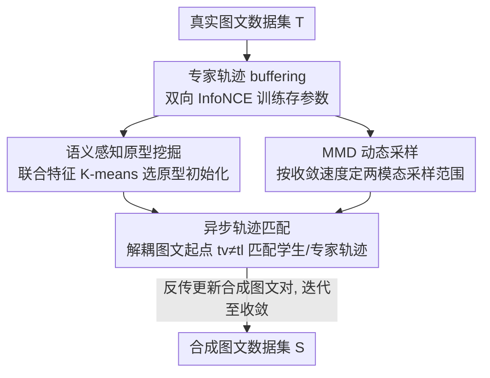

# Asynchronous Matching with Dynamic Sampling for Multimodal Dataset Distillation

**会议**: ICLR2026  
**OpenReview**: [https://openreview.net/forum?id=7SgSMKM2KF](https://openreview.net/forum?id=7SgSMKM2KF)  
**代码**: 待确认  
**领域**: 多模态VLM / 数据集蒸馏  
**关键词**: 多模态数据集蒸馏, 轨迹匹配, 异步采样, 原型挖掘, 跨模态检索

## 一句话总结
针对图文数据集蒸馏中"图像和文本网络优化节奏不同步"的问题，本文提出 AMD 框架：解耦图、文专家轨迹的采样起点做**异步轨迹匹配**，用 MMD 衡量收敛速度差异来**动态确定两模态各自的采样范围**，并用**语义原型挖掘**替代随机初始化，在 Flickr30k / COCO 上以几乎零额外开销显著刷新蒸馏检索性能（Flickr30k 200 对设置下 IR@1/@5/@10 提升 4.5%/9.6%/10.9%）。

## 研究背景与动机

**领域现状**：数据集蒸馏（Dataset Distillation, DD）的目标是把一个大数据集压缩成极少量合成样本，使得在合成集上训练的模型能逼近在原集上训练的效果，从而省存储、省算力、加速实验。其中轨迹匹配（MTT）是主流路线：先在真实数据上训练若干轮，周期性存下"专家轨迹"（不同训练步的网络参数），再优化合成数据，使在合成数据上走出来的"学生轨迹"去对齐专家轨迹的对应片段。

**现有痛点**：绝大多数 DD 工作只针对单模态（图像分类、文本分类）。随着图文对和 VLM 的爆发，多模态数据集蒸馏（MDD）成为刚需，但它有两个单模态范式没有的麻烦：（i）要从**异构模态**里同时蒸馏联合知识，图、文特征空间本就不对齐，训练时两个模态的优化动态也不同步；（ii）图文数据**没有离散类别**做引导，语义空间又大又连续，随机初始化很难覆盖原始分布，还容易选到描述模糊、图像质量差的"坏起点"。

**核心矛盾**：已有 MDD 方法（MTT-VL、LoRS）默认把图像轨迹和文本轨迹**同步采样**——在同一个训练步 $t_v=t_l$ 处取专家参数来匹配。但这是从单模态 VLM 训练里照搬过来的假设。本文的关键质疑是：图像编码器（如 NFNet）和文本编码器（如冻结 BERT + 线性层）架构差异巨大，参数更新动态根本不同步——文本网络初期剧烈波动后很快收敛，图像网络则全程保持高更新强度；合成图像（$3\times224\times224$ 像素空间）和合成文本（768 维嵌入空间）的优化空间拓扑性质也完全不同。强行同步，等于把两个节奏不一致的过程绑死，反而拖累合成数据质量。

**本文目标**：让蒸馏过程贴合两个模态各自真实的优化节奏，同时解决无类别引导下初始化覆盖不足的问题。

**核心 idea**：把图、文轨迹的采样起点**解耦**（异步匹配），用数据驱动的方式（MMD 比值）自动决定两个模态各自该采样到哪个阶段，再用聚类原型替代随机初始化提升覆盖度。

## 方法详解

### 整体框架

AMD（Asynchronous Matching with Dynamic sampling）的输入是大规模真实图文数据集 $\mathcal{T}=\{(x_i,y_i)\}$，输出是预算受限的合成图文数据集 $\mathcal{S}=\{(\tilde{x}_j,\tilde{y}_j)\}$（$M\ll N$）。整条管线沿用 MTT 的"buffering + distilling"骨架，但在三处做了改造。

**第一步 buffering（脚手架）**：用双向 InfoNCE 对比损失在真实数据上训练图像编码器 $\theta_V$ 和文本编码器 $\theta_L$，重复 20 次、每次 10 epoch，周期性存参数得到 20 条专家轨迹 $\{\theta_V^{(0)},\dots,\theta_V^{(r)}\}$ 和 $\{\theta_L^{(0)},\dots,\theta_L^{(r)}\}$。

**第二步初始化**：不再随机选起点，而是用**语义感知原型挖掘（SPM）**在图文联合特征空间做 K-means 聚类，挑出 $B$ 个代表性原型来初始化 $B$ 个合成样本。

**第三步 distilling**：进入**异步轨迹匹配**——图、文专家轨迹的起点 $(t_v,t_l)$ 各自独立选取，不再要求 $t_v=t_l$；而这两个起点能采样的范围 $(R_V,R_L)$ 由**MMD 动态采样**根据两模态收敛速度差异自动决定。然后用合成数据走 $N$ 步学生轨迹，去匹配走了 $M$ 步的专家轨迹，最小化归一化 $\ell_2$ 匹配损失，反传梯度更新合成图文对，迭代至收敛。

### 关键设计

**1. 语义感知原型挖掘（SPM）：用聚类原型替代随机初始化，补上"没有类别引导"的缺口**

图文数据没有离散类别，随机初始化常常扎堆在少数相似语义上（如一堆"狗在草地奔跑"），导致合成集覆盖窄、冗余高。SPM 的做法是把初始化变成一次"在语义空间里有意识地铺点"：先用训练好的编码器抽出每对样本的视觉特征 $v_i=\theta_V(x_i)$ 和文本特征 $l_i=\theta_L(y_i)$，拼成联合特征 $f_i=[v_i;l_i]$；然后在 $\{f_i\}$ 上做 K-means，**聚类数 $K$ 直接等于合成预算 $B$**，得到 $B$ 个簇心 $\{c_k\}$；对每个簇心，取联合特征离它最近的真实样本作为该簇的代表原型：

$$
\{c_k\}_{k=1}^{B}=\mathcal{C}(\{f_i\},K=B),\qquad (x_k^*,y_k^*)=\arg\min_{x_i,y_i}\|f_i-c_k\|_2.
$$

这 $B$ 个原型张成的初始合成集天然铺满不同语义簇（足球、越野摩托、滑雪…），直接缓解了随机初始化的语义冗余，给后续蒸馏一个高质量、高多样性的起点。t-SNE 可视化显示随机原型挤在少数语义、SPM 原型则均匀覆盖语义流形。

**2. 异步轨迹匹配：解耦图、文专家轨迹的采样起点，让匹配贴合真实优化节奏**

这是全文核心。常规方法要求图、文专家参数取自同一训练步（$t_v=t_l$），但作者的实证观察（专家轨迹中后期明显解耦、文本网络快收敛而图像网络长期高强度更新、蒸馏阶段合成文本比合成图像优化快得多）说明这种刚性同步是次优的。AMD 允许 $t_v$、$t_l$ **独立选取**，从而组合出更丰富的跨模态专家参数对。专家轨迹和学生轨迹分别由真实数据 $\mathcal{T}$ 和合成数据 $\mathcal{S}$ 上的对比训练生成；匹配损失把"学生走 $N$ 步后的参数"和"专家从 $t_v$/$t_l$ 走 $M$ 步后的参数"做归一化 $\ell_2$ 距离对齐：

$$
\mathcal{L}_{AMD}=\frac{\|\tilde{\theta}_V^{(t_v+N)}-\theta_V^{(t_v+M)}\|_2}{\|\theta_V^{(t_v)}-\theta_V^{(t_v+M)}\|_2}+\frac{\|\tilde{\theta}_L^{(t_l+N)}-\theta_L^{(t_l+M)}\|_2}{\|\theta_L^{(t_l)}-\theta_L^{(t_l+M)}\|_2},\quad t_v\in[0,R_V],\ t_l\in[0,R_L].
$$

解耦之所以有效，是因为它把"文本可以在其收敛得最好的阶段被稳定匹配"和"图像可以摆脱阶段约束、沿更有信息量的梯度优化"两件事同时放开了。消融里单加 AMD 就把 IR@1 从 8.6% 拉到 12.1%，是涨幅最大的单一组件。

**3. MMD 动态采样：用收敛速度差异自动决定两模态各自的采样范围，免调参**

解耦之后还有个问题：$t_v$、$t_l$ 各自该采样到哪一段？如果让文本也采到很靠后的阶段，就采到了"早已收敛、几乎不变"的冗余参数。AMD 用最大均值差异（MMD）来量化每个模态相邻 epoch 的参数变化幅度——在线性核下 MMD 退化为相邻 epoch 平均参数向量的平方欧氏距离：

$$
\text{MMD}_{V,t}=\Big\|\tfrac{1}{n_V}\sum_i\theta_{V,i}^{(t-1)}-\tfrac{1}{n_V}\sum_i\theta_{V,i}^{(t)}\Big\|_2,
$$

文本侧 $\text{MMD}_{L,t}$ 同理。再取整条轨迹上比值的中位数 $T_{\text{median}}=\text{Median}\big(\text{MMD}_{V,t}/(\text{MMD}_{L,t}+\epsilon)\big)$ 作为分界：比值一旦超过中位数，说明文本相对图像已基本稳定，于是**在交叉点前截断文本采样范围 $R_L$，而让图像采样范围 $R_V$ 延伸到交叉点之后**：

$$
R_V=\min\{t\mid \tfrac{\text{MMD}_{V,t}}{\text{MMD}_{L,t}+\epsilon}>T_{\text{median}}\},\quad R_L=\max\{t\mid \tfrac{\text{MMD}_{V,t}}{\text{MMD}_{L,t}+\epsilon}\le T_{\text{median}}\}.
$$

这种非对称范围让采样自动对齐各模态的收敛速度，既减少跨模态异步性，又**不引入额外超参数**，提升了 AMD 的稳定性和泛化性。

### 损失函数 / 训练策略
蒸馏目标即上面的异步匹配损失 $\mathcal{L}_{AMD}$，对合成图文对 $(\tilde{x},\tilde{y})$ 用学习率 $\eta_S$ 做 $(\tilde{x},\tilde{y})\leftarrow(\tilde{x},\tilde{y})-\eta_S\nabla\mathcal{L}_{AMD}$ 迭代至收敛。专家 buffering 用双向 InfoNCE。实现上沿用 LoRS 的设定：NFNet（ImageNet 预训练）做图像编码器，BERT（冻结，仅训附加线性层）做文本编码器；借 LoRS 的 TESLA 技术单卡可跑。合成数据用 SGD（momentum 0.5）优化；buffer 阶段训 10 epoch、重复 20 次得 20 条专家轨迹。结果为 3 个合成集 × 每个重训 5 次共 15 次评估的均值±标准差。

## 实验关键数据

### 主实验

数据集为 Flickr30k（31,783 图）与 COCO（123,287 图），评估跨模态检索 Recall@K（I2T 记为 IR@K，T2I 记为 TR@K）。下表为 Flickr30k 200 对（实际 199 对）设置下 I2T 方向主结果：

| 方法 | IR@1 | IR@5 | IR@10 | 说明 |
|------|------|------|-------|------|
| Random（coreset） | 1.1 | 4.8 | 9.2 | 随机选样本 |
| MTT-VL | 4.6 | 16.0 | 25.5 | 首个多模态轨迹匹配 |
| LoRS | 8.6 | 25.3 | 36.6 | 之前 SOTA |
| **AMD（本文）** | **13.1** | **34.9** | **47.5** | — |
| 提升 vs LoRS | +4.5 | +9.6 | +10.9 | — |

COCO 比 Flickr30k 大 3.9×、语义更复杂，整体分数偏低，但 AMD 仍稳定领先（200 对 IR@1/@5/@10 较 LoRS +1.4/+4.1/+5.9）。两个有趣现象：（1）随蒸馏预算（图文对数）增大，异步轨迹的增益更明显（Flickr30k IR@1 在 99/199/499 对上分别超 LoRS 2.1/4.5/5.8），说明同步策略在大规模数据上会成为瓶颈；（2）I2T 方向提升尤其大，印证了强行匹配不平衡图文专家轨迹会给合成数据带来优化困难。

### 消融实验（Flickr30k 200 对）

| Baseline | AMD | SPM | IR@1 | IR@5 | IR@10 |
|----------|-----|-----|------|------|-------|
| ✓ | | | 8.6 | 25.3 | 36.6 |
| ✓ | ✓ | | 12.1 | 33.9 | 46.7 |
| ✓ | | ✓ | 9.1 | 26.4 | 38.5 |
| ✓ | ✓ | ✓ | **13.1** | **34.9** | **47.5** |

### 关键发现
- **异步匹配（AMD）是主力**：单加 AMD 把 IR@1 从 8.6% 提到 12.1%（+3.5），远大于单加 SPM 的 +0.5；说明显式建模、利用跨模态异步动态才是性能跃升的核心。
- **两组件互补**：AMD + SPM 联合达到最优（IR@1 13.1%），SPM 的高质量初始化与 AMD 的优化策略叠加增益。
- **跨架构泛化**：用 NFNet+BERT 蒸馏出的数据迁移到 ResNet+BERT、RegNet+BERT 评估时，AMD 仍稳超 LoRS（如 499 对 ResNet IR@1 4.1 vs 3.3）。
- **性能上界高**：换 CLIP 编码器，AMD 仅用 10% 合成子集就拿到 47.9 IR@1，恢复了全量上界（49.8）的 96% 以上。

## 亮点与洞察
- **"质疑同步假设"这个切入点非常扎实**：作者没有直接堆模块，而是先用专家轨迹解耦曲线、参数更新幅度、蒸馏 loss 曲线三组观察，实证证明图、文优化天然异步，再据此设计异步匹配——动机和方法之间是因果闭环，而非凑出来的 trick。
- **MMD 动态采样把"该采到哪"变成数据驱动且零超参**：用相邻 epoch 参数变化的比值中位数作分界、非对称地截断文本/延伸图像采样，避免了手调范围，这个"用收敛速度差自动设范围"的思路可迁移到任何多教师/多轨迹匹配场景。
- **几乎零额外开销**：两个改造（解耦采样起点 + 聚类初始化）都不增加训练时计算量，却显著提升性能，工程上很划算。
- **SPM 的"K=B"设定干净利落**：聚类数直接等于合成预算，让每个合成样本对应一个语义簇，天然保证覆盖度——这种把"预算"和"聚类粒度"对齐的做法可复用到其他无类别蒸馏任务。

## 局限与展望
- **仅在检索任务、两个数据集上验证**：评测局限于 Flickr30k / COCO 的跨模态检索（IR/TR），未涉及 VQA、caption 生成等更复杂的下游 VLM 任务，泛化性还需更多证据。
- **依赖 MTT/LoRS 骨架与冻结 BERT**：方法建立在轨迹匹配范式上，文本编码器冻结、仅训线性层，这一受限设定下观察到的"文本快收敛"是否在端到端可训文本编码器、或更大 VLM 上同样成立，有待验证。
- **MMD 用线性核退化为欧氏距离**：动态采样的收敛度量较朴素，非线性核或更细粒度的逐层动态可能给出更准的采样边界。
- **聚类成本随数据规模增长**：SPM 需在全量联合特征上做 K-means，超大数据集上的可扩展性与近似策略未讨论。

## 相关工作与启发
- **vs MTT-VL**：MTT-VL 首次把训练轨迹匹配搬到多模态，但沿用**同步**采样（$t_v=t_l$）；本文指出该假设忽视了跨模态异步动态，解耦起点后大幅领先。
- **vs LoRS**：LoRS 在 MTT-VL 上加强相似度挖掘并引入 TESLA 降显存，是之前 SOTA；AMD 直接复用其代码库做 Baseline，在其之上叠加异步匹配 + 动态采样 + 原型初始化，全指标超越——说明性能增益来自轨迹采样范式本身的改造，而非显存技巧。
- **vs 传统单模态 DD（梯度匹配 / 分布匹配）**：这类方法依赖类内压缩，需要离散类别引导；图文数据无类别，本文用 SPM 的语义聚类原型填补了这一引导缺失。

## 评分
- 新颖性: ⭐⭐⭐⭐ 把"同步轨迹匹配"这一被默认接受的假设问出问题并实证推翻，异步匹配 + MMD 动态采样组合新颖。
- 实验充分度: ⭐⭐⭐⭐ 主结果、消融、跨架构、上界、可视化齐全，但任务面偏窄（仅检索两数据集）。
- 写作质量: ⭐⭐⭐⭐ 观察→结论→方法的逻辑链清晰，公式与图示配套，易读。
- 价值: ⭐⭐⭐⭐ 几乎零开销的即插即用改造，对多模态数据集蒸馏有直接落地价值。

<!-- RELATED:START -->

## 相关论文

- [\[CVPR 2026\] Multimodal Distribution Matching for Vision-Language Dataset Distillation](../../CVPR2026/multimodal_vlm/multimodal_distribution_matching_for_vision-language_dataset_distillation.md)
- [\[ICLR 2026\] Multimodal Dataset Distillation via Phased Teacher Models](multimodal_dataset_distillation_via_phased_teacher_models.md)
- [\[ICLR 2026\] Multimodal Dataset Distillation Made Simple by Prototype-Guided Data Synthesis](multimodal_dataset_distillation_made_simple_by_prototype-guided_data_synthesis.md)
- [\[ICLR 2026\] NExT-OMNI: Towards Any-to-Any Omnimodal Foundation Models with Discrete Flow Matching](next-omni_towards_any-to-any_omnimodal_foundation_models_with_discrete_flow_matc.md)
- [\[ICLR 2026\] Importance Sampling for Multi-Negative Multimodal Direct Preference Optimization](importance_sampling_for_multi-negative_multimodal_direct_preference_optimization.md)

<!-- RELATED:END -->
