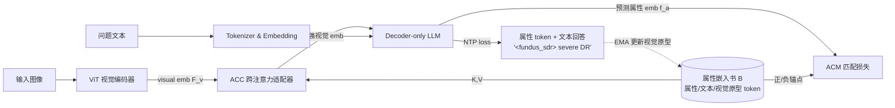

# AttTok: Marrying Attribute Tokens with Generative Pre-trained Vision-Language Models towards Medical Image Understanding

**会议**: ICLR 2026  
**OpenReview**: [https://openreview.net/forum?id=UjSoF5CM09](https://openreview.net/forum?id=UjSoF5CM09)  
**代码**: 待确认  
**领域**: 多模态大模型 / 医学影像理解  
**关键词**: 医学 GPTv、属性 token、判别式表征、跨模态对齐、指令微调  

## 一句话总结
针对医学多模态大模型把"轻度/重度 DR"等临床属性编码成几乎相同文本 token 而失去判别力的痛点，本文提出**属性 token（AttTok）**——给每个临床概念分配一个专属特殊 token，并配套构建多模态嵌入书、跨注意力适配器（ACC）与属性匹配损失（ACM），在生成式范式中显式注入判别式医学知识，在 5 个分类基准和 3 个 VQA 基准上稳定涨点。

## 研究背景与动机
- **领域现状**：GPT-4o、Qwen2.5-VL 等生成式预训练视觉语言模型（GPTv）在通用多模态理解上表现出色，催生了 LLaVA-Med、HealthGPT、Lingshu 等一批医学 GPTv 模型，通过指令微调把医学属性（疾病名、严重程度）当作文本短语写进训练数据，用 next-token prediction 学习生成。
- **现有痛点**：这种"把属性当普通词组"的生成式范式是一把双刃剑——(1) 语义上截然不同的临床概念（如 mild DR 与 severe DR）被编码成几乎相同的文本序列，token 空间里疾病嵌入严重混叠，缺乏判别力；(2) 由于 GPTv 的因果信息流是单向的 vision→text，文本端羸弱的监督几乎无法回传到视觉编码器，导致视觉特征纠缠、视觉-语言嵌入错位。
- **核心矛盾**：生成式范式带来了表达灵活性，却以牺牲 token 的判别能力为代价；而精确的医学诊断恰恰最需要在大量临床属性间做细粒度区分。
- **本文目标**：在不脱离生成式范式的前提下，把判别式的医学属性显式、精确地注入 GPTv 模型，同时增强视觉表征与跨模态对齐。
- **核心 idea**：**用专属 token 锚定属性**——为每个临床概念预定义一个特殊 token（如 `<|fundus_sdr|>` 表示"眼底影像 + 重度 DR"），并以这些属性 token 为锚点构建跨视觉/文本/属性三模态的嵌入书，再用跨注意力和对比式匹配损失把三方表征拉到统一判别空间。

## 方法详解

### 整体框架
AttTok 在标准 GPTv（ViT 视觉编码器 + 文本 tokenizer/embedding + decoder-only LLM）之上做三处扩展：先为每个临床属性新增一个特殊 token 并维护一本"嵌入书"（含属性 token、关键词文本 token、视觉原型 token 三种表征）；再用属性中心跨注意力（ACC）适配器把嵌入书的判别知识反向注入视觉编码器，打通 vision→text 的单向瓶颈；最后用属性中心匹配（ACM）损失以嵌入书为锚把三模态拉齐。训练时 ACM 损失与原始 NTP 损失联合优化。

### 关键设计
**1. 属性 token 与多模态嵌入书：用专属符号锚定临床概念。** 作者把每个临床概念定义成一个新的预定义 token，格式为 `<|modality_concept|>`（如 `<|fundus_sdr|>`），分类任务里属性直接取自类别标签，VQA 任务里则用开源 GPT 从问答对中抽取并归一化关键词再回填标注。嵌入层从原始词表 $\{e_i\}_{i=1}^{M}$ 扩展为 $\{e_i\}_{i=1}^{M}\cup\{a_i\}_{i=1}^{K}$，新增 $K$ 个可学习属性嵌入。每个属性 $k$ 配一本嵌入书 $B_k=\{a_k, e_{\text{ind}(k)}, \tilde f^v_k\}$，分别是属性 token 本身、关键词的文本 token、以及该属性所有视觉 token 平均得到的视觉原型。视觉原型用 EMA 平滑更新：$\tilde f^v_{k,\text{new}}=\mu\,\tilde f^v_{k,\text{old}}+(1-\mu)\frac{1}{N_v}\sum_{j\in N_v} f^v_j$（$\mu=0.99$），当前 batch 没有该属性样本时原型保持不变；属性 token 与文本 token 则作为可学习参数随模型联合优化。这样每个属性都成了一个横跨三模态的判别锚点。

**2. 属性中心跨注意力（ACC）适配器：给视觉编码器开一条"属性回流"旁路。** GPTv 的因果信息流只允许 vision→text，视觉编码器拿不到文本监督，而纯文本 token 又缺乏判别信号，导致视觉-文本对齐很差。ACC 把全部 $K$ 个属性的嵌入书（共 $3K$ 个 token）当作 key/value，把视觉嵌入 $F^v$ 当作 query 做跨注意力：$\text{Att}(F^v,B)=\text{Softmax}\!\left(\frac{(F^v W_Q)(B W_K)^\top}{\sqrt d}\right)(B W_V)$，再以残差方式注入 $\hat F^v=F^v+\gamma\,\text{Att}(F^v,B)W_O$（$\gamma=0.1$）。因为推理时拿不到 ground-truth 答案，所有属性都同时充当 key/value，让 ACC 自适应学到正确激活。增强后的 $\hat F^v$ 同时继承了文本属性和视觉原型的判别引导，相当于在标准 GPTv 单向瓶颈外搭了一条把属性知识直接送回 ViT 的 skip route，使视觉感知具备"属性感知"能力。

**3. 属性中心匹配（ACM）损失：以嵌入书为锚做跨模态对比对齐。** 跨注意力只是丰富了视觉 token，还需显式约束视觉表征、属性 token 与文本表征三者对齐。对一张图像，模型预测出对应属性 $k$ 的嵌入 $f^a$，其正样本来自本属性嵌入书 $B_k$ 的三种表征（属性嵌入、关键词文本嵌入、视觉原型），负样本则取自其他所有属性书 $B_j(j\neq k)$。相似度先经线性投影 $\theta(\cdot)$ 再算余弦：$s(a,b)=\frac{\theta(a)^\top\theta(b)}{\|\theta(a)\|\|\theta(b)\|}$，匹配损失为 InfoNCE 形式 $L_{\text{ACM}}(f^a)=-\log\frac{\sum_{p\in B_k}\exp(s(f^a,p)/\tau)}{\sum_{p\in B_k}\exp(s(f^a,p)/\tau)+\sum_{n\in B_j,j\neq k}\exp(s(f^a,n)/\tau)}$。它本质是把 $f^a$ 在所有属性锚点上做一次软分类，强制同属性的跨模态 token 靠拢、不同属性彼此分离。最终目标为 $L_{\text{NTP}}+\lambda L_{\text{ACM}}$：NTP 保证回答的生成保真，ACM 保证判别式属性表征，二者兼得。

## 实验关键数据

### 主实验表格
五种医学影像模态上的疾病诊断/分类（open-end / close-end 准确率，%）：

| 模型 | Derma open/close | Fundus | OCT | X-ray | Path | Avg open/close |
|------|------|------|------|------|------|------|
| CLIP（判别式） | – / 68.4 | – / 62.6 | – / 89.8 | – / 93.5 | – / 89.8 | – / 80.8 |
| Qwen2.5-VL-7B（指令微调） | 65.8 / 71.2 | 55.0 / 61.5 | 59.1 / 73.0 | 76.9 / 87.3 | 72.4 / 81.7 | 65.8 / 74.9 |
| **+ Ours** | **69.6 / 74.6** | **57.6 / 66.0** | **63.1 / 76.7** | **82.7 / 90.5** | **75.2 / 84.4** | **69.6 / 78.4** |
| Lingshu-7B（指令微调） | 66.3 / 72.8 | 56.3 / 63.7 | 60.8 / 74.7 | 78.9 / 89.1 | 73.5 / 84.3 | 67.2 / 76.9 |
| **+ Ours** | **71.2 / 75.5** | **61.4 / 69.1** | **63.8 / 79.7** | **85.3 / 92.1** | **77.5 / 88.0** | **71.8 / 80.9** |

医学 VQA（准确率，%）：

| 模型 | Rad-VQA | SLAKE | PathVQA | Avg |
|------|------|------|------|------|
| Qwen2.5VL-7B | 69.5 | 83.1 | 62.3 | 71.6 |
| **+ Ours** | **70.1** | **84.0** | **63.5** | **72.5** |
| Lingshu-7B | 70.9 | 84.6 | 64.1 | 73.2 |
| **+ Ours** | **71.4** | **85.8** | **64.7** | **74.0** |

### 消融实验表格
五模态上对两大组件做逐项消融（图 3 柱状图，趋势归纳）：

| 配置 | 效果趋势 |
|------|------|
| baseline | 仅指令微调，最低 |
| + ACC | 打通 vision→text 单向瓶颈，把属性信息注入 ViT，跨模态交互更丰富，稳定提升 |
| + ACM | 显式统一临床属性的多模态表征，进一步增强判别力 |
| + All | 两者叠加，在 Derma/Fundus/OCT/X-ray/Path 五模态上均取得最佳 |

### 关键发现
- **指令微调对精确医学诊断不可或缺**：零样本 GPTv（如 Qwen2.5-VL-7B 在 Derma close-end 仅 14.2%）几乎无法做精确诊断，凸显属性级监督的必要。
- **跨骨干一致涨点**：无论通用（Qwen2.5-VL）还是医学专用（Lingshu）GPTv，叠加 AttTok 后五模态准确率至少 +2%。
- **逼近甚至超越判别式模型**：在生成式框架内，AttTok 让 GPTv 在皮肤病、DR 分级、X-ray 正异常判别等任务上达到甚至超过 CLIP 类判别式模型。
- **强基座上仍有增益**：Lingshu 已在大规模医学数据上充分预训练，提升空间有限，但 AttTok 在 VQA 上仍带来 0.5%~1.2% 提升，说明属性锚定的判别信号是正交补充。

## 亮点与洞察
- **诊断重灾区的精准切入**：把"语义不同却文本几乎相同"这一医学属性编码顽疾点透，并给出可落地的 token 级解法，而非泛泛地堆数据或换骨干。
- **打通单向信息流**：ACC 用跨注意力旁路让判别式属性知识反向回流到视觉编码器，巧妙绕开 GPTv 因果范式对视觉监督的天然限制。
- **生成与判别兼得**：NTP + ACM 的联合目标让模型既保留自由生成回答的能力，又获得判别式表征，t-SNE 可视化显示属性 token 簇明显分离。
- **嵌入书的三模态锚点设计**：把属性 token、文本 token、视觉原型统一进一本书并以 EMA 维护视觉原型，是一个轻量却统一的跨模态对齐枢纽。

## 局限与展望
- **属性需预定义**：分类任务靠标签自然得到属性，但 VQA 任务的属性靠 GPT 抽关键词，定义较粗，作者也承认这限制了 VQA 上的增益幅度。
- **属性规模可扩展性**：ACC 把全部 $K$ 个属性的 $3K$ 个 token 都作 key/value，当临床属性体系庞大时跨注意力开销与负样本规模可能上升。
- **超参敏感性**：$\gamma$、$\lambda$、$\tau$、EMA 动量 $\mu$ 等需手工设定，跨数据集的鲁棒性未充分讨论。
- **展望**：把属性 token 自动发现/层次化组织（疾病→亚型→严重程度的树状 token），并迁移到放射报告生成等更开放的医学生成任务，是自然延伸方向。

## 相关工作与启发
- **医学 GPTv**：LLaVA-Med、HealthGPT、Lingshu、HuatuoGPT-V 等沿用通用 GPTv 训练范式把属性当文本，AttTok 正是针对这一共性缺陷做改造。
- **判别式 VLM**：CLIP、SigLIP2、PubMedCLIP 提供了医学分类的判别式参照，本文证明生成式模型也能逼近其判别力。
- **特殊 token / soft prompt**：用专属 token 编码概念的思路与视觉生成里的概念 token、检索增强 token 一脉相承，启发是"把判别式结构以 token 形式注入生成式模型"是一条通用范式。

## 评分
- 新颖性: ⭐⭐⭐⭐ —— "属性 token + 多模态嵌入书 + 反向跨注意力"组合切中医学 GPTv 判别力痛点，概念清晰且角度新。
- 实验充分度: ⭐⭐⭐⭐ —— 覆盖 5 分类 + 3 VQA、通用与医学双骨干、含 CLIP 判别式参照与逐组件消融，较扎实；属性自动扩展性、超参鲁棒性可再补。
- 写作质量: ⭐⭐⭐⭐ —— 动机论证（双刃剑、单向信息流）层层递进，图 1/图 2 把问题与方案讲得直观。
- 价值: ⭐⭐⭐⭐ —— 为医学 GPTv 提供了"在生成式范式内补判别力"的可复用范式，对临床细粒度诊断有实际意义。

<!-- RELATED:START -->

## 相关论文

- [\[ICLR 2026\] Reading Images Like Texts: Sequential Image Understanding in Vision-Language Models](reading_images_like_texts_sequential_image_understanding_in_vision-language_mode.md)
- [\[AAAI 2026\] SafeR-CLIP: Mitigating NSFW Content in Vision-Language Models While Preserving Pre-Trained Knowledge](../../AAAI2026/multimodal_vlm/safer-clip_mitigating_nsfw_content_in_vision-language_models_while_preserving_pr.md)
- [\[ICLR 2026\] On Discriminative vs. Generative Classifiers: Rethinking MLLMs for Action Understanding](on_discriminative_vs_generative_classifiers_rethinking_mllms_for_action_understa.md)
- [\[CVPR 2025\] Skip Tuning: Pre-trained Vision-Language Models are Effective and Efficient Adapters Themselves](../../CVPR2025/multimodal_vlm/skip_tuning_pre-trained_vision-language_models_are_effective_and_efficient_adapt.md)
- [\[ICLR 2026\] Context Tokens are Anchors: Understanding the Repeat Curse in dMLLMs from an Information Flow Perspective](context_tokens_are_anchors_understanding_the_repeat_curse_in_dmllms_from_an_info.md)

<!-- RELATED:END -->
