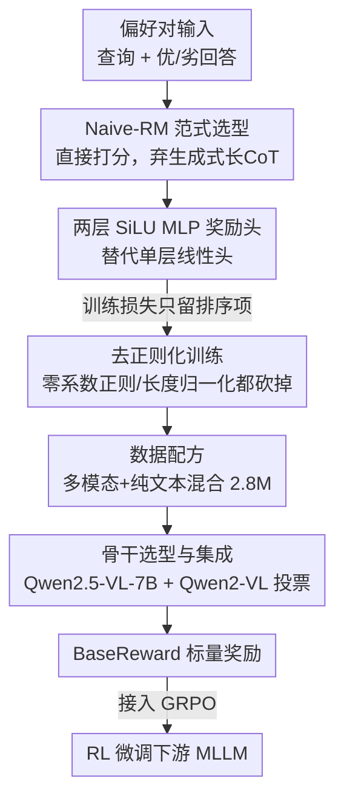

# BaseReward: A Strong Baseline for Multimodal Reward Model

**会议**: ICLR2026  
**OpenReview**: [https://openreview.net/forum?id=EuN5iszF0a](https://openreview.net/forum?id=EuN5iszF0a)  
**代码**: 待确认  
**领域**: 多模态VLM / 对齐RLHF  
**关键词**: 多模态奖励模型, MLLM 对齐, RLHF, 偏好数据配方, Naive-RM

## 一句话总结
这篇论文不发明新结构，而是把"怎么造一个 SOTA 多模态奖励模型（MRM）"拆成范式、奖励头、正则化、数据、骨干/规模、集成六个维度逐一做消融，得出一份明确的"食谱"，并据此搭出 BaseReward——基于 Qwen2.5-VL-7B + 两层 SiLU MLP 奖励头 + 精挑混合偏好数据的简洁强基线，在 MM-RLHF-Reward Bench、VL-Reward Bench 等主流榜上刷新 SOTA，且推理远快于生成式奖励模型。

## 研究背景与动机
**领域现状**：多模态大模型（MLLM）要和人类偏好对齐，核心抓手是奖励模型（RM）——给定一个查询和两个回答，RM 要给"更好的"打更高分，这个标量信号随后被 RLHF/GRPO 用来微调 MLLM。文本侧 RM 已有成熟范式，但多模态侧（MRM）各家做法五花八门：Seed-1.5-VL、Keye-VL 用生成式奖励，Mimo-VL 用文本/多模态双 RM，GLM-4.1V 按数据类别分域设计奖励策略。

**现有痛点**：业界缺一份系统的、能复现的"怎么造 MRM"指南。一堆关键问题没人系统回答过——不同奖励范式（直接打分 vs 先写评语再打分 vs 生成式）在性能、效率、泛化上怎么权衡？奖励头要不要更复杂？常见的正则化（零系数正则、长度归一化）到底有没有用？十几个偏好数据集哪些有益哪些有害？纯文本偏好数据能不能反哺多模态判断？骨干模型选谁、放多大才划算？

**核心矛盾**：研究者往往直觉地认为"生成式奖励 + 长思维链 + 更大模型 + 更多数据 + 加正则"就更强，但这些直觉缺乏对照实验支撑，且生成式范式带来沉重的推理开销，在 RL 阶段每步都要先吐一段 think 再判断，代价高昂。简洁的 Naive-RM 是不是真的更弱，没人认真验证过。

**本文目标**：把 MRM 开发管线的每个关键组件都做受控消融，给出一份"实证支撑的食谱"，然后用这份食谱造一个既快又强的基线。

**切入角度**：作者固定默认训练数据（R1-Reward 的约 20 万偏好对）和默认骨干（Qwen2.5-VL-7B）作为统一对照基座，逐维度单独变量做消融，再把各维度的最优选择拼起来扩到完整数据规模。

**核心 idea**：用"简洁的 Naive-RM + 优化的两层 SiLU 奖励头 + 不加正则 + 精挑的多模态/纯文本混合数据"这一套朴素配方，证明它比花哨的生成式长思维链奖励模型更强也更快——好的奖励模型不靠复杂结构，靠把每个组件的选择做对。

## 方法详解

### 整体框架
BaseReward 本身结构极简：一个预训练 MLLM 骨干 $\phi$，把原本的语言模型头 $h_l$ 换成一个奖励头 $l_r$，让模型对"查询 $x$ + 回答 $y$"输出一个标量奖励 $r(y|x)$。训练用人类成对偏好，优化经典 Bradley-Terry 排序损失，让偏好回答 $y_w$ 的分高于被拒回答 $y_l$：

$$\mathcal{L}_{\text{Reward}}(\theta) = \mathbb{E}_{x,y_w,y_l}\big[-\log \sigma\big(r(y_w|x) - r(y_l|x)\big)\big]$$

其中 $\sigma$ 是 sigmoid。论文真正的工作量不在这条公式，而在于通过一整套消融把"$\phi$ 选谁、$l_r$ 长什么样、损失里要不要加正则项、训练数据怎么配、要不要集成"这些选择全部钉死。整条 pipeline 是：偏好对输入 → Qwen2.5-VL-7B 骨干编码 → 两层 SiLU MLP 奖励头出标量分 → 在 280 万条精挑的多模态+纯文本混合偏好对上训练 → 再用一个 Qwen2-VL-7B 副本做投票集成 → 最终作为奖励信号接入 GRPO 强化学习闭环去微调下游 MLLM。

下面这张图把"食谱的几个决策点"按数据流自上而下串起来，每个贡献节点对应后文一个关键设计：

### 关键设计

**1. Naive-RM 范式选型：放弃花哨的生成式长思维链，回到直接打分**

奖励范式有三类：Naive-RM（线性头直接出分，如 IXC-2.5-Reward）、Critic-based RM（先让模型写一段评语再对评语打分，如 MM-RLHF）、Generative RM（把奖励重构成生成任务，直接吐 token 表示哪个更好，如 R1-Reward 输出 `<think>...</think><answer>1 or 2</answer>`、Seed-1.5-VL 直接吐"1"或"2"）。直觉上生成式带推理过程、可解释性强、更抗过拟合，似乎更优。论文在同一训练协议下对照后发现：生成式在 coding、safety/bias 维度的优势主要来自 MLLM 自身固有知识，而非范式本身——一旦给 Naive-RM 补上对应训练数据，它在 VQA、general、hallucination 等维度反而能打平甚至超过长 CoT 生成式。而 Critic-RM 严重依赖生成评语的质量，劣质评语会成为瓶颈、且难以规模化。加之 Naive-RM 推理快、在 RL 每一步的成本低，论文据此把 Naive-RM 钉为研究主线，后续所有消融都围绕它展开。这一步是整份食谱的地基：先证明"简单的不比复杂的差"，才有资格把后面的优化都押在简单范式上。

**2. 两层 SiLU MLP 奖励头：用刚好够的容量替代单层线性头**

Naive-RM 默认用单层线性奖励头，但作者发现把它换成多层 MLP 能显著提升判别力，关键变量是层数和激活函数。消融（Table 2）显示单层线性头结果最差；层数加到 2、激活用 SiLU 时最优（VL-Reward Bench Overall Acc 67.9、MM-RLHF Acc 92.9、Acc+ 80.4），而 Tanh、ReLU 等其他激活、或继续堆到 3/4/5 层都不再有增益甚至回落。直觉解释是：奖励打分需要一点非线性映射能力来刻画"好/坏"的复杂边界，单层线性不够；但层数过深又会在有限偏好数据上过拟合，2 层 + SiLU 恰好在容量和泛化间踩到甜点。这个结论很反"越深越好"的惯性，提醒做 RM 时奖励头不是越复杂越好。

**3. 去正则化训练：常见的两种正则反而掉点，全部砍掉**

RM 训练里常加两类正则：零系数正则（penalty 鼓励优/劣回答的奖励都向 0 居中，正则项是奖励平方和的均值）和长度归一化（用回答长度的对数去归一奖励，缓解 RM 偏好长回答的倾向）。论文把零系数正则权重 $\lambda$ 从 0 扫到 0.1，发现随 $\lambda$ 增大各项指标普遍下滑；单加长度归一化（$\lambda=0$ 的虚线）相比完全不加正则也没有任何提升。结论干脆利落：两种正则在这套设置下都只会掉点，默认配置一律不加。这条"负结果"很有价值——它把一个大家想当然要加的组件直接证伪，省掉了调 $\lambda$ 的功夫，也让训练更纯粹（损失里只剩排序项）。

**4. 数据配方与模态专精：精挑混合数据，且纯文本偏好数据能反哺多模态判断**

作者收集了十余个多模态与纯文本偏好数据集逐一单独训练对照，得出几条非直觉结论：并非所有数据都有益，MMIF、SHP 等几乎无益甚至有害，必须做数据筛选；不同数据各有所长，MMPR、RLAIF-V 大幅提升 hallucination 维度（VL-Reward 该项推过 90%），R1-Reward 尤其利于 reasoning；最反直觉的是——纯文本偏好数据（如 Ultra-Hard、Olmo-2）能显著提升多模态判断，因为文本数据里大量的 safety、math 内容补齐了 MRM 在这些维度的短板，使其在多模态 benchmark 上不输纯多模态数据。但作者也划清了边界（模态专精）：反过来，多模态数据并不能提升纯文本 RM 任务，且在同等文本数据量下，纯 LLM 骨干（Qwen2.5-8B/Qwen3-8B）做纯文本 RM 反而比 MLLM 更强。因此最优策略不是强行训一个全能 RM，而是训一个专门的纯文本 RM、再与多模态 RM 模块化组合，RL 时按输入是文本还是多模态动态选用——这与 Mimo-VL 的双 RM 思路一致。最终 BaseReward 用 Table 5 中未被标灰的七个数据集，合计 280 万偏好对。

**5. 骨干选型与集成：8B 以内够用，简单平均集成稳定加分**

骨干和规模的消融（Table 6）显示不同模型族各有模态偏向：Qwen-VL 系在多模态奖励榜更强（Qwen2.5-VL-7B 在 MM-RLHF 上 93.5，比 Intern-VL3-8B 的 83.7 高近 10%），Intern-VL 系在文本榜更强（Intern-VL3-8B 在 RewardBench 84.0 反超 Qwen2.5-VL-7B 的 75.8）。而单纯放大规模收益递减——Intern-VL3 在 2B 与 8B 间差距很小，10B 以内是性价比最优区间。在此基础上作者用不同骨干（Qwen2.5-VL-7B 与 Intern-VL3-8B）做集成，对比"按验证集加权"与"简单平均"，发现简单平均与复杂加权效果相当却零额外开销，且在多模态与文本榜上都能稳定加分。落地时 BaseReward 主模型用 Qwen2.5-VL-7B，并额外训一个 Qwen2-VL-7B 副本专门用于投票集成。

### 损失函数 / 训练策略
训练目标就是上面的成对排序损失，不加任何辅助损失。训练超参：学习率在 $\{1\text{e}{-5}, 3\text{e}{-6}, 1\text{e}{-6}, 3\text{e}{-7}\}$ 网格搜索后定为 $3\text{e}{-6}$，batch size 128，在 64 张 H100 上完成；训练数据为七个精选数据集合计 280 万偏好对。下游验证用 GRPO 在 Qwen2.5-VL-3B 上跑 RL，对比 rule-based（二值匹配）、BaseReward 打分、以及"精确匹配 + BaseReward"混合三种奖励方案。

## 实验关键数据

### 主实验
在 MM-RLHF-Reward Bench 上，BaseReward 全面超越开源与闭源对手，Acc+ 这一更严格指标（要求样本内所有回答对都排对）尤其拉开差距：

| 模型 | #Param | Acc | Acc+ |
|------|--------|------|------|
| Claude-3.7-Sonnet | - | 82.35 | 65.22 |
| IXC-2.5-Reward | 7B | 71.18 | 50.00 |
| MM-RLHF-Reward | 7B | 82.00 | 63.00 |
| R1-Reward | 7B | 80.59 | 54.35 |
| BaseReward (Qwen2-VL) | 7B | 90.59 | 78.26 |
| BaseReward (Qwen2.5-VL) | 7B | 91.76 | 80.43 |
| BaseReward (Ensemble) | 7B+7B | **92.94** | 80.43 |

论文报告：相比前 SOTA，MM-RLHF-Reward Bench 准确率提升约 11.9%，更严格的 Acc+ 比 Claude-3.7-Sonnet 提升 23.32%；VL-Reward Bench Overall Accuracy 提升约 14.2%。在 Multi-Modal Reward Bench 上取得次优，作者归因于训练集缺少 coding 相关偏好数据。

### 消融实验

| 维度 | 关键发现 | 说明 |
|------|---------|------|
| 奖励范式 | Naive-RM ≈ 或 > 长 CoT 生成式 | 生成式优势多来自 MLLM 固有知识，补数据后 Naive-RM 不输 |
| 奖励头 | 2 层 + SiLU 最优 | 单层线性最差；3/4/5 层及其他激活无增益 |
| 正则化 | 一律不加 | 零系数正则 $\lambda>0$、长度归一化都掉点 |
| 数据 | 纯文本反哺多模态 | 文本数据补齐 safety/math 维度；MMIF/SHP 无益 |
| 骨干/规模 | 8B 以内性价比最优 | Qwen-VL 强在多模态、Intern-VL 强在文本；放大收益递减 |
| 集成 | 简单平均即可 | 与验证集加权相当，零额外开销 |

### 关键发现
- 奖励头是单组件里最干净的增益：仅把单层线性换成 2 层 SiLU MLP，MM-RLHF Acc+ 从约 71 升到约 80。
- 纯文本数据反哺多模态是全文最反直觉的发现——文本偏好数据里的 safety/math 内容直接拉高了多模态 benchmark 对应维度。
- 范式选择决定了效率：BaseReward 推理远快于 R1-Reward/MM-RLHF（后者要先吐评语/思维链），在 RL 阶段优势放大。
- RL 落地中，"rule-based + BaseReward"混合奖励效果最好，规则负责客观题精度、BaseReward 负责复杂语义评价。

## 亮点与洞察
- **用一篇系统消融把"简单 RM 反而更强"钉死**：先证明 Naive-RM 不输生成式长 CoT，再把所有优化押在简单范式上——这套"先证地基再盖楼"的论证结构很有说服力，避免了直接给一个强结果却说不清各组件贡献。
- **负结果同样宝贵**：明确证伪了零系数正则和长度归一化两个"想当然要加"的组件，读者照搬时能直接省掉一轮调参。
- **跨模态数据迁移的可复用洞察**：纯文本偏好数据能补齐多模态 RM 的 safety/math 短板，但反向不成立、且纯文本任务上 LLM 骨干优于 MLLM——这条"模态专精"结论可直接迁移到任何要做统一 RM 的场景，指导"专模型 + 动态路由"而非"硬训全能模型"。
- **强基线的价值**：把奖励头、激活、数据、骨干、集成的最优选择全部公开成一份食谱，社区可低成本复现并在此之上做研究。

## 局限与展望
- **coding 维度短板**：训练集缺 coding 相关偏好数据，导致 Multi-Modal Reward Bench 只拿次优；作者也指出没有单一数据集能显著提升 coding，专项能力需专项数据。
- **结论绑定特定模型族/规模**：消融主要在 Qwen-VL / Intern-VL、8B 以内规模上得出，"2 层 SiLU 最优""放大收益递减"等结论是否在更大规模或其他骨干上成立有待验证。
- **食谱式而非方法创新**：本文价值在于系统实证与强基线，结构上没有新颖组件，部分结论（如文本反哺多模态）给了现象但机制层面的解释仍偏假说。
- **未深挖 ensemble 边界**：简单平均够用的结论基于两个骨干，更多/更异构骨干的集成行为未充分探讨。

## 相关工作与启发
- **vs R1-Reward（生成式长 CoT 奖励）**: R1-Reward 靠 `<think>` 推理过程提升可解释性与鲁棒性，但推理慢、对 prompt 与回答顺序敏感；BaseReward 用 Naive-RM 直接打分，在 MM-RLHF Acc+ 上 80.4 vs 54.4 大幅领先且推理快，证明长 CoT 并非 MRM 必需。
- **vs MM-RLHF-Reward（Critic-based）**: 后者先写评语再打分，质量受评语生成能力掣肘、难规模化；BaseReward 去掉评语步骤，省成本且更强。
- **vs IXC-2.5-Reward（同为 Naive-RM）**: 同属直接打分范式，但 BaseReward 通过奖励头（2 层 SiLU）、去正则、数据配方等系统优化，把 Naive-RM 的上限大幅推高（MM-RLHF Acc 91.8 vs 71.2）。
- **vs Mimo-VL（双 RM 路由）**: BaseReward 的"模态专精 + 专文本 RM 模块化组合"结论与 Mimo-VL 的文本/多模态双 RM 思路相互印证，并用对照实验给出了更明确的实证依据。

## 评分
- 新颖性: ⭐⭐⭐⭐ 无新结构，但系统性消融 + 多条反直觉结论（文本反哺多模态、正则有害、简单范式不输生成式）本身就是贡献。
- 实验充分度: ⭐⭐⭐⭐⭐ 六维度逐一受控消融 + 十余数据集对照 + 三大 benchmark + RL 落地验证，非常扎实。
- 写作质量: ⭐⭐⭐⭐ 食谱式叙事清晰，每节配 Key Insight 总结，易读；表格密集但组织良好。
- 价值: ⭐⭐⭐⭐⭐ 给社区一份可复现的 MRM 食谱 + 一个开源强基线，实用价值高。

<!-- RELATED:START -->

## 相关论文

- [\[ACL 2025\] InternLM-XComposer2.5-Reward: A Simple Yet Effective Multi-Modal Reward Model](../../ACL2025/multimodal_vlm/internlm-xcomposer25-reward_a_simple_yet_effective_multi-modal_reward_model.md)
- [\[ICLR 2026\] DeepEyesV2: Toward Agentic Multimodal Model](deepeyesv2_toward_agentic_multimodal_model.md)
- [\[NeurIPS 2025\] A Frustratingly Simple Yet Highly Effective Attack Baseline: Over 90% Success Rate Against the Strong Black-box Models of GPT-4.5/4o/o1](../../NeurIPS2025/multimodal_vlm/a_frustratingly_simple_yet_highly_effective_attack_baseline.md)
- [\[CVPR 2026\] Multimodal RewardBench 2: Evaluating Omni Reward Models for Interleaved Text and Image](../../CVPR2026/multimodal_vlm/multimodal_rewardbench_2_evaluating_omni_reward_models_for_interleaved_text_and_.md)
- [\[CVPR 2026\] WikiCLIP: An Efficient Contrastive Baseline for Open-domain Visual Entity Recognition](../../CVPR2026/multimodal_vlm/wikiclip_an_efficient_contrastive_baseline_for_open-domain_visual_entity_recogni.md)

<!-- RELATED:END -->
