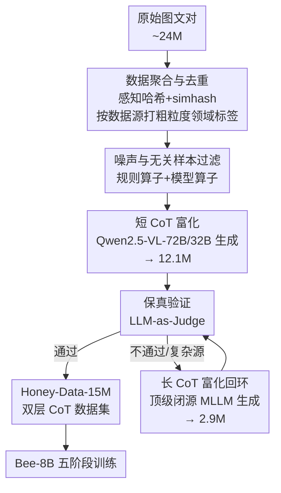

# Bee: A High-Quality Corpus and Full-Stack Suite to Unlock Advanced Fully Open MLLMs

**会议**: ICLR 2026  
**OpenReview**: [https://openreview.net/forum?id=IVluwK8q9q](https://openreview.net/forum?id=IVluwK8q9q)  
**代码**: https://open-bee.github.io (有)  
**领域**: 多模态VLM  
**关键词**: 全开源MLLM, SFT数据, Chain-of-Thought, 数据清洗管线, 数据质量

## 一句话总结
针对全开源多模态大模型卡在「SFT 数据质量差、缺复杂推理数据」的痛点，本文用一条自动化数据策展管线（HoneyPipe）把约 2400 万原始图文对清洗、富化成 1500 万条带双层 CoT 的高质量数据集 Honey-Data-15M，并在其上训出 8B 模型 Bee-8B，刷新全开源 MLLM 的 SOTA，多项推理基准上追平甚至反超半开源的 InternVL3.5-8B。

## 研究背景与动机
**领域现状**：当今强大的 MLLM 普遍依赖海量数据，但随着领域成熟，社区逐渐形成共识——在监督微调（SFT）阶段，**数据质量与数据数量同等重要**。MLLM 生态被切成三个梯队：闭源顶级模型（GPT-5、Gemini 2.5）、只放权重不放数据的半开源模型（Qwen2.5-VL、InternVL3.5），以及数据/代码/权重全公开的全开源模型。全开源梯队明显落后于前两者。

**现有痛点**：全开源社区的落后根源在数据。其一是**广泛的数据噪声**——现有开源 SFT 数据集既有内容层面的问题（事实错误、图文不匹配），也有结构/格式层面的瑕疵（文本过度重复、指令里混进错误标签、图像尺寸或长宽比异常）。这些噪声让模型在训练时学到虚假相关，系统性地损害事实性、推理力和指令跟随能力。其二是**复杂推理数据的缺失**——半开源/闭源模型靠长 Chain-of-Thought（CoT）处理复杂指令，而全开源社区既缺大规模高质量长 CoT 数据，也很难判断「哪些指令真的需要多步深推理」。

**核心矛盾**：问题不只出在原始数据本身，更出在**缺少透明、可复现的数据策展管线**。以往工作只发布最终静态数据集，而把清洗、过滤、富化的代码、prompt、逻辑当成黑盒。闭源团队却在不断迭代内部数据配方，这种「一次性发布 vs 持续迭代」的不对等，让全开源社区根本追不上。

**本文目标**：分解为三件事——（1）造一个去噪 + 推理富化的大规模高质量 SFT 数据集；（2）把造数据的方法本身（而非只是产物）开放给社区，可复现可适配；（3）用一个真实训练出来的模型验证数据质量。

**切入角度**：与其在数据「量」上和半开源拼，不如在「质」上取胜——用 MLLM 自身来自动化整条策展流程，作为昂贵人工标注的可扩展、经济的替代方案。

**核心 idea**：按指令复杂度**分层富化推理深度**（中等复杂度走短 CoT、最复杂的走长 CoT），并把这套清洗+富化流程沉淀成一条可复现的模块化管线 HoneyPipe，再用它产出的 Honey-Data-15M 训出 Bee-8B 来证明「死磕数据质量」就是全开源追平半开源的关键路径。

## 方法详解

### 整体框架
本文的核心产物是一条名为 **HoneyPipe** 的自动化、可复现数据策展管线（构建在自研模块化框架 DataStudio 之上），把约 2400 万条社区原始图文对，转化成 1500 万条带双层 CoT 的高质量 SFT 数据集 Honey-Data-15M，再用它训出 Bee-8B。整条管线分四个阶段串行，并在富化环节带一个反馈回环：先做数据聚合与去重、再做噪声与无关样本过滤，然后进入**双层推理富化**——主路径为大规模生成短 CoT，配合一个保真验证（Fidelity Verification）关卡；通过验证的进入最终数据集，**没通过的复杂样本被路由到长 CoT 富化回环**，由更强的模型生成详细长 CoT 后再过同一道验证。最后用产出的数据集走五阶段训练得到 Bee-8B。

### 关键设计

**1. 双层 CoT 富化策略：让推理深度随指令复杂度而定**

这是整个数据集的「骨架」，直击「全开源社区缺长 CoT、又分不清哪些指令需要深推理」这个痛点。传统做法要么不加推理链，要么对所有样本一刀切地加同样深度，前者学不会推理、后者既浪费算力又把简单题搞复杂。本文把富化分成两层并用一个验证关卡天然完成分诊：**主路径短 CoT** 针对中等复杂度指令，用开源 MLLM（Qwen2.5-VL-72B/32B）把原本简短的答案改写成显式分步推理，产出约 1210 万条短 CoT 样本；**长 CoT 回环**专门服务最复杂、需要多步深度求解的指令，用顶级闭源 MLLM 生成带 `<think></think>` 标签的详细推理，产出约 290 万条长 CoT 样本。关键之处在于：判断「哪些指令该走长 CoT」不靠预先打标签，而是**由保真验证自然筛出来**——短 CoT 通不过验证的复杂样本，就是真正需要长 CoT 的样本，于是被路由进长回环。这套机制把「识别复杂指令」这个老大难问题，隐式地交给了流程本身。

**2. 噪声与无关样本过滤：规则算子 + 模型算子双管齐下**

针对开源数据集普遍的噪声，本阶段用两类算子协同清洗。**规则算子**处理格式层面的硬伤——剔除尺寸过小、长宽比极端的图像，以及指令中文本重复的样本。**模型算子**则解决内容层面的图文一致性：用强大的 Qwen2.5-VL-72B 判断指令是否合理、可回答，以及是否与图像视觉内容语义相关；例如对一张只有橙子的图片提出「解这道函数题」，就会被标记为无关而剔除。这一步在进入昂贵的推理富化之前先把「坏样本」清掉，既保证后续富化的数据底子干净，又避免在垃圾样本上浪费大模型的生成算力。

**3. 保真验证与路由：用 LLM-as-Judge 守住正确性，并驱动双层分流**

富化最大的风险是模型「编」出一条看似合理、结论却错的推理链。本文在短/长两条富化路径之后都接同一道**保真验证**关卡，基于「LLM-as-a-Judge」范式，用验证模型（Qwen2.5-VL-72B）对新生成 CoT 的最终结论与原始答案做语义比对，且分两种情况判定：对客观/事实类问题要求**最终答案精确匹配**，对描述/开放类问题则要求**主题相关、语义一致**。通过的样本进入最终数据集；短 CoT 未通过的样本不丢弃，而是**路由到长 CoT 回环**做更专业的富化（这正是设计 1 里「自动识别复杂指令」的执行者）；长 CoT 仍未通过的样本则被丢弃——本文认为它要么本身错误、要么无解、要么连顶级闭源模型都搞不定、标注代价过高。这个验证-路由机制让整条管线既能保质又能把算力花在刀刃上。

**4. Bee-8B 五阶段训练 recipe：从感知到推理逐级建模**

为验证数据集有效，本文给出可复现的训练配方。模型架构沿用成熟设计：以 Qwen3-8B 为语言底座、SigLIP2-so400m 为视觉编码器、两层带 GELU 的 MLP 做投影器，并用 Anyres 策略处理变分辨率图像。训练分五阶段递进：**Stage 1** 只训投影器做 MLP warmup 对齐视觉-语言特征空间；**Stage 2** 全参数视觉-语言对齐（14M 数据）打牢多模态基础同时保住 LLM 原有认知；**Stage 3** 是枢纽——在完整 Honey-Data-15M 上做大规模 SFT，把双层 CoT 的复杂推理范式灌进模型；**Stage 4** 在分布更合理的 1M 子集 Honey-Data-1M 上做高效精修 SFT；**Stage 5** 用 GRPO 做策略优化，缓解文本重复等生成问题、提升响应可靠性。最后一阶段的效果依赖前面 SFT 产出的高质量模型，反过来也印证了数据质量本身。

### 损失函数 / 训练策略
五阶段配置（见原文 Table 1）：批大小 512/256/256/256/512，学习率 1e-3 → 4e-5 → 5e-5 → 3e-5,5e-6 → 2e-6，数据量 1M/14M/15M/1M/50K，前四阶段打包序列长 8192~16384、各训 1 个 epoch，第五阶段为 GRPO 强化学习。评测用定制版 VLMEvalKit，模型以 thinking 模式、最长 16384 token 推理，LLM 评判采用 Qwen3-32B 的非思考模式。

## 实验关键数据

### 主实验
Bee-8B 在 General VQA、文档/图表/OCR、数学与推理三大类基准上对比全开源（LLaVA-OneVision-7B、Molmo-7B-D）与半开源模型（Qwen2.5-VL-7B、Keye-VL-8B、InternVL3.5-8B）。带 `*` 为全开源、`†` 为半开源。

| 任务类 | 基准 | LLaVA-OV-7B* | Qwen2.5-VL-7B† | InternVL3.5-8B† | Bee-8B-RL* |
|--------|------|------|------|------|------|
| General | MMMU-Pro | 29.5 | 34.7 | – | **50.7** |
| General | CountBench | – | 74.1 | – | **93.0** |
| General | MMVet | 57.5 | 67.1 | 83.1 | **83.9** |
| General | RealWorldQA | 66.3 | 68.5 | 67.5 | **73.1** |
| 图表/OCR | CharXiv-RQ | – | 42.5 | 44.4 | **57.3** |
| 数学推理 | MathVerse | 26.2 | 25.1 | 61.5 | **67.0** |
| 数学推理 | LogicVista | 33.3 | 44.1 | 57.3 | **61.3** |
| 数学推理 | DynaMath | 9.0 | 21.0 | 37.7 | **41.3** |

Bee-8B 在 MMMU-Pro 上领先次优的 Qwen2.5-VL-7B 达 3.6%；CharXiv-RQ 上较最接近的 Keye-VL（45.4）领先近 12%；MathVerse 上 RL 版较强半开源模型 InternVL3.5-8B 提升 5.5%；LogicVista 超次优 4%。优势最集中在事实准确性与复杂多步推理，直接对应 CoT 富化数据的强项。

### 消融实验
为隔离数据策展各环节的贡献，本文用三个子集对比（基于 1.2M 原始样本）：

| 配置 | 样本量 | 说明 | 表现 |
|------|--------|------|------|
| D_raw | 1.2M | 未处理原始数据 | 最低 |
| D_no-CoT | 960K | 完整过滤+筛选，但 CoT 答案换回原始简短答案 | 居中 |
| D_curated | 960K | 完整过滤+筛选+短 CoT 富化 | 最高 |

结果呈清晰层级 $D_{curated} > D_{no\text{-}CoT} > D_{raw}$：从 D_raw 到 D_no-CoT 的提升体现噪声过滤+数据筛选的综合收益；从 D_no-CoT 到 D_curated 的跃升则单独证明 CoT 富化本身的价值，且在 MathVista、CharXiv-RQ 这类重推理基准上提升尤其明显。另一组消融对比 Random-1M 与 Honey-Data-1M：在仅 1M 精选子集上微调即可超越随机采样版本，也超过 Qwen2.5-VL-7B 基线，验证了 1M 数据筛选策略的有效性。

### 关键发现
- **CoT 富化是推理能力的直接来源**：去掉富化（D_no-CoT）后，重推理基准上的掉点最显著，说明分步推理链而非单纯清洗，才是推理跃升的主因。
- **数据质量 > 数据数量**：仅 1M 精选数据（Honey-Data-1M）微调就能超过随机 1M 子集并反超半开源基线，印证「精选优于堆量」。
- **双层分诊隐式解决复杂指令识别**：靠保真验证把短 CoT 失败样本路由到长 CoT 回环，无需显式标注就把最难的指令挑出来给最强模型处理。

## 亮点与洞察
- **把「识别复杂指令」转化为「验证失败即路由」**：这是最巧妙的一招——不去单独训一个复杂度分类器，而是让短 CoT 通不过保真验证的样本自然暴露出「需要深推理」的属性，零额外成本完成分诊。
- **开放方法而非只开放数据**：HoneyPipe + DataStudio 把清洗/富化的代码、prompt、过滤逻辑全部透明化，让社区能持续迭代而非守着一个静态数据集，这对追赶不断更新内部配方的闭源团队是关键。
- **模型驱动的策展替代人工标注**：全程用 MLLM（开源做短 CoT、闭源做长 CoT、验证模型做裁判）自动化，可扩展且经济，是全开源社区可负担的高质量数据生产范式，可迁移到任何缺标注预算的数据构建任务。
- **粗粒度领域标注的工程取舍**：不做逐样本分类，而是每个数据源人工看约 5 个代表样本定一个总标签，整源统一赋值——用极小代价换来后续按领域分诊的能力。

## 局限与展望
- **依赖更强模型做教师**：长 CoT 完全依赖顶级闭源 MLLM 生成，验证也靠大模型裁判；教师模型的能力上限与偏见会直接传导进数据集，且复现门槛仍受闭源 API 制约。
- **「验证失败即丢弃」可能误伤**：长 CoT 仍未通过即丢弃的样本，被假定为错误/无解/标注代价过高，但其中可能混有「答案对、表述不同」被裁判误判的有效样本，存在系统性丢失。
- **保真验证的尺度未充分量化**：客观题要求精确匹配、主观题要求语义一致，但裁判模型在主观判定上的可靠性、误判率未给出独立评估。
- **规模/算力门槛**：构建需处理 2400 万级原始数据并多次调用 72B 级模型，对算力有限的小团队仍不轻量。

## 相关工作与启发
- **vs LLaVA-OneVision / MAmmoTH-VL / PixMo 等全开源数据集**：它们多以发布静态最终数据集为主，策展管线（代码/prompt/过滤逻辑）是黑盒；本文不仅给数据，更把可复现、可适配的方法本身开放，并通过双层 CoT 显著补齐复杂推理数据的缺口。
- **vs InternVL3.5-8B / Qwen2.5-VL-7B 等半开源模型**：它们放权重但藏数据；Bee-8B 全开源（数据+管线+配方+权重+评测），在 MathVerse、CharXiv-RQ 等推理基准上追平甚至反超，证明全开源凭数据质量即可与半开源竞争。
- **vs 通用 CoT/推理增强工作（Vision-R1 等）**：本文不是单纯堆长 CoT，而是按指令复杂度分层、并用保真验证守住正确性与做自动分诊，把推理深度与数据可靠性同时纳入策展流程。

## 评分
- 新颖性: ⭐⭐⭐⭐ 双层 CoT + 验证驱动路由的思路清晰巧妙，但单点技术多为已有组件组合
- 实验充分度: ⭐⭐⭐⭐⭐ 覆盖三大类数十个基准，消融严谨隔离了清洗/富化/数据量各因素
- 写作质量: ⭐⭐⭐⭐⭐ 动机-管线-验证逻辑链完整，图表清晰
- 价值: ⭐⭐⭐⭐⭐ 全套开放（15M 数据+管线+配方+权重）对全开源 MLLM 社区是重要基础资源

<!-- RELATED:START -->

## 相关论文

- [\[ICLR 2026\] A High Quality Dataset and Reliable Evaluation for Interleaved Image-Text Generation](a_high_quality_dataset_and_reliable_evaluation_for_interleaved_image-text_genera.md)
- [\[ICCV 2025\] OpenVision: A Fully-Open, Cost-Effective Family of Advanced Vision Encoders for Multimodal Learning](../../ICCV2025/multimodal_vlm/openvision_a_fully-open_cost-effective_family_of_advanced_vision_encoders_for_mu.md)
- [\[ICLR 2026\] Customizing Visual Emotion Evaluation for MLLMs: An Open-vocabulary, Multifaceted, and Scalable Approach](customizing_visual_emotion_evaluation_for_mllms_an_open-vocabulary_multifaceted_.md)
- [\[ICLR 2026\] FLARE: Fully Integration of Vision-Language Representations for Deep Cross-Modal Understanding](flare_fully_integration_of_vision-language_representations_for_deep_cross-modal_.md)
- [\[ICLR 2026\] ERGO: Efficient High-Resolution Visual Understanding for Vision-Language Models](ergo_efficient_high-resolution_visual_understanding_for_vision-language_models.md)

<!-- RELATED:END -->
