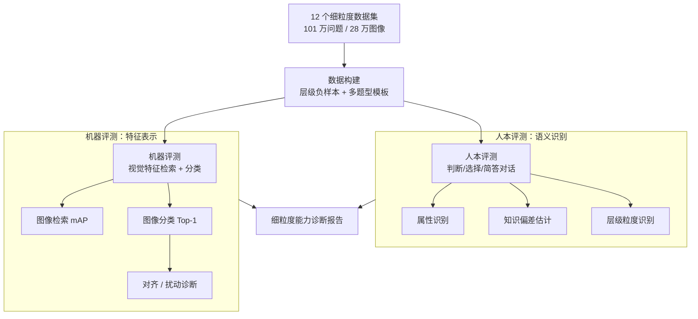

# Benchmarking Large Vision-Language Models on Fine-Grained Image Tasks: A Comprehensive Evaluation

**会议**: ICLR 2026  
**OpenReview**: [https://openreview.net/forum?id=cVc74MLspe](https://openreview.net/forum?id=cVc74MLspe)  
**代码**: https://github.com/SEU-VIPGroup/FG-BMK  
**领域**: 多模态VLM  
**关键词**: 细粒度视觉, LVLM评测, FG-BMK, 特征判别性, 模态对齐

## 一句话总结
本文构建了首个面向细粒度图像任务的大规模评测基准 FG-BMK（101 万问题、28 万图像），从"人本对话"和"机器特征"两个视角系统拷问 12 个主流 LVLM/VLM，揭示出对比式训练范式、模态对齐、扰动鲁棒性与层级类别推理如何影响细粒度表现，并发现 LVLM 在细粒度任务上仍明显落后于专用模型。

## 研究背景与动机
**领域现状**：LVLM（GPT-4o、Qwen、InternVL、LLaVA 等）在多模态感知与推理上进展迅猛，围绕它们也涌现出大量评测——既有 LVLM-eHub、MMBench 这类综合性评测，也有 DocVQA、GQA、MathVista 这类专项评测。

**现有痛点**：现有评测几乎都停留在"通用感知 + 常识推理"层面，而**细粒度图像任务**——即在子类（subordinate category）层级区分视觉对象，例如分辨不同鸟种、车型、机型——这一计算机视觉的基础能力，几乎没有被系统评测过。少数尝试（如 Geigle 等、Zhang 等）也只覆盖细粒度分类、问题量有限。

**核心矛盾**：细粒度任务要求模型捕捉**细微的判别性视觉模式**并调用 LLM 中的专家知识，而 LVLM 的主流优化目标是通用任务，二者之间的能力鸿沟从未被量化，导致 LVLM 在细粒度上的能力边界一直模糊不清。

**本文目标**：把这个能力边界量化清楚——既要评测 LVLM 作为对话体能否回答细粒度视觉问题，也要直接评测它的视觉特征本身有多强的判别力，并诊断出哪些训练/对齐选择在拖后腿。

**切入角度**：作者认为"问答正确率"只反映表层语义识别，掩盖了视觉特征质量；因此把评测拆成**人本（human-oriented）**与**机器（machine-oriented）**两条互补的线，前者测语义识别、后者测特征表示，两条线交叉印证才能看清问题根源。

**核心 idea**：用一个覆盖 12 个成熟细粒度数据集的双视角基准，把 LVLM 的"会不会说"和"特征好不好"分开测，从而把性能差异归因到训练范式、模态对齐、数据质量等可操作的因素上。

## 方法详解

### 整体框架
FG-BMK 不是一个新模型，而是一套评测协议 + 数据集。它的输入是待评测的 LVLM/VLM，输出是模型在细粒度维度上的多项诊断指标。整套基准从 12 个公开细粒度数据集（CUB、Flowers、Dogs、Cars、Aircraft、Food101、iNat2021 等）采集图像，避开网络爬取数据常见的质量不一与误标问题，再沿两条并行的评测线展开：

- **人本评测**：用对话形式（判断题 / 选择题 / 简答题）考察模型的语义识别与领域知识，包含属性识别、知识偏差估计、层级粒度识别三个子任务；
- **机器评测**：抽取模型的视觉特征，直接在图像检索（mAP）和图像分类（Top-1）两个基础任务上测特征的**判别性**与**鲁棒性**。

两条线分别落在"模型说什么"和"模型特征是什么"两个层面，结论可以相互校验。

### 关键设计

**1. 人本评测：用三类题型从对话层面拆解语义识别**

针对"现有评测看不清 LVLM 在子类层级到底会不会识别"，人本评测把问题设计成最贴近人机交互的对话形式，并用判断题（true/false）、选择题（multiple-choice）、简答题（short-answer）三种题型分别施压——只要回答中包含 ground truth 即判对。它进一步拆成三个子任务：**属性识别**用判断题和选择题考查颜色、尺寸、长度、形状、纹理等视觉属性；**知识偏差估计**只用判断题，对每个细粒度类别单独统计正确率，从而暴露模型在不同类别上的知识偏差；**层级粒度识别**横跨类（class）、属（genus）、种（species）等不同层级出题，考查模型能否调用领域知识在层级分类法里逐级定位对象。负样本的构造是这一设计的关键——判断题的负样本在同一层级里挑错标签（如把鸟 Aves 的图配上昆虫 Insecta），选择题的干扰项取自同一父类下的兄弟类别（如同属信天翁下的黑脚信天翁 vs Laysan 信天翁），这样才能真正测出"分得细不细"，而不是"认不认得大类"。

**2. 机器评测：绕过语言出口，直接体检视觉特征的判别性与鲁棒性**

问答正确率会被语言模型的措辞和随机性污染，掩盖视觉特征本身的好坏。该设计因此直接抽取 LVLM 的视觉特征，仿照 DINOv2 的协议，在两个基础视觉任务上量化特征质量：图像检索用 mAP、图像分类用 Top-1 Acc。它考察两个维度——**判别性**指特征区分细粒度类别的能力，通过单 meta-类内分类、以及把不同 meta-类混进同一训练/测试集的跨类分类（难度更高）来测；**鲁棒性**则用投影梯度下降（PGD）对视觉特征加扰动，看分类正确率掉多少。此外还系统地变更视觉编码器规模、训练数据量、是否做视觉-文本对齐，把特征质量的差异归因到这些可控变量上。正是这条线让作者能定量比较对比式、生成式、重建式三类训练范式产出的特征孰优孰劣。

**3. 数据构建：从 12 个权威数据集出发，按层级语义批量生成可控问题**

101 万问题、28 万图像并非靠人工逐条标注，而是基于 12 个成熟数据集已有的细粒度标注 + 层级分类法，用人工设计的多套问题模板批量生成，既保证规模与多样性，又保证标签质量。不同子任务的样本构造各有讲究：属性识别的判断题一半正样本、一半把图配错误属性当负样本；知识偏差估计为每个类别配上同一超类下其它子类的图像作为负样本；层级粒度识别在每个层级上分别造判断/选择/简答题；机器评测则直接沿用数据集原始标签，跨 meta-类分类时把不同 meta-类的子类混合训练。这种"已有高质量标注 + 模板化层级出题"的流水线，是 FG-BMK 能在不牺牲质量的前提下做到百万级规模的根本原因。

## 实验关键数据

评测覆盖 9 个开源 LVLM、2 个闭源模型（GPT-4o-1120、Gemini-2.0-flash）和 1 个纯视觉模型 DINOv2，并按损失函数把它们归类为对比（Con）、生成（Gen）、匹配（Mat）、重建（Rec）、蒸馏（Dis）等训练范式。

### 主实验

**层级粒度越细，LVLM 越力不从心**（InternVL3 在 CUB-200-2011 上）：

| 粒度层级 | 选择题 Acc | 判断题 Acc | 说明 |
|----------|-----------|-----------|------|
| 类 class | 99.76% | 99.77% | 大类（鸟/虫）几乎满分 |
| 属 genus | 90.75% | — | 同类不同属，掉 9.01% |
| 种 species | 61.18% | 62.48% | 同属不同种，逼近随机 |

**LVLM 视觉特征仍落后于细粒度专用模型**（分类 Top-1，Table 3）：

| 数据集 | LVLM-简答(SA) | LVLM-线性分类(LC) | 细粒度专用模型 |
|--------|--------------|-------------------|----------------|
| CUB-200-2011 | 85.60 | 91.65 | 93.10 |
| Stanford Dog | 86.49 | 90.50 | 97.30 |
| Stanford Car | 90.55 | 94.30 | 97.10 |
| Food-101 | 95.25 | 95.67 | 98.60 |
| FGVC Aircraft | 66.19 | 78.88 | 95.40 |

### 消融实验

**模态对齐反而损害细粒度判别性**（LLaVA 视觉特征，Table 4）：

| 配置 | CUB | Stanford Dogs | Stanford Cars | 说明 |
|------|-----|---------------|---------------|------|
| Origin（原始特征） | 79.77 | 81.24 | 87.57 | 编码器原始特征最强 |
| Aligned（粒度不匹配对齐） | 73.17 | 78.14 | 83.90 | 平均掉 3.39% |
| Aligned-FG（细粒度对齐） | 75.06 | 80.69 | 85.63 | 用细粒度文本对齐能回补 |

**细粒度任务对特征扰动更脆弱**（PGD 扰动，Origin→Perturbed）：

| 模型 | CIFAR-100（通用） | CUB-200-2011（细粒度） |
|------|-------------------|------------------------|
| EVA-CLIP | 93.05 → 50.76 | 88.95 → 24.94 |
| CoCa | 86.94 → 52.23 | 79.89 → 23.40 |
| DINOv2 | 93.38 → 42.39 | 91.64 → 25.94 |
| ViT (CE) | 89.81 → 72.15 | 88.83 → 73.85 |

### 关键发现
- **对比式训练范式最有利于细粒度判别**：EVA-CLIP、InternVL、DINOv2 在检索/分类上显著优于生成式（Qwen）和重建式（BEiT3）；跨 meta-类分类时 EVA-CLIP 仅掉 1.96%，而 Qwen、BEiT3 分别掉 4.16%、7.41%。甚至更小的 DINOv2-B 在 CUB 上比更大的 BEiT3-L 高出 8.08%，说明训练范式比编码器规模更关键。
- **堆规模与堆数据量收益有限**：DINOv2 从 B→L 仅涨 0.6%、L→G 仅涨 0.3%；EVA-CLIP 用 20 亿数据也没赢过仅 1.42 亿精选数据的 DINOv2——数据**质量**比数量更重要。
- **对齐的双刃剑**：把视觉特征对齐到文本会因特征空间失真和**图文粒度不一致**（细粒度图配粗粒度文本描述）而削弱判别性；构造粒度匹配的对齐数据重训对齐模块后，Stanford Dogs 回升 2.55%、Stanford Cars 回升 1.73%。
- **知识偏差源自语言模型**：LLaVA 在不同鸟类上正确率从约 90% 跌到约 30%，极不均衡；在出现次数均衡的数据上微调后趋于一致，且这些细粒度类别几乎不在训练数据中出现，说明偏差主要继承自底层 LLM 而非视觉模型。
- ViT 用交叉熵在 ImageNet 上训出的特征对扰动远更鲁棒，提示高质量细粒度数据有助于提升鲁棒性。

## 亮点与洞察
- **双视角评测把"会说"和"特征好"解耦**：人本评测测语义出口、机器评测测视觉特征本身，两条线交叉印证，能把性能差异归因到训练范式/对齐/数据质量这些可操作因素，而不是停在"模型 A 比 B 高几个点"。这种解耦思路可迁移到任何想诊断"表层指标 vs 底层表示"的评测场景。
- **层级负样本构造是细粒度评测的灵魂**：同属不同种、同父类兄弟干扰项的设计，让基准能精确定位模型在哪个粒度层级"崩盘"（class 99% → species 61%），比笼统的分类正确率信息量大得多。
- **最反直觉的结论**：模态对齐——LVLM 的核心组件之一——竟然会损害细粒度判别性，且根因是图文粒度不匹配。这给 LVLM 数据构建直接的行动指引：对齐数据的文本粒度要和图像中的细粒度对象匹配。

## 局限与展望
- 机器评测为隔离训练范式影响，特意选用各家**较早版本**的模型，结论对最新版 LVLM 的外推性需谨慎（作者自述）。
- 数据虽规模巨大，但全部由模板 + 已有标注自动生成，问题表述多样性受模板覆盖范围限制，可能与真实用户的开放式提问有差距。
- 评测以英文判断/选择/简答为主，"回答包含 ground truth 即判对"的宽松判定可能高估真实理解程度（如简单题上选择题反而高于判断题，作者归因于随机性）。
- 论文给出诊断但未提出新方法；如何在保留通用能力的同时增强细粒度判别（如 InternVL3 切图取局部特征的思路）仍是开放方向。

## 相关工作与启发
- **vs 综合评测（LVLM-eHub / MMBench）**: 它们覆盖通用多模态感知与推理，本文专攻被忽视的子类层级细粒度任务，且额外引入机器评测直接体检视觉特征，诊断深度更细。
- **vs 专项评测（DocVQA / GQA / MathVista）**: 同为专项，但它们聚焦文档/推理/数学，本文聚焦细粒度识别这一 CV 基础能力，并配套百万级层级化问题与 12 数据集覆盖。
- **vs 已有细粒度评测（Geigle 等 / Zhang 等）**: 前者只测细粒度分类、后者问题量有限，本文以 101 万问题、双评测范式、训练范式/对齐/鲁棒性多维归因实现"comprehensive"，是该方向首个系统基准。

## 评分
- 新颖性: ⭐⭐⭐⭐ 首个系统的细粒度 LVLM 双视角基准，归因分析（对齐损害判别性、偏差源自 LLM）有洞见
- 实验充分度: ⭐⭐⭐⭐⭐ 12 模型 × 12 数据集 × 多任务 × 范式/对齐/扰动/规模多维诊断，统计检验（Nemenyi）齐备
- 写作质量: ⭐⭐⭐⭐ 结论组织清晰、图表充分，部分诊断细节需查附录
- 价值: ⭐⭐⭐⭐ 为 LVLM 的细粒度数据构建与训练设计提供了可操作的指引，基准与代码开源

<!-- RELATED:START -->

## 相关论文

- [\[ICLR 2026\] GranViT: A Fine-Grained Vision Model For Autoregressive Multimodal Large Language Models](granvit_a_fine-grained_vision_model_for_autoregressive_multimodal_large_language.md)
- [\[ICCV 2025\] Fine-Grained Evaluation of Large Vision-Language Models in Autonomous Driving](../../ICCV2025/multimodal_vlm/fine-grained_evaluation_of_large_vision-language_models_in_autonomous_driving.md)
- [\[ICLR 2026\] InternSVG: Towards Unified SVG Tasks with Multimodal Large Language Models](internsvg_towards_unified_svg_tasks_with_multimodal_large_language_models.md)
- [\[ICLR 2026\] SpaCE-10: A Comprehensive Benchmark for Multimodal Large Language Models in Compositional Spatial Intelligence](space-10_a_comprehensive_benchmark_for_multimodal_large_language_models_in_compo.md)
- [\[ICLR 2026\] HSSBench: Benchmarking Humanities and Social Sciences Ability for Multimodal Large Language Models](hssbench_benchmarking_humanities_and_social_sciences_ability_for_multimodal_larg.md)

<!-- RELATED:END -->
