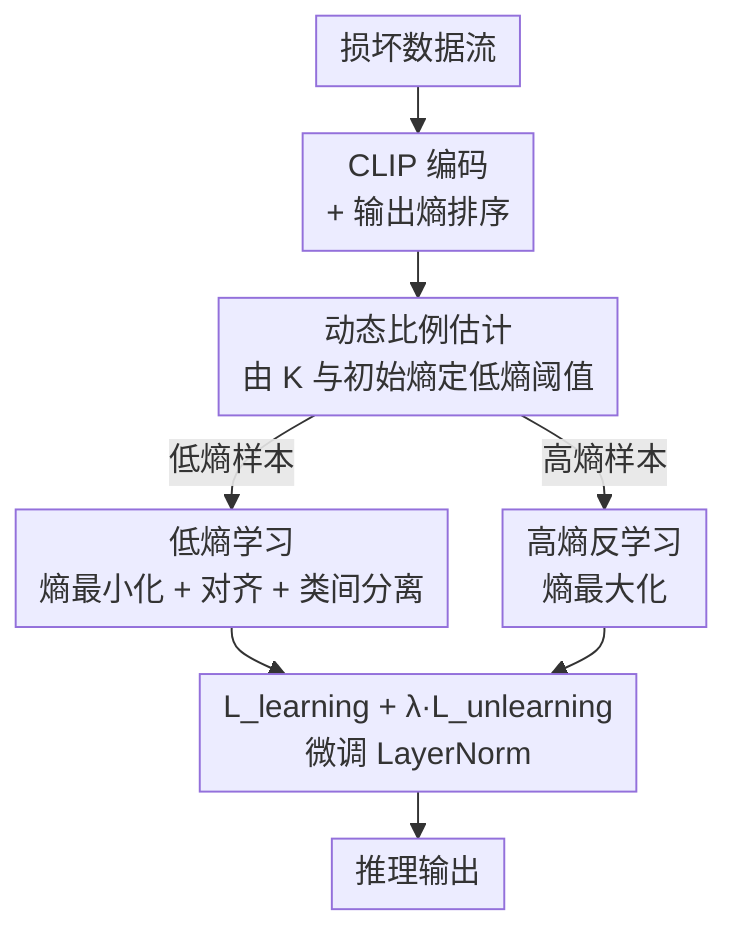

# Bilateral Information-aware Test-time Adaptation for Vision-Language Models

**会议**: ICLR2026  
**OpenReview**: [https://openreview.net/forum?id=vv8EcCoBfr](https://openreview.net/forum?id=vv8EcCoBfr)  
**代码**: https://github.com/tmlr-group/BITTA  
**领域**: 多模态VLM / 测试时适应  
**关键词**: 测试时适应, CLIP, 熵最小化, 反学习, 鲁棒性

## 一句话总结
针对 CLIP 这类视觉语言模型在测试时适应（TTA）时只用"固定比例低熵样本"导致过拟合非典型特征的问题，本文提出 BITTA：同时用**动态比例**的低熵样本"学习"核心表征、用高熵样本"反学习"非典型特征，在 CIFAR-10/100-C、ImageNet-C 等损坏数据集上把多种 TTA 方法的平均准确率稳定提升约 1–2 个点。

## 研究背景与动机
**领域现状**：CLIP 等 VLM 靠海量图文对预训练获得了强大的零样本泛化能力，但部署到真实场景时，天气变化、数字噪声等导致的分布偏移（covariant shift）会让性能明显下滑。测试时适应（TTA）是主流应对手段——在推理阶段拿到的无标签新数据上用无监督损失（通常是熵最小化）微调模型，让它适应偏移后的分布。

**现有痛点**：作者发现绝大多数 TTA 工作都在卷"优化目标怎么设计"，却几乎不管"用哪些数据来适应"。标准做法是：把所有测试样本按输出熵排序，用一个**预设固定阈值**挑出固定比例（如 top 10%）的低熵（高置信）样本来做熵最小化，假设低熵样本含有"典型特征"、能学到对适应目标有代表性的信息。

**核心矛盾**：这个固定低熵选择有两个被忽视的硬伤。其一，**在低熵样本上学习会加剧某些样本的错误**——作者跟踪了四类样本在 TTA 中的熵变化（图 2），发现那些一直被分错、以及原本分对后来分错的样本，模型反而越来越自信（熵越来越低），说明模型记住了低熵样本里夹带的"非典型特征 / 噪声信息"，这种记忆化（memorization）损害了适应。其二，**固定选择比例对不同分布并不通用**——不同数据集、甚至同一数据集的不同损坏类型，其最优选择比例都不一样。

**切入角度**：两个反直觉的观察给了破局点。一是高熵样本里那些"无法区分"的噪声，和低熵样本里被误判的"非典型特征"**同源**（图 3a），所以高熵样本恰好可以当作一个"反例集"去抵消模型对非典型特征的过拟合——主动增大高熵样本的预测熵，会连带把那些被误判低熵样本的熵也拉回去（图 3b）。二是不同最优比例所对应的**熵值高度一致**，而初始熵又与类别数 $K$ 存在线性关系，这就给"动态预测最优比例"提供了一个可标准化的信号。

**核心 idea**：不要只盯着低熵样本"单边"地学，而是**双边利用信息**——动态比例的低熵样本用来"学习"核心表征，高熵样本用来"反学习"非典型特征，两者同时进行。

## 方法详解

### 整体框架
BITTA（Bilateral Information-aware Test-Time Adaptation）的核心定位是一个"从数据视角设计、与具体适应目标解耦"的框架：它不替换已有 TTA 的学习损失，而是在选数据这一层做文章，因此可以即插即用地套到 TPT、TPS、BAT 等方法上。

给定一条损坏数据流，BITTA 的流程是：(1) 用训练好的 CLIP 提取图像特征与文本嵌入、算余弦相似度做预测，并按输出熵排序；(2) 根据当前 batch 的熵分布和类别数 $K$ **动态估计低熵选择阈值**，定出该用多少低熵样本；(3) 取高熵样本做**反学习**（熵最大化），消解被记忆的非典型特征；(4) 同时取低熵样本做**学习**（熵最小化等目标），拟合核心表征。最终的总目标是 $\min\ \mathcal{L}_{\text{learning}} + \lambda \mathcal{L}_{\text{unlearning}}$，只微调 LayerNorm 层，每个 batch 只更新一步。

### 关键设计

**1. 双边信息感知适应：低熵学习与高熵反学习并行**

针对"只在低熵样本上学习会让模型对误判样本越来越自信"这一过拟合现象，BITTA 不再单边取低熵样本，而是把高熵样本拉进来当"刹车"。总目标写成 $\mathcal{L}_{\text{learning}} + \lambda \mathcal{L}_{\text{unlearning}}$（$\lambda>0$ 为平衡权重，实验取 1.2）。其中 $\mathcal{L}_{\text{learning}}$ 沿用已有 TTA 的学习目标（负责学核心表征），$\mathcal{L}_{\text{unlearning}}$ 是新引入的、作用在高熵样本上的反学习项。这套设计之所以成立，是因为作者观察到高熵样本的"不可区分噪声"和低熵样本里的"误判非典型特征"同源（图 3a），且实验证实增大高熵样本的熵会连带降低误判低熵样本的过自信（图 3b）。作者还给出 Theorem 3.1 做理论支撑：当目标域样本相对源域的偏移 $h$ 超过阈值 $\frac{D(c_k,c_{k'})}{2J_u}$（$D$ 是源域中类间最小距离，$J_u$ 是生成函数 Jacobian 谱范数上界）时，该样本理论上就无法被严格区分——高熵样本恰属于这类"不可学"样本，因此明智的做法是别去学它们，而是反着用。

**2. 高熵样本反学习：用熵最大化注入正则**

反学习项的具体形式是一个"反向的熵"——对选中的高熵样本 $X_{\text{high}}$，最大化其预测熵：

$$\mathcal{L}_{\text{unlearning}} = \sum_{i=1}^{K} p(y_i|X_{\text{high}}) \log\big(p(y_i|X_{\text{high}})\big).$$

注意它和常规熵最小化差一个符号——常规熵 $-\sum p\log p$ 是要降低不确定性，这里直接最小化 $\sum p\log p$（即增大熵），有意提高模型在高熵样本上的不确定性。直觉是：既然这些样本的关键特征已被海量噪声淹没、强行学只会让模型记住非典型特征，那就主动让模型"对它们保持不自信"，从而冲销掉在低熵样本上偷偷记下的那部分非典型记忆。这个反学习模块是纯数据视角的通用设计，所以能整合进任意已有 TTA 方法。

至于配套的学习项 $\mathcal{L}_{\text{learning}}$，论文以 BAT 为实例采用三部分组合：

$$\mathcal{L}_{\text{learning}} = -\sum_{i=1}^{K} p(y_i|X_{\text{low}})\log p(y_i|X_{\text{low}}) - \frac{1}{K}\sum_{c=1}^{K}\bar{v}_c\cdot f_c - \sum_{i=1}^{K}\sum_{j=1}^{K}\mathbb{I}[i\neq j]\big(1-\text{sim}(\bar{v}_i,\bar{v}_j)\big),$$

三项分别负责降低预测不确定性、增强图文对齐、提升类间区分度（$\bar{v}_c$ 是伪标签为 $c$ 的视觉嵌入均值）。

**3. 动态低熵比例估计：把"最优比例"标准化为可预测信号**

固定比例的硬伤在于不同分布最优比例不同，但作者发现一个可标准化的规律：不同最优比例对应的**熵值高度接近**，且初始熵与类别数 $K$ 近似线性。据此他们从多个数据集训练子集拟合出关系

$$\frac{\tau_l^n}{\text{Max}(H(x_i))} = -0.00038\,K + 0.83,$$

得到归一化的低熵阈值 $\tau_l^n$，再用 $\tau_l^p = \frac{1}{M}\sum_{i=1}^{M}\mathbb{I}[H(x_i)<\tau_l^n]$ 把阈值换算成实际选择比例，从而对每个数据集**动态**给出合理的低熵比例。Theorem 3.2 进一步用 conformal prediction 的思路给了边际覆盖保证：真实最优比例至少有 $1-\alpha$ 概率落在预测区间 $[\hat{Y}_{n+1}-Q(1-\alpha),\ \hat{Y}_{n+1}+Q(1-\alpha)]$ 内。值得注意的是高熵侧反而**用固定比例**（实验中 0.1 即足够）——作者解释低熵样本需要多样性所以要动态调，而少量高熵样本就能提供充分的正则信号。

### 损失函数 / 训练策略
总损失 $\mathcal{L}_{\text{learning}} + \lambda\mathcal{L}_{\text{unlearning}}$，$\lambda=1.2$。优化器 AdamW，CIFAR-10-C/100-C/ImageNet-C 的学习率分别为 1e-3/5e-4/5e-4，batch size 200/200/64，损坏等级 5，文本模板 "a photo of a \<cls\>"。每个 batch 只更新 1 步（多步会丢失先验知识、反而掉点）。只微调 LayerNorm 层。

## 实验关键数据

### 主实验
在三个损坏数据集上，把 BITTA 套到最强 baseline BAT 上（ViT-B/16），各损坏类型平均准确率（%）：

| 数据集 | 之前 SOTA (BAT) | BAT+BITTA | 提升 |
|--------|------|------|------|
| CIFAR-10-C | 73.34 | 74.78 | +1.44 |
| CIFAR-100-C | 41.15 | 42.56 | +1.41 |
| ImageNet-C | 31.06 | 31.88 | +0.82 |

BITTA 在不同视觉骨干（ViT-B/16、ViT-B/32）上均稳定超越 TPT、TDA、BCA、DMN-ZS、DPE、BAT 等代表性方法；t-SNE 可视化显示其特征聚类更紧、类间更可分。

### 即插即用兼容性
作为"数据视角"的通用模块，BITTA 套到不同 TTA 方法上都涨点（CIFAR-10-C, ViT-B/16, 平均准确率）：

| 配置 | 原方法 | +BITTA | 提升 |
|------|------|--------|------|
| TPT | 63.84 | 65.37 | +1.53 |
| DiffTPT | 64.24 | 66.03 | +1.79 |
| CTPT | 61.84 | 62.61 | +0.77 |
| TPS | 64.28 | 65.24 | +0.96 |

在 ResNet101 / ViTBase 上对 MEMO、SAR 也同样有效（如 SAR+BITTA 在 ImageNet-C Gaussian 从 52.83→56.27）。

### 消融实验

| 配置 | 关键发现 | 说明 |
|------|---------|------|
| 更新步数 1→4 | 步数越多越掉点 | 单 batch 连续更新会丢先验知识，故定为 1 步 |
| 低熵比例 0.1→0.6 | 各数据集最优比例不同 | 印证固定比例不可取，动态估计模块全程接近最优 |
| 高熵比例 0.1→0.3 | 0.1 即最优 | 少量高熵样本就够正则，故用固定比例 |
| $\lambda$ 1.0→1.3 | 1.2 最优、差距<0.1% | 对 $\lambda$ 鲁棒 |
| vs weight decay / distribution dissolve | 反学习更好 | BAT+BITTA 74.78 > +distribution dissolve 74.37 |

校准误差 ECE 也显著下降（CIFAR-10-C, BAT ViT-B/16 平均 15.25→12.93），说明反学习确实缓解了过自信。

### 关键发现
- 反学习模块贡献的不只是准确率，更重要的是把 ECE 拉低、缓解了误判样本上的过拟合（图 8c 验证熵动态被纠正）。
- 动态低熵 + 固定高熵的非对称设计是关键：低熵需多样性故动态、高熵少量即够故固定。
- 多步更新有害，单步更新+逐 batch 适应才能保住 CLIP 的零样本先验。

## 亮点与洞察
- **"反学习"是个被忽视的杠杆**：以往 TTA 都在想"学什么"，BITTA 指出"主动不学什么"同样重要——用熵最大化把那些注定学不好的高熵样本变成正则信号，思路很巧。
- **把"最优比例"从超参变成可预测量**：通过"最优比例对应熵值一致 + 初始熵与 $K$ 线性"两步观察，把一个需要逐数据集调的超参标准化成一条线性公式，还配了 conformal 覆盖保证，工程上很实用。
- **数据视角的通用性**：方法不碰具体学习损失，纯在"选哪些样本"上动刀，所以能即插即用地给 TPT/TPS/BAT/MEMO/SAR 全家桶涨点——这种正交于优化目标的设计很容易迁移。

## 局限与展望
- 反学习的"同源假设"（高熵噪声≈低熵误判的非典型特征）靠可视化和单一定理支撑，在更复杂或语义型偏移下是否仍成立未充分验证。
- 动态比例公式 $-0.00038K+0.83$ 的系数是在若干数据集子集上拟合的，外推到类别数极大或分布差异极端的场景可能需要重新标定（⚠️ 系数以原文为准）。
- 高熵侧用固定比例 0.1 是经验结论，未给出与低熵侧同等的动态机制；个别损坏类型上 BITTA 出现轻微掉点（如 ImageNet-C 某些类 ∆ 为负），说明并非所有分布都受益均匀。

## 相关工作与启发
- **vs BAT (Maharana et al., 2025)**：BAT 是本文采用的"学习部分"实例（微调 LayerNorm + 三项学习目标），只在低熵样本上学；BITTA 在其之上加了高熵反学习与动态比例，BAT+BITTA 全面超越纯 BAT。
- **vs TPT (Shu et al., 2022)**：TPT 用随机增强 + 固定比例低熵选择做 prompt tuning，正是本文批判的"固定低熵单边学习"代表；BITTA 可直接套在 TPT 上提升约 1.5 点。
- **vs 传统熵最小化 TTA (Tent/SAR/EATA 等)**：这些方法聚焦优化技巧而把数据"全用或固定过滤"，BITTA 改从数据利用角度切入，正交且兼容。

## 评分
- 新颖性: ⭐⭐⭐⭐ "反学习高熵样本 + 动态标准化选择比例"的组合在 TTA 里角度新颖
- 实验充分度: ⭐⭐⭐⭐ 三大损坏数据集 + 多骨干 + 多方法兼容 + ECE/t-SNE 多维验证，较扎实
- 写作质量: ⭐⭐⭐⭐ 动机由现象观察层层推导，图 2/3 的分析有说服力
- 价值: ⭐⭐⭐⭐ 即插即用、正交于优化目标，对安全攸关场景的 VLM 鲁棒适应有实用价值

<!-- RELATED:START -->

## 相关论文

- [\[ICLR 2026\] Flatness-Guided Test-Time Adaptation for Vision-Language Models](flatness_guided_test-time_adaptation_for_vision-language_models.md)
- [\[CVPR 2025\] Realistic Test-Time Adaptation of Vision-Language Models](../../CVPR2025/multimodal_vlm/realistic_test-time_adaptation_of_vision-language_models.md)
- [\[CVPR 2026\] Dynamic Logits Adjustment and Exploration for Test-Time Adaptation in Vision Language Models](../../CVPR2026/multimodal_vlm/dynamic_logits_adjustment_and_exploration_for_test-time_adaptation_in_vision_lan.md)
- [\[NeurIPS 2025\] DOTA: DistributiOnal Test-time Adaptation of Vision-Language Models](../../NeurIPS2025/multimodal_vlm/dota_distributional_testtime_adaptation_of_visionlanguage_mo.md)
- [\[CVPR 2026\] STAR: Test-Time Adaptation Can Enhance Universal Prompt Learning for Vision-Language Models](../../CVPR2026/multimodal_vlm/star_test-time_adaptation_can_enhance_universal_prompt_learning_for_vision-langu.md)

<!-- RELATED:END -->
