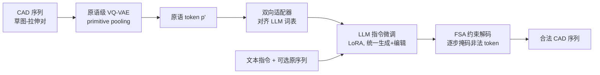

# CAD-Tokenizer: Towards Text-Based CAD Prototyping via Modality-Specific Tokenization

**会议**: ICLR 2026  
**OpenReview**: [https://openreview.net/forum?id=UKIsnwd1Oz](https://openreview.net/forum?id=UKIsnwd1Oz)  
**代码**: 待确认  
**领域**: 多模态 / LLM for CAD  
**关键词**: Text-to-CAD, CAD 编辑, VQ-VAE 分词器, 原语级 token, 有限状态自动机解码, LLM  

## 一句话总结
为 CAD 序列设计一套"原语级 VQ-VAE 分词器"替换 LLM 默认的字词分词，把草图—拉伸对压缩成与 LLM 词表对齐的离散 token，并用有限状态自动机约束解码，从而首次用单一模型统一完成 Text-to-CAD 生成与文本指令驱动的 CAD 编辑。

## 研究背景与动机
**领域现状**：CAD 模型不是用原始坐标定义的，而是由"草图(sketch)→拉伸(extrusion)"这类构造操作序列描述，这种序列天然记录了设计历史，既适合从零生成原型、也适合后续修改。近期工作已分别用 LLM 操作 CAD 序列，做成了 Text-to-CAD 生成(CADFusion 等)和 CAD 编辑(CAD-Editor)两条独立线路。

**现有痛点**：真实工程设计是"生成—修改"反复迭代的，但此前没有任何工作把这两个子任务塞进一个统一模型。更底层的问题在分词：标准 LLM 分词器(BPE)会把 CAD 程序拆成自然语言词片，比如把 `extrusion` 切成 `[extru][-sion]`、把数字参数切成任意子串。注意力层于是盯着标点和半截 token，根本抓不住"原语(primitive)"这个有意义的几何单元，也就建模不出 CAD 的结构与几何依赖。

**核心矛盾**：Text-to-CAD 要的是从零生成的强生成能力，CAD 编辑要的是对已有几何的精确理解与对齐——两种互补但不重叠的能力压在同一个 backbone 上，对表示提出了远高于单任务的要求；而错位的分词方式让 LLM 连"把 CAD 当结构化序列来读"这一步都做不好。

**本文目标**：提出统一的 **text-based CAD prototyping** 任务(生成+编辑合一)，并给出能让 LLM 真正按原语推理的表示方案。

**核心 idea**：**模态专属分词**——CAD 应该有自己的"词表"。用一个改造过的序列式 VQ-VAE 把 CAD 压成原语级离散 token，再训练适配器把这些 token 双向对齐到 LLM 的嵌入空间，让 LLM 预测的是"下一个操作"而不是"下一个字符"；推理时再用 FSA 强制语法合法。

## 方法详解

### 整体框架
CAD-Tokenizer 是一条四阶段流水线：先把 CAD 序列用原语级 VQ-VAE 压成离散 token，再用适配器把这些 token 与冻结的 LLM 词表对齐，然后在统一数据上对 LLM 做指令微调，最后在推理时用有限状态自动机(FSA)约束采样保证语法合法。前两步解决"CAD 怎么变成 LLM 认识的 token"，第三步解决"统一两个任务",第四步解决"生成出来别是废序列"。

### 关键设计

**1. 原语级 VQ-VAE 分词器：让一个草图—拉伸对变成多个而非一个 token。** 标准 VQ-VAE 会把整条序列池化成单个潜向量，信息被压没了。本文把输入 CAD 序列 $C$ 拆成草图—拉伸对 $SE=\{t_1,\dots,t_n\}$，用 transformer 编码器成对编码，并引入**原语专属池化层(primitive-specific pooling)**，给每个草图—拉伸对产出多个离散表示($k<n$ 个潜向量),既保留局部细节又吸收周边上下文。训练用序列重建目标加累计 VQ 损失：

$$L_{VQ\text{-}Prim}=\sum_{i\in n}\mathrm{EMD}\big(\mathrm{Decoder}(\{p'\},t_{1,i-1}),\mathbb{1}_i\big)+\sum_{j\in k}VQ(T^E_j,p'_j),$$

其中 EMD 是平方 Earth Mover's Distance,$\{p'\}$ 是编码器+池化层产出的全部原语潜向量,$\mathbb{1}_i$ 是输入的 one-hot 属性,$T^E_j$ 是构成第 $j$ 个原语的那组 token 的池化向量。消融里的 single 变体(不做原语池化、每对压成一个单元)质量急剧崩塌,直接证明了"多 token / 原语级"这一步是命门。

**2. 双向适配器对齐：不动 backbone 就把 VQ token 塞进 LLM 词表。** 原语向量 $p'_j$ 维度是 $d_{vq}$,而 LLM 嵌入空间是 $d_{tok}$,二者对不上。常规做法是和 LLM 共同训练来对齐,算力贵且不保证反向也对齐。本文复用**冻结的** LLM 嵌入层与 logit 层,只训两个适配器,用向量重建损失把映射后的 token $p_j=\arg\max(L_{logit}(W^{d_{tok}}_{d_{vq}}(p'_j)))$ 拉回原表示:

$$L_{recon}=\sum_{j\in k}\lVert \hat{p}'_j-p'_j\rVert_2^2+\lVert L_{embed}(p_j)-W^{d_{vq}}_{d_{tok}}(p'_j)\rVert_2^2,$$

第一项($\hat p'_j=W^{d_{tok}}_{d_{vq}}(L_{embed}(p_j))$)保证嵌入层那侧能还原,第二项保证 logit 层那侧也训到。结果是得到 LLM 原生可识别的原语 ID,无需改动 backbone 就能无缝接入——这也是和 BPE 的本质差别:消融显示 BPE 因为没把 token 对齐到 LLM 词表,微调时多背了一份负担,IR(非法率)高达 88.5。

**3. 统一指令微调:把压缩后的序列喂给 LLM 一锅烩。** 有了对齐 token,生成和编辑就能写成同一种格式。给定 prompt $x=(I,C_{orig})$(指令 $I$ + 可选原序列;Text-to-CAD 时 $C_{orig}=\varnothing$),令 $x'=(I,\text{CAD-Encoder}(C_{orig}))$、$y'=\text{CAD-Encoder}(C_{gen})$,标准交叉熵微调 $L_{SFT}=-\mathbb{E}_{(x',y')}[\frac{1}{T}\sum_t \log p(\hat y=y'_t\mid x')]$。因为 CAD 序列被大幅压缩($|x'|<|x|$),微调既更有效也更省算力。实现上用 LLaMA-3-8b 做 backbone、LoRA(rank=32)微调 20 epoch,并按 1:5 平衡 Text-to-CAD 与 CAD-Editing 数据。

**4. FSA 约束解码:用 CAD 是形式语言这点堵住语法错误。** 自回归采样(top-p、beam search)不懂 CAD 语法,容易吐出非法序列;但 CAD 不像自然语言,它是能被状态与转移完全刻画的形式语言。于是作者设计有限状态自动机(FSA),每步给出一组掩码,只允许语法合规的 token 通过($choice=\arg\max(m\otimes logits)$);自动机状态随解码器选择而转移,选中的 token 又回灌给 FSA 决定下一步状态(见 Algorithm 1)。它显著降低语法错误:消融中 FSA 把 IR 从 top-p 的 17.2、beam search 的 45.2 压到 4.94,F1-Avg 也最高。

## 实验关键数据

数据来自 SkexGen,转成 CADFusion / CAD-Editor 的格式合并(约 10 万训练对、1000 测试对);VQ-VAE 只用一半训练数据,以保证 LLM 会见到分词器没见过的样本。指标涵盖 F1(草图/拉伸)、Chamfer Distance(CD)、Coverage(COV)、MMD、JSD、Invalidity Ratio(IR)、VLM 打分与人评排名(HE,越低越好);分布类与 CD 数值均 ×10²。

### 主实验

CAD 编辑(task-specific 基线为 CAD-Editor):

| 方法 | F1-Skt↑ | F1-Ext↑ | CD↓ | COV↑ | IR↓ | VLM↑ | HE↓ |
|---|---|---|---|---|---|---|---|
| CAD-Editor* | 73.3 | 82.6 | 40.7 | 51.1 | 1.50 | 4.28 | 1.63 |
| GPT-4o | 80.0 | 78.1 | 42.9 | 51.8 | 47.9 | 1.94 | - |
| Vanilla-LLaMA | 78.8 | 84.9 | 42.4 | 48.6 | 48.6 | 4.31 | 2.64 |
| **CAD-Tokenizer** | **88.6** | **94.8** | **13.5** | **52.4** | 8.38 | **5.09** | **1.72** |

Text-to-CAD(task-specific 基线为 CADFusion):

| 方法 | F1-Skt↑ | F1-Ext↑ | CD↓ | COV↑ | IR↓ | VLM↑ | HE↓ |
|---|---|---|---|---|---|---|---|
| CADFusion† | 68.8 | 80.1 | 38.5 | 54.4 | 22.5 | **5.41** | 1.91 |
| GPT-4o | 66.7 | 66.8 | 79.8 | 52.6 | 90.5 | 1.47 | - |
| Vanilla-LLaMA | 66.4 | 80.9 | 48.4 | 53.8 | 80.5 | 3.45 | 2.58 |
| **CAD-Tokenizer** | **77.9** | **84.7** | **26.7** | **54.5** | **1.50** | 3.82 | **1.62** |

两个任务上 F1 各涨约 10 分、CD 大幅下降、IR 接近最低;唯一被 CADFusion 反超的是 Text-to-CAD 的 VLM 分(5.41 vs 3.82),但人评排名 CAD-Tokenizer 更受偏好。值得注意的是 **Vanilla-LLaMA 在多数指标上几乎崩溃**,印证了"默认分词器扛不住统一 CAD prototyping"的核心猜想。

### 消融实验

分词器重建质量(只报草图 F1,因为按草图—拉伸对编码,拉伸恒满分):

| 方法 | F1-Skt↑ | COV↑ | JSD↓ |
|---|---|---|---|
| HNC-CAD | 85.5 | 57.5 | 29.8 |
| CAD-Tokenizer (curve, 默认) | **94.1** | **64.5** | **8.19** |
| CAD-Tokenizer (loop) | 91.5 | 59.5 | 18.4 |
| CAD-Tokenizer (single) | 76.5 | 54.0 | 35.9 |

接入 LLM 微调后不同分词器(F1-Avg / IR):curve 86.5 / 4.94、loop 86.3 / 4.91、single 78.3 / 70.7、BPE 76.2 / 88.5——single 和 BPE 因为不做原语池化 / 不对齐词表而高 IR、弱指标。

采样策略消融:FSA 86.5 / IR 4.94,top-p 80.4 / IR 17.2,beam search 82.8 / IR 45.2,FSA 全面占优。

### 关键发现
- 原语级池化是命门:去掉它(single 变体)无论重建还是 LLM 微调都崩。
- curve 与 loop 池化都有效,loop 压缩率更高但重建略低,提供精度—效率的可调旋钮。
- 压缩越狠重建质量越差,存在明确 trade-off。
- 把 CAD 当形式语言、用 FSA 约束解码,是压低非法率最直接的手段。

## 亮点与洞察
- **"模态专属分词"这个切口很本质**:多模态接入 LLM 时,大家默认拿现成分词器硬塞,本文点破了"分词错位导致注意力关注废 token"这一被忽视的瓶颈,并给出 CAD 这个干净的形式语言作为示范。
- **双向适配器 + 冻结 backbone** 是工程上很讨巧的设计:不联合训练大模型就完成词表对齐,把"对齐"从昂贵的协同训练降级成只训两层适配器。
- **用形式语言性质做解码约束**:CAD 不是自然语言而是可被自动机完全刻画的形式语言,这一观察让 FSA 掩码解码顺理成章,几乎零成本把非法率打下来。
- **任务统一带来的实际价值**:生成与编辑合一,贴合"工程师反复生成—修改"的真实工作流。

## 局限与展望
- **数据受限**:开源 CAD 数据与工业私有数据存在质量差距,限制了在更复杂形状上的训练。
- **编辑评测的指标缺陷**:分布类指标和实际编辑表现脱节——它们无法刻画"保留原形状的意图",作者自陈模型其实更倾向于真正改动原物体却因此在分布指标上吃亏。
- **推理能力天花板在 backbone**:失败案例显示空间/常识推理不足,只能靠更强的预训练 backbone 改善,FSA 也承认抓不住依赖上下文的几何约束。
- 期待更好的数据集与更贴合"编辑意图"的评测指标。

## 相关工作与启发
- **经典 CAD 生成**(SkexGen、HNC-CAD 等)从手绘草图、点云、序列前缀甚至噪声生成,多用多编码器流水线,不涉及文本、也无需对齐 LLM。
- **文本驱动 CAD**:Text-to-CAD(CADFusion 等)与 CAD 编辑(CAD-Editor)此前各自为政,本文首次合并为统一 prototyping 任务。
- **LLM 多模态分词**:视觉用 VAE/VQ-VAE 或 CLIP/ViT,机器人常直接字符串化动作,时序兼有神经与经典分词;本文是首个专为对接 LLM 而设计的 CAD 编码—解码分词器。
- 启发:任何"非自然语言但有强结构/语法"的模态(电路网表、分子 SMILES、程序 AST 等)接入 LLM 时,都值得复用"模态专属 VQ 分词 + 词表对齐适配器 + 形式语言约束解码"这套组合拳。

## 评分
- **新颖性**: ⭐⭐⭐⭐ 首次统一 text-based CAD prototyping,且"模态专属原语分词 + 双向适配器 + FSA 解码"组合在 CAD 上是新的、切口也击中了被忽视的分词瓶颈。
- **实验充分度**: ⭐⭐⭐⭐ 两任务主实验 + 三阶段(分词重建 / LLM 微调 / 采样)消融齐全,含 F1/CD/分布/IR/VLM/人评多维度;但数据规模和测试集(自标 200 对)偏小。
- **写作质量**: ⭐⭐⭐⭐ 动机清晰、图示(Fig.1/2/3)讲透流水线,公式与符号交代完整;个别表述与拼写略糙。
- **价值**: ⭐⭐⭐⭐ 给"结构化形式语言模态接入 LLM"提供了可迁移范式,统一生成+编辑也贴近真实 CAD 工作流,落地意义明确。

<!-- RELATED:START -->

## 相关论文

- [\[CVPR 2026\] CAD-Refiner: A Unified Framework for CAD Generation and Iterative Editing](../../CVPR2026/multimodal_vlm/cad-refiner_a_unified_framework_for_cad_generation_and_iterative_editing.md)
- [\[ICLR 2026\] Error Notebook-Guided, Training-Free Part Retrieval in 3D CAD Assemblies via Vision-Language Models](error_notebook-guided_training-free_part_retrieval_in_3d_cad_assemblies_via_visi.md)
- [\[ICCV 2025\] CAD-Assistant: Tool-Augmented VLLMs as Generic CAD Task Solvers](../../ICCV2025/multimodal_vlm/cad-assistant_tool-augmented_vllms_as_generic_cad_task_solvers.md)
- [\[CVPR 2026\] DeepAlign: Mitigating Modality Conflict through Modality-Specific Alignment](../../CVPR2026/multimodal_vlm/deepalign_mitigating_modality_conflict_through_modality-specific_alignment.md)
- [\[AAAI 2026\] ReCAD: Reinforcement Learning Enhanced Parametric CAD Model Generation with Vision-Language Models](../../AAAI2026/multimodal_vlm/recad_reinforcement_learning_enhanced_parametric_cad_model_generation_with_visio.md)

<!-- RELATED:END -->
