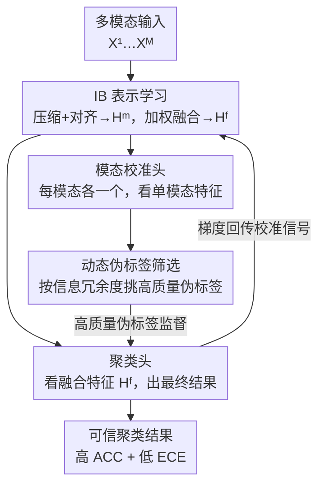

# Calibrated Information Bottleneck for Trusted Multi-modal Clustering

**会议**: ICLR2026  
**OpenReview**: [https://openreview.net/forum?id=iedlZOdI0d](https://openreview.net/forum?id=iedlZOdI0d)  
**代码**: https://shizhehu.github.io/  
**领域**: 自监督 / 多模态聚类 / 表示学习  
**关键词**: 信息瓶颈, 多模态聚类, 置信度校准, 伪标签筛选, 可信聚类

## 一句话总结
针对信息瓶颈（IB）多模态聚类高度依赖"准确的互信息估计 + 干净伪标签"这两件做不到的事，本文提出 CLIB——用"一个主聚类头 + 多个模态校准头"的并行多头结构，让模态间互相纠偏，再配上一个基于信息冗余度的动态伪标签筛选机制，既把聚类准确率（Caltech-3V 上 ACC 77.8%）做上去，又把过自信问题（ECE 在多个数据集上腰斩）压下来。

## 研究背景与动机
**领域现状**：信息瓶颈理论把表示学习刻画成"压缩 vs 保真"的权衡——为输入 $X$ 学一个压缩表示 $T$，目标是 $L_{\min} = I(X;T) - \beta I(T;Y)$，即一边压掉无关信息（最小化 $I(X;T)$），一边保住对目标 $Y$ 有判别力的信息（最大化 $I(T;Y)$）。因为 IB 天生擅长"提纯"特征，近年被大量搬进多模态聚类，用来从多模态数据里剔除冗余和噪声、保留共享语义。

**现有痛点**：把 IB 直接用到多模态聚类有两个绕不开的硬伤。其一，IB 的效果完全取决于"可靠的目标变量 $Y$"，但在无监督聚类里根本没有真标签，只能用模型自己产生的伪标签顶替；而伪标签在训练早期又脏又乱，于是形成恶性循环——烂伪标签 → 烂表示 → 更烂的伪标签，初始误差被一轮轮放大，模型对错误预测越来越自信（过自信）。其二，IB 的核心是互信息估计，但对图像/文本这种高维复杂数据，互信息根本无法精确计算，现有估计器（MINE、变分下界、对比式）都有系统性偏差，且大多只在简单的多元正态分布上验证过，到了真实数据上误差不可控。

**核心矛盾**：现有 IB 聚类方法都默认"互信息能估准、伪标签能用"，但这两个前提在高维无监督场景下同时失效；更糟的是，没人去管聚类结果的"可信度"——模型预测置信度远超实际准确率，在医疗诊断、自动驾驶这类安全攸关场景里这是致命的。而经典校准手段（温度缩放需要带标签的验证集、标签平滑会过度惩罚高置信样本）又都依赖监督信号，在聚类里用不了。

**本文目标**：在没有真标签的前提下，同时解决三件事——(1) 校正互信息估计偏差导致的 IB 失稳；(2) 从多模态构造可靠的目标变量喂给 IB；(3) 产出一个既准又"诚实"（不过自信）的聚类结果。

**切入角度**：作者的关键观察是——既然单一模态的互信息可能估歪，那就别指望"估准"，转而用**多模态互相校准**来对冲偏差：某个模态估偏了，可以靠其他模态的信息把它纠回来。同时把伪标签当成需要"挑"的对象而非照单全收，用信息冗余度（分布有多"尖锐"）来判断哪些伪标签可信。

**核心 idea**：用"主聚类头 + 模态校准头"的并行多头结构做模态间互校准，配合基于信息冗余度的动态伪标签筛选，把校准信号经梯度回传给 IB，从而在无监督下隐式构造高质量目标变量，得到准确且可信的聚类。

## 方法详解

### 整体框架
CLIB 要解决的是"无监督多模态聚类下，IB 缺可靠目标变量、互信息又估不准"的问题。整体流程是：先用 IB 从每个模态 $X^m$ 抽出紧凑特征 $H^m$，再自适应加权融合成统一表示 $H^f$；然后开两路头——**每个模态各接一个校准头**（只看单模态特征），**融合表示接一个聚类头**（产出最终结果）；校准头先各自给出单模态聚类概率，经一个信息冗余度筛选机制挑出高质量伪标签，去监督聚类头；聚类头的梯度不切断，反过来把"校准信号"回传到 IB，相当于在无监督下替 IB 隐式构造了目标变量。整套训练分两阶段：先 100 epoch 预热 IB（只学特征），等特征稳定后再 100 epoch 引入校准模块，避免早期噪声污染校准。总损失为

$$L_{total} = L_{IB} + \alpha L_{Cal}$$

其中 $\alpha$ 平衡特征提取与校准强度。

### 关键设计

**1. 信息瓶颈表示学习：压缩单模态、对齐跨模态、再保信息融合**

这一步针对"如何从多模态抽出既紧凑又判别的特征"这个底座问题。每个模态先做压缩+对齐：

$$L_C = \sum_{i=1}^{M} I(X^i, H^i) - \sum_{i=1}^{M}\sum_{j=i+1}^{M} I(H^i, H^j)$$

第一项 $I(X^i,H^i)$ 是压缩项，最小化它逼网络丢掉输入里的无关信息；第二项 $-I(H^i,H^j)$ 是对齐项，最大化不同模态表示间的互信息，逼各单模态编码器学到共享语义空间（共享语义被假设为有判别力的部分）。融合采用自适应加权平均 $H^f = \sum_m w^m H^m$（$\sum_m w^m = 1$，权重可学），让模型按各模态对聚类的贡献动态调权。为防止融合表示丢掉模态私有信息，再加一个信息保真项最大化每个模态与融合表示的互信息：$L_P = \sum_m I(H^m; H^f)$。合起来 $L_{IB} = L_C - \beta L_P$——$\beta$ 大则更重融合（牺牲单模态纯度），$\beta$ 小则更重压缩（牺牲融合里的模态保真）。这一设计的价值在于：它给后续校准提供了一个"压缩干净 + 跨模态对齐 + 又保住私有信息"的特征底座。

**2. 并行多头校准结构：让模态当"专家"互相纠偏，且不让噪声污染瓶颈**

这是全文的核心，直接对冲"单模态互信息估偏"的痛点。每个校准头是一个只观察单模态特征的"专家"，负责学该模态的聚类概率分布、并感知该模态当前学得好不好（分布越尖锐说明该模态越有判别力、学得越充分）。训练校准头时，作者先在融合特征空间跑 K-Means 得到 $C$ 个伪簇 $Q_c$，对每个伪簇内样本求聚类头输出的均值 $\hat{q}_c = \frac{1}{|Q_c|}\sum_{x_i\in Q_c} p_i^{clu}$ 作为软目标——这种"簇内平均"利用了特征空间的邻域结构，把单样本预测的噪声抹平，给校准头一个更稳的监督信号。校准损失为

$$L_{caliH} = -\frac{1}{B}\sum_C \sum_{x_i\in Q_c}\sum_{m=1}^{M} \hat{q}_c \log(p_{i,m}^{cal})$$

再加一个熵正则 $L_{re} = \frac{1}{M}\sum_m \bar{p}_m^{cal}\log(\bar{p}_m^{cal})$（$\bar p_m^{cal}$ 是该校准头在整个 batch 上的平均预测分布）防止平凡解/模型坍缩。

这里有个关键工程决策：**校准头到瓶颈的梯度被切断（stop-gradient）**。因为每个校准头只看单模态、可能带噪或与其他模态冲突，若让它的梯度回传到瓶颈，会逼瓶颈同时满足多个互相矛盾的目标，导致训练不稳、特征学习方向混乱——消融实验（设置 II）证实了这点。所以校准头只在自己这一支学，靠下面的聚类头去回传干净的信号。

**3. 基于信息冗余度的动态伪标签筛选：先学简单可靠的样本，再逐步放开**

这一步专治"伪标签又脏又乱拖垮 IB"。作者用信息冗余度衡量一个概率向量有多"尖锐"：$R(P) = 1 - \frac{H(P)}{H_{max}}$，one-hot 向量 $R=1$（最可信），均匀分布 $R=0$（分不清属于哪簇）。本文用的是它的一个变体作为单样本质量分：

$$S(P) = 1 - \frac{H(P)}{2 \times H_{max}}$$

计算质量分时按 top 概率值排序，从模态 $m$ 里选前 $K_m^{sel} = \lfloor \sum_{i=1}^N S(p_{i,m})\rfloor$ 个样本进伪标签集 $\mathcal{S}$。妙处在于这个 $K$ 是**动态自适应**的：训练初期模型不自信、质量分普遍低、被选样本少，模型只从"简单可靠的结构"学起；随训练推进置信度上升、质量分变高、选入样本自然增多，逐步接触更难更多样的数据。这就避免了对难样本过早做"过自信的错误判断"。

**4. 聚类头回传校准信号 + KL 一致性约束：在无监督下给 IB 隐式造目标变量，并压低过自信**

筛出高质量伪标签后，聚类头（不切断梯度）用它优化：$L_{cluH} = -\frac{1}{|\mathcal{S}|}\sum_{x_i,m\in\mathcal{S}} y_{i,m}\log(p_i^{clu})$。由于聚类头作用在融合特征上、其目标天然与 IB 对齐，允许它的梯度回传意味着主干的更新信号主要来自"融合特征好不好用"，从而激励主干去学"最利于融合"而非"单模态最优"的表示——这等于在无监督场景里隐式给 IB 构造了高质量目标变量（论文用 Theorem 1 论证：筛选机制让聚类头可以对某模态的伪标签"多学或少学"，从而自主纠正互信息估偏的模态）。最后再加一致性损失 $L_{con} = \sum_m D_{KL}(p_{:,m}^{cal} \| p^{clu})$：当不同模态对同一样本给出冲突的聚类结果时，它逼模型输出更"平"的分布、诚实表达不确定性，从而有效降低 ECE，让框架变得可信。整个校准损失 $L_{Cal} = L_{caliH} + L_{re} + L_{cluH} + L_{con}$。

### 损失函数 / 训练策略
- **两阶段训练**：第一阶段 100 epoch 预热 IB 稳定特征提取，第二阶段 100 epoch 才引入校准模块，避免早期噪声进入校准支路传播错误信号。
- **互信息优化**：压缩项 $I(X^i,H^i)$ 用变分上界 $I(X^i;H^i) < \frac{1}{M}\sum_i \mathbb{E}_{\theta_i}\{D_{KL}[p(x_i|h_i)\|q(x_i)]\}$，最小化上界即最小化互信息；对齐项 $I(H^i,H^j)$ 转成 NT-Xent 对比损失下界 $I(H^i,H^j)\ge \log(N) - L_{NT\text{-}Xent}$ 来最大化；$L_P$ 用神经网络估计器（MINE 类）近似高维互信息。
- 总目标 $L_{total} = L_{IB} + \alpha L_{Cal}$，$\alpha,\beta$ 均在 $(0,1)$ 内调。

## 实验关键数据

### 主实验
五个多模态基准（Caltech-2V/3V、ESP-Game、MIRFlickr、IAPR），MLP 作 backbone，对比 4 个传统 + 11 个最新多模态聚类方法。指标用 ACC、NMI（越高越好）和 ECE（越低越可信）。CLIB 在全部五个数据集的三项指标上都拿到最优。

| 数据集 | 指标 | CLIB | 次优 | 提升 |
|--------|------|------|------|------|
| Caltech-3V | ACC | 77.8% | DIVIDE 71.6% | +6.2% |
| Caltech-3V | NMI | 69.3% | MVCAN 62.6% | +6.7% |
| ESP-Game | ACC | 56.3% | MFLVC 52.1% | +4.2% |
| MIRFlickr | ACC | 55.4% | MFLVC 53.8% | +1.6% |
| IAPR | ACC | 51.6% | COPER 47.2% | +4.4% |
| IAPR | ECE | 7.8% | MVCAN 22.4% | 误差约降至 1/3 |

ECE 上优势尤其明显：ESP-Game、MIRFlickr 上 ECE 相比此前最优腰斩还多（12.1% / 10.5%），IAPR 上 7.8% 近乎是次优的三分之一——说明 CLIB 不仅准，还显著缓解了过自信。（注：KM、DIVIDE 这类硬聚类方法 ECE 标 N/A，因为对其框架无意义。）

### 消融实验

| 配置 | Caltech-3V ACC / ECE | 说明 |
|------|----------------------|------|
| $L_{IB}+L_{cluH}$ | 60.6 / 25.5 | 只有 IB + 聚类头基线 |
| $+\,L_{re}$ | 64.6 / 19.5 | 加熵正则，防坍缩、降 ECE |
| $+\,L_{caliH}$ | 67.8 / 11.6 | 加校准头，筛高质量伪标签，ACC↑ECE↓双赢 |
| $+\,L_{con}$ | 61.1 / 12.4 | 加一致性约束，主要降 ECE、聚类增益有限 |
| I. 去掉 IB 预热 | 61.7 / 15.1 | 一上来就校准引入大量噪声，性能退化但未崩 |
| II. 校准头梯度回传瓶颈 | 65.9 / 13.5 | 模态私有冗余信息污染瓶颈，性能下滑 |
| **CLIB（完整）** | **77.8 / 10.9** | 各组件协同后大幅领先 |

### 关键发现
- **$L_{caliH}$（校准头 + 伪标签筛选）贡献最大**：它同时拉高 ACC、压低 ECE，是"准 + 可信"双赢的主力。
- **stop-gradient 是必要的**：设置 II 让校准头梯度回传瓶颈，反而把模态私有冗余信息灌进 IB、损害特征质量，验证了切断梯度的设计。
- **IB 预热不可少**：去掉预热（设置 I）会让噪声从一开始就涌入校准，性能退化——但因为有伪标签筛选兜底，模型没有彻底崩溃，反过来也印证了筛选机制的过滤能力。
- **$L_{con}$ 是 trade-off 旋钮**：它主降 ECE、对 ACC 增益有限（IAPR 上甚至从 39.1% 微降到 37.8%，因为它阻止模型对模糊样本"大胆猜"）。安全攸关场景建议调大它换可信度，重准确率场景调小它。
- **参数不敏感**：$\alpha,\beta$ 在 $(0,1)$ 网格搜索下 ACC 方差均在 20% 内（平均峰谷差 17.87%）；引入校准（第 101 epoch）后约 40 epoch 内三项指标即稳定，收敛快且稳。

## 亮点与洞察
- **"别追求估准、而是互相纠偏"的范式转换**：现有 IB 方法都在卷"如何把互信息估得更准"，CLIB 反其道——承认估计必然有偏，用多模态互校准对冲偏差。这个思路把一个"估计精度"问题转成了"系统鲁棒性"问题，很值得迁移到其他依赖不可靠估计量的任务。
- **把"可信/校准"显式写进无监督聚类目标**：作者指出温度缩放、标签平滑都依赖监督信号、在聚类里失效，于是用 KL 一致性损失"当模态冲突就输出平分布"来诚实表达不确定性——这是第一个把 ECE 显式纳入多模态聚类优化目标的工作，对安全攸关落地有现实意义。
- **信息冗余度做伪标签质量分 + 动态 $K$**：用分布的"尖锐度"$S(P)=1-\frac{H(P)}{2H_{max}}$ 当置信度代理，且选取数量随训练自适应增长，自然实现了一种课程学习（先易后难），这个无参的筛选器可直接搬到其他自训练/伪标签框架。
- **stop-gradient 的精巧用法**：校准头切断梯度、聚类头保留梯度，等于让"脏的单模态信号"只在自己支路打转、只让"干净的融合信号"回传塑造瓶颈，是一个很有借鉴价值的多头训练工程技巧。

## 局限与展望
- **只能处理完整、单标签数据**：作者明确承认 CLIB 当前无法应对缺失模态或多标签场景，未来计划把校准机制扩展到缺失模态与多标签关联。
- **依赖预定义簇数 $C$**：和多数聚类方法一样需要事先给定簇数，限制了灵活性；作者展望做自适应确定簇数的方法。
- **估计器不能从根上失效**：校准能纠正"有偏"的估计，但若估计器一开始就完全失效、IB 抽不出任何有意义特征，框架也无能为力——所以仍需为具体目标选用最合适的现有估计器提供良好初始特征。
- **数据集规模偏小**：实验都在 1k–12k 量级的经典多模态聚类基准上，更大规模、模态更异构（如真实视频-音频-文本）场景下的表现有待验证。
- **两阶段 + 跑 20 次取最优**：训练需 200 epoch 两阶段、且为避局部最优跑 20 次选"最低 loss 下最高 ACC"，实际部署成本与稳定性还有优化空间。

## 相关工作与启发
- **vs MSDIB / SDCIB / DDMC（IB 多模态聚类）**：它们都假设互信息能估准、靠变分或神经估计器直接用；CLIB 的根本区别是承认估计有偏、用跨模态互补信息去校正，且第一个把 ECE 纳入目标，既提鲁棒性又压过自信。
- **vs PTIB（同期 IB 可信聚类）**：PTIB 用"同行评审"机制让模态互评学融合权重达成可信；CLIB 走的是"校准头 + 伪标签筛选 + 一致性损失"的路线，更强调对互信息估偏的纠正和对 IB 目标变量的隐式构造。
- **vs 固定阈值伪标签（FixMatch / SCAN 等）**：固定阈值挑出的伪标签往往低质带噪、误导学习轨迹；CLIB 用信息冗余度质量分 + 动态 $K$ 实现先易后难的课程式筛选，从源头控制了噪声。
- **vs 经典校准（温度缩放 / 标签平滑）**：温度缩放要带标签验证集、标签平滑会过度惩罚高置信可靠样本，都不适配无监督聚类；CLIB 用模态冲突触发的"输出平分布"机制填补了无监督校准这一空白。

## 评分
- 新颖性: ⭐⭐⭐⭐⭐ 首次把"校准/可信"显式引入 IB 多模态聚类，用多模态互校准对冲互信息估偏，范式新颖。
- 实验充分度: ⭐⭐⭐⭐ 五数据集三指标全面领先 + 完整消融 + 参数/收敛分析，但数据集规模偏小、缺更异构大规模验证。
- 写作质量: ⭐⭐⭐⭐ 动机推导清晰、三大设计层层递进，理论（3 个定理）与实验呼应，个别符号（$L_{re}$ 与文中 $L_{en}$）略有出入。
- 价值: ⭐⭐⭐⭐ 把"可信聚类"做进无监督多模态场景，对安全攸关落地有现实意义，筛选器与 stop-gradient 技巧可复用。

<!-- RELATED:START -->

## 相关论文

- [\[ICML 2025\] Learning Optimal Multimodal Information Bottleneck Representations](../../ICML2025/multimodal_vlm/learning_optimal_multimodal_information_bottleneck_representations.md)
- [\[ACL 2026\] From Verbatim to Gist: Distilling Pyramidal Multimodal Memory via Semantic Information Bottleneck](../../ACL2026/multimodal_vlm/from_verbatim_to_gist_distilling_pyramidal_multimodal_memory_via_semantic_inform.md)
- [\[AAAI 2026\] Conditional Information Bottleneck for Multimodal Fusion: Overcoming Shortcut Learning in Sarcasm Detection](../../AAAI2026/multimodal_vlm/conditional_information_bottleneck_for_multimodal_fusion_overcoming_shortcut_lea.md)
- [\[CVPR 2026\] Reliable Clustering Number Estimation for Contrastive Multi-View Clustering](../../CVPR2026/multimodal_vlm/reliable_clustering_number_estimation_for_contrastive_multi-view_clustering.md)
- [\[CVPR 2026\] SeD-UD: An Influence-Driven and Hierarchically-Decoupled Information Bottleneck for Multimodal Intent Recognition](../../CVPR2026/multimodal_vlm/sed-ud_an_influence-driven_and_hierarchically-decoupled_information_bottleneck_f.md)

<!-- RELATED:END -->
