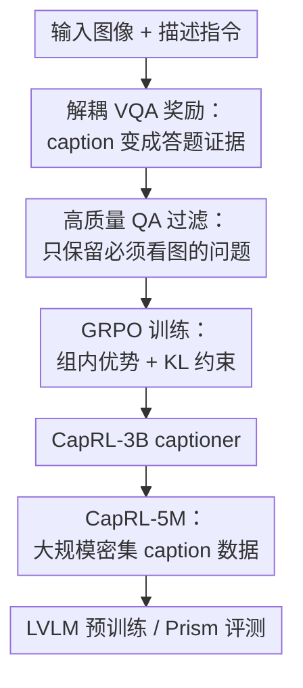

# CapRL: Stimulating Dense Image Caption Capabilities via Reinforcement Learning

**会议**: ICLR2026  
**OpenReview**: [https://openreview.net/forum?id=JLelnhqXaC](https://openreview.net/forum?id=JLelnhqXaC)  
**代码**: https://github.com/xxx (作者提供 CapRL Github Repository，具体地址以 OpenReview 页面为准)  
**领域**: 多模态VLM / 图像描述 / 强化学习  
**关键词**: 密集图像描述, RLVR, GRPO, 可验证奖励, 多模态预训练

## 一句话总结
CapRL 把主观的图像描述质量改写成“纯文本 LLM 能否只凭 caption 答对图像相关选择题”的可验证奖励，用 GRPO 训练 Qwen2.5-VL-3B 生成更稠密、更准确的 caption，并进一步产出 CapRL-5M 数据集，在多模态预训练和 Prism caption 评测中都显著优于 SFT 式 caption 数据。

## 研究背景与动机
**领域现状**：图像描述是连接视觉和语言的基础任务，也是很多 LVLM 预训练流水线里的关键数据来源。早期 caption 数据常偏短，后来 ShareGPT4V、ALLaVA、DenseFusion 等工作开始用强 LVLM、专家模型或人工流程生成更长、更细的描述，让模型在后续多模态对齐阶段获得更丰富的视觉监督。

**现有痛点**：主流 captioner 大多靠监督微调训练，需要人类或闭源模型标注的大规模图文数据。这个范式有两个问题：一是标注成本高、扩展性差；二是图像描述本身不是单答案任务，同一张图可以有许多正确描述，SFT 却把模型压向单个参考答案，容易让模型记住特定说法，而不是学会“怎样把图像里的信息完整组织成文本”。

**核心矛盾**：RLVR 在数学、代码等任务中有效，因为答案对错可以被客观检查；但 caption 是开放式文本，“好 caption”并没有唯一标准。直接让 LVLM-as-a-judge 或 reward model 打分，会把奖励模型自己的偏好暴露给策略模型：有的奖励偏短，模型会塌缩成极短描述；有的奖励偏长，模型会输出冗长但和图像无关的内容。这类 reward hacking 会让强化学习沿着错误方向优化。

**本文目标**：作者希望找到一种既客观、又能覆盖密集图像信息的 caption 奖励，让模型不必模仿单一标注，而是通过探索生成更多准确、全面、结构化的图像描述。同时，这种训练出来的 captioner 还要能低成本标注百万级图片，服务后续 LVLM 预训练。

**切入角度**：论文把 caption 质量定义为“效用”：如果一段描述足够细、足够准，那么一个看不到图片的纯文本 LLM 应该能仅凭这段描述回答关于图片的选择题。这个角度把主观审美判断转成可验证 QA 正确率，也自然鼓励 caption 覆盖物体、属性、数量、位置、图表文本等对回答问题有用的信息。

**核心 idea**：用“视觉-语言解耦 VQA”作为 caption 的客观奖励：LVLM 先写 caption，纯文本 LLM 再只读 caption 答多选题，答对率就是强化学习奖励。

## 方法详解

### 整体框架
CapRL 的整体流程分两层：训练时，它用一批经过过滤的图像选择题作为奖励环境，让策略 LVLM 对同一张图采样多条 caption，并根据纯文本 LLM 的答题正确率做 GRPO 更新；数据构建时，它再用训练好的 CapRL-3B captioner 标注 5M 图片，得到 CapRL-5M，用于后续 LVLM 预训练。关键在于奖励模型不再直接“评价 caption 像不像好 caption”，而是检查 caption 是否真的携带了回答视觉问题所需的信息。

在训练样本中，每张图配有若干多选题。策略模型看到图像和“详细描述图片”的指令后，生成一组候选 caption；每条 caption 都会和同一张图的问题配对，但答题者是一个看不到图像的 Qwen2.5-3B-Instruct。它只能依据 caption 选择答案，因此答题是否正确反过来衡量 caption 是否包含了相关视觉事实。

### 关键设计
**1. 解耦 VQA 奖励：把主观 caption 变成可验证答题正确率**

图像描述难以直接打分，是因为“详细”“准确”“有用”都容易变成主观偏好。CapRL 的关键转换是：不问奖励模型“你觉得这段 caption 好不好”，而问纯文本 LLM“只看这段 caption 能不能答对关于图片的问题”。给定策略模型生成的第 $i$ 条 caption $c_i$ 和第 $m$ 个问题 $q_m$，文本 LLM 输出 $a_m=M_L(c_i,q_m)$，单题奖励就是 exact match：若 $a_m=GT_m$ 则 $r(a_m)=1$，否则为 $0$。

这个设计的好处是奖励语义很硬：如果 caption 漏掉了图表里的数字、人物的动作、物体颜色或空间关系，LLM 就更可能答错；如果 caption 编造了内容，也可能诱导 LLM 选错。相比 LVLM-as-a-judge 的整体打分，它不容易被“我这段描述很全面”这种自夸式文本骗过，也不会因为 reward model 偏好短句或长句而把训练推向塌缩。

**2. 选项打乱与多次采样：让奖励更像 caption 质量而不是选项偏置**

多选题看似容易验证，但 LLM 对 A/B/C/D 选项位置可能有偏置；如果只问一次，奖励会混入“模型碰巧偏好某个选项”的噪声。CapRL 因此每次呈现问题时随机打乱选项，并从当前图像的 $M$ 个问题里采样 $N$ 次，让文本 LLM 独立作答，最终 caption 奖励取平均正确率：$R_{c_i}=\frac{1}{N}\sum_{k=1}^{N} r(M_L(c_i, Shuffle(q_{m_k})))$，其中 $m_k\sim\{1,\ldots,M\}$。

这个平均化机制让奖励更稳定，也让 captioner 必须覆盖更多方面的信息。单个问题可能只关注一个物体或一个数字，模型可以偶然写中；多轮采样覆盖不同问题后，只有更全面的描述才能持续拿高分。论文的采样轮数消融也验证了这一点：$N=1$ 的平均表现较低，增加到 $N=4$ 后明显改善，$N=8$ 时基本饱和。

**3. 高质量 QA 过滤：防止问题本身泄漏答案或不依赖图像**

如果问题不用看图就能答对，奖励就会失真：caption 写得再差，文本 LLM 也可能靠常识或问题措辞猜中答案。CapRL 专门构建了一个 QA curation 流程，先从自然图像、图表、文档、网页等来源收集图片，再用 Qwen2.5-VL-72B 自动生成多选题，最后用过滤模型检查问题是否真正依赖视觉内容。

过滤条件可以概括为 $Q=\{(q,a)\in D\mid M_{Vf}(q,I)=a \land M_{Vf}(q)\ne a\}$：同一个 LVLM 在看到图像和问题时应答对，但只看问题、不看图像时不能答对。这个条件把“问题自带答案”“靠世界知识能猜出来”“文字泄漏太明显”的 QA 排掉，留下约 75k 张图片及其 QA 对用于 GRPO。附录还显示，使用带泄漏的数据训练会让平均指标下降约 1.1%，说明 QA 质量直接影响奖励方向。

**4. CapRL-3B 到 CapRL-5M：把强化学习收益转成可扩展预训练数据**

CapRL 不只训练一个更会描述图片的模型，还把这个模型作为低成本标注器。作者用 Qwen2.5-VL-3B 初始化策略模型，经 CapRL 训练得到 CapRL-3B，然后用它标注 5M 图片，形成 CapRL-5M。图片来源包括 ShareGPT4V-1M、DenseFusion-1M，以及经过去重、安全和质量过滤的 3M 网络图片，覆盖自然图片、文档、图表和 UI 等场景。

这一步把 RLVR 的优势从“单个 captioner 的能力提升”扩展到“下游预训练数据质量提升”。如果 CapRL-3B 的描述更准、更细，那么用这些 caption 做 further pretraining 的 LVLM 会获得更好的视觉-语言对齐；实验中同样 1M 图片上，CapRL 标注版本比原 ShareGPT4V/DenseFusion caption 版本高出 2% 以上，也说明收益主要来自 caption 质量，而不只是图片集合更好。

### 一个完整示例
假设训练样本是一张婚礼现场照片，QA 集里有问题“穿白裙的人在做什么？”“画面左侧穿灰色西装的人是否戴眼镜？”“新娘手里拿着什么？”。普通 Qwen2.5-VL-3B 可能只写“几个人在婚礼上交谈”，这段 caption 对第一题可能勉强有用，但对眼镜、花束、人物动作都不够具体，文本 LLM 很容易答错。

在 CapRL 中，策略模型会对同一张图采样多条 caption。某条 caption 如果写清“新娘穿白裙、笑着拿着花束，左侧一名戴眼镜的男子穿灰色西装，并将文件或信封递给她”，那么纯文本 LLM 对上述问题的正确率会更高，这条 caption 在组内获得更大优势；另一条冗长但夹杂无关推断、或漏掉关键细节的 caption 则拿低奖励。经过多轮 GRPO，模型逐渐学会把视觉细节组织成可被 QA 使用的结构化文本，而不是简单追求长度。

### 损失函数 / 训练策略
训练采用 GRPO。对同一图像，策略模型 $M_V$ 采样一组 caption $\{c_1,c_2,\ldots,c_G\}$，CapRL 根据每条 caption 的多题平均正确率得到奖励，再计算组内均值和方差，将每条 caption 转成相对优势用于 policy gradient 更新。论文沿用 GRPO 的 KL 惩罚，把当前策略约束在参考模型附近，降低强化学习把语言分布推崩的风险。

训练数据方面，GRPO 奖励默认使用 Qwen2.5-3B-Instruct 作为纯文本答题 LLM，策略模型初始化自 Qwen2.5-VL-3B。作者强调这里不需要像 DeepSeek-R1 那样要求输出 `<think>` 或固定格式，因为 reward 直接从 caption 本身计算；这避免了给开放式 caption 额外套格式奖励，也降低了模型学会格式投机的机会。

CapRL-5M 的下游预训练评估沿用 ShareGPT4V 式三阶段流程：先用 BLIP-558K 做初始对齐，再用不同 caption 数据集做 further pretraining，最后用 Open-LLaVA-NeXT-1M 做 SFT。作者在 Qwen2.5-3B + Qwen2.5-ViT、Qwen2.5-7B + Qwen2.5-ViT、InternLM2.5-7B + CLIP-ViT-L 三种架构上验证，避免结论只绑定某个 backbone。

## 实验关键数据

### 主实验
第一组主实验看 CapRL-5M 作为预训练 caption 数据是否更有用。表格只摘平均分和几个最能体现密集视觉理解的指标；完整论文覆盖 12 个 benchmark，包括 InfoVQA、DocVQA、ChartQA、RealWorldQA、MathVista、SEED2Plus、MME-RW、MMB、MMStar、MMVet、AI2D、GQA。

| 架构 | Further pretraining 数据 | InfoVQA | DocVQA | ChartQA | MMVet | 平均分 |
|------|--------------------------|---------|--------|---------|-------|--------|
| Qwen2.5-3B + Qwen2.5-ViT | Vanilla | 43.9 | 81.0 | 72.7 | 41.0 | 55.5 |
| Qwen2.5-3B + Qwen2.5-ViT | DenseFusion-1M | 49.4 | 84.6 | 74.4 | 40.2 | 57.1 |
| Qwen2.5-3B + Qwen2.5-ViT | CapRL-1M | 56.2 | 87.3 | 78.0 | 50.0 | 59.7 |
| Qwen2.5-3B + Qwen2.5-ViT | CapRL-5M | 61.5 | 90.0 | 80.5 | 52.6 | 62.0 |
| Qwen2.5-7B + Qwen2.5-ViT | DenseFusion-1M | 53.5 | 87.8 | 76.7 | 49.7 | 60.2 |
| Qwen2.5-7B + Qwen2.5-ViT | CapRL-5M | 63.4 | 91.4 | 81.5 | 52.6 | 63.8 |
| InternLM2.5-7B + CLIP-ViT-L | DenseFusion-1M | 39.3 | 76.4 | 70.8 | 44.0 | 57.4 |
| InternLM2.5-7B + CLIP-ViT-L | CapRL-5M | 47.0 | 83.5 | 77.7 | 54.3 | 62.2 |

第二组主实验直接在 Prism Framework 下评估 captioner 的信息量。这里固定第二阶段纯文本答题 LLM，captioner 写出的描述越能支撑答题，benchmark 表现越高。

| Caption 模型 | 是否 GRPO 训练 | ChartQA | ChartQAPro | InfoVQA | MMStar | SEED | 平均分 |
|--------------|----------------|---------|------------|---------|--------|------|--------|
| Qwen2.5-VL-3B | 否 | 65.6 | 27.1 | 40.2 | 46.4 | 64.1 | 39.9 |
| Qwen2.5-VL-7B | 否 | 74.9 | 35.4 | 56.4 | 50.7 | 67.1 | 44.9 |
| Qwen2.5-VL-72B | 否 | 80.2 | 38.0 | 60.8 | 55.0 | 69.3 | 48.3 |
| UnifiedRW-as-Judge-3B | 是 | 54.9 | 25.1 | 33.6 | 45.4 | 61.2 | 38.4 |
| Qwen2.5VL-as-Judge-3B | 是 | 71.4 | 34.2 | 49.3 | 47.7 | 64.5 | 42.5 |
| CapRL-3B | 是 | 80.5 | 39.9 | 64.8 | 55.0 | 70.6 | 48.3 |

### 消融实验
| 配置 | 关键指标 | 说明 |
|------|---------|------|
| ShareGPT4V-1M | 平均 56.7 | Qwen2.5-3B + Qwen2.5-ViT 下原始 ShareGPT4V caption 数据 |
| CapRL-ShareGPT4V-1M | 平均 58.7 | 固定同一批 ShareGPT4V 图片，只把 caption 换成 CapRL-3B 标注，平均提升 2.0 |
| DenseFusion-1M | 平均 57.1 | 原始 DenseFusion caption 数据 |
| CapRL-DenseFusion-1M | 平均 59.9 | 固定同一批 DenseFusion 图片，换成 CapRL-3B caption 后平均提升 2.8 |
| CapRL-1QA-20k | 平均 48.0 | Prism 子集上每图只保留 1 个 QA，已比基线 40.6 高很多 |
| CapRL-2QA-20k | 平均 48.5 | 每图 2 个 QA，较 1QA 小幅提升 |
| CapRL-3QA-20k | 平均 48.5 | 每图 3 个 QA，基本饱和 |
| Sampling $N=1$ | 平均 47.3 | 奖励噪声较大，选项偏置影响更明显 |
| Sampling $N=4$ | 平均 48.4 | 多次采样后奖励更稳 |
| Sampling $N=8$ | 平均 48.3 | 继续增大采样轮数收益趋于饱和 |
| Leaking20k | 平均 47.4 | 使用存在泄漏的 QA 数据训练 |
| Refined20k | 平均 48.5 | 过滤后 QA 数据更可靠，平均高 1.1 |

### 关键发现
- CapRL-5M 在三种架构上都提升平均分，说明它不是只对 Qwen2.5-VL-3B 适配，而是能作为通用 high-quality caption 数据改善多模态对齐。
- 收益尤其集中在文档、图表和信息图场景，如 Qwen2.5-3B 设置下 InfoVQA 从 DenseFusion-1M 的 49.4 提到 CapRL-5M 的 61.5，ChartQA 从 74.4 提到 80.5，符合“密集 caption 更适合结构化视觉信息”的预期。
- 固定图片集合的消融很关键：同一批 ShareGPT4V 或 DenseFusion 图片，用 CapRL caption 替换原 caption 后仍能提升，说明主要增益来自描述质量，而不是图像来源差异。
- Prism 结果显示，CapRL-3B 的 caption 信息量接近 Qwen2.5-VL-72B；相反，用 UnifiedReward 或 Qwen2.5-VL-3B judge 做奖励会出现短文本偏置或长文本 reward hacking，指标明显落后。
- 每图一个 QA 就能带来大幅提升，说明 CapRL 的监督非常稀疏但有效；不过选项打乱和多次采样仍然必要，否则奖励会被 LLM 选项偏置污染。

## 亮点与洞察
- **把 caption 评价换成“可被使用”的评价**：论文没有纠结如何定义一个完美 caption rubric，而是问 caption 能否支撑下游答题。这种 utility-based reward 很适合开放式生成任务，因为它奖励的是信息是否被正确传达，而不是文本是否符合某个审美模板。
- **解耦设计降低 reward hacking 风险**：LVLM judge 既看图又看 caption，策略模型容易迎合 judge 的语言偏好；CapRL 让纯文本 LLM 只读 caption，答题错对直接绑定 caption 中的信息覆盖，投机空间更小。
- **QA 过滤是方法成败的隐形核心**：如果问题泄漏答案，训练会奖励无效 caption；如果问题太难或不稳定，奖励会变噪声。论文用“看图能答对、不看图答不对”的条件把 QA 质量转成可操作过滤规则，这比泛泛说“构建高质量 QA 数据”更扎实。
- **小模型 captioner 也能逼近大模型信息量**：CapRL-3B 在 Prism 平均分达到 48.3，与 Qwen2.5-VL-72B 持平。这说明很多 caption 能力可能不是参数规模不够，而是没有被合适奖励释放出来。
- **可迁移到其他主观但可检验的生成任务**：例如视频摘要可以用纯文本 QA 检验摘要是否覆盖事件，图表解释可以用问题回答检验数值和趋势，UI 描述可以用任务执行问题检验元素和状态是否写清。核心模式是先设计“看不到原始模态的 verifier”，再把生成文本当作唯一证据。

## 局限与展望
- CapRL 的奖励上限受 QA 覆盖影响。如果 QA 只问数量、颜色、文字等局部事实，模型可能更偏向写这些可考点，而不一定覆盖所有人类认为重要的视觉语义、叙事关系或审美信息。
- 纯文本 LLM 的抽取能力仍会影响 reward。附录显示 0.5B answer model 会明显弱于 3B，说明 verifier 太弱时无法稳定地区分好坏 caption；但更大的 7B/32B 带来的收益有限，实际部署需要在成本和鲁棒性间选择。
- 论文主要验证 image caption 和静态图像预训练，视频、长文档、多页 PDF、交互式 UI 等场景会引入更长上下文和更复杂的时序/结构信息，直接套用 MCQ reward 可能不够。
- QA 自动生成依赖 Qwen2.5-VL-72B，虽然训练后的 captioner 是 3B，但前期构建奖励数据仍有强模型成本；如果要扩展到更多语言、专业领域或低资源视觉类型，需要重新评估 QA 生成和过滤质量。
- CapRL 鼓励“能回答问题”的细节覆盖，但不直接优化 caption 的简洁性。论文中的例子显示它能减少无关冗长，不过在工业场景中可能还需要长度约束、任务条件化 caption 或多粒度输出，以适配不同下游用途。

## 相关工作与启发
- **vs SFT caption 数据构建**: ShareGPT4V、ALLaVA、DenseFusion 等方法主要依赖强模型或复杂管线生成参考 caption，再让模型模仿这些标注；CapRL 则用可验证 QA reward 训练 captioner，让模型通过探索学习什么信息值得写。它的优势是避免单参考答案限制，并能低成本扩展到 5M 数据。
- **vs LVLM-as-a-judge / reward model**: 直接让 judge 对 caption 打总体分数很容易带入偏好，UnifiedReward 偏短、Qwen2.5-VL judge 偏长，都会导致 reward hacking。CapRL 的奖励来自 answer correctness，因此更接近客观任务反馈。
- **vs RLVR 在数学和代码中的应用**: 数学有标准答案，代码有单元测试，caption 没有天然 verifier。CapRL 的启发是为主观任务构造“间接 verifier”：只要生成结果能让另一个模型完成客观任务，就可以把这个客观任务的结果作为奖励。
- **vs Prism Framework**: Prism 本来是一个解耦评测框架，用 captioner + text LLM 的两阶段过程评估 VLM 能力；CapRL 把相同思想从评测推进到训练，把 Prism 式 objective signal 变成 GRPO reward。
- **对后续研究的启发**: 很多多模态生成任务都可以从“输出本身好不好”转为“输出能不能作为中间表示支持另一个可验证任务”。这会把 reward design 从主观 rubric 工程转向任务设计工程，也可能成为开放式 RLVR 的一条通用路线。

## 评分
- 新颖性: ⭐⭐⭐⭐⭐ 将 RLVR 引入主观 image captioning，并用视觉-语言解耦 VQA 构造客观奖励，思路清晰且抓住了 reward hacking 的根因。
- 实验充分度: ⭐⭐⭐⭐⭐ 覆盖预训练、Prism 直接评测、同图像源消融、QA 数量、采样轮数、泄漏数据、answer LLM 大小等多个维度，证据链比较完整。
- 写作质量: ⭐⭐⭐⭐☆ 论文主线很清楚，图 1 和图 3 对问题与方法解释到位；不足是表格较密，部分附录案例和主文结论之间需要读者自己串联。
- 价值: ⭐⭐⭐⭐⭐ 对密集 caption 数据构建、VLM 预训练和开放式 RLVR 都有参考价值，尤其适合启发“用可验证下游任务定义生成质量”的后续工作。

<!-- RELATED:START -->

## 相关论文

- [\[CVPR 2026\] CaptionQA: Is Your Caption as Useful as the Image Itself?](../../CVPR2026/multimodal_vlm/captionqa_is_your_caption_as_useful_as_the_image_itself.md)
- [\[ICLR 2026\] GuirlVG: Incentivize GUI Visual Grounding via Empirical Exploration on Reinforcement Learning](guirlvg_incentivize_gui_visual_grounding_via_empirical_exploration_on_reinforcem.md)
- [\[ICLR 2026\] Breaking the SFT Plateau: Multimodal Structured Reinforcement Learning for Chart-to-Code Generation](breaking_the_sft_plateau_multimodal_structured_reinforcement_learning_for_chart-.md)
- [\[ICCV 2025\] SC-Captioner: Improving Image Captioning with Self-Correction by Reinforcement Learning](../../ICCV2025/multimodal_vlm/sc-captioner_improving_image_captioning_with_self-correction_by_reinforcement_le.md)
- [\[ICLR 2026\] MMDuet2: Enhancing Proactive Interaction of Video MLLMs with Multi-Turn Reinforcement Learning](mmduet2_enhancing_proactive_interaction_of_video_mllms_with_multi-turn_reinforce.md)

<!-- RELATED:END -->
