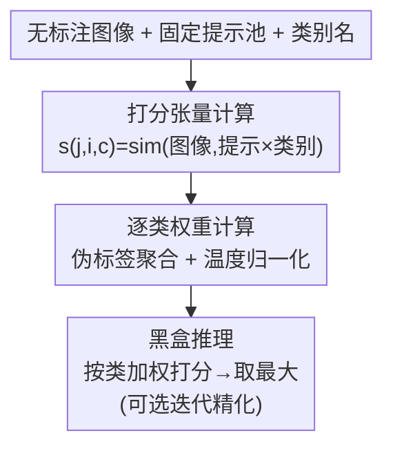

# CARPRT: Class-Aware Zero-Shot Prompt Reweighting for Vision-Language Model

**会议**: ICLR2026  
**OpenReview**: [https://openreview.net/forum?id=AScQDQqVXY](https://openreview.net/forum?id=AScQDQqVXY)  
**代码**: https://github.com/tmlr-group/CARPRT  
**领域**: 多模态VLM  
**关键词**: 视觉语言模型, 提示集成, 零样本分类, 黑盒推理, 提示重加权

## 一句话总结
CARPRT 指出现有 VLM 提示集成方法给每个提示模板分配的权重是「全类共享」的，违背了「不同提示对不同类别亲和度不同」的事实；它用一套免训练、纯黑盒（只查相似度分数）的两阶段流程，为每个类别单独估计一组提示权重，在 11 个零样本分类基准上稳定超过 MPE / WPE 乃至人工筛选提示。

## 研究背景与动机
**领域现状**：CLIP 这类视觉语言模型（VLM）做零样本分类的标准套路是「提示集成」——把类别名填进多个模板（如「a photo of a [label]」「a satellite photo of [label]」），算图像与每个文本描述的相似度，再聚合成该类的最终得分。聚合时最朴素的做法 MPE（Mean Prompt Ensembling）对所有模板等权平均；WPE（Weighted Prompt Ensembling，原名 ZPE）进了一步，用无标注测试图像给每个模板估一个数据驱动的权重，把「跟下游任务整体不搭」的模板降权。

**现有痛点**：WPE 给提示 $p_i$ 估出的权重 $w_i$ 是在**所有类别上共享**的——`a satellite photo of` 这个模板要么对所有类都重要、要么对所有类都不重要。但现实显然不是这样：`a satellite photo of` 配 `airport` 很贴切，配 `apple` 就荒唐；`a type of fruit` 这种后缀对 `strawberry` 是加分项，对 `lamb` 反而误导。作者在 Flower102 上做了一个对照实验（用真标签模拟「完美的逐类知识」），发现把 WPE 按类别分别施加后准确率明显上升，且不同类别的最优提示权重确实不同（图 1）。

**核心矛盾**：MPE / WPE 隐含地假设「提示权重与类别条件独立」——给定图像后，一个提示该给多大权重跟它描述的是哪个类无关。这个独立性假设直接限制了权重方案的表达力：它表达不出「同一个提示对 A 类是良药、对 B 类是毒药」这种关系。

**本文目标**：在「只有一组固定预设模板 + 一批无标注图像、且只能黑盒访问 VLM（只拿得到相似度分数）」的最实用设定下，估出**逐类**的提示权重，且不需要任何梯度、训练或真标签。

**切入角度**：作者先用一套概率框架把零样本分类写成 $\Pr(y^*\mid x^*, P, D)$ 的估计，证明类别无关权重等价于强加了一个会损失表达力的条件独立约束（命题 2：逐类权重能表示的图文关系集合**严格包含**类别无关权重的集合）。既然逐类更优是有理论保证的，剩下的就是怎么在没有标签的情况下把这组逐类权重估出来。

**核心 idea**：用「伪标签 + 打分聚合」代替「真标签监督」——对每张图、每个提示先伪标出最像的类，再统计「某提示在它自己认定的某类图像上能拿到多高的相似度」，以此作为该提示对该类的相关性权重。

## 方法详解

### 整体框架
CARPRT 的目标是求一个权重矩阵 $W^*\in\mathbb{R}^{n\times C}$（$n$ 个提示、$C$ 个类），第 $c$ 列 $W^*_c$ 是专属于类 $y_c$ 的一组提示权重，取代 WPE 那种「一列权重全类通用」的做法。整条流水线只做两件事、且全程只调用 VLM 的前向相似度查询：**第一步**用图像编码器与文本编码器算出一个三维打分张量 $s_{j,i,c}=\text{sim}(z^I_j, z^T_{i,c})$（第 $j$ 张图、第 $i$ 个提示、第 $c$ 类）；**第二步**从这个张量里先抽伪标签、再聚合成逐类权重矩阵。拿到 $W^*$ 后，测试时对每个类把各提示的相似度按其权重加权求和，取最高者为预测。

这套流程的合理性由一段概率推导托底：把零样本预测写成对权重空间的边缘积分 $\Pr(y^*\mid x^*,P,D)=\int_W \Pr(y^*\mid x^*,P,D,W)\,\Pr(W\mid P,D)\,dW$，其中权重后验 $\Pr(W\mid P,D)$ 的估计落到「类先验」与「类条件似然」上——前者用伪标签的经验分布近似（命题 1：随样本数增大以指数速率收敛到真分布），后者用能量模型把相似度当作负能量来建模。Lemma 1 进一步说明，逐类权重 $w_{i,c}$ 正是决定每个提示对各类似然贡献的量；CARPRT 的两个阶段，本质就是这套概率分析的「可计算实现」。

### 关键设计

**1. 逐类提示权重：一个提示的好坏要看它描述的是哪个类**

CARPRT 的全部出发点，是把 WPE「权重在类间共享」这条隐含假设拆掉。作者用概率框架给出了形式化理由：在能量模型视角下，图像 $x_j$ 在类 $y_c$ 下的相对似然正比于 $\exp\big(\sum_i (w_{i,c} z^T_{i,c})^\top z^I_j\big)$（Lemma 1），其中权重 $w_{i,c}$ **带类下标 $c$**——也就是说，最一般的提示集成形式本来就允许逐类权重。WPE 这类方案强行令 $w_{i,1}=w_{i,2}=\dots=w_{i,C}$，等于把一个本可逐类变化的量按死。命题 2 把这件事说死：类无关权重能表示的图文似然函数集合 $\mathcal{F}_{CI}$ 是逐类权重集合 $\mathcal{F}_{CS}$ 的**真子集**，所以存在某些图文关系类无关方案根本表达不出来。结论是：要榨干提示集成的潜力，权重必须逐类——这不是工程偏好，而是表达力上的硬约束。

**2. 打分张量：一次前向把所有「图×提示×类」相关性算齐**

要逐类估权重，先得有逐类的「相关性原料」。CARPRT 对无标注集 $D$ 里每张图 $x_j$、每个模板 $p_i$、每个类 $y_c$，算出相似度 $s_{j,i,c}=\text{sim}(z^I_j, z^T_{i,c})$，其中 $z^T_{i,c}=g(p_i(y_c))$ 是「把类 $y_c$ 填进模板 $p_i$」后的文本嵌入。这堆数构成一个 $m\times n\times C$ 的打分张量，每个元素都是 $\Pr(x_j\mid y_c,W,P)$ 的一个未归一化估计。关键在于：公式里虽然写成嵌入内积，**实际只需要 VLM 吐出的相似度标量**，不需要拿到嵌入向量本身——这让 CARPRT 能挂在一个只暴露「打分接口」的黑盒 CLIP 上跑。这张张量是后面一切聚合的唯一信息来源。

**3. 伪标签聚合 + 温度归一化：把打分张量压成逐类权重矩阵**

有了张量，怎么在没标签的情况下判断「提示 $p_i$ 对类 $y_c$ 到底有多相关」？CARPRT 的答案是「让提示自己投票」。先对每个（图，提示）对取最像的类，得到伪标签 $\hat{y}_{j,i}=\arg\max_{y_c} s_{j,i,c}$。然后对每个（提示，类）对，把**所有被该提示伪标成 $y_c$ 的图像**上的相似度做平均，得到中间权重

$$w'_{i,c}=\frac{\sum_{j=1}^m s_{j,i,c}\,\mathbb{1}_{\hat{y}_{j,i}=y_c}}{\sum_{j=1}^m \mathbb{1}_{\hat{y}_{j,i}=y_c}}.$$

直觉上，$w'_{i,c}$ 衡量「当提示 $p_i$ 自己把某图认成 $y_c$ 时，它给出的相似度有多强」——既反映相关性强度，又通过计数隐式编码了类先验（呼应命题 1 用伪标签估类分布）。最后对每个类把各提示的中间权重做带温度的 softmax 归一化：

$$w^*_{i,c}=\frac{\exp(w'_{i,c}/\tau)}{\sum_{j=1}^n \exp(w'_{j,c}/\tau)}.$$

温度 $\tau$ 控制分布尖锐度：$\tau<1$ 把权重集中到强提示上但牺牲多样性，$\tau$ 大则趋于均匀；实验里 $\tau=1.0$ 在相关性与多样性之间最平衡。归一化保证每类权重和为 1，维持概率合法性。整个第二阶段没有任何参数更新。

**4. 黑盒推理与可选迭代精化**

拿到 $W^*$ 后，测试图 $x^*$ 的预测是把各提示的相似度按其逐类权重加权聚合：$\hat{y}(x^*)=\arg\max_c \sum_{i=1}^n w^*_{i,c}\, s_{*,i,c}$，其中 $s_{*,i,c}=\text{sim}(z^I_*, z^T_{i,c})$。这一步同样只需要相似度分数，不碰参数、梯度或内部嵌入，所以是彻底的 score-only 黑盒推理。作者还给了一个可选的迭代精化：用当前权重把各提示的预测融合成更准的伪标签，再回去更新权重，如此交替——全程无梯度、无真标签，伪标签质量越高、权重估得越准，实验显示能稳定带来增量。

### 一个完整示例
设无标注集里有一批花卉图，提示池含 P1「a photo of a [ ], a type of flower.」、P2「satellite photo of [ ].」、P3「a close-up photo of the [ ].」。对某张 Marigold 图：P1 与 P3 给「Marigold」算出的相似度高、把它伪标成 Marigold，P2（卫星视角）则把它伪标到别处。在聚合阶段，统计所有「被 P1 伪标成 Marigold」的图像，P1 在 Marigold 上拿到的平均相似度很高 → $w'_{P1,\text{Marigold}}$ 大；而 P2 几乎从不把图认成 Marigold，对应计数小、权重低。归一化后，Marigold 这一列里 P1/P3 权重高、P2 权重几乎为零。反观 `airport` 这类类别，P2（卫星视角）就会拿到高权重。最终同一个提示 P2 在不同类的列里权重天差地别——这正是 WPE 那种「P2 全类一个权重」做不到的。

## 实验关键数据

### 主实验
11 个细粒度/大规模基准，三种配置（CLIP-ViT-B/16、CLIP-ResNet50、DeCLIP-ViT-B/32），统一用 Allingham et al. 的 247 个模板。下表为 CLIP-ViT-B/16 上的平均准确率（%）：

| 方法 | Flower102 | Pets | EuroSAT | ImageNet | 11 项平均 |
|------|-----------|------|---------|----------|-----------|
| MPE | 64.21 | 79.46 | 51.86 | 67.59 | 64.26 |
| Majority Vote | 67.20 | 81.27 | 52.07 | 67.98 | 65.08 |
| WPE | 66.60 | 82.38 | 49.60 | 68.28 | 65.13 |
| **CARPRT** | **71.36** | **89.13** | **55.56** | **68.59** | **67.45** |
| Human Selection* | 71.23 | 88.91 | 47.60 | 68.31 | 65.34 |

\* Human Selection 用 CLIP 作者人工筛的提示、引入外部知识，本不与自动方法直接可比；CARPRT 仍超过它。语义边界清晰的数据集（Flower102 +4.76、Pets +6.75 相对 WPE）增益最大，Aircraft 这类高度专业、伪标签本就难的域增益小。

### 消融实验

| 配置 | 11 项平均 | 说明 |
|------|-----------|------|
| CARPRT（完整） | 67.45 | 逐类权重 |
| CARPRT-Uniform | ↓ 平均 2.39 | 先算逐类权重再跨类平均成全局权重，保留打分机制但丢掉类级适配 |

分布漂移鲁棒性（CLIP-ViT-B/16，权重只在 in-distribution ImageNet 上估一次后直接迁移）：CARPRT 在 ImageNet 五个变体上平均 61.73，超过 WPE 的 61.08 与 MPE 的 60.51，全列最高。

### 关键发现
- **类级适配是收益主来源**：CARPRT-Uniform 把逐类权重平均掉后平均掉 2.39%，且仍优于 WPE，说明「打分机制」与「类级适配」各有贡献，但后者是关键。
- **温度不敏感**：$\tau=1.0$ 跨任务稳定，无需逐任务调参；过小过大都掉点（图 4）。
- **伪标签质量决定增益上限**：显式过滤低置信伪标签（按置信度/熵）只带来边际且不稳定的提升，说明不必显式过滤；反而迭代精化随伪标签变准而稳定上升。
- **更好的提示能放大收益**：把通用模板换成 LLM 生成的领域提示后 CARPRT 进一步变强，说明它对提示质量是「顺势而为」而非死磕通用池。

## 亮点与洞察
- **把「提示权重该不该逐类」从直觉升级成可证的表达力命题**：命题 2 用「可表示似然集合的真子集」关系，把「类无关权重更弱」说成数学事实，而不是又一个 trick——这让方法动机站得很稳。
- **伪标签 + 打分聚合替代监督**：在完全无标签、纯黑盒的约束下估出逐类权重，整套只用相似度标量、零梯度零训练，可以当成现有 CLIP 零样本流水线的即插即用替换件。
- **「让提示自己认类、再统计它在自己认的类上有多强」这个聚合设计很巧**：它同时编码了相关性强度和类先验，且天然对「某提示从不认某类」给出近零权重，思路可迁移到任何「多源打分、需按目标类自适应加权」的集成场景。

## 局限与展望
- **依赖初始伪标签质量**：在 Aircraft 等专业域，基座 VLM 的伪标签本身就差，CARPRT 增益受限——这是方法的天花板所在。
- **需要一批无标注图像来估权重**：纯单样本/即时场景下没有 $D$ 可统计，逐类权重就估不出；权重估计也对该集合的类覆盖与样本量敏感（ImageNet 大样本才有稳定迁移）。
- **理论用了能量模型 + 条件独立等简化假设**：相对似然推导依赖 $\ell_2$ 归一化嵌入与内积相似度等前提，实际 VLM 不完全满足，命题给的是方向性保证而非精确等式。
- **可改进方向**：把迭代精化与 LLM 生成的领域提示更紧地耦合，或对低质伪标签做更结构化的加权而非简单过滤，可能在专业域进一步抬升。

## 相关工作与启发
- **vs MPE（Mean Prompt Ensembling）**：MPE 对所有提示等权平均（$W$ 全 1 矩阵），CARPRT 给每类每提示一个学到的权重；MPE 在提示池含误导模板时直接被拖累，CARPRT 能把它们逐类降权。
- **vs WPE / ZPE（Allingham et al. 2023）**：WPE 是 CARPRT 最直接的对手，它给每个提示估一个**全类共享**权重；CARPRT 证明这等价于强加条件独立、损失表达力，并把权重扩展到逐类。CARPRT 复用了 WPE 的 247 模板与打分思路，但把「一列权重」变成「一个矩阵」。
- **vs Majority Vote**：多数投票只用每个提示的硬预测做众数，丢掉了相似度的连续信息；CARPRT 保留并聚合连续相似度，信息利用更充分。
- **vs LLM 生成类描述的路线**：那条路靠 LLM 生成更丰富的类描述提性能，但引入重计算开销、削弱零样本的「轻量」优势；CARPRT 不改提示内容、只改权重，且能与 LLM 提示叠加增益。

## 评分
- 新颖性: ⭐⭐⭐⭐ 「逐类 vs 类无关」的切入点清晰，并用表达力命题把直觉证成定理，少见的「动机有理论支撑」的小而美工作。
- 实验充分度: ⭐⭐⭐⭐ 11 基准 × 3 架构 + 分布漂移 + 温度/伪标签消融，覆盖到位；但都是分类任务，对「更广 VLM 应用」的承诺主要靠附录支撑。
- 写作质量: ⭐⭐⭐⭐ 概率框架与两阶段实现衔接顺，图 1 动机实验有说服力。
- 价值: ⭐⭐⭐⭐ 免训练、黑盒、即插即用，能直接挂到现有 CLIP 零样本流水线上，落地门槛低。

<!-- RELATED:START -->

## 相关论文

- [\[ICLR 2026\] SR-3D: 3D-Aware Region Prompted Vision Language Model](3d_aware_region_prompted_vision_language_model.md)
- [\[ICML 2026\] Density-Aware Translation of Spurious Correlations in Zero-Shot VLMs](../../ICML2026/multimodal_vlm/density-aware_translation_of_spurious_correlations_in_zero-shot_vlms.md)
- [\[ICLR 2026\] Naming to Learn: Class Incremental Learning for Vision-Language Model with Unlabeled Data](naming_to_learn_class_incremental_learning_for_vision-language_model_with_unlabe.md)
- [\[CVPR 2026\] Explaining CLIP Zero-shot Predictions Through Concepts](../../CVPR2026/multimodal_vlm/explaining_clip_zero-shot_predictions_through_concepts.md)
- [\[CVPR 2025\] Locality-Aware Zero-Shot Human-Object Interaction Detection](../../CVPR2025/multimodal_vlm/locality-aware_zero-shot_human-object_interaction_detection.md)

<!-- RELATED:END -->
