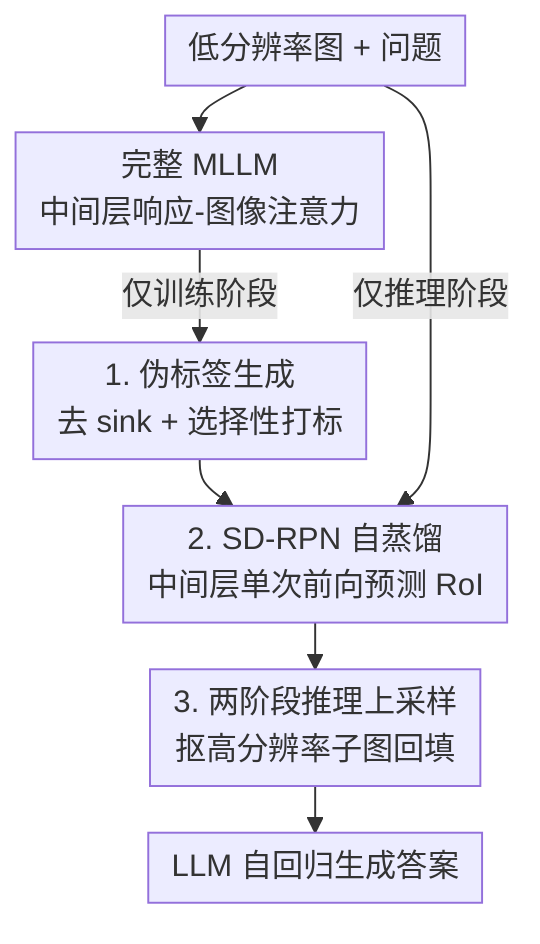

# Catching the Details: Self-Distilled RoI Predictors for Fine-Grained MLLM Perception

**会议**: ICLR 2026  
**OpenReview**: [https://openreview.net/forum?id=Cox6AaRyan](https://openreview.net/forum?id=Cox6AaRyan)  
**代码**: https://github.com/YuHengsss/SD-RPN  
**领域**: 多模态VLM  
**关键词**: 细粒度感知, RoI 定位, 自蒸馏, 注意力去噪, 高分辨率

## 一句话总结
本文提出 SD-RPN（Self-Distilled Region Proposal Network），把 MLLM 中间层那张又脏又糊的注意力图，经过去噪和选择性打标做成高质量伪标签，再用它训练一个挂在冻结主干上的小型 RPN，让模型在单次部分前向中就预测出感兴趣区域（RoI）；仅用 10K 问答对训练，就在 TextVQA / DocVQA / V-Star 等未见基准上拿到 10%+ 的绝对准确率提升。

## 研究背景与动机
**领域现状**：MLLM 要做细粒度感知（读小字、看图表、定位画面里的小物体）非常依赖高分辨率视觉输入，但整图喂高分辨率算力代价极高。近年主流转向 **RoI 范式**：先在低分辨率图上找到一块「值得放大的区域」，只把这块抠出来送高分辨率编码，性价比明显更优。

**现有痛点**：怎么找这块 RoI 是个老大难。一类是**训练式**方法（如 VILA-HD），靠大规模带框标注预训练，数据和算力都很贵，而且往往要先对低分辨率整图做一遍完整 prefill；另一类是**免训练**方法（如 ViCrop），直接拿模型内部的跨模态注意力当定位信号，但要么需要多次 prefill、要么得依赖又慢又串行的自回归解码阶段，推理效率低且不够准。

**核心矛盾**：定位精度和效率/标注成本之间存在三角拉扯——想准就得堆标注或反复前向，想省就只能用现成注意力却又太脏。**根因在于 MLLM 内部注意力虽然带有强 RoI 信号，但噪声太大**：存在「注意力沉没（attention sink）」token 抢走大量注意力、前景物体激活又不完整，直接拿来当稠密监督只会让模型学歪。

**本文目标**：在不依赖外部标注、不做全模型微调、也不依赖慢速自回归解码的前提下，训练出一个既准又快的 RoI 预测器。

**切入角度**：既然注意力信号「方向对但太糊」，那就别直接用它监督，而是先把它**净化成稀疏可靠的伪标签**，再让一个轻量网络去蒸馏这份净化后的知识。同时把 RoI 预测**搬到中间层**——研究表明 MLLM 中间层已具备充分的定位能力，于是只需跑到中间层的部分前向就能出 RoI，彻底和后段自回归生成解耦。

**核心 idea**：用「自蒸馏」把模型自己中间层的响应—图像注意力去噪打标成伪标签，训一个挂在冻结主干上的小 RPN，单次部分前向预测 RoI，替代昂贵标注与多次前向。

## 方法详解

### 整体框架
SD-RPN 解决的是「怎么又准又快地找 RoI」。整条流水线分训练与推理两段：**训练时**，给定图像和问答对，先让完整 MLLM 跑出中间层的响应—图像注意力图，经伪标签生成 pipeline 去噪、打标成 $\bar M_{RoI}$；同时一个由若干 transformer block 组成、初始化自 MLLM 第 $B$ 到 $B+R$ 层的 RPN 预测稠密 RoI 图 $\hat M_{RoI}$，用 BCE 损失向伪标签对齐——教师和学生共享同一套架构与权重来源，是典型的**自蒸馏**。**推理时**完整 MLLM 不再算注意力，RPN 只跑到主干第 $B$ 层这段部分前向就吐出 $\hat M_{RoI}$，后处理成二值前景掩码后抠出高分辨率子图，再拼回视觉序列让 LLM 自回归出答案。整个流程端到端训练，不碰原 MLLM 的权重。

### 关键设计

**1. 伪标签生成：把脏注意力净化成稀疏可靠的监督信号**

直接拿原始 RoI 图 $M_{RoI}$ 当监督会被两类噪声坑死：一是 **sink token**——一批语义上和目标无关、却凭借特征向量超大 L2 范数霸占注意力的视觉 token；二是前景—背景边界模糊、真前景激活不完整。本设计分两步净化。第一步**去 sink**：按预设范数阈值 $\tau_{norm}$ 把高范数 token 的注意力直接清零，得到更干净的 $M'_{RoI}$：

$$(M'_{RoI})_j = \begin{cases} 0 & \text{if } \|(H_v)_j\|_2 > \tau_{norm} \\ (M_{RoI})_j & \text{otherwise} \end{cases}$$

第二步**选择性标签分配**：作者在 TextVQA 子集上分析发现，相对注意力分（$a/a_{max}$）高（>0.2）的 token 约 40% 落在真值框内、低分（<0.1）约 10%，而**中段模糊区数量庞大却定位规律不清**——若做稠密回归，模型只会被这堆模糊区带偏。于是改成**三态打标**而非回归：只给高置信 token 打前景/背景，模糊的一律标 -1 忽略。形式上前景集 $S_{fg}=\{j\mid a_j\ge\tau_{fg}a_{max}\}$，背景集 $S_{bg}=\{j\mid j\notin B_{fg} \text{ 且 } a_j\le\tau_{bg}a_{max}\}$，其中 $B_{fg}$ 是包住所有前景 token 的最小包围盒，盒内未被判前景的 token 直接忽略，避免把真物体上「没激活到」的部分误当背景：

$$(\bar M_{RoI})_j = \begin{cases} 1 & j\in S_{fg} \\ 0 & j\in S_{bg} \\ -1 & \text{otherwise (ignored)} \end{cases}$$

这样既绕开了模糊区的误导，又用最小包围盒缓解了激活不完整，把一张糊图压成一份「敢打的才打、不确定就不打」的稀疏标签。

**2. SD-RPN 架构与自蒸馏：让中间层在一次部分前向里出 RoI**

要的是「准且快」，所以 RPN 被设计成挂在前 $B$ 层冻结 MLLM 主干之上的 $R$ 个 transformer block，并**用预训练 MLLM 第 $B$ 到 $B+R$ 层的权重做初始化**，直接继承已学好的表征。它不回归稀疏框，而是预测稠密 RoI 图 $\hat M_{RoI}$。具体地，对一个 $n$ 轮对话，从 RPN 倒数第二层取隐藏态，挑出每个用户问句**最后一个 token** 的隐藏态（它紧贴答案、最能代表「要定位什么」），拼成查询张量 $H_{RoI}\in\mathbb{R}^{n\times d}$；再用 RPN 最后一个注意力块的线性层把它和视觉 token 投影成 query/key，做一次矩阵乘得到 $\hat M_{RoI}=Q_{RoI}K_v^T$。这一步只需跑到主干中间层、单次前向，比 ViCrop 那种多次前向或依赖自回归解码的方案快得多（在 LLaVA-1.5-7B 上 RoI 预测阶段比 ViCrop 快 1.5×）。

训练用纯 **BCE 自蒸馏**对齐伪标签 $\bar M_{RoI}$。一个反直觉但关键的发现是：伪标签所依据的文本响应，**用 MLLM 自己预测的回答，比用更强的外部教师（如 GPT-4）或人工标注更好**（Tab. 4b 中 152K† 用 GT 响应反而掉到 60.7 vs 自生成 62.6）。作者归因于「表征一致性」——外部教师的回答虽更准，但它诱导出的注意力图对学生 RPN 是分布外的；自生成响应哪怕不完美，却和模型自身的视觉定位机制天然对齐，是更一致、更可达的蒸馏目标，尤其在数据稀缺时。这也让整个框架彻底摆脱对外部模型和标注的依赖。

**3. 两阶段推理：从稠密图到高分辨率回填的上采样策略**

推理时先把 $\hat M_{RoI}$ 后处理成干净二值掩码 $B$：reshape 成 2D、高斯滤波平滑、再用固定阈值 $\tau$ 二值化，以巩固激活区、抗噪。拿到掩码后有两种上采样：**Box Upscaling** 对每个连通区域各算一个最小包围盒、独立抠子图编码，能给小目标更高有效分辨率；**Masked Upscaling** 则用一个包住所有前景连通区并集的大包围盒抠单张子图，更能保住各前景元素之间的全局空间/位置关系，对结构化数据（图表、文档）更友好。两种策略抠出的高分辨率视觉 token 都被插回原视觉 token 之后，LLM 在增广上下文上自回归出最终答案。消融显示 Masked Upscaling 在 OCRBench/TextVQA 上更优且吞吐更高（0.62× vs 0.55×），故作为默认。

### 损失函数 / 训练策略
训练目标只有一项：$L_{BCE}(\hat M_{RoI}, \bar M_{RoI})$，忽略标签为 -1 的模糊 token。主干 MLLM 全程冻结，只更新 RPN 的 $R$ 个 block（默认 $R=3$），原模型权重不动，因此既非全模型微调、也无需任何带框标注。伪标签来自 GQA + OCR-VQA（分别覆盖自然场景与文本密集图）的混合数据，注意力取中间层；前景/背景相对阈值默认 $\tau_{fg}=0.2$、$\tau_{bg}=0.1$；高分辨率基准最多用 4096 个视觉 token。

## 实验关键数据

### 主实验
在 5 个文档/OCR 基准上，SD-RPN 接到 LLaVA-1.5、DeepSeek-VL、Qwen2.5-VL 三大家族上都能稳定涨点（吞吐相对 baseline，单卡 A6000）：

| 模型 | DocVQA | TextVQA | OCRBench | 平均 | 吞吐 |
|------|--------|---------|----------|------|------|
| LLaVA-1.5-7B | 21.5 | 46.1 | 31.4 | 27.5 | 1.0× |
| +S2 | 27.1 | 52.6 | 32.6 | 30.7 | 0.70× |
| +ViCrop | 27.0 | 57.2 | 33.2 | 31.8 | 0.42× |
| **+SD-RPN** | **34.2** | **58.8** | **37.3** | **34.6** | 0.62× |
| LLaVA-1.5-13B | 23.5 | 48.7 | 33.7 | 29.5 | 1.0× |
| **+SD-RPN** | **39.4** | **63.4** | **39.6** | **37.7** | 0.51× |
| DeepSeek-VL-7B | 50.7 | 63.0 | 42.4 | 49.6 | 1.0× |
| **+SD-RPN** | **67.2** | **71.5** | **47.9** | **57.5** | 0.40× |
| Qwen2.5-VL-7B | 92.0 | 81.1 | 81.5 | 81.5 | 1.0× |
| **+SD-RPN** | **93.6** | **83.5** | **82.9** | **84.5** | 0.57× |

视觉中心/高分辨率基准上，V-Star 平均提升 10%+，HR-Bench 提升 6%+，且在 Qwen2.5-VL-7B 上整体与依赖视觉 CoT、算力昂贵得多的 DeepEyes（90.1）相当（SD-RPN 89.5）：

| 模型 | V* 总分 | HR-4K | HR-8K |
|------|---------|-------|-------|
| LLaVA-1.5-7B | 50.3 | 37.5 | 33.8 |
| +ViCrop | 52.4 | 47.8 | 36.1 |
| **+SD-RPN** | **70.7** (↑20.4) | **47.3** (↑9.8) | **41.6** (↑7.8) |
| Qwen2.5-VL-7B | 78.0 | 72.5 | 63.6 |
| +DeepEyes† | 90.1 | 75.1 | 72.6 |
| **+SD-RPN** | **89.5** (↑11.5) | **78.5** (↑6.0) | **73.5** (↑9.9) |

### 消融实验
组件逐步叠加（LLaVA-1.5-7B，OCRBench/TextVQA/POPE/V* 平均）：

| 配置 | 平均 | 说明 |
|------|------|------|
| (0) Baseline | 53.4 | LLaVA-1.5-7B |
| (1) 直接用原始注意力 | 56.9 (↑3.8) | 脏信号直接定位，提升有限 |
| (2) RPN 回归注意力 (MSE) | 59.0 (↑5.3) | 蒸馏但仍学糊图 |
| (3) +选择性标签分配 | 61.4 (↑7.9) | 三态打标、忽略模糊区，跳涨 |
| (4) +去 sink token | 62.4 (↑9.0) | 去噪进一步加成 |
| (5) +Masked Upscaling | 62.6 (↑9.2) | 默认上采样，吞吐更高 |

主干深度上，$B15R3$（冻结 15 层 + 3 个 RPN block）达到峰值 62.6（↑9.2），更深反而回落；数据量上，仅 10K 样本就拿到 60.6（↑7.2），152K 也只到 62.6，呈现强数据效率。

### 关键发现
- **去噪 pipeline 是命脉**：从「回归原始注意力」(59.0) 到「选择性标签分配」(61.4) 是单步最大跳涨，印证了「别拿糊图做稠密监督、只打高置信标签」这一核心判断；去 sink token 再补上 1 个点。
- **自生成响应优于强教师**：用模型自己的回答做伪标签 (62.6) 反而胜过用 LLaVA SFT 的 GT 响应 (60.7)，说明蒸馏目标的「分布一致性」比「答案绝对正确」更重要。
- **数据效率极高**：10K 样本即逼近 152K 的效果，且全程不动原模型权重，落地成本低。
- **吞吐换精度但 RoI 这步更快**：两阶段推理整体吞吐降到 0.4–0.62×，但 RoI 预测这一步比 ViCrop 快 1.5×，把开销主要让给了真正有用的高分辨率回填。

## 亮点与洞察
- **「别用糊信号、先净化再蒸馏」**：把内部注意力当「方向对但太脏的弱标签」，用去 sink + 三态打标先净化，再让小网络蒸馏——这套「噪声信号 → 稀疏伪标签 → 轻量学生」的范式可迁移到任何想白嫖大模型内部信号又怕被噪声带偏的场景。
- **三态打标里的「忽略」最妙**：不是非黑即白，而是给模糊 token 一个 -1「不打分」，既避免误导又用最小包围盒补回激活不完整，是处理弱监督边界噪声的实用 trick。
- **把定位搬到中间层**：用部分前向 + 中间层权重初始化把 RoI 预测和自回归解码解耦，是「效率」提升的结构性来源，思路可复用到其他需要早退/早决策的 MLLM 任务。
- **自蒸馏胜过强教师的反直觉结论**：在数据稀缺蒸馏里，目标分布与学生的一致性可能比目标本身的精度更关键，这点对设计蒸馏目标有普适启发。

## 局限与展望
- 两阶段推理整体吞吐降到 baseline 的 0.4–0.62×，对延迟敏感的场景仍有代价；论文优化的是 RoI 这一步，高分辨率回填和增长的视觉 token 仍是开销大头。
- 伪标签质量受若干阈值（$\tau_{norm}$、$\tau_{fg}$、$\tau_{bg}$、二值化 $\tau$）影响，需经验设定；虽给了阈值消融，但跨模型族是否需重调未充分展开。
- 方法依赖「中间层已具备定位能力」「内部注意力方向正确」两个前提，对那些内部注意力本身就很弱或定位错位的模型/任务，去噪也救不回来。
- Box vs Masked Upscaling 各有所长（小目标 vs 结构化全局关系），目前靠固定默认而非按样本自适应选择，存在改进空间。

## 相关工作与启发
- **vs ViCrop（免训练裁剪）**：ViCrop 直接用内部注意力且需多次前向/慢解码来定位；本文先把注意力去噪打标再训一个 RPN，单次部分前向出 RoI，更准（V* 70.7 vs 52.4）也把 RoI 这步提速 1.5×。
- **vs S2 / VILA-HD（训练式高分辨率）**：它们靠全模型微调或大规模带框标注；本文冻结主干、零框标注、仅 10K 问答对自蒸馏，数据与算力成本大幅降低。
- **vs DeepEyes / Thyme（RL + 视觉 CoT）**：这类靠强化学习和视觉思维链做高分辨率推理，算力昂贵；本文在 Qwen2.5-VL-7B 上以远低成本达到相当水平（V* 89.5 vs 90.1）。
- **vs 经典自蒸馏**：传统自蒸馏多用于跨模态对齐/表征学习，本文把它专门用来从模型自身注意力里抽细粒度定位线索，并发现自生成响应优于外部强教师，拓展了自蒸馏在「定位知识转移」上的用法。

## 评分
- 新颖性: ⭐⭐⭐⭐ 「去噪注意力→伪标签→中间层 RPN 自蒸馏」组合新颖，自生成响应优于强教师的发现有洞见。
- 实验充分度: ⭐⭐⭐⭐⭐ 覆盖三大模型族、文档/OCR 与视觉中心两类共 8+ 基准，组件/层深/数据量/阈值消融齐全。
- 写作质量: ⭐⭐⭐⭐ 动机—痛点—方法链条清晰，图文对照到位。
- 价值: ⭐⭐⭐⭐⭐ 零标注、不动主干、10K 数据即 10%+ 提升，是提升 MLLM 细粒度感知的实用可扩展方案。

<!-- RELATED:START -->

## 相关论文

- [\[ICLR 2026\] SPECS: Decoupling Multimodal Learning via Self-distilled Preference-based Cold Start](specs_decoupling_multimodal_learning_via_self-distilled_preference-based_cold_st.md)
- [\[ICLR 2026\] GranViT: A Fine-Grained Vision Model For Autoregressive Multimodal Large Language Models](granvit_a_fine-grained_vision_model_for_autoregressive_multimodal_large_language.md)
- [\[CVPR 2026\] DiG: Differential Grounding for Enhancing Fine-Grained Perception in Multimodal Large Language Models](../../CVPR2026/multimodal_vlm/dig_differential_grounding_for_enhancing_fine-grained_perception_in_multimodal_l.md)
- [\[ICLR 2026\] P2P: Automated Paper-to-Poster Generation and Fine-Grained Benchmark](p2p_automated_paper-to-poster_generation_and_fine-grained_benchmark.md)
- [\[ICLR 2026\] UniF2ace: A Unified Fine-grained Face Understanding and Generation Model](unif2ace_a_underlineunified_underlinefine-grained_underlineface_understanding_an.md)

<!-- RELATED:END -->
