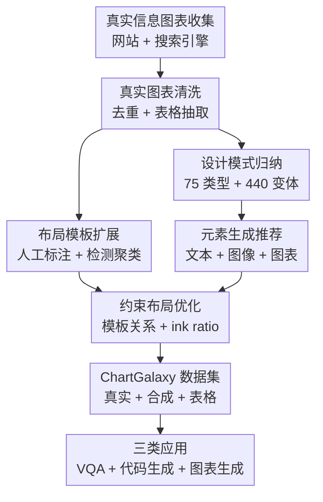

# ChartGalaxy: A Dataset for Infographic Chart Understanding and Generation

**会议**: ICLR2026  
**OpenReview**: [https://openreview.net/forum?id=P4lFbvZ4HH](https://openreview.net/forum?id=P4lFbvZ4HH)  
**代码**: https://github.com/ChartGalaxy/ChartGalaxy  
**领域**: 多模态VLM / 图表理解 / 数据可视化  
**关键词**: 信息图表理解, 图表生成, 多模态数据集, LVLM, D3.js

## 一句话总结
ChartGalaxy 构建了一个百万级信息图表数据集，通过从真实设计中归纳图表类型、视觉变体和布局模板，再程序化合成带表格监督的高质量信息图表，显著提升 LVLM 在信息图表问答、代码生成和示例驱动图表生成上的能力。

## 研究背景与动机
**领域现状**：图表理解数据集过去主要围绕普通统计图展开，例如柱状图、折线图、散点图等结构相对规整的 chart。这类数据集适合训练模型读取坐标轴、图例、数值和趋势，也支撑了 ChartQA、Chart-to-code、图表摘要等任务的发展。与此同时，真实传播场景里的数据可视化并不总是这种“干净图表”：新闻、商业报告、科普页面和社交媒体更常使用 infographic chart，把图表、图标、插画、文本块、颜色隐喻和复杂布局揉在一起讲数据故事。

**现有痛点**：LVLM 在普通图表上已经能做一定程度的视觉问答，但遇到信息图表会明显困难。原因不是单纯“图更花”，而是信息图表里的数据编码经常跨模态出现：某个图标可能代表类别，某段标题可能暗示数据事实，颜色或大小既承担视觉风格又承担数值编码，布局还会把文本、图片和图表区域交织在一起。已有 InfographicVQA、ChartQAPro 等数据集虽然开始覆盖信息图表，但规模较小，难以同时满足训练、评测和生成任务。

**核心矛盾**：信息图表数据集要同时满足两个很难兼得的目标。一方面，数据必须足够大、足够结构化，才能用于微调 LVLM 或构建可重复 benchmark；另一方面，图表必须保留真实设计中的多样性和美感，否则模型学到的只是模板化普通 chart，无法迁移到真实 infographic。纯网页采集能保留真实性但规模和标注受限；纯程序合成能放大规模但容易样式单一。

**本文目标**：作者希望构建一个既有真实设计来源、又能大规模合成、并且每张图都绑定源表格的数据集。这个目标可以拆成三个子问题：如何从真实信息图表中抽取可复用的设计模式；如何把表格、文本、图像和图表变成视觉协调的合成信息图；如何证明这个数据集不只是“收集得多”，而是真的能提升理解、代码生成和图表生成能力。

**切入角度**：ChartGalaxy 的关键观察是，真实信息图表虽然视觉上非常多样，但许多设计可以被归纳为有限的图表类型、图表变体和布局模板。只要这些结构模式来自真实设计，再用程序化方式把它们和大规模表格数据结合，就能在规模、可控性和设计复杂度之间取得比较实用的平衡。

**核心 idea**：用“真实设计归纳出的结构模板 + 程序化合成”的方式，把小规模但高质量的真实信息图表扩展成百万级、带表格监督、可用于 LVLM 理解与生成训练的数据资源。

## 方法详解

### 整体框架
ChartGalaxy 不是简单爬取一堆图片，而是把真实信息图表当作设计模式的来源，再把这些模式转化成可控的合成引擎。输入端包括真实信息图表、开放表格数据、图标/图片资源和图表设计 taxonomy；输出端是 61,833 张真实信息图表及其表格，以及 1,701,356 张程序化合成信息图表及其表格。整条 pipeline 可以理解为“先归纳设计语言，再用设计语言批量生成训练样本”。

第一阶段是现实世界数据收集。作者从 18 个 chart-rich 网站和带许可过滤的搜索引擎结果中收集信息图表，用 Perceptual Hashing 和 CLIP similarity 去重，再用多步 human-in-the-loop 流程抽取每张图对应的数据表。这样得到的真实部分不只是图片集合，而是“图片 - 表格”对。

第二阶段是合成数据创建。作者从真实图表里总结出 75 种图表类型、440 种视觉变体和 68 个布局模板，然后基于表格数据生成标题、副标题、图片、具体 chart variation 和布局。最终合成图由 D3.js 渲染，因而能够保留可执行、可解析的结构，也方便后续构建代码生成 benchmark。

第三阶段是应用验证。论文没有只停留在数据集统计，而是把 ChartGalaxy 分别用于三件事：微调 LVLM 做信息图表 VQA；构建 Direct Mimic 代码生成 benchmark，让模型从图像生成 D3.js；做示例驱动的信息图表生成，把用户表格转换成风格接近参考图的 infographic chart。

### 关键设计
**1. 从真实信息图表归纳设计模式：把“漂亮但不可控”的设计转成可复用结构**

信息图表最大的难点在于它不是单一视觉语法。普通柱状图只需要决定坐标轴、柱宽、颜色和标签，而信息图表还要决定标题放哪里、图标是否替代柱子、图片是否与图表重叠、文本块和图表区域如何组合。ChartGalaxy 的处理方式是先把真实设计拆成三层：图表类型描述数据如何可视化，图表变体描述同一类型下的视觉风格，布局模板描述文本、图像和 chart 区域的空间关系。

这个归纳过程让合成数据不再从空白画布随机生成。论文总结了 75 种图表类型和 440 种变体，并用 D3.js 实现这些类型与变体。D3.js 的选择很重要，因为信息图表常需要非标准元素形状、图标填充、复杂颜色和自定义布局，这些能力比普通 plotting library 更接近设计师实际会做的图。

**2. Human-in-the-loop 布局模板扩展：用检测模型扩大真实布局覆盖面**

如果只靠人工标注布局模板，规模会很快卡住；如果完全靠模型自动抽模板，又容易把检测错误当成新布局。ChartGalaxy 采用折中方案：先让三位作者人工标注 1,500 张来自 Statista 和 Visual Capitalist 的高质量真实图，得到 55 个初始布局模板；再用这些模板生成 120,000 张带 bounding box 标注的合成图，训练 InternImage + DINO 检测模型，去分析更多未标注真实图。

检测模型负责找 chart 区域和 image 区域，文本则由 PP-OCRv4 抽取。随后系统用 LTSim 衡量新检测布局与已有模板的相似度，低相似布局会被视为潜在新模板，再通过 k-means 聚类和人工检查中心样本，最终扩展出 13 个额外模板，总数达到 68 个。这个设计的价值在于：模型负责扩大候选覆盖，人负责把噪声挡在模板库外，因此模板既有规模又不至于失控。

**3. 表格到信息图的元素生成：让数据、文本、图像和图表语义对齐**

合成信息图表不能只把一个表格画成 chart，还需要生成和数据主题相配的标题、说明、图标和颜色。ChartGalaxy 先构建表格库：真实表格来自 VizNet、UN data、Our World in Data、Papers with Code，合成表格由 Gemini-2.0-Flash 生成；每个表格还补充 topic 和 data facts，用于后续生成语义一致的视觉元素。

文本生成采用 retrieval-augmented prompting：先用 Sentence-BERT 根据 topic 和 data fact 检索三个相近的真实信息图，再让 Gemini-2.0-Flash 生成标题与副标题。图像部分则从 681,459 个经过过滤和 caption 标注的图标/图片资源中检索，依据图像关键词与生成标题的语义相似度选择。chart 部分先依据数据列类型、数值尺度和时间模式确定候选 chart type，再在需要时让 Gemini 选择最合适的类型，并用 adaptive sampling 选择欠覆盖的变体，避免合成数据集中少数常见风格过度集中。

**4. 约束布局优化：在模板关系不变的前提下提高可读性和视觉密度**

有了文本、图像和 chart 元素后，直接把它们塞进模板并不够。信息图表既要紧凑，又不能让文字和视觉元素互相遮挡。论文把布局问题写成一个带硬约束的 packing optimization：模板 $t$ 给出元素之间的空间关系，元素集合 $E$ 要满足这些关系，同时最大化元素在紧包围框中的 ink ratio。

论文中的目标可以概括为最大化 $|\cup_i e_i| / |f(\cup_i e_i)|$，其中 $e_i$ 是元素像素集合，$f(\cdot)$ 表示紧致包围区域；约束包括 $g(E,t)=1$，即元素布局满足模板关系，以及任意两个元素轮廓之间的距离 $d(\partial e_i, \partial e_j) \ge p$。实现上，系统先用 rejection sampling 找到满足模板关系的初始位置，再用 grid search 调整位置和尺寸，减少无意义留白，同时避免元素碰撞。这样合成图既遵守真实设计模板，又能保持清晰和紧凑。

### 一个完整示例
假设输入是一张关于“各国淡水储量”的表格，包含国家名称和数值。ChartGalaxy 会先根据 topic 和 data facts 检索相近真实信息图，让 LLM 生成类似“Global Freshwater Reserves by Country”的标题和说明。接着系统根据表格结构判断这是类别 - 数值型数据，可映射到条形、排行或图标化数量展示等 chart type；如果选择条形/排行类变体，它会从图像库里检索与水资源、国家或地理主题相关的图标，并选择语义协调的蓝绿系或自然主题色板。

随后布局模块从 68 个模板里筛出能容纳标题、说明、图表主体和图像元素的候选模板。若某个模板要求标题在左上、chart 在中下、装饰图片在右侧，系统就把这些空间关系作为硬约束，先随机采样合法初始布局，再通过优化提高 ink ratio。最终得到的不是一张随机拼贴图，而是一张带源表格、明确 chart type、具体 variation、语义图标和可解释布局模板的信息图表样本。

### 损失函数 / 训练策略
ChartGalaxy 本身是数据集论文，没有提出一个端到端神经网络训练损失；核心“训练策略”体现在数据如何被用于下游模型。对于信息图表理解，作者从 70,248 张 ChartGalaxy 图表中构建 443,455 个问答对，覆盖文本推理、视觉元素推理和视觉理解三类问题，然后微调 InternVL3-8B 与 Qwen2.5-VL-7B。评测时，数值答案使用带 5% margin 的 relaxed accuracy，文本答案用 ANLS，多选题用 exact matching。

对于代码生成 benchmark，作者不直接比较模型输出的代码文本，而是把生成的 D3.js 渲染成 SVG 和 PNG 后比较结果。低层指标解析 SVG 元素，计算 area、text、image、color、position、size 六类相似度；高层指标由 GPT-4o 基于 PNG 判断整体视觉相似度；overall score 是二者平均。如果代码无法成功渲染，对应低层和高层分数都置为 0。这个评测策略比直接看代码字符串合理，因为同一张图可以由多种不同 D3 写法实现。

## 实验关键数据

### 主实验
第一组实验验证 ChartGalaxy 是否能提升 LVLM 的信息图表理解能力。作者用 ChartGalaxy 构造 instruction dataset 微调 InternVL3-8B 和 Qwen2.5-VL-7B，并在 InfographicVQA、ChartQAPro 以及独立人验评测集上测试。结果显示，公共 benchmark 上有稳定提升，独立评测集上的提升更大，说明原始 LVLM 对信息图表视觉样式和数据编码确实缺少训练覆盖。

| 模型 | 评测集 | 原始模型 | + ChartGalaxy | 提升 |
|------|--------|----------|---------------|------|
| InternVL3-8B | InfographicVQA | 76.19 | 79.99 | +3.80 |
| InternVL3-8B | ChartQAPro | 38.15 | 44.13 | +5.98 |
| Qwen2.5-VL-7B | InfographicVQA | 78.59 | 83.03 | +4.44 |
| Qwen2.5-VL-7B | ChartQAPro | 37.97 | 41.56 | +3.59 |
| InternVL3-8B | 独立评测集 Overall | 53.20 | 80.07 | +26.87 |
| Qwen2.5-VL-7B | 独立评测集 Overall | 56.50 | 80.35 | +23.85 |

第二组实验把 ChartGalaxy 用作代码生成 benchmark。500 张合成信息图表覆盖所有图表类型、变体和布局模板，模型需要从图像生成可执行 D3.js。结果显示，强闭源模型仍明显领先，但开源模型中的 Llama-4-Maverick-17B 已经超过 GPT-4.1-nano，说明该 benchmark 能区分不同 LVLM 的视觉结构复现能力。

| 模型 | 类型 | 执行成功率 | Low-Level Avg. | High-Level | Overall |
|------|------|------------|----------------|------------|---------|
| Gemini-2.5-Pro | Proprietary | 100.00 | 86.45 | 83.97 | 85.21 |
| GPT-4.1 | Proprietary | 100.00 | 83.16 | 76.84 | 80.00 |
| Claude-3.7-Sonnet | Proprietary | 100.00 | 83.15 | 76.66 | 79.91 |
| Llama-4-Maverick-17B | Open-Source | 99.60 | 64.51 | 58.06 | 61.29 |
| Qwen2.5-VL-72B | Open-Source | 92.60 | 61.96 | 52.21 | 57.09 |

### 消融实验
论文正文的“消融”更接近数据贡献和应用贡献分析，而不是单一模型模块 ablation。最有信息量的是独立评测集中不同问题类型的提升，以及示例驱动生成与通用图像生成模型的对比。前者说明 ChartGalaxy 对视觉理解类问题帮助尤其大；后者说明结构化图表生成比纯图像生成更能保证数据 fidelity。

| 配置 | 关键指标 | 说明 |
|------|----------|------|
| InternVL3-8B + ChartGalaxy | Style Detection +60.49 | 视觉风格识别提升最大，说明原始模型缺少 infographic style 训练信号 |
| InternVL3-8B + ChartGalaxy | Visual Encoding Analysis +40.78 | 模型更能识别颜色、图标、形状等视觉编码与数据维度的关系 |
| Qwen2.5-VL-7B + ChartGalaxy | Style Detection +58.95 | 另一个开源 LVLM 上也出现同类大幅提升，说明不是单模型偶然现象 |
| Qwen2.5-VL-7B + ChartGalaxy | Visual-Element DEC +26.38 | 视觉元素参与条件抽取时收益明显，贴近信息图表的核心难点 |
| Ours vs GPT-Image-1 | Fidelity 4.63 vs 2.10 | 结构化生成更能准确表达表格数据，避免标签错、比例错和元素错配 |
| Ours vs GPT-Image-1 | Aesthetics 4.14 vs 2.90 | 复用真实布局模板和丰富 chart variation 后，视觉质量明显优于纯图像生成 |
| Ours vs GPT-Image-1 | Creativity 3.95 vs 2.65 | 多样 chart type 与参考图风格迁移带来更丰富的生成结果 |

### 关键发现
- ChartGalaxy 对公共 benchmark 的提升不算夸张，但在专门的信息图表独立评测集上提升超过 23 个点，说明它主要补的是现有 benchmark 没充分覆盖的视觉复杂度。
- 提升最大的不是普通 data identification，而是 style detection 和 visual encoding analysis，这正好对应信息图表区别于普通 chart 的关键部分：图标、颜色、形状、排版和语义之间的关系。
- 代码生成 benchmark 里，闭源强模型的执行成功率普遍很高，但 size、image、position 等低层细节差异明显，说明“能写出可运行代码”和“能复现信息图表视觉结构”之间还有距离。
- 示例驱动生成实验显示，当前通用图像生成模型可以画出好看的图，但容易破坏数据 fidelity；ChartGalaxy 的结构化方法牺牲了一部分自由绘画能力，却显著提高了数据表达可靠性。

## 亮点与洞察
- 最大亮点是把信息图表这个看似“审美驱动”的对象拆成可训练、可合成、可评测的结构。75 种 chart type、440 种 variation、68 个 layout template 不是简单 taxonomy，而是连接真实设计和程序化生成的中间表示。
- 数据集同时服务 understanding 和 generation，这一点很有价值。很多图表数据集只能做 QA，或者只能做 code generation；ChartGalaxy 因为每张图都配表格，并且合成图由 D3.js 生成，所以天然能支持 VQA、Direct Mimic 和示例驱动生成。
- 论文的评测设计比较扎实：公共 benchmark 看迁移，独立评测集看专门能力，代码生成 benchmark 看结构复现，用户研究看生成质量。三组实验对应三个不同使用场景，避免了只用一个数字证明数据集价值。
- 对 LVLM 研究的启发是，复杂视觉理解不一定只能靠更大模型解决，也可以通过更贴近真实视觉语言的数据补齐能力盲区。信息图表中的视觉编码、风格和语义绑定，可能也是未来多模态模型做文档、报告、商业图形理解时的重要训练信号。
- 对数据可视化生成的启发是，纯 text-to-image 很难保证数值忠实；把生成过程拆成表格解析、元素推荐、图表渲染和布局优化，虽然更工程化，但更适合需要可信数据表达的场景。

## 局限与展望
- 论文承认当前 ChartGalaxy 主要聚焦 single-chart infographics，对 multi-chart narrative 覆盖不足。现实中的长图、报告页和 dashboard 往往由多个互相关联的图表组成，涉及叙事顺序、跨图引用和全局版式一致性，这部分仍待扩展。
- 真实图表部分出于版权考虑只发布 URL，不直接分发图片。这是合理的研究伦理选择，但也会带来可复现性问题：网页资源可能失效、更新或访问受限，后续使用者需要处理数据漂移。
- 合成图虽然来自真实模板归纳，但仍依赖规则、检索和 LLM 生成的标题/图像语义。某些合成样本可能在主题、图标隐喻或颜色语义上不如人工设计自然，特别是文化隐喻或抽象概念图标化时。
- 代码生成 benchmark 使用 GPT-4o 评估 high-level visual similarity，虽然实用，但仍引入 judge model 偏好。未来可以结合更多人工评估或任务导向指标，例如用户是否能准确读出数据事实。
- 示例驱动生成目前更像半结构化设计迁移，还没有真正解决多轮编辑、用户偏好控制和品牌风格约束。若要落地到设计工具，需要支持局部修改、版式锁定、可解释推荐和可编辑 SVG/D3 输出。

## 相关工作与启发
- **vs InfographicVQA**: InfographicVQA 主要从互联网收集 infographics，用于视觉问答评测；ChartGalaxy 的区别在于规模更大，并且聚焦 infographic chart，还显式提供表格监督和合成管线，因此更适合训练与生成任务。
- **vs ChartQAPro**: ChartQAPro 提供更难的图表问答 benchmark，覆盖 infographic charts、dashboards 和 plain charts；ChartGalaxy 更像基础数据资源和生成系统，除了评测模型理解，还能构建代码生成 benchmark 和训练示例驱动生成方法。
- **vs 普通 synthetic chart datasets**: 传统合成 chart 数据集通常从概率分布或在线表格生成普通图表，视觉结构较干净；ChartGalaxy 的贡献在于把图标、文本、图片、布局模板和 chart variation 都纳入合成过程，更接近真实传播中的复杂图形。
- **vs text-to-image 图表生成**: GPT-Image-1 这类模型擅长生成视觉上完整的图片，但对数值、标签和比例的 faithful rendering 不稳定；ChartGalaxy 的结构化生成路线牺牲了部分自由度，却更适合需要准确表达数据的 infographic chart。

## 评分
- 新颖性: ⭐⭐⭐⭐⭐ 数据集构造思路不是单纯扩规模，而是用真实设计归纳模板再程序化合成，切中了信息图表数据稀缺的根因。
- 实验充分度: ⭐⭐⭐⭐⭐ 覆盖理解、代码生成、示例驱动生成和用户研究，能从多个角度证明数据集价值。
- 写作质量: ⭐⭐⭐⭐ 论文主线清楚，图和表信息密度高；但部分细节放在 appendix，正文对真实表格抽取验证和合成质量控制还可以讲得更展开。
- 价值: ⭐⭐⭐⭐⭐ 对多模态图表理解、文档智能、数据可视化生成和可信图形生成都有直接复用价值。

<!-- RELATED:START -->

## 相关论文

- [\[CVPR 2026\] ChartNet: A Million-Scale, High-Quality Multimodal Dataset for Robust Chart Understanding](../../CVPR2026/multimodal_vlm/chartnet_a_million-scale_high-quality_multimodal_dataset_for_robust_chart_unders.md)
- [\[ICLR 2026\] Breaking the SFT Plateau: Multimodal Structured Reinforcement Learning for Chart-to-Code Generation](breaking_the_sft_plateau_multimodal_structured_reinforcement_learning_for_chart-.md)
- [\[ICLR 2026\] Understanding vs. Generation: Navigating Optimization Dilemma in Multimodal Models](understanding_vs_generation_navigating_optimization_dilemma_in_multimodal_models.md)
- [\[ICLR 2026\] A High Quality Dataset and Reliable Evaluation for Interleaved Image-Text Generation](a_high_quality_dataset_and_reliable_evaluation_for_interleaved_image-text_genera.md)
- [\[ICLR 2026\] TABLET: A Large-Scale Dataset for Robust Visual Table Understanding](tablet_a_large-scale_dataset_for_robust_visual_table_understanding.md)

<!-- RELATED:END -->
