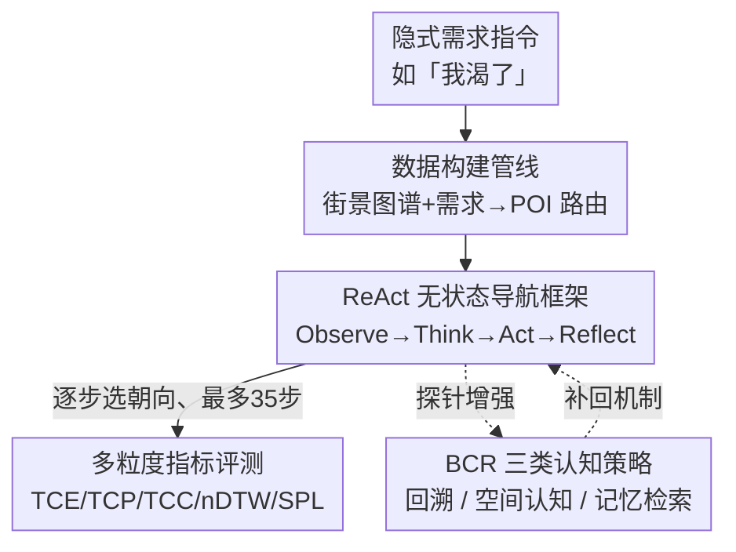

# CitySeeker: How Do VLMs Explore Embodied Urban Navigation with Implicit Human Needs?

**会议**: ICLR2026  
**OpenReview**: [https://openreview.net/forum?id=hzf23XSDcs](https://openreview.net/forum?id=hzf23XSDcs)  
**代码**: 待确认  
**领域**: 多模态VLM / 视觉语言导航 / Benchmark  
**关键词**: 具身城市导航, 隐式需求, 空间推理, VLM 评测, 认知地图

## 一句话总结
CitySeeker 构造了首个面向"隐式人类需求"的具身城市导航 benchmark（8 城、6,440 条真实街景轨迹、7 类需求），用统一的 ReAct 式导航框架评测 27 个 VLM，发现最强模型任务完成率也只有 21.1%，远落后于人类，并提出回溯 / 空间认知增强 / 记忆检索（BCR）三类受人类认知启发的策略把性能推到 26.9%。

## 研究背景与动机
**领域现状**：视觉语言导航（VLN）近年大量借助 VLM，但主流工作（Touchdown、Talk2Nav、map2seq 等）几乎都是**显式指令**导航——给一句逐步路书（"直走到喷泉雕塑右转，到麦当劳停"），agent 只需把文本和街景做直接匹配。

**现有痛点**：真实人对机器人 / 无人机 / AR 助手下达的命令往往是**抽象目标**而非路书，比如"我渴了""想找个能办公带 Wi-Fi 的地方"。这类需求在地图上根本没有标注，且是多层隐式的：功能上（"找厕所"要推断麦当劳里也有）、空间上（看到商场就推断里面大概率藏着星巴克 / 电影院）、语义上（"浪漫的""高档的"餐厅这种主观属性）。显式指令方法在这种动态、开放的城市场景里直接失效。

**核心矛盾**：解决隐式需求要求 agent 同时做**语义推断**（把抽象需求映射到可能的 POI 类别）和**视觉锚定**（在连续街景流里实时找线索确认"就是这里"），还要在长距离（5–25 步、最长 35 步）上把二者耦合起来多跳推理。人类靠**认知地图**（cognitive map）边走边更新空间理解、从抽象目标生成落地计划，而 VLM 在户外导航里这种内在空间智能尚未被验证。

**本文目标**：(1) 造一个能系统衡量 VLM "隐式需求驱动的视觉锚定"能力的 benchmark；(2) 诊断 VLM 在这个任务上到底卡在哪；(3) 探索哪些人类认知机制能补上短板。

**核心 idea**：用真实街景图构建跨城市的"需求→POI"导航 benchmark，把隐式需求设计成 7 类难度递增的任务，再用一套受人类认知地图启发的回溯 / 空间认知 / 记忆三类策略（BCR）去探针并改善 VLM 的空间推理。

## 方法详解

### 整体框架
CitySeeker 包含三块：一个**benchmark 数据集**（怎么从真实街景造出"隐式需求→目标 POI"的导航任务）、一个**统一导航评测框架**（把任意 VLM 包装成一个逐步走街景的 agent）、以及一组**BCR 探索性策略**（在框架上加回溯 / 空间认知 / 记忆来诊断并补强）。

任务被形式化成在导航图 $G=(V,E)$ 上的序列决策：$V$ 是带地理坐标的街景节点，$E$ 是可通行边。每一步 $t$ agent 处在节点 $v_t$，拿到自然语言指令 $W$ 和当前节点的多视角全景观测 $O_t=\{o_{t,1},\dots,o_{t,n}\}$，由策略 $\pi_\Theta$ 输出一个推理理由、一个动作（选哪个视角朝向走）和一个置信度：$(\Phi_t, a_t, c_t)=\pi_\Theta(W, s_t)$，环境按 $T(v_t,a_t)$ 转移到下一节点，直到 agent 自认到达或超过 35 步上限。导航本身遵循 ReAct 式的 Observe→Think→Act→Reflect 循环。关键的是基础框架**故意保持每步独立、不维护持久记忆**——这样才能干净地隔离出模型本身的空间推理能力，BCR 正是在此之上补上记忆等机制。

### 关键设计

**1. 隐式需求驱动的视觉锚定任务：把抽象命令拆成 7 类难度递进的导航**

这是 benchmark 的灵魂，针对"真实命令是抽象目标而非路书"这个痛点。所谓 Implicit-Need-Driven Visual Grounding，指 agent 要先用语义推断把一个隐式需求映射到一批候选目标，再在连续观测流里把它锚定到具体地点。作者把日常需求设计成 7 类，按认知难度从直接识别到高度抽象铺开：Basic POI（直接找设施 / 品牌）、Brand-Specific（找指定品牌，如星巴克，有强词汇 / 视觉锚点最好做）、Transit Hub（交通枢纽，需城市常识）、Latent POI（间接可见目标，如"厕所在麦当劳里"，最难之一）、Abstract Demand（抽象需求）、Inclusive Infra.（无障碍等包容性设施）、Semantic Preference（"适合团建的餐厅"这种主观语义）。整体分布上 POI 类约 19.2%、抽象需求 20.4%、品牌指定 23.4%、隐式 POI 23.0%。设计遵循三条标准：目标的语义复杂度、空间推理要求、现实适用性，从而覆盖从"认得出"到"推得出"的完整谱系。

**2. 需求驱动的真实街景数据构建管线：从全景图到可验证路由**

针对"隐式目标在地图上没标注、要用真街景"这个落地难题，作者设计了一条 demand-driven 管线，把 8 个跨国都市区（北京、上海、深圳、成都、香港、伦敦、纽约等）的真实街景变成可导航图。先从 Google / 百度街景采集 2024 年后的全景图，按**每 20 米一个节点**离散化路网，记录经纬度、朝向、可通行朝向等元数据，节点与边连成图存进 Neo4j；每个 POI 关联到**50 米半径内**的可见节点，形成 (Node)–has–>(VisiblePOI) 三元组，刻画"从这个视点能看见 / 能发现的地方"。问题生成上，先选高频 POI 类别，再人工把每类需求映射到一个或多个 POI（"我渴了"→饮品店 / 饮水机 / 咖啡馆）。路由生成用 A\* 在起止节点间求最短路，约束起点保证最短路落在可控半径内（附近没有别的同类 POI 抢答），产出 5–25 步的有效路线，最后人工核验终点处目标 POI 确实（间接）可见。为了证明"需求→POI"映射不是设计者拍脑袋，还做了 $N=120$ 的跨文化共识调查，与 ground truth 一致率达 83.39%。全集 6,440 条轨迹、超 41,128 张街景全景，再采样 1,257 条作为最终测试集。

**3. 无状态 ReAct 导航框架 + 多粒度评测指标：干净隔离空间推理能力**

针对"想知道模型本身行不行、而非工程 trick 行不行"，框架把当前全景切成多个对应可行朝向的透视视角，VLM 按 Observe（看当前观测）→Think（推断导航意图）→Act（选一个朝向移动）→Reflect（输出置信度）走一步，迭代到自认到达或超 35 步。**刻意不喂历史状态、不持久化记忆**，把模型核心空间推理隔离出来评测。评测用多粒度指标避免"一刀切"：任务完成度有三档——TCE（终点节点严格匹配，最严）、TCP（地理距离 $\le 50\text{m}$ 即算成功，容许目标从邻近多视点可见的空间模糊性）、TCC（终点与目标属同一类别即可，体现"到任一家餐厅"的实际灵活性）；路径质量用 nDTW（轨迹与 ground truth 的对齐）、SPL（成功率按路径长度加权的效率）、AS（平均步数）；外加 SPD（到目标的直线距离）。这套指标让"对但绕远"和"完全跑偏"能被区分开。

**4. BCR：三类受人类认知地图启发的探索性策略**

诊断出三大瓶颈——长程推理里的误差累积、空间认知不足、经验回忆缺失——后，作者对症提出 BCR 三组策略（在 650 样本子集上做），分别对应自我纠错、心智地图、经验回忆。**Backtracking（回溯，B）**纠正导航漂移：B1 当滑动窗口内平均置信度低于阈值 $\theta$ 就退回上一个可信节点（自监督、无需外部信号，但对 MiniCPM 这类弱模型反而掉点，因其自评不准）；B2 改用客观进度量——到目标的拓扑距离 $d_t$，当 $\bigvee_{i=0}^{k-1}(d_{t-i}>d_{t-(i+1)})$ 即距离连续 $k$ 步单调增大时回溯；B3 在 B1 回溯后再给方向提示，引导 agent 选 $a^*=\arg\min_{a\in A_t}\mathbb{E}[d_{t+1}\mid a_t=a]$ 这个最小化期望未来距离的动作。**Spatial Cognition Enrichment（空间认知增强，C）**补全环境意识：用 GPT-4.1 把多个 VLM 的成功 / 失败轨迹合成空间线索注入 prompt，C1 给结构化的拓扑认知图（节点=地点、边=可行转移，强制 agent 把决策锚在显式连通性上），C2 给相对位置图（用"左""略右"+估计距离描述地点关系，更直觉但无显式连通性）。**Memory-Based Retrieval（记忆检索，R）**克服碎片化决策：R1 拓扑检索按图连通性聚合多轮节点 / 边元数据，每步取 $h$-hop 邻域子图（访问次数、历史决策、边转移成功率、置信度），避免重蹈覆辙；R2 空间检索取固定欧氏半径内子图，强调地理邻近；R3 历史轨迹回看把最近的导航历史（空间数据、动作、决策理由）以滑窗形式拼进上下文，不依赖数据库遍历，是单回合内稳定推理的轻量方案。

## 实验关键数据

### 主实验
零样本评测 27 个多图 VLM（GPT-4o 系、Gemini、Qwen2-VL / Qwen2.5-VL、InternVL2.5 / 3、Llama-3.2 / 4、LLaVA、MiniCPM、Phi、MiniMax-01 等），并设人类、随机选择、永远前进三个参照基线（数字为 % ）。

| 模型 | TCE | TCP | TCC | SPL |
|------|-----|-----|-----|-----|
| Qwen2.5-VL-32B（最佳 VLM） | 2.6 | **21.1** | 6.2 | 12.7 |
| GPT-4o | 2.4 | 18.3 | 6.8 | 13.3 |
| InternVL3-38B | 2.5 | 19.3 | 6.7 | 10.6 |
| Gemini-2.5-Pro | 1.8 | 17.3 | 5.0 | 12.1 |
| Human（人类基线） | **5.7** | **30.1** | **13.5** | 21.2 |
| Random Choice | 0.7 | 13.9 | 3.2 | 3.8 |
| Forward Direction | 0.2 | 7.2 | 0.4 | 1.8 |

最强模型 TCP 仅 21.1%、TCE 仅 2.6%，远低于人类的 30.1% / 5.7%，且**部分模型还跑不过随机基线**。模型越大略好（更强的内部表征），但提升很有限；Qwen2.5-VL（空间感知 SFT + 高分辨处理）和 InternVL3（原生多模态预训练 + MPO）等开源模型反而有竞争力。人类在需城市常识的任务上优势最明显（Transit Hub：人类 34.9% vs 最佳 VLM 10.7%）。

### BCR 策略实验

| 策略 | 机制 | 代表效果（TCP） |
|------|------|------|
| Baseline | 无状态 ReAct | Qwen2.5-VL-32B 19.9 |
| B3 人类引导回溯 | 回溯+方向提示 | GPT-4o-Mini 18.2，nDTW 337.1→258.3 |
| C1 拓扑认知图 | 注入连通性结构 | GPT-4o-Mini 12.5→17.2 |
| R3 历史轨迹回看 | 单回合短期记忆 | GPT-4o-Mini 全策略最高 19.4 |
| R1 拓扑检索 | 多轮图记忆 | Qwen2.5-VL-32B 推到 **26.9**，nDTW 大幅降到 136.6 |

R 系（记忆）整体最强，能同时提升任务完成度与路径效率；B2/B3（外部进度信号 / 提示）比 B1（纯自信心）更普适；C1 更利于成功率、C2 更利于路径效率但有时牺牲完成率。

### 关键发现
- **隐式推断比直接识别难得多**：Brand-Specific（有强词汇锚点）最好做，Latent POI（间接可见，如推断厕所在麦当劳里）最难——暴露 VLM "认得出但推不出常识"的核心短板。
- **长程必崩**：步数 <20 时 nDTW 较小、轨迹更正确，到约 35 步 nDTW 高度发散，误差无法被整合进连贯空间记忆。两类典型错误：轨迹漂移（累积误差）和震荡绕路（开源模型超最优路径 40–60%，甚至反复回到同一节点的 looping）。
- **给全局 2D 地图反而掉点**：消融显示注入全局地图会降低任务完成度，说明把地图信息和视觉锚定融合本身就是难题。
- **城市差异**：GPT-4o 在纽约最好、北京较差，可能源于训练数据偏置或美国更网格化的街道布局；跨语言实验证明这不主要是语言因素。

## 亮点与洞察
- **"隐式需求"这一刀切得准**：把 VLN 从"照路书走"升级到"理解抽象意图再视觉锚定"，一下子把任务难度拉到逼近真实城市 last-mile 问题，且用 7 类难度谱系让诊断有颗粒度——这是把模糊的"空间智能"做成可测量基准的关键。
- **诊断→对症的 BCR 闭环很漂亮**：先用无状态框架隔离出三大瓶颈，再让 BCR 三策略一一对应（回溯治误差累积、空间认知治认知不足、记忆治回忆缺失），把"模型差在哪"和"怎么补"crystallize 成一个可迁移的三元组，对做具身 agent 的人有直接借鉴价值。
- **可复现且合规的数据策略可迁移**：不分发版权街景，只发轨迹元数据（Panorama ID + 坐标）+ 脚本现取图，既守 API 条款又保科学可复现——所有"依赖受版权视觉数据"的 benchmark 都能照搬这套思路。
- **多粒度指标值得借鉴**：TCE/TCP/TCC 三档把"严格到点 / 邻近可见 / 同类即可"分开评，避免单一阈值低估或高估，适合任何带空间模糊性的定位 / 检索任务。

## 局限与展望
- **绝对性能仍低、参照偏弱**：人类基线 TCP 也才 30.1%（只 10 名参与者），最强模型 21.1%，整体天花板偏低，使得很多模型间差异落在噪声区间，部分还跑不过随机基线，结论的区分力受限。
- **BCR 只在 650 样本子集上验证**：作为探索性分析说服力够，但策略在全集、跨城市的稳定性和组合增益（仅在附录讨论）还需更系统的验证。
- **无状态框架是双刃剑**：刻意去掉记忆便于隔离能力，但也偏离真实部署（真 agent 会用记忆 / SLAM），因此 baseline 数字更像"下界"而非可部署性能。
- **依赖在线街景 API**：现取图保证合规与复现，但 API 政策 / 街景更新会影响长期可复现性；且全景图来自 2024 年后，时间一致性也存隐患。
- **改进方向**：把 BCR 三机制端到端融进训练（而非 prompt 注入）、引入显式认知地图模块、以及探索为何全局地图会损害表现并设计更好的图—视觉融合。

## 相关工作与启发
- **vs 显式 VLN（Touchdown / Talk2Nav / map2seq）**：它们做逐步路书的"文本—视觉直接匹配"，本文做隐式需求驱动的语义推断+视觉锚定，区别在于目标抽象、地图上无标注、需多跳常识推理；本文优势是更贴近真实城市命令，劣势是任务太难导致绝对成功率低。
- **vs 室内 / 3D 游戏中的隐式需求理解（Wu/Hu/Zhang 等）**：先前对"理解人类需求"的探索多局限在室内和 3D 游戏等受控环境，本文首次把它搬到开放世界城市街景，引入动态视觉复杂度、自由形式指令和长程推理三重新挑战。
- **vs LLM 空间心智模型研究（Momennejad / Yang / Wu 等）**：与"大模型涌现世界模型 / 空间表征"的研究方向对齐，但本文不是探针式探测内部表征，而是用复杂城市导航任务系统评测 VLM 的涌现空间认知，并给出可操作的改善路径（BCR）。

## 评分
- 新颖性: ⭐⭐⭐⭐⭐ 首个隐式需求驱动的开放世界具身城市导航 benchmark，任务定义与 BCR 诊断框架都有原创性
- 实验充分度: ⭐⭐⭐⭐ 27 个 VLM + 人类 / 随机 / 前进基线 + 多粒度指标 + 跨城市 / 跨语言分析，很扎实；BCR 仅在 650 子集验证略有保留
- 写作质量: ⭐⭐⭐⭐ 动机—诊断—对症的逻辑清晰，图表丰富；任务类别与指标定义稍密集
- 价值: ⭐⭐⭐⭐⭐ 直指城市 last-mile 导航的真实痛点，benchmark + 可迁移的合规数据策略 + BCR 路线图对具身 VLM 社区价值高

<!-- RELATED:START -->

## 相关论文

- [\[AAAI 2026\] Explore How to Inject Beneficial Noise in MLLMs](../../AAAI2026/multimodal_vlm/explore_how_to_inject_beneficial_noise_in_mllms.md)
- [\[ACL 2026\] How Do LLMs and VLMs Understand Viewpoint Rotation Without Vision? An Interpretability Study](../../ACL2026/multimodal_vlm/how_do_llms_and_vlms_understand_viewpoint_rotation_without_vision_an_interpretab.md)
- [\[ICLR 2026\] How Do Medical MLLMs Fail? A Study on Visual Grounding in Medical Images](how_do_medical_mllms_fail_a_study_on_visual_grounding_in_medical_images.md)
- [\[CVPR 2026\] Explore with Long-term Memory: A Benchmark and Multimodal LLM-based Reinforcement Learning Framework for Embodied Exploration](../../CVPR2026/multimodal_vlm/explore_with_long-term_memory_a_benchmark_and_multimodal_llm-based_reinforcement.md)
- [\[NeurIPS 2025\] FlySearch: Exploring how vision-language models explore](../../NeurIPS2025/multimodal_vlm/flysearch_exploring_how_vision-language_models_explore.md)

<!-- RELATED:END -->
