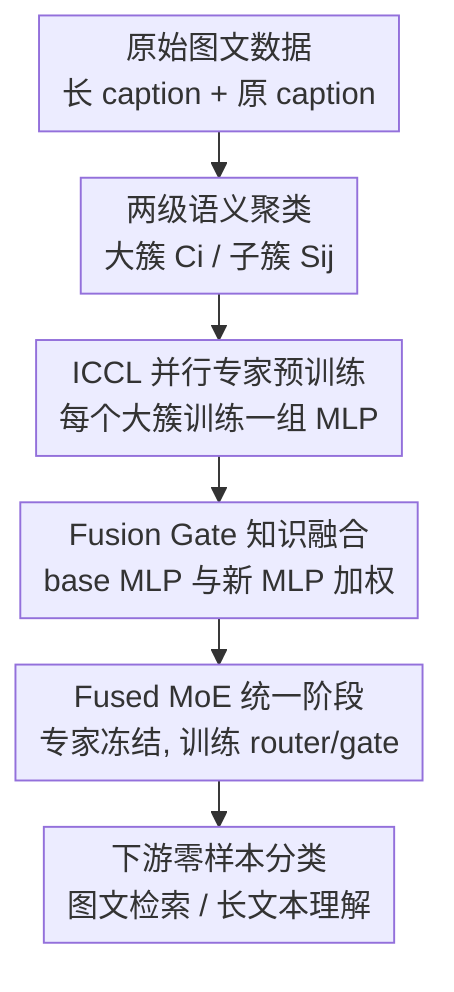

# CLIP-FMoE: Scalable CLIP via Fused Mixture-of-Experts with Enforced Specialization

**会议**: ICLR 2026  
**OpenReview**: [https://openreview.net/forum?id=RErUA45pI9](https://openreview.net/forum?id=RErUA45pI9)  
**代码**: 待公开  
**领域**: 多模态VLM / CLIP扩展 / MoE  
**关键词**: CLIP, 混合专家, 视觉语言预训练, 专家特化, 长文本检索

## 一句话总结
CLIP-FMoE 用“两级语义聚类先训专家、再冻结专家训练路由”的 Fused MoE 流水线扩展 CLIP，并通过 Fusion Gate 在预训练 MLP 与领域专家之间逐 token 融合，使模型在提升图文检索和长文本理解的同时尽量保住原 CLIP 的零样本分类能力。

## 研究背景与动机
**领域现状**：CLIP 类视觉语言模型已经成为零样本分类、图文检索和多模态生成中的基础组件。提升 CLIP 能力有几条常见路线：一是像 EVA-CLIP 那样直接扩大模型规模；二是用更细粒度、更长的 caption 数据继续训练；三是引入 MoE，让模型参数容量变大但每个样本只激活一部分专家。

**现有痛点**：直接扩大 dense CLIP 需要很长训练日程、大 batch 和大规模 GPU 集群，普通实验条件很难复现。长 caption 微调能增强细粒度理解，但常常会损伤原 CLIP 从大规模网页图文对中学到的粗粒度零样本分类能力。MoE 看起来适合扩容，但简单把原 MLP 复制成多个专家的 sparse upcycling 容易得到同质化专家；已有 CLIP-MoE 通过多阶段顺序训练制造专家差异，又引入了聚类误差累积和训练时间过长的问题。

**核心矛盾**：这篇论文面对的是“容量扩展”和“知识保持”的双重矛盾。一方面，CLIP 需要更多可组合的专家来学习细粒度视觉语言知识；另一方面，继续训练不能把预训练 CLIP 已经稳定掌握的 Internet keyword labeling 能力洗掉。若所有专家从同一个 MLP 复制后一起训练，路由可能只是在同质专家之间分配 token；若每个专家独立长时间顺序训练，又会牺牲可扩展性。

**本文目标**：作者希望构造一种资源更友好的 CLIP MoE 训练方式，使专家真的学到互补知识，同时统一模型仍能动态选择专家并保留原模型知识。具体来说，它要解决三个子问题：怎样让不同专家从一开始就面对不同语义区域；怎样避免 MoE 合并后重新训练把专家特化抹平；怎样让新知识和原 CLIP 知识在每个 token 上可调地融合。

**切入角度**：论文的观察是，原 CLIP 虽然在细粒度 caption 上不足，但它的图像特征仍然能把数据划分成语义相近的簇；这些簇正好可以作为专家训练的“任务边界”。作者因此不再让所有专家在全数据上竞争，而是先用 CLIP 图像特征做两级聚类，让每个专家在一个大簇内、一个个细子簇 batch 中学习，再把这些已经专门化的 MLP 系列装入统一 MoE。

**核心 idea**：CLIP-FMoE 用 Isolated Constrained Contrastive Learning 先并行训练语义专家，再用 Fusion Gate 把原 CLIP MLP 与 MoE 专家输出融合，从而同时追求专家特化、训练可扩展和预训练知识保持。

## 方法详解
### 整体框架
CLIP-FMoE 的对象不是从零训练一个视觉语言模型，而是在已有 OpenAI CLIP ViT-L/14 上把部分 Transformer MLP 层替换成 Fused MoE。整体流程分两阶段：第一阶段把训练数据按原 CLIP 图像特征聚成 $N$ 个大簇和每簇 $M$ 个子簇，并行训练 $N$ 组 MLP series；第二阶段把这些 MLP series 作为 MoE experts 放回统一模型，只训练 router 与 Fusion Gate，让完整模型在全数据上学习如何组合专家。

在模型层面，普通 Transformer block 中的 MLP 被改成“base MLP + 新专家输出”的融合结构。Stage 1 里，每个簇对应一份可训练 MLP series 和 gate，原模型其它参数冻结；Stage 2 里，来自不同簇的 MLP series 成为 MoE experts，专家权重冻结，只让 router 学 token 到专家的分配，并让 Fusion Gate 决定保留多少 base MLP 输出、接纳多少 MoE 输出。

### 关键设计
**1. 两级语义聚类与 ICCL：先把专家训练边界做实**

普通 sparse upcycling 的问题是专家都从同一个 dense MLP 复制而来，如果训练数据和梯度也高度混合，专家很容易学成彼此相似的函数。CLIP-FMoE 先用原 CLIP 图像 encoder 提取全数据 embedding，再用 K-means 把数据分成 $N$ 个语义大簇 $\{C_i\}_{i=1}^{N}$；每个大簇内部继续分成 $M$ 个细子簇 $\{S_j^{(i)}\}_{j=1}^{M}$。大簇负责给不同专家分配粗粒度领域，子簇负责让一个 batch 内的负样本语义更接近、更难。

这种设计的关键不只是“聚类后训练”，而是隔离训练与受约束采样一起发生。第 $i$ 个专家只在 $C_i$ 上训练，且一个 mini-batch 从同一个子簇 $S_j^{(i)}$ 里抽样。这样做相当于把 CLIP-MoE 的顺序多阶段继承，改成了可并行的“先切语义区域再各自深挖”。专家之间不会因为同一批数据而互相挤压，batch 内又不会因为随机采样过宽而产生太容易的负样本，因而更容易学到互补的细粒度视觉语言特征。

**2. Fusion Gate：让新专家补充 CLIP，而不是覆盖 CLIP**

长 caption 或细粒度数据微调常见的副作用是 catastrophic forgetting：模型在检索任务上变强，却丢掉了原 CLIP 在 ImageNet、Cars、Pets 等零样本分类上的稳定知识。CLIP-FMoE 在每个被替换的 MLP 层旁边保留 base MLP，并引入一个逐 token、逐维度的 gate $G(x) \in [0,1]^D$ 来融合旧知识与新知识：

$$
E_{agg}(x)=G(x)E_{base}(x)+(1-G(x))E_{new}(x), \quad G(x)=\sigma(Linear(x)).
$$

这里 $E_{base}$ 是冻结的预训练 MLP 输出，$E_{new}$ 在 Stage 1 是某个簇训练出来的新 MLP，在 Stage 2 是 router 汇聚后的 MoE 输出。这个公式的含义很直接：当输入 token 更需要原 CLIP 的稳健语义时，gate 可以偏向 $E_{base}$；当细节描述、长 caption 或特定视觉属性更需要新专家知识时，gate 可以提高 $E_{new}$ 权重。论文的消融也说明，只在 Stage 2 加 gate 会让 base 表征过强、压制专家学习；完全不加 gate 又会损害零样本分类。两阶段都使用 Fusion Gate 才能在保持与补充之间取得较好的动态平衡。

**3. Fused MoE 统一：冻结专家，只学习如何路由和融合**

Stage 1 结束后，模型已经得到 $N$ 组面向不同语义大簇的 MLP series。CLIP-FMoE 没有把它们重新全量微调，而是把这些 MLP 复制进统一 MoE 层作为 experts，并从头初始化 router。Stage 2 训练时专家权重保持冻结，只训练 router 和 Fusion Gate；router 用 TopK 选择专家，MoE 输出为 $E_{moe}=\sum_i R(x)_i E_k^{(i)}(x)$，其中 $R(x)=Softmax(TopK(xW))$。

冻结专家看似保守，但正是为了避免统一训练阶段把 Stage 1 学到的差异抹平。路由器只需要学习“这个 token 应该用哪些专家组合”，而不是重新塑造专家本身；Fusion Gate 再决定 MoE 专家输出与 base MLP 输出的比例。论文还加入了 MoE token balance regularization，减少少数专家被过度使用的问题。于是 Stage 2 的训练成本很小，却能把多个专门化专家组织成一个可推理的统一 CLIP。

### 一个完整示例
假设训练集中有一张汽车内饰图和五条相关 caption：一条原始短 caption，加上四条 LLaVA-ReCap 生成的细粒度长描述片段。Stage 1 开始时，原 CLIP 图像 encoder 先把它映射到 embedding 空间；K-means 可能把它归入“车辆/机械外观”一类大簇 $C_i$，再在该大簇内分入一个更细的子簇 $S_j^{(i)}$，例如同一子簇里多是汽车、仪表盘、座椅材质或道路场景。

训练第 $i$ 个专家时，Constrained Sampler 会从同一个子簇里凑满 batch。这样该图像的负样本不再是随机网页图像，而是语义接近的车辆相关样本，模型必须分辨颜色、部件、视角和场景描述等细节。这个专家因此更可能成为车辆细粒度专家。等 Stage 2 合并时，一张汽车图的 token 可能被 router 分给车辆专家和一般物体专家；Fusion Gate 对“car”“dashboard”“leather seat”等细节 token 更多使用专家输出，对较通用的类别语义则保留 base CLIP 的输出。最终模型既能在 Cars 这类细粒度分类上减少退化，也能在图文检索中利用更长、更具体的描述。

### 损失函数 / 训练策略
训练目标沿用 CLIP 式对比学习，但把一张图像对应的多个正 caption 合并进 multi-positive 版本。若每张图像有 $L$ 条正 caption，权重为 $\gamma_c$ 且 $\sum_c \gamma_c=1$，Stage 1 使用双向加权 InfoNCE：

$$
L_{multi-pos}=\frac{1}{2}\left(\sum_{c=1}^{L}\gamma_c InfoNCE(I,T^c)+\sum_{c=1}^{L}\gamma_c InfoNCE(T^c,I)\right).
$$

Stage 2 在全数据上训练统一 MoE，并加入负载均衡项：

$$
L_{moe}=L_{multi-pos}+\alpha L_{balance}, \quad \alpha=0.01.
$$

主实验使用 OpenAI CLIP ViT-L/14，在 CC3M 的 LLaVA-ReCap 版本上微调。由于原 CLIP context length 是 77，作者把超过长度的长 caption 按句子拆成多个语义连贯的子 caption，并额外保留原始 CC3M caption，因此每张图像有 $L=5$ 个正文本。主设置采用 $N=4$ 个专家、TopK=2，Stage 1 每个大簇再分 $M=64$ 个子簇；长文本实验把 context length 从 77 扩到 248，使用 ShareGPT4V，$L=2$，分别对应完整长 caption 和首句短 caption。

## 实验关键数据

### 主实验
主实验首先看零样本分类。这里最重要的不是 CLIP-FMoE 是否超过原始 OpenAI CLIP，而是它在额外训练后能否比普通 fine-tuning 和 MoE baselines 少忘一点。表 1 显示，普通 fine-tuning 平均准确率从 69.62 掉到 66.08；CLIP-MoE 和 upcycling 也仍在 66.x；CLIP-FMoE 回到 68.65，虽然仍略低于原始 CLIP，但在所有继续训练方法里最好。

| 方法 | Cars | FGVC | Food | EuroSAT | ImageNet-1K | ImageNet-v2 | 平均 |
|------|------|------|------|---------|-------------|-------------|------|
| OpenAI CLIP | 77.93 | 31.77 | 93.07 | 62.59 | 75.54 | 69.84 | 69.62 |
| Fine-tuning | 69.12 | 25.83 | 91.34 | 65.20 | 72.89 | 66.39 | 66.08 |
| Up-cycling | 68.98 | 27.66 | 90.78 | 69.98 | 72.92 | 66.27 | 66.69 |
| CLIP-MoE | 71.20 | 27.81 | 91.27 | 65.13 | 73.19 | 66.86 | 66.47 |
| CLIP-FMoE | 74.62 | 29.58 | 92.32 | 68.31 | 74.87 | 68.66 | 68.65 |

在标准图文检索上，CLIP-FMoE 的收益更直接。使用 CC3M LLaVA caption、77-token context 的设置下，它在 MS COCO、Flickr8K、Flickr30K 上的平均 R@1/R@5 汇总分达到 82.68，高于 CLIP-MoE 的 82.29，也明显高于原始 CLIP 的 73.96。长文本设置中，CLIP-FMoE 平均达到 77.2，高于 TULIP 的 75.9 和 LongCLIP 的 73.9，说明该方法不是只适合短 caption 的 CLIP 微调。

| 任务设置 | 代表数据集 | OpenAI CLIP | 强 baseline | CLIP-FMoE | 主要结论 |
|----------|------------|-------------|-------------|-----------|----------|
| 标准检索 | MS COCO / Flickr8K / Flickr30K | 73.96 | CLIP-MoE 82.29 | 82.68 | MoE 专家带来稳定检索收益 |
| 长文本检索 | DOCCI-Long / IIW-Long / Urban / DCI | 63.3 | TULIP 75.9 | 77.2 | 248-token 场景下仍能受益 |
| 扩展零样本分类 | 17 个分类集 | 69.86 | LongCLIP 68.91 | 69.51 | 长上下文训练后仍较好保持分类能力 |

### 消融实验
论文的消融围绕三个问题展开：专家是否真的专门化，Fusion Gate 是否必要，聚类方式和专家数是否敏感。专家分析中，作者强制所有 token 只走某个单一专家，发现不同专家在 Cars、Food、ImageNet、COCO/Urban/DCI 检索上优势不同，而统一 MoE 往往能匹配或超过单专家，说明路由组合不是纯装饰。

| 消融/分析 | 观测结果 | 说明 |
|-----------|----------|------|
| 单专家 vs 统一 MoE | Expert 4 在多项检索任务上强，Expert 1/2/3 在不同分类域上有各自优势；统一 MoE 多数情况下更稳 | ICCL 产生了互补专家，而不是四个重复 MLP |
| 无 Fusion Gate | 检索表现尚可，但零样本分类最弱 | 新数据训练覆盖了原 CLIP 知识，forgetting 明显 |
| 只在 Stage 2 加 Fusion Gate | 分类较强，但检索任务失败较多 | base 表征支配融合，专家补充能力不足 |
| 两阶段都加 Fusion Gate | 分类、标准检索、长文本检索最平衡 | gate 需要从专家训练阶段就参与知识对齐 |
| 图像两级聚类 | 在标准检索和长文本/细粒度检索中最好 | CLIP 图像特征比文本特征更适合作为专家划分依据 |
| 专家数 $N$ 增加 | 分类可能提升，检索可能下降 | 更多专家带来组合空间，也带来路由与任务偏好的 trade-off |

### 关键发现
- CLIP-FMoE 的主要价值不是简单把平均分推高，而是改善“继续训练后的退化曲线”：相比普通 fine-tuning，它显著减轻零样本分类下降，同时在检索任务上获得实质提升。
- Fusion Gate 是防遗忘的关键模块。没有它时，MoE 专家学到的新知识会更容易覆盖 base CLIP；只在统一阶段使用它，又会让专家在 Stage 1 没有充分学习互补表示。
- 两级图像聚类比随机、文本聚类和图文组合聚类更稳，说明原 CLIP 图像 encoder 虽然不是完美的细粒度模型，但仍能提供足够好的语义边界来训练专家。
- 训练效率是这篇论文的实用亮点。表 5 中 CLIP-FMoE 的总训练时间为 53.24 分钟，而 CLIP-MoE 为 193.51 分钟，减少约 72.5%；代价是推理 FLOPs 从 CLIP-MoE 的 112.44 GFLOPs 增至 128.22 GFLOPs。
- CLIP-FMoE 对长上下文也有效。它把 CLIP 文本 context 扩到 248 后，仍能在标准检索、长 caption 检索和扩展分类集合上保持较均衡表现。

## 亮点与洞察
- 把“专家特化”从 MoE 路由训练问题前移成数据划分问题，这是很实际的工程判断。与其指望 router 在同质专家中自然分工，不如先让专家在不同语义区域中独立长出差异。
- Fusion Gate 的设计很朴素，但击中了 CLIP 微调的核心痛点。它没有把预训练知识当成初始化后可以丢掉的历史包袱，而是显式保留一条 base MLP 通道，让模型逐 token 决定何时相信旧 CLIP、何时调用新专家。
- 这篇论文把 CLIP-MoE 的顺序专家训练改成并行训练，明显更适合扩展。若未来专家数继续增加，Stage 1 的并行性会比多阶段继承更重要。
- Constrained Sampler 是容易被忽略的小设计。它让对比学习 batch 内负样本来自同一细子簇，相当于提高了负样本难度，也使每个专家学到的不是粗糙领域标签，而是簇内更细的判别特征。
- 这个思路可以迁移到其它视觉语言适配任务，比如视频-文本、多语种图文检索或医学图文对齐。只要已有 base encoder 能给出可用聚类边界，就可以先训练局部专家，再用轻量 router/gate 统一。

## 局限与展望
- 作者承认目前对语义聚类如何影响最终性能理解有限。实验显示图像两级聚类最好，但还没有解释哪些簇会形成好专家、哪些簇会导致路由偏置或领域碎片化。
- 实验主要围绕 CLIP ViT-L/14 和 ViT-B/16，且 MoE 替换的是部分 MLP 层。对更大 CLIP、不同 ViT 层选择、更多专家和更大 TopK 的扩展规律还需要更系统验证。
- CLIP-FMoE 的推理 FLOPs 高于 CLIP-MoE 和 upcycling。对训练资源紧张但推理吞吐同样敏感的场景，需要进一步评估它的部署收益是否覆盖额外推理开销。
- 论文的代码在文中标注为接收后公开，当前复现实验还依赖作者实现细节。尤其是 caption 切分、子簇采样、gate 初始化和并行专家训练调度，都会影响复现结果。
- 后续可以加入更可解释的路由分析，例如看不同数据域、不同 token 类型、不同文本长度下 router 和 Fusion Gate 的权重分布，从而判断模型到底什么时候用专家、什么时候回退到 base CLIP。

## 相关工作与启发
- **vs Sparse Upcycling**: Sparse Upcycling 直接把 dense MLP 复制成多个专家，优势是初始化简单、成本低，但专家同质化严重。CLIP-FMoE 的区别在于先用聚类数据并行训练专家，再合并成 MoE，使专家初始状态就包含不同语义知识。
- **vs CLIP-MoE**: CLIP-MoE 也试图让 CLIP 的 MoE 专家多样化，但采用多阶段顺序训练，容易累积聚类误差且训练慢。CLIP-FMoE 把训练改成独立并行的 ICCL，再用统一阶段只训 router/gate，训练时间大幅降低。
- **vs LongCLIP / TULIP**: LongCLIP 和 TULIP 主要关注文本 context 扩展和长 caption 对齐，能提升长文本理解，但可能牺牲部分零样本泛化。CLIP-FMoE 不只扩长文本，还通过 Fusion Gate 保留原 CLIP 知识，因此在长文本检索和分类保持之间更均衡。
- **vs DreamLIP / FLAIR / FG-CLIP**: 这些方法更多从数据质量和细粒度 caption 角度提升 CLIP。CLIP-FMoE 与它们并不冲突，反而可以把高质量长 caption 数据作为专家训练材料，用 MoE 结构吸收更丰富的细节知识。
- **启发**: 对基础模型做领域扩展时，不一定要在“全量微调”和“纯 adapter”之间二选一。先用 base model 找到数据中的自然子域，再训练可冻结、可路由、可融合的专家，是一种兼顾可扩展性和知识保持的中间路线。

## 评分
- 新颖性: ⭐⭐⭐⭐☆ 把两级聚类、并行专家预训练和 Fusion Gate 组合到 CLIP MoE 中，思路清楚且针对性强，但各个组件本身都建立在已有 MoE/CLIP 微调技术之上。
- 实验充分度: ⭐⭐⭐⭐☆ 覆盖零样本分类、标准检索、长文本检索、专家分析、gate 消融和效率对比，证据链较完整；不过聚类机制和更大规模专家设置还可以更深入。
- 写作质量: ⭐⭐⭐⭐☆ 论文结构清晰，图 1 和图 2 能帮助理解两阶段训练和模型结构；部分附录表格较多，核心机制解释仍可再加强。
- 价值: ⭐⭐⭐⭐☆ 对想在有限资源下扩展 CLIP、同时避免长 caption 微调遗忘的研究者很有参考价值，也为 VLM 中的可并行专家构建提供了可迁移范式。

<!-- RELATED:START -->

## 相关论文

- [\[ICLR 2026\] UniLIP：改造 CLIP 以统一多模态理解、生成与编辑](unilip_adapting_clip_for_unified_multimodal_understanding_generation_and_editing.md)
- [\[ICML 2026\] Toward Structural Multimodal Representations: Specialization, Selection, and Sparsification via Mixture-of-Experts](../../ICML2026/multimodal_vlm/toward_structural_multimodal_representations_specialization_selection_and_sparsi.md)
- [\[ICLR 2026\] Unlocking the Power of Co-Occurrence in CLIP: A DualPrompt-Driven Method for Training-Free Zero-Shot Multi-Label Classification](unlocking_the_power_of_co-occurrence_in_clip_a_dualprompt-driven_method_for_trai.md)
- [\[ICLR 2026\] Massively Multimodal Foundation Models: A Framework for Capturing Interactions with Specialized Mixture-of-Experts](massively_multimodal_foundation_models_a_framework_for_capturing_interactions_wi.md)
- [\[ICML 2025\] LADA: Scalable Label-Specific CLIP Adapter for Continual Learning](../../ICML2025/multimodal_vlm/lada_scalable_label-specific_clip_adapter_for_continual_learning.md)

<!-- RELATED:END -->
