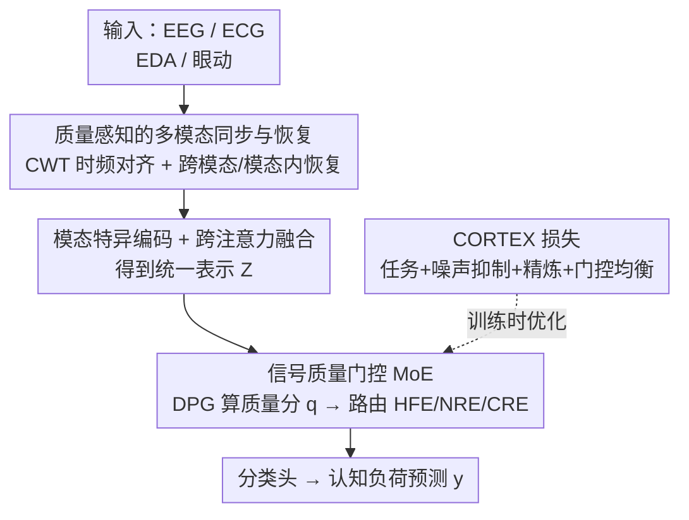

# CogMoE: Signal-Quality–Guided Multimodal MoE for Cognitive Load Prediction

**会议**: ICLR2026  
**OpenReview**: [https://openreview.net/forum?id=UtbSWdWv0F](https://openreview.net/forum?id=UtbSWdWv0F)  
**代码**: https://github.com/shahaamirbader/CogMoE  
**领域**: 多模态时序 / 生理信号 / 混合专家 / 认知负荷预测  
**关键词**: 认知负荷, 信号质量, 混合专家, EEG/ECG/EDA/Gaze, 质量感知门控

## 一句话总结
CogMoE 把多模态生理信号（EEG/ECG/EDA/眼动）的认知负荷预测从"按模态融合"重构为"按信号质量融合"——先用小波同步与跨模态恢复清洗噪声/缺失/错位，再用三个分别擅长干净/含噪/恢复信号的专家加质量感知门控自适应路由，配合 CORTEX 多目标损失，在 CL-Drive / ADABase 上比强基线最高提升约 13 个百分点。

## 研究背景与动机
**领域现状**：认知负荷（cognitive load, CL）预测在驾驶、航空、医疗等安全攸关场景里很关键——脑力负荷过高会拖慢反应、恶化决策。近年靠 EEG、ECG、EDA、眼动等多模态生理传感，大规模 CL 预测已经可行，主流做法要么单模态建模，要么把几路信号做朴素融合（feature/early fusion），近期也有 transformer 做跨模态整合。

**现有痛点**：真实部署里瓶颈不是缺传感器或模型容量，而是**生理信号质量本身又差又不稳定**。运动伪迹、电极漂移、传感器掉线会让信号含噪、时间错位、片段缺失。现有方法两头都没接住：数据侧大多假设输入是干净的，不做伪迹/缺失的预处理与恢复；模型侧通常**按模态分派专家**，没有针对实时质量波动的自适应机制。结果是一旦进入嘈杂环境性能急剧下滑，典型准确率被卡在 70–80%。

**核心矛盾**：传统多模态设定里不同模态提供**互补**信息，但 CL 预测里 EEG/ECG/EDA/眼动在对齐之后**很大程度是同一认知过程的冗余视角**。既然冗余，真正决定预测好坏的变量就不是"哪个模态在场"，而是"这一刻哪路信号干净、哪路被污染"。于是按模态身份分配专家这条路从根上就错配了。

**本文目标**：(1) 在进专家之前先把异构信号对齐、把缺失补回来；(2) 让模型在推理时按**实时信号质量**而非模态身份去调度专家；(3) 在含噪/缺失下稳定训练、防止专家坍缩。

**切入角度**：既然信号质量才是限制因素，就把多模态建模的"基"从模态身份换成估计出来的信号质量——干净信号、含噪信号、被掩蔽/恢复信号各交给一个特化专家，用一个实时质量评分来路由。

**核心 idea**：用"信号质量引导的 MoE"替代"模态引导的 MoE"——把路由准则从 modality identity 改成 estimated signal quality，并配一套同步恢复前处理和质量感知损失。

## 方法详解

### 整体框架
CogMoE 是一个端到端、两阶段的质量感知 pipeline。输入是 EEG/ECG/EDA/眼动四路生理信号（采样率各不相同、含噪、可能缺段），输出是二分类的认知负荷标签。**第一阶段**是"质量感知的多模态同步与恢复"，相当于一个预重建步骤：先把不同采样率的信号在时频域对齐，再用跨模态/模态内两步恢复把被污染或缺失的片段补回来，给下游一个更干净的输入。**第二阶段**是"信号质量特化的专家建模"：模态特异编码器先把各路信号编成嵌入并融合成统一表示 $Z_m$，经跨注意力后送进动态通路门控（DPG），由 DPG 依据实时质量分把特征路由到三个专家（擅长干净/含噪/恢复信号）组成的 MoE，最后过分类头出预测。整个网络由 CORTEX 损失统一优化，在任务精度、噪声抑制、表示精炼与专家均衡之间动态配重。贯穿全程的核心理念是：路由不看"这是哪个模态"，而看"这一刻信号有多干净"。

### 关键设计

**1. 从模态身份到信号质量：路由准则的重构**

这是全文的根。传统 MoE（SwitchTransformer、FlexMoE 等）按模态或语义内容分派专家，隐含假设各路输入都可靠；但生理信号对齐之后 EEG/ECG/EDA/眼动大多是同一认知状态的重叠视角，真正的差异不在"是哪个模态"而在"这一路此刻有多干净"。CogMoE 据此把专家的特化维度从模态改成质量：设三个专家分别对应高保真、含噪、被掩蔽/恢复三种质量区间，由一个动态门控按实时估计的质量去选。这个重构看似只换了路由变量，却让冗余的多模态生理数据第一次被"按需"使用——干净时走轻量专家、被污染时走抗噪专家，而不是不分青红皂白地把四路一起喂。

**2. 质量感知的多模态同步与恢复：先清洗再建模**

针对"信号错位 + 片段缺失"这个数据侧痛点，本阶段分两步。**时频同步**：DTW 之类时域对齐对尖峰和突变敏感、容易给出不稳定结果，作者改用连续小波变换（CWT，复 Morlet 小波）把每路信号 $S_m$ 投到二维时频表示 $W_m$，同时抓住瞬态（尖峰）和慢变（如 ECG/EDA 缓慢趋势）；对齐被转写成时频域的二维互相关，取相关最大处为最优平移，若有多个极大值则选时间与频率偏移最小的那个：

$$\Delta t^*, \Delta f^* = \arg\min_{t',f'}\Big(\arg\max_{t',f'}(W_i * W_j)(t',f')\Big)$$

相比纯时域相关，时频表示利用了频谱信息，在噪声和非平稳动态下对齐更稳。**多模态恢复**：先按其他模态在局部邻域的聚合能量 $H_m(t,f)$ 是否超阈值生成缺失掩码 $M_m$，再做两步补全——跨模态插值用其他完好模态加权填补缺口 $W^c_m(t,f)=\sum_{m'\neq m}\alpha_{m'}\beta_{m'}W_{m'}(t,f)$（$\alpha$ 反映局部时频相似度、$\beta$ 做幅度归一化）；模态内补全则把掩蔽区当成低秩矩阵补全问题，用核范数最小化 $W^{final}_m=\arg\min_{W_m}\|W_m\|_*$ s.t. 观测位置不变，强制全局低秩、保留周期性与平滑过渡。两步合起来既借了模态间冗余、又守住了各路自身的生理结构，给专家阶段一个可靠输入。

**3. 信号质量门控的 MoE：三专家 + DPG 动态路由**

这是第二阶段的核心。三个专家各司一种质量区间：**高保真专家 HFE** 针对干净信号（SNR > 15 dB），用两层 FC + ReLU 的轻量 FFN 兼顾效率；**抗噪专家 NRE** 针对含噪输入，用带残差连接和噪声感知归一化的扩展 FFN，残差抓细粒度特征、归一化压住运动伪迹/环境干扰带来的波动；**上下文精炼专家 CRE** 针对被掩蔽或初步恢复的片段，在嵌入层用跨注意力借跨模态依赖去修残余伪迹。路由由**动态通路门控 DPG** 完成：它先给每个模态算一个质量分，综合三项——信噪比 SNR（用自参照加高斯扰动估噪声方差）、非缺失比例 $(1-p_{missing,m})$、以及时间一致性（前 $L_m$ 个滞后窗内的平均自相关 $r_{auto,m}$）：

$$q_m = \mathrm{SNR}_m \times (1-p_{missing,m}) \times r_{auto,m}$$

质量向量 $q$ 归一化后与融合特征 $z$ 拼接，经各专家专属线性投影做 softmax 得到路由权重 $g_k(z,q)=\frac{\exp(W_{g,k}[z;q])}{\sum_j \exp(W_{g,j}[z;q])}$，最终表示是专家输出的加权和 $\hat z=\sum_k g_k(z,q)f_k(z)$。这样"此刻最该信任的专家"自然在融合表示里占主导，而不是用静态规则硬分。

**4. CORTEX 损失：自适应加权的多目标训练**

单一任务损失只能驱动预测，保证不了专家特化，也压不住含噪/缺失下的表示漂移。CORTEX（Cognitive Routing and Temporal EXpertise）把四项揉成一个统一目标：

$$L_{CORTEX} = L_{task} + \gamma L_{noise} + \lambda L_{refinement} + \beta R_{gate}$$

其中 $L_{task}$ 是交叉熵锚定预测精度；噪声抑制损失 $L_{noise}$（MSE）逼 NRE 的去噪输出去匹配相对干净的参考表示，干净参考由训练时的自参照策略给出——人为往输入注高斯噪声+随机模态掩蔽，把扰动前的预处理表示当干净参照，从而显式约束降质下的表示一致性、防噪声诱导漂移；精炼损失 $L_{refinement}$ 引导 CRE 改善被恢复/低质模态的表示；门控正则 $R_{gate}=\sum_k(\frac{1}{N}\sum_i g_k(z_i,q_i)-\frac{1}{K})^2$ 用平方误差惩罚拉平专家利用率、防坍缩（相比 KL 在稀疏路由下不稳、变异系数不可导，平方误差梯度稳且对尺度不变）。权重还按训练动态自适应：早期重用辅助项稳住学习，门控权重 $\beta=\min(\beta_{max}, \frac{\beta_{init}}{1+\alpha t})$ 随 epoch 衰减，后期让任务目标主导、保留灵活性。

## 实验关键数据

### 主实验
两个公开多模态生理数据集：CL-Drive（21 人，EEG/ECG/EDA/眼动，10 折段级交叉验证）与 ADABase（30 人，模拟驾驶，仅用 ECG/EDA，10 折被试级交叉验证），均按类别不均做二分类。基线含 RF/XGB/MLP/VGG/ResNet 等传统方法和最强多模态基线 BIOT。

| 数据集 | 模态组合 | 指标 | BIOT | CogMoE |
|--------|---------|------|------|--------|
| CL-Drive | EEG | Acc | 77.75 | **90.94** |
| CL-Drive | ECG | Acc | 86.18 | **92.11** |
| CL-Drive | EEG+EDA | Acc | – | **94.05** |
| CL-Drive | ECG+EDA+眼动 | Acc | – | **95.37**（最高） |
| CL-Drive | 四模态全用 | Acc | – | 94.52 |
| ADABase | ECG+EDA | Acc | – | **~92.5** |

CogMoE 在所有模态组合、所有序列长度上一致超过基线，最高比强基线提升约 13 个百分点（ADABase 上 9.5%）；相关重采样 t 检验确认 Acc/F1 增益显著（$p<0.01$）。一个有意思的发现是：三模态（ECG+EDA+眼动，95.37%）略高于四模态（94.52%），作者归因于 EEG 与其他信号冗余且更易受伪迹、细采样率下同步更难——侧面印证"按质量灵活取用子集"比"硬塞全部模态"更优。

### 消融实验

| 配置 | 关键结果 | 说明 |
|------|---------|------|
| Raw input（无前处理） | 基准 | 不做同步与恢复 |
| 仅 CWT 对齐 | 居中 | 只同步不恢复 |
| 完整前处理（同步+恢复） | Acc +10.3% / F1 +11.47% | 相对 raw 的增益 |
| FFN（无 MoE） | 基准 | 单一前馈替代专家 |
| MoE 无 CORTEX | 明显提升 | 加专家但用普通损失 |
| 完整（MoE+CORTEX） | 比 FFN 高 >11% Acc/F1 | 全模型 |
| CogBasic（密集 transformer，单 FFN 替专家） | 低 6–8% | 隔离 MoE 贡献 |

### 关键发现
- **前处理与专家两阶段各自都有实打实贡献**：完整同步+恢复相对 raw 输入带来约 10% 的 Acc/F1 增益；从 FFN 换成 MoE 再加 CORTEX，逐级累积出 >11% 的提升。
- **质量感知专家设计确实有用**：把专家换成单 FFN 的 CogBasic 掉 6–8%，说明增益来自"按质量特化的专家"而非单纯更大的 transformer。
- **路由真的按质量自适应**：跨干净/扰动测试集，35%/33%/32% 样本分别路由到 HFE/NRE/CRE，利用率均衡无坍缩；含噪输入更多走 NRE、掩蔽通道走 CRE、干净样本走 HFE，与设计意图吻合。
- **时序鲁棒**：序列长度从 10s 拉到 40s，CogMoE 掉点 <5%，而其他模型平均掉 12.05%。

## 亮点与洞察
- **把"多模态"的隐含前提捅破**：传统多模态假设各路互补，作者指出 CL 场景下生理信号其实冗余，于是真正该建模的维度是质量而非模态——这个 reframing 比具体网络更有迁移价值。
- **质量分是可计算的、三因子相乘**：$q_m=\mathrm{SNR}\times(1-p_{missing})\times r_{auto}$ 把"干净/缺失/时间一致"三件事压成一个标量去门控，简单但直观，且任一项变差都会乘性拉低权重。
- **自参照式干净参考很巧**：没有真值"干净信号"时，靠对预处理表示主动注噪+掩蔽来造训练对，用扰动前的表示当参考监督去噪——给 NRE 提供了可学的目标，不依赖额外标注。
- **门控正则选平方误差而非 KL**：在稀疏路由下 KL 易不稳、变异系数不可导，平方误差梯度稳且尺度不变——这个细节对防专家坍缩很实用，可迁移到其他 MoE。

## 局限与展望
- 作者承认目前依赖**有监督标签**，未来想用无/自监督目标减少对标注的依赖、提升可扩展性。
- 实验只在驾驶类数据集（CL-Drive/ADABase）上验证；作者主张方法以信号质量而非领域为中心、原则上通用，但跨任务/跨场景的泛化还待更多数据集检验。
- 门控目前只对信号质量自适应，作者展望让它也对**时间尺度**自适应（窗长随传感器反馈和上下文动态调整）。
- 二分类设定与"为可比性 ADABase 只用 ECG/EDA"是为对齐基准做的妥协，多级 CL 与更全模态下的表现仍是开放问题。

## 相关工作与启发
- **vs BIOT（最强多模态 CL 基线）**：BIOT 做跨模态整合但仍假设输入可靠、按模态组织；CogMoE 先同步恢复、再按质量门控专家，在单模态（EEG 77.75→90.94）到多模态各档全面反超。
- **vs FlexMoE / SwitchTransformer / FuseMoE 等 MoE**：它们按模态身份或语义内容、用静态规则/缺失模态库路由；CogMoE 把路由准则换成实时质量分 $q$，并用 DPG 动态加权，是对 MoE 路由变量的根本性重配。
- **vs 朴素多模态融合（RF/XGB/VGG/ResNet 等）**：传统融合默认输入干净、把各路平等对待；CogMoE 显式建模"质量异构"，在含噪/缺失/错位下稳得多（序列变长掉点 <5% vs 平均 12%）。

## 评分
- 新颖性: ⭐⭐⭐⭐ 把 MoE 路由从模态改成信号质量是一个干净有力的 reframing，前处理+质量门控+CORTEX 形成自洽闭环
- 实验充分度: ⭐⭐⭐⭐ 两数据集、全模态组合、多序列长度、分阶段消融 + 路由可视化 + 显著性检验，较充分；但局限于驾驶域二分类
- 写作质量: ⭐⭐⭐⭐ 动机—矛盾—方法的逻辑链清晰，公式与图配套；部分恢复/质量分细节藏在附录
- 价值: ⭐⭐⭐⭐ 面向真实部署的信号质量瓶颈，思路对其他含噪多传感时序任务有借鉴意义

<!-- RELATED:START -->

## 相关论文

- [\[CVPR 2026\] SMoES: Soft Modality-Guided Expert Specialization in MoE-VLMs](../../CVPR2026/multimodal_vlm/smoes_soft_modality-guided_expert_specialization_in_moe-vlms.md)
- [\[ICML 2026\] DenseMLLM: Standard Multimodal LLMs for Dense Prediction](../../ICML2026/multimodal_vlm/densemllm_standard_multimodal_llms_for_dense_prediction.md)
- [\[ICCV 2025\] A Quality-Guided Mixture of Score-Fusion Experts Framework for Human Recognition](../../ICCV2025/multimodal_vlm/a_qualityguided_mixture_of_scorefusion_experts_framework_for.md)
- [\[ICLR 2026\] VisJudge-Bench: Aesthetics and Quality Assessment of Visualizations](visjudge-bench_aesthetics_and_quality_assessment_of_visualizations.md)
- [\[ICLR 2026\] Grounding-IQA: Grounding Multimodal Language Models for Image Quality Assessment](grounding-iqa_grounding_multimodal_language_model_for_image_quality_assessment.md)

<!-- RELATED:END -->
