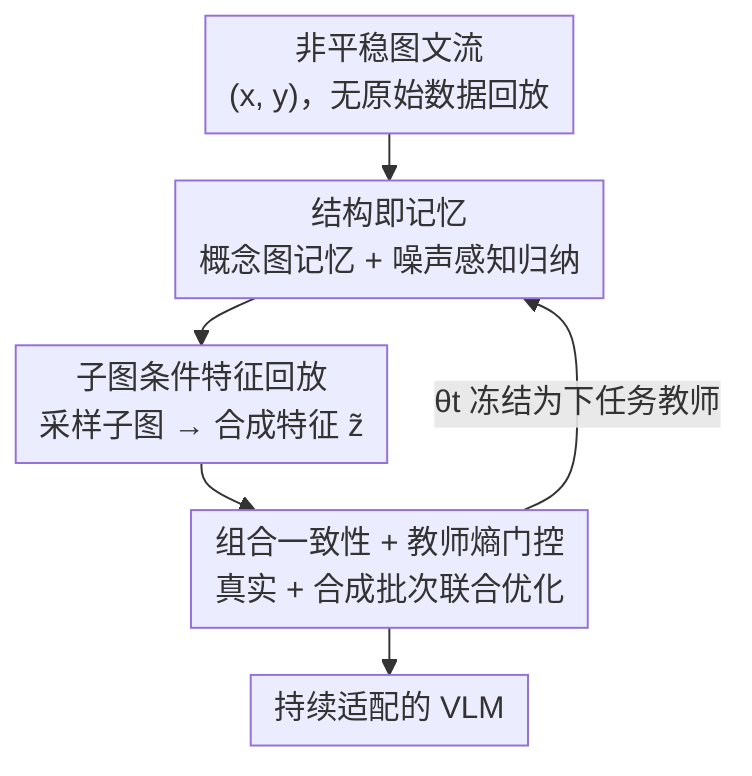

# CoMem: Compositional Concept-Graph Memory for Vision-Language Adaptation

**会议**: ICLR 2026  
**OpenReview**: [https://openreview.net/forum?id=xp7wDU9JBW](https://openreview.net/forum?id=xp7wDU9JBW)  
**代码**: 无  
**领域**: 多模态VLM / 持续学习  
**关键词**: 持续学习, 概念图记忆, 特征空间回放, 组合一致性, 灾难性遗忘

## 一句话总结
CoMem 把"组合结构"（概念 + 关系的图）当作持续学习的记忆与复述单元，不存原始图像、只在特征空间按子图条件合成回放样本，再用组合一致性约束和教师熵门控蒸馏抑制漂移，在跨域检索、结构化概念学习和持续 VQA 上同时拿到更高保持率与更低遗忘。

## 研究背景与动机
**领域现状**：CLIP 这类视觉-语言基座模型已是检索、VQA、grounded reasoning 的标配骨干，但真实部署要面对非平稳、不断换域的数据流，且常受隐私和内存预算约束、无法保存历史样本。直接在新任务上微调会发生灾难性遗忘，把过去任务和零样本迁移能力一起丢掉。

**现有痛点**：现有持续学习方案大致三条路，各有短板。① 几何/正则类（ZSCL、Mod-X、CTP）通过约束表征几何或参数漂移来保对齐，但很少建模"可复用的概念和有类型的关系"，组合迁移弱。② 无原始数据回放类（IncCLIP、ConStruct-VL、GIFT）用符号或像素级合成替代真实样本，可这些替身对关系的编码很弱，而且在"学习真正发生的特征空间"里几乎没有控制力，还容易继承教师模型的偏置。③ 参数高效微调类（adapter / prompt / MoE）省参数，但往往做成任务专用的调整，学到的结构难以复用。

**核心矛盾**：在非平稳多域流下，既要稳定（不忘旧）又要可塑（学新且能复用组合结构），而几何对齐只保了"对齐"却不促"泛化"，符号回放又管不到特征空间——缺一个把"语义化的复述信号"和"跨域可迁移性"统一起来的机制。

**本文目标**：在不存原始样本、内存和参数预算受限的前提下，维持稳定又可塑的组合能力，让概念和关系能跨域、跨任务被复用和重组。

**切入角度**：作者的关键观察是——既然要复用的是"组合"，那记忆和复述的单位就应该是组合结构本身，而不是一张张原始图像；而且复述要发生在"学习真正发生的地方"，即特征空间，而非像素或符号空间。

**核心 idea**：把持续 VLM 学习重述为"维护一张紧凑的概念-关系图"，再以图的子结构为条件、在特征空间里合成回放信号，配合组合一致性目标与教师/不确定性过滤来平衡可塑与稳定。

## 方法详解

### 整体框架
CoMem 处理一串多模态任务 $\{D_t\}_{t=1}^T$，每个任务给出图文对监督，但**不保存任何原始样本**：完成任务 $t-1$ 后的模型快照 $\theta_{t-1}$ 冻结成教师，新任务只能依赖一张固定预算 $B$ 的概念图记忆 $M_t$。单个任务 $t$ 的训练循环由三个阶段串成闭环——先从图文对里**归纳概念三元组**并更新图记忆（阶段一），再**采样子图、在特征空间合成回放样本**（阶段二），最后在真实批次和合成批次上**联合优化**并用多目标正则约束（阶段三），训练结束把更新后的图记忆写回，供下一个任务复用。

### 关键设计

**1. 结构即记忆：把概念图当作复述单元而非存原图**

针对"存原图违反隐私/内存预算、且单张图不是可复用单位"这个痛点，CoMem 不存实例，而是维护一张有类型的概念图 $G=(V,E)$：节点 $V=\mathcal{C}=\mathcal{A}\cup\mathcal{E}$ 是属性与实体词表，边 $E\subseteq V\times R\times V$ 是有类型关系。每个节点存一个原型 $\mu_c\in\mathbb{R}^d$、计数 $n_c$，以及一个至多 $B_c$ 个 token 特征的锚点蓄水池 $A_c$（**存的是 token 特征不是图像**）；每条边存交互嵌入 $\psi_e$ 和计数 $n_e$。

图怎么更新是关键：从每个 $(x,y)$ 抽取打分三元组 $\mathcal{T}(x,y)=\{(a,e,r,w)\}$，候选 $(a,e,r)$ 由轻量文本解析器（prompted IE）给出，再交给一个**冻结在教师 $\bar\theta$ 上的视觉验证器**打分以避免确认偏置。验证用共享低秩投影 $W=AB^\top$（$r\ll d$），对概念 $c$ 算对齐分 $s_\text{align}(c\mid Z)=\sigma(\frac1\tau\,\text{LSE}_{p}\langle WZ_p,t_c\rangle)$，其中 $t_c$ 是教师的文本嵌入。三元组置信度按校准温度几何平均三项对齐分 $w(a,e,r)=\big(s_a^{\alpha_a}s_e^{\alpha_e}s_r^{\alpha_r}\big)^{1/(\alpha_a+\alpha_e+\alpha_r)}$，只保留同时满足 $w\ge\gamma$ 且教师预测熵 $H\le\xi$ 的双阈值三元组，其余排队复检。原型用 token 级 EMA 更新，锚点用带时间衰减 $\lambda^{\Delta t}$ 的预算化 k-center 在线维护，并周期性按文本/原型相似度合并同义节点。这样图就成了一个可扩展、隐私友好、随时间稳健的复用单元。

**2. 子图条件的特征空间回放：在学习真正发生的地方复述**

针对"符号/像素替身对关系编码弱、又管不到特征空间"的痛点，CoMem 把回放放到特征空间，并以"似然高又多样"的子图为条件。子图采样目标 $q(S)\propto\Phi(V_S,E_S)\cdot\Delta(V_S)$ 由两项构成：合理性 $\Phi$ 用归一化点互信息 NPMI 加边计数对数 $\lambda_1\sum_c\text{NPMI}(c)+\lambda_2\sum_e\log(1+n_e)$ 鼓励采到真实共现的组合；多样性 $\Delta(V_S)=\sqrt{\det(K_{V_S})}$ 用 DPP 行列式（核按原型距离 $\exp(-\|\mu_i-\mu_j\|^2/\rho)$、质量 $q_i\propto\sqrt{n_{c_i}}$）避免老采同一簇。采样器分两步近似：先用 k-DPP 贪心 MAP 选节点，再用最小代价 Steiner 树（边代价 $1/(1+n_e)$）把节点连通，必要时 BFS 扩展，最后用一步 Metropolis–Hastings 接受/拒绝来纠偏贪心近似。

拿到连通子图 $S$ 后，图聚合器 $h_S=\text{GAT}_\psi(S)$ 把节点和关系的文本条件 token 聚成一个向量，喂给一个**教师引导的条件高斯生成器** $p_\vartheta(\tilde z\mid S)=\mathcal{N}(\mu_\vartheta(h_S),\text{diag}(\sigma_\vartheta^2))$ 合成回放特征。为了让样本编码"关系"而不仅是节点锚点的并集，生成器用关系感知 MMD 训练 $L_\text{gen}=\text{MMD}^2_{\kappa_\text{rel}}(\{\tilde z_k\},Z_S)$，其中锚点池 $Z_S$ 同时汇集节点锚点和边锚点 $\Xi_e$；再加支撑壳正则 $L_\text{sup hull}=\max\{0,\text{dist}(\tilde z,\text{conv}(Z_S))-\delta\}$ 把样本约束在锚点凸包附近。关键的一点是**不把回放损失 $L_\text{replay}$ 的梯度反传进生成器 $\vartheta$**，避免"教师在 off-manifold 样本上"的失配。

**3. 组合一致性与教师熵门控：抑制 off-manifold 漂移、强制部分-整体相容**

针对"几何对齐只保对齐不促组合泛化"的痛点，阶段三在联合损失里加了两类约束。其一是组合一致性 $L_\text{comp}=L_\text{poe}+L_\text{subgraph}$：对数概率 PoE 一致性要求子图边际概念分布在并集与"逐图乘积归一化"之间对齐（$\text{KL}(p_\theta(\cdot\mid S_\cup)\,\|\,\text{norm}(p_\theta(\cdot\mid S_1)\odot p_\theta(\cdot\mid S_2)))$），逼模型在"部分"与"整体"上预测自洽；关系满足度用带类型硬负样本的 InfoNCE $L_\text{subgraph}$，三线性打分 $s_\theta(a,r,e\mid S)$ 对每条 $(a\xrightarrow{r}e)$ 拉近正例、推开共享 $(a,r)$ 或 $(r,e)$ 但未在 $E_S$ 出现的负例（并用 NPMI 和教师一致性过滤掉不合理负例）。

其二是教师过滤的回放蒸馏 $L_\text{replay}=\mathbb{E}\,\omega_{S,\tilde z}\big[\text{KL}(\pi_{\bar\theta}\|\pi_\theta)+\beta\|g_{\bar\theta}-g_\theta\|^2\big]$，其中**熵门控** $\omega_{S,\tilde z}=\mathbb{I}[H(\pi_{\bar\theta}(\cdot\mid\tilde z))\le\xi]$ 只在教师对合成样本自信时才让其指导学生，从而压住不确定样本带来的漂移。总损失把任务监督、多模态 InfoNCE 对齐、回放蒸馏、组合一致性、生成 MMD 和支撑壳正则线性加权（式 12）；训练用两阶段调度——先暖启 $E_w$ 轮（$\lambda_\text{comp}=0$、$\lambda_\text{re}$ 很小）再开一致性并爬升回放权重，以稳住优化。

### 损失函数 / 训练策略
总目标 $L=L_\text{sup}+\lambda_\text{mm}L_\text{mm}+\lambda_\text{re}L_\text{replay}+\lambda_\text{comp}L_\text{comp}+\lambda_\text{gen}L_\text{gen}+\lambda_\text{hull}L_\text{sup hull}$。学生参数 $\theta=(\phi,\varphi,\omega)$ 与聚合器 $\psi$ 由 AdamW 在全损失上优化；生成器 $\vartheta$ 只由 $\nabla(\lambda_\text{gen}L_\text{gen}+\lambda_\text{hull}L_\text{sup hull})$ 更新（不接收回放梯度）。两阶段暖启调度先关一致性、小回放权重稳住表征，再逐步打开。

## 实验关键数据

### 主实验
在跨域检索（COCO / Flickr30K / IAPR TC-12 / RSICD / ECommerce）上，CoMem 在匹配内存与可训练参数预算下拿到最高平均 mR 和最低遗忘 AF：

| 数据集/指标 | 本文 CoMem | 之前最强 (GIFT/C-CLIP) | 提升 |
|--------|------|----------|------|
| Avg mR ↑ | 76.6 | 73.3 / 73.2 | +3.3 |
| AF ↓ | 1.9 | 2.5 / 2.7 | −0.6 (绝对) |
| COCO mR | 83.2 | 79.6 | +3.6 |
| Flickr30K mR | 86.5 | 82.3 | +4.2 |
| ECommerce mR | 68.9 | 65.8 | +3.1 |

在结构化概念（SVLC / ConStruct-VL）和持续 VQA（VQACL / CLOVE）上同样领先：

| 流/指标 | 本文 CoMem | 之前最强 | 提升 |
|--------|------|----------|------|
| SVLC Acc ↑ | 82.5 | 80.3 (ZAF) | +2.2 |
| SVLC AUROC ↑ | 88.8 | 87.1 | +1.7 |
| VQACL Acc ↑ | 55.8 | 54.1 (CL-MoE) | +1.7 |
| CLOVE Acc ↑ | 63.7 | 62.3 (CL-MoE) | +1.4 |

值得注意的是，CL-MoE 是基于 MLLM 的强基线，CoMem 靠特征级回放在更省参数和内存的前提下反超。

### 消融实验
单因素消融（检索 Avg mR / AF，SVLC Acc，VQACL Acc，3 个种子平均）：

| 配置 | Avg mR ↑ | AF ↓ | 说明 |
|------|---------|------|------|
| CoMem (full) | 76.6 | 1.9 | 完整模型 |
| w/o 关系感知 MMD（退化为 RBF） | 75.7 | 2.3 | 关系结构编码变弱 |
| w/o 边锚点 $\Xi_e$（只用节点锚点） | 75.9 | 2.4 | 结构化回放受损 |
| w/o 熵门控 | 75.3 | 2.8 | 漂移失控、遗忘飙升 |
| 生成器接收 $L_\text{replay}$ 梯度（关 stop-grad） | 75.8 | 2.6 | off-manifold 失配 |
| w/o 组合一致性 $L_\text{comp}$ | 74.9 | 2.9 | SVLC 也掉到 80.3 (−2.2) |
| 均匀采样（无 k-DPP/Steiner/MH） | 75.2 | 2.7 | 子图既不合理也不多样 |
| 仅去掉 MH 接受步 | 76.2 | 2.1 | 影响最小 (−0.4 mR) |
| 学生当验证器（不冻教师） | 75.6 | 2.5 | 确认偏置抬高遗忘 |

### 关键发现
- **稳定性机制对遗忘最敏感**：去掉熵门控把 AF 从 1.9 抬到 2.8，是单项里掉得最狠的，说明"只让教师在自信样本上指导学生"是抑制漂移的关键开关。
- **组合一致性贡献最大的精度增益**：去掉 $L_\text{comp}$ 让 Avg mR 掉到 74.9（−1.7）、SVLC 掉 2.2，PoE-only 或 relation-only 只能补回部分，二者互补。
- **结构化回放缺一不可**：关系感知 MMD 与边锚点各自被去掉都同时损精度与保持率，验证了"在特征空间复述关系而非节点并集"的价值。
- **超参不敏感**：锚点预算 $B$ 从 8K→64K 时 mR 75.8→76.7、AF 2.4→1.8 后即平台；子图规模 $K_\text{max}=6$ 是宽优区（≤3 覆盖不足、≥8 反抬 AF）。18 任务长序列上 Last@t 很快稳在约 76.6%、AF 到 $T=18$ 仅缓增到 2.2，且 BWT 最不负（−0.11）、FWT 最高（0.60）。

## 亮点与洞察
- **"结构即记忆"换了复述的粒度**：把记忆单位从"原始样本"换成"概念-关系子图"，既绕开隐私/内存约束，又天然支持跨任务的组合复用——这是把组合性从"评测目标"提升为"记忆与复述机制"的关键一步。
- **在特征空间回放，且只在学习发生的地方复述**：用关系感知 MMD + 支撑壳正则把合成特征钉在锚点凸包附近，比像素/符号替身更贴合 CLIP 实际优化的几何。
- **stop-grad + 熵门控这对"防漂移组合拳"很可迁移**：不让回放损失污染生成器、只采信教师自信的样本，这种"挡住 off-manifold 失配"的思路可迁到任意"教师-合成回放"持续学习框架。
- **k-DPP + Steiner + MH 的采样器值得借鉴**：用 NPMI 保合理、DPP 保多样、Steiner 保连通、MH 纠偏，是一套把"图上采可信子结构"工程化的范式。

## 局限与展望
- 方法链路偏重：概念归纳（解析 + 验证器）、图维护（原型/锚点/合并）、子图采样（k-DPP/Steiner/MH）、多目标损失叠加，工程复杂度和超参数量都不低，复现门槛较高（且未放出代码）。
- 概念三元组依赖文本解析器（prompted IE）的质量，若抽取噪声大或词表覆盖不足，图记忆的可靠性会受限；论文虽用教师验证器过滤，但解析器本身的系统性遗漏难被纠正。
- 实验主要在 CLIP 类双塔骨干上验证，对生成式 MLLM、更大规模或更长任务流（>18 任务）的扩展性仍是开放问题。
- 多处指标和公式以原文表述为准（如校准温度、各损失权重的具体取值），部分细节在正文未完全展开。

## 相关工作与启发
- **vs ZSCL / Mod-X / CTP（几何正则类）**：它们约束表征几何或参数漂移来保零样本对齐，但不建模可复用概念和有类型关系；CoMem 用有类型概念图 + 关系感知回放与一致性补上组合迁移，且与几何目标互补可叠加。
- **vs IncCLIP / ConStruct-VL / GIFT（无原始数据回放）**：它们用符号或扩散合成的图文替身回放，对关系编码弱、在特征空间无控制；CoMem 直接在特征空间按子图条件回放，做到结构化、on-manifold 的复述。
- **vs C-CLIP / TRIPLET / CL-MoE（参数高效适配）**：它们靠 adapter/prompt/MoE 省参数但易做成任务专用调整；CoMem 与 PEFT 正交，可在匹配参数/内存预算下与 LoRA/adapter 搭配使用。

## 评分
- 新颖性: ⭐⭐⭐⭐⭐ "结构即记忆 + 特征空间子图回放"是对持续 VLM 学习记忆粒度的重新定义，角度新颖。
- 实验充分度: ⭐⭐⭐⭐ 覆盖检索/SVLC/VQA 三类流 + 细致单因素消融 + 长序列与超参敏感性，较扎实但缺代码。
- 写作质量: ⭐⭐⭐⭐ 框架清晰、公式完整，但符号与子模块密集，阅读门槛偏高。
- 价值: ⭐⭐⭐⭐ 隐私友好、预算匹配下的稳定增益，对真实部署的持续学习有实用价值。

<!-- RELATED:START -->

## 相关论文

- [\[ICLR 2026\] Memory-Free Continual Learning with Null Space Adaptation for Zero-Shot Vision-Language Models](memory-free_continual_learning_with_null_space_adaptation_for_zero-shot_vision-l.md)
- [\[CVPR 2026\] CASPA: Graph-Structured Concept Anchors for Modality-Agnostic Adaptation in Vision-Language Models](../../CVPR2026/multimodal_vlm/caspa_graph-structured_concept_anchors_for_modality-agnostic_adaptation_in_visio.md)
- [\[ICLR 2026\] Unified Vision-Language Modeling via Concept Space Alignment](unified_vision-language_modeling_via_concept_space_alignment.md)
- [\[ICLR 2026\] Enhanced Continual Learning of Vision-Language Models with Model Fusion](enhanced_continual_learning_of_vision-language_models_with_model_fusion.md)
- [\[ICLR 2026\] KeepLoRA: Continual Learning with Residual Gradient Adaptation](keeplora_continual_learning_with_residual_gradient_adaptation.md)

<!-- RELATED:END -->
