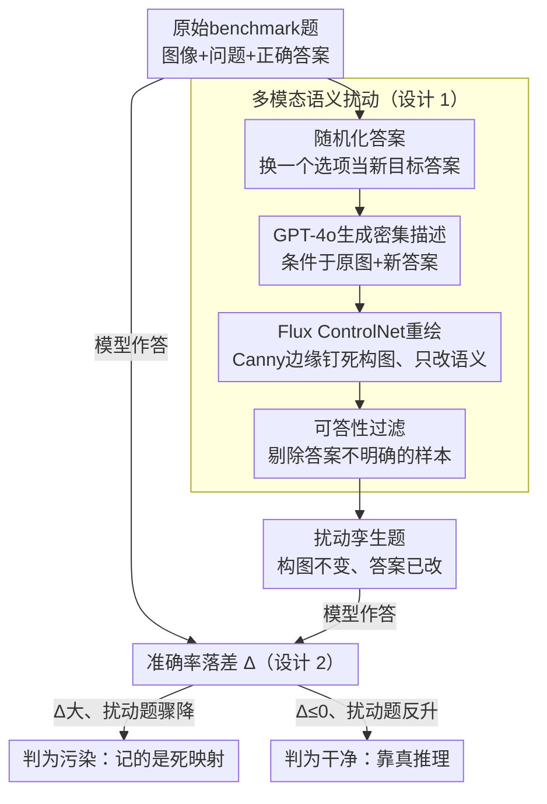

# Contamination Detection for VLMs using Multi-Modal Semantic Perturbation

**会议**: ICLR2026  
**arXiv**: [2511.03774](https://arxiv.org/abs/2511.03774)  
**代码**: [https://github.com/jadenpark0/mm-perturb](https://github.com/jadenpark0/mm-perturb)  
**领域**: 多模态VLM  
**关键词**: data contamination, VLM, benchmark leakage, semantic perturbation, ControlNet

## 一句话总结

提出多模态语义扰动框架检测VLM数据污染：用LLM生成密集描述 + Flux ControlNet在保持图像构图的同时改变答案相关语义元素，污染模型因记忆原始图文对而在扰动版本上表现骤降，干净模型则因真正推理能力而不受影响。首次系统验证现有LLM污染检测方法在VLM场景下大多不可靠。

## 研究背景与动机

**领域现状**：VLM（如LLaVA、Qwen2-VL）在MMStar、RealWorldQA等benchmark上表现优异，但训练数据往往是互联网规模的专有语料。这引发了一个关键担忧：测试集泄露导致的性能膨胀——模型可能并未真正理解视觉推理，而是记住了测试题。

**现有痛点**：
1. **LLM检测方法应用于VLM时不可靠**：文本扰动（如选项打乱、n-gram检测）无法改变视觉特征，VLM可凭图像记忆直接答题
2. **缺乏系统研究**：不同污染策略（标准微调 vs LoRA、不同epoch数）下检测方法的有效性从未被全面评估
3. **没有方法同时满足三大要求**：实用性（无需clean模型作参照）、可靠性（跨训练策略一致检测）、一致性（检测信号与污染程度正相关）

**核心矛盾**：VLM是多模态的——仅扰动文本不够（模型看图记忆），仅扰动选项不够（模型认选项位置）——必须同时扰动图像和文本的语义才能打破记忆。

**本文方案**：生成语义扰动的图像-问题对——保持构图但改变答案相关语义元素。污染模型因记忆原始图文对而失败，干净模型因推理能力而成功。通过比较模型在原始 vs 扰动benchmark上的性能差异来检测污染。

## 方法详解

### 整体框架

整个方法是一条"造扰动题—测掉分"的检测流水线：先把 benchmark 里每道题改造成一个语义被替换、但视觉构图几乎不变的"孪生版本"，再看模型在原题和孪生题上的准确率落差。落差大说明模型记住的是"这张图配这个答案"的死映射而非真正在推理，即被判为污染；干净模型靠的是真推理，换张构图相同的图照样能答对，落差接近零甚至不降反升。改造一道题分四步走：随机化答案（把正确选项换成另一个选项作为新的目标答案）→ 用 GPT-4o 结合原图与新答案生成一段密集描述 → 用 Flux ControlNet 以原图的 Canny 边缘为条件、按描述重绘出新图 → 过滤掉答案不再明确的样本。改造好的孪生题与原题分别喂给待测模型，比较两边准确率的落差 $\Delta$ 就得到污染信号。

### 关键设计

**1. 多模态语义扰动：只扰文本扰不动 VLM 的视觉记忆**

检测污染的难点在于 VLM 是多模态的——纯文本扰动（打乱选项顺序的 Choice Confusion、循环选项位置的 CircularEval）改变不了图像特征，污染模型完全可以无视题面、凭对图像的记忆直接吐出背下来的答案，论文实验里这些文本方法在多数污染设置下确实失效。所以扰动必须打到图像的语义上，但又不能乱改。这正是框架图里 PERTURB 子图四步流水线在做的事：先随机化答案、把正确选项换成另一个选项当新目标，再用原图的 Canny 边缘图喂给 ControlNet 把全局构图、物体轮廓、空间布局都钉死，只允许改与答案直接相关的那个语义元素（例如把限速牌上的"25"重绘成"35"）。这样改出来的新图答案确实变了，污染模型却因为认的是旧图旧答案而答错；同时改造要求"扰动版难度不高于原题"，保证干净模型不会因为题变难而无辜掉分，掉分只能归因于记忆。这里 GPT-4o 生成描述时同时输入原图和新答案，是为了让描述精准锁定"需要被改写的那个视觉元素"，而不是泛泛重述整张图；最后一步可答性过滤只用一条标准——扰动题必须答案唯一明确（不看生成画质），把重绘翻车、答案含混的样本剔掉，保证落差反映的是推理而非图像保真度。

**2. 三大检测要求的形式化：给"什么叫好的污染检测"立标准**

论文把污染程度形式化为 $\text{deg}_\mathcal{D}(x) = (\sum_{d \in \mathcal{D}} \mathbf{1}_{\{x=d\}}) \times n$，即样本 $x$ 在污染数据集 $\mathcal{D}$ 中出现的次数再乘以训练轮数 $n$，用它来刻画"被记得有多牢"。在此之上提出检测方法应同时满足三条：**实用性**——检测时不依赖额外的 clean 模型或原始训练语料，光靠待测模型自己就能跑；**可靠性**——无论污染是用标准全参微调还是 LoRA 注入的，检测结论都要一致；**一致性**——检测信号（框架图里那个原题与扰动题的准确率落差 $\Delta$）应当随污染程度单调增强。这三条既是评判现有方法的尺子、也是本文检测信号 $\Delta$ 的设计目标。下表把本文方法与现有方法对这三条的满足情况摆在一起，凸显出现有方法要么得借 clean 模型、要么换个训练策略就翻车：

| 要求 | 定义 | 本文方法 | 现有方法 |
|:---|:---|:---:|:---:|
| 实用性 | 无需clean模型/训练语料 | ✓ | 多数✗ |
| 可靠性 | 跨训练策略（标准FT/LoRA）一致 | ✓ | 多数✗ |
| 一致性 | 检测信号∝污染程度 | ✓ | 部分▲ |

**3. 框架无关性：方法不绑死在某一套生成工具上**

设计 1 流水线里的三个生成组件都被验证为可替换：负责重绘的扩散模型不必是 Flux + ControlNet，换其他扩散模型同样能保构图改语义；负责写密集描述的 LLM 不必是 GPT-4o；负责筛样本的过滤环节也不必靠人工，用一个强推理模型做自动过滤即可替代。这条性质的意义在于，检测能力来自"保构图、改语义、比落差"这套设计本身，而非某个特定模型的特异表现，因此方法可以随生成模型的进步而升级，不会被工具淘汰所绑架。

## 实验结果

### 主实验：MMStar数据集检测对比

| 检测方法 | 需要clean模型? | LLaVA LoRA 1ep | LLaVA LoRA 3ep | Qwen LLM 1ep | Qwen LLM 3ep |
|:---|:---:|:---:|:---:|:---:|:---:|
| **本文方法** (Δ) | 否 ✓ | -8.29 ✓ | -16.16 ✓ | -29.50 ✓ | -43.03 ✓ |
| CircularEval (Δ) | 是 ✗ | -23.44 ✓ | +1.22 ✗ | -15.96 ✓ | -28.69 ✓ |
| Choice Confusion (Δ) | 否 ✓ | +1.01 ✗ | +14.75 ✗ | +21.01 ✗ | +12.12 ✗ |
| Multi-modal Leakage (Δ) | 是 ✗ | +10.31 ✓ | +11.12 ✓ | +0.41 ✓ | -10.70 ✗ |

**核心发现**：
- 本文方法在**所有**12种设置（2模型×3训练策略×2 epoch范围）下均成功检测，是唯一满足全部三个要求的方法
- 干净模型在扰动数据上表现**更好**（LLaVA: +31.51, Qwen: +16.16），确认扰动问题难度不高于原题
- Choice Confusion在10/12个设置中完全失败——VLM确实可以凭视觉记忆绕过文本扰动

### 消融：检测信号与污染程度的关系

| 模型 | Epoch 1 Δ | Epoch 2 Δ | Epoch 3 Δ |
|:---|:---:|:---:|:---:|
| LLaVA LoRA | -8.29 | -13.13 | -16.16 |
| LLaVA LLM+MLP | -8.49 | -11.52 | -13.74 |
| Qwen LoRA | -7.07 | -28.89 | -32.32 |
| Qwen LLM only | -29.50 | -43.03 | -43.03 |

性能下降幅度随epoch数单调增大（或饱和），完美满足一致性要求——污染越重，检测信号越强。

### 过滤子集的代表性验证

| 数据集 | 完整集 | 过滤子集 | 差异 |
|:---|:---:|:---:|:---:|
| RealWorldQA (LLaVA) | 49.01% | 52.05% | +3.04% |
| RealWorldQA (Qwen) | 70.33% | 70.45% | +0.12% |
| MMStar (LLaVA) | 32.87% | 37.78% | +4.91% |
| MMStar (Qwen) | 62.02% | - | - |

过滤后子集上的模型表现与完整集高度一致，说明过滤未引入系统偏差。

## 论文评价

### 优点

1. **问题定义清晰**：三大检测要求（实用性/可靠性/一致性）的形式化为该领域提供了统一的评估框架
2. **方法直觉优美**：利用ControlNet保持构图但改变语义→直接打击"记忆"这一污染核心机制
3. **实验极其详尽**：覆盖2个模型×3种训练策略×3个epoch×4种检测方法的完整交叉实验，说服力强

### 不足

1. 依赖生成模型的质量——当前扩散模型在文字渲染、复杂几何等方面仍有限制，导致大量样本被过滤（RealWorldQA剩余57%，MMStar剩余32%）
2. 人工过滤成本高，虽然展示了自动过滤的可行性，但自动过滤本身引入了额外的强推理模型依赖
3. 仅验证了fine-tuning阶段的污染，预训练阶段的泄露检测因计算成本未涉及

### 评分

⭐⭐⭐⭐

**推荐理由**：首次为VLM污染检测提供了可靠、实用、一致的解决方案。核心洞察——必须扰动图像语义而非仅扰动文本——简单但深刻。实验设计的系统性和全面性是该领域同类工作中最好的，为后续VLM评估可信度研究奠定了基础。

<!-- RELATED:START -->

## 相关论文

- [\[ICLR 2026\] Multi-modal Data Spectrum: Multi-modal Datasets are Multi-dimensional](multi-modal_data_spectrum_multi-modal_datasets_are_multi-dimensional.md)
- [\[CVPR 2025\] ASAP: Advancing Semantic Alignment for Multi-Modal Manipulation Detection](../../CVPR2025/multimodal_vlm/asap_advancing_semantic_alignment_promotes_multi-modal_manipulation_detecting_an.md)
- [\[CVPR 2025\] Rethinking VLMs for Image Forgery Detection and Localization](../../CVPR2025/multimodal_vlm/rethinking_vlms_for_image_forgery_detection_and_localization.md)
- [\[AAAI 2026\] Multi-Agent VLMs Guided Self-Training with PNU Loss for Low-Resource Offensive Content Detection](../../AAAI2026/multimodal_vlm/multi-agent_vlms_guided_self-training_with_pnu_loss_for_low-resource_offensive_c.md)
- [\[AAAI 2026\] Cross-modal Proxy Evolving for OOD Detection with Vision-Language Models](../../AAAI2026/multimodal_vlm/cross-modal_proxy_evolving_for_ood_detection_with_vision-lan.md)

<!-- RELATED:END -->
