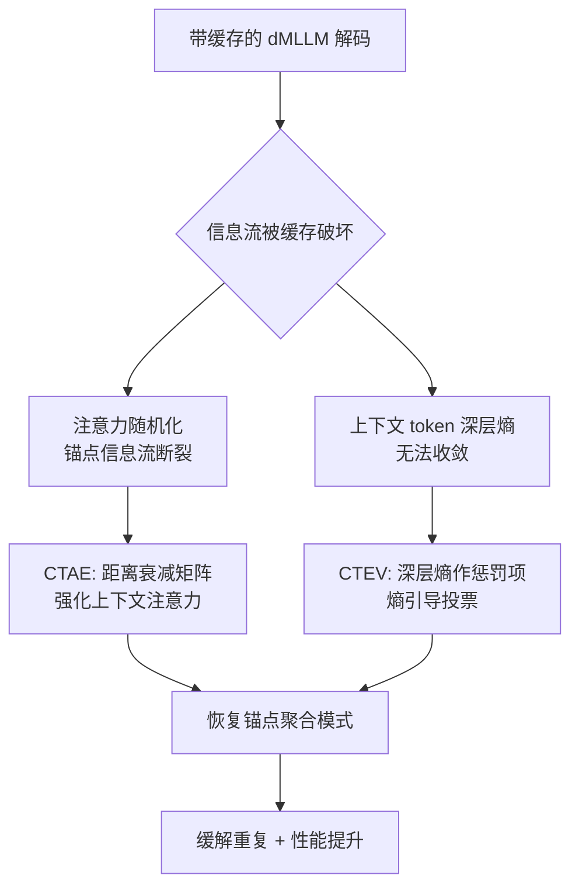

# Context Tokens are Anchors: Understanding the Repeat Curse in dMLLMs from an Information Flow Perspective

**会议**: ICLR 2026  
**OpenReview**: [https://openreview.net/forum?id=mOz9jVYxsD](https://openreview.net/forum?id=mOz9jVYxsD)  
**代码**: [https://github.com/ErikZ719/CoTA](https://github.com/ErikZ719/CoTA)  
**领域**: 多模态大模型 / 扩散语言模型 / 可解释性  
**关键词**: dMLLM, 重复诅咒, 缓存加速, 信息流, 注意力锚点, 信息熵, 免训练  

## 一句话总结
本文发现扩散式多模态大模型（dMLLM）在使用缓存加速时会出现严重的文本重复（Repeat Curse），从信息流视角揭示其根因是"上下文锚点 token"的信息流被破坏、深层信息熵无法收敛，并据此提出免训练的 CoTA（增强上下文注意力 + 熵引导投票）来根治重复。

## 研究背景与动机
**领域现状**：扩散式语言模型（dLLM）以并行去噪取代自回归的逐 token 预测，配上视觉编码器后演化成 dMLLM（如 LLaDA-V、MMaDA），成为自回归 MLLM 的有力替代。但 dMLLM 采用双向注意力 + 多步去噪，推理延迟极高，因此普遍依赖缓存技术（dLLM-Cache、SlowFast、Fast-dLLM 等）复用相邻去噪步之间高度相似的 token 状态来加速。

**现有痛点**：作者实验发现，这些缓存方法带来一个严重副作用——生成文本出现大量冗余重复（"the the"、"of of the the"），作者称之为 **Repeat Curse（重复诅咒）**。统计显示该现象在多种 dMLLM + 多种缓存组合下普遍存在，显著损害输出的性能与可读性。

**核心矛盾**：缓存是加速的刚需，但又会触发重复，且 dMLLM 的黑盒特性让人难以解释重复从何而来——加速与质量在缓存机制下不可兼得。

**本文目标**：从信息流（information flow）这一可解释视角拆解 dMLLM 内部机制，定位重复诅咒的根因，并设计一个能与任意 dMLLM / 缓存策略即插即用、无需训练的缓解方法。

**核心 idea（Context Tokens are Anchors）**：作者通过可视化注意力发现，**邻近的上下文 token 充当"锚点"逐层聚合语义信息并吸收不成比例的注意力，引导最终预测**；正常解码下这些锚点的跨层信息熵会在深层收敛（确定性升高），而缓存会打乱注意力分布、使锚点熵在深层无法收敛，从而诱发重复。CoTA 正是顺着这两条线索做修复。

## 方法详解

### 整体框架
CoTA 是建立在三条信息流发现之上的免训练方法，由两个互补组件构成：**CTAE** 从"注意力分布"侧修复——用距离衰减矩阵强化上下文 token 的注意力，恢复"锚点聚合"的原生信息流模式；**CTEV** 从"解码投票"侧修复——把上下文 token 在深层累积的信息熵作为惩罚项加进置信度打分，阻止模型在高不确定性 token 上落子。两者都即插即用，可叠加在任意 dMLLM 与缓存策略之上，仅带来很小的额外开销。

### 关键设计

**1. 信息流三发现：从现象到根因的诊断链。** 这是方法的立论基础。作者对每个输出 token 可视化其注意力矩阵，得到三条递进的结论：**发现一**——在 dMLLM 中，query 旁的邻近上下文 token 像自回归模型里的"attention sink"一样充当锚点，跨层稳定地吸收高注意力并聚合语义、引导最终预测；**发现二**——正常解码下这些锚点的跨层信息熵随深度逐渐收敛（在第 26–30 层附近急剧下降），说明信息聚合让模型预测越来越确定；**发现三**——一旦施加缓存，注意力分布变得高度随机、锚点的原生信息流被打断，且参与重复的上下文 token 在深层持续保持反常高熵、无法收敛。配套的消融还把矛头精确指向"输出 token 的缓存"：固定相似度阈值时，只缓存 prompt token（Prefix KV）几乎不引发重复（SRR=0），而拉大输出 token 的重算间隔会让 SRR 飙到 89.7。

**2. CTAE（上下文注意力增强）：用距离衰减矩阵把注意力"拉回"锚点。** 既然缓存把注意力打散了，CTAE 就显式地把注意力重新偏置到邻近 token 上，复原局部语义连贯。它对每个 query–key 对 $(i,j)$ 计算一个高斯距离衰减项：

$$g_{i,j} = \exp\!\left(-\left(\tfrac{|i-j|}{\tau}\right)^{2}\right), \qquad G_{i,j} = \gamma_{\min} + (1-\gamma_{\min})\,g_{i,j}, \quad \gamma_{\min}\in(0,1].$$

其中 $\tau$ 为温度（实验固定为 5），距离越近的 token 衰减值越接近 1、注意力越被保留；$\gamma_{\min}$ 是下界常数，防止远距离 token 被衰减到 0 造成不稳定。最终把原注意力逐元素乘上衰减矩阵 $\text{Attn}_{i,j}\!\ast\! G_{i,j}$，从而把"上下文 token 作锚点"的信息流模式重新刻回注意力图里。可视化（图 9）显示，缓存后的随机注意力经 CTAE 后重新聚拢到上下文 token 上。

**3. CTEV（熵引导投票）：把深层熵当惩罚项，拦住不确定 token 的解码。** 基线 dMLLM 只用置信度 $c(i)=p_\theta(S^0_{(i)}=\hat S^t_{(i)}\mid S^t)$ 来给候选 token 投票，完全忽略了"锚点深层熵不收敛=高不确定"这一信号。CTEV 先对每个候选 token 算归一化熵，并在深层（第 26–30 层）逐层累积：

$$E_{\text{sum}} = \sum_{l=26}^{30} E^{(l)}, \qquad E^{(l)} = -\frac{\sum_{v=1}^{V} p_v^{(l)}\log p_v^{(l)}}{\log V}.$$

再把候选 token 自身与其最近的两个邻居（即上下文集合 $C(i)$）的深层累积熵汇总成 $E^{\text{ctx}}_{\text{sum}}(i)=\sum_{j\in C(i)}E_{\text{sum}}(j)$，最后以系数 $\alpha$ 作为惩罚加进原置信度，得到新的投票分数：

$$\text{Score}(i) = c(i) + \alpha\,E^{\text{ctx}}_{\text{sum}}(i).$$

由于熵越高惩罚越大，那些"看似置信但其上下文锚点深层熵居高不下"的 token 会被压低排名、不被选中解码，从源头上避免了由不确定锚点驱动的重复输出。

## 实验关键数据

### 主实验表格
重复诅咒缓解（COCO VQA，500 张图；512/64 为最大生成长度，ARR/SRR 越低越好）：

| 方法 | ARR↓(512) | SRR↓(512) | ARR↓(64) | SRR↓(64) |
|---|---|---|---|---|
| LLaDA-V | 0.2 | 6.9 | 0.1 | 3.3 |
| + dLLM-Cache | 14.3 | 82.3 | 7.1 | 65.6 |
| + dLLM-Cache + CTAE | 3.2 | 10.6 | 2.5 | 5.6 |
| + dLLM-Cache + CTEV | 2.9 | 8.0 | 1.8 | 4.6 |
| **+ dLLM-Cache + CoTA** | **1.2** | **6.3** | **1.0** | **3.0** |

长文本设定下 CoTA 把缓存引入的 ARR/SRR 分别降低 **96% / 92%**，短文本下降低 **85% / 95%**，几乎回到无缓存基线水平。

### 消融实验表格
缓存机制成分定位重复根因（SRR↓）：

| 成分 | 设置 → SRR |
|---|---|
| Prompt 重算间隔 | 1/5/15/25 → 全为 0 |
| Output 重算间隔 | 1→0, 3→79.9, 7→89.7 |
| 相似度阈值 | 0→89.7, 0.25→75.0, 0.75→29.7 |
| 复用策略 | Prefix→0, dLLM-Cache→75.0 |

结论：**重复几乎完全由"输出 token 的缓存"驱动**，缓存 prompt token 无影响。

超参消融（MathVerse，上下文 token=3 时最佳）：$\alpha=0.75$、$\gamma_{\min}=0.5$ 取得 ARR=1.2%、ACC=23.1 的最优组合。

### 关键发现
- **泛化与效率**（表 5）：在 LLaVAw / MathVista 上，CoTA 把带缓存基线的 Score 提升 11% / 9%、ARR 降低 80% / 81%，同时仅让 TPS 下降 2.8、FLOPs 上升 1.9，开销可接受。
- **跨模型 / 跨缓存**：在 MMaDA 上 ARR/SRR 改善 86%/45%，在 SlowFast 缓存上同样持续有效。
- **反向验证根因**：Prefix-KV、D3ToM、Fast-dLLM 这些"几乎不缓存输出 token"的方法本就不引发重复诅咒，反向印证了"输出 token 缓存=重复源头"的诊断。

## 亮点与洞察
- **现象命名 + 机制解释一气呵成**：不仅首次识别并命名了 dMLLM 的"重复诅咒"，还用信息流给出了可验证的因果链（输出缓存→注意力随机化→锚点深层熵不收敛→重复），而非停留在止痛式的解码 trick。
- **"Context Tokens are Anchors"是一个干净的统一视角**：把自回归里的 attention sink 概念迁移到双向注意力的 dMLLM，两个组件（CTAE 修注意力、CTEV 修投票）正好对应"锚点信息流被破坏"的两个侧面，方法与诊断高度自洽。
- **免训练 + 即插即用**：可叠加在任意 dMLLM 与缓存策略上，工程落地成本极低，且保留了缓存带来的加速收益。

## 局限与展望
- **深层定义略显手工**：把第 26–30 层固定为"深层"、上下文取最近 2 个 token，这些都是基于特定模型（LLaDA-V/MMaDA）的经验设定，跨架构是否需要重新标定层范围尚不清楚。
- **超参依赖**：$\alpha$、$\gamma_{\min}$、$\tau$、上下文 token 数都需调，论文给了最优点但未讨论自适应选取。
- **效率有代价**：CTEV 需要读取深层 logits 计算熵，TPS 略降、FLOPs 略升，在极致加速场景下与缓存收益存在权衡。
- **范围局限于"caption 类长文本"**：重复诅咒在长响应、VQA 描述任务上最明显，对短问答、结构化输出等场景的普适性还需更多验证。

## 相关工作与启发
- **dMLLM 与缓存**：dLLM-Cache、SlowFast、Fast-dLLM、Prefix-KV 把缓存范式迁移到双向注意力的扩散模型；本文揭示了它们共同的隐患。
- **信息流可解释性**：saliency、attention map、Grad-CAM、信息熵、massive values 等是探测黑盒内部机制的常用手段；本文是首个用信息流系统解释 dMLLM 重复成因的工作。
- **token 重复研究**：早期靠 n-gram 惩罚、对比解码、训练优化缓解重复，DUC / model editing 从特征与神经元解释自回归 LLM 的重复；本文把"解释 + 缓解"延伸到 dMLLM。
- **启发**：把"哪类 token 被缓存"与"内部信息流是否被破坏"挂钩的诊断范式，可推广到其他加速技术（剪枝、量化）的副作用分析；"用深层熵收敛性作为生成质量信号"也可迁移到幻觉、退化等异常生成行为的检测与抑制。

## 评分
- **新颖性**: ⭐⭐⭐⭐ — 首次识别并命名 dMLLM 的"重复诅咒"，从信息流视角给出可验证的因果机制，视角干净且方法与诊断自洽。
- **实验充分度**: ⭐⭐⭐⭐ — 跨 2 个 dMLLM、多种缓存、多个多模态基准验证，消融精确定位了输出 token 缓存这一根因，并有反向验证；但任务集中在 caption/VQA 长文本。
- **写作质量**: ⭐⭐⭐⭐ — "现象→可视化→三发现→两组件"的叙事清晰，图表（注意力图、熵曲线）有力支撑论点。
- **价值**: ⭐⭐⭐⭐ — 解决了 dMLLM 加速落地中的真实痛点，免训练即插即用、开销可控，工程价值与机制洞察兼具。

<!-- RELATED:START -->

## 相关论文

- [\[CVPR 2026\] Aligning What Vision-Language Models See and Perceive with Adaptive Information Flow](../../CVPR2026/multimodal_vlm/aif_adaptive_information_flow_vlm.md)
- [\[ICLR 2026\] AttTok: Marrying Attribute Tokens with Generative Pre-trained Vision-Language Models towards Medical Image Understanding](atttok_marrying_attribute_tokens_with_generative_pre-trained_vision-language_mod.md)
- [\[CVPR 2026\] PosterIQ: A Design Perspective Benchmark for Poster Understanding and Generation](../../CVPR2026/multimodal_vlm/posteriq_a_design_perspective_benchmark_for_poster_understanding_and_generation.md)
- [\[CVPR 2025\] Cross-modal Information Flow in Multimodal Large Language Models](../../CVPR2025/multimodal_vlm/cross-modal_information_flow_in_multimodal_large_language_models.md)
- [\[CVPR 2026\] P-Flow: Prompting Visual Effects Generation](../../CVPR2026/multimodal_vlm/p-flow_prompting_visual_effects_generation.md)

<!-- RELATED:END -->
